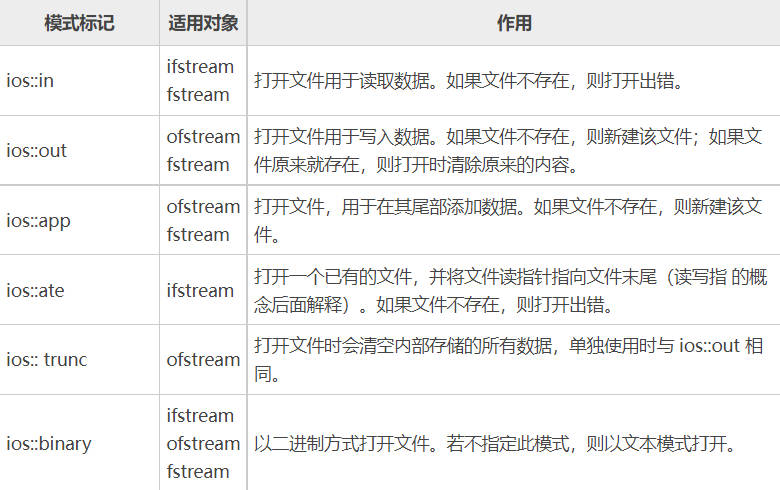

# 文件操作

## 1.文件操作简介
C++中对文件的操作需要包含头文件<fstream\>

文件类型：
- 文本文件
- 二进制文件

操作文件的三大类：
- ofstream：写操作
- ifstream：读操作
- fstream：读写操作

## 2.写入文件
**步骤：**
1. 包含头文件

`#include<fstream>`

2. 创建流对象

`ofstream ofs;`

3. 打开文件

`ofs.open("文件路径"，打开方式);`

*2、3可以合为一步：*

`ofsstream ofs("text.txt", ios::out);`

4. 写入数据

`ofs << "写入的数据";`

5. 关闭文件

`ofs.close();`

```C++
#include<fstream>
using namespace std;
int main(){
    ofstream ofs;
    ofs.open("test.txt",ios::out);
    ofs << "HelloWorld！！！" << endl;
    ofs.close();

    return 0;
}
```

**文件打开模式：**



- 文件打开方式可以配合使用，利用‘|’操作符
  
`ios::binary | ios::out` 利用二进制方式写入文件

## 3.读取文件
**步骤:**
1. 包含头文件

`include<fstream>`

2. 创建流对象

`ifstream ifs;`

3. 打开文件，并判断是否打开成功

`ifs.open("test.txt",ios::in);`
```C++
if(! ifs.is_open()){
    cout << "文件打开失败" << endl;
    return;
}
```

4. 读取数据

    1. 方式一：
        ```C++
        char buf[1024] = {0};
        while(ifs >> buf){
            cout << buf << endl;
        }
        ```
    2. 方式二：

            getline函数，一行一行读取数据
            第一个参数是将这行数据存储在哪里
            第二个参数是最多读取多少字符
        ```C++
        char buf[1024] = {0};
        while(ifs.getline(buf,sizeof(buf))){ 
            cout << buf << endl;
        }
        ```

    3. 方式三：

            全局getline函数
            第一个参数是读取数据时使用到的流，也就是ifs对象
            第二个参数是将数据读取到哪里
        ```C++
        string buf;
        while(getline(ifs,buf)){
            cout << buf << endl;
        }
        ```
    
    4. 方式4：

            get函数
            一个字符一个字符读取
            EOF:end of file
        ```C++
        char c;
        while( (c = ifs.get() ) != EOF){ 
            cout << c;
        }
        ```
    - 可以将读取到的数据再放回去

        ```C++
        char ch;
        ifs >> ch;
        ifs.putback(ch);
        ```
5. 关闭文件

`ifs.close();`

## 4.写入二进制文件
**步骤：**
1. 包含头文件

2. 创建输出流对象并打开文件

    `ofstream ofs("test.txt",ios::out | ios::binary);`

4. 写文件
   - 参数1：写入的数据是什么，const char* 类型
   - 参数2：写入的数据有多大
   二进制文件可以写入自定义数据类型
   案例中写入的是一个Person类 
    `Person p("张三"，18);`
    `ofs.write((const char*)&p,sizeof(Person));`

5. 关闭文件

    `ofs.close();`

## 5.读取二进制文件
**步骤：**
1. 包含头文件

2. 创建流对象

    `ifstream ifs;`

3. 打开文件，判断文件是否打开成功

    ```C++
    ifs.open("test.txt", ios::in | ios::binary);
    if(! ifs.is_open()){
        cout << "文件打开失败" << endl;
        return;
    }
    ```

4. 读文件
    read()函数参数:
    - 参数1：文件要写入到哪里
    - 参数2：要写入的容器有多大

    ```C++
    Person p;
    ifs.read((char*)&p, sizeof(Person));
    cout << p.Name << p.Age << endl;
    ```
    
