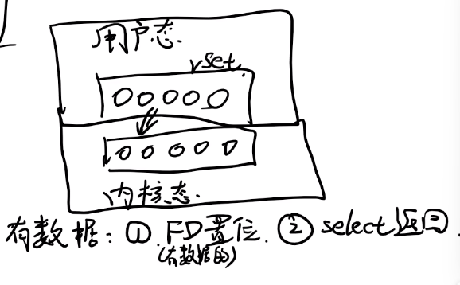
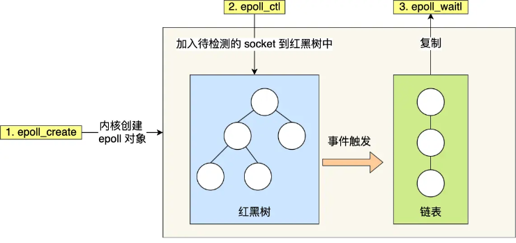

# 1. C++ Sockets简介

## 1.1 名词解释

- Winsock：Sockets最初是为Unix系统开发的，之后Windos系统对其做了实现，称为Winsock

- WSA：Windows Sockets API

- ws2_32.dll：(C:\WINDOWS\System32)，Winsock的核心组件，实现软件到硬件的底层交互功能

  是一个动态链接库文件（dll——dynamic link library），里面包含了编译好的代码，可以被不同的应用直接拿来复用

## 1. 2 端口号

- 开发网络程序时，服务器端的端口号一般是在代码中指定，而客户端的端口号由操作系统分配
- 端口号有16位，可以是1~65535的任何整数
- 1~1023是熟知端口号，被保留用作特定的应用
- 推荐使用大于1024的端口号，以确保想要的端口号没有被占用

## 1.3 Sockets

**定义：**

A pipe between two computers on a network through which data flows —— by Mulholland 2004

**特点：**

- Sockets是双向的，在一个socket中既可以发送数据也可以接收数据
- socket有两种常见的形式：tcp和udp
- 基本上Winsock中的所有函数都运行在socket上

# 2. TCP - Server

## 2.1 创建过程概述

### 2.1.1 Status of a Server

1. Unbound：刚创建一个新的Server，但是还没有绑定IP和端口号

2. Bound：给服务器端绑定一个合法的ip地址和端口号

3. Listening：在指定端口监听连接请求

4. Connected：当发现连接请求时，服务器端会建立（复制）一个新的socket来与客户端建立连接，而原来的socket会继续监听来自其他客户端的请求

   复制出来的socketip和端口号都和原来相同

   

### 2.1.2 Server Functions

1. Initialize WSA 初始化：`WSAStartup()`
2. Create a socket 创建：`socket()`
3. Bind the socket 绑定IP和端口: `bind()`
4. Listen on the socket 监听: `listen()`
5. Accept a connection 建立连接: `accept()`, `connect()`
6. Send and receive data 发送和接收数据: `recv()`, `send()`, `recvfrom()`, `sendto()`
7. Disconnect 断开连接: `closesocket()`

## 2.2 Step0 - 配置环境

### Windows

**配置VS依赖**

打开Visual Studio

项目 - 最下面一项 <项目名>属性 - 链接器 - 输入 - 附加依赖项 - 编辑

输入`ws2_32.lib`之后保存

**引入头文件**

```c++
#include<winsock2>
#include<ws2tcpip.h>
```

### Linux

```C++
#include<sys/types.h>
#include<sys/socket.h>
#include<unistd.h>
#include <netdb.h>
#include <arpa/inet.h>
#include<errno.h>
#include<netinet/in.h>
```

## 2.3 Step1 - Load DLL

### Windows

**函数原型**

`int WSAStartup(WORD wVersionRequested, LPWSADATA lpWSAData);`

- 参数一：要使用的协议的版本
- 参数二：一个LPWSADATA类型的指针，用于存放WSAStartup返回的东西
- 返回值：初始化成功返回0，失败返回错误代码

**WSAData**

The WSADATA structure contains information about the Windows Sockets implementation

```C++
typedef struct WSAData{
    WORD wVersion;
    WORD wHighVersion;
    char szDesciption[WSADESCRIPTION_LEN+1];
    char szSystemStatus[WSASYS_STATUS_LEN+1];
    unsigned short iMaxSockets;
    unsigned short iMaxUdpDg;
    char FAR* IpVendorInfo;
}
```

这个结构体中的属性并不用我们指定，只需要传入一个WSAData类型指针，WSAStartup会将初始化好的结构存放到这个指针中

**使用实例**

```C++
WSADATA wsaData;
int wsaerr;
WORD wVersionRequested = MAKEWORD(2, 2); // 版本2.2
wsaerr = WSAStartup(wVersionRequested, &wsaData);
if(wsaerr != 0){ // 返回非0说明初始化失败
    cout << "The Winsock dll not found!" << endl;
    return 0;
}
else{ // 初始化成功
    cout << "The Winsock dll found!" << endl;
    cout << "The status:" << wsaData.szSystemStatus << endl; // 打印当前状态
}
```

### Linux

Linux中无需加载DLL文件

## 2.4 Step2 - Create Socket

### Windows

创建一个Socket，指定Socket属性，比如使用的协议等

**函数原型**

```c++
SOCKET WSAAPI socket(int af,
                    int type,
                    int protocol);
```

- af：The address family specification

  这里需要传入`AF_INET`，表示该Socket接收IPv4地址

- type：The type specification for the new socket

  指定创建的socket的传输类型

  - SOCK_STREAM for TCP
  - SOCK_DGRAM for UDP

- protocol：The protocol to be used

  使用到的传输协议

  - IPPROTO_TCP for TCP

- 返回值：创建成功返回创建好的Socket对象，创建失败返回错误代码

**Deregister Windock2 DLL**

加载DLL并创建Socket成功之后，应该释放掉对DLL的占用

`int WSACleanup(void);`

**使用实例**

```C++
SOCKET serverSocket = INVALID_SOCKET;
serverSocket = socket(AF_INET, SOCK_STREAM, IPPROTO_TCP);
if(serverSocket == INVALID_SOCKET){ // 创建失败
    cout << "Error at socket():" << WSAGetLastError() << endl;
    WSACleanup(); // 创建失败要释放掉对WinSock的占用
    return 0;
}
else{
    cout << "socket() is OK!" << endl;
}

// .........
WSACleanup(); // 最后使用完后也要释放WinSokcet
```

### Linux

Linux中也使用socket函数

`int socket(int domain, int type, int protocol);`

- 参数和windows中的参数完全相同
- 返回值：创建成功返回file descriptor（因为linux系统中将socket也视为文件），创建失败返回-1

**code example：**

```c++
int listen_socket = socket(AF_INET, SOCK_STREAM, IPPROTO_TCP);
```

## 2.5 Step3 - Bind the Socket

给创建好的Socket指定IP地址和端口号

### Windows

### 2.5.1 Bind函数

```C++
int bind(SOCKET s,
        const struct sockaddr* name,
        int socklen);
```

- s：要绑定的Socket对象，SOCKET类型，即Step2中创建好的Socket

- sockaddr*：结构体指针

  在该结构体中包含了socket要绑定的地址，包括IP地址和端口号

- socklen：第二个参数中address structure的长度，可以直接用sizeof函数获取
- 返回值：绑定成功返回0，失败返回SOCKET_ERROR

### 2.5.2 SOCKADDR_IN结构体

该结构体用于存储IP地址和端口信息，用于IPv4

```C++
struct sockaddr_in{
    short sin_family; // Address family, must be AF_INEF(因为这个结构体专用于IPv4)
    unsigned short sin_port; // 端口号
    struct in_addr sin_addr; // IPv4地址
    char sin_zero[8]; // 用于填充结构体到某个指定大小
};
```

从该结构体中获取信息：

`sockaddr_in test`

- 端口号：`test.sin_port`
- IP地址：`clientAddress.sin_addr.s_addr`这个IP地址不是点分十进制的，可以通过`ntohl(clientAddress.sin_addr.s_addr)`转化为十六进制数

### 2.5.3 inet_ntop IP地址转string

将IP地址转化为人能看懂的string类型的点分十进制

```C++
PCSTR WSAAPI inet_ntop(
	INT Family,
    const VOID* pAddr,
    PSTR pStringBuf,
    size_t StringBufSize
);
```

- Family：address family，要转化什么类型的地址

  AF_INET表示IPv4地址，AF_INET6表示IPv6地址

- pAddr：指向要转化的IP地址的指针

  对于IPv4地址，该指针要指向IN_ADDR structure类型

- pStringBuf：转化好的字符串的存放地址
- StringBufSize：第三个参数中空间的的大小
- 返回值：如果转化成功，返回转化后的点分十进制字符串（结果同时也会存在第三个参数中），否则返回NULL

**Example：**

```C++
sockaddr_in test; // 假设IP地址为 127.0.0.1
char testIP[INET_ADDRSTRLEN];
string return_val = inet_ntop(AF_INET, &test.sin_addr, testIP, INET_ADDRSTRLEN);

cout << return_val; // 127.0.0.1
cout << testIP; // 127.0.0.1
```

**inet_ntoa**

在Linux中可以使用inet_ntoa转换

```c++
// 函数原型
char* inet_ntoa(in_addr in)
// 使用实例
char* IP_str = inet_ntoa(test.sin_addr);
```

### 2.5.4 Inet_pton IP地址转二进制

把IP地址转化为计算机需要的二进制格式

```C++
INT WSAAPI inet_pton(
	[in] INT Family,
    [in] PCSTR pszAddrString
    [out] PVOID pAddrBuf
);
```

- Family：address family，要转化的IP地址的格式

  AF_INET - IPv4; AF_INET6 - IPv6

- pszAddrString：要转化的IP地址，可以以以下两种形式传入

  - `_T("127.0.0.1")` _T()表示转化为Unicode

  - ```C++
    string IPAddr = "127.0.0.1";
    wstring IPAddrTemp = wstring(IPAddr.begin(), IPAddr.end());
    PCWSTR IP = IPAddrTemp.c_str();
    // 传入 IP 即可
    ```

- pAddrBuf：转化完的IP地址存放在这里

### 2.5.4 code example

```C++
sockaddr_in service; 
service.sin_family = AF_INET;
InetPton(AF_INET, _T("127.0.0.1"), &service.sin_addr.s_addr); // 这里_T需要引入头文件 #include<tchar.h>
service.sin_port = htons(55555); // htons函数用于将一个整数转化为TCP/IP所需格式，这里端口号为55555，可以自由指定
if (bind(serverSocket, (SOCKADDR*)&service, sizeof(service)) == SOCKET_ERROR){ // 绑定失败
    cout << "bind() failed:" << WSAGetLastError() << endl;
    closesocket(serverSocket); // 关闭socket
    WSACleanup(); // 释放socket资源
    return 0;
}
else{ // 绑定成功
    cout << "bind() is OK!" << endl;
}
```

### Linux

Linux下bind函数与windows中基本相同

绑定失败返回-1

```c++
sockaddr_in server_addr;
// 采用IPv4协议
server_addr.sin_family = AF_INET;
// 绑定本机能绑定的所有IP地址
server_addr.sin_addr.s_addr = htonl(INADDR_ANY); 
// 设定端口号为55555
server_addr.sin_port = htons(55555);

bind(listen_socket, (sockaddr*)&server_addr, sizeof(server_addr));
```

## 2.6 Step4 - Listen

让一个socket进入监听状态，准备接收一个即将到来的连接

**函数原型**

`int listen(SOCKET s, int backlog);`

- s：要进入监听状态的socket，这个socket应该已经在Step2中被成功创建并在Step3中被成功绑定
- backlog：允许的最大连接数（最大值与操作系统有关）
- 返回值：如果没有错误发生返回0， 否则返回SOCKET_ERROR

**使用实例**

```C++
if(listen(serverSocket, 1) == SOCKET_ERROR)
    cout << "listen():Error listening on socket" << WSAGetLastError() << endl;
else
    cout << "listen() is OK, I'm waiting for connections..." << endl;
```

**Linux**

```c++
// 监听出错返回-1
if (listen(listen_socket, SOMAXCONN)){
    cout << "监听出错，错误代码：" << errno << endl;
    return -1;
}
```

## 2.7 Step5 - Accept

允许一个到来的连接进入server

accept is a blocking function，它会阻塞server进程的执行，直到与客户端建立连接。在阻塞期间server保持listening状态，但其实不是listen函数阻塞的

**函数原型**

```c++
SOCKET accpet(SOCKET s,
             struct sockaddr* addr,
             int * addrlen)
```

- s：一个处于监听状态的server socket对象
- addr：Optional，一个sockaddr_in结构体指针，用于存储建立连接的客户端的地址信息，不需要可以填NULL
- Addrlen：Optional，第二个参数中sockaddr_in结构体的长度，如果第二个参数为NULL，这个也填NULL
- 返回值：返回一个server socket的复制，这个复制体中建立了与client的连接，而原socket则继续监听

**使用实例**

```c++
SOCKET acceptSocket;
// 用于保存客户端的IP信息
sockaddr_in clientAdderss;
socklen_t len = sizeof(clientAddress);

// 调用accept函数
acceptSocket = accept(serverSocket, (sockaddr*)&clientAddress, &len); // 创建一个新的socket，用acceptSocket变量接收

// 判断accept结果
if(acceptSocket == INVALID_SOCKET){ // 如果连接失败
    cout << "accept failed:" << WSAGetLastError() << endl;
    WSACleanup();
    return -1;
}
else{
    // h
    char clientIP[INET_ADDRSTRLEN];
    inet_ntop(AF_INET, &clientAddress.sin_addr, clientIP, INET_ADDRSTRLEN);
    cout << "成功与" << clientIP << ":" << clientAddress.sin_port << "建立连接" << endl;
}
```

**Linux**

```C++
sockaddr_in clientAddr; // 存放建立连接的客户端的地址信息
socklen_t clientSize = sizeof(clientAddr);

int acceptSocket = accpet(listen_socket, 
                         (sockaddr*)&clientAddr,
                         &clientSize);
// 失败返回-1
```

## 2.8 发送和接收数据

### 2.8.1 send()

在建立好的socket中发送数据

**函数原型**

```c++
int send(
	SOCKET s,
    const char *buf,
    int len,
    int flags
);
```

- s：已经建立好连接的socket对象，Accept函数的返回值

- buf：要发送的数据

- len：要发送的数据的长度，in bytes

- flags：有一系列可选的标志来影响send函数的行为，传入0表示默认行为

- 返回值：如果没有错误发生，返回传送成功的数据的大小；否则返回SOCKET_ERROR

**code example**

- 传字符数据

```c++
char buffer[200];
printf("Enter your message");
cin.getline(buffer, 200);
int byteCount = send(clientSocket, buffer, 200, 0);
if(byteCount == SOCKET_ERROR){
    printf("Server send error %ld.\n", WSAGetLastError());
    return -1
}
else{
    printf("Server:sent%ld bytes \n", byteCount);
}
```

- 传Object对象

```c++
Data data; // 这是一个Object
data.health = 100;
byteCount = send(socket, (char*)&data, sizeof(Data), 0)
```

**Linux**

Linux中send函数参数基本相同

其中flag可以设为`MSG_NOSIGNAL`表示如果发送失败程序继续执行，而设为0时发送失败程序会终止

当发送失败时返回值为 -1

### 2.8.2 recv()

从一个建立好连接的socket接收数据

**函数原型**

```c++
int recv(
    SOCKET s,
    char* buf,
    int len,
    int flags
);
```

- s：要接收数据的socket对象
- buf：数据的存放地址
- len：第二个参数buf所指空间的大小
- flag：传入0表示默认设置
- 返回值：接收成功返回接收到的数据大小，如果连接正常关闭返回0，否则返回SOCKET_ERROR

**code example**

- 接收字符数据：

```c++
char receiveBuffer[200] = "";
int byteCount = recv(acceptSocket, receiveBuffer, 200, 0);
if (byteCount < 0){
    printf("Client:error %ld.\n", WSAGetLastError());
}
else{
    printf("Received data: %s \n", receiveBuffer);
}
```

- 接收Object数据

```c++
Data data;
byteCount = recv(clientSocket, (char*)&data, sizeof(Data), 0);
printf("Health: \"%d\"\n", data.health);
```

# 3. TCP - Client

## 3.1 创建过程概述

### 3.1.1 Status of Client

1. Unbound
2. Bound：其中端口号是自动分配的
3. Connected

### 3.1.2 Client Functions

1. Initialize WAS 初始化: `WSAStartup()`
2. Create a socket 创建: `socket`
3. Connect to the server 向服务器端发出连接请求：`connect()`
4. Send and receive data 发送和接收数据：`recv()`, `send()`, `recvfrom()`, `sendto()`
5. Disconnect 关闭连接：`closesocket()`

## 3.2 Step3 - Connect

Step1初始化和Step2创建client socket的方法和server中一样，由于client socket是系统自动分配ip地址和端口号，因此不用手动绑定

**函数原型**

```c++
int connect(
    SOCKET s,
    const struct sockaddr* addr,
    socklen_t addrlen
);
```

- s：client socket对象

- addr：包含了要连接的服务器IP地址和端口号的结构体

  这个结构体和2.4bind函数中的第二个参数相同

- addrlen：addr结构体的大小

- 返回值：如果成功连接返回0，否则返回SOCKET_ERROR

  默认等待服务器响应75s

**使用实例**

```c++
sockaddr_in clientService;
clientService.sin_family = AF_INET;
InetPton(AF_INET, _T("127.0.0.1"), &clientService.sin_addr.s_addr); // 服务器地址为127.0.0.1
clientService.sin_port=htons(55555); // 服务器端口号为55555
if(connect(clientSocket, (SOCKADDR*)&clientService, sizeof(clientService)) == SOCKET_ERROR){ // 连接失败
    cout << "Client: connent() - Failed to connect." << endl;
    WSACleanup();
    return 0;
}
else{
    cout << "Client: connect() is OK." << endl;
    cout << "Client: Can start sending and receiving data..." << endl;
}
```

# 4. UDP

## 4.1 UDP intro

由于UDP协议不需要通信双方提前建立连接，因此也不需要TCP传输中的Listen、Accept、Connect等步骤

UDP通信步骤：

1. 初始化要引用的库，和TCP相同
2. 建立socket，参数改为UDP
3. 给server socket绑定地址（IP和端口号）
4. 调用 `sendto` 函数发送数据
5. 调用 `recvfrom` 函数接收数据

## 4.2 建立socket

函数与TCP中建立socket使用的函数相同，需要修改一下传入参数的值

```c++
socket = socket(AF_INET, SOCK_DGRAM, IPPROTO_UDP);
```

## 4.3 sendto

发送数据到指定地址，但是不用实现建立连接

**函数原型**

```c++
int sendto(SOCKET s, const char* buf, int len, int flags,
          const struct sockaddr* to, int tolen);
```

- s：要发送数据的socket对象

  虽然udp不用建立连接，但是也需要利用socket底层发送数据

- buf：要发送的数据
- len：要发送的数据的长度
- flags：填0
- to：optional， 要往哪儿发送数据，sockaddr_in类型
- tolen：上一个参数结构体的大小
- 返回值：如果发送成功，返回发送成功的数据大小，否则返回-1

**code example**

```c++
sockaddr_in address;
address.sin_family = AF_INET;
InetPton(AF_INET, _T("127.0.0.1"), &adderss.sin_addr.s_addr);
address.sin_port = htons(55555);

char buffer[200] = "send this to server";
int bytesSent = sentdo(socket, (const char*)buffer, strlen(buffer), 0, (struct sockaddr*)&address, sizeof(address));

if(bytesSent == -1){
    cout << "Error transmitting data." << endl;
    WSACleanup();
    return 0;
}
else{
    cout << "Data sent:" << bytesSent << endl;
}
```

## 4.4 recvfrom

接收数据，是一个阻塞函数

**函数原型**

```c++
int recvfrom(SOCKET s, char* buf, int len, int flags,
            struct sockaddr* from, int fromlen);
```

- s：要接收数据的socket对象
- buf：接收的数据的存放地址
- len：buf的长度
- flags：填0
- from：optional，从哪儿接收数据
- fromlen：from结构体的长度
- 返回值：如果接收成功返回接收的数据的长度，否则返回-1

**code example**

```c++
char buffer[200] = "";
sockaddr_in clientAddress; // 定义一个空结构体，填充from参数，从哪儿接收数据都可以
int clientAddress_lenght = (int)sizeof(clientAddress);

int bytes_received = recvfrom(socket, buffer, 200, 0, (struct sockaddr*)&clientAddress, &clientAddress_length);

if(bytes_received < 0){
    cout << "Could not receive datagram." << endl;
    WSACleanup();
    return 0;
}
```

## 4.5 传输object

在TCP中可以直接将object转化为char*，但是在udp中需要手动转化

**函数原型：**

```c++
sprintf(char* buffer, const char* format, list of arguments);
```

- buffer：转化完之后的char*数据的存放地址
- format：转化为char*的格式
- list of arguments：填充在格式中的变量

**code example**

```C++
class Vector{
	float x, y, z;
    Vector(float X, float Y, float Z) : x(X), y(Y), z(Z){}
};

Vector position(1.0, 2.0, 3.0);
char positionBuffer[200] = "";

sprintf(positionBuffer, "%6.1f%6.1f%6.1f", position.x, position.y, position.z);
```

# 5. I\O多路复用

一个服务器应该能同时处理多个客户端的请求，最直接的方式就是为每个已连接的客户端分配一个进程或线程去处理这个连接对应的socket的读写请求，但是维护多个进程或线程都会造成开销过大的问题。

因此使用IO多路复用技术，用一个进程维护多个socket

## 5.1 SELECT

### 5.1.1 原理

1. 将已连接的Socket都放在一个文件描述符集合中

   ```
   select中的文件描述符集合用BitsMap表示，即一堆二进制位
   Linux中把所有东西视为文件，因此会为每个Socket分配一个文件描述符
   如果一个成功连接的Socket分配到的文件描述符是5，就会将BitsMap中的第5位置为1
   BitsMap默认最大值是1024位，也就是只能监听0~1023的文件描述符
   ```

   这个文件描述符集合BitsMap是不能复用的，也就是说处理完一次数据之后，下一次还要重新将BitsMap重置，并重新将已连接的Socket再重新放入该文件描述集合中

2. 调用select函数，将文件描述符集合从用户态拷贝到内核态当中，然后让内核来检查是否有网络事件发生（比如客户端发消息过来）

   这个函数是阻塞的，也就是说如果所有Socket都没有任何网络事件就一直阻塞在这个函数上

3. 当检查到有事件产生后，将此Socket标记为可读或可写，接着再把整个文件描述符集合拷贝回用户态里

4. 用户态中需要遍历所有的Socket来找到被标记的Socket，然后再对其中数据进行处理

之后不断重复1234步



### 5.1.2 code example

```C++
// 创建并绑定SOCKET，并开启监听
listen_socket = socket(AF_INET, SOCK_STREAM, 0);
sockaddr_in addr;
addr.sin_family = AF_INET;
InetPton(AF_INET, _T("127.0.0.1"), &addr.sin_addr.s_addr);
addr.sin_port = htons(55555);
bind(listen_socket, (SOCKADDR*)&service, sizeof(service));
listen(listen_socket, 5); // 最大连接数为5

// 连接客户端，并将已连接的Socket先存放在一个数组中记录下来
for(int i = 0; i < 5; i++){
    sockaddr_in clientAddr;
    socklen_t len = sizeof(clientAddr);
    fds[i] = accept(listen_socket, (socketaddr*)&clientAddr, &len);
    if(fds[i] > max){ // 记录所有Socket中分配到的最大的文件描述符
        max = fds[i];
    }
}

while(1){
    /***********第一步*****************/
    // 创建文件描述符集合
    FD_ZERO(&rest); // 将整个文件描述符集合都初始化为0，注意这里是每次循环都要重置为0，也就是说fd是不能重用的
    // 将已连接的Socket放入文件描述符集合中
    for(i = 0; i < 5; i++){
        FD_SET(fds[i],&rest);
    }
    
    /***********第二、三步**************/
    // 内核不断检查是否有网络事件发生，有的话将对应SOCKET置位
    // 这里只用检查0~max+1位，max为之前已经记录的所有SOCKET中最大的文件描述符
    select(max+1, &rest, NULL, NULL, NULL);
    
    /***********第四步*******************/
    // 遍历所有SOCKET
    for(i = 0; i < 5; i++){
        if(FD_ISSET(fds[i], &rset)){ // 寻找被标记的SOCKET
            // 处理其中的数据
            memset(buffer, 0, MAXBUF);
            read(fds[i], buffer, MAXBUF);
            puts(buffer;)
        }
    }
}
```

## 5.2 poll

### 5.2.1 原理

poll和select类似，不同的是poll不再用BitsMap来存储文件描述符集合，而是用动态数组，以链表形式组织，突破了select的文件描述符个数限制

但是依然需要在用户态和内核态之间拷贝文件描述符集合，且在用户态依然需要遍历所有Socket来找到可读或可写的Socket，时间复杂度为O(n)

poll中定义了一个结构体pollfd

```C++
struct pollfd{
    int fd; // 文件描述符
    short events; // socket检测什么事件，POLLIN表示读，POLLOUT表示写
    short revents; // 初始为0，检测到events事件后置为非0值
}
```

每次处理完数据后只需要把相应socket的renvents置为0，这样就可以实现pollfd的复用

### 5.2.2 code example

```C++
/*******创建文件描述符集合****************/
for (i = 0; i < 5; i++){
    pollfd pollfds[5]; // 用于存放pollfd结构体的数组
    pollfds[i].fd = accept(listen_socket, (struct sockaddr*)&clientAddr, &len); // 将每个Socket的文件描述符存入pollfds数组中
    pollfds[i].events = POLLIN;
}

while(1){
    /************等待网络事件发生*************/
    poll(pollfds, 5, 50000); // 第二个参数是socket数量，第三个参数是最长等待时间
    
    /***************处理事件*******************/
    for(i = 0; i < 5; i++){ // 依然需要遍历所有Socket
        if(pollfds[i].revents && POLLIN){
            pollfds[i].revents = 0;
            read(pollfds[i].fd, buffer, len_of_buffer);
            puts(buffer); // 处理读到的数据
        }
    }
}
```

## 5.3 epoll

### 5.3.1 原理

**优化一：**

epoll在内核中维护了一个红黑树来保存进程中所有待检测的file descriptor。所以每次使用epoll_ctl添加socket时，只需要传入这一个socket给内核即可。

这样就避免了select/epoll中每次都得将完整的文件描述符集合从用户态拷贝到内核态。

**优化二：**

当内核态检测到某个socket有事件发生的时候，会将该socket拷贝到一个链表中。用户调用`epoll_wait()`时只会返回这个链表及发生事件的socket的个数。

这样就避免了每次都要遍历所有socket才知道哪个有事件发生



### 5.3.2 步骤

引入头文件：`#include<sys/epoll.h>`

**1.创建epoll对象**

- `int epoll_create(int size)`

  size参数会被忽略，但是必须填入一个大于0的值

- `int epoll_create1(int flags)`

  flag值为0时，与epoll_create相同

返回一个epoll file descriptor，非零整数；出现错误返回-1

**2.将socket对象加入epoll**

实际上是把socket封装成epoll_event，并放入epfd中

```c++
int epoll_ctl(
	int epfd, // epoll file descriptor
    int op, // 要执行的操作
    int fd, // 要加入的socket
    struct epoll_event* event // 一个epoll_event类型结构体
);
```

可选的操作有：

- `EPOLL_CTL_ADD`：将fd指定的socket加入epoll
- `EPOLL_CTL_MOD`：更改指定socket的配置，更改为event数组中指定的新配置
- `EPOLL_CTL_DEL`：删除fd指定的socket

example:

```c++
struct epoll_event ev;
ev.data.fd = listen_socket;
ev.events = EPOLLIN; // 表示epoll监测的动作为，有消息进socket时
epoll_ctl(epfd, EPOLL_CTL_ADD, ev.data.fd, &ev);
```

**3.等待消息到来**

```c++
int epoll_wait(
	int epfd, // epoll file descriptor
    struct epoll_event * events, // 本次要检测的socket全都放在events数组中（只需要给一个分配好内存的空数组即可）
    int maxevents, // 一次最多可以返回这么多个事件，必须大于0
    int timeout // wait函数的最长阻塞时间，-1表示等待时间为indefinitely（无限），0表示不等待立即返回
);
```

返回准备进行I/O操作的socket数量，为0表示在timeout内没有检测到IO操作，返回-1表示出错

example:

```C++
int nfds = epoll_wait(epfd, events, SOMAXCONN, -1);
```

**4.处理消息**

```c++
for (int i = 0; i < nfds; i++){
    int cur_socket = events[i].data.fd; // 获取待处理数据的socket
    ...... // 处理cur_socket的数据
}
```

### 5.3.3 code example

以下代码运行在在Linux环境下

```c++
#include<sys/epoll.h>

using namespace std;

/********1.创建epoll file descriptor*************/
int epfd = epoll_create(1);
struct epoll_event events[20];

int main(){
    ...
    创建listen_socket、绑定端口号
    ...
    
    /**********2.将socket放入epfd中*************/
    // 将负责监听的socket放入epfd中，当有客户端发送连接请求时epoll也会接收并提醒
    static struct epoll_event ev;
    ev.data.fd = listen_socket;
    ev.events = EPOLLIN;
    epoll_ctl(epfd, EPOLL_CTL_ADD, ev.data.fd, &ev);
    
    while(true){
        /***************3.等待消息**************************/
        int nfds = epoll_wait(epfd, events, SOMAXCONN, -1);
        /***************4.处理消息**************************/
        for (int i = 0; i < nfds; i++){
            int cur_socket = events[i].data.fd;
            /********处理客户端连接请求******/
            if(cur_socket == listen_socket){
                ...accept接收请求并创建accept_socket...
                // 将新创建的accept_socket也加入epfd中等待消息
                static struct epoll_event ev;
                ev.data.fd = accept_socket;
                ev.events = EPOLLIN;
                epoll_ctl(epfd, EPOLL_CTL_ADD, ev.data.fd, &ev);
            }
            /******处理客户端发送的消息**********/
            else{
                char buffer[200] = "";
                int recv_size = read(cur_socket, buffer, sizeof(buffer));
                
            }
        } // for
    }
}
```

# 6. 编码转换

当把服务器端部署在Linux，而客户端为Windows时。由于Windows默认采用GBK编码，Linux采用UTF-8编码，所以Windows客户端传来的中文信息在Linux服务器端会乱码，同样服务器发给客户端的中文消息也会乱码。（英文采用ASCII编码，二者都向下兼容，所以传英文不会有乱码问题）

所以需要在Linux服务器端完成转码，将Windows客户端发来的消息由GBK转码为UTF-8，发送给Windows客户端的消息要先从UTF-8转码为GBK

## 6.1 GB2312ToUFT8

GB2312是GBK的一个子集

```c++
#include<iconv.h>

int GB2UTF(char* szSrc, size_t iSrcLen, char* szDst, size_t iDstLen) {
	iconv_t cd = iconv_open("utf-8//IGNORE", "gb2312//IGNORE");
	if (0 == cd)
		return -2;
	memset(szDst, 0, iDstLen);
	char** src = &szSrc;
	char** dst = &szDst;
	if (-1 == (int)iconv(cd, src, &iSrcLen, dst, &iDstLen))
		return -1;
	iconv_close(cd);
	return 0;
}
```

## 6.2 UTF8ToGB2312

```c++
int UTF2GB(char* szSrc, size_t iSrcLen, char* szDst, size_t iDstLen) {
	iconv_t cd = iconv_open("gb2312//IGNORE", "utf8//IGNORE");
	if (0 == cd) {
		return -2;
	}
	memset(szDst, 0, iDstLen);
	char** src = &szSrc;
	char** dst = &szDst;
	if (-1 == (int)iconv(cd, src, &iSrcLen, dst, &iDstLen))
		return -1;
	iconv_close(cd);
	return 0;
}
```
