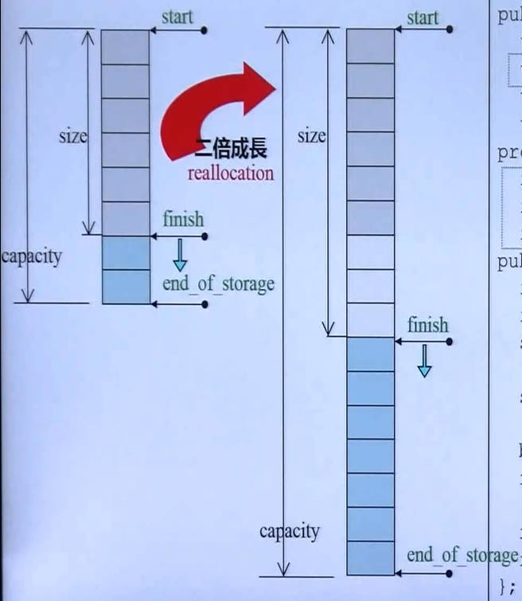

Standard Template Library（STL，标准模板库） 是 C++ Standard Library（C++标准库）的主要组成部分。

**参考网站：**

- [CPlusPlus](https://cplusplus.com/)
- [C++ reference](https://en.cppreference.com/w/)

**源码：**

- MSVC：

  Visual Studio使用的编译器是Microsoft Visual C++（MSVC），是一个闭源编译器，看不到源码

- GNU：

  GNU是开源编译器，Dev C++ 5.11版本使用的是GNU4.9.2，其中源码在

  `E:\Program Files (x86)\Dev-Cpp\MinGW64\lib\gcc\x86_64-w64-mingw32\4.9.2\include\c++\bits`

  文件名前有stl_的是STL源码

# 1. STL简介

## 1.1 STL六大部件

容器（Containers）

分配器（Allocators）

算法（Algorithms）

迭代器（Iterators）

适配器（Adapters）

仿函数（Functors）


**下面是一个例子，运用了上面的六大部件**

```C++
#include<vector>
#include<algorithm>
#include<functional>
#include<iostream>

using namespace std;

int main(){
    
    int ia[6] = {27, 210, 12, 47, 109, 83};
    vector<int, allocator<int>> vi(ia, ia+6);
    
    cout << count_if(vi.begin(), vi.end(), not1(bind2nd(less<int>(), 40)));
    
    return 0;
    
}
```

- **row 11：**

  声明容器时可以指明分配器，一般不指明，会有默认分配器

- **row  13：**

  输出从 vi.begin() 到 vi.end() 中大于等于40的元素

  `bind2nd(less<int>(), 40)` 是一个function adapter (binder)，表示将less仿函数的第二个参数绑定为40，即第一个参数小于40时返回true

  `not1()` 是一个function adapter (negator)，对里面的结果取反

  组合起来就是数组中元素 >= 40 时返回true

## 1.2 常见容器

### 1.2.1 Sequence Containers 顺序容器

- **Array**

  

  在C++11之后，将数组也封装为了一个类。Array容量大小固定，必须在创建array时指定容量，且不能扩充

- **Vector**


​		只能向后扩充，即支持push_back操作

- **Deque**

  

  前后都能扩充，即支持push_front 和 push_back 操作

  Stack和Queue底层就是直接封装了一个Deque，并没有自己实现功能，所以Stack和Queue其实是是Deque的适配器

- **List**


​		链表，STL中对链表的实现是一个双向循环链表

- **Forward-List**


​		单向链表，在C++11之后才加入标准库中，不是循环单项链表。只能用头插法插入元素，即只提供push_front

### 1.2.2 Associative Containers 关联式容器

- **Set/Multiset**

  

​		插入的元素会被自动排序，Set不能插入重复元素，Multiset能插入重复元素

​		底层是红黑树

- **Map/Multimap**

  

  存储键值（Key-Value）对，会根据键自动排序，Map中不存在重复的键，Multimap中可以有重复的键

  底层是红黑树

### 1.2.3 Unordered Containers 无序容器

无序容器是C++11之后才加入STL的，底层是HashTable，使用链地址法（Separate Chaining）解决冲突


- **Unordered Set/Multiset**

  不会对元素进行排序，底层是哈希表

- **Unordered Map/Multimap**

  不会根据键进行排序，底层是哈希表

## 1.3 分配器

当创建容器时，可以在模板的第二个参数处指定分配器，默认是`std::allocator`

也有一些其他分配器可供选择

### 1.3.1 GNU编译器提供的分配器

以下头文件只能在GNU编译器下编译通过

```c++
#include<ext\array_allocator.h>
#include<ext\mt_allocator.h>  // mt —— multiThread多线程
#include<ext\debug_allocator.h>
#include<ext\pool_allocator.h>  
#include<ext\bitmap_allocator.h>
#include<ext\malloc_allocator.h>
#include<ext\new_allocator.h>
```

使用上述分配器创建一个容器

```C++
list<string, allocator<string>> c1; // 用默认的std::allocator
list<string, __gnu_cxx::malloc_allocator<string>> c2;
list<string, __gnu_cxx::new_allocator<string>> c3;
```

### 1.3.2 直接使用分配器

分配器本身也是一个类，可以直接使用，用来进行内存分配

在分配器中只提供了两个方法，一个用来分配内存，一个用来释放内存

```C++
int *p;
std::allocator<int> alloc1;
p = alloc1.allocate(1); // 分配 1 个 int 大小的空间给p
alloc1.deallocate(p,1); // 回收 p 的空间，回收的大小为 1 个 int 的大小

__gnu_cxx::malloc_allocator<int> alloc2;
p = alloc2.allocate(1);
alloc2.deallocate(p, 1);

__gnu_cxx::pool_alloc<int> alloc3;
p = alloc3.allocate(2);
alloc3.deallocate(p, 2);
```

可以看到释放空间的时候除了指明要释放的地址，还要指明要释放的空间大小，非常麻烦。所以没必要直接使用分配器。

### 1.3.3  分配器底层实现

allocators用于分配内存，最终都会调用malloc

**标准allocator接口的实现**

VC6带的编译器（MSVC6.0）、Borland C++、GCC2.91 等编译器对分配器的实现（对allocator类的实现）没有什么特殊操作，类中allocate函数就是直接调用operator new（底层调用malloc），deallocate函数直接调用operator delete（底层调用free）。

**直接调用malloc带来的问题**

在malloc时，除了会分配给你指定大小的内存空间，还会分配一些额外空间用于记录分配信息，产生额外开销*（见 4.C++基于对象设计OOD 中 3.3.3 new所得的内存块）*。如果对容器中的每个元素都调用malloc，势必会产生大量额外开销，当元素比较小（比如int，指针类型）时，甚至比元素本身占用的空间还要大。

**GCC2.91的解决办法**

GCC2.91在创建容器时，分配器默认并不是allocator，而是alloc。alloc的实现如下：


分配器会自己维护一个数组，数组下面挂的链表就是要分配的内存空间。在申请空间时，alloc会向操作系统申请一大块内存空间，然后自己进行切分，这样就避免了直接使用malloc带来的额外开销。其中数组0位置下的内存空间每块为8B，1位置下为16B，2位置24B，以此类推。

当创建容器时，会根据容器中要存放的元素的大小选择要分配的内存空间，不足8的整数倍时就分配8的整数倍的内存。比如容器内每个元素大小50B，就会将#7下的内存分配给他。

**GCC4.9的实现**

在4.9中，默认分配器又变为了allocator，直接调用operator new和operator delete。

而2.9中的alloc在4.9中依然保留，不过更名为__pool_alloc

## 1.4 Iterator Traits

### 1.4.1 什么是Iterator Traits

Traits：特征

associated types：在迭代器中定义的一组类型别名，用于描述迭代器的特征与属性

Iterator Traits：一种机制，用于确定迭代器的特征及属性

迭代器是连接容器和算法的工具，在执行算法时，算法需要知道容器和迭代器的特征（比如容器的数据类型，迭代器是否支持随机存取等，称为associated types），这时候就要去问迭代器。

```
associated types（即算法想问的问题）包括五种：
1. iterator_category ： 迭代器的类别，是只能向前++，还是既能向前也能向后，还是可以跳着走
2. value_type ：迭代器指向的数据类型，也就是容器中装的数据类型
3. pointer：数据类型对应的指针，valuetype*
4. reference：数据类型对应的引用，valuetype&
5. difference_type：两个迭代器之间的距离用什么数据类型来表示，一般是ptrdiff_t类型，底层可能是unsigned_long或int
```

```C++
算法的直接提问：
template<typename I>
inline void algorithm (I first, I last){ // first和last是两个迭代器
    ...
    I::iterator_category c;// 询问迭代器类型
    I::pointer ptr;
    I::reference ref;
    I::value_type v;// 询问迭代器指向的数据类型
    I::difference_type d;
    ...
}
```

上面是算法直接提问迭代器的例子，如果迭代器是一个class，它有能力自己定义associated types，那当然可以直接回答算法的问题，但是如果传入的迭代器是一个native pointer（C++原生指针），那它自己就没办法回答这些问题。

所以在算法和迭代器之间又加了一层Traits，算法会询问Iterator_traits（萃取机，用于萃取出指定信息）。如果Iterator是智能指针，Traits会直接去询问Iterator，如果Iterator是原生指针，Traits会替他回答（因为对于指针来说这些答案显而易见）。

```C++
算法通过traits询问
template<typename I>
void algorithm(...){
    typename iterator_traits<I>::value_type v;
    typename iterator_traits<I>::iterator_category c;
    ...
}
```

### 1.4.2 Iterator_traits实现

iterator_traits用于分离class iterators 和 non-class iterators

**class Iterator**

直接询问I

```C++
template <class I> // I是一个迭代器类型
struct iterator_traits{ // 如果I是class iterator，进入这里
    // iterator_traits会直接询问I
    typedef typename I::value_type value_type;
    typedef typename I::iterator_category iterator_category;
    ...
}
```

**non-class Iterator**

traits替他回答

```C++
template<class T>
// 使用模板偏特化，当传入的T是一个指针时，即iterator不是一个类时
struct iterator_traits<T*> {
    // iterator_traits帮T*回答
    typedef random_access_iterator_tag iterator_category; //如果是一个指针，那它一定可以任意移动
    typedef T value_type; // 指针指向的数据类型就是T
    typedef ptrdiff_t difference_type;
    typedef T* pointer;
    typedef Y& reference;
}
```

# 2. List

STL中对List的实现是双向循环链表


环状list尾端特意添加一个空白结点，为了符合STL区间前闭后开的原则，即iterator\<list>().end()要指向最后一个元素的后一个位置

*以下源码来自GCC2.91版本*

## 2.1 __list_node

```C++
template<class T>
struct __list_node {
    typedef void* void_pointer;
    void_pointer prev;
    void_pointer next;
    T data;
};
```

prev和next指针使用的是void*类型，意味着使用的时候还要进行类型转换。应该是直接使用__list_node\*类型好一点。

## 2.2 list

```C++
template<class T, class Alloc = alloc> // 默认分配器是alloc
class list{
protected:
    typedef __list_node<T> list_node;
public:
    typedef list_node* link_type;
    typedef __list_iterator<T, T&, T*> iterator;
protected:
    link_type node; // 链表的头指针
...
};
```

整个list中只有一个指向结点的头指针，所以sizeof(list<T>)应该是4字节

## 2.3 _list_iterator

iterator实际上就是一个智能指针类

```C++
template<class _Tp, class _Ref, class _Ptr> // 这里应该没必要传三个参数，只要传入T，就能知道T&和T*
struct _List_iterator {
  // 一堆typedef
  typedef _List_iterator<_Tp,_Tp&,_Tp*>             iterator;
  typedef _List_iterator<_Tp,const _Tp&,const _Tp*> const_iterator;
  typedef _List_iterator<_Tp,_Ref,_Ptr>             _Self;

  // 定义associated types
  typedef bidirectional_iterator_tag iterator_category; // 意思是这个iterator每次只能前后移动一格，即只能++或--
  typedef _Tp value_type;
  typedef _Ptr pointer;
  typedef _Ref reference;
  typedef ptrdiff_t difference_type;
    
  typedef _List_node<_Tp> _Node;

  // 封装了一个指向_list_node的指针
  _Node* _M_node;

  // 构造函数
  _List_iterator(_Node* __x) : _M_node(__x) {}
  _List_iterator() {} // 空构造
  _List_iterator(const iterator& __x) : _M_node(__x._M_node) {} // 拷贝构造

  // 重载 == 和 ！= 比较运算符
  bool operator==(const _Self& __x) const { return _M_node == __x._M_node; }
  bool operator!=(const _Self& __x) const { return _M_node != __x._M_node; }
  
  // 重载 * 解引用符号，返回的是 iterator封装的指针指向的结点 中的data域
  reference operator*() const { return (*_M_node)._M_data; }

  // 重载 -> 符号，实际上调用了上面对*的重载，返回一个指向data域的指针
  pointer operator->() const { return &(operator*()); }

  // 重载自增和自减符号
  // 重载前置++，即++iterator
  _Self& operator++() { // 前置++返回值是引用，因为允许++++it操作，就等同于++(++it)
    _M_node = (_Node*)(_M_node->_M_next); // 这里注意到，由于__list_node中的next是void*类型，因此要进行类型转换
    return *this;
  }
  // 重载后置++
  _Self operator++(int) { // 后置++返回值不是引用，因为不允许it++++操作
    _Self __tmp = *this; // 调用拷贝构造函数，*this被解释为拷贝构造的参数。因为*this表达式的结果是一个左值引用，所以这里并不会调用operator*()
    ++*this; // 调用operator++，*this被解释为operator++的参数，同理也不会调用operator*()
    return __tmp;
  }
  // 重载前置--
  _Self& operator--() { 
    _M_node = (_Node*)(_M_node->_M_prev);
    return *this;
  }
  // 重载后置--
  _Self operator--(int) { 
    _Self __tmp = *this;
    --*this;
    return __tmp;
  }
};
```

## 2.4 GCC4.9的不同

**_list_node**

```C++
struct _List_node_base{
    _List_node_base* _M_next;
    _List_node_base* _M_prev;
}

template<typename _Tp>
struct _List_node : public _List_node_base{
    _Tp _M_data;
}
```

将原来的void*指针改为了指向自己本身类型的指针

但是引入了一些复杂的继承关系，比如\_List\_node继承\_List_node_base只是为了前后指针

**iterator**

```C++
4.9版本
template<typename _Tp>
struct _List_iterator{
    typedef _Tp* pointer;
    typedef _Tp& reference;
    
...
}

2.9版本
template<class T, class Ref, class Ptr>
struct __list_iterator{
    typedef Ptr pointer;
    typedef Ref reference;
...
}
```

原来iterator的模板需要传入三个类型，现在只需要

**sizeof(list<int\>)**

在2.9中是4字节，而在4.9中是8字节，因为在一系列继承和包含关系之后，list这个class中实际上包含的是指向前一结点的指针`_List_node_base* _M_next;`和指向后一结点的指针`_List_node_base* _M_prev;`。而在2.9中，只包含了一个指向当前结点的指针。


# 3. Vector

Vector用三根指针来控制一个容器：start（指向起始元素），finish（指向末尾元素的后一个位置），end_of_storage（指向整片空间的末尾），所以`sizeof(vector<T>) = 12;`

vector的迭代器就是一个T*指针，start，finish，end_of_storage都是iterator类型

扩充时每次是两倍增长

*以下源码来自GCC2.91*



## 3.1 vector

```C++
template<class T, class Alloc = alloc> // 默认分配器为alloc
class vector{
public:
    typedef T value_type;
    typedef value_type* iterator; // vector的迭代器直接就是一个指针
    typedef value_type& reference;
    typedef size_t size_type;

protected:
    // 用三个指针来控制一个vector
    iterator start;
    iterator finish;
    iterator end_of_storage;
    
public: // vector提供的一些方法
    // 获取首部元素的迭代器
    iterator begin() {return start;}
    // 获取容器末尾元素的迭代器
    iterator end() {return finish;} 
    // 获取容器中元素个数
    size_type size() const {return size_type(end() - begin());} 
    // 获取元素的当前容量
    size_type capacity() const {return size_type(end_od_storage - begin());}
    // 判断容器是否为空
    bool empty() const {return begin() == end();}
    // 重载中括号
    reference operator[](size_type n){return *(begin() + n);}
    // 获取容器中第一个元素
    reference front(){return *begin();}
    // 获取容器中最后一个元素
    reference back() {return *(end() - 1);}
    
    // 向容器末尾添加一个元素，具体实现在下一小节
    void push_back(const T& x){ 
        if(finish != end_of_storage){ // 如果还有空间
            construct(finish, x);
            ++finish;
        }else{
            insert_aux(end(), x); // 如果空间不足
        }
    } 
};
```

## 3.2 vector push_back

**push_back()**

```C++
void push_back(const T& x){ 
    if(finish != end_of_storage){ // 如果还有空间
        construct(finish, x); // 全局函数，在vector中finish的位置构建一个x
        ++finish;
    }else{ // 如果空间不足
        insert_aux(end(), x); 
    }
} 
```

**insert_aux()**

当空间不足时调用该函数进行空间扩充

```C++
template<class T, class Alloc>
// insert auxiliary 插入辅助函数
void vector<T,Alloc>::insert_aux(iterator position, const T& x){
    // 在这里还要判断一次是否有空间，是因为不止push_back会调用这个函数
    if(finish != end_of_storage){ // 如果还有空间
        // 在新的位置构建一个元素，以最后一个元素的值作为其初值
        construct(finish, *(finish - 1));
        ++finish;
        T x_copy = x;
        // 好像是把插入位置后的元素全部向后移动一位，给要插入的元素腾出空间
        copy_backward(position, finish - 2, finish - 1);
    }else{ // 如果没有空间
        const size_type old_size = size(); // 记录原大小
        // 分配原则：如果原大小为0，则分配1；如果原大小不为0，则分配原大小的两倍空间
        const size_type len = old_size != 0 ? 2 * old_size : 1;
        
        // 按照新的大小申请新的空间
        iterator new_start = data_allocator::allocate(len);
        iterator new_finish = new_start;
        
        // 将原vector中的旧元素搬到新vector中
        try{
            // 将原vector的内容拷贝过来
            new_finish = uninitialized_copy(start, position, new_start);
            // 将新元素x插入
            construct(new_finish, x); // 在new_finish位置创建新元素，值为x
            ++new_finish;
            // 将安插点后的内容拷贝过来(因为insert函数也可能会调用它)
            new_finish = uninitialized_copy(position, finish, new_finish);
        }
        catch(...){
            destroy(new_start, new_finish);
            data_allocator::deallocate(new_start, len);
            throw;
        }
        
        
        // 解构并释放原vector
        destroy(begin(), end());
        deallocate();
        // 调整迭代器，让其指向新的空间
        start = new_start;
        finish = new_finish;
        end_of_storage = new_start + len;
    }
}
```

## 3.3 GCC4.9改动

乱七八糟，舍近求远


# 4. Array

