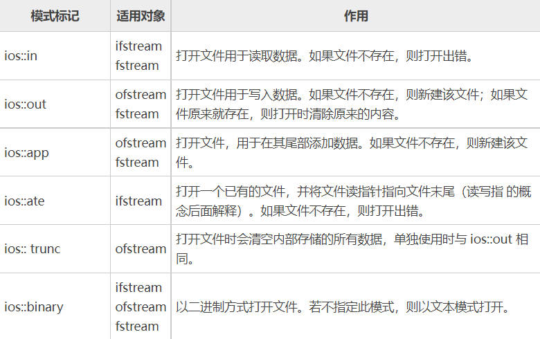

# 1. cin

cin是C++标准输入流对象，即istream类的对象，主要用于从标准输入（键盘）读取数据

cin读取数据是从缓冲区中获取数据，缓冲区为空时，cin的成员函数会阻塞等待数据的到来；而只要缓冲区还有数据，cin的成员函数就会直接去读取

当我们从键盘输入字符时，必须按下回车键才能将数据送入到缓冲区中，此时敲入的回车键会被转换为一个换行符(\n)并存储在缓冲区中

## 1.1 cin >>

`cin` >> 等价于 `cin.operator>>()`，即调用成员函数

**cin >> 读取规则**

cin>> 以空格、tab或换行作为分隔符，如果缓冲区中第一个字符是上述分隔符，cin>> 会将其忽略并清除，继续读下一个字符。如果缓冲区为空则继续等待。

读取成功后，字符后面的分隔符残留在缓冲区中，cin>> 不做处理

**cin >> 支持链式操作**

比如`cin >> a >> b >> c;`

这是因为cin >> a返回的依然是cin对象

## 1.2  cin.get()

get不会忽略缓冲区中的分隔符，而是会直接读入

**读取单个字符**

函数原型：`int get();` 和 `istream& get(char& var)`

示例：

```c++
char a,b;
// cin.get()返回的是int类型数据，也就是读入的字符的ASCII码
a = cin.get();
// 由于get(char &var)返回的是istream&类型，
// 即返回cin对象，所以支持链式操作
cin.get(b).get(c);
```

**读取一行**

函数原型：

`istream& get(char* s, streamsize n, char delim)`

- get只能读入到C风格字符串类型 char*中

- n表示目标空间的大小，即分配给 s 的大小，

  其中streamsize类型为long long

  由于使用的是char*，所以实际只能读入n-1个字符，最后一个位置存'\0'

- delim表示结束符，即遇到指定结束符结束本次读取。默认是换行符

示例：

```C++
char *a = new char[10];
char *b = new char[10];
// 返回值是istream&，支持链式操作
cin.get(a,10,' ').get(b,10);
```

get并不会忽略分隔符，也不会处理分隔符。所以如果输入`abcdef \n`，那么 a = `abcdef` ，b = ` (空格)`

如果a的结束符也是回车，那么 a=`abcdef \0`，b=`\0`，因为a读完之后没有处理换行符，b再来读直接看到换行符，发现是自己的结束符，就结束读取，所以b中什么也没有

## 1.3  getline()

**cin.getline()**

cin.getline定义在istream中

函数原型：`istream& getline(char* s, streamsize n, char delim)`

与cin.get基本相同，但是cin.getline不会将结束符残留在输入缓冲区中，当然也不会读入到s中，会处理掉

只能存入n-1个字符，因为最后一个位置要存'\0'，如果读完n-1个字符后还是没有遇到结束符，就会因为缓冲区未读取完而造成输入异常

**getline()**

getline是在std命名空间中的全局函数，定义在<string>中

函数原型：`istream& getline(istream& is, string& str, char delim)`

示例：

```c++
// 返回的是istream&，可以链式操作
// 但是链的下一个getline是cin.getline
char* a = new char[20];
getline(cin, str, ' ').getline(a, 20, ' ');
```

当遇到结束符时，getline会把结束符一并读入指定的string中，再将结束符替换为空字符

## 1.4 cin的条件状态

cin 有可能进入错误状态

比如，当需要输入一个整数，但是却输入了一个字母时，cin 进入错误状态；输入文件结束符，cin 也会进入错误状态。

流必须处于无错误状态才能用于输入或输出，检测流是否可用最简单的方法就是检查其真值

```c++
示例：输入一个整数，如果输入不符合规范就循环输入
int a;
while(true){
    cin >> a;
    if(cin){
        break;
    }
}
```

上面这个程序看起来没问题，但是执行后在控制台输入 'a' 并按下回车，发现程序卡死，并且不能再次输入。其实是进入了死循环，因为cin 读取a之后进入错误状态，无法继续输入，所以程序永远无法break，也无法再次键入

### 1.4.1 条件状态

通过检测流的真值只能判断流是否有效，IO标准库管理了一系列条件状态，用来标记给定的IO对象处于哪种状态或者碰到了哪种错误。

**条件状态位**

其实就是四个二进制位，可以同时处于多个状态

- goodbit (0x0)：无错误
- eofbit (0x1)：已达到文件尾
- failbit (0x2)：非致命的输入/输出错误，可挽回
- badbit (0x4)：致命的输入/输出错误，无法挽回

**获取条件状态：**

- `cin.good()`：如果cin的状态位为goodbit，返回true
- `cin.eof()`：如果cin的状态位为eofbit，返回true
- `cin.fail()`：如果cin的状态位为failbit，返回true
- `cin.bad()`：如果cin的状态位为badbit，返回true
- 也可以直接读取条件状态位，比如`cin.goodbit`
- `cin.rdstate()`：返回cin当前状态，good是0，eof是1，fail是2，bad是4

**设置条件状态：**

- `cin.clear(flags)`：清除当前状态，然后把状态设置为flags，不写参数就只清除当前状态（清除之后变为goodbit置为1）
- `s.setstate(flags)`：不清除当前状态，再加上状态flags

## 1.5 清空输入缓冲区

**函数原型** 

`istream& ignore(streamsize num=1, int delim = EOF);`

需要在goodbit状态下才能使用，跳过输入流中的num个字符，或在遇到指定的终止字符时提前结束跳过（会跳过终止字符）

不写终止字符默认是EOF，在windows控制台按ctrl+Z是EOF。但是如果控制台缓冲区中没有EOF，那ignore会阻塞等待输入，直到有EOF出现

**使用实例**

```c++
// 跳过当前行
cin.ignore(numeric_limits<std::streamsize>::max(), '\n');
// numeric_limits<std::streamsize>::max()是<limits>头文件定义的流使用的最大值，也可以用一个足够大的数代替
```

**注意事项**

`cin.sync()`也可以清空缓冲区，但是在有些编译器中不行，不通用

# 2. cout

当使用 `cout << "helloworld";`时，其实只是把要输出的内容写在了输出缓冲区上，只有当缓冲区刷新时，才会将内容写入到真实的输出设备（如屏幕）或文件。

## 2.1 输出缓冲区的刷新

- 程序正常结束时，作为main返回工作的一部分，将清空所有输出缓冲区

- 在一些不确定的时候，如果缓冲区满了，会刷新

- 用操纵符（manipulator）显式刷新，如

  - endl：输出换行符并刷新缓冲区
  - flush：只刷新缓冲区
  - ends：在缓冲区插入空字符，然后刷新

- 用unitbuf操纵符设置流的内部状态，让缓冲区每次执行完写操作都刷新

  `cout << unitbuf << "helloworld" << nounitbuf;`

  `nounitbuf`用于将流恢复为正常使用缓冲区

# 2. 文件操作

## 2.1 文件操作简介
C++中对文件的操作需要包含头文件<fstream\>

文件类型：
- 文本文件
- 二进制文件

操作文件的三大类：
- ofstream：写操作
- ifstream：读操作
- fstream：读写操作

## 2.2 写入文件
**步骤：**
1. 包含头文件

`#include<fstream>`

2. 创建流对象

`ofstream ofs;`

3. 打开文件

`ofs.open("文件路径"，打开方式);`

*2、3可以合为一步：*

`ofsstream ofs("text.txt", ios::out);`

4. 写入数据

`ofs << "写入的数据";`

5. 关闭文件

`ofs.close();`

```C++
#include<fstream>
using namespace std;
int main(){
    ofstream ofs;
    ofs.open("test.txt",ios::out);
    ofs << "HelloWorld！！！" << endl;
    ofs.close();

    return 0;
}
```

**文件打开模式：**



- 文件打开方式可以配合使用，利用‘|’操作符
  

`ios::binary | ios::out` 利用二进制方式写入文件

## 2.3 读取文件
**步骤:**
1. 包含头文件

`include<fstream>`

2. 创建流对象

`ifstream ifs;`

3. 打开文件，并判断是否打开成功

`ifs.open("test.txt",ios::in);`
```C++
if(! ifs.is_open()){
    cout << "文件打开失败" << endl;
    return;
}
```

4. 读取数据

    1. 方式一：
        ```C++
        char buf[1024] = {0};
        while(ifs >> buf){
            cout << buf << endl;
        }
        ```
    2. 方式二：

            getline函数，一行一行读取数据
            第一个参数是将这行数据存储在哪里
            第二个参数是最多读取多少字符
        ```C++
        char buf[1024] = {0};
        while(ifs.getline(buf,sizeof(buf))){ 
            cout << buf << endl;
        }
        ```

    3. 方式三：

            全局getline函数
            第一个参数是读取数据时使用到的流，也就是ifs对象
            第二个参数是将数据读取到哪里
        ```C++
        string buf;
        while(getline(ifs,buf)){
            cout << buf << endl;
        }
        ```
    
    4. 方式4：

            get函数
            一个字符一个字符读取
            EOF:end of file
        ```C++
        char c;
        while( (c = ifs.get() ) != EOF){ 
            cout << c;
        }
        ```
    - 可以将读取到的数据再放回去

        ```C++
        char ch;
        ifs >> ch;
        ifs.putback(ch);
        ```
5. 关闭文件

`ifs.close();`

## 2.4 写入二进制文件
**步骤：**
1. 包含头文件

2. 创建输出流对象并打开文件

    `ofstream ofs("test.txt",ios::out | ios::binary);`

4. 写文件
   - 参数1：写入的数据是什么，const char* 类型
   - 参数2：写入的数据有多大
   二进制文件可以写入自定义数据类型
   案例中写入的是一个Person类 
    `Person p("张三"，18);`
    `ofs.write((const char*)&p,sizeof(Person));`

5. 关闭文件

    `ofs.close();`

## 2.5 读取二进制文件
**步骤：**
1. 包含头文件

2. 创建流对象

    `ifstream ifs;`

3. 打开文件，判断文件是否打开成功

    ```C++
    ifs.open("test.txt", ios::in | ios::binary);
    if(! ifs.is_open()){
        cout << "文件打开失败" << endl;
        return;
    }
    ```

4. 读文件
    read()函数参数:
    - 参数1：文件要写入到哪里
    - 参数2：要写入的容器有多大

    ```C++
    Person p;
    ifs.read((char*)&p, sizeof(Person));
    cout << p.Name << p.Age << endl;
    ```
