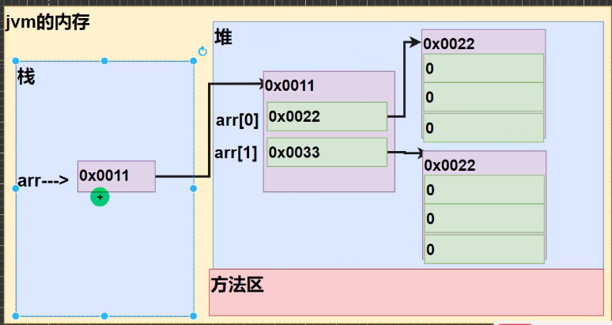

#    0. Install Java

Java有四个版本

- Java Standard Edition：JavaSE

  标准版本

- Java Enterprise Edition：JavaEE

  基于标准版本进行扩展，适用于开发超大工程

- Java Micro Edition：Java ME

  JavaSE的子集，用于开发移动设备软件

- Java Card

  用于smart card

## 0.1 jdk

jdk全称为Java Development Kit

jdk提供一个开发java程序的开发环境，包括编译器和可以被复用的java库代码，和java运行环境（jre，Java Runtime environment）等组件。

JDK = JRE + java开发工具 用于开发Java程序

JRE = JVM + Java核心类库 用于运行Java程序

google `jdk download`即可在oracle官网下载

## 0.2 IDE

IDE使用Intellij IDEA

首先在JET BRAINS官网免费下载安装IDEA Communicate

打开Intellij IDEA，创建项目，设置项目名称，选择JDK即可创建一个Java项目

**安装VIM插件**

右上角打开设置 - Plugins - Marketplace - 找到IdeaVim - 安装

**快捷操作**

- move class member：选中field或者method名，右键 refactor （快捷键ctrl + alt + shift + T）- move member即可将其移动至另一个class中

- 更改函数声明信息（返回值、参数列表等）

  选中method - 右键refactor - change signature

  更改函数名直接在refactor菜单中选rename

- 添加Constructor、get/set、toStrong

  在class中任意地方右键 Generate（快捷键Alt + Insert）

## 0.3 配置JAVA_HOME

1. 右键此电脑 - 属性 - 高级系统设置 - 环境变量
2. 用户变量 - 新建 - 变量名：JAVA_HOME 变量值：jdk安装目录
3. 选中用户变量中的path - 编辑 - 新建 - `%JAVA_HOME%\bin`
4. 打开命令行窗口输入java 或者 `javac -version`检验

# 1. HelloWorld

## 1.1 first program

```Java
package com.sazer;

public class Main {
    public static void main(String[] args){
        // 第一个Java程序
        // 输入sout即可智能补全
        System.out.println("Hello World");
    }
}
```

第一行声明的package可以理解为namespace

在Java中至少要有一个Mina类和一个main方法作为程序入口，所有的类和方法都有访问权限，main方法必须声明为static，否则不能运行

一个源文件中只能有一个public class，且该class要与文件名相同。非public的类数量不限

## 1.2 程序执行过程

### 1.2.1 编译Compilation


Java源代码文件需要先通过Java编译器（包含在jdk中）编译为.class二进制文件

这个二进制文件is platfrom independent，可以运行在安装了JRE（Java Runtime Environment）的Linux、Mac和Windows平台上

在Intellij中选中文件 - 工具栏 - view - ShowBytecode即可查看该文件编译后的文件

**编译**

- 在Intellij IDEA中右键文件名 - OpenIn - Terminal

  在Termial中输入`javac Main.java`

  之后ls即可看到编译后的Main.class文件

- 在Intellij IDEA中点击运行程序，之后在out - production - 项目名 - com - 包名 文件夹下即可看到对应的Main.class文件

### 1.2.2 运行Execution


编译得到的.class文件，会再经过JVM（包含在JRE中）变成不同平台的可执行代码。

**运行**

- 打开Terminal，`cd ..`两次退回到src目录下

  java命令后面跟的是类名，表示执行这个类，不用加.class后缀

  执行`java com.sazer.Main`或`java com/sazer/Main`

- 在Intellij中按下运行按钮时，会自动编译+运行

## 1.3 读入数据

`import java.util.Scanner;`

从命令行窗口读入数据：

```java
Scanner scanner = new Scanner(System.in);
// 读入指定类型的数据
byte age = scanner.nextByte(); //读入byte类型
double d = scanner.nextDouble(); // 读入double类型数据

// 读入字符串
string firstName = scanner.next(); // 读入一个token，即遇到空格就结束读取
scanner.fullName = scanner.nextLine(); // 读入一整行，以读取到\n结束读取
```

## 1.4 打包程序

如果想将写好的程序发给别人使用，需要将程序打包为jar(java archive) file，之后在安装了jre的电脑上就可以运行该package

**打包控制台程序**

1. 打包：

   工具栏 - file - project structure - artifacts - add(点击加号) - JAR - from modules with dependencies - 选择main class - 点击ok

   工具栏 - build - build artifacts - 会弹出所有的jar file - 选择 - build

2. 运行：

   左侧project栏 - out - artifacts可以找到建好的.jar文件 - 右键点击 open in terminal（或者打开终端定位到该文件目录） - 在终端中使用`java -jar HelloWorld.jar`运行

## 1.5 注释

**单行注释**

`//注释`

**多行注释**

```java
/*
多行注释
*/
```

**文档注释**

文档注释内容可以被JDK提供的工具javadoc解析，并以网页形式呈现为说明文档，一般写在类和方法的定义前

- 基本格式

```java
/**
* @auther sazer
* @version 1.0
*/
```

- 生成文档

  `javadoc 将生成的文档放在哪个路径 -author -version ClassName.java`

- 常见标签：

  - @param：说明方法的参数
  - @return: 说明返回值类型
  - @author：标识一个类的作者
  - @version：表示版本信息

## 1.6 Package

包实际上就是文件夹，在不同的包下可以定义相同名称的类

直接在src下右键 - New - Package - 输入包名 即可创建包，

在类文件的开头使用`package 包名` 来声明当前类在哪个包中

在package语句下面使用import导入其他包，import可以有多条，没有顺序要求

**命名规则**

只能包含数字、字母、下划线、小圆点，不能用数字开头，不能是关键字或保留字

命名一般是`com.公司名.项目名.业务模块名`

包名例如`com.sazer.test`这样会在src目录下创建三层目录，即`com/sazer/test`

**常见的包**

- `java.lang` 基本包，默认自动引入

- `java.util` 系统提供的工具包、工具类，比如Scanner、Arrays，

  需要手动引入

- `java.net` 网络包，用于网络开发

## 1.7 注解

### 1.7.1 Override

重写方法时可以在上面加上`@Override`注解，此时编译器会帮忙检查是否构成重写

### 1.7.2 Deprecated

用于标记该方法已经过时，在JavaSE中一般用于 jdk源码中

可以用于修饰方法、类、字段、包、参数 等等

### 1.7.3 SuppressWarnings

用于抑制编译警告

```java
public class Main {
    @SuppressWarnings({"all", "...", "..."})
    public static void main (String[] args) {
        
    }
}
```

在大括号中可以写入希望抑制（即不希望显示）的警告信息，可以写多种抑制多种警告，比如all，抑制所有警告

作用范围和注释的位置有关

- 放在类上就抑制整个类中的警告

- 放在方法上就抑制整个方法中的警告
- 放在一条语句上面就抑制这条语句的警告

## 1.8 编码问题

从Java源代码到显示正确输出结果，需要经过以下步骤：Java源代码 —— javac编译为.class字节码文件 —— Java虚拟机JVM加载运行 —— 经过操作系统 —— 显示设备输出

### 1.8.1 编译

Java源码 编译为 .class 字节码

这步需要保证Java源码文件的编码方式和编译时使用的编码方式相同，一般编译时会默认使用系统编码方式（UTF8），所以Java源文件应该采用UTF8编码

**命令行**

指定编译时使用的编码方式：`javac -encoding UTF8 Test.java`

- 当使用GBK格式编译UTF8编码的源码文件时

```
椤圭洰缂栫爜鏂瑰紡涓猴細GBK
浣犲ソ
```

- 当使用UTF8方式编译GBK编码的源文件时

  会报错：编码UTF8的不可映射字符，无法编译成功

**Idea**

File - Settings - Build，Execution，Deployment - Compile - Java Compile - 在右侧窗口有一栏Additional command line parameters。这这里面输入 `-encoding UTF8`

修改完之后记得 Build - Recompile 重新编译一下

### 1.8.2 虚拟机运行

虚拟机加载运行.class文件

启动虚拟机时使用的编码方式最好和编译时一样，才能正确显示。最终输出到控制台时的编码方式也有虚拟机控制

在代码中可以通过`Charset.defaultCharset();`来打印项目使用的编码方式（即虚拟机启动项目时使用的编码方式）

**命令行**

指定运行时使用的编码方式：`java -Dfile.encoding=UTF8 Test`

**Idea**

在Idea中可以在Run/Debug Configuration窗口 - Build and run - Modify options - 勾选add VM options。在VM options中添加参数 -Dfile.encoding=UTF8 来指定虚拟机运行时的编码方式。

# 2. 变量

在Java中声明变量需要指定变量类型，变量名一般使用小驼峰（首字母小写，其余单词首字母大写）

`int age1 = 18, age2 = 29;`

变量只能定义在block中，也就是说必须定义在一对大括号内，并且作用域限定在这对大括号内

```java
// 不允许这样定义b，因为这不在block中
if (a > 1) 
    int b = a;

// 这样定义是可以的
if (a > 1){
    int b = 1;
}
sout(b); // 编译错误，不能在外面访问b
```

## 2.0 内存模型

在Java中内存分为栈和堆

- 栈中存放primitive type变量的值，和reference type变量的地址
- 堆中存放reference type变量的值

当一个方法执行结束之后，java会将这个方法对应的栈（代码块中包裹的全部变量）全部清除，栈中存放的指向堆中地址的变量也全部清除。

这种存储在堆中但是栈中没有引用的内存就是垃圾，java垃圾回收机制（gc，garage collector）会自动清理。

## 2.1 Primitive Types

用于存储简单数据

每个primitive type都有对应的Reference type，称为其对应的wrapper class，java5之后支持自动拆装箱

|  Type   | Bytes                     | wrapper class |
| :-----: | :------------------------ | ------------- |
|  byte   | 1                         | Byte          |
|  short  | 2                         | Short         |
|   int   | 4                         | Integer       |
|  long   | 8                         | Long          |
|  float  | 4                         | Float         |
| double  | 8                         | Double        |
|  char   | 2<br />(因此可以存放汉字) | Character     |
| boolean | 1                         | Boolean       |

**注意事项：**

- 数字可以用`_`分割以增加可读性，比如`int largeNum = 123_456_789;`

- 整型数字默认是int类型，因此long类型在定义时需要在数字末尾加L，否则编译器会认为是int `long longNum = 3_123_456_789L;`

- 浮点型数字默认是double类型，因此float类型在定义时需要在数字末尾加F，否则编译器会认为是double `float floatNum = 1.23F;`

- 浮点类型的如果整数部分是0可以省略：`0.512`可以写为`.512`

- 浮点数的科学计数法：

  5.12*10^5 : `5.12e5`  结果是double类型，因为5.12是double类型

  5.12*10^-5 : `5.12e-5`

- char类型用单引号，string用双引号

  在Java中，char的本质是一个整数，存放了字符对应的unicode码，因此可以直接给char变量赋一个整数

  ```java
  char c = 97;
  sout(c); // 打印a
  sout((int)c); // 打印9
  ```
  
  注：Unicode使用两个字节来表示每个字符；utf8在Unicode的基础上改进为了大小可变的编码，字母使用一个字节，字符使用两个字节

**内存分配：**

当用一个变量给另一个变量赋值时，两个变量之间没有任何联系，其中任何一个变量的修改不会影响到另一个变量

## 2.2 Reference Types

存储复杂的object

除了上面的8种primitive type其余都是Reference Type

当创建引用类型变量时必须使用 new 手动分配空间，而变量名中存放的是这片空间的地址

**内存分配：**

由于引用变量中存放的是一个地址，因此当使用一个引用变量给另一个变量赋值时，赋予的也是这个地址，也就是说现在两个变量名指向了同一个地址，因此两个变量会互相影响。

```Java
Point point1 = new Point(1, 1);
Point point2 = point2;
point1.x = 2; // 此时point2.x 也等于 2
```


## 2.3 String

String类在Java.lang中定义，但是使用时无需import，属于Reference type

实现Serializable（串行化接口，说明可用于网络传输）、Comparable（可比较）、CharSequence接口，继承Object类。String本身是final 类，不能被继承

String中的字符用Unicode编码

由于String每次更新都要重新开辟空间，效率较低，所以Java提供了StringBuilder和StringBuffer类来增强String功能（见6.常用类）

### 2.3.1 声明

String 虽然是reference type，但是创建变量时不用new，而是可以直接简写赋值

```java
String str = new String("HelloWorld"); // new String() is redundant

String str = "HelloWorld";
```

### 2.3.2 内存模型

当用双引号创建一个字符串常量时，实际上是以char数组的形式保存在方法区的常量池中。

String对象的内存模型根据创建方式的不同有区别

String对象是不可变的，每次更改内容都会在常量池中重新创建了一个字符串常量

**直接创建**

```java
String str1 = "Hello!";
String str2 = "Hello!";
```

当以上述形式创建字符串对象时，会在常量池中检查是否有相同内容的char数组，如果有就直接将数组的地址传给String变量；否则就在常量池中创建该内容的char数组，再将数组地址存入栈区变量中。


**使用new创建字符串**

`String str3 = new String("Hello!");`

当使用new创建字符串时，会先在堆区创建一个String对象。String类中定义了一个`private final byte[] value ` 来保存数据。

栈中的变量保存这个堆区对象的地址。堆区String对象中的value数组则保存常量池中的char[]数组地址


可以使用`str.intern()`来获取与str字符串内容相同的字符串常量在常量池中的位置，如果常量池中没有就在常量池中创建一个并返回。也就是说最终返回的是常量池中的地址。

**字符串相加**

- 字符串常量相加：

`String c1 = "ab" + "cd";`

直接用两个字符串常量相加时，编译器会进行优化，最终c1直接指向常量池中的"abcd"对象，常量池中不会创建"ab"和"cd"

- 字符串变量相加：

```java
String a = "ab";
String b = "cd";
String c = a + b;
```

最后一句话底层执行过程实际上是：

1. StringBuilder sb = new StringBuilder();
2. sb.append(a);
3. sb.append(b);
4. String c = sb.toString();

所以在堆中是new了一个StringBuilder对象，所以c实际上是指向堆中而不是直接指向常量池中

### 2.3.3 常用操作

String is unmutable，也就是说下面的函数都不会在原String对象上修改，而是会返回修改后的String

**连接字符串**

直接用+连接

```java
String str = "HelloWorld" + "!!";
String str1 = "Hello" + '!'; // 可以连接char
```

**格式化字符串**

```java
String info = String.format("我的姓名是%s 年龄是%d 成绩是%.2f 性别是%c", name, age, score, gender);
```

**判断字符串开头结尾**

返回true或false

`str.startWith("123");`

`str.endWith("123");`

**获取字符串长度**

`str.length();`

**寻找子串位置**

返回子串首次出现的下标（从0开始），未出现返回-1

```java
str.indexOf("o"); // 返回4
str.indexOf("123"); // 返回-1
```

**替换子串**

`String replace(charSequence target, char Sequence replacement);`

将target子串替换为replacement，返回替换后的字符串，原字符串不会修改。如果没有指定target则返回原字符串。

```java
String str1 = str.replace("!!", "*");
// str = Helloworld!!
// str1 = Helloworld*
```

**大小写转换**

`str.toLowerCase();`

`str.toUpperCase();`

返回转换后的字符串

**去除首尾空格**

`str.trim();`

返回去除首尾空格后的字符串

**字符串转基本数据类型**

使用基本类型的包装类中的parse方法

`String str = "123";`

- 转int：`int num1 = Integer.parseInt(str);`
- 转long：`long num1 = Long.parseLong(str);`
- 转Double：`double num2 = Double.parseDouble(str);`
- 转Boolean：`boolean b = Boolean.parseBoolean("true");`

**基本数据类型转字符串**

- 基本数据类型后面直接连接一个空字符串 +"" 就可以了

  `String s1 = 100 + "";`

- 使用包装类的toString方法

  ```java
  int i = 100;
  String str = i.toString();
  ```

- 使用String类提供的方法

  ```java
  String str = String.value(1);
  ```


**分割字符串**

`String[] splited = str.split(",");`

**字符串排序**


### 2.3.4 转义字符

escape sequence

用一个`\`来转义字符，比如`String str = "\"Hello\""`，这个字符串打印后是`"Hello"`

- 用`\\` 来打印一个`\`

- `\n`表示换行 

- `\t`表示制表符

- `\'`表示一个单引号

- `\"`表示一个双引号

- `\r`表示将光标移动至行首

  `sout("韩顺平教育\r北京");`

  输出 北京平教育

## 2.4 数组

### 2.4.1 创建数组

Array是Reference Type，创建时需要使用new

**一维数组**

`int[] nums = new int[10];`

也可以直接在创建时初始化数组`int[] numbers = {1, 2, 3, 4, 5};`

内存模型：



**二维数组**

`int[][] arr = new int[2][3];`

```java
int[][] numbers = {
    {1, 2, 3},
    {4, 5, 6},
    {7, 8, 9}
}
```

arr的内存模型：


**三维数组**

`int [][][] metrix = new int[5][5][5]`

使用index获取单个元素`numbers[0] = 1;`

使用`numbers.length`获取数组长度

### 2.4.2 Arrays类数组常用操作

数组常用操作都在Arrays类中实现

**格式化数组**

如果直接打印数组，输出的是数组的地址。如果想要输出数组内容需要格式化数组

- 格式化一维数组：

  `String numsStr = Arrays.toString(nums);`

- 格式化多维数组：

  `String numsStr = Arrays.deepToString(metrix);`

**排序**

`Arrays.sort(nums);`

直接将原数组排序、

对于primitive元素数组来说，只能升序排序，不能直接传入一个Comparator实现降序排序

**二分查找**

要求数组必须有序

`int index = Arrays.binarySearch(nums, 3);`

如果找不到元素，则返回 (该元素应该插入的下标 + 1)的负数

**数组拷贝**

`int[] newArr = Arrays.copyOf(arr, arr.length);`

从arr数组中拷贝 length 个元素到newArr数组中

`int[] copyOfRange(int[] original, int from, int to);`

将original数组中的[from,to)范围的元素拷贝到新数组中并返回该新数组

**初始化数组**

- 用一个数字填充

```java
int[] nums = new int[]{9, 3, 2};
Arrays.fill(nums, 0);
// nums: [0, 0, 0]
```

​	用指定数填充整个数组

- 用一个函数将数组中的值进行转化

```java
List<Integer>[] lists = new List[10];
Arrays.setAll(lists, e -> new ArrayList<>());
```

**将一组值转换为List**

`List<Integer> list = Arrays.asList(2, 3, 4, 5, 6);`

实际上是转化为了ArrayList

## 2.5 常量 -- final

使用final关键字来声明一个常量变量，即该变量声明后不可修改

`final float PI = 3.14F;`

一般使用大写字母命名常量

尽量避免在代码中直接使用大量数字，而是应以一个常量来代表这个数字并说明它在这里的意义

## 2.6 类型转换 casting

### 2.6.1 隐式类型转换

implicit casting

精度更小或范围更小的数据类型在与其他数据类型运算时会自动转换为更大的类型

**转化规则：**

左边可以隐式转化为右边，同时也是精度排序

- `byte < short < int < long < float < doule` 

- `char < int < long < float < double`
- char byte short之间不能发生自动转换，boolean不参与自动转换
- 直接写出来的整数数字都是int类型，小数都是double

```java
short x = 2;
int y = x + 2; // 会将x自动转换为int类型

double x = 1.1;
double y = x + 2; // 会将2隐式转换为double类型
```

### 2.6.2 显示类型转换

explicit casting

只能在compatible types之间转换，比如数字类型之间可以相互转换，而String就不能转换为int

```java
double x = 1.1;
int y = (int)x + 2;
```

可以使用对应的wrapper class来进行incompatible转换

```java
String x = "123";
int xInt = Integer.parseInt(x);
```

## 2.7 枚举

### 2.7.1 自定义枚举类

1. 将构造器私有化，防止外部直接new
2. 去掉set方法，防止属性被修改
3. 在类内部直接创建固定的对象

```java
class Season {
    private String name;
    
    public final static Season SPRING = new Season("春天");
    public final static Season SUMMER = new Season("夏天");
    public final static Season AUTUME = new Season("秋天");
    public final static Season WINTER = new Season("冬天");
    
    private Season(String name) {
        this.name = name;
    }
}

Season season = Season.SPRING;
```

### 2.7.2 enum类

枚举也是类，只不过用enum关键字修饰

1. 使用enum关键字代替class，此时会默认隐式继承Enum类

   并且不能显式继承任何类，但是可以实现接口

2. 直接使用 `常量名(实参列表)`来创建常量对象

   如果使用无参构造器创建枚举对象，那么实参列表和小括号都可以省略，也就是只写常量名即可

   创建出来的对象隐式默认用`public static final`修饰

3. 如果有多个常量对象，用`,`间隔，最后用`;`结尾

4. 需要将定义的常量对象写在类的最前面

```java
enum Season {
    
    SPRING("春天"),
    SUMMER("夏天"),
    AUTMUE("秋天"),
  	WINTER("冬天");
    
    private String name;
    private Season (String name) {
        this.name = name;
    }
}

enum Season {
    SPRING, SUMMER, AUTUME, WINTER;
}
```

### 2.7.3 Enum中的方法

用关键字enum定义的枚举类都默认继承于Enum方法，Enum方法中内置一些方法

`Season summer = Season.SUMMER;`

- **name**

  获取枚举对象的名字

  ```java
  String name = summer.name();
  ```

- **ordinal**

  获取枚举对象的序号（根据定义顺序，从0开始编号）

  `int order = summer.ordinal()` 值为1

- **values**

  列举该枚举类中定义的所有对象，返回一个数组

  是静态方法

  `Season[] seasons = Season.values();`

- **ValueOf**

  将字符串转换为枚举对象，要求字符串必须为枚举类中定义的常量名，否则报错

  `Season spring = Season.valueOf("SPRING");`

- **compareTo**

  比较两个枚举对象，如果相同返回0

  `summer.compareTo(autumr);`

  比较的实际上是编号，返回的就是`return self.ordinal - other.ordinal;`

# 3. 运算符

## 3.1 算数运算符

`+ - * / %`

当使用整数作除法运算时默认保留整数部分

```java
int i = 10 / 3;
// i = 3
```

支持自增、自减、`+= -= /= *= %=`  运算符

## 3.2 Math Class

Math类是一个工具类，方法基本都是静态方法

**四舍五入**

`Math.round();`

```java
int result = Math.round(1.1F);
int result1 = (int)Math.round(1.1);
// result = 1;
```

传入float返回int类型，传入double返回Long类型

**向上、下取整**

`Math.ceil();`向上取整

`Math.floor();` 向下取整

返回double类型，结果需要做类型转换

```java
int result = (int)Math.ceil(1.1); // result = 2
result = (int)Math.floor(1.1); // result = 1
```

**两值比大小**

`Math.max();`

`Math.min();`

```java
int maxNum = Math.max(1, 2); // maxNum = 2
int minNum = Math.min(1, 2); // minNum = 1
```

**生成随机值**

生成一个0~1之间的随机值，double类型

`Math.random();`

```java
// 生成0~100的随机值
int rand = (int)(Math.randon() * 100)
```

**乘方**

`Math.pow(a, b);`

返回a的b次方，double类型

**开方**

`Math.sqrt()`

返回double类型

## 3.3 格式化数字

NumberFormat

`import java.text.NumberFormat`

NumberFormat is a abstract class， 所以不能直接用new来创建实例。事实上该类采用工厂模式

**金钱格式**

```java
NumberFormat currency = NumberFormat.getCurrencyInstance(); // 将数字格式化为现金格式
String money = currency.format(1234567.89);
sout(money); // $1,234,567.89
```

**百分比格式**

```java
NumberFormat percent = NumberFormat.getPercentInstance();
String rate = percent.format(0.1);
sout(rate); // 10%
```

## 3.4 比较运算符

`==  !=  >  >=  <  <=   `

**注意：**

由于浮点数存储的是近似值而不是准确值，因此不能直接使用==对两个浮点数做相等判断

而是应该判断两个浮点数的差值是否小于某个限度

```java
double num1 = 2.7;
double num2 = 8.1 / 3; // 这个实际上打印出来是2.6999999..
if (Math.abs(num1 - num2) < 1e-10) {
    sout("num1和num2相等");
}
```

## 3.5 逻辑运算符

`&&  ||  !`

## 3.6 instanceof

判断对象是否属于某类型或者该类型的子类，判断时使用的是对象的运行类型

```java
class A{
    
}

var a = new A();
boolean isA = a instanceof A;
```

## 3.7 三元运算符

`条件表达式？表达式1：表达式2;`

比如，取两个数的较大值

`int max = a > b ? a : b;`

要注意三元运算符是一个整体，操作数之间会发生自动类型转换

## 3.8 位运算

**移位运算**

- 左移：<<

  左移之后正负数低位都填0

- 右移：>>

  正数右移高位填0，负数右移高位填1

- 无符号右移：>>>

  无论正负数 高位都填0

**与或非**

- 与：&

- 或：|

- 非：~

  所有位取反

**异或**

`^` ：XOR异或

相同为0不同为1

性质

- 任何数和0异或都是本身
- `A^B^B=A`，或者说和自身异或结果为0 

# 4. 流程控制

## 4.1 if-statement

```jAVA
if(condition1){
    clause...
}
else if(condition2){
    clause...
}
else{
    clause...
}
```

**三元表达式**

ternary operator

`int maxVal = a > b ? a : b;`

## 4.2 Switch-statement

```java
switch (role) {
    case "admin":
        ...;
        break;
    case "moderator":
        ...;
        break;
    default:
        ...
}
```

## 4.3 for-statement

```java
for (int i = 0; i < 5; i++){
    sout(i);
}
```

## 4.4 while-statemtn

**while**

```java
int i = 0;
while (i < 5) {
    sout(i);
    i++;
}
```

**do-while**

```java
int i = 0;
do{
    sout(i);
    i++;
}while(i < 0)
// 至少会执行一次
```

## 4.5 for-each statement

用于遍历arrays or collections

```java
int nums = {1, 2, 3, 4};
for (int num : nums){
    sout(n);
}
```

# 5. Exception

当程序运行时出现异常时，Java会抛出异常对象，比如`java.lang.NullPointerException`，在对象中存储了异常的详细信息，比如stack trace，表明发生异常的具体函数以及调用到该函数的调用链

Java会在调用链中一层一层找有没有exception handler，如果都没有就终止程序

## 5.1 exception types

异常类的继承关系：


 ### 5.1.1 checked

checked 意思是java 编译器会在编译阶段检查该异常是否被处理，如果没有处理则编译不通过

比如读入文件的操作，有可能遇到文件路径不存在的异常，此时就必须处理该异常。

```java
var reader = new FileReader("file.txt"); // 这行会报编译错误
sout("File opened");
```

这类异常的处理通常是给出一句提示，文件路径不存在

### 5.1.2 Unchecked / runtime

unchecked exception 也叫 runtime exception

也就是说它是运行时出错的，不是编译阶段能检查出来的

包括：

- NullPointerException - 空指针异常
- ArithmeticException - 除以0
- IllegalArgumentException - 传入方法的参数错误
- IndexOutOfBoundsException - 数组越界
- IllegalStateException - 调用方法的对象状态异常

### 5.1.3 Error

一般是程序外部造成的错误，比如

- stackoverflow
- out of memory

## 5.2 异常处理

### 5.2.1 try - catch-finally

当使用try-catch捕获并处理异常后，程序遇到异常后执行完catch block会继续向下执行

```java
FileReader reader = null;
try{
    reader = new FileReader("file.txt");
    sout("File opened");
    var value = reader.read(); // IOException
}catch(FileNotFoundException ex){
    sout(ex.getMessage());
    ex.printStackTrace(); // 打印stack trace信息
}
catch(IOException e){
    sout("Could not read data.");
    // 在实际开发中一般是将异常抛出，也就是将编译异常转化为运行异常
    // 这样的话可以交由函数使用者l决定是捕获该异常还是默认处理
    throw new RuntimException(e);
}
finally{
    if(reader != null){
        try{
            // close函数也有checked异常
            reader.close();
        }
        catch(IOException e){
            
        }
    }
    	
}
```

- catch后面要写明处理的异常类型

  注意，异常类中也有继承关系，父类的异常会将继承于它的异常类一并处理

  因此可以使用`Throwable` 或者 `Exception`类型来捕获所有异常

- ex是FileNotFoundException类的一个对象，里面包含了本次异常的详细信息

- 可以用多个catch块处理多个异常，也可以在catch中将多个类型直接用 `|` 隔开一起处理

  ```java
  catch(FileNotException | IOException ex){
      
  }
  ```

- finally block不管有没有遇到异常都一定会执行，一般用于清理对象

  finally访问不到try block中声明的对象

### 5.2.2 try with resources

可以在try中定义资源，这样遇到异常时java编译器会自动释放

```java
try(
var reader = new FileReader("file.txt");
var writer = new FileWriter("...");
){
    var value = reader.read();
}
catch(IOException e){
    
}
```

只有实现了AutoCloseable接口的类才能这么使用

## 5.3 throw exception

### 5.3.1 throw

defensive progarmming

一般只有接收来自用户或者外部的输入时才做防御性编程，而不是在每个method都检查参数。method之间对于传递的参数应该互相信任

**throw unchecked exception**

```java
public class Account{
    public void deposit(float amount){
        if (amount <= 0)
            throw new IllegalArgumentException();
    }
}
```

**throw checked exception**

```java
public class Account{
    public void deposit(float amount) throws IOException{
        if (amount <= 0)
            throw new IOEException();
    }
}


```

在throw checked exception时，编译器会报错未处理异常，但是此时应该在调用deposit函数的地方处理异常而不是在抛出异常的地方处理异常。

所以要在函数声明中写明该函数会抛出异常

### 5.3.2 rethrow

当我们使用try-catch捕获异常之后，遇到异常程序也会继续向下执行。

如果想让程序在此终止，可以在catch block中rethrow该异常，来让程序别的地方处理，或者最终让编译器处理

```java
public static void show() throws IOException{
    var account = new Account();
    try{
        account.deposit(-1);
    }catch(IOException e){
        // 将此错误记录在log中
        throw e; // 要记得在函数声明中也throws出去
    }
}
```

## 5.4 自定义异常

只需要继承Exception类就完成了自定义异常类

- Checked Exception 继承 Exception
- Unchecked（runtime）Exception 继承 RuntimeException

```java
public class CustomizedException extends Exception{
    public CustomizedException(String message){
        super(message);
    }
    
    public CustomizedException(){
        super("a customized exception occurred");
    }
    
    // 可以用子类异常构造父类异常，来说明引发该父类异常的具体原因
    // 称为chaining e，即一个异常是由另一个异常引发的，而该异常又有可能引发另一个异常
    public CustomizedException(Exception derivedException){
        super(derivedException);
    }
}
```

# 6. 常用类

## 6.1 各个包装类

### 6.1.1 Integer

- 获取int类型能取到的最大、最小值

  `Integer.MIN_VALUE`

  `Integer.MAX_VALUE`

### 6.1.2 Character

- 判断字符是不是数字

  `Character.isDigit('a');`

- 判断字符是不是字母

  `Character.isLetter('a');`

- 判断字符是不是大小写

  `Character.isUpperCase('a');`

  `Character.isLowerCase('a');`

- 将字符转为大、小写

  `Character.toUpperCase('a');`

  `Character.toLowerCase('a');`

- 判断字符是不是空格

  `Character.isWhitespace('a');`


## 6.2 StringBuffer

StringBuffer将字符内容存在char[] value中，因此在更改字符串内容时不需要每次都在常量池中创建新的字符串常量

### 6.2.1 构造函数

- 空参构造

  `StringBuffer sb = new StringBuffer();`

  默认char数组大小是16

- 指定容量

  `StringBuffer sb = new StringBuffer(100);`

- 指定内容

  `StringBuffer sb = new StringBuffer("Hello");`

  char数组大小为 字符串长度+16

### 6.2.2 常用方法

**增**

- 尾插

  `sb.append(',');`

  `sb.append("world");`

- 指定位置插入

  `sb.insert(3, " world ");`   Hel world lo

  在索引为3的位置插入新字符串

**删**

`sb.delete(int start, int end);`

删除[start,end)区间内的字符

**改**

`sb.replace(int start, int end, String replaceStr)`

将[start, end)区间内的字符替换为replaceStr

**查**

- 查第一个

  `int index = sb.indexOf("hello");`

- 查最后一个

  `int lastIndex = sb.lastIndexOf("hello");`

**获取长度**

`int length = sb.length();`

### 6.2.3 StringBuilder

StringBuilder与StringBuffer类似，但是不保证线程安全（方法没用synchronized关键字修饰），被设计用作StringBuffer的一个简易替换，用于StringBuffer被单线程使用的时候，效率比StringBuffer高。

## 6.3 System类

**退出程序**

`System.exit(0);`

0表示正常状态

**获取时间戳**

`System.currentTimeMillis();`

返回当前时间距离1970-1-1的毫秒数

**调用垃圾回收**

`System.gc();`

## 6.4 大数处理

### 6.4.1 BigInteger

当需要处理很大的整数，long都不够用时，使用BigInteger类

实际上是当作字符串进行运算

**创建BigInteger**

`BigInteger bigInteger = new BigInteger("1234566709999");`

**加**

传入的参数必须是BigInteger对象，也就是说只能和BigInteger对象做相加运算

返回的是一个BigInteger对象

```java
BigInteger bigInteger2 = new BigInteger("100");
BigInteger added = bigInteger.add(bigInteger2);
```

**减**

`BigInteger subtract = bigInteger.subtract(bigInteger2);`

**乘**

`BigInteger multiply = bigInteger.multiply(bigInteger2);`

**除**

`BigInteger divide = bigInteger.divide(bigInteger2);`

**取余**

`BigInteger mod = bigInteger.mod(bigInteger2);`

### 6.4.2 BigDecimal

当对小数精度要求很高时，用BigDecimal

**创建BigDecimal**

`BigDecimal bd1 = new BigDecimal("1231.235235470932845");`

`BigDecimal bd2 = new BigDecimal("1.1");`

**加**

`BigDecimal bd = bd1.add(bd2);`

**减**

`BigDecimal bd = bd1.substract(bd2);`

**乘**

`BigDecimal bd = bd1.multiply(bd2);`

**除**

如果除不尽会抛出异常

`BigDecimal bd = bd1.divide(bd2);`

指定需要保留的位数就不会抛出异常，ROUND_CEILING会保留至分子的精度

`BigDecimal bd = bd1.divide(bd2, BigDecimal.ROUND_CEILING);`

## 6.5 日期

### 6.5.1 Date

Date对象中保存一个日期，精确到毫秒

**构造器**

- 获取当前系统时间

  `Date d1 = new Date();`

- 将毫秒数转换为时间

  `Date d2 = new Date(123123);`

  从1970.1.1开始计算的毫秒数

**格式化日期格式**

- 日期转字符串

```java
SimpleDateFormat sdf = new SimpleDateFormat("yyyy年MM月dd日 hh:mm:ss E");
String format = sdf.format(d1);
```

- 字符串转日期

  字符串格式需要与sdf中定义的格式相同

```java
String s = "2023年01月01日 10:20:30 星期一";
Date parse = sdf.parse(s);
```

**转化为Instant时间戳**

- 获取Instant对象

  `Instant now = Instant.now();`

- Instant转Date

  `Date date = Date.from(now);`

- date转Instant

  `Instant instant = date.toInstant();`

### 6.5.2 Calendar

Calendar是一个抽象类，构造器为私有

**获取当前日期**

`Calendar c = Calendar.getInstance();`

**获取属性**

在Calendar对象中存储了关于日期的很多信息，可以通过.get()方法获取

`String year = c.get(Calendar.YEAR);`

| 属性           | 值                    |
| -------------- | --------------------- |
| 年             | Calendar.YEAR         |
| 月（从0开始）  | Calendar.MONTH        |
| 日             | Calendar.DAY_OF_MONTH |
| 时（12小时制） | Calendar.HOUR         |
| 时（24小时制） | Calendar.HOUR_OF_DAY  |
| 分             | Calendar.MINUTE       |
| 秒             | Calendar.SECOND       |

Calendar类中没有格式化的方法，只能通过获取相应的属性自行组合

### 6.5.3 LocalDateTime

在jdk8中提供了新的日期时间类：LocalDate、LocalTime、LocalDateTime

分别能获取：日期、时间、日期和时间

**获取当前时间**

`LocalDateTime ldt = LocalDateTime.now();`

**获取属性**

- 年: `ldt.getYear();`

- 月: `ldt.getMonthValue();`

  `ldt.getMonth();` 这个返回月的英文单词

- 日: `ldt.getDayOfMonth();`

- 时: `ldt.getHour();`

- 分: `ldt.getMinute();`

- 秒: `ldt.getSecond();`

**格式化日期时间**

使用DateTimeFormatter类，类似于SimpleDateFormat

```java
DateTimeFormatter dtf = DateTimeFormatter.ofPattern("yyyy-MM-dd HH:mm:ss");
String format = dtf.format(ldt);
```

## 6.6 JUnit单元测试类

在方法上面加上`@Test`，之后用idea自动导入包即可使用

```java
@Test
public void testFunc(){
    
}
```

之后就可以用JUnit单独运行或者Debug该方法


```
链接：https://ac.nowcoder.com/acm/contest/69408/G
来源：牛客网

mobiusp 创作了一首 n 个音符的乐曲，其中第i 个音符的音高为a[i],但是 mobiusp 对以前的创作风格和黑历史很不满意，他希望所有音符的音高 a[i]都是 1∼7的正整数，且相邻的音高差不超过k 。
请你求出至少需要修改几个音符，才能满足要求。
```


项目编码方式 —— 虚拟机编码方式 —— 虚拟机输出时的编码方式 —— 控制台编码方式
