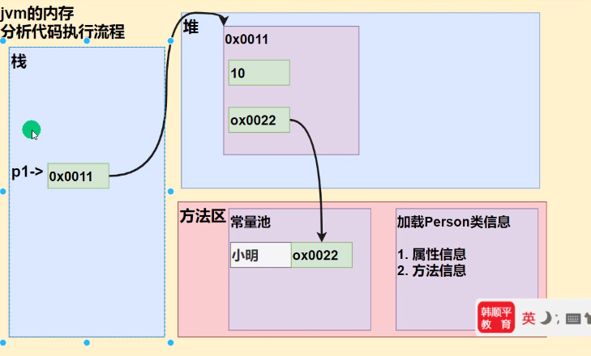
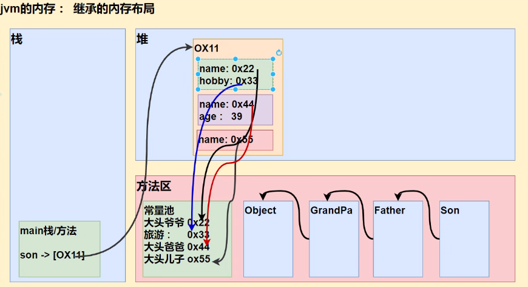

# 5. Class

class 是创建object的模板，object是class的一个实例

object都是reference type

在Java中，所有function都必须定义在class中，称为method

## 5.1 基本语法

### 5.1.1 定义类

java中每个class应该单独在一个文件中，一个文件中只允许有一个public类

java中类、属性和方法都应该有范围修饰符，但是类的访问修饰符只能是 默认或者public

属性有默认值，默认值和该数据类型对应的数组相同

```java
public class Test{
    public String text; // Field
    
    public void setTest(String text){ // method
        this.text = text;
    }
}
```

### 5.1.2 实例化object

```java
Test test1 = new Test();
// 或者
var test1 = new Test; // 简写形式，编译器会根据等号右边确定var具体是什么类型
```

### 5.1.3 get/set方法

在类中应当将field设置为private，提供get/set方法来让外界对field进行操作

```java
public class Employer{
    // 选中变量名按下alter+enter即可自动补全getter和setter方法
    private int salary;
    
    public int getSalary(int salary){
        this.salary = salary;
    }
    
    public int setSalary(){
        return salary;
    }
}
```

### 5.1.4 构造器constructor

构造函数与类同名

```java
public class Employer{
	public Employer(int salary){
        setSalary(salary);
    }
    public Employer(){
        this(0);
    }
}
```

在构造函数中可以通过`this()`调用构造函数，可以用在构造函数重载时调用另一个重载版本

可以在构造函数中通过`super()`调用父类构造函数

在一个构造器中以上二者只能选择一个进行调用

## 5.2 内存模型

### 5.2.1 创建对象

```java
class Person {
    String name;
    int age = 90;
}
```

`Person p = new Person();`

1. 先加载类的信息：包括属性信息和方法信息

   一个程序中只会加载一次类的信息

2. 在堆中为对象分配空间

3. 默认初始化：将成员属性先初始化为默认值

   name初始化为null，age初始化为0

4. 显式初始化：如果成员属性定义时有初始值，再进行显式初始化

   把age初始化为90

5. 构造器初始化：调用构造器，为属性进行初始化

6. 把对象在堆中的地址返回给栈中的变量



## 5.3 构建类的原则

### 5.3.1 封装Encapsulation

封装性指：

- 应该将field和操作它们的method封装在一个类中，而不是把它们作为参数传来传去

- 应该将field封装起来，在类外不能直接接触。

  将field的修饰符设置为private，再额外设置get/set方法来修改/获取field的值

### 5.3.2 Abstraction

Reduce complexity by hiding unnecessary details

没有必要将所有field都提供面向外界的接口（get/set方法），而应该尽量隐藏内部的具体实现

### 5.3.3 coupling

The level of dependency between classes

如果class A需要使用classB，我们说a is dependent or coupled to b

当一个类做修改时，与它有联系的类应该能继续正常使用，而不必修改与它有联系的所有类

所以要尽量减少类暴露出的接口，也就是尽量减少public method。暴露出的接口尽量不能修改用法。

修改一个类不仅需要修改其他类中的代码，还会重新编译用到该类的所有文件，所以应该尽量避免类之间的相互依赖

## 5.4 类中的修饰符

### 5.4.1 static

Java类中有两种fields和method

一种是属于instance的

一种是属于class的，即static member

一般用于所有instance共享，不单独属于某个对象的数据，比如创建实例的数量

```java
public class Employee{
    public static numberOfEmployees = 0;
    public Employee(){
        numberOfEmployee++;
    }
    
    public static void printNumber(){
        sout(numberOfEmployees);
    }
}

Employee.numberOfEmployees;
```

静态方法中只能访问静态成员

静态成员可以直接用类名访问，而无需实例化一个对象

因此Main方法定义为static，是的Java Runtime可以直接执行程序而不用再实例化一个Main对象出来

在工具类或者java内置库（library中），有很多静态方法

### 5.4.2 访问修饰符

- private：类外部不可访问，不可被继承。

  这里要注意，类内部可以访问 同类对象 的所有私有属性

  ```java
  class Student{
      private int val;
      public boolean equals(Object obj) {
          Student s = (Student)obj;
          return this.val == s.val;
          // 这里虽然obj是从外部传入进来的，但是强转为Student类型之后
          // 依然可以在Student类内部直接访问到它的私有属性val
      }
  }
  ```

- 默认：不加任何修饰符就是默认，在同类和同包中能被访问

- protected：在同类、同包、子类中可以被访问

- public：类外可访问，可继承

## 5.5 方法

### 5.5.1 方法重载

当方法实现的功能相同，只是参数的类型不同时，可以使用重载

方法可以被重载overloading

相同函数名不同参数即可实现重载，对返回类型和修饰符无要求

constructor也可以重载

### 5.5.2 可变参数

当方法实现的功能相同，每个参数的类型都相同，只是参数的个数不同时，可以用可变参数

**语法规则**

- `变量类型...`表示可变参数

  比如`int...`表示可以接收0个或任意多个int，也可以直接接收一个int数组

- 可变参数可以和普通参数一起使用，但是可变参数必须放在参数列表的最后

  并且参数列表中最多只能出现一个可变参数

- 方法内使用可变参数时，可以当作数组来使用

```java
public int sum(int... nums) {
    int result = 0;
    
    for (int i = 0; i < nums.length; i++) 
        result += nums[i];
    // 或者
    for (int num : nums) 
        result += num;
    
    return result;
}
```

## 5.5 需要重写的method

所有class都默认继承Object类，在Object类中定义了一些方法如果用到的话需要重新实现功能

### 5.5.1 hashCode

Object中的实现是，根据当前instance的地址，计算出一个hashcode，用于判断两个instance的引用是否指向同一个地址

`instance.hashCode();`

**重写hashcode**

可以重写为根据instance中的某些值计算hashcode

```java
@Override
public int hashCode(){
    return Objects.hash(val); // hash函数可以接收任意数量个参数
}
```

### 5.5.2 equals

默认是根据hashcode判断两个instance地址是否相同，可以重写为根据自定义信息判断，比如内容

`instance1.equals(instance2);`

**重写equals：**

可以直接打开generate菜单（alt+insert）自动生成

```java
@Override
public boolean equals(Object obj){ // 参数类型必须是Object
    if (this == obj) 
        return true;
    if (! obj instanceof ClassName)
        return false;
    
    var other = (ClassName) obj;
    return obj.val == this.val;
}
```

### 5.5.3 toString

`instance.toString();`

将instance转换为String格式，打印instance时会默认调用该函数，默认返回

`com.sazer.ClassName@16进制hashcode`

可以重写为想要的打印格式

重写toString

```java
@Override
public String toString(){
    return this.val;
}
```

### 5.5.4 compareTo

compareTo用于比较两个对象的大小

**重写方法**

这个方法并没有定义在Object类中，而是在Comparable接口中，也就是说我们的自定义类要实现Comparable接口，再重写compareTo函数

compareTo的返回值遵循以下规则：

- 如果当前对象大于传入的对象，返回正数
- 如果相等，返回0
- 如果小于传入对象，返回负数

```java
public class User 
    implements Comparable<User>{
    private int value;
    
    @Override
    public int compareTo(User u){
        return this.value - u.value;
    }
}
```

**调用方法**

实现了Comparable接口的类可以使用排序函数进行排序，但是使用时不能使用比较运算符（> 、<、==）

```java
var user1 = new User(1);
var user2 = new User(2);

if (user1.compareTo(user2) < 0){
    sout("user1 < user2");
} 
else if(user1.compareTo(user2) == 0){
    sout("user1 = user2");
}
else{
    sout("user1 > user2");
}
```

### 5.5.5 finalize

当gc回收对象时，调用该对象的finalize方法，因此可以在该方法中写一些释放资源的操作（在实际开发中几乎不会重写该方法）

```java
@Override
protected void finalize() {
    
}
```

# 6. 继承

## 6.1 基本语法

```java
public class Base{
    int val;
    public Base(int val){
        this.val = val;
        sout("Base");
    }
}

public class Derived extends Base{
    public Derived(){
        super(0);
        sout("Derived");
    }
}

var derived = new Derived();
```

Java不支持多继承

### 6.1.1 访问权限

子类继承了父类中所有属性和方法，但是无法直接访问父类中的私有方法和属性

### 6.1.1 constructor

创建子类对象时会先调用父类的constructor再调用子类的constructor

在子类构造器中可以使用`super()`调用父类构造函数，但是必须放在构造器的第一行，即使不写也会在第一行默认调用`super()`。如果父类没提供无参构造器，那必须手动声明调用哪个构造器，否则编译出错

`super()`和`this()`都必须放在构造器的第一行，因此二者不能同时出现

### 6.1.2 overwrite 重写

**重写要求：**

- 重写时必须保证函数声明与父类完全相同（函数名、参数列表）

- 返回值类型要求保持一致，或者是父类函数返回值类型的子类（比如父类返回Object，子类返回String）

- 子类的重写方法不能缩小父类方法的访问权限

- 在函数上方加上`@Override`，java编译器会帮忙检查重写函数声明是否符合规范

```java
@Override
public String toString(){
    return text;
}
```

## 6.2 内存模型

*子类中会继承父类中的所有属性和方法*

```java
class GrandPa{
    String name = "大头爷爷";
    String hobby = "旅游";
}

class Father extends GrandPa{
    String name = "大头爸爸";
    int age = 30;
}

class Son extends Father {
    String name = "大头儿子";
}
```

### 6.2.1 创建对象

`Son son = new Son();`

这句话的执行过程：

1. 在方法区中加载类的信息

   加载顺序为（从先到后）：Object - GrandPa - Father - Son

2. 在堆中为Son对象开辟空间

3. 在Son的空间中，首先创建GrandPa中的属性

   name = "大头爷爷";   hobby = "旅游";

4. 在Son空间中创建Father中的属性

   name = "大头爸爸" age = 39;

5. 在Son空间中创建Son中的属性

   name = "大头儿子";

6. 将Son在堆中的地址返回给栈中的变量



### 6.2.2 访问属性规则

当在子类中访问某个属性时：

1. 先在子类中寻找是否存在，如果存在直接返回

2. 如果子类中没有，去父类中寻找。如果找到就停止；找不到继续向上寻找

   如果找到，即使没有权限访问也会返回，只不过会报错。

   也就是说，假如GrandPa中有`public int age;` Father中有`private int age;` 。 如果用son访问age，那么会报错 `'age' has private access in Father`

### 6.2.3 super

super代表父类引用，用于访问父类的属性、方法、构造器

可以通过`super.属性` 和 `super.方法` 来取得父类及所有祖先类中的属性和方法（就近原则，查到后直接停止不再继续向上查找），但是只能访问非私有的属性和方法

作用其实是跳过子类，即直接从父类开始寻找，之后不断向上寻找。如果子类本来就没有该属性和方法，那不加super也会去找父类中的属性和方法

## 6.3 polymorphism多态

函数的重载和重写也是一种多态，称为函数的多态，这小节主要讲对象的多态

### 6.3.1 多态本质

对象多态的本质就是，一个对象的编译类型的运行类型可以不一致

- 编译类型看等号左边，运行类型看等号右边

  `Animal animal = new Dog();`

  animal的编译类型是Animal，运行类型是Dog

- 编译类型在定义对象时就确定了，不能改变；但是运行类型可以改变

  `animal = new Cat();`

  animal的编译类型一直是Animal，但是在运行过程中，运行类型可以变为Cat

- 获取属性：属性的值完全看编译类型，属性没有重写之说

  ```java
  class Base {
      int count = 10;
  }
  class Son{
      int count = 20;
  }
  Base b = new Son();
  sout(b.count); // 输出10
  ```

- 执行函数：当父类引用指向子类变量时，执行的是子类重写的函数

  或者说，执行哪个函数由运行类型决定

```java
public class Shape{
    public void render(){
        cout << "render a shape" << endl;
    }
}

public class Round extends Shape{
    @Override
    public void render(){
        cout << "render a round" << endl;
    }
}

public class Rectangle extends Shape{
    @Override
    public void render(){
        cout << "render a round" << endl;
    }
}

Main:
Shape[] shapes = {new Round(), new Rectangle};
for (var shape : shapes){
    // 这里会根据实际类型调用不同的render函数
    shape.render();
}
```

### 6.3.2 向上转型

多态可以实现的一个前提是，父类引用可以指向子类对象，即向上转型

向上转型是自动完成的

`Father f = new Son();`

**向上转型调用方法的规则**

- 编译阶段：

  f只能调用父类中的所有成员，不能调用子类中的特有成员，因为能调用哪些成员是在编译阶段决定的，这时候只能看见编译类型。

- 运行阶段：

  在实际运行中调用方法时，是从运行类型开始向上寻找的，所以实际运行时调用的是子类的实现

**向下转型**

将父类引用强制转换为子类类型，必须使用强制转换

`Cat cat = (Cat) animal;`

父类引用必须指向的是cat对象，否则编译能通过，但是运行时会报错（Class Cast Exception）

向下转型之后就能调用子类的所有成员

### 6.3.3 动态绑定机制

动态绑定规则针对的是类内部的方法  在调用类的其他方法和属性时的规则

1. 在类内部的方法中 调用对象方法时，该对象方法会和该对象的内存地址/运行类型绑定

   即 调用方法就看运行类型，调用运行类型中定义的方法

2. 当调用对象属性时，没有动态绑定机制，在哪个方法中调用的对象属性，就在哪个方法所在的类中直接取值

   即 调用属性遵循就近原则

示例：

```java
class A{
    public int i = 10;
    public int sum() {
        return getI() + 10;
    }
    public int sum1() {
        return i + 10;
    }
    public int getI(){
        return i;
    }
}

class B extends A {
    public int i = 20;
    public int getI() {
        return i;
    }
}

A a = new B();
```

- `a.sum()` —— 30

  a的运行类型是B

  调用sum函数时，由于B中没有定义sum函数，因此要调用A中的sum函数

  A中的sum函数调用了getI()函数。由动态绑定规则，getI()函数绑定的是运行类型，因此调用的是B中的getI()函数

  B中的getI()函数直接访问 i 属性，获取i的值为20，因此最终A的sum函数结果是20 + 10 = 30

- `a.sum1()` —— 20

  A中的sum1()函数直接获取的 i 值， 由于属性没有动态绑定，因此在A中函数访问的属性就是A中的属性，因此取得的 I 值为10，最终sum1()函数结果是20

# 7. 类中的其他知识

## 7.1 static

### 7.1.1 静态变量

用static关键字修饰的变量称为静态变量，或者类变量。

该变量会被类的所有实例共享，可以通过 任意一个对象 或者 类名 访问

static变量在类加载到常量池中的时候就生成了，所以访问时不需要创建类的实例

### 7.1.2 静态方法

静态方法也叫类方法

```java
class A {
    public static test() {
        sout("test");
    }
}

A.test();
```

- 静态方法不能访问普通属性（对象属性），只能访问静态属性或者静态方法
- 静态方法中不能使用this或super

- 普通方法可以访问静态属性

### 7.1.3 单例设计模式

单例模式是static的经典运用

类的单例设计模式，就是采取一定的方法保证在整个程序运行的过程中，对某个类只能存在一个对象实例

**实现思路**

1. 构造器私有化
2. 在类的内部创建对象
3. 向外暴露一个静态的公共方法`getInstance`用于获取该类的实例

**饿汉式**

在类开始加载时就直接创建实例对象，也就是说可能还没用到实例就已经创建完毕了，可能会造成资源浪费

不存在线程安全问题，即是线程安全的

```java
class SingleFactory{
    
    private String name;
    
    // 2. 在类的内部创建对象
    private static SingleFactory sf = new SingleFactory("唯一实例");
    
    // 1. 构造器私有化
    private SingleFactory(String name) {
        this.name = name;
    }
    
    // 3. 提供一个公共静态方法，返回内部创建的对象
    public static SingleFactory getInstance() {
        return sf;
    }
}
// 无论调用几次返回的都是同一个实例对象
SingleFactory sf = SingleFactory.getInstance(); 
```

**懒汉式**

只有需要获得实例的时候才开始创建实例，也就是说只有调用getInstance方法时才会创建实例对象

是线程不安全的，在getInstance的判断处可能发生多个线程同时通过判断

```java
class Hungry {
    private String name;
    private static Hungry hungry;
    
    private Hungry (String name) {
        this.name = name;
    }
    
    public static getInstance() {
        if (hungry == null) {
            hungry = new Hungry("唯一实例");
        }
        return hungry;
    }
}

Hungry h = Hungry.getInstance();
```

## 7.2 main方法

```java
public static void main(String[] args) {
    
}
```

- public：java虚拟机需要调用类的main()方法，因此访问权限必须是public

- static：java虚拟机在执行main()方法时应该不必创建对象，所以该方法必须是static

- args：在调用java程序时可以传入一些参数

  在命令行传入参数：

  `javac Hello.java` 编译

  `java Hello a b c` 运行时可以传入参数，传入后是字符串数组的形式

  在idea中传入参数

  点击 运行 debug 按钮 右边的三个点，选择 Run with Parameters

## 7.3 代码块

### 7.3.1 基本语法

```java
[修饰符]{
    代码
}
```

代码块会在创建对象时隐式调用，每创建一个对象执行一次

代码块调用顺序先于代码块

可以看作是构造器的补充

### 7.3.2 静态代码块

代码块的修饰符只能是static，没有访问修饰符

用static修饰的代码块称为静态代码块，作用是对类进行初始化，随着类的加载而执行，并且只会执行一次

静态代码块只能调用静态成员，普通代码块可以调用任意成员

### 7.3.3 创建对象时执行顺序

1. 调用静态代码块和静态属性初始化

   这两个优先级一样，根据定义顺序调用

2. 调用普通代码块和普通属性初始化

   优先级一样，按照定义顺序调用

3. 调用构造方法

也可以理解为，构造器第一行默认调用super()，第二行默认隐式调用代码块

**示例：**

```java
class A {
    private static int n1 = getVal(); // 静态属性初始化
    private int n2 = getVal1(); // 普通属性初始化
    // 普通代码块
    {
        sout("普通代码块被调用");
    }
    // 静态代码块
    static {
        sout("静态代码块被调用");
    }
    
    public static int getVal(){
        sout("静态属性初始化");
        return 1;
    }
    public int getVal1(){
        sout("普通属性初始化");
        return 2;
    }
    public A {
     	sout("构造器被调用");   
    }
}
```

`A a = new A();`

输出顺序：

1. 静态属性初始化
2. 静态代码块被调用
3. 普通属性初始化
4. 普通代码块被调用
5. 构造器被调用

### 7.3.4 考虑继承关系后的执行顺序

 假设有类A，类B继承于A

`B b = new B();`

1. 执行父类的静态代码块和初始化静态属性

   由于要先从父类到子类依次加载类的信息，因此加载父类的信息时就会执行该部分

2. 子类的静态代码块和静态属性

   加载子类信息时执行该部分

3. 父类的普通代码块和普通属性初始化

4. 父类的构造方法

5. 子类的普通代码块和普通属性初始化

6. 子类的构造方法

## 7.4 final关键字

**final修饰类**

用final修饰的类不可以被继承

包装类（Integer、Double、Boolean等）和String类都是final类，不可以被继承

**final修饰方法**

用final修饰的方法不可以被重写

**final修饰属性**

用final修饰的属性不可以被修改，也就是变成常量，常量的命名一般用大写字母

final修饰的属性可以在三个地方被初始化：

1. 定义时
2. 在构造器中
3. 在代码块中

final修饰的静态属性只能在两个地方被初始化：

1. 定义时
2. 在静态代码块中

final 和 static搭配使用会使效率变高，因为底层编译器做了优化，这样不会导致类的加载

```java
class Demo {
    public static final int PI = 3.14;
}

// 本来访问静态变量时会加载类的信息，但是再加上final修饰就不会加载类的信息了
int i = Demo.PI;
```

**final修饰局部变量**

final修饰的局部变量必须定义时赋初值，之后值不可以被修改

相当于定义常量

## 7.5 abstract关键字

当父类中有不知道如何实现的方法时，可以用abstract关键字修饰该方法，让子类继承并实现该方法

abstract修饰的方法只有声明没有函数体，含有abstract方法的类也必须用abstract修饰，是抽象类

抽象类无法实例化对象，继承抽象类的子类必须实现所有抽象方法，除非该子类也是抽象类

抽象方法不能用private、final、static来修饰，因为这些关键字和重写相违背

```java
abstract class A {
    public abstract void func(){}
}
```

# 8. Interfaces

use interface to build loosely-coupled, extendible, testable applications

在interfaces中没有对函数的代码实现，只有函数声明来定义class的规范，具体的实现交给继承Interface的class。所以Interface不能实例化。

也就是说Interface定义What should be done，Class定义How it should be done。

不同与class，interface可以实现多继承，因为这样不会造成歧义。


A完全不知道B的存在，如果哪天B有问题，那直接随便换一个能实现Interface的类就可以了

## 8.1 创建Interface

**创建interface**

在左侧目录树中右键 - 创建class - Kind中选择Interface

在Java中Interface一般用Can开头，比如`CanCalculator`，或者第一个单词用`able`结尾的形容词

**接口中的方法默认是public abstract**

- public：由于interface中的所有函数都应该被其他类实现，因此所有函数都得是public
- interface：interface本身就无法被实例化，用于定义规范，所以其中的方法都应该是abstract

**接口的继承**

接口之间可以实现继承，并且一个接口可以继承多个接口

**实现Interface**

- 的类要使用`implements`关键字
- 实现interface需要实现其中的所有抽象方法，但是抽象类实现接口可以无需实现
- 一个类可以同时实现多个接口

```java
public interface CanTexCalculator{
    double calculateTax();
}

public class TaxCalculator2023 extends Object implements CanTexCalculator{
    int income;
    
    public TaxCalculator2023(int income){
        this.income = income;
    }
    
    @Override
    double calculateTax(){
        return 0.4 * income;
    }
}
```

## 8.2 Dependency Injection

如果一个类中需要使用到接口，那么它会需要一个接口类的对象，但是它不应该负责实例化 这个对象，因为它都不应该知道接口具体是由哪个类实现的，也没办法实例化。所以这个对象应该由外部传进去，称为Dependency Injection

即 将具体使用的对象使用dependency injection的方式直接注入使用接口的类中，即依赖传递，把实现功能依赖的东西传递进去

### 8.2.1 constructor injection

在constructor函数中直接传入实例化好对象

```java
public class TaxReport{
    // TaxReport只知道接口的存在，而不知道具体实现
    private CanTexCalculator calculator;
    
    public TaxReport(TaxCalculator calculator){
        this.calculator = calculator;
    }
}

Main:
var calculator = new TaxCalculator2023(10_000);
// 到明年，可以直接把第一行代码换为 new TaxCalculator2024(10_000); 
// 而对TexReport类不会有任何影响
var report = new TaxReport(calculator);
```

当有很多类用到大量接口时，我们不可能在main函数中一个一个手动创建实例化对象并使用constructor injection，所以会用到一些专门负责这个的框架，比如Spring

### 8.2.2 setter injection

设置一个setter函数来传入实例化好的对象

这样做的好处是在函数执行过程中依然可以更改实例化对象

```java
public class TaxReport{
    // TaxReport只知道接口的存在，而不知道具体实现
    private CanTexCalculator calculator;
    
    public TaxReport(CanTaxCalculator calculator){
        this.calculator = calculator;
    }
    
    public void setTexCalculator(CanTaxCalculator calculator){
        this.calculator = calculator;
    }
}
```

### 8.2.3 Method Injection

在要用到接口的函数中，现传入一个实例化对象，随用随传

```java
public class TexReport{
    public double show(CanTaxCalculator calculator){
        var tax = calculator.calculateTax();
        sout(tax);
    }
}

Main:
var report = new TaxReport();
report.show(new TaxCalculator2018());
report.show(new TaxCalculator2019());
```

## 8.3 Segregation Principle

Divide big interfaces into smaller ones

这样当interfaces需要改变时，可以将影响降低到最小

**比如一个接口：**

```java
public interface UIWidget{
    void drag();
    void resize(int size);
    void render();
}

// 当一个类只是用drag功能时
public class Dragger{
    public void drag(UIWidget widget){
        widget.drag();
    }
}
```

当UIWidget类中的resize函数发生修改时，虽然表面上看影响不到Dragger类的使用，但是其实会recompile and rebuild所有用到了UIWidget接口的地方

**应该分成下面几个接口：**

注意分开之后每个interface都要在单独的文件中

```	java
public interface Draggable{
    void drag();
}

public interface Resizeable{
    void resize(int size);
}

public interface UIWidget 
    extends Draggable, Resizable{
    void render();
}
```

## 8.4 Interfaces新特性

大多是都是bad features，尽量不要使用

### 8.4.1 fields

在Interfaces中可以定义fields，不过它默认且必须是 public static final，且必须初始化

也就是说Interface中定义的属性都是常量

### 8.4.2 static method

Intefaces中可以定义static method，并且这些method中可以有实现

```java
public interface TaxCalculator{
    static double getTaxableIncode(double income, int expenses){
        return income - expenses;
    }
}
```

如果真的所有实现该接口的类都要用到这个函数，那就定义一个抽象类实现这个函数，再让所有类继承这个抽象类

### 8.4.3 private method

Interferce中可以定义private method，这种方法不能被重写

### 8.4.4 默认方法

默认方法可以有实现，用default关键字修饰

```java
default public void func() {
    sout("func......");
}
```

### 8.4.4 summary

在加入这些奇怪的features之后，interface和abstract class的界限越来越不清晰，并且很多编程者滥用interface去实现多继承。

## 8.5 接口多态特性

类型为接口的变量引用可以指向实现接口的类的对象

```java
interface I {}
class A implements I{}

I i = new A();
```

**接口的多态传递**

如果A实现了接口I2，而I2继承于接口I1，那么相当于A也实现了接口I1

```java
interface I1{}
interface I2 extends I1{}
class A implements I2{}

I1 i = new A();
```

# 9. 内部类

一个类的内部又完整的嵌套了另一个类结构，被嵌套的类称为内部类（inner class），嵌套其他类的类称为外部类（outer class）

内部类最大的特点就是可以直接访问私有属性，并且可以体现类与类之间的包含关系

```java
class Outer { // 外部类
    class Inner { // 内部类
        
    }
}
```

**内部类的分类**

- 定义在局部位置（比如在方法内定义）
  - 局部内部类
  - 匿名内部类（没有类名）
- 定义在成员位置
  - 成员内部类
  - 静态内部类（static修饰）

## 9.0 内部类公共属性

内部类本质还是一个类，支持继承

内部类的地位由定义位置决定

- 定义在局部位置就是局部变量，不能用访问修饰符修饰
- 定义在成员位置就是成员变量，可以用任意访问修饰符修饰

### 9.0.1 内部类访问外部类成员

内部类可以直接访问外部类的所有成员，包括私有成员

**当内部类和外部类变量名相同时**

如果内部类和外部类有相同变量，那么在内部类中访问该变量会遵循就近原则，也就是访问内部类中的变量

如果想要访问外部类中的同名变量，需要使用`外部类名.this.变量名`

比如`Outer.this.n1`

### 9.0.2 外部类使用内部类

局部内部类的作用域，仅仅在定义它的方法或代码块中

成员内部类的作用域就在定义的类中（但是类外也可以访问）

**访问方式**

创建内部类的对象并调用其中的方法

外部类中也可以访问内部类的私有成员

## 9.1 局部内部类

```java
public class A {
    private int n1 = 100;
    private void func(){}
    public void func1() {
        class Inner{ // 局部内部类
            private int n1 = 800; // 和外部类变量重名
            public void innerFunc() {
                sout(n1); // 可以使用私有属性
                func(); // 可以调用私有方法
                int innerN1 = n1;
                /*************内部类和外部类变量名相同时**************/
                int innerN2 = A.this.n1;
            }
        }
        
        /************使用方式*****************/
        Inner inner = new Inner();
        inner.innerFunc();
        
        class Inner2 extends Inner{
            
        }
    }
}
```

## 9.2 匿名内部类

定义在外部类的局部位置（方法内部），有几个很重要的特征

1. 本质还是一个类，并且是内部类
2. 这个类没有名字
3. 这个类同时还是一个对象


匿名内部类用于简化开发。

一般是需要一个实现了某个接口的类的对象，但是这个实现接口的类又只需要用一次，这时就可以用匿名内部类

```java
new 类或接口(参数列表) {
    类体
};
```

### 9.2.1 基于接口

基于接口的匿名内部类是实现接口

```java
interface IA {
    void func();
}

class Outer {
    public void method(){
        /*******匿名内部类**********/
        IA ia = new IA(){
            @Override
            public void func(){
                sout("该方法由匿名内部类实现");      
            }
        };
        ia.func();
        ia.func();
        ia.getClass();
    }
}
```

- 匿名内部类在底层是有名字的，只是这个名字无法使用

  `ia.getClass()` 输出 `Outer$1`即Outer类中的1号匿名内部类

  ia对象编译类型为IA，运行类型为Outer$1

- 该匿名内部类只能使用一次，意思是它只能创建一个对象

  但是它创建出来的对象可以在作用域内一直使用

### 9.2.2 基于类

基于类的匿名内部类是继承类

```java
class Father {
    String name;
    public Father (String name) {
        this.name = name;
    }
    public void test(){
        sout("Father类中的原本的test方法");
    }
}

class Outer {
    public void method(){
        Father father = new Father("jack"); // 这是一个正常的Father对象
        /*******匿名内部类**********/
        Father fatherInner = new Father("jack"){ // 这是一个匿名内部类
            @Override
            public void test(){
                sout("匿名内部类中重写的test方法");
            }
        };
    }
}
```

- fatherInner的运行类型为Outer$2

- 创建匿名内部类时参数列表中的参数会传给构造器

- 基于类的匿名内部类实际上是继承于那个类，所以可以用super

  这个匿名内部类有点相当于以下写法

  ```java
  class Outer$2 extends Father {
      @Override
      public void test(){
          
      }
  }
  ```

## 9.3 成员内部类

```java
class Outer {
    class Inner { // 成员内部类
        
    }
}
```

- 成员内部类可以直接访问外部类的所有成员，包含私有的

- 可以添加任意访问修饰符（public protected 默认 private），因为它就是一个类中的成员

**使用内部类**

在外部类中创建内部类的对象即可使用

外部类中可以访问内部类的私有成员

### 9.3.1 其他类使用内部类

```java
class Main {
    public static void main (String[] args) {
        
    }
} 
    
class Outer {
    class Inner {
        
    }
}
```

假如在Main类main方法中中要直接使用Inner类的对象

**方式一**

先创建一个外部类的对象

再用外部类的对象创建内部类对象

```java
Outer outer = new Outer();
Outer.Inner inner = outer.new Inner();
```

可以使用匿名对象简写为：

```java
Outer.Inner inner = new Outer().new Inner();
```

**方式二**

在Outer类中写一个返回Inner类对象实例对象的方法

```java
class Outer {
    class Inner {
        
    }
    public Inner getInnerInstance() {
        return new Inner();
    }
}

Outer outer = new Outer();
Outer.Inner inner = outer.getInnerInstance();
```

### 9.3.2 静态内部类

用static修饰的成员内部类就是静态内部类

只可以访问外部类中的静态成员

```java
class Outer {
    static class Inner {
        
    }
}
```

**外部类使用内部类**

外部类访问静态内部类时依然要创建对象，因为只是这个内部类是静态的，意味着外部类中的静态方法也可以访问到这个内部类，但是内部类里面的成员不一定是静态的。

**其他类访问内部类**

由于是静态成员，因此无需创建外部类对象，而可以直接用外部类名创建静态内部类对象

```java
Outer.Inner inner = new Outer.Inner();
```

也可以在外部类中写 方法 或者 静态方法 获取内部类对象

# 10. 反射reflection

 反射机制是为了实现设计模式的ocp原则（开闭原则），即在不修改源码的情况下，通过外部配置文件来修改程序功能

## 10.0 QuickStart

比如实现以下功能：

根据`re.properties`配置文件信息，创建指定对象并调用指定方法

```
classfullpath=com.sazer.Cat
method=hi
```

这里就需要使用反射机制解决

```java
class Cat{
    String name = "招财猫";
    public void hi() {
        sout("Hi~" + this.name);
    }
}

__main__:
// 假设已经读取properties配置文件拿到类名和方法名
String classfullpath = "com.sazer.Cat";
String method = "hi";

// 1. 通过类名加载类
Class cls = Class.forName(classfullpath);
// 2. 通过加载好的cls类获取一个该类的对象实例
Object o = cls.new Instance(); // 此时对象o的运行类型是Cat
// 3. 通过加载好的cls类获取类中的方法对象 （在反射中，方法也视为对象）
Method method = cls.getMethod(methodName);
// 4. 调用method方法
method.invoke(o); // 不同于传统的 对象.方法(),反射机制调用形式为 方法.invoke(对象)
```

## 10.1 反射机制

### 10.1.1 反射基本概念

**反射概念**

反射机制允许程序在**执行期间**取得任何类的内部信息（成员变量、构造器、成员方法等），并能获取和使用该类的实例。反射在设计模式和框架底层都会用到

**反射底层**

加载完一个类之后，在堆中会产生一个与该类唯一对应的Class类型的对象。在这个对象中就包含了类的完整结构信息。

反射机制就是根据类对应的Class对象来获取类的结构，并能根据这个Class对象来创建对应类的实例。

**反射能实现的功能**

- 在运行时判断任意一个类型所属的类
- 在运行时构造任意一个类的对象
- 在运行时得到任意一个类所具有的成员变量和方法
- 在运行时调用任意一个对象的成员变量和方法
- 生成动态代理

**反射功能相关类**

- `java.lang.Class`  代表一个类 （实际上是一个类加载后在堆中的对象）
- `java.lang.reflect.Method` 代表类的方法
- `java.lang.reflect.Field` 代表类的成员变量
- `java.lang.reflect.Constructor` 代表类的构造方法

**优缺点**

优点：动态创建和使用对象，是框架的底层核心，使用灵活

缺点：反射就是解释执行，对执行速度有影响。可以通过关闭访问检查稍作优化

### 10.1.2 反射本质——Class对象

在类加载的过程中会在堆区创建该类对应的Class对象，反射就是通过这个Class对象得以在程序运行过程中获取到类的各种信息

Class对象有以下特点：

1. Class类的对象不是new出来的，而是在类信息加载入方法区的时候由类加载器（ClassLoader）通过loadClass方法创建的。Class对象存放在堆上

   ```
   类对应的Class对象存放在堆上，是加载类之后的最终产品，其中存储了类中的所有信息并可以在运行过程中被获取到
   
   加载在方法区中的是类的元数据，也就是类的字节码二进制数据，也就是将编译后产生的.class字节码文件中的内容加载到方法区
   其中存储了类的方法代码，类中变量名、方法名、访问权限、返回值等信息
   ```

   在new对象或者通过反射创建对象时打断点，都可以发现调用了loadClass方法来加载这个类（第一次创建该类对象时）

   ```java
   Cat cat = new Cat(); // new一个Cat类的实例
   Class aClass = Class.forName("com.sazer.Cat"); // 通过反射获取Cat类对应的Class对象
   // 注意只有第一次创建对象时才会加载类，才会调用到loadClass方法，因此这两行要单独执行才能看到loadClass，不能一起执行
   ```

   ```java
   public Class<?> loadClass(String name) throws ClassNotFoundException {
       return loadClass(name, false);
   }
   ```

2. 在一个程序中类只会加载一次

3. 每个类的实例都记得它是属于那个类的

   即可以通过类的实例 获取该类对应的Class对象

4. 类（外部类、内部类）、接口、数组、注解、枚举、基本数据类型、包装类、void、Class类本身都有相应的Class对象

### 10.1.3 反射暴破

Constructor、Field、Method类都继承于AccessibleObject类，可以被修改访问性

也就是说获取到类中的私有构造器、属性、方法对象之后，本来是不能被访问、修改或者调用的，但是可以通过修改它们的访问性来强行使用，这个就称为暴破

`public void setAccessible(boolean flag);` 传入true即为可访问（注意这里只是让该对象可访问，类中原本的访问修饰符不会受到影响）

## 10.2 常用类及方法

### 10.2.1 Clasa类

**获取Class对象**

获取Car类对应的Class对象

- 根据全类名字符串获取

    ```java
    Class<?> cls = Class.forName("com.sazer.Car");
    // <?>通配符表示该泛型不确定，可以是任意类型
    ```
    
    多用于从外部配置文件动态读入类名来加载指定类

- 类名.class

  ```java
  Class cls = Car.class;
  ```

  用于参数传递，比如当函数参数需要一个Class对象

- 对象实例.getClass()

  得到的是对象的运行类型对应的Class对象

  ```java
  Car car = new Car();
  Class cls = car.getClass();
  ```

  通过对象实例获取它的类型

- 通过类加载器ClassLoader获取

  每个类对应一个单独的类加载器

  1. 得到类加载器

     ```java
     ClassLoader carLoader = Car.getClassLoader();
     ```

  2. 通过类加载器得到Class对象

     ```java
     Class cls = carLoader.loadClass("com.sazer.Car");
     ```

**打印Class对象**

直接打印cls对象，打印出的是该cls对象是哪个类的Class对象

```java
sout(cls); // 打印出的是 com.sazer.Car
```

注意：这里不是说cls是Car类型的对象，cls是Car类对应的Class类型的对象

cls是Class类型的对象可以通过`cls.getClass()`看到，返回是java.lang.Class

**获取类的信息**

- 获取包名

  ```java
  cls.getPackage().getName();
  ```

  返回String类型 `"com.sazer"`

- 获取全类名：包名+类名

  ```java
  cls.getName();
  ```

  返回String类型 `"com.sazer.Car"`

**创建类的实例**

创建Class对象对应的类的实例

```java
Car car = (Car)cls.newInstance();
```

### 10.2.2 Constructor类

类中每个不同的构造器都对应一个Constructor对象，通过Constructor对象可以用相应的构造器创建类的实例

```java
package com.sazer.A

public class A{
	public User() {}
    
    public User(String name) {}
    
    private User(int age, String name) {}
}

...main...
Class classA = Class.forName("com.sazer.A");
```

**获取相应构造器对象**

- 获取无参构造器

  `Constructor<?> constructor0 = classA.getConstructor();` 

- 获取有参构造器

  `Constructor<?> constructor1 = classA.getConstructor(String.class);`

- 获取私有构造器

  `Constructor<?> contructor2 = classA.getDeclaredConstructor(int.class, String.class);`

**通过构造器实例化对象**

- public构造器

  `constructor1.newInstance("123");`

  newInstance方法中的参数就是该constructor对象对应的构造器的参数

- private构造器

  需要先暴破

  ```java
  constructor.setAccessible(true);
  Object a = constructor2.newInstance(1, "123");
  ```

### 10.2.3 Field类

类中的每个属性都对应一个Field对象，通过属性对应的Field对象可以获取或修改某实例中该属性的值

```java
package com.sazer.A

public class A{
	public int age;
    public static double salary;
    private String name;
}

...main...
Class classA = Class.forName("com.sazer.A");
```

**获取Field对象**

- 获取public属性

  `Field age = classA.getField("age");`

- 获取static属性

  `Field salary = classA.getField("salary");`

- 获取private属性

  `Field name = classA.getDeclaredField("name");`

**通过Field对象获取和设置属性值**

- public属性

  ```java
  age.set(classA, 88); // 将对象classA的age属性设置为88
  int ageOfClassA = age.get(classA); // 获取classA对象的age属性值
  ```

- static属性

  操作static属性可以将对象指定为null

  ```java
  salary.set(null, 10000);
  int salaryOfClassA = salary.get(null);
  ```

- private属性

  需要先进行反射暴破

  ```java
  name.setAccessible(true);
  name.set(classA, "Tom");
  String nameOfClassA = name.get(classA);
  ```

### 10.2.4 Method类

类中的每个方法都对应一个Method对象，通过方法对应的Method对象可以调用该方法

```java
package com.sazer.A

public class A{
    public static void publicFunc(int num){
        
    }
    
    private String privateFunc(String str) {
        
    }
}

...main...
Class classA = Class.forName("com.sazer.A");
```

**获取Method对象**

第一个参数为函数名，后面的参数为该函数的参数列表中参数类型

- 获取public方法

  `Method publicFunc = classA.getMothod("publicFunc", int.class);`

- 获取private方法

  `Method privateFunc = classA.getDeclaredMethod("privateFunc", String.class);`

**通过Method对象调用方法**

invoke方法，第一个参数为调用该方法的对象，后面的参数为该方法对应的参数列表

- public方法

  ```java
  publicFunc.invoke(classA, 5);
  ```

- static方法

  static方法第一个参数可以填null

  ```java
  publicFunc.invoke(null, 1);
  ```

- private方法

  需要进行暴破

  ```java
  privateFunc.setAccessible(true);
  privateFunc.invoke(classA, "Hello");
  ```

## 10.3 类加载过程

### 10.3.1 静态加载与动态加载

之前学到的类的加载时机

- 通过new创建该类对象时
- 当子类被加载时，父类也要被加载
- 调用类中的静态成员时

都是静态加载，也就是在编译时就需要加载相关的类，即使运行过程中可能用不到，依赖性很强

而反射可以实现动态加载，也就是说运行过程中真的要用到类了，才会去加载这个类

**举个例子：**

```java
public static void main(String[] args) {
    Scanner scanner = new Scanner(System.in);
    System.out.println("请输入Key");
    String key = scanner.next();
    switch(key) {
        case "1":
            // 静态加载
            Dog dog = new Dog(); 
            dog.cry();
            break;
        case "2":
            // 反射动态加载
            Class cls = Class.forName("Dog");
            Dog dog = (Dog)cls.getInstance();
            Method cry = cls.getMethod("cry");
            cry.invoke(dog);
            break;
        default:
            sout("do nothing...");
    }
}
```

- 静态加载：

  由于并没有定义Dog类，因此在编译阶段case1部分就会报错

  但是实际上程序运行过程中可能用户根本不会输入1，Dog类可能从未被使用过，但是整个代码依然无法通过编译。

  也就是在编译时就要加载所有类，包括可能用不到的类，依赖性强

- 动态加载

  使用反射动态加载类时，程序可以通过编译（会有警告）

  只有当运行过程中用户输入2时，才会去加载Dog类并报错

  如果整个运行过程中都用不到该类，那程序也能正常运行，降低依赖性
