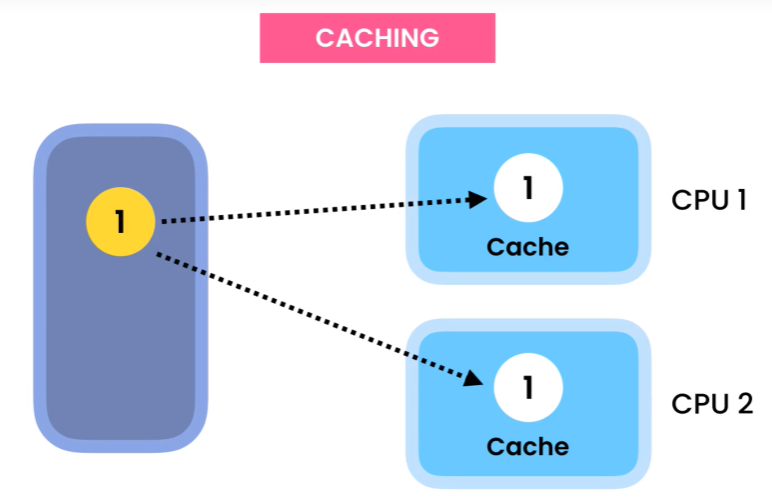

Generic 泛型

Java处理泛型使用的是Code sharing机制。编译器会在编译阶段进行类型擦除，即将所有泛型类型的实例都映射到一个唯一的字节码表示。而Java虚拟机根本不认识泛型语法，需要在编译阶段通过类型擦除的方式解语法糖。类型擦除的主要过程为，将所有的泛型参数用其最左边界（最顶级的父类型）类型替换，并移除所有的类型参数

也就是说，对于虚拟机，不存在`List<String>.class`和`List<Integer>.class`，只有`List.class`，因此前面两个泛型没有任何区别，因此泛型不能用于区分重载参数、不能用于catch语句的异常类中、同一个类不同泛型对应的静态变量是同一个

## 1.1 泛型类

```java
// 可以用任何字母，不过T和E比较常用
public class GenericList<T> {
    // 这里不能直接 new T[]
    private T[] items = (T[]) new Object[10];
    private int index;
    
    // 添加元素
    public void add(T item){
        items[count++] = item;
    }
    // 根据索引获取元素
    public T get(int index){
        return items[index];
    }
    // static静态方法和属性不能使用泛型
    
}

GenericList<Integer> intList1 = new GenericList<Integer>();

// 可以省略后面的Generic type argument
GenericList<Integer intList2 = new GenericList<>();
```

**注意事项**

- Reference Type

  Generic type argument在声明时只能传入reference type，所以primitive type要传入对应的wrapper class。

  但是当T指定好之后，可以将T直接视作对应的primitive type来使用，java compiler会自动拆装箱（Boxing/Unboxing）。

- 定义泛型时可以定义任意多个类型

  ```java
  class test<T, U, V, E>{
      
  }
  ```

- 底层

    编译过后，这些泛型在Bytecode中实际上都是Object类型，就是将类中的T都替换为Object，也就是类似下面这样

    ```java
    public class List{
        private Object[] items = new Object[10];
        private int count;
    
        public void add(Object item){items[count++] = item;}
        public Object get(int index) {return items[index];}
    }
    ```

    如果我们使用了类型限制或者通配符，那么这些T就会被替换为这个指定的bounded type，比如Number。如果有多个限制，则取声明在最左边的那个类，比如Comparable
    
- 不指定泛型

    不指定泛型时默认都是Object

    ```java
    class Test<T, U, V>{
        
    }
    
    Test test1 = new Test();
    与下面完全等价
    Test<Object, Object, Object> test2 = new Test<>();
    ```

## 1.2 泛型接口

泛型接口的具体类型应该由继承接口或者实现类来指定

```java
interface Usb<T>{
    // 接口中的属性都是静态属性，因此不能用泛型
    void connect(T t);
}

interface Usb1 extends IUsb<String>{}

class IUsb implements Usb<Integer>{}
```

## 1.3 泛型类型限制

可以将T的类型做限制，将T限制为某个类或接口，这样的话实例化类对象时就只能传入该类及其子类。

- 将T限制为数字类型

```java
public class GenericList<T extends Number> {
    private T[] items = (T[]) new Object[10];
}
```

- 将T限制为，可比较且可复制的类

```java
public class GenericClass <T extends Comparable & Cloneable> {
    
}
```

## 1.4 泛型方法

泛型方法既可以定义在普通类中，也可以定义在泛型类中

泛型方法调用时无需指定类型，直接传入参数即可，编译器会自动判断类型

- 普通类

  ```java
  public class Compare {
      
      public <T, R> void func(T t, R t){
          
      }
      
      public static <T extends Comparable<T>> max(T first, T second){
          // 这样写会报编译错误，因为不是所有类都能用比较运算符
          return (first > second) ? first : second;
          
          // 正确写法：
          return first.compareTo(second) > 0 ? first : second;
      }
  }
  
  // 使用时不用指定类型，直接传入值即可，但是要保证传入的值类型相同，java compiler会自动判断类型
  var max = Compare.max(1, 3);
  ```

- 泛型类

  ```java
  class Fish<T, R> {
      public void run(){}
      // 泛型方法
      public <U, M> void eat(U u, M m, T t) {
   		// 泛型方法中既能使用自己的泛型，也能使用类的泛型
      }
      // 普通方法
      // 这个用到了类的泛型，因此不是泛型方法
      public void func(T t){
          
      }
  }
  ```

## 1.5 泛型通配Wildcards ? 

**泛型不具备继承性**

```java
ArrayList<Object> list = new ArrayList<String>();
```

以上代码编译报错，这是因为泛型不具备继承性，也就是说虽然String是Object的子类，但是 `ArrayList<String> `不是 `ArrayList<Object>`的子类

在Bytecode中可以看见，编译过后泛型类中的T都被替换为Object，也就是说 `ArrayList<Instractor> `和 `ArrayList<User>`

其实都是`ArrayList<Object>`，那`ArrayList<Object>`当然不是自己的子类。

如果函数要求传入任意一个List对象，就要使用wildcar通配符

**wildcard**

wildcard就是`？`

现有C extends B extends A

- <?> ：表示接受任意泛型类型

  ```java
  List<?> list = new ArrayList<A>();
  List<?> list = new ArrayList<B>();
  List<?> list = new ArrayList<C>();
  ```

- <? extends B>：表示接受B类以及B类的子类，规定了泛型的上限

  ```java
  List<? extends B> list = new ArrayList<A>(); // 编译报错，因为A不是B的子类
  List<? extends B> list = new ArrayList<B>();
  List<? extends B> list = new ArrayList<C>();
  ```

- <? super B>：表示接受B类以及B类的父类，规定了泛型的下限

  ```java
  List<? super B> list = new ArrayList<A>(); 
  List<? super B> list = new ArrayList<B>();
  List<? super B> list = new ArrayList<C>(); // 编译报错，因为C不是B的父类
  ```

使用实例：

```java
public class Print{
    // 使用wildcard
    public static void printList(List<?> list){
        此时list的类型为CAP(capture of ?)，java自动创建的未知类型
        // cusers的任何方法的返回值只能用Object类型接收
        Obejct x = list.get(0);
    }
}
```

# 2. Collections

绿色是interface，蓝色是class


Iterable Interface的实现都可以用于 for-each loop

## 2.1 Iterable interface

Iterable interface中有两个default方法，和一个 iterator 方法

`Iterator<T> iterator() `

**实现iterator方法**

由于返回值是Iterator类型，所以要在类的内部再定义一个实现了Iterator的类

实现Iterator interface需要重写两个方法，Next和hasNext

```java
public class GenericList<T> implements Iterable{
    private T[items] = (T[]) new Object[10];
    private int count;
    
    @Override
    public Iterator<T> iterator() {
        return new ListIterator(this)
    }
    
    private class ListInterator implements Iterator<T>{
        private GenericList<T> list;
        private int index;
        
        // 构造器
        public ListIterator(GenericList<T> list){
            this.list = list;
        }
        
        // 重写hasNext方法，判断是否还有下一个元素
        @Override
        public boolean hasNext(){
            return (index < list.count);
        }
        
        // 重写next方法，和
        @Override
        public T next(){
            return list.items[index++];
        }
    }
}
```


**调用iterator方法**

```java
var list = new GenericList<String>();
// 调用iterator方法创建一个iterator对象
var iterator = list.iterator();

// 通过iterator遍历
while (iterator.hasNext()){
    var cur = iterator.next()
}

/*********语法糖************/
for (var item : list){
    sout(item);
}
```

在Bytecode中能看到，上下两种写法编译后的结果相同，都要用到Iterator

## 2.2 Collection interface

在Collection中，不支持index，只允许插入和移除指定内容的元素

使用Collection及具体实现类都需要导包

`import java.util.Collections;`

**创建Collection**

```java
Collection<String> collection = new ArrayList<>();
```

**添加元素**

- 添加单个元素

  ```java
  collection.add("a");
  ```

- 添加多个元素

  ```java
  Collections.addAll(collection, "a", "b");
  ```

  第一个参数是要修改的collection对象，后面是要添加的元素，可以传入任意数量的参数

**复制collection**

```java
Collection<String> other = new ArrayList<>();
other.addAll(collection);
```

**判断两个collection是否相等**

- 错误方法，直接用==

  直接用==比的是内存地址

  ```java
  other == collection;
  ```

- 正确方式，使用equals

  ```java
  collection.equals(other);
  ```

**获取元素个数**

```java
collection.size();
```

**移除元素**

- 制定内容删除

`collection.remove("a");`

- 制定下标删除

  `collection.remove(index:0);`

**清除所有元素**

`collection.clear();`

**判断collection是否为空**

`collection.isEmpty();`

**判断collection是否包含某个元素**

`collection.contains("a");`

**将collection转为Array**

```java
String[] stringArray = collection.toArray(new String[0]);
```

参数中传入一个数组，来表明将这个collection转化为什么类型的数组。数组大小为零时，编译器会自动统计collection的元素个数并创建相应大小的数组

## 2.3 List Interface

List继承于Collection

在List Interface中，支持随机存取，即利用index访问List

实现List的类有ArrayList、Vector、LinkedList

### 2.3.1 接口中操作

`List<String> list = new ArrayList<>();`

**初始化List**

- 直接用多个数据初始化

```java
List <String> list = List.of("a", "b", "c");
```

- 用数组初始化List

```java
int[] nums = new int[]{1, 2, 3, 4};
List<Integer> list = Arrays.asList(nums);
```

**插入元素**

除了有Collection中所有的方法以外

List还可以将元素插入到指定index处

`list.add(0, "!");`

**获取元素**

根据索引获取元素

```java
list.get(index:0);
```

**修改元素**

修改指定位置的元素

```java
list.set(0, "a+");
```

**移除元素**

```java
list.remove(index:0);
```

会返回被移除的元素

**查找元素**

- 根据元素内容查找元素第一次出现的索引

    ```java
    list.indexOf("a");
    ```

	如果元素不存在，则返回-1

- 查找元素最后一次出现的索引

  ```java
  list.lastIndexOf("a");
  ```

**取子集**

```java
List<String> subList = list.subList(fromIndex:0, toIndex:3);
```

区间为左闭右开，返回的是list的对应区间的一个引用，就是说对返回的subList的操作实际上都是直接对原list的操作。

比如说我执行`subList.clear()`，那么原list中 下标为 0,1,2 的元素也被删除了

### 2.3.2 ArrayList

ArrayList是线程不安全的，效率较高

**ArrayList底层扩容机制**

ArrayList底层使用一个Object数组  `Object[] elementData` 保存数据

当使用空参构造器创建ArrayList时，elementData初始化大小为0

第一次添加元素时，将数组大小变为10，之后每次扩容时扩容至原大小的1.5倍

**源码**

以下源码部分来自jdk8u202

```java
1. List<Integer> list = new ArrayList<>();
2. for (int i = 0; i < 10; i++) {
3.     list.add(i);
4. }
```

1. new ArrayList<>();

   ```java
   public ArrayList() {
       this.elementData = DEFAULTCPACITY_EMPTY_ELEMENTDATA;
   }
   ```

   空参构造器中将elementData数组初始化为一个空数组

   ```java
   private static final Object[] DEFAULTCPACITY_EMPTY_ELEMENTDATA = {};
   ```

2. list.add(i);

   ```java
   public boolean add(E e) {
       ensureCapacityInternal(size + 1); // 保证放完当前元素之后数组还有容量
       elementData[size++] = e;
       return true;
   }
   ```

   `private int size;` —— the size of ArrayList (the number of elements it contains)

3. ensureCapacityInternal(size + 1); —— 检查容量是否足够添加元素

   ```java
   private void ensureCapacityInternal(int minCapacity) { // minCapcity就是刚刚传入的size + 1
       ensureExplicitCapacity(calculateCapacity(elementData, minCapacity));
   }
   ```

   calculateCapacity ：对刚创建空数组做额外的处理

   ```java
   private static final int DEFAULT_CAPACITY = 10;
   
   private static int calculateCapacity(Object[] elementData, int minCapacity) {
       // 如果数组为空，则返回 默认的最小容量，也就是10
       if (elementData == DEFAULTCAPACITY_EMPTY_ELEMENTDATA) {
           return Math.max(DEFAULT_CAPACITY, minCapacity);
       }
       // 数组不为空就返回传入的 size + 1
       return minCapacity;
   }
   ```

   ensureExplicitCapacity : 检查当前数组容量是否足够，是否需要调用扩容函数

   ```java
   private void ensureExplicitCapacity(int minCapacity) {
       modCount++; // 防止多个线程同时操作数组
       
       // 如果需要的最小容量比当前数组长度大，就要扩容
       if (minCapacity - elementData.length > 0) 
           grow(minCapacity);
   }
   ```

4. grow(); —— 给数组扩容

   ```java
   private void grow(int minCapacity) {
       int oldCapacity = elementData.length;
       int newCapacity = oldCapacity + (oldCapacity >> 1); // 这里说明每次扩容是扩容到原大小的1.5倍
       if (newCapacity - minCapacity < 0) 
           // 如果扩容后的大小还是比需要的空间小，就直接扩容到需要的空间大小
           // （这种情况只会发生在刚创建数组，也就是数组容量为0时）
           newCapacity = minCapacity;
       if (newCapacity - MAX_ARRAY_SIZE > 0)
           // 如果扩容后的大小超过系统允许的最大容量，需要进行处理
           newCapacity = hugeCapacity(minCapacity);
       
       // 将原数组的内容复制到扩容后的新数组
       elementData = Arrays.copyOf(elementData, newCapacity);
   }
   ```

   grow函数返回后一直返回到2. list.add() 的第二行，接下来就执行`elementData[size++] = e;` 将元素添加到数组指定位置，并返回true

### 2.3.3 Vector（淘汰）

vector是线程安全的，使用synchronized关键字进行同步处理，效率较低

**扩容规则**

底层使用一个`Object[] elementData`保存数据

无参构造会直接将elementData初始化容量为10，之后每次扩容为原来的两倍。

指定大小则每次直接按两倍扩

### 2.3.4 LinkedList

LinkedList是双向链表，同时也实现了Deque接口

线程不安全

底层维护了

- 元素数量: `int size = 0;`

- 头结点: `Node<E> first;`
- 尾结点: `Node<E> last;`

Node:

```java
private static class Node<E> {
    E item;
    Node<E> next;
    Node<E> prev;
    
    Node(Node<E> prev, E element, Node<E> next) {
        this.item = element;
        this.next = next;
        this.prev = prev;
    }
}
```

**构造器**

`List<Integer> link = new LinkedList<>();`

LinkedList的空参构造器就是空白实现

```java
public LinkedList(){
}
```

**添加结点**

- add(E e)：在链表尾部插入元素，底层调用linkLast函数

  ```java
  public boolean add(E e) {
      linkLast(e);
      return true;
  }
  ```

  linkLast(e)：在链表尾部插入元素，非public不能直接调用

    ```java
    void linkLast(E e) {
        final Node<E> l = last; // 尾结点
        final Node<E> newNode = new Node<>(l, e, next:null);
        last = newNode; // 将尾结点移动至刚插入的结点
        if (l == null) // 如果尾结点为null，即链表为空链表时，头结点也指向这个新节点
            first = newNode;
        else  // 原尾结点的next连接至新结点
            l.next = newNode;
        size++;
        modCount++;
    }
    ```

- add(int index, E element)

  ```java
  public void add(int index, E element) {
      // 检查index是否符合要求
      // 即 index >= 0 && index <= size
      checkPositionIndex(index); 
      
      if (index == size) // 如果插入位置是最后一个，就直接调用尾插法
          linkLast(element);
      else 
          // 先通过node找到索引为index的结点
          // 之后调用linkBefore，在刚刚找到的结点之前插入新结点
          linkBefore(element, node(index));
  }
  ```

  node(int index) 寻找索引为index的结点，非public不能直接调用

  ```java
  Node<E> node(int index) {
      // 先看要寻找的索引在链表中的位置
      if (index < (size >> 1)) { // 如果在前半部分就从前往后找
          Node<E> x = first;
          for (int i = 0; i < index; i++)
              x = x.next;
          return x;
      } else { // 如果在后半部分就从后往前找
          Node<E> x = last;
          for (int i = size - 1; i > index; i--) {
              x = x.prev;
          }
          return x;
      }
  }
  ```

  linkBefore(E e, Node\<E> succ)  在给定的succ结点前插入值为e的结点，非public不能直接调用

  ```java
  void linkBefore(E e, Node<E> succ) {
      final Node<E> pred = succ.prev;
      final Node<E> newNode = new Node<>(pred, e, succ);
      succ.prev = newNode;
      if (pred == null)
          first = newNode;
      else
          pred.next = newNode;
      size++;
      modCount++;
  }
  ```

**删除结点**

- remove()

  默认删除第一个结点并返回结点值

- remove(index:1)

  删除指定索引的结点并返回结点值

- remove(E e)

  删除指定结点并返回结点值

### 2.3.5 Stack（淘汰）

Stack继承于Vector

实现接口：`Serializable, Cloneable, Iterable<E>, Collection<E>, List<E>, RandomAccess`

**创建Stack**

`List<Integer> stack = new Stack<>();`

**获取栈顶元素**

`stack.peek();`

返回栈顶元素

**出栈**

`stack.pop();`

弹出栈顶元素并返回该元素

**入栈**

`stack.push(E item);`

**判断是否为空**

`stack.empty();`

## 2.4 Sort

sort方法定义在Colelctions类中，可以用于排序collection对象

### 2.4.1 comparable

一个类要实现Comparable接口并重写compareTo方法，它的对象才能默认支持排序

compareTo方法规则：

- 如果当前对象比传入的参数小，返回负数
- 相等返回0
- 当前对象比传入的参数大，返回正数

```java
public class Customer implements Comparable<Customer>{
    private String name;
    private String email;
    
    @Override
    public int compareTo(Customer other){
        return name.compareTo(other.name);
    }
}
```

```java
List<customer> customers = new ArrayList<>();
Collections.sort(customers);
```

用这种方式调用排序函数时，只能按照类内部compareTo定义的规则进行排序。

### 2.4.2 comparator

如果想要在排序时根据自定义规则进行排序，就需要在排序函数中传入一个comparator对象作为参数

升序比较规则：（即升序直接返回第一个参数 减去 第二个参数 即可）

- 如果第一个参数大于第二个参数，返回正数
- 相等返回0
- 如果第一个参数小于第二个参数，返回负数

```java
根据email对customer进行排序：
public class EmailComparator impelments Comparator<Customer>{
    @Override
    public int compare(Customer o1, Customer o2){
        return o1.getEmail().compareTo(o2.getEmail());
    }
}
```

```java
Collections.sort(cutomers, new EmailComparator());
```

## 2.5 Queue Interface


Queue接口中提供了队列的基本操作（入队、出队、获取队头元素）

Deque是（双端队列）接口继承Queue接口，在Queue提供操作的基础上又提供了从两头入队出队

两个接口的底层实现类一样，只不过在使用不同接口创建对象时能使用到的方法不同（因为对象能访问到的成员由编译类型决定）

### 2.5.1 Queue接口操作

`Queue<Strting> queue = new ArrayDeque<>();`

**入队**

从队尾入队

- add

  如果添加失败（queue空间不足），会抛出异常

  `queue.add("c");`

- offer

  如果添加失败，返回false

  `queue.offer("c");`

**获取队头元素**

- peek

  如果队列为空返回null

  `var front = queue.peek();`

- element

  如果队列为空抛出异常

  `var front = queue.element();`

**出队**

移除队头元素并返回该元素

- remove

  如果队列为空抛出异常

  `var front = queue.remove();`

- poll

  如果队列为空返回null

  `var front = queue.poll();`

### 2.5.2 Deque接口操作

`Deque<Integer> deque = new ArrayDeque<>();`

**模拟栈和队列**

栈：

模拟栈的时候，队尾是栈底，队首是栈顶

- pop：出栈（删除Deque中的第一个元素）
- push：入栈（插入到Deque首端）
- peek：查看栈顶元素（查看Deque的第一个元素）

队列：

模拟队列的时候，队尾是队尾，队首是队首

- offer：入队（插入到Deque末尾）
- poll：出队（弹出Deque的第一个元素）
- peek：查看队头元素（获取Deque的第一个元素）

**添加元素**

- addFirst 从队头添加

  `deque.addFirst(1);` 添加失败（比如空间不足）抛出异常

  offerFirst 从队头添加 添加失败返回false

  `deque.offerFirst(1);`

- addLast 从队尾添加

  `deque.addLst(1);` 添加失败抛出异常

  offerLast 从队尾添加 添加失败返回false

  `deque.offerLast(1);`

**移除元素**

- removeFirst 从队头移除

  `deque.removeFirst();`  如果队列为空抛出异常

  pollFirst 从队头移除元素

  `deque.pollFirst();` 如果队列为空返回null

- removeLast 从队尾移除

  `deque.removeLast;` 如果队列为空抛出异常

  pollLast 从队尾移除元素

  `deque.pollLast();` 如果队列为空返回null

- remove(Object o) 移除指定元素

  `deque.remove(1);` 移除从队头开始遇到的第一个值为1的元素

  removeFirstOccurrence(Object o) 和remove相同

  `deque.removeFirstOccurrence(1);` 

  removeLastOccurrence(Object o) 移除从队尾开始遇到的第一个o

  `deque.removeLastOccurrence(1);` 移除从队尾开始向前遍历遇到的第一个值为1的元素

**查看元素**

- peekFirst 查看队头元素

  `deque.peekFirst();` 返回队头元素，如果deque为空返回null

- peekLast 查看队尾元素

  `deque.peekLast();` 返回队尾元素，如果deque为空返回null

### 2.5.3 PriorityQueue

用于模拟堆

### 2.5.4 BlockingQueue

BlockingQueue阻塞队列是一个接口，继承自Queue

BlockingQueue阻塞指的是，当队列中没有元素时可以将从队列中取数据的线程一直阻塞，直到有元素；当队列已满时可以将向队列中放数据的线程一直阻塞，直到队列有空间

## 2.6 Set Interface


Set不能存储重复元素，存储的元素是无序（不按存入的顺序）但固定的

`Set<String> set = new HashSet<>();`

**利用Set去重一个Collection**

```java
Collection<String> collection = new ArrayList<>();
Set<String> set = new HashSet<>(collection);
```

**集合操作**

对两个Collection做集合操作

```java
Set<String> set1 = 
    new HashSet<>(Arrays.asList("a", "b", "c"));
Set<String> set2 = 
    new HashSet<>(Arrays.asList("b", "c", "d"));
```

- 并集

  `set1.addAll(set2);`

  [a, b, c, d]

- 交集

  `set1.retainAll(set2)`

  [b, c]

- 差集

  set1中有而set2中没有的

  `set1.removeAll(set2);`

  [a]

### 2.6.1 HashSet

HashSet底层使用的实际上是HashMap，其中Key是用户添加的值，Value是一个公用的用于占位的Object对象

`private transient HashMap<E, Object> map;`

而HashMap冲突检测方法采用拉链法，也就是让发生冲突的元素都插入到一个链表中，底层用于存储数据的结构是一个Node数组，数组的每个位置存放的都是一个链表

`transient Node<K, V>[] table;`

```java
static class Node<K, V> implements Map.Entry<K, V> {
    final int hash;
    final K key;
    V value;
    Node<K, V> next;
    
    Node(int hash, K key, V value, Node<K, V> next) {
        this.hash = hash;
        this.key = key;
        this.value = value;
        this.next = next;
    }
}
```

**插入机制**

先计算元素的Hash值，根据Hash值找到元素应该插入的数组中的位置。如果该位置还没有链表（即该位置为空），则直接插入；如果该位置已经有链表，则将元素与链表中的元素一一比较（使用==和.equals分别比较），如果有相同的直接插入失败，如果没有则插入到链表末尾。

**扩容机制**

- 当HashTable中键值对数目size超过Threshold门限值（加载因子0.75*当前容量）时，调用resize函数扩容table数组

- 当任意一条链表的长度超过8时发生扩容

  - 如果此时table数组的长度 < 64，则调用resize函数扩容table数组

  - 如果table数组的长度 > 64，则将此链表变为红黑树结构


**构造器**

```java
public HashSet() {
    map = new HashMap<>();
}
```

**添加元素**

- add(E e) —— 暴露在外的添加元素接口

    ```java
    public boolean add(E e) {
        return map.put(e, PRESENT) == null;
    }
    ```

- put(e, PRESENT) —— 底层调用map的添加元素方法

  PRESENT是公用的value占位符

  `private static final Object PRESENT = new Object();`

  ```java
  public V put(K key, V value) {
      return putVal(hash(key), key, value, false, true);
  }
  ```

- hash(key) —— 根据哈希值计算插入的位置

  ```java
  static final int hash(Object key) {
      int h;
      return (key == null) ? 0 : (h = key.hashCode()) ^ (h >>> 16));
  }
  ```

  如果key为空，则对应的hash值为null；否则哈希值为 key对应的hashCode 异或 key对应的hashCode无符号右移16位

- putVal() —— 真正的插入函数

  putVal是HashMap中的插入函数，HashMap底层使用一个table来保存数据

  `transient Node<K, V>[] table;` table是一个数组，里面每个位置都保存一个单向链表

  ```java
  final V putVal(int hash, K key, V value, boolean onlyIfAbsent,
                     boolean evict) {
      Node<K,V>[] tab; Node<K,V> p; int n, i;
      /********如果table为空，就给table一个初始容量**********/
      if ((tab = table) == null || (n = tab.length) == 0)
          n = (tab = resize()).length;
      /***********计算要插入的下标*********************/
      // i=(n-1)&hash i是要插入的位置 计算方法就是直接截取hash码的最后(n-1)位，相当于对(n-1)取余
      if ((p = tab[i = (n - 1) & hash]) == null)
      // 如果该插入位置为空（也就是没有结点），则直接用 用户给的数据 创建新节点 并插入
          tab[i] = newNode(hash, key, value, null);
      /***************解决Hash冲突**********************/
      else {
          Node<K,V> e; K k;
          /************先和链表头结点比较*****************/
          //p是要插入位置的头结点，如果要插入的结点和头结点相同，直接插入失败
          // 注意这里的比较不仅比较内存地址，还会调用.equals方法进行内容比较
          if (p.hash == hash &&
              ((k = p.key) == key || (key != null && key.equals(k))))
              e = p;
          /**************当要插入的位置下结构是红黑树时*************/
          else if (p instanceof TreeNode)
              // 调用红黑树的插入方法
              e = ((TreeNode<K,V>)p).putTreeVal(this, tab, hash, key, value);
          /*************当要插入的位置下结构是链表时******************/
          else {
              // 遍历整个链表
              for (int binCount = 0; ; ++binCount) {
                  // 如果遍历到链表末尾都没有发现相同元素，就直接添加到链表末尾
                  if ((e = p.next) == null) {
                      p.next = newNode(hash, key, value, null);
                      // 添加之后如果链表的长度超过8，就要调用将链表重构为一个红黑树的方法
                      if (binCount >= TREEIFY_THRESHOLD - 1) // -1 for 1st
                          // 在方法中还会检测，如果table的长度<64会先只给table扩容
                          treeifyBin(tab, hash);
                      break;
                  }
                  // 如果遍历过程中发现相同元素，则插入失败
                  if (e.hash == hash &&
                      ((k = e.key) == key || (key != null && key.equals(k))))
                      break;
                  p = e;
              }
          }
          /********插入失败***********/
          // e中保存的是在HashMap中找到的重复元素
          // 如果e不为空表示已经存在重复元素，则插入失败
          if (e != null) { // existing mapping for key
              V oldValue = e.value;
              if (!onlyIfAbsent || oldValue == null)
                  e.value = value;
              afterNodeAccess(e);
              return oldValue;
          }
      }
      ++modCount;
      // 插入之后长度+1，如果达到门限值，就给table扩容
      if (++size > threshold)
          resize();
      // 这里是空函数，为了留给子类实现
      afterNodeInsertion(evict);
      // 插入成功返回null，表示没有找到重复元素，可以插入
      return null;
  }
  ```

- resize() —— 给哈希表扩容


### 2.6.2 LinkedHashSet

LinkedHashSet是HashSet的子类，但是遍历时能保证与元素插入顺序相同，即LinkedHashSet是有序的

**底层数据结构**

LinkedHashSet底层是一个LinkedHashMap

LinkedHashMap在HashMap底层结构的基础上，又将每个结点按照插入顺序连接成了一条双向链表


LinkedHashMap中存放在Table数组中的结点为Entry，Entry继承HashMap.Node所以有HashMap的结构，除此之外还有before和after属性，维护了LinkedHashMap中的双向链表

同时LinkedHashMap中还维护了这个双向链表的头结点和尾结点

```java
static class Entry<K, V> extends HashMap.Node<K, V> {
    Entry<K, V> before, after;
    
    Entry(int hash, K key, V value, Node<K, V> next) {
        super(hash, key, value, next);
    }
}

transient LinkedHashMap.Entry<K, V> head;
transient LinkedHashMap.Entry<K, V> tail;
```

**构造器**

```java
public LinkedHashSet() {
    super(initialCapacity:16, loadFactor:.75f, dummy:true);
}
```

super类就是HashSet，调用HashSet构造器

这里主要通过传入构造器的参数来判断创建的是HashSet还是LinkedHashSet

```java
HashSet(int initialCapacity, float loadFactor, boolean dummy) {
    map = new LinkedHashMap<>(initialCapacity, loadFactor);
}
```

调用LinkedHashMap的构造函数，map指向LinkedHashMap对象

**添加元素**

下面是调用add函数后底层函数调用情况

1. `linkedHashSet.add(1);` —— 外部调用的接口

2. `HashSet::add(E e);`

   由于LinkedHashSet类中没有重写add函数，因此调用HashSet中的add函数

3. `map.put(e, PRESENT);`

   此时的map是一个LinkedHashMap对象

4. `HashMap::put(K key, V value);`

   由于LinkedHashMap中没有重写put函数，因此调用父类HashMap中的put函数

5. `HashMap::putVal();`

   继续调用父类HashMap中的putVal函数

6. `LinkedHashMap::newNode();`

   在putVal中会计算出要插入的位置，并新建结点插入，由于LinkedHashMap中重写了此方法，因此调用LinkedHashMap中的newNode方法

   ```java
   Node<K, V> newNode(int hash, K key, V value, Node<K, V> e) {
       LinkedHashMap.Entry<K, V> p = 
           new LinkedHashMap.Entry<K, V>(hash, key, value, e);
       linkNodeLast(p);
       return p;
   }
   ```

7. `LinkedHashMap.Entry();`

   Entry结点继承于HashMap类中的Node结点，在构造器中会调用父类构造

   `HashMap.Node();`

8. `linkNodeLast(p);`

   创建完Entry结点之后，要将Entry结点加入双向链表中（加入到末尾）

   ```java
   private void linkNodeLast(LinkedHashMap.Entry<K, V> p) {
       LinkedHashMap.Entry<K, V> last = tail;
       tail = p;
       if (last == null)
           head = p
       else {
           p.before = last;
           last.after = p;
       }
   }
   ```

之后继续`HashMap::putVal()`中的逻辑，完成剩余插入工作

### 2.6.3 TreeSet

TreeSet可以实现自动排序，底层使用TreeMap，TreeMap底层为红黑树

**特有功能**

- 获取最值

  `E first();` —— 返回set中的第一个元素（最小值）

  `E last();` —— 返回set中的最后一个元素（最大值）

- 大于某个值的最小元素

  `E ceiling(E e)` —— 返回第一个大于等于给定值e的元素值

  `E higher(E e)` —— 返回第一个严格大于给定值e的元素值

- 小于某个值的最大元素

  `E floor(E e)` —— 返回第一个小于等于给定值e的元素值

  `E lower(E e)`—— 返回第一个严格小于给定值e的元素值

**构造器**

- 无参构造器：使用无参构造器时，会按照插入元素对comparable接口的实现规则排序

  `Set<String> treeSet = new TreeSet<>();`

- 参数传入一个Comparator对象时，会对插入元素按照给定规则排序

  ```java
  Set<String> treeSet = new TreeSet<>(
      (String s1, String s2) -> s1.compareTo(s2)
  );
  ```

```java
public TreeSet(Comparator<? super E> comparator) {
    this(new TreeMap<>(comparator));
}

// this调用的是
TreeSet(NavigableMap<E, Object> m){
    this.m = m;
}

// this.m定义：
private transient NavigableMap<E, Object> m;
// TreeMap接口实现了NavigableMap接口
```

**添加元素**

添加元素时，会根据 传入的Comparator比较规则或者插入元素对comparable接口的实现 进行比较后决定插入位置，如果根据Comparator比较后发现相同，则插入失败

- TreeSet$add()

```java
public boolean add(E e) {
    return m.put(e, PRESENT) == null;
}
```

- TreeMap$put()

```java
public V put(K key, V value) {
    Entry<K,V> t = root; // 根节点
    if (t == null) { // 如果根节点为空，则刚添加的元素作为根节点
        compare(key, key); // type (and possibly null) check

        root = new Entry<>(key, value, null);
        size = 1;
        modCount++;
        return null;
    }
    int cmp;
    Entry<K,V> parent;
    // split comparator and comparable paths 
    // 根据使用comparator还是comparable比较规则而分为不同的执行路径
    Comparator<? super K> cpr = comparator;
    // 现根据二叉排序树的规则插入树中
    if (cpr != null) {
        do {
            parent = t;
            cmp = cpr.compare(key, t.key);
            if (cmp < 0)
                t = t.left;
            else if (cmp > 0)
                t = t.right;
            else // 如果比较结果相同，则插入失败，直接返回
                return t.setValue(value);
        } while (t != null);
    }
    else {
        if (key == null)
            throw new NullPointerException();
        @SuppressWarnings("unchecked")
        Comparable<? super K> k = (Comparable<? super K>) key;
        do {
            parent = t;
            cmp = k.compareTo(t.key);
            if (cmp < 0)
                t = t.left;
            else if (cmp > 0)
                t = t.right;
            else // 比较结果相同，插入失败直接返回
                return t.setValue(value);
        } while (t != null);
    }
    Entry<K,V> e = new Entry<>(key, value, parent);
    if (cmp < 0)
        parent.left = e;
    else
        parent.right = e;
    fixAfterInsertion(e); // 新插入结点之后，重新将树修正为红黑树
    size++;
    modCount++;
    return null;
}
```

## 2.7 Map Interface


HashTable是线程安全的（由于内部方法经过synchronized修饰），且键和值都不能为null

HashMap线程不安全

### 2.7.1 Map接口操作

```java
import java.util.*

Map<String, int> map = new HashMap<>();
```

**添加元素**

`map.put("Jack", 100);`

如果该Key已经存在，则将其Value值更新为本次要插入的Value值

**获取元素**

- get

  如果key不存在，返回null

  `int score = map.get("Jack")`

- getOrDefault

  如果key不存在，返回参数中指定的默认值

  `int score = map.getOrDefault("Jack", -1);`

**判断指定键是否在map中**

`boolean exists = map.containsKey("Jack");`

**指定key更改value**

- 更改为指定值

```java
map.replace("Jack", 100);
```

- 与原有值合并

```java
map.merge(key, value, remappingFunction);
```

如果key不存在就直接插入key-value键值对；如果key存在就将原有值与传入的value值根据remappingFunction做运算，再将运算后的值赋予value

**遍历Map**

map没有实现iterable接口，因此不能直接遍历，但是它提供了三个方法，各返回一个Iterator

- 返回所有key组成的iterator

  `map.keySet();`

- 返回所有entry（键值对）组成的iterator

  ```java
  for (var entry : map.entrySet()){
      String key = entry.getKey();
      String value = entry.getValue();
  }
  ```

- 返回所有value组成的iterator

  `map.values();`

### 2.7.2 HashMap

HashMap是线程不安全的

在插入或者比较元素时，比较的是key的hashcode值，因此当使用自定义类作为hashmap的key时，应该着重重写hashcode 方法。

**Table**

HashMap底层维护了一个Table数组存储数据，使用拉链法处理冲突。Table中每个位置保存一个链表，结点为Node，Key和Value均存储在Node中。

`transient Node<K, V>[] table;`

- Map$Entry接口

```java
interface Entry<K, V> {
    K getKey();
    V getValue();
    V setValue(V value);
    boolean equals(Object o);
    int hashCode();
    
    /*******下面是一些提供了默认实现的比较方法**********/
    comparingByKey
    comparingByValue
}
```

- HashMap$Node结点（实现了Entry接口）

```java
static class Node<K,V> implements Map.Entry<K,V> {
    final int hash;
    final K key;
    V value;
    Node<K,V> next;

    Node(int hash, K key, V value, Node<K,V> next) {
        this.hash = hash;
        this.key = key;
        this.value = value;
        this.next = next;
    }

    public final K getKey()        { return key; }
    public final V getValue()      { return value; }
    public final String toString() { return key + "=" + value; }

    public final int hashCode() {
        return Objects.hashCode(key) ^ Objects.hashCode(value);
    }

    public final V setValue(V newValue) {
        V oldValue = value;
        value = newValue;
        return oldValue;
    }

    public final boolean equals(Object o) {
        if (o == this)
            return true;
        if (o instanceof Map.Entry) {
            Map.Entry<?,?> e = (Map.Entry<?,?>)o;
            if (Objects.equals(key, e.getKey()) &&
                Objects.equals(value, e.getValue()))
                return true;
        }
        return false;
    }
}
```

**EntrySet**

HashMap为了方便遍历，还会创建EntrySet集合，该集合中存放的元素类型为Entry

`transient Set<Map.Entry<K, V>> entrySet;`

遍历HashMap时用到的entrySet方法返回的就是这个entrySet

- entrySet()

  ```java
  public Set<Map.Entry<K, V>> entrySet() {
      Set<Map.Entry<K, V>> es;
      return (es = entrySet) == null ? (entrySet = new EntrySet()) : es;
  }
  ```

### 2.7.3 HashMap底层

**JDK1.8之前**

JDK1.8之前HashMap底层是数组和链表结合在一起使用，使用拉链法解决冲突。

HashMap通过key的hashcode经过扰动函数处理过后得到hash值，然后通过`(n - 1) & hash`找到元素存放位置（n是数组长度）。再用equals方法判断元素是否相同，相同就覆盖，不同就用拉链法（头插）解决冲突。

扰动函数：用来优化哈希值的分布，通过对院士hashCode进行额外处理，减小hash碰撞，从而提高数据的分布均匀性

**JDK1.8之后**

当单个链表长度大于阈值（默认是8）时，会将该链表转化为红黑数。转换之前会判断，如果当前数组长度小于64，会先选择进行数组扩容。

**HashMap线程不安全**

在多线程环境下，HashMap的put操作会数据丢失（数据覆盖）问题。

在JDK1.7之前，HashMap使用头插法，在扩容操作时会存在死循环问题，因为当多个线程同时对一个链表进行扩容时，头插法可能会导致链表中的节点指向错误的位置，从而形成一个环形链表。

## 2.8 Collections 工具类

**填充**

`void fill(List list, T obj);`

将整个list中的元素都替换为obj

**反转**

`void reverse(List list);`

**打乱顺序**

`void shuffle(List list);`

**排序**

`void sort(List list);`

`void sort(List list, Comparator c);`

**最大\小值**

返回给定集合中的最小值

`T min(Collection coll);`

`T min(Collection coll, Comparator comp);`

返回给定集合中的最大值

`T max(Collection coll);`

`T max(Collection coll, Comparator comp);`

**交换位置**

`void swap(List list, int i, int j);`

交换list中下标为 i 和下标为 j 的元素的位置

**某个元素出现次数**

`int frequency(Collection c, Object o);`

返回给定的元素o在集合c中出现的次数

**拷贝Collection**

`void copy(List<? super T> dest, List<? extends T> src);`

将src集合拷贝到dest集合中，要求dest的长度至少大于src的长度，dest长出来的部分不会动

**替换某个值**

`boolean replaceAll(List list, T oldVal, T newVal);`

将list中的所有值为oldVal的元素都替换为newVal

如果至少完成一次替换返回true

**二分查找**

`int binarySearch(List list, T key);`

`int binarySearch(List list, T key, Comparator c);`

二分查找，在list中查找指定元素key出现的位置，要求传入的list必须有序，Comparator说明list的排序规则，如果不写则默认list是按照自然顺序排序

如果指定元素在list中出现，则返回元素出现的位置（如果有多个相同元素不保证返回哪个元素的位置）；如果元素不存在，返回 `-(insertion point - 1)`

也就是说，元素存在返回非负数，不存在返回负数

# 3. Functional Programming

## 3.1 Functional Interface

**Functional Interface**

Functional Interface就是包含一个abstract方法的Interface（可以包含多个非abstract方法，比如default方法，但是只能包含一个abstract方法）

```java
public interface Printer{
    void print(String message);
}
```

**Anonymous Inner Class**

如果需要传入一个Printer接口类型的参数，比如

```java
public static void greet(Printer printer, String msg){
    printer.print(msg);
}
```

可以在调用函数时，在传入参数的地方直接创建一个匿名内部类，让该匿名类去实现Printer接口

```java
greet(new Printer(){
    @Override
    public void print(String massage){
        sout(message);
    }
}, "HelloWorld");
// 输出HelloWorld
```

## 3.2 Lambda Expressions

Lambda在Anonymous Inner Class基础上继续简化，既然Functional Interface只有一个Abstrac Function，那也不需要创建匿名类去实现接口了，直接传入这个接口中的抽象函数的具体实现就可以了（以匿名函数的形式去实现这个抽象函数）

`(parameters) -> {function body}`

```java
greet((String message) -> {
    sout(message);
});
```

上述形式还可以简化：

- 参数类型可以省略（因为需要和Functional Interface中保持一直）

- 如果只有一个参数，括号也可以省略

  当没有参数或者有多个参数时，必须有括号

- 如果函数体只有一个语句，大括号可以省略

```java
greet(massage -> sout(message));
```

**Lambda表达式类型**

可以将Lambda表达式存储在一个变量中

本质上Lambda是一个Object，该Object可以用于表示匿名函数

```java
Printer printer = message -> sout(message);
```

## 3.3 Method Reference

如果Lambda表达式中要做的只是接收参数并将该参数传递到另一个函数中（或者说用该参数调用另一个函数），那可以直接使用Method Reference

函数引用格式：

- static method：

  `函数所在的类名::function_name`

    ```java
    greet(System.out::println, "HelloJava");
    // 输入HelloJava
    ```

- instance method

  `函数所在类的一个实例::function_name`

  ```java
  public class PrintTest{
      public void print(String message){
          sout(message);
      }
  }
  
  var printTest = new PrintTest();
  greet(printTest::print);
  ```

- constructor

  `类名::new`

  ```java
  public class PrintTest{
      public PrintTest(String msg){
          sout(msg);
      }
  }
  
  var printTest = new PrintTest();
  greet(printTest::new);
  ```

## 3.4 Built-in Functional Interfaces

以下接口均在`java.util.function`包中定义

### 3.4.1 Consumer

接收一个单一参数什么也不返回——`void consume(obj)`

在Consumer Interface中定义了两个Function

- accept

  ```java
  void accept(T t);
  ```

- andThen

  这个函数可以让Condsumer支持链式使用

  ```java
  // 由于返回时是Consumer，因此可以无限Chain
  default Consumer<T> andThen(Consumer<? super T> after){
      Objects.requireNonNull(after); // 确保传入的after不是null
      
      // 对于每个传入的t，我们先执行accept(t)，再执行after对象的accept(t)
      return (T t) -> {accpet(t); after.accept(t); };
  }
  ```

**示例：**

```java
List<Integer> list = List.of(1, 2, 3);
// 遍历并输入list中所有item
list.forEach(item -> sout(item));

// forEach Signature
public void forEach(
	java.util.funciton.Consumer<? super T> action
)
```

Chain Consumer：

```java
List<String> list = List.of("a", "b", "c");
Consumer<String> print = item -> sout(item);
Consumer<String> printUppercase = item -> sout(item.toUpperCase());

list.forEach(print.andThen(printUpperCase));
// 打印：aAbBcC
```

### 3.4.2 Supplier

不接收参数，返回一个值——`obj supplier()`

在Supplier Interface中定义了一个abstract function

```java
T get();
```

primitive type有对应的supplier，使用这些supplier可以避免频繁的拆装箱

```java
DoubleSupplier getRandom = () -> {};
IntSupplier getRandom = () -> {};
...
```

**示例：**

```java
Supplier<Double> getRandom = () -> {return Math.random();}
或简写为
Supplier<Double> getRandom = () -> Math.random();

var random = getRandom.get();
```

### 3.4.3 Function

接收一个参数，返回一个值——`obj function(obj)`

`R apply(T t)`

specialization version

- 确定参数类型
- 确定返回值类型
- 参数和返回值都确定

**示例**

```java
Function<String, Integer> map = str -> str.length();
var length = map.apply("Sky");
// lenght 为 3
```

**compose function**

将多个实现简单功能的函数组合成一个实现复杂功能的函数

```java
// 改变字符串格式：
// key:value --> key=value --> {key=value}
Function<String, String> replaceColon = str -> str.replace(":", "=");
Function<String, String> addBraces = str -> "{" + "str" + "}";

// 方式一：
var bigFunc = replaceColon.andThen(addBraces);
var newStr = bigFunc.apply("key:value");

// 方式二：
var newStr = addBraces.compose(replaceColon).apply("key:value");
```

### 3.4.4 Predicate

接收一个参数，返回true or false——`bool test(obj)`

类似于谓词，用于过滤数据

`boolean test(T t)`

**基本用法**

```java
Predicate<String> isLongerThan5 = str -> str.length > 5;
var result = isLongerThan5.test("sky"); // false
```

**combine**

可以组合多个predicate实现逻辑 与 或 非 的效果

```java
Predicate<String> hasLeftBrace = str -> str.startsWith("{");
Predicate<String> hasRightBrace = str -> str.endsWith("}");

// 与
Predicate<String> hasLeftAndRightBrace = 
    hasLeftBrace.and(hasRightBrace);
// 或
Predicate<String> hasLeftOrRightBrace = 
    hasLeftBrace.or(hasRightBrace);
// 非
Predicate<String> notHasLeftBrace = 
    hasLeftBrace.negate();
```

### 3.4.5 BinaryOperator

接收两个参数，返回一个

# 4. Stream

Stream：To process a collection of data in a declarative way

Stream提供了一种，用Declarative way去处理集合中的数据 的方法

Stream并不存储数据，而是提供了一个获取数据的方式，通过Stream获取数据可以对数据进行过滤、map等操作

**Declarative and Imperative**

比如统一喜欢数大于10的movie

```java
List<Movie> movies = List.of(
	new Movie(title:"a", likes:10),
    new Movie(title:"b", likes:15),
    new Movie(title:"c", likes:20)
);
```

- Imperative  Programming

  定义具体做法，即定义 likes > 10的电影应该怎样被找到并统计

  ```java
  int count = 0;
  for (var movie : movies)
      if (movie.getLikes() > 10)
          count++;
  ```

- Declarative Programming

  也叫 Functional Programming

  说明想做什么，即使用函数（或函数链）说明我想找到likes > 10的电影，而不用具体定义一个count再去遍历movies...

  类似于SQL，只用说明想要什么数据而不用真正去数据库底层拿数据

  ```java
  var count = movies.stream() // 返回一个stream对象
      .filter(movie -> movie.getLikes() > 10) // 过滤数据，需要传入一个Predicate
      .count(); // 统计返回的数据的数量
  ```


**Stream中的方法**

Stream中方法分为两类：

- Intermediate

  这类方法返回一个新的Stream，因此可以往后继续添加其他Stream操作

  比如map、filter

- Terminal

  这类方法返回void，因此放在所有Stream的末端

  只有调用了Terminal方法，数据才会真正开始从源头向下流动并处理再返回；不调用Terminal方法只能得到一个Stream对象

  比如forEach

## 4.1 创建Stream

**通过collection创建**

collection类中都有stream方法，调用后返回stream对象

```java
var list = new ArrayList<>();
list.stream();
```

**通过array创建**

array本身没有stream，需要使用Arrays类创建

```java
int[] numbers = {1, 2, 3};
Arrays.stream(numbers)
    .forEach(n -> sout(n)); // 参数为intConsumer
```

**通过Stream类创建**

- finite stream

  Stream中有一个of方法，可以传入任意数量参数并创建一个stream

  ```java
  Stream.of(1, 2, 3, 4);
  ```

- infinite stream

  **generate**

  参数需要一个supplier

  generate为lazy evaluate，即创建stream对象时并不会实际调用supplier产生数据，只有调用forEach时才会生成数据

  ```java
  var stream = Stream.generate(() -> Math.random());
  stream.forEach(n -> sout(n)); // 无限打印随机数
  ```

  **iterate**

  参数为一个种子（初始传入UnaryOperator的参数），和一个UnaryOperator（接收一个参数返回一个数）

  之后会将每次UnaryOperator返回的结果再次传入UnaryOperator中
  
  ```java
  Stream.iterate(1, n -> n + 1); // 从1开始，每次+1向后打印值
  ```

### 4.1.1 forEach

forEach用于遍历整个stream并执行某些操作

forEach中需要传入一个Consumer

```java
movies.stream().forEach(m -> sout(m));
```

## 4.2 INTERMEDIATE

intermediate中的方法都是中间操作，会返回一个新的stream，因此后面可以接上别的方法

### 4.2.1 map/flatMap

映射，将stream中的所有数据  依次经过一个 function 得到处理后的数据

**map**

```java
// 获取所有电影的名字
movies.stream()
    .map(movie -> movie.getNames())
    .forEach(name -> sout(name));
```

**flatMap**

如果stream中的数据是多个collection，使用flatMap可以将这些list展开

```java
var stream = Stream.of(List.of(1, 2, 3), List.of(4, 5, 6));
stream.flatMap(list -> list.stream())
    .forEach(n -> sout(n));
// 打印：1 2 3 4 5 6
```

### 4.2.2 filter

过滤出符合条件的数据，filter 需要一个Predict作为参数

```java
// 过滤出喜欢数大于10的电影
movies.stream()
    .filter(m -> m.getLikes() > 10);
```

### 4.2.3 slicing

获取stream的某一部分

**limit(n)**

获取stream的前n个元素

**skip(n)**

跳过stream中的n个元素

**跳转至第n页**

通过组合使用limit和skip来实现跳转到第n页

- pageSize：每页显示的条目数
- page：页数

```java
movies.stream()
    .skip((page - 1) * pageSize)
    .limit(page);
```

**takeWhile(predicate)**

只保留符合条件的元素

当遇到第一个不符合条件的元素（即不应被保留的元素）时，就会停止继续寻找；而filter会遍历完整个stream

**dropWhile(predicate)**

丢弃符合条件的元素

当遇到第一个不符合条件的元素（即不应被丢弃的元素）时，就会停止继续寻找

### 4.2.4 sorted

stream中元素的顺序与添加元素的顺序相同

**无参数版本**

Stream中的元素需要实现Comparable接口，根据元素类中对compareTo函数的实现进行排序

**参数为Comparator**

传入一个Comparator Interface对象，依次为依据排序

```java
// 根据电影标题排序
// 写法一：lambda表达式
movies.stream()
    .sorted(
        (a, b) 
        -> 
        a.getTitle().comparaTo(b.getTitle())
	);

// 写法二：重写Comparator类中的comparing静态方法
movies.stream()
    .sorted(
    	Comparator.comparing(m -> m.getTitle())
	);

// 写法三：
movies.stream()
    .sorted(Comparator.comparing(Movie::getTitle));
```

**逆序排序**

只需要在Comparator对象后面调用reversed()方法

```java
movies.stream()
    .sorted(
        Comparator.comparing(Movie::getTitle)
        .reversed()
	);
```

### 4.2.5 distinct

将stream中的元素去重

```java
movies.stream()
    .distinct();
```

### 4.2.6 peek

查看stream中的元素。一般用于检查中间结果是否正确。

和forEach功能类似，不同在于它是一个Intermediate方法，也就是说后面可以继续跟Stream操作

需要传入一个Consumer

```java
movies.stream()
    .filter(m -> m.getLikes() > 10) // 过滤出点赞数大于10的电影
    .peek(m -> sout("filtered: " + m.getTitle()))
    .map(Movie::getTitle)
    .peek(title -> sout("mapped: " + title))
    .forEach(System.out::println); // 只保留这些电影的标题
```


## 4.3 REDUCERS

REDUCERS操作会根据stream中的所有object，生成一个单一的最终结果

属于Terminal operation，也就是Stream操作的末端

### 4.3.0 optional class

用于防止空指针异常

`optional<classA>`代表一个类型为classA的object，该object可能有值，也可能没有值

**获取optional class中的值**

- `object.get()`

  如果object有值，返回该值；否则抛出异常

- `object.orElse(other)`

  如果object有值，返回该值；否则返回传入的默认值other

### 4.3.1 count

计算出stream中元素的数量

return type： long

```java
movies.stream()
    .count();
```

### 4.3.2 match

检测stream中的元素是否满足某个条件

参数均为predicate

**anyMatch**

只要stream中有一个元素满足predicate时，返回true

```java
// 检查是否存在电影点赞数超过20
boolean res = movies.stream()
    .anyMatch(m -> m.getLikes() > 20);
```

**allMatch**

stream中所有元素均满足predicate时，返回true

```java
// 检查是否所有的电影点赞数都超过20
boolean res = movies.stream()
    .allMatch(m -> m.getLikes() > 20);
```

**noneMatch**

stream中所有元素均不满足predicate时，返回true

```java
// 检查是否所有的电影点赞数都不超过20
boolean res = movies.stream()
    .noneMatch(m -> m.getLikes() > 20);
```

### 4.3.3 find

返回一个Optional类，为了避免找不到指定元素发生空指针异常

**findFirst**

返回stream中的第一个元素，不需要参数

```java
movies.stream()
    .findFirst()
    .get();
```

**findAny**

返回stream中的所有元素

```java
movies.stream()
    .findAny().
    get();
```

### 4.3.4 max/min

根据指定的排序规则找到stream中最大/最小的元素

参数为comparator，即指定的排序规则

返回值为`Optional<Movie>`

**max**

```java
// 寻找点赞数最高的电影
Movie m = movies.stream()
    .max(Comparator.comparing(Movie::getLikes))
    .get();
```

**min**

```java
// 寻找点赞数最低的电影
Movie m = movies.stream()
    .min(Comparator.comparing(Movie::getLikes))
    .get();
```

### 4.3.5 reduce

需要传入一个binary operator（传入两个参数，返回一个值），将stream中的所有值依据该binary operator进行操作，返回最终值

- 返回optional class

```java
// 计算所有电影的喜爱数的和
optional<Integer> likesSum = movies.stream()
    .map(m -> m.getLikes())
    .reduce((a, b) -> a + b);
```

- 直接返回相应数据类型

  需要传入默认值，当运算值为空时返回该默认值

```java
Interger likesSum = movies.stream()
    .map(m -> m.getLikes())
    .reduce(identity:0, Interger::sum); // identity为默认值
```

## 4.4 Collector

### 4.4.1 转为Collection

将经过一系列处理后的stream中的数据，收集到一个collection（比如list、set、map）中

**转化为list**

```java
List<Movies> result = movies.stream()
    .filter(m -> m.getLikes() > 10)
    .collect(Collectors.toList());
```

**转化为set**

```java
Set<Movies> result = movies.stream()
    .filter(m -> m.getLikes() > 10)
    .collect(Collectors.toSet());
```

**转化为map**

当stream遍历到一个元素时，需要指明使用该元素的哪部分当key，哪部分当value

```java
// key=Title, value=Likes
Map<String, Integer> result = movies.stream()
    .filter(m -> m.getLikes() > 10)
    .collect(Collectors.toMap(m -> m.getTitle(), m -> m.getLikes()));
或者
    .collect(Collectors.toMap(Movie::getTitle, Movie::getValue));
```

```java
// key=Title, value=movie
Map<String, Movie> result = movies.stream()
    .filter(m -> m.getLikes() > 10)
    .collect(Collectors.toMap(m -> m.getTitle(), m -> m));
或者
    .collect(Collectors.toMap(Movie::getTitle, Function.identity()));
```

### 4.4.2 summarizing

统计stream中的所有数据

### 4.4.3 joining

将stream中的所有元素组成字符串，只能用于stream中所有元素都是String的情况，可以在使用前先用map映射一遍

```java
// 返回所有电影标题，以，分割
movies.stream()
    .map(Movie::getTitle)
    .collect(Collectors.joining(","));
```

### 4.4.4 group

根据某个属性将stream中的元素分组

参数为classifier，即分组依据

- One argument version

返回一个map，即分组依据和组内元素的映射

```java
// 根据电影题材分类，其中Genre是枚举类型
Map<Genre, List<Movie>> result = movies.stream()
    .collect(Collectors.groupingBy(Movie::getGenre));
```

- Two argument version

第二个参数可以传入一个Collector，来指定分组后Map的value值是什么。上面学到的所有Collector都能传入

```java
// 根据电影题材分类，只获取每个题材电影的数量
Map<Genre, Integer> result = movies.stream()
    .collect(Collectors.groupingBy(
        	Movie::getGenre
            , Collectors.counting()
    ));
```

```java
// 根据电影题材分类，获取每个题材中所有电影的标题，标题之间用，连接
Map<Genre, String> result = movies.stream()
    .collect(Collectors.groupingBy(
    	Movie::getGenre, // 根据Genre分组
        Collectors.mapping(
        	Movie::getTitle, // 将分组结果中movie映射为title
            Collectors.joining(",") // 将这些title连接为一个字符串
        )
    ));
```

### 4.4.5 partition

将stream中的元素根据指定条件分为两类 

**参数一**

需要传入一个predicate

```java
// 将电影分为热门和非热门（点赞数是否大于20）
Map<Boolean, List<Movie>> result = 
    movies.stream()
    .collect(Collectors.partitioningBy(m -> m.getLikes() > 20));
```

**参数二**

同样第二个参数可以传入一个Collector来改变Map中value的值

## 4.5 primitive type streams

当stream中的数据类型是primitive type时，可以使用相应的stream来达到更高的效率

### 4.5.1 IntStream

IntStream中的操作和Stream中基本类似，下面主要列举几种创建IntStream的方法

除了在创建Stream中提到的of、generator、iterator方法外，还有以下几种方法

- range

  区间左闭右开

  ```java
  IntStream.rangeClosed(1, 5)
      .forEach(System.out::print);
  // 1, 2, 3, 4
  ```

- rangeClosed

  闭区间

  ```java
  IntStream.rangeClosed(1, 5)
      .forEach(System.out::print);
  // 1, 2, 3, 4, 5
  ```

### 4.5.2 LongStream

### 4.5.3 DoubleStream

# 5. 多线程

java的多线程是基于内核级线程实现的，也就是说Java的用户级线程采用的是一对一的线程模型，一个用户线程对应一个内核线程。

## 5.1 线程基础操作

获取当前进程中运行的线程数：`Thread.activeCount()`

获取当前剩余可用的线程数：`Runtime.getRuntime().availableProcessors()`

获取当前执行进程的信息

- 获取当前进程对象：

  `Thread.currentThread()`

- 获取进程名：

  `Thread.currentThread().getName()`

- 获取进程ID：

  `Thread.currentThread().getId()`

## 5.2 创建和启动线程

thread constructor需要一个Runnable interface对象，在Runnable interface中只有一个方法`void run();`

```java
public class DownloadFileTask impelments Runnable {
    @Override
    public void run(){
        sout("Downloading a file");
    }
}

..Main..
Thread thread = new Thread(new DownloadFileTask());
```

启动线程：

```java
thread.start();
```

当进程中的run函数执行完之后，就会自动退出

## 5.3 线程休眠

在进程执行函数中使用，使当前进程暂停

进程在睡眠过程中不会占用CPU，也就是说其他进程可以使用CPU

该函数需要处理异常，因为线程休眠时不能被中断，如果线程在休眠时接收到一个中断信号，sleep函数就会抛出异常

参数为要暂停的时间，单位是毫秒，1s=1000ms

```java
try{
    Thread.sleep(millis:5000); // 注意这里是用Thread类名调用的
}catch (InterruptedException e){
    e.printStackTrace();
}
```

## 5.4 线程等待

让当前进程等待指定进程完成，在等待的线程无法执行任何操作

```java
Thread thread1 = new Thread(new Runnable());
thread1.start();

thread1.join(); // 让当前main进程等待thread1进程完成
sout("thread1 已完成");
```

## 5.5 中断线程

在主线程中 中断另一个线程

```java
thread1.interrupt(); // 终止1号线程
```

这个函数并不会强制终止进程，只是向指定进程发送了一个中断信号，具体是否中断要看那个进程是否处理该中断信号

```java
@Override
public void run(){
    for(var i = 0; i < Integer.MAX_VALUE; i++){
        // 处理中断信号
        if (Thread.currentThread().isInterrupted())
            return;
        sout(i);
    }
}
```

## 5.6 ThreadLocal

ThreadLocal用于将一个线程与一个变量相关联

就相当于一个HashMap，key是线程value是要保存的变量

1. 声明ThreadLocal变量

   一般声明为static

   `public static ThreadLocal<Object> threadLocal = new ThreadLocal<Object>();` 

2. 保存变量

   `threadLocal.set("abc");`

3. 取出变量

   `threadLocal.get(); `

```java
public class ThreadLocalTest{
    // ThreadLocal就相当于一个Map
    public static Map<String, Object> data = new ConcurrentHashMap<String, Object>();
    // ThreadLocal
    public static ThreadLoacl<Object> threadLocal = new ThreadLocal<Object>();
    
    public class Task impelments Runnable {
        
        @Override
        public void run(){
            // 1. 保存变量
            threadLocal.set("abc");
            // 就相当于使用map这样保存
            data.put(Thread.currentThread().getName(), 
"abc");
            
            // 2. 取出变量
            String val = threadLocal.get();
            // 相当于使用map这样取出
            String val = map.get(Thread.currentThread().getName());
        }
	}
}
```

# 6.线程并发

race condition: 当多个线程同时操作一个数据时，多个线程竞争访问数据，就会出现同步问题

visibility problem：当一个线程修改一个共享数据时，其他线程应该能看到修改后的数据，而不是原来的脏数据

主要有以下解决该问题的方法：

- Confinement：避免多个线程访问同一个数据

  给每个线程单独一份数据，每个线程操作自己单独的那份数据最后再把这些数据合并起来得到最终结果

- Immutability

  当多个线程共同访问一个不可变对象（比如String）时，就不会出现同步问题。

  常用方法有使用Lock给临界区上锁，Synchronized关键字

- Synchronization：同步

  不让多个线程同时访问临界区，而是让它们排队轮流访问

- Atomic：原子操作

- Partition

## 6.1 悲观锁

悲观锁就是真正的锁，在每次获取临界资源时加锁，保证一次只有一个线程能获取临界资源。

Java中的synchronized关键字和ReentraintLock等独占锁就是悲观锁

在高并发场景下激烈的锁竞争会造成大量线程阻塞，并且悲观锁还会存在死锁问题

**公平锁与非公平锁**

- 公平锁：锁被释放后，先申请的线程先得到锁，性能较差
- 非公平锁：锁被释放后，随机或者按照其他优先级排序，后申请的线程也可能会先得到锁，但可能导致某些线程饿死

### 6.1.1 ReentraintLock

可重入锁，即如果一个线程拿到一把锁，则其可以多次获取该锁

```java
Lock lock = new ReentrantLock(); // 创建锁对象

lock.lock(); // 上锁
totalNum++; // 访问临界区
lock.unlock(); // 解锁
```

最好将unlock写在final block中，因为如果前面出现异常，那么将永远无法解锁，出现死锁现象

```java
lock.lock();
try { // 临界区
    totalNum++;
}
finally{
    lock.unlock();
}
```

**和Synchronized的区别**

- ReentraintLock默认是非公平锁，但可以改为公平锁。Synchronized只能是非公平锁

- ReentrantLock依赖与API而synchronized依赖与JVM

  所以ReentraintLock可以看源代码，而synchronized是在虚拟机层面实现的，没有暴露出来

- ReentraintLock比synchronized增加了一些高级功能

### 6.1.2 Synchronized

将临界区包在Synchronized关键字中以实现互斥访问临界区

Synchronized中需要一个Monitor object，这个Monitor object就是要监视的共享资源，拿到这个资源的线程才能进入临界区。常见的monitor objet有

- this

  ```java
  public class Status {
      private int critical1; // 临界区1
      private int critical2; // 临界区2
      
      public int entryCritical1(){ // 访问临界区1
          synchronized(this){
              critical1++;
          }
      }
      
      public int entryCritical2(){ // 访问临界区2
          synchronized(this){
              critical2++;
          }
      }
  }
  
  /******************************/
  public class Guest1 implements Runnable{ // 要访问临界区1的线程
      private Status statu;
      Guest1(Status statu){
          this.statu = statu;
      }
      @Override
      public void run(){
          status.entryCritical1(); // 访问临界区1
      }
  }
  public class Guest2 implements Runnable{ // 要访问临界区2的线程
      private Status statu;
      Guest1(Status statu){
          this.statu = statu;
      }
      @Override
      public void run(){
          status.entryCritical2(); // 访问临界区2
      }
  }
  
  /****************Main*****************/
  __Main__
  var statu = new Status();
  for (int i = 0; i < 5; i++){ // 创建5个访问临界区1的线程，让它们访问同一个statu对象
      Thread thread = new Thread(new Guest1(statu));
  }
  for (int i = 0; i < 5; i++){ // 创建5个访问临界区2的线程，让它们访问同一个statu对象
      Thread thread = new Thread(new Guest2(statu));
  }
  ```

  当使用this作为Monitor Obejct时，这十个线程都会发生互斥。因为访问临界区1 的线程拿到this后，访问临界区2 的线程也需要等待this

  这样就会造成并发量降低

- 专门用作监视的object

  ```java
  public class Status {
      private int critical1; // 临界区1
      private int critical2; // 临界区2
      private Object critical1Lock = new Object(); // 专门负责监视临界区1的对象，或者也可以理解为临界区1的锁
      private Object critical2Lock = new Object(); // 专门负责监视临界区2的对象，或者也可以理解为临界区2的锁
      
      public int entryCritical1(){ // 访问临界区1
          synchronized(critical1Lock){
              critical1++;
          }
      }
      
      public int entryCritical2(){ // 访问临界区2
          synchronized(critical2Lock){
              critical2++;
          }
      }
  }
  ```

  这种情况下访问临界区1的五个线程和访问临界区2的五个线程之间就没有互斥关系

**synchronized修饰的函数**

相当于将整个函数体都用`synchronized(this)`包裹

和this中的示例效果相同

```java
public class Status {
    private int critical1; // 临界区1
    private int critical2; // 临界区2
    
    public synchronized int entryCritical1(){ // 访问临界区1
        synchronized(critical1Lock){
            critical1++;
        }
    }
    
    public synchronized int entryCritical2(){ // 访问临界区2
        synchronized(critical2Lock){
            critical2++;
        }
    }
}
```

## 6.2 乐观锁

### 6.2.1 概念

乐观锁没有真正的锁，乐观锁假设共享资源被访问时不会出现问题，因此无需加锁。

乐观锁会在提交修改时验证对应的资源是否被其他线程修改过，如果没修改过才提交这次修改，修改过则拒绝这次提交，原线程可以再次尝试修改或取消修改。

高并发场景下，乐观锁由于没有锁不会造成线程阻塞，因此在性能较好。但是如果冲突频繁发生（写操作比较多），会导致频繁写失败并重试，此时会影响性能。

乐观锁一般会用版本号机制或者CAS算法实现

1. 版本号法

   在数据中增加一个版本字段，当修改数据时必须同步修改版本号。

   线程在执行修改操作之前必须先重新查询版本号，确定此时版本号和查询时的版本号相同才能修改

2. CAS法

   Compare And Swap

   由于版本号和数据总是会同步修改，因此可以直接验证数据是否修改就可以知道是否有别的线程对数据做修改

   或者说用一个预期值和要更新的变量值进行比较，两值相等才会进行更新，这个预期值一般是原值。

   CAS是一种硬件级别的原子操作，执行速度非常快。Java对CAS的实现在Unsafe类中，Unsafe类提供了compareAndSwapObject、compareAndSwapInt、compareAndSwapLong方法来实现，这些方法都是native方法，标明这些方法是用本地代码（C\C++）实现的，底层调用硬件指令来实现原子操作。

**ABA问题**

ABA问题是CAS算法最常见的问题

如果一个变量初次读取的时候是A值，之后被其他线程改为了B又改回A，则准备提交修改时检查到的值和初次读取的值一样，但是它的值中间已经被其他线程修改过了，此时应该不能提交本次修改，这就是ABA问题。

ABA问题的解决思路就是在变量前面追加版本号或者时间戳，检查变量值和标志值都等于预期之后才能提交修改。

Java中的Atomic原子类就使用CAS乐观锁保证原子性

### 6.2.2 Atomic

定义在`java.util.concurrent.atomic` package中

用Atomic objects来代替 基本数值类型比如 int, long，可以将一些简单的算术运算变为原子操作，从而避免复杂的同步互斥机制。

一般用于计数器

**常用class**

- AtomicBoolean
- AtomicInteger
- AtomicIntegerArray
- AtomicLong

**常用方法**

以AtomicInteger为例 

`AtomicInteger count = new AtomicInteger();`

- `count.getAndIncrement();` / `count.getAndDecrement();`

  相当于count++/count--，先返回count的初始值，再将count+1，返回int

- `count.incrementAndGet();` /  `count.decrementAndGet();`

  相当于++count/--count，先将count+1，再返回count的值，返回int

- `count.get()`

  获取count的值，返回int

- `count.getAndAdd(int delta)`

  返回count的值，之后将count + delta

- `count.getAndSet(int newValue)` 

  获取当前的值，并设置为新的值

- `count.compareAndSet(int expect, int update)`

  如果输入的数值update等于预期值，则以原子方式将该值设置为update，并返回true

### 6.2.3 Adder

Adder与Atomic objects类 功能类似，但是当有较多线程同时修改一个数字时，Adder类表现更好

因为Adder类在每个线程中都维护了属于各线程的单独的数字，当线程需要修改数字时就不需要争夺该数字的使用权，而是可以在自己的那份数字上修改。当需要获取数值时，Adder类会使用sum()将所有线程中的数字整合算出最终结果

**class**

- LongAdder
- DoubleAdder

**常用方法**

以LongAdder为例

`LongAdder totalNum = new LongAdder();`

- 获取值

  `totalNum.intValue()` / `totalNum.byteValue()` / `totalNum.doubleValue()`...

  上述函数底层都会调用`titalNum.sum()`

- 自增/自减

  `totalNum.increment();` / `totalNum.decrement();`

- 相加运算

  `totalNum.add(long x);`

## 6.3 Volatile

解决visibility problem，即一个线程修改数据后其他所有线程看不到修改后的数据

不能解决race condition问题，即不能阻止被Volatile修饰的变量被多个线程同时访问

**可见性问题**

```java
public class DownloadStatus {
    public boolean isDone = false;
    
    public void Done(){
        this.isDone = true;
    }
}

/***************Main****************/
var status = new DownloadStatus();
// 负责下载的进程
Thread downloadThread = new Thread(() -> {
    sleep(1000); // 模拟下载的过程
    sout("下载过程结束");
    status.Done(); // 报告下载完成
});
// 负责检测下载是否完成的进程，下载完成之后打印提示
Thread checkThread = new Thread(() -> {
    while(!status.isDone){} // 下载未完成时循环等待
    sout("下载完成");
});

downloadThread.start();
checkThread.start();
```

该程序运行1s之后会打印：下载过程结束，之后程序陷入死循环。

因为checkThread永远无法检测到status.isDone的更改

**出现可见性问题的原因**

是因为CPU Cache



程序1中定义了两个线程，分别占用两个CPU。

如果不采用任何同步措施，那么这两个线程在读取同一个数据时，会分别从自己所属的CPU的Cache中读取（由于JVM的优化）

当Thread1修改数据之后，只是修改了CPU1 Cache中的值，之后CPU1 Cache写回了主存，但是CPU2 Cache中的值是没有改变的，因此Thread2永远无法读取到这个值的修改，它读取的一直是修改之前的原始数据。

**Volatile关键字**

volatile可以告诉JVM：该数据是不稳定的，不要从Cache中读取，而是始终从Memory中读取该数据的值

```java
private volatile boolean isDone;
```

## 6.4 Signal信号量机制

当出现一个进程需要等待另一个进程时，可以使用信号量机制

比如：检测下载完成的进程需要等待下载进程的完成

```java
public class DownloadStatus {
    public volatile boolean isDone = false;
    
    public void Done(){
        this.isDone = true;
    }
}

/***************Main****************/
var status = new DownloadStatus();
// 负责下载的进程
Thread downloadThread = new Thread(() -> {
    sleep(1000); // 模拟下载的过程
    sout("下载过程结束");
    status.Done(); // 报告下载完成
});
// 负责检测下载是否完成的进程，下载完成之后打印提示
Thread checkThread = new Thread(() -> {
    /*******这里造成CPU忙等*************/
    while(!status.isDone){} 
    sout("下载完成");
});

downloadThread.start();
checkThread.start();
```

在这里需要等待的进程使用了while循环来检测信号，会造成CPU忙等

在Java中，所有的Object都有wait和notify操作，可以用来等待某个信号的改变

wait和notify函数必须在synchronized block中调用，否则JVM会抛出RuntimeException

- Object.wait();

  会使调用wait函数的线程睡眠，直到另一个进程发出信号标识该线程等待的Object发生改变

- Object.notify(); Object.notifyAll();

  唤醒所有等待Object的线程，如果只有单个线程等待就使用notify，如果有多个线程等待使用notifyAll

```java
Thread downloadThread = new Thread(() -> {
    sleep(1000); // 模拟下载的过程
    sout("下载过程结束");
    status.Done(); // 报告下载完成
    // 唤醒等待进程
    synchronized (status) {
        status.notify();
    }
});
// 负责检测下载是否完成的进程，下载完成之后打印提示
Thread checkThread = new Thread(() -> {
    // 使用信号量机制
    while(!status.isDone){
        synchronized (status) {
            try{
                status.wait(); // 进入睡眠，等待下载完成并被下载进程唤醒
            }catch(InterruptedException e){
                e.printStackTrace();
            }
        }
    } 
    sout("下载完成");
});
```

**Thread#sleep()方法和Object#wait方法对比**

共同点：两者都可以暂停线程执行

区别：

- sleep方法没有释放锁，而wait方法释放了锁

  每个对象Object都拥有对应的对象锁（因为在在synchronized代码块中），wait是让获得对象锁的线程实现等待，并自动释放当前占有的对象锁。

  因为要释放对象锁，因此wait方法定义在Object中，因为wait是针对于对象的。而sleep定义在Thread中，因为sleep是让当前线程暂停执行。

- wait通常被用于线程间交互/通信，而sleep通常被用于暂停执行

- wait方法被调用之后，线程不会自动苏醒，需要别的线程同一个对象上的notify方法。而sleep方法执行完成之后会自动苏醒

## 6.5 多线程操作Collections

当多个线程同时操作一个Collection对象时，使用SynchronizedCollection

```java
Collection<Integer> collection = 
    Collections.synchronizedCollection(new ArrayList<>());
```

用法和Collection完全相同，只是会自动（使用锁）在进程间进行同步，其实是给每个方法都加了synchronized，在高并发场景下导致效率降低

因此不推荐这种做法，在多线程场景下使用Collection对象应该使用对应的ConcurrentXXX对象。

使用Concurrent Collection可以解决这一问题，Concurrent Collection使用Partitioning，即将Collection分为多个片段（segment），每个线程在同一时间可以对不同的片段进行操作

Concurrent Colletion和普通Collection完全相同，因为它们只是对相同接口的两个不同实现

**常用类**

- hashmap

  ```java
  Map<Integer, String> map = new ConcurrentHashMap<>();
  ```

- list

  concurrent collection中只实现了ConcurrentLinkedDeque

  ```java
  Collection<Integer> list = new ConcurrentLinkedDeque<>();
  ```

# 6. The Executor Frameword

用于解决并发问题，可以不显式使用多线程而实现并发

## 6.1 Thread poll
