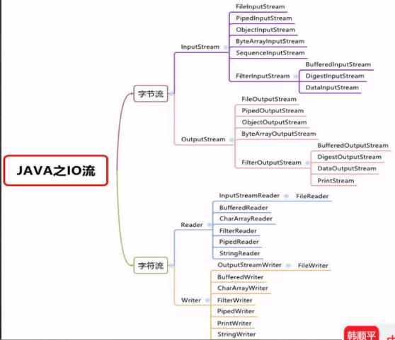
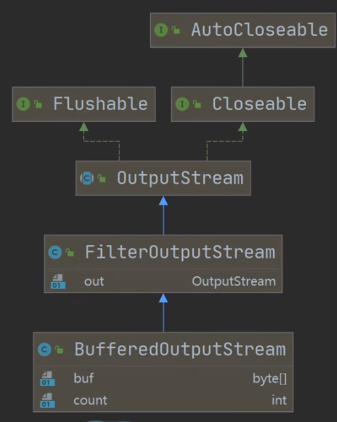

# 1. IO流

Input/Output，Java程序中，对于数据的输入/输出操作以“流（Stream）”的方式进行


Input：读取外部数据到内存中

Output：将程序中说的数据输出到磁盘中

| （这里列出的<br />都是抽象基类） |    字节流    | 字符流 |
| :------------------------------: | :----------: | :----: |
|              输入流              | InputStream  | Reader |
|              输出流              | OutputStream | Writer |



## 1.1 文件操作

### 1.1.1 创建文件对象

创建文件对象之后，调用`createNewFile()`方法即可创建文件

- 直接输入路径创建

```java
// 路径有两种写法
String filePath = "d:/CS_Source/test.txt";
String filePath = "d:\\CS_Source\\test.txt";
File file = new File(filePath); // 此时只是在内存中创建了文件对象

try {
    file.createNewFile(); // 这里才真正在硬盘创建文件
    sout("文件创建成功");
} catch (IOException e) {
    e.printStackTraec();
}
```

- 在父文件对象下创建

  假设要创建：`d:/CS_Source/test.txt`

```java
File parentFile = new File("d:\\CS_Source\\");
File file = new File(parentFile, "test.txt");

try {
    file.createNewFile();
}catch(IOException e){
    
}
```

- 根据父目录路径和子目录路径创建

```java
File file = new File("d:\\CS_Source\\", "test.txt");

try {
    file.createNewFile();
}catch(IOException e){
    
}
```

### 1.1.2 获取文件相关信息

`File file = new File("e:\\news1.txt");`

- 获取文件名 `file.getName()`
- 判断文件是否存在：`file.exists();`
- 文件绝对路径：`file.getAbsolutePath();`
- 文件父目录：`file.getParent();`
- 文件大小（字节）：`file.length();`
- 判断是否是一个文件：`file.isFile();`
- 判断是否是一个文件夹：`file.isDirectory();`

### 1.1.3 文件操作

在程序角度文件和文件夹是相同的

`File file = new File("e:\\news1.txt");`

`File dir = new File("e:\\newDir");`

**创建文件**

`file.createNewFile();`

**创建文件夹**

- 创建单级目录

  `dir.mkdir();`

- 创建多级目录

  ```java
  File dirs = new File("e:\\a\\b\\c");
  dirs.mkdirs();
  ```

**删除文件/文件夹**

`file.delete();`

`dir.delete();`

返回boolean值，表示是否删除成功

## 1.2 输入流

### 1.2.1 字节流FileInputStream

每次读取一个字节（byte类型），多用于二进制文件

1. 创建FileInputStream对象来读取文件

   ```java
   FileInputStream fileInputStream = new FileInputStream("filePath");
   ```

2. 使用read方法读取数据

   - 无参， 每次读入一个

   read方法每次读取单个字节，并且以int类型返回，如果读取到文件末尾则返回-1

   由于每次读取一个字节（8位），因此只能正确读取ascii字符

   ```java
   try{
       int readData = 0;
       while((readData = fileInputStream.read()) != -1)
           sout((char)readData);
   } catch (IOException e){
       e.printStackTrace();
   } finally {
       fileInputStream.close(); // 这里也有编译异常，可以抛出或者捕获
   }
   ```

   - 有参，一次性读入多个到字符数组中

     read是个阻塞函数，会一直不断读取

   ```java
   int readLen = 0;
   byte[] buf = new byte[100];
   while ((readLen = fileInputStream.read(buf)) != -1)
       sout(new String(buf, 0, readLen));
   ```

3. 关闭文件流，释放资源

   `fileInputStream.close();`

   需要处理异常

### 1.2.2 字符流FileReader

每次读取一个字符（char类型），多用于文本文件

1. 创建FileReader对象

   ```java
   String filePath = "e:/test.txt";
   FileReader rd = null;
   try {
       fileReader = new FileReader(filePath);
   } catch (FileNotFoundException e) {
       e.printStackTrace();
   } finally {
       try {
           rd.close();
       } catch (IOException e) {
           
       }
   }
   ```

2. 读取文件

   `rd.read()` 读取单个字符，返回int类型，读到文件末尾返回-1

   `rd.read(char[] buf)` 一次读取buf字符数组的大小，读到文件末尾返回-1

3. 关闭FileReader对象

## 1.3 输出流

### 1.3.1 字节流FileOutputStream

1. 创建FileOutPutStream对象

   `public FileOutputStream(File file, boolean append)`

   - 覆盖方式

   `FileOutputStream fos = new FileOutputStream(filePath);`

   需要处理IO异常

   如果指定目录没有该文件则自动创建，前提是目录要存在

   - 追加方式

   `fileOutputStream fos = new FileOutputStream(filePath, true);`

2. 写入字节

   - 写入单个字符

     `fos.write('a');`

   - 写入字符串

     `fos.write(byte[] bytes);` 需要一个字节数组

   ```java
   String str = "hello world!";
   fileOutputStream.write(str.getBytes());
   ```

   - 写入字符串的指定部分

     `fos.write(byte[] b, int off, int len);`

     指定偏移量和长度

### 1.3.2 字符流FileWriter

1. 创建FileReader对象

   - 默认是覆盖模式

     `FileReader fr = new FileReader(filePath);` 

   - 追加模式

     `FileReader fr = new FileReader(filePath, true);`

2. 写入字符

   - 写入单个字符

     `fr.write(int)`

   - 写入指定数组中的所有内容

     `fr.write(char[])`

   - 写入指定数组的指定部分

     `fr.write(char[], int off, int len)`

   - 写入整个字符串

     `fr.write(String str)`

   - 写入字符串的指定部分

     `fr.write(String str, int off, int len)`

3. 关闭FileReader对象

   执行write函数之后，必须使用flush或者close函数才会往文件中真正写入数据

## 1.4 缓冲处理流

上述所说的流都是节点流，也就是从一个数据源直接读取数据

而处理流（也称包装流），是在已经存在的流（节点流或者包装流）之上，为程序提供更为强大的读写功能。

就是对已有流的一个包装，包装之后既可以消除不同节点流的实现差异，也可以提供更方便的方法完成输入输出

使用了修饰器设计模式

### 1.4.1 BufferedReader

BufferedReader是一种缓冲流，用于读取字符流数据。BufferedReader中自带缓冲区，可以提高效率

BufferedReader继承于Reader类，里面封装了一个Reader字符输入流对象

```java
private Reader in; // 封装的Reader对象
private char cb[]; // 缓冲区
```

**使用流程**

1. 创建BufferedReader对象

   ```java
   BufferedReader br = new BufferedReader(new FileReader(filePath));
   ```

2. 读取数据

   BufferedReader包装流中提供更丰富的读取方法

   **readLine**

   每次读取一行，遇到\n或者\r时停止，返回String类型，当返回null时表示文件读取完毕

   ```java
   String line;
   while ((line = br.readLine()) != null) {
       sout(line);
   }
   ```

3. 关闭流

   这里只用关闭外部包装流br即可，br中会自动关闭内部的FileReader流

   ```java
   br.close();
   ```

### 1.4.2 BufferedWriter

BufferedWriter继承于Writer，里面封装了一个Writer字符输出流对象

```java
private Writer out;
private char cb[];
```

**使用流程**

1. 创建BufferedWriter对象

   ```java
   BufferedWriter bw = new BufferWriter(new FileWriter(filePath));
   ```

   覆盖方式是覆盖还是追加由内部创建的FileWriter对象决定

2. 写入数据

   **write**

   参数可以是一个整数(字符)、字符数组、字符串

   ```java
   bw.write("Hello, World!!!");
   ```

   **newLine**

   写入一个换行

   ```java
   bw.newLine();
   ```

3. 关闭流

   只用关闭外部的bw流

   ```java
   bw.close();
   ```

### 1.4.3 BufferedInputStream


### 1.4.4 BufferedOutputStream



从父类中继承了OutputStream类型的out属性，用于封装OutputStream对象
