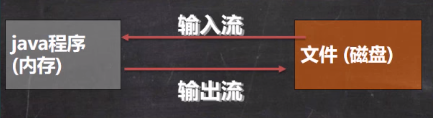

# 1. IO流基础

Input/Output，Java程序中，对于数据的输入/输出操作以“流（Stream）”的方式进行



Input：读取外部数据到内存中

Output：将程序中说的数据输出到磁盘中

| （这里列出的<br />都是抽象基类） |    字节流    | 字符流 |
| :------------------------------: | :----------: | :----: |
|              输入流              | InputStream  | Reader |
|              输出流              | OutputStream | Writer |


## 1.1 文件操作

### 1.1.1 创建文件对象

创建文件对象之后，调用`createNewFile()`方法即可创建文件

- 直接输入路径创建

```java
// 路径有两种写法
String filePath = "d:/CS_Source/test.txt";
String filePath = "d:\\CS_Source\\test.txt";
File file = new File(filePath); // 此时只是在内存中创建了文件对象

try {
    file.createNewFile(); // 这里才真正在硬盘创建文件
    sout("文件创建成功");
} catch (IOException e) {
    e.printStackTraec();
}
```

- 在父文件对象下创建

  假设要创建：`d:/CS_Source/test.txt`

```java
File parentFile = new File("d:\\CS_Source\\");
File file = new File(parentFile, "test.txt");

try {
    file.createNewFile();
}catch(IOException e){
    
}
```

- 根据父目录路径和子目录路径创建

```java
File file = new File("d:\\CS_Source\\", "test.txt");

try {
    file.createNewFile();
}catch(IOException e){
    
}
```

### 1.1.2 获取文件相关信息

`File file = new File("e:\\news1.txt");`

- 获取文件名（带后缀） `file.getName()`
- 判断文件是否存在：`file.exists();`
- 文件绝对路径：`file.getAbsolutePath();`
- 文件父目录：`file.getParent();`
- 文件大小（字节）：`file.length();`
- 判断是否是一个文件：`file.isFile();`
- 判断是否是一个文件夹：`file.isDirectory();`

### 1.1.3 文件操作

在程序角度文件和文件夹是相同的

`File file = new File("e:\\news1.txt");`

`File dir = new File("e:\\newDir");`

**创建文件**

`file.createNewFile();`

**创建文件夹**

- 创建单级目录

  `dir.mkdir();`

- 创建多级目录

  ```java
  File dirs = new File("e:\\a\\b\\c");
  dirs.mkdirs();
  ```

**删除文件/文件夹**

`file.delete();`

`dir.delete();`

返回boolean值，表示是否删除成功

## 1.2 节点流

### 1.2.1 字节输入流FileInputStream

每次读取一个字节（byte类型），多用于二进制文件

1. 创建FileInputStream对象来读取文件

   ```java
   FileInputStream fileInputStream = new FileInputStream("filePath");
   ```

2. 使用read方法读取数据

   - 无参， 每次读入一个

   read方法每次读取单个字节，并且以int类型返回，如果读取到文件末尾则返回-1

   由于每次读取一个字节（8位），因此只能正确读取ascii字符

   ```java
   try{
       int readData = 0;
       while((readData = fileInputStream.read()) != -1)
           sout((char)readData);
   } catch (IOException e){
       e.printStackTrace();
   } finally {
       fileInputStream.close(); // 这里也有编译异常，可以抛出或者捕获
   }
   ```

   - 有参，一次性读入多个到字符数组中

     read是个阻塞函数，会一直不断读取

   ```java
   int readLen = 0;
   byte[] buf = new byte[100];
   while ((readLen = fileInputStream.read(buf)) != -1)
       sout(new String(buf, 0, readLen));
   ```

3. 关闭文件流，释放资源

   `fileInputStream.close();`

   需要处理异常

### 1.2.2 字符输入流FileReader

每次读取一个字符（char类型），多用于文本文件

1. 创建FileReader对象

   ```java
   String filePath = "e:/test.txt";
   FileReader rd = null;
   try {
       fileReader = new FileReader(filePath);
   } catch (FileNotFoundException e) {
       e.printStackTrace();
   } finally {
       try {
           rd.close();
       } catch (IOException e) {
           
       }
   }
   ```

2. 读取文件

   `rd.read()` 读取单个字符，返回int类型，读到文件末尾返回-1

   `rd.read(char[] buf)` 一次读取buf字符数组的大小，读到文件末尾返回-1

3. 关闭FileReader对象

### 1.2.3 字节输出流FileOutputStream

1. 创建FileOutPutStream对象

   `public FileOutputStream(File file, boolean append)`

   - 覆盖方式

   `FileOutputStream fos = new FileOutputStream(filePath);`

   需要处理IO异常

   如果指定目录没有该文件则自动创建，前提是目录要存在

   - 追加方式

   `fileOutputStream fos = new FileOutputStream(filePath, true);`

2. 写入字节

   - 写入单个字符

     `fos.write('a');`

   - 写入字符串

     `fos.write(byte[] bytes);` 需要一个字节数组

   ```java
   String str = "hello world!";
   fileOutputStream.write(str.getBytes());
   ```

   - 写入字符串的指定部分

     `fos.write(byte[] b, int off, int len);`

     指定偏移量和长度

### 1.2.4 字符输出流FileWriter

1. 创建FileWriter对象

   - 默认是覆盖模式

     `FileWriter fr = new FileWriter(File file, boolean append);` 

   - 追加模式

     `FileWriter fr = new FileWriter(filePath, true);`

2. 写入字符

   - 写入单个字符

     `fr.write(int)`

   - 写入指定数组中的所有内容

     `fr.write(char[])`

   - 写入指定数组的指定部分

     `fr.write(char[], int off, int len)`

   - 写入整个字符串

     `fr.write(String str)`

   - 写入字符串的指定部分

     `fr.write(String str, int off, int len)`

3. 关闭FileWriter对象

   执行write函数之后，必须使用flush或者close函数才会往流中真正写入数据

## 1.3 Properties配置文件

Properties是专门用于读取后缀为`.properties`配置文件的集合类

配置文件的格式为`键=值`，键值和等号之间不需要有空格

父类是Hashtable，即底层使用的是Hashtable，可以使用HashMap中的方法遍历

### 1.3.1 读取配置文件

`a.properties`文件

```
user=sazer
passwd=123456
```

1. 创建Properties对象

   ```java
   Properties properties = new Properties();
   ```

2. 加载指定配置文件

   可以传入一个InputStream对象或者Reader对象

   ```java
   properties.load(new FileReader("./a.properties"));
   ```

3. 获取数据

   **list输出所有配置信息**

   list函数需要传入一个PrintStream对象或者PrintWriter对象

   ```java
   properties.list(System.out); // 打印到控制台
   ```

   **根据key获取对应值**

   ```java
   String user = properties.getProperty("user");
   ```

   存储的key-value都是字符串格式

### 1.3.2 写入配置文件

1. 创建Properties对象

   ```java
   Properties properties = new Properties();
   ```

2. 创建键值对

   如果在properties文件中键值对已经存在，则会修改键值对

   ```java
   properties.setProperty("user", "Tom");
   properties.setProperty("pwd", "abc111");
   ```

3. 存储到文件中

   - 第一个参数是一个Writer或者OutputStream对象

   - 第二个参数是注释，会写在文件的最上方

   ```java
   properties.store(new FileOutputStream("./a.properties"), "This is a comment");
   ```

   中文保存到文件中是对应的Unicode编码值

# 2. 处理流

上述所说的流都是节点流，也就是从一个数据源直接读取数据

而处理流（也称包装流），是在已经存在的流（节点流或者包装流）之上，为程序提供更为强大的读写功能。

就是对已有流的一个包装，包装之后既可以消除不同节点流的实现差异，也可以提供更方便的方法完成输入输出

使用了修饰器设计模式

## 2.1 缓冲处理流

缓冲处理流用于包装相应的节点流，里面会封装一个相应的节点流对象，其中自带缓冲区，比直接使用相应的字节流效率高

### 2.1.1 字符输入流BufferedReader

BufferedReader继承于Reader类，里面封装了一个Reader字符输入流对象

```java
private Reader in; // 封装的Reader对象
private char cb[]; // 缓冲区
```

使用流程：

1. 创建BufferedReader对象

   ```java
   BufferedReader br = new BufferedReader(new FileReader(filePath));
   ```

2. 读取数据

   BufferedReader包装流中提供更丰富的读取方法

   **readLine**

   每次读取一行，遇到\n或者\r时停止，返回String类型，当返回null时表示文件读取完毕

   ```java
   String line;
   while ((line = br.readLine()) != null) {
       sout(line);
   }
   ```

3. 关闭流

   这里只用关闭外部包装流br即可，br中会自动关闭内部的FileReader流

   ```java
   br.close();
   ```

### 2.1.2 字符输出流BufferedWriter

BufferedWriter继承于Writer，里面封装了一个Writer字符输出流对象

```java
private Writer out;
private char cb[];
```

使用流程：

1. 创建BufferedWriter对象

   ```java
   BufferedWriter bw = new BufferWriter(new FileWriter(filePath));
   ```

   覆盖方式是覆盖还是追加由内部创建的FileWriter对象决定

2. 写入数据

   **write**

   参数可以是一个整数(字符)、字符数组、字符串

   ```java
   bw.write("Hello, World!!!");
   ```

   **newLine**

   写入一个换行

   ```java
   bw.newLine();
   ```

3. 关闭流

   只用关闭外部的bw流

   ```java
   bw.close();
   ```

### 2.1.3 字节输入流BufferedInputStream


BufferedInputStream继承于FilterInputStream，进一步继承于InputStream。在FilterInputStream类中封装了一个InputStream字节输入流对象

使用流程：

1. 创建BufferedInputStream对象

   ```java
   BufferedInputStream bis = null;
   try {
       bis = new BufferedInputStream(new FileInputStream("e:/test.png"));
   }
   catch(FileNotFoundException e) {
       e.printStackTrace();
   }finally {
       
   }
   ```

2. 读取文件数据

   ```java
   byte[] buff = new byte[1024];
   int readLen = 0;
   while ((readLen = bis.read(buff)) != -1) {
       sout(buff);
   }
   ```

3. 关闭对象

   ```java
   if (bis != null) {
       bis.close();
   }
   ```

### 2.1.4 字节输出流BufferedOutputStream


BufferedOutputStream继承于FilterOutputStream，进一步继承于OutputStream。在FilterOutputStream类中封装了一个OutputStream字节输出流对象

使用流程：

1. 创建BufferedOutputStream对象

   ```java
   BufferedOutputStream bos = null;
   try {
       bos = new BufferedOutputStream(new FileOutputStream("e:/test.png"));
   }
   catch(FileNotFoundException e) {
       e.printStackTrace();
   }finally {
       
   }
   ```

2. 读取文件数据

   ```java
   byte[] buff = new byte[1024];
   int readLen = 0;
   while ((readLen = bis.read(buff)) != -1) {
       bos.write(buff, 0, readLen); // 将bis对象读入的数据写入另一个文件中
   }
   ```

3. 关闭对象

   ```java
   if (bos != null) {
       bos.close();
   }
   ```

## 2.2 对象处理流

对象流能够将基本数据类型 和 对象 进行序列化和反序列化操作

- 序列化就是 将数据的值和对应类型一起保存起来
- 反序列化就是 将序列化的数据 恢复为对应的数据类型+值

- 如果某个对象是可序列化的，则该对象对应的类必须实现下面两个接口之一

  Serializable 标记接口，其中没有任何方法需要实现，推荐使用

  Externalizable 需要实现方法

### 2.2.1 类的序列化

如果需要将Java对象保存在文件中，或者在网络中传输Java对象，就需要用到序列化。序列化就是将数据结构或对象转换成二进制字节流的过程，反序列化就是将二进制字节流转换成数据结构或对象的过程

常见的序列化协议有：JDK自带的Serializable接口、Hessian、Kryo、Protobuf、ProtoStuff

**Serializable接口**

只需要将要进行序列化的类实现Seriablizable接口，并在其中定义一个static final long serialVersionUID即可

但是这种序列化效率低并且存在安全问题

```java
public class Dog implements Serializable {
    private String name;
    private int age;
    // 序列化的版本号，可以提高兼容性
    private static final long serialVersionUID = 1L;
    
    public Dog(String name, int age) {
        this.name = name;
        this.age = age;
    }
}
```

- 类中可以添加序列化版本号，提高兼容性

  添加版本号之后，当对类做修改时，会认为这是类的新版本，而不会认为是全新的类。

  这样的话类修改过后之前序列化的数据也能读取

- 序列化对象时，默认将类中所有属性都序列化，对于不想序列化的成员可以用transient修饰

  transient修饰的变量在反序列化后变量值会被置成类型默认值

  static静态变量由于不属于任何对象，因此不会被序列化

- 序列化对象时，要求类中属性所属类型也实现序列化接口

- 序列化具备可继承性，也就是如果某类实现序列化，则其子类默认实现序列化

### 2.2.2 ObjectInputStream

继承于InputStream，里面封装了一个InputStream对象

用于将数据反序列化，从管道读入程序中

1. 创建ObjectOutputStream对象

   ```java
   ObjectInputStream ois = new ObjectInputStream(new FileInputStream("./data/dat"));
   ```

   这个文件必须是一个序列化的文件

2. 读取数据 —— 读取（反序列化）顺序必须和保存（序列化）顺序一致

   基本数据类型

   - int：`int num1 = ois.readInt();`
   - Boolean：`boolean num2 = ois.readBoolean();`
   - char：`char c = ois.readChar();`
   - Double：`double d = ois.readDouble();`
   - String：`String str = ois.readUTF();`

   对象

   ```java
   Object dog = ois.readObject(); // 这里会抛出异常
   // dog对象的编译类型是Object，运行类型是Dog
   ```

3. 关闭流对象

   ```java
   if (ois != null) {
       ois.close();
   }
   ```

### 2.2.3 ObjectOutputStream

继承于OutputStream类，里面封装了一个OutputStream对象

用于将数据序列化，输出到管道中

使用实例：

1. 创建ObjectOutputStream对象

   ```java
   ObjectOutputStream oos = new ObjectOutputStream(new FileOutputStream("./data.dat"));
   ```

   序列化之后的数据存储的文件格式是一种特殊的格式，不是文本格式。文件后缀名可以随便写，但是不能用记事本直接打开

2. 序列化数据

   基本数据类型对应的包装类都实现了Serializable接口

   - int类型：`oos.writeInt(100);`
   - Boolean：`oos.wirteBoolean(true);`
   - Char：`oos.writeChar('a');`
   - Double：`oos.writeDouble(9.5);`
   - String：`oos.writeUTF("你好");`

   自定义的类需要实现Serialize接口之后其对象方可序列化

   ```java
   oos.writeObject(new Dog("旺财", 10));
   ```

3. 关闭流对象

   ```java
   if (oos != null) {
       oos.close();
   }
   ```

### temp. 标准输入输出流

**System.in**

表示标准输入——键盘

编译类型：InputStream

运行类型：BufferedInputStream

**System.out**

表示标准输出——显示器

编译类型：PrintStream

运行类型：PrintStream

## 2.3 转换流

程序中读取文件时，默认按照UTF-8编码方式读取，如果文件的编码方式不是UTF-8，读入之后就会乱码

解决思路：字节流可以在读入时指定编码格式，转换流可以将字节流以指定编码格式转换为一个字符流，从而可以完成编码的转换

### 2.3.1 InputStreamReader

继承于Reader（字符流）类，可以将InputStream（字节流）包装成Reader（字符流）

当处理纯文本数据时，使用字符流处理效率更高

**使用实例：**

读入一个gbk编码的文件并转为utf-8编码

1. 创建InputStreamReader对象，并以gbk编码读入文件

   ```java
   InputStreamReader isr = new InputStreamReader(new FileInputStream("./a.txt"), "gbk");
   ```

   这步将字节流FileInputStream包装为字符流InputStreamReader

2. 将InputStreamReader进一步用缓冲字符流BufferedReader包装

   ```java
   BufferedReader br = new BufferedReader(isr);
   ```

3. 使用BufferedReader流读取内容

   （InputStreamReader也可以直接读取内容）

   ```java
   String s = br.readLine();
   sout(s);
   ```

4. 关闭流

   ```java
   br.close();
   ```

   只用关闭最外层的流

### 2.3.2 OutputStreamWriter

继承于Writer（字符流）类，可以将OutputStream（字节流）包装成Writer（字符流）

**使用示例：**

将字节流包装为字符流，并以utf8编码写入到文件中

1. 创建OutputStreamWriter对象

   ```java
   OutputStreamWriter osw = new OutputStreamWriter(new FileOutputStream("./a.txt"), "utf8");
   ```

2. 写入数据

   ```java
   osw.write("这是utf8编码的汉字");
   ```

3. 关闭流

   ```java
   osw.close();
   ```

## 2.4 打印流

打印流只有输出流

### 2.4.1 字节流PrintStream

继承于FilterOutputStream，进一步继承于OutputStream

**write输出**

标准输出流System.out就是PrintStream类型，所以可以有一种等价用法

```java
PrintStream out = System.out;
out.print("你好");
out.close();
```

print底层调用的实际上是write，所以还可以

```java
out.write("你好");
```

效果完全一样

**更改输出位置**

在System类中有一个setOut方法可以将System类中的out对象指定为别的PrintStream对象

```java
System.setOut(new PrintStream("./a.txt"));
System.out.println("你好");
```

此时不会打印到屏幕，而是会输出到文件a.txt中

### 2.4.2 字符流PrintWriter

继承于Writer类

# 3. 网络编程基础

## 3.1 InetAddress类

用于表示IP地址，可以实现 IP 和 域名或主机名的互相转换

### 3.1.1 获取InetAddress对象

- 获取本机InetAddress对象

    ```java
    InetAddress localHost = InetAddress.getLocalHost();
    ```

- 根据指定主机名获取InetAddress对象

  ```java
  InetAddress sazer = InetAddress.getByName("sazer");
  ```

  主机名即设备名称，右键此电脑打开属性页面即可查看

- 根据域名获取InetAddress对象

  ```java
  InetAddress baidu = InetAddress.getByName("www.baidu.com");
  ```

### 3.1.2 使用InetAddress对象

- 获取点分十进制的IP地址

  ```java
  baidu.getHostAddress(); // 返回 "220.181.38.150"
  ```

- 获取原始IP地址 byte[]类型

  ```java
  baidu.getAddress();
  ```

- 获取主机名

  ```java
  baidu.getHostName(); // 返回 "www.baidu.com"
  sazer.getHostName(); // 返回 "sazer"
  ```

## 3.2 Socket

Java网络通信要求通信的两端都有Socket，网络通信实际上通过Socket进行通信

数据在两个Socket之间通过IO流的形式传输


不管是使用TCP协议还是UDP协议都要借助Socket获取相应的输入输出流来传输数据

## 3.3 查看本机网络状态

`netstat -an` 查看当前主机的网络情况，包括端口监听情况和网络连接情况

`netstat -anb` 在原有基础上显示是哪个程序在监听端口，需要管理员身份执行

`netstat -an | more` 分页显示，空格翻页

主要显示以下信息

- 协议：当前端口连接或者监听使用的协议，TCP或者UDP
- 本地地址：本机监听的地址
- 外部地址：如果有外部主机连接到本机，则该行显示外部主机的IP地址和端口号
- 状态：当前端口连接状态

# 4. TCP编程

基本流程：

1. 创建Socket对象（服务器端还需要绑定端口）
2. 服务器端开始监听，客户端请求连接，并最终建立连接
3. 获取输入输出流传输数据
4. 关闭Socket


## 4.1 用TCP发送数据

### 4.1.1 服务器端

1. 创建ServerSocket对象，并绑定端口

   ```java
   ServerSocket serverSocket = new ServerSocket(9999);
   ```

   如果9999端口被占用则会抛出异常

2. 开始监听，阻塞等待连接

   ```java
   Socket socket = serverSocket.accept();
   ```

   连接成功之后返回该连接对应的socket对象，而serverSocket会继续监听

3. 连接成功之后，通过返回的socket对象获取输入输入流

   - 通过字节输入流来接收客户端发来的数据

   ```java
   InputStream inputStream = socket.getInputStream();
   // 从输入流中读取数据
   byte[] buf = new byte[1024];
   int readLen = 0;
   while ((readLen = inputStream.read(buf)) != -1) {
       sout(new String(buf, 0, readLen));
   }
   ```

   - 通过字符输入流来接收客户端发来的数据

   ```java
   InputStream is = socket.getInputStream();
   BufferReader br = new BufferReader(new InputStreamReader(is));
   sout(br.readLine()); 
   ```

4. 关闭流对象、socket对象和serverSocket对象

   ```java
   inputStream.close();
   socket.close();
   serverSocket.close();
   ```

### 4.1.2 客户端

1. 通过指定IP和端口 连接服务器

   ```java
   Socket socket = new Socket(InetAddress.getLocalHost(), 9999);
   ```

   连接成功之后返回对应的socket对象

2. 拿到对应的输出输入流对象，并发送和接收数据

   流对象通过建立连接时返回的socket对象获取

   - 通过字节输出流对象向服务器端发送数据

     **注意**：发送完数据之后要发送一个结束标志，不然会出现客户端发送完数据，但是服务器端还在不停等待的情况。shutdownOutput表示关闭发送数据的管道，即之后自己只能接收数据不能发送数据

   ```java
   OutputStream outputStream = socket.getOutputStream();
   outputStream.write("Hello server!".getBytes());
   socket.shutdownOutput();
   ```

   - 通过字符输出流向服务器端发送数据

     socket不提供字符流，要使用转换流进行转换

     使用字符流发送数据时一定要使用**flush手动刷新**才会往管道中发送数据

   ```java
   OutputStream os = socket.getOutputStream();
   BufferedWriter bw = new BufferedWriter(new OutputStreamWriter(os));
   bw.write("你好服务器");
   bw.newLine(); // 可以插入一个空行来作为结束标志，但是这样的话要求接收消息的那一端必须使用ReadLine来读取数据
   bw.flush(); // 一定要手动刷新，否则不会向管道中写入数据
   bw.close();
   ```

3. 关闭流对象和socket对象

   ```java
   outputStream.close();
   socket.close();
   ```


# 5. UDP编程

UDP编程的特点：

- 没有明确的服务器端和客户端，而是演变为数据的发送端和接收端

- 接收数据和发送数据是通过 DatagramSocket 完成的

  DatagramSocket对象可以指定端口来等待接收数据

- 发送方需要将数据封装到 DatagramPacket对象 中发送 

  接收方接收到DatagramPacket对象之后需要进行拆包取出数据

## 5.1 通信流程

由于UDP通信中双方的地位是对等的，因此以一方为例

1. 创建DatagramSocket，指定接收端口9999

   ```java
   DatagramSocket socket = new DatagramSocket(9999);
   ```

2. 发送数据

   1. 将需要发送的数据封装到DatagramPacket对象

      ```java
      byte[] data = "Hello UDP~".getBytes();
      DatagramPacket packet = 
          new DatagramPacket(data, data.length, InetAddress.getByName("127.0.0.1"), 9998);
      // 倒数第二个参数需要一个InetAddress对象
      // 最后的端口号是要发送到的对方主机监听的端口号
      ```

   2. 发送数据

      ```java
      socket.send(packet);
      ```

3. 接收数据

   1. 构建一个DatagramPacket对象，用于接收数据

      ```java
      byte[] buf = new byte[1024];
      DatagramPacket packet = new DatagramPacket(buf, buf.length);
      ```

   2. 调用接收方法接收数据包

      该方法会阻塞，直到收到数据包

      ```java
      socket.receive(packet);
      ```

   3. 把packet拆包，取出数据

      ```java
      int length = packet.getLength(); // 实际接收到的数据字节长度
      byte[] data = packet.getData(); // 实际接收到的数据
      sout(new String(data, 0, length));
      ```

4. 释放资源

   ```java
   socket.close();
   ```


# 6. I/O多路复用

## 6.1 基本IO模型

内存空间分为内核空间和用户空间，操作内核空间需要操作系统切换到内核态，一般用于执行操作系统的关键指令，比如与硬件交互；而操作用户空间时操作系统则是用户态，一般是用于执行普通应用程序。

但是用户程序在执行时可能也需要借助一些内核指令功能完成，此时就需要调用内核提供的api，调用之后系统就会切换到内核态去完成指定功能，并返回给用户程序。

以IO读取为例：


IO读取涉及到与硬盘（读取本地文件时）和网卡（接受远程请求时）的交互，与硬件的直接交互肯定需要内核态来完成，因此读数据完整流程如下：

1. 用户程序发起read请求
2. 切换到内核态，由内核态直接与硬件进行交互，等待数据的到来，并将得到的数据先拷贝到内核空间的缓冲区buffer中
3. 再将数据从内核空间buffer拷贝到用户空间buffer中，交由用户程序处理

写数据时也类似：

1. 用户程序先将数据写到用户空间buffer中
2. 切换到内核态，将用户空间buffer数据拷贝到内核空间buffer中
3. 与硬件交互，将数据写入磁盘或者发送到网络上

根据以上流程可以看出，IO操作的耗时主要在数据的等待和数据的拷贝上

整个流程可以简化为下面这张图


### 6.1.1 阻塞IO

Blocking IO

在阻塞式IO中，读取数据的两个阶段都必须阻塞等待


1. 用户程序发起读请求recvfrom之后，如果数据还没准备好，则用户程序进行阻塞等待
2. 当数据准备好之后，从内核拷贝到用户空间时，用户程序也是阻塞等待

总之用户从发起读请求之后就一直阻塞，直到整个读操作完成。这样效率肯定会很差

### 6.1.2 非阻塞IO

Non-Blocking IO

在第一个阶段不阻塞等待，第二个阶段阻塞等待


1. 用户程序发起读请求recvfrom之后，如果没有数据，则内核直接返回没有数据，而不会让用户程序组合

   但是用户程序在得到没数据的结果之后，也会不断轮询

2. 当数据准备好之后，从内核拷贝到用户空间时，用户程序会阻塞等待

与阻塞IO相比，没有什么性能提升，因为用户程序在等待数据的过程中会不断循环发送请求，反而浪费了CPU资源

## 6.2 Socket IO模型

当进行网络IO时，需要借助Socket。

1. 首先服务端创建一个socket对象并绑定ip和端口号，用于监听客户端的TCP连接请求

   这个叫做监听Socket，当监听Socket监听到客户端连接请求并建立连接之后，会创建新的已连接Socket

   服务器内核会为每个监听Socket维护两个队列（即监听和建立连接工作是内核完成的）

   - TCP半连接队列，这个队列中都是接收了客户端的连接请求，但没有完成三次握手的连接
   - TCP全连接队列，这个队列都是完成了三次握手的连接

2. 当服务端用户程序调用accept()函数之后，内核会从TCP全连接队列中拿出一个已经完成连接的Socket返回给应用程序，如果没有已连接Socket的话accept函数就阻塞等待

   然后客户端应用程序就可以通过accept函数返回的已连接Socket与对应的客户端完成TCP通信

通过以上流程可以看出，一个监听Socket可以同时与多个客户端建立连接，这些连接保存在TCP全连接队列中，但是用户程序在单线程情况下一次同时只能处理一个客户端的Socket请求（这是因为建立连接之后采用阻塞IO或非阻塞IO，用户程序进程要阻塞等待或轮询等待用户端发来数据），这显然太慢了。

### 6.2.1 多进程模型

为了让服务端可以同时处理多个用户请求，我们可以为每个客户端的已连接Socket分配一个进程来专门处理客户端请求，这就是多进程模型

此时服务器主进程负责监听客户端的连接，一旦与客户端完成一个连接，accept函数就会返回主进程一个已连接Socket，主进程就通过fork函数创建一个子进程，子进程就使用这个已连接Socket和客户端通信


但是这样不断创建新进程来应付不断到来的客户端连接会耗费大量资源，当客户端数量增加时肯定会扛不住。而且在这些进程之间进行上下文切换也会消耗很多资源，导致性能降低。

### 6.2.2 多线程模型

和多进程模型思路相同，只不过换成了更轻量级的线程，可以减少上下文切换的开销

同时可以通过线程池来避免线程的频繁创建与销毁


但是当客户端连接增多时，也会扛不住

## 6.3 IO多路复用

既然一个进程负责处理一个已连接Socket会导致开销过大，IO多路复用的思想就是想办法让一个进程负责维护多个已连接Socket。

传统IO方式之所以一个进程只能负责一个Socket，是因为使用了阻塞IO或非阻塞式IO，大量时间用在阻塞或轮询等待用户端从已连接Socket中发来消息，真正处理消息的时间是很短的。

IO多路复用是一种新的IO模型，它会将进程负责维护的多个已连接Socket传给内核，再由内核返回产生了读写事件的连接，然后用户进程直接处理这些连接对应的请求即可，这样就避免了阻塞等待浪费的大量时间。

内核提供了几个多路复用系统调用，分别是select/poll/epoll

### 6.3.1 select/poll

用户进程调用select方法之后，会将该进程负责维护的已连接Socket对应的文件描述符集合拷贝到内核中，让内核负责检查这些Socket中是否有读写事件产生。

内核检查的方式很粗暴，就直接遍历文件描述符集合，检查到有事件产生之后，就将此Socket标记为可读或可写，然后再把整个文件描述符集合再拷贝回用户态，用户态再遍历一遍，找到可读或可写的Socket，然后对其处理。

**select**

select模式中，使用bitsMap来表示文件描述符集合，如果当前bit为1，说明对应的文件描述符是当前用户进程关心的。bitsMap长度为1024，即最多只能监听1024个已连接Socket，也即整个操作系统只能建立1024个已连接Socket，不然剩下的没法监听

**poll**

poll模式针对select模式做了一些改进，它用了一个链表数组来表示所有需要监听的已连接Socket，这样可以监听的Socket数量就没有限制。

但是依然需要遍历和拷贝，效率提升不大。

### 6.3.2 epoll

**epoll监听原理**


epoll提供了三个函数来共同完成对所有已连接Socket的监听工作

- epoll_create

  用户程序调用这个函数之后，会直接在内核创建一个eventpoll结构体，并返回该eventpoll标识符epfd句柄

  eventpoll结构体中包含一个红黑数，用于记录所有要监听的Socket对应文件标识符，还有一个链表，用于记录所有已经就绪的（有读写事件）的FD

  ```c
  struct eventpoll{
      struct rb_root rbr; // 红黑数，记录要监听的FD
      struct list_head rdlist; // 链表，记录就绪FD
  };
  ```

- epoll_ctl

  这个函数负责将一个待监听FD添加到eventpoll的红黑数当中

  ```java
  int epoll_ctl(
  	int epfd, // eventpoll的唯一标识符
      int op, // 要执行的操作，包括添加、删除、修改
      int fd, // 要监听的FD
      struct epoll_event *event; // 要监听的事件类型：读、写、异常等
  );
  ```

  当FD加入到红黑数之后，还会被自动设置一个ep_poll_callback，当该FD有读写事件之后会触发这个callback函数，把对应FD加入到就绪链表中

- epoll_wait

  用户程序调用该函数后阻塞等待事件到来。会检查就绪列表是否为空，如果不为空就返回就绪的FD数量，并将就绪链表拷贝到用户态，否则就阻塞等待

  ```c
  int epoll_wait(
  	int epfd, // 要监听的eventpoll实例的句柄
      struct epoll_event *events, // 空event数组，用于接收就绪的FD链表
      int maxevents, // events数组的最大长度
      int timeout // 最长阻塞等待时间
  );
  ```

**epoll事件通知机制**

当有Socket就绪时，用户程序调用epoll_wait就可以得到通知，事件的通知模式有两种

- LT，LevelTriggered，水平触发

  会重复通知服务端多次，直至数据处理完成，是Epoll的默认模式

  也就是说在将就绪链表从内核拷贝到用户之后，不会删除内核中的对应节点

- ET，EdgeTriggered，边缘触发

  只会通知一次，不管数据是否处理完成 

  也就是说就绪链表拷贝完成之后内核中的链表节点就会直接删除

LT的重复通知会消耗一些性能，因此ET模式性能更高

**epoll监听Socket流程**

1. 使用epoll_create创建eventpoll示例

2. 创建用于监听客户端连接的socket，ServerSocket，并使用epoll_ctl将其注册到eventpoll中

3. 调用epoll_wait函数等待socket读写事件

4. 如果有读写事件，则开始处理。

   如果是ServerSocket的读事件，说明是有客户端请求连接，此时就调用accept方法接受客户端连接对应的已连接socket，并将该已连接socket调用epoll_ctl方法注册到eventpoll中

   如果是其他事件就进行业务处理

## 6.4 其他IO方式

还有两种较为少用的IO：信号驱动IO和异步IO

**信号驱动IO**


这种方式用户程序发起IO请求之后会与内核简历SIGIO信号关联并设置回调函数，然后用户程序就可以做自己的事了。等IO准备就绪之后，内核会发送对应信号通知用户程序处理。

这种方式在有高并发大量IO操作时，会导致信号过多无法即时处理最终导致信号队列溢出。并且每一个IO请求都会信号交互，这种频繁的信号交互会导致性能降低

**异步IO**


异步IO发起IO请求之后，会等到内核完成所有工作再去处理。

这种方式在有高并发大量IO操作的时候，给内核发送大量IO请求，导致内核处理不了（因为IO操作是比较慢的），内存占满最终崩溃。

**IO方式总结**


IO操作是同步还是异步，由数据在内核空间与用户空间的拷贝过程（也就是数据读写的IO操作）决定，也就是阶段二是否同步决定。那之后最后一种异步IO可以称为异步。

