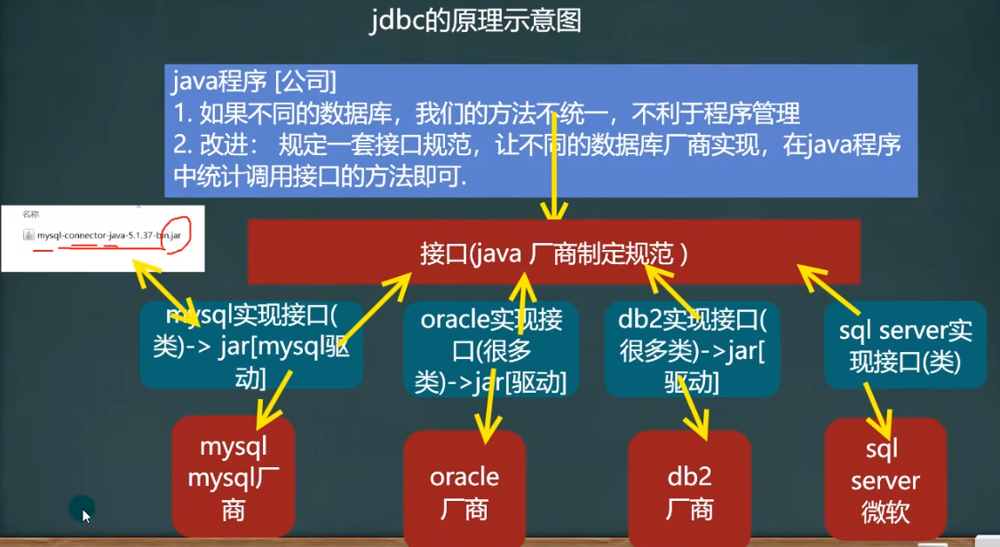
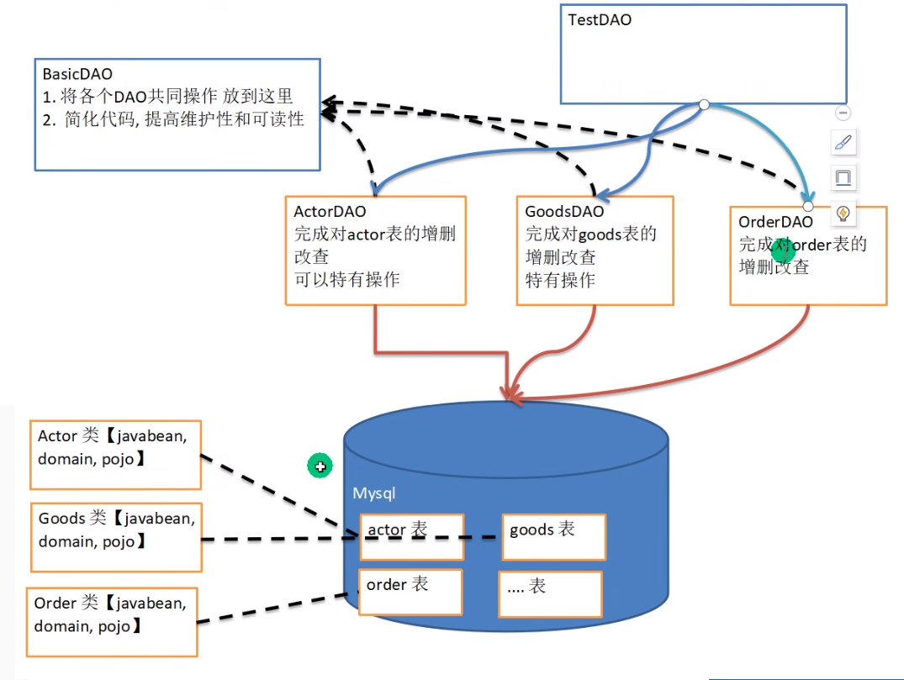

# 1. JDBC概述

## 1.1 JDBC原理

JDBC就是一个接口，为访问不同的数据库提供了统一规范，为使用者屏蔽了细节问题。

各数据库都各自实现了JDBC接口，所以可以直接使用JDBC连接任何提供了JDBC驱动程序的数据库系统，并完成对数据库的各种操作



其中各个厂商对Java提供接口的实现都会打包为一个.jar驱动文件，需要这个驱动文件才能使用Java操作相应的数据库

JDBC相关类和接口在 `java.sql` 和 `javax.sql` 包中

## 1.2 QuickStart

0. 下载并配置驱动文件

   [下载](https://downloads.mysql.com/archives/c-j/)`mysql-connector-j-version.jar`文件

   在项目文件夹下新建文件夹并将.jar文件复制进去，之后右键.jar文件选择add as library

1. 注册驱动

   ```java
   import com.mysql.jdbc.Deiver; // 这个包在刚刚加载的.jarw
   
   Driver driver = new Driver();
   ```

2. 连接数据库

   ```java
   // 1. 指定数据库地址：
   // 格式说明：jdbc:mysql://ip地址:端口号/数据库名
   String url = "jdbc:mysql://localhost:3306/jdbctestdb1";
   // 2. 封装登录用户
   // 用一个Properties对象封装登录的用户名和密码，key固定为"user"和"password"
   Properties properties = new Properties();
   properties.setProperty("user", "root");
   properties.setProperty("password", "wangyize201");
   
   // 建立连接
   Connection connect = driver.connect(url, properties);
   ```

3. 执行sql语句

   执行sql语句需要用到Statement对象，它用于执行静态SQL语句并返回其生成的结果

   ```java
   // 获取Statement对象
   Statement statement = connect.createStatement();
   // 执行SQL语句
   String sql = "insert into customer values("Tom", 18, true)";
   int rows = statement.executeUpdate(sql); // dml语句返回值是影响行数
   ```

4. 关闭连接资源

   ```java
   statement.close();
   connect.close();
   ```


## 1.3 Statement对象

Statement对象用于执行静态SQL语句并返回执行结果，但是在开发中一般不使用该类，因为有SQL注入的风险

### 1.3.1 SQL注入

SQL注入指用户在输入的字符串中注入SQL指令，如果服务器不加检查地当作正常SQL语句执行，就会遭到破坏和入侵

比如：

```SQL
-- 登录验证时
-- userName 和 passWord 是用户输入的字符串，则SQL语句为
strSQL = "SELECT * FROM users WHERE name = '" + userName + "' and pwd = '" + passWord + "'";

-- 如果用户填入的userName 和 passWord为
userName = "1' OR '1' = 1";
passWord = "1' OR '1' = 1";
-- 那么最后将userName和passWord填入后，最后组成的SQL语句为
SELECT * FROM users
WHERE name = '1' OR '1' = '1'
and pwd = '1' OR '1' = '1';
-- 也就是说一定会查询出结果通过验证，这样就可以达到无账号密码登录网站的效果
```

要防范SQL注入，需要使用PreparedStatement来代替Statement

### 1.3.2 PreparedStatement

PreparedStatement是一个接口，继承于Statement接口

1. 创建SQL语句

   将需要动态指定的部分用 ？占位符 表示，之后再使用PreparedStatement对象的set方法填入

   ```java
   String sql = "select name, pwd from admin where name = ? and pwd = ?";
   ```

2. 通过SQL语句创建PreparedStatement对象

   也就是说PreparedStatement对象和sql语句是相互关联的

   ```java
   PreparedStatement preparedStatement = connect.preparedStatement(sql);
   ```

3. 给 ？赋值

   使用set方法，第一个参数是当前设置的是第几个？（索引从1开始），第二个参数是要设置的值

   ```java
   preparedStatement.setString(1, admin_name);
   preparedStatement.setString(2, admin_pwd);
   ```

4. 执行语句

   - executeQuery执行SELECT语句，返回查询ResultSet类型结果集
   - executeUpdate执行DML语句，返回执行后影响的行数

   ```java
   ResultSet resultSet = preparedStatement.executeQuery();
   ```

# 2. JDBC使用

## 2.1 连接数据库

五种方式连接数据库，推荐使用靠后的连接方式

连接数据库中时用到的信息

```java
String url = "jdbc:mysql://localhost:3306/jdbctestdb1";
Properties loginUser = new Properties();
String user = "root";
String password = "wangyize201";
loginUser.setProperty("user", user);
loginUser.setProperty("password", password);
```

1. 直接创建Driver对象

   ```java
   Driver driver = new Driver();
   Connection connect = driver.connect(url, loginUser);
   ```

2. 通过反射的方式动态加载Driver对象

   ```java
   // 获得Driver对象
   Class<?> driverClass = Class.forName("con.mysql.jdbc.Driver");
   Driver driver = (Driver)driverClass.newInstance();
   // 连接数据库
   Connection connect = driver.connect(url, loginUser);
   ```

3. 使用DriverManager

   DriverManager类用于管理一组JDBC驱动程序的基本服务

   ```java
   // 获得Driver对象
   Class<?> driverClass = Class.forName("con.mysql.jdbc.Driver");
   Driver driver = (Driver)driverClass.newInstance();
   // 注册Driver驱动
   DriverManager.registerDriver(driver);
   // 连接数据库
   Connection connect = DriverManager.getConnection(url, user, password);
   ```

4. 使用DriverManager，但是自动注册Driver驱动

   ```java
   // 加载Driver类
   Class<?> driverClass = Class.forName("con.mysql.jdbc.Driver");
   
   // 连接数据库
   Connection connect = DriverManager.getConnection(url, user, password);
   ```

   - 这是由于在加载Deriver类时，会自动完成注册

     Driver类中有一段静态代码块

   ```java
   static {
       try {
           DriverManager.registerDriver(new Driver());
       } catch (SQLException var1) {
           throw new RuntimeException("Can't register driver!");
       }
   }
   ```

   - 在mysql驱动5.1.6之后无需使用Class.forName加载类即可直接连接数据库

     因为会自动调用驱动jar包下 `META-INF\services\java.dql.Driver`文本文件中的类名称去自动注册

     但还是建议写forName来手动加载类

5. 使用配置文件读取连接方式url，用户名user和密码password

## 2.2 SELECT语句

### 2.2.1 执行SELECT语句

`ResultSet executeQuery(String sql);`

执行SQL语句，并返回一个ResultSet对象（该对象中就存储了SELECT查询的结果集）

```java
// 假设已经完成连接数据库，取得Connection对象connect
Statement statement = connect.createStatement();
String sql = "SELECT * from myemp1";
ResultSet resultSet = statement.executeQuery(sql);
```

### 2.2.2 ResultSet结果集

ResultSet对象初始指向结果集第一行的上一行，使用next函数可以让光标向下移动一行。如果移动至末尾则next函数返回false

```java
// 比如结果表中字段为 String姓名 int年龄
while (resultSet.next()) {
    String name = resultSet.getString(1); // 获取第一列的数据
    int age = resultSet.getInt(2); // 获取第二列的数据
}
```

**常用方法**

- next() \ previous()

  向下\向上移动一行

- getXxx(int columnIndex)

  获取当前ResultSet对象指向行的指定列索引的值，Xxx为该值的数据类型

  getXxx(String columnLabel)

  也可以通过执行列名来获取指定数据

- getObject(int columnIndex) \ getObject(String columnLabel)

  将数据取出为Object类型

**结果集存在的问题**

- 结果集和获取结果集的Connection是关联的，即当Connection关闭之后，ResultSet将无法使用。

- 结果集不能长久保存（如果长久保存就要一直占据一个Connection，这是不合理的）

- 结果集获取数据的方式不是很好用，要将列名作为字符串填入参数中

**改进方式**

可以创建一个类，每一列对应一个类中一个属性（这种模式称为JavaBean、PoJo、Domain）

这样的话每一条记录就可以对应类的一个对象，然后用一个ArrayList来保存这些对象就可以保存查询结果集

## 2.3 事务

默认情况下JDBC是自动提交，即执行完executeUpdate语句并发送到SQL数据库之后，就直接提交且不可回滚了

如果需要多条语句一起执行，就需要关闭自动提交并自己手动提交

- 设置不自动提交

  `connection.setAutoCommit(false);`

- 提交

  `connection.commit();`

- 回滚

  `connection.rollback();`

比如一个经典的交易案例

```java
Connection connection = null;
PreparedStatement preparedStatement = null;
// id为1的用户转给id为2的用户100块
String sql1 = "update account set balance = balance - 100 where id = 1";
String sql2 = "update account set balance = balance + 100 where id = 2";
// 交易过程
try {
    connection = DriverManager.getConnection(url, name, pwd);
    connection.setAutoCommit(false);
    // 执行第一条SQL语句
    preparedStatement = connection.prepareStatement(sql1);
    preparedStatement.executeUpdate(); 
    
    int i = 1 / 0; // 第一二条语句之间程序出现异常
    
    // 执行第二条SQL语句
    preparedStatement = connection.prepareStatement(sql1);
    preparedStatement.executeUpdate();
    
    // 如果两条语句都执行成功，提交
    connection.commit();
} catch (SQLException e) {
    // 如果执行过程中出现异常就回滚
    connection.rollback();
    throw new RuntimeException(e);
} finally {
    // 关闭资源
    preparedStatement.close();
    connection.close();
}
```

## 2.4 批处理

批处理允许多条语句一次性提交给数据库批量处理，通常情况下比单独提交处理更有效率（因为涉及到网络传输）

**使用批处理的步骤**

1. 在创建Connection时，url最后要加上`?rewriteBathchedStatements=true`

   即`jdbc:mysql://localhost:3306/dbName?rewriteBatchedStatements=true`

2. 将sql语句加入到批处理列表中

   `preparedStatement.addBatch();`

3. 将批处理中的sql语句统一提交给数据库

   `preparedStatement.executeBatch();`

4. 清空批处理列表中的sql语句

   `preparedStatement.clearBatch();`

## 2.5 数据库连接池

### 2.5.1 基本介绍

**传统方式的问题**

即每次需要连接数据库时都建立一个新的connection连接，用完之后将该连接关闭，再用再建

1. 每次连接都需要将Connection对象加载到内存中，验证IP地址，用户名和密码，耗时较长
2. 每一次数据库连接用完都需要断开，如果程序出现异常未能即使关闭，将导致数据库内存泄漏，最终导致需要重启数据库
3. 不能控制创建的连接数量，如果同时创建过多连接，会导致数据库崩溃

为了解决以上问题，可以采用数据库连接池（connection pool）

**数据库连接池介绍**

数据库连接池会预先在缓冲池中放入一定数量的连接，当需要与数据库建立连接时，就从缓冲池中取出一个连接，使用完毕之后再放回去。

也就是说允许重复使用一个现有的数据库连接，连接的分配、管理和释放由连接池负责

当应用程序向连接池请求的连接数超过最大连接数量时，这些请求将被加入到等待队列中。当长时间没有请求连接时，就会自动关闭一些连接

**数据库连接池种类**

JDBC为数据库连接池提供了一个接口 `javax.sql.DataSource`，有许多第三方对该接口提供了实现（提供相应.jar包）

- **C3P0**：老牌连接池，速度相对较慢，稳定性好
- DBCP：速度较快，不稳定
- Proxool：有监控连接池状态的功能，稳定性较差
- BoneCP：速度快
- **Druid**：阿里提供的数据库连接池，现在被广泛使用，集多个连接池优点于一身

### 2.5.2 C3P0

首先[下载](https://sourceforge.net/projects/c3p0/)C3P0，直接点击Download，下载的文件是`c3p0-0.9.5.5.bin.zip`，解压之后打开文件夹，`./lib/c3p0-0.9.5.5.jar`即为所需jar包

将该.jar文件放入工程目录下，右键选择Add as Library... 导入到工程中

**使用步骤**

1. 创建数据源对象

   ```java
   import com.mchange.v2.c3p0.ComboPooledDataSource;
   
   ComboPooledDataSource cpds = new ComboPooledDataSource();
   ```

2. 给数据源设置相关参数

   ```java
   // 以下信息也可以通过读取配置文件得到
   String url = "jdbc:mysql://localhost:3306/jdbctestdb1";
   String user = "root";
   String password = "wangyize201";
   String driver = "con.mysql.jdbc.Driver";
   
   // 给数据源设置相关参数
   cpds.setDriverClass(driver);
   cpds.setJdbcUrl(url);
   cpds.setUser(user);
   cpds.setPassword(password);
   
   // 设置初始化连接数
   cpds.setInitialPoolSize(10); // 程序开始时先创建10个数据库连接
   cpds.setMaxPollSize(50); // 最多可以建立50个数据库连接
   ```

3. 获取连接

   ```java
   Connection connect = cpds.getConnection();
   ```

4. 关闭连接

   注意这里并不是实际上关闭了连接，只是将这个连接释放回了连接池中

   ```java
   connect.close();
   ```

**c3p0配置文件**

将配置文件命名为 `c3p0-config.xml`，放在工程根目录（src文件夹）下

配置文件示例（直接复制进文件）：

```xml
<!--c3p0-config.xml配置-->
<!--
* 含特殊字符的处理
<![CDATA[文本内容]]>
表示文本内容都做普通字符处理，这样就避免了如&等特殊字符带来的异常
-->

<c3p0-config>
    <!-- default-config方式，只能配置一个 -->
    <default-config>
        <property name="driverClass">com.mysql.cj.jdbc.Driver</property>
        <property name="jdbcUrl">
            <![CDATA[jdbc:mysql://127.0.0.1:3306/testdb?useUnicode=true&characterEncoding=UTF-8&serverTimezone=GMT%2B8&useSSL=false]]>
        </property>
        <property name="user">root</property>
        <property name="password">py123456</property>

        <property name="automaticTestTable">con_test</property>
        <property name="checkoutTimeout">30000</property>
        <property name="idleConnectionTestPeriod">30</property>
        <property name="initialPoolSize">10</property>
        <property name="maxIdleTime">30</property>
        <property name="maxPoolSize">100</property>
        <property name="minPoolSize">10</property>
        <property name="maxStatements">200</property>

        <user-overrides user="test-user">
            <property name="maxPoolSize">10</property>
            <property name="minPoolSize">1</property>
            <property name="maxStatements">0</property>
        </user-overrides>

    </default-config>

    <!-- named-config方式，可配置多个 -->
    <!-- This app is massive! -->
    <named-config name="TestConfig">
        <property name="driverClass">com.mysql.cj.jdbc.Driver</property>
        <property name="jdbcUrl">
            <![CDATA[jdbc:mysql://127.0.0.1:3306/testdb?useUnicode=true&characterEncoding=UTF-8&serverTimezone=GMT%2B8&useSSL=false]]>
        </property>
        <property name="user">root</property>
        <property name="password">py123456</property>

        <property name="acquireIncrement">50</property>
        <property name="initialPoolSize">100</property>
        <property name="minPoolSize">50</property>
        <property name="maxPoolSize">1000</property>

        <!-- intergalactoApp adopts a different approach to configuring statement caching -->
        <property name="maxStatements">0</property>
        <property name="maxStatementsPerConnection">5</property>

        <!-- he's important, but there's only one of him -->
        <user-overrides user="master-of-the-universe">
            <property name="acquireIncrement">1</property>
            <property name="initialPoolSize">1</property>
            <property name="minPoolSize">1</property>
            <property name="maxPoolSize">5</property>
            <property name="maxStatementsPerConnection">50</property>
        </user-overrides>
    </named-config>
</c3p0-config>
```

使用方式：

- 使用默认配置

  ```java
  ComboPooledDataSource cpds = new ComboPooledDataSource();
  
  Connection coonect = cpds.getConnection();
  ```

- 使用name-config

  ```java
  // 这里的参数就是     <named-config name="TestConfig">   这里的名字
  ComboPooledDataSource cpds = new ComboPooledDataSource("TestConfig");
  
  Connection coonect = cpds.getConnection();
  ```

### 2.5.3 Druid连接池

[下载](https://repo1.maven.org/maven2/com/alibaba/druid/1.2.20/)Druid连接池jar包，这是[Github Repo地址](https://github.com/cucker0/jdbc)，下载`druid-1.2.20.jar`，放入项目文件夹中，右键点击 add as Library 添加到项目中

在项目src文件夹下添加配置文件，文件名可以自己起 

`druid.properties`

```properties
#druid.properties
driverClassName=com.mysql.cj.jdbc.Driver
url=jdbc:mysql://127.0.0.1:3306/testdb?useUnicode=true&characterEncoding=UTF-8&serverTimezone=GMT%2B8&useSSL=false
username=root
password=py123456

# 初始建立的连接数
initialSize=10
# 最大连接数
maxActive=20
# 在等待队列中等待的最大时间
maxWait=1000
# 最少保持的连接数
minIdle=5
filters=wall
```

**使用步骤**

1. 创建连接池

   创建连接池需要通过配置文件来创建

   ```java
   Properties properties = new Properties();
   properties.load(new FileInputStream("src\\druid.properties"));
   
   DataSource ds = DruidDataSourceFactory.createDataSource(properties);
   ```

2. 获取连接

   ```java
   // 这里获取的connect对象实际上是 com.alibaba.druid.pool.DruidPooledConnection对象
   Connection connect = ds.getConnection();
   ```

3. 关闭连接

   ```java
   connect.close();
   ```

## 2.6 Apache-DBUtils

commons-deutils是Apache提供的一个开源JDBC工具类库，是对JDBC的封装，能极大简化jdbc编码的工作量

[下载](https://commons.apache.org/proper/commons-dbutils/download_dbutils.cgi)commons-dbutils-1.8.1-bin.zip文件，解压之后在文件夹中找到`commons-dbutils-1.8.1.jar`即为所需要的jar包，将其复制到项目目录下，右键add as library

包含

- QueyrRunner类

  封装了SQL的执行，可以实现查询、增删改、批处理

- ResultSetHandler接口

  用于处理查询得到的ResultSet结果集，将数据按要求转换为另一种形式

### 2.6.1 查询

案例中用到的Connection对象

```java
Connection connection = druidDataSourceFactory.getConnection();
```

**查询结果集**

1. 创建QueryRunner

   ```java
   QueryRunner queryRunner = new QueryRunner();
   ```

2. 执行查询语句，返回ArrayList 结果集

   ```java
   class Emp(){
       // emp类用于表示一行数据
       // 类中的每个属性对应表中的一列，数据类型都要使用包装类，因为sql中数据都可以为null
       private String name;
       private Integer age;
       private Double salary;
       
       // 需要提供无参构造器和有参构造器
       
       // 每个参数都需要提供get/set方法
   }
   
   String sql = "select * from myemp_db1 where id >= ?";
   List<Emp> list = queryRunner.query(connection, sql, new BeanListHeadler<>(Emp.class));
   ```

   query方法：执行sql语句，并将得到的resultSet封装到ArrayList集合中，参数如下

   - Connection conn：数据库的连接对象

   - String sql：要执行的SQL语句，String类型

   - ResultSetHandler\<T> rsh : 

     该类用于将得到的resultSet中的每一列封装到Emp对象中，并放入List

     创建该类对象时需要传入要将数据封装进的类的Class对象，显然底层使用了反射
   
   - ...params：可变参数列表，对应sql语句中的？要填入的值
   

**查询单个对象**

即结果集中只有一行数据时

```java
String sql = "select * from myemp_db1 where id = ?";
Emp emp = queryRunner.query(connection, sql, new BeanHeadler<>(Emp.class), 4);
```

如果查询结果为空返回null

**查询单个数据**

即结果集中只有一行数据的其中某列的值

```java
String sql = "select name from myemp_db1 where id = ?";
Object obj = queryRunner.query(connection, sql, new ScalarHandler(), 4);
// 此时obj就是String类型
```

如果查询结果为空返回null

### 2.6.2 DML操作

```java
String sql = "update myemp_db1 set name = ? where id = ?";
int affectRow = queryRunner.update(connection, sql, "张三", 4);
```

返回值是受影响的函数

update函数可以完成update、insert、delete等操作

## 2.7 DAO

### 2.7.1 设计理念

DAO：data access object 数据访问对象

DAO是一种设计模式，即创建专门的类用于实现和数据库交互，即通过DAO类对相应数据库完成crud操作



数据库中的一张表对应Java中的一个类（一个对象对应相应表中的一行数据），并有相应的DAO类专门负责对相应表进行crud操作，这些DAO类的共同操作再抽象为一个BasicDAO接口。

用户在TestDAO类中对数据库进行操作时会调用相应的DAO数据访问对象，再有DAO类具体完成对数据库的交互

### 2.7.2 代码实现

