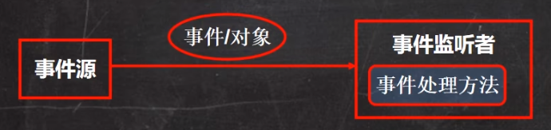

# 1. QuickStart

Swing是Java的GUI库，使用时需要导包 `import javax.swing.*;`

## 1.1 创建画板Panel

panel相当于一个画板组件，Graphics就是画笔，提供了很多绘制形状的方法

```java
class MyPanel extends JPanel {
    @Override 
    public void paint(Graphics g) {
        // 调用父类的方法完成初始化，第一行必须是这个
        super.paint(g);
        
        // 画一个圆
        g.drawOval(10, 10, 100, 100);
    }
}
```

paint方法调用时机

- 第一次在屏幕显示的时候，会自动调用paint方法
- 窗口最小化到托盘，再最大化之后会再次调用
- 窗口大小发生变化时会调用
- repaint函数被调用时

## 1.2 创建窗口Frame

```java
public MyFrame extends JFrame {
    public static void main(String[] args) {
        new MyFrame();
    }
    
    // 构造器
    public MyFrame() {
        // 创建画板对象
        mp = new MyPanel();
        // 将画板添加至窗口中
        this.add(mp);
        // 设置窗口属性
        this.setSize(300, 400); // 窗口大小
        this.setVisible(true); // 设置窗口可见性
        this.setDefaultCloseOperation(JEXIT_ON_CLOSE); // 当关闭窗口时程序也一起关闭
    }
}
```

# 2. Graphics画笔类

Graphics类中提供了各种绘制图形的方法

## 2.1 设置画笔属性

### 2.1.1 setColor设置颜色

```java
g.getColor(Color.red);
```

### 2.1.2 setFont设置字体

`setFont(Font font)`

需要传入一个Font对象来为当前画笔设置字体

```java
g.setFont(new Font("隶书", Font.BOLD, 50));
```

设置字体、字体形状和字体大小

## 2.2 绘制图形

### 2.2.1 drawLine画直线

`drawLine(int x1, int y2, int x2, int y2)`

从(x1,y1) 到 (x2,y2) 画一条线

### 2.2.2 drawRect画矩形

`drawRect(int x, int y, int width, int height)`

矩形的左上角坐标为（x,y），宽和高分别为width和height

### 2.2.3 fillRect填充矩形

指定一个矩形区域并使用当前画笔颜色填充

`fillRect(int x, int y, int width, int height)`

### 2.2.4 drawOval画椭圆

`drawOval(int x, int y, int width, int height)`

指定一个矩形区域，画一个外切于该矩形的椭圆轮廓

### 2.2.5 fillOval填充椭圆

指定一个椭圆区域，并用当前画笔颜色填充

`fillOval(int x, int y, int width, int height)`

### 2.2.6 drawImage画图片

1. 获取图片资源

   ```java
   Image image = Toolkit.getDefaultToolkit().
       getImage(Panel.class.getResource(imagePath));
   ```

   图片最好放在项目目录下，使用相对路径

2. 画图

   `g.drawImage(image, x, y, width, height, this);`

   表示在画板的(x,y)位置开始画图，图片宽高分别为(width, height)，this表示在当前画板上画

### 2.2.7 drawString写字

写字之前最好先设置字体和画笔颜色

```java
g.drawString("HelloWorld！", 100, 100);
```

后面两个参数是字左下角坐标

### 2.2.8 fill3DRect画3D矩形

`fill3DRect(int x, int y, int width, int height, boolean raised)`

这样画出的矩形有3D高光效果

最后的布尔类型参数用于指定该矩形是高于表面还是嵌入表面中

# 3. 事件处理机制



当发生事件时（比如键盘上一个键被按下），那么产生事件的对象（事件源）会将该事件封装成一个对象（比如KeyEvent对象）传递给事件监听者（实现了KeyListener的类），进而事件监听者可以做出处理

## 3.1 键盘事件监听

用一个类实现`KeyListener`接口

在JFrame窗口的构造器中加入监听对象`this.addKeyListener(KeyListener l);`

在实现KeyListener接口的类中重写keyPressed keyReleased keyTyped即可监听到键盘被按住、被松开和被按下

```java
// 键盘被按下
@Override
public void keyTyped(KeyEvent e) {
    
}

// 键盘被按住
@Override
public void keyPressed(KeyEvent e) {
    
}

// 键盘被松开
@Override void keyReleased(KeyEvent e) {
    
}
```

可以用`e.getKeyCode()`来获取具体是哪个按键触发的事件

键盘上的每个按键都是`KeyEvent`类中的一个`static final`静态常量值

### 3.1.1 控制小球移动

```java
public class MoveTest extends JFrame {
    public static void main(String[] args) {
        new MoveTest();
    }

    public MoveTest() {
        MyPanel1 mp1 = new MyPanel1();

        this.addKeyListener(mp1); // 将键盘监听对象加入窗口中

        this.add(mp1);
        this.setSize(1000, 1000);
        this.setVisible(true);
        this.setDefaultCloseOperation(JFrame.EXIT_ON_CLOSE);
    }
}

class MyPanel1 extends JPanel implements KeyListener {
    int x = 10;
    int y = 10;
    @Override
    public void paint(Graphics g) {
        super.paint(g);
        g.fillOval(x, y, 10, 10);
    }

    @Override
    public void keyTyped(KeyEvent e) {

    }

    @Override
    public void keyPressed(KeyEvent e) {
        // 根据监听到的按键更改坐标
        switch (e.getKeyCode()) {
            case KeyEvent.VK_UP:
            case KeyEvent.VK_W:
                y--;
                break;
            case KeyEvent.VK_DOWN:
            case KeyEvent.VK_S:
                y++;
                break;
            case KeyEvent.VK_LEFT:
            case KeyEvent.VK_A:
                x--;
                break;
            case KeyEvent.VK_RIGHT:
            case KeyEvent.VK_D:
                x++;
                break;
        }
        // 更改坐标之后要记得重绘
        this.repaint();
    }

    @Override
    public void keyReleased(KeyEvent e) {

    }
}
```

