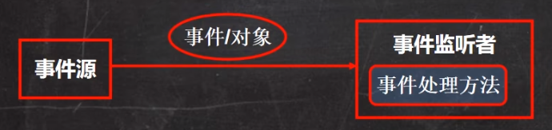

# 1. QuickStart

Swing是Java的GUI库，使用时需要导包 `import javax.swing.*;`

## 1.1 创建画板Panel

panel相当于一个画板组件，Graphics就是画笔，提供了很多绘制形状的方法

```java
class MyPanel extends JPanel {
    @Override 
    public void paint(Graphics g) {
        // 调用父类的方法完成初始化，第一行必须是这个
        super.paint(g);
        
        // 画一个圆
        g.drawOval(10, 10, 100, 100);
    }
}
```

paint方法调用时机

- 第一次在屏幕显示的时候，会自动调用paint方法
- 窗口最小化到托盘，再最大化之后会再次调用
- 窗口大小发生变化时会调用
- repaint函数被调用时

## 1.2 创建窗口Frame

```java
public MyFrame extends JFrame {
    public static void main(String[] args) {
        new MyFrame();
    }
    
    // 构造器
    public MyFrame() {
        // 创建画板对象
        mp = new MyPanel();
        // 将画板添加至窗口中
        this.add(mp);
        // 设置窗口属性
        this.setSize(300, 400); // 窗口大小
        this.setVisible(true); // 设置窗口可见性
        this.setDefaultCloseOperation(JFame.EXIT_ON_CLOSE); // 当关闭窗口时程序也一起关闭
    }
}
```

# 2. Graphics画笔类

Graphics类中提供了各种绘制图形的方法

## 2.1 设置画笔属性

### 2.1.1 setColor设置颜色

```java
g.getColor(Color.red);
```

### 2.1.2 setFont设置字体

`setFont(Font font)`

需要传入一个Font对象来为当前画笔设置字体

```java
g.setFont(new Font("隶书", Font.BOLD, 50));
```

设置字体、字体形状和字体大小

## 2.2 绘制图形

### 2.2.1 drawLine画直线

`drawLine(int x1, int y2, int x2, int y2)`

从(x1,y1) 到 (x2,y2) 画一条线

### 2.2.2 drawRect画矩形

`drawRect(int x, int y, int width, int height)`

矩形的左上角坐标为（x,y），宽和高分别为width和height

### 2.2.3 fillRect填充矩形

指定一个矩形区域并使用当前画笔颜色填充

`fillRect(int x, int y, int width, int height)`

### 2.2.4 drawOval画椭圆

`drawOval(int x, int y, int width, int height)`

指定一个矩形区域，画一个外切于该矩形的椭圆轮廓

### 2.2.5 fillOval填充椭圆

指定一个椭圆区域，并用当前画笔颜色填充

`fillOval(int x, int y, int width, int height)`

### 2.2.6 drawImage画图片

1. 获取图片资源

   ```java
   Image image = Toolkit.getDefaultToolkit().
       getImage(Panel.class.getResource(imagePath));
   ```

   图片最好放在项目目录下，使用相对路径

2. 画图

   `g.drawImage(image, x, y, width, height, this);`

   表示在画板的(x,y)位置开始画图，图片宽高分别为(width, height)，this表示在当前画板上画

### 2.2.7 drawString写字

写字之前最好先设置字体和画笔颜色

```java
g.drawString("HelloWorld！", 100, 100);
```

后面两个参数是字左下角坐标

### 2.2.8 fill3DRect画3D矩形

`fill3DRect(int x, int y, int width, int height, boolean raised)`

这样画出的矩形有3D高光效果

最后的布尔类型参数用于指定该矩形是高于表面还是嵌入表面中

# 3. 事件处理机制



当发生事件时（比如键盘上一个键被按下），那么产生事件的对象（事件源）会将该事件封装成一个对象（比如KeyEvent对象）传递给事件监听者（实现了KeyListener的类），进而事件监听者可以做出处理

## 3.1 键盘事件监听

1. 用一个类实现`KeyListener`接口

2. 在JFrame窗口的构造器中加入监听对象`this.addKeyListener(KeyListener l);`

3. 在实现KeyListener接口的类中重写keyPressed keyReleased keyTyped即可监听到键盘被按住、被松开和被按下

```java
// 键盘被按下
@Override
public void keyTyped(KeyEvent e) {
    
}

// 键盘被按住
@Override
public void keyPressed(KeyEvent e) {
    
}

// 键盘被松开
@Override void keyReleased(KeyEvent e) {
    
}
```

可以用`e.getKeyCode()`来获取具体是哪个按键触发的事件

键盘上的每个按键都是`KeyEvent`类中的一个`static final`静态常量值

### 3.1.1 控制小球移动

```java
public class MoveTest extends JFrame {
    public static void main(String[] args) {
        new MoveTest();
    }

    public MoveTest() {
        MyPanel1 mp1 = new MyPanel1();

        this.addKeyListener(mp1); // 将键盘监听对象加入窗口中

        this.add(mp1);
        this.setSize(1000, 1000);
        this.setVisible(true);
        this.setDefaultCloseOperation(JFrame.EXIT_ON_CLOSE);
    }
}

class MyPanel1 extends JPanel implements KeyListener {
    int x = 10;
    int y = 10;
    @Override
    public void paint(Graphics g) {
        super.paint(g);
        g.fillOval(x, y, 10, 10);
    }

    @Override
    public void keyTyped(KeyEvent e) {

    }

    @Override
    public void keyPressed(KeyEvent e) {
        // 根据监听到的按键更改坐标
        switch (e.getKeyCode()) {
            case KeyEvent.VK_UP:
            case KeyEvent.VK_W:
                y--;
                break;
            case KeyEvent.VK_DOWN:
            case KeyEvent.VK_S:
                y++;
                break;
            case KeyEvent.VK_LEFT:
            case KeyEvent.VK_A:
                x--;
                break;
            case KeyEvent.VK_RIGHT:
            case KeyEvent.VK_D:
                x++;
                break;
        }
        // 更改坐标之后要记得重绘
        this.repaint();
    }

    @Override
    public void keyReleased(KeyEvent e) {

    }
}
```

## 3.2 窗口事件监听

在JFrame构造器中增加对相应窗口事件的监听

```java
public class MyFrame extends JFrame {
    public MyFrame () {
        this.addWindowListener(new WindowAdapter() {
        	// 在这里重写方法即可监听不同的窗口事件 
        });
    }
} 
```

- 窗口关闭事件

```java
@Override
public void windowClosing(WindowEvent e) {
    sout("检测到窗口被关闭");
    System.exit(0);
}
```

## 3.3 点击按钮事件

```java
JButton btn = new JButton("登录"); // 按钮上显示的字
this.add(btn); // 将btn组件加入到JPanel中

btn.addActionListener(new ActionListener() {
   @Override
    public void actionPerformed(ActionEvent e) {
        // 按钮被点击后自动执行这个函数
    }
});
```

# 4. Swing界面案例

## 4.1 聊天室系统

### 4.1.1 登录界面

```java
public class LoginPanel extends JPanel{

    public LoginPanel() {
        this.setLayout(null);

        // 提示文本：用户名
        JLabel nameLabel = new JLabel("用户名：");
        nameLabel.setBounds(30, 20, 80,25);
        this.add(nameLabel);

        // 用户名输入框
        JTextField nameTextField = new JTextField(20);
        nameTextField.setBounds(100, 20, 165, 25);
        this.add(nameTextField);

        // 提示文本：密码
        JLabel pwdLabel = new JLabel("密码：");
        pwdLabel.setBounds(30, 50, 80, 25);
        this.add(pwdLabel);

        // 密码输入框
        JPasswordField pwdPasswordField = new JPasswordField(20);
        pwdPasswordField.setBounds(100, 50, 165, 25);
        this.add(pwdPasswordField);

        // 警告信息
        JLabel warnNoneUsername = new JLabel(); // 用户名为空
        warnNoneUsername.setForeground(Color.red);
        warnNoneUsername.setBounds(275, 20, 80, 25);
        this.add(warnNoneUsername);
        JLabel warnNonePwd = new JLabel(); // 密码为空
        warnNonePwd.setForeground(Color.red);
        warnNonePwd.setBounds(275, 50, 80, 25);
        this.add(warnNonePwd);
        JLabel warnLoginFault = new JLabel(); // 登录失败
        warnLoginFault.setForeground(Color.red);
        warnLoginFault.setBounds(100, 70, 160, 30);
        this.add(warnLoginFault);

        // 登录按钮
        JButton loginButton = new JButton("登录");
        loginButton.setBounds(130, 100, 80, 25);
        this.add(loginButton);
        // 给按钮添加点击事件
        loginButton.addActionListener(new ActionListener() {
            @Override
            public void actionPerformed(ActionEvent e) {
                // 获取用户输入的用户名和密码并保证非空
                String usrName = nameTextField.getText();
                // 用户名为空时显示提示信息
                if ("".equals(usrName)) {
                    warnNoneUsername.setText("用户名为空");
                    return;
                } else {
                    warnNoneUsername.setText("");
                }
                String pwd = new String(pwdPasswordField.getPassword());
                // 密码为空时显示提示信息
                if ("".equals(pwd)) {
                    warnNonePwd.setText("密码为空");
                    return;
                } else {
                    warnNonePwd.setText("");
                }

                // 调用登录服务
                if (loginService.checkUser(usrName, pwd)) {
                    user = new User(usrName, pwd);
                    changePanel(); // 界面跳转，进入系统主页
                } else {
                    warnLoginFault.setText("用户名不存在或密码错误");
                }
            }
        });
    }
}
```

### 4.1.2 界面跳转功能

```java
private void changePanel () {
    loginPanel.setVisible(false);

    this.setSize(800,600);
    chatPanel = new ChatPanel();
    this.add(chatPanel);
    chatPanel.setVisible(true);
}
```

就是将登录界面设为不可见，将系统主页界面设为可见

### 4.1.3 聊天室界面

```java
public class ChatPanel extends JPanel {

    JTextArea chatTextArea = null;
    JTextField inputTextField = null;

    public ChatPanel () {
        // 设置布局模式
        this.setLayout(new BorderLayout());

        /********设置聊天记录显示框***********/
        JScrollPane scrollPane = new JScrollPane(); // 滚动条
        // 设置滚动条的出现规则
        scrollPane.setHorizontalScrollBarPolicy(ScrollPaneConstants.HORIZONTAL_SCROLLBAR_NEVER);
        scrollPane.setVerticalScrollBarPolicy(ScrollPaneConstants.VERTICAL_SCROLLBAR_AS_NEEDED);
        // 设置文本显示区域
        chatTextArea = new JTextArea(30, 100);
        chatTextArea.setFocusable(false); // 隐藏光标
        scrollPane.setViewportView(chatTextArea); // 将文本显示区域放入滚动条区域中
        this.add(scrollPane, BorderLayout.CENTER); // 将滚动条区域加入Panel

        /*************设置文本输入框*******************/
        JPanel inputPanel = new JPanel();
        // 输入框
        inputTextField = new JTextField(30);
        inputTextField.requestFocus();
        
        inputPanel.add(inputTextField);
        // 发送按钮
        JButton sendBtn = new JButton("发送");
        sendBtn.addActionListener(new ActionListener() {
            @Override
            public void actionPerformed(ActionEvent e) {
                String text = inputTextField.getText();
                if (sendText(text)) {
                    // 时间戳
                    DateTimeFormatter dtf = DateTimeFormatter.ofPattern("HH:mm:ss");
                    String date = dtf.format(LocalDateTime.now());
                    addText(dtf.format(LocalDateTime.now()) + "  我 ： " + text);
                }
            }
        });
        inputPanel.add(sendBtn);

        this.add(inputPanel, BorderLayout.SOUTH);
    }

    /**
     * 向聊天记录框中加入消息
     * @param text - 要添加的文本信息
     */
    public void addText(String text) {
        chatTextArea.append(" " + text + "\n");
    }

    /**
     * 点击发送按钮之后发送消息
     */
    public boolean sendText(String text) {
        if ("".equals(text)) {
            JOptionPane.showMessageDialog(MainMenu.this, "发送内容不能为空");
            return false;
        }
        UtilFunction.sendAllUser(text);
        inputTextField.setText("");
        inputTextField.requestFocus();
        return true;
    }
} 
```

# 5. 正则表达式 RegExp

正则表达式：Regular expression

## 5.1 Java使用正则表达式

### 5.1.1 基本用法

**在文本中寻找符合要求的字符串**

1. 定义正则表达式的的匹配要求

   `String regStr = "\\d\\d\\d\\d";`

   表示匹配四个任意数字

2. 创建模式对象pattern

   ```java
   Pattern pattern = Pattern.compile(regStr);
   ```

3. 创建匹配器matcher

   content是要匹配的字符串

   `Matcher matcher = pattern.metcher(content);`

4. 开始匹配

   find会在content中找到所有符合正则表达式的字符串

   ```java
   while (matcher.find()) {
       sout("匹配成功：" + matcher.group(0));
   }
   ```

**验证给定字符串是否满足正则表达式要求**

```java
String content = "hello world!";
String regStr = "hello"; // 返回false
String regStr = "hello.*"; // 返回true，因为能匹配到content的全部内容

boolean matches = Pattern.matches(regStr, content);
```


### 5.1.2 matcher类底层

matcher类中维护一个int数组groups，初始化为-1，每次匹配到一个符合正则要求的字符串之后，就会将字符串信息存储在该groups数组中，其中groups[0]是匹配到的字符串在原字符串中的起始index，groups是匹配到的字符串的结束index+1

如果正则表达式中有分组，则groups[2 * i]是第 i 个分组的起始下标，groups[2 * i + 1]是第i个分组的结束下标+1

matcher类中还维护了oldLast，每次查找完后oldLast = groups[1]，表示下次查找从上次查到的结果的下一个字符开始查找 

```java
public String group(int group) {
    checkMatch();
    checkGroup(group);
    if ((groups[group*2] == -1) || (groups[group*2+1] == -1))
        return null;
    return getSubSequence(groups[group * 2], groups[group * 2 + 1]).toString();
}
```

## 5.2 字符

### 5.2.1 普通字符

普通字符包括所有大写和小写字母、所有数字、所有标点符号和一些其他符号

| 符号 | 含义                               | 示例                                       |
| :--: | :--------------------------------- | ------------------------------------------ |
|  []  | 匹配一个字符，该字符需要在[]中     | [ABC]表示匹配ABC三个中的任意一个字符       |
| [^]  | 匹配一个字符，该字符不在[^]中      | [^ABC]表示匹配除了ABC以外的任意一个字符    |
|  -   | 匹配区间                           | [A-Z]表示匹配A-Z中任意一个字符，即大写字母 |
|  .   | 匹配除了换行符\n之外的任意字符     | . 匹配一个单个字符                         |
| \\d  | 匹配单个数字字符                   | 相当于匹配[0-9]                            |
|  \D  | 匹配单个非数字字符                 | 相当于匹配\[^0.9]                          |
| \\w  | 匹配单个数字、大小写字母字符       | 相当于匹配[0-9a-zA-Z]                      |
| \\W  | 匹配单个非（单个数字、大小写字母） | 相当于匹配\[^0-9a-zA-Z]                    |

### 5.2.2 特殊字符 - 限定符

在正则表达式中有特殊含义的字符，如果需要忽略特殊含义匹配这些符号，则需要在符号前加转义字符

**转义字符**：使用正则表达式匹配某些特殊字符时，需要用到转义符号`\`，在Java中使用正则时，两个`\\`表示一个`\`，需要用到转义字符的有`* + ( ) $ / \ ? [ ] ^ { }`

限定符的作用范围为前面一个子表达式，子表达式指一个圆括号括起来的表达式或者一个字符

| 符号  | 含义                                                         | 示例                                  |
| :---: | ------------------------------------------------------------ | ------------------------------------- |
|   *   | 匹配前面的子表达式零次或多次<br />（即前面的子表达式出现零次或多次时都满足要求） | zo* 可以匹配到z及zo及zoo...           |
|   +   | 匹配前面的子表达式一次或多次                                 | zo+ 可以匹配到zo及zoo...              |
|   ?   | 匹配前面的子表达式零次或一次                                 | zo? 只能匹配z及zo                     |
|  {n}  | 匹配前面的子表达式n次                                        | zo{2} 只能匹配 zoo                    |
| {n, } | 匹配前面的子表达式至少n次                                    | zo{0,}等价于zo*<br />zo{1,} 等价于zo+ |
| {n,m} | 匹配前面的子表达式出现n到m次，闭区间                         | zo{1,3} 只能匹配zo zoo zooo           |

### 5.2.2 特殊字符 - 定位符

| 符号 | 含义                                         | 示例                                                      |
| :--: | -------------------------------------------- | --------------------------------------------------------- |
|  ^   | 指定起始字符，即字符串以什么开头             | ^[0-9] 字符串以任意数字开头                               |
|  $   | 匹配输入字符串结尾的位置，即字符串以什么结尾 | [a-z]+$ 字符串以至少一个小写字母结尾                      |
| \\b  | 匹配目标字符串的边界（空格或结尾）           | han\b 在”hanh**han** **han**“字符串中 之后匹配到加粗的han |
| \\B  | 与\\b含义相反                                | han\\B 在 ”**han**hhan han“中匹配到加粗部分               |

## 5.3 功能语法

### 5.3.1 忽略大小写

`(?i)`表示不区分大小写

- `(?i)abc` abc都不区分大小写
- `a(?i)bc` bc不区分大小写
- `a((?i)b)c`只有b不区分大小写

或者在创建pattern对象时传入参数

`Pattern pattern = Pattern.compile(regStr, Pattern.CASE_INSENSITIVE);`

### 5.3.2 选择匹配符

用圆括号将所有选择项括起来，相邻的选择项之间用`|`分隔

`([0-9]|[a-z])` 表示匹配一个字符，这个字符可以是数字也可以是小写字母

### 5.3.3 分组、捕获、反向引用

在正则表达式中用圆括号括起来就是一个分组，分组中的内容作为一个整体使用一个限定符或者定位符，除此之外分组还可以被捕获

**捕获分组**

|       符号        | 含义                                                         | 示例                                                         |
| :---------------: | ------------------------------------------------------------ | ------------------------------------------------------------ |
|     (pattern)     | 非命名捕获，在正则表达式中括号包住的子表达式会被额外捕获并从1开始编号，在结果中可以通过编号获取分组中的字符串 | (\d\d)([a-z]\[a-z]) 匹配两个数字+两个字母  ，但是在结果中可以通过matcher.group(1)取得两个数字 |
| (?\<name>pattern) | 命名分组给捕获的分组取名，可以通过分组的名字来取到分组       | 可以通过matcher.group("name")取得分组值                      |

**反向引用**

分组内容被捕获之后，可以在这个括号后面的正则表达式被使用，正则表达式内部用`\x`来引用，正则表达式外部用`$x`来引用，x是分组编号

比如：

- 匹配四位数字，要求个位与千位相同，十位与百位相同`(\d)(\d)\2\1`

- 去除所有相邻的连续字符

  ```java
  Pattern pattern = Pattern.compile("(.)\\1+"); // 匹配相邻的连续字符
  Matcher matcher = pattern.matcher("aaa1112345bb");
  String content = matcher.replaceAll("$1");
  /
  ```

  

**非捕获分组**

即只将小括号中的表达式进行分组，但是不捕获，也就是不能获取该子表达式内容

|    符号     | 含义                       | 示例                                                         |
| :---------: | -------------------------- | ------------------------------------------------------------ |
| (?:pattern) | 非捕获分组，包括分组中内容 | Windows(?:95\|98)<br />匹配Windows95和Windows98              |
| (?=pattern) | 非捕获分组，不要分组中内容 | Windows(?=95\|98)<br />匹配Windows95和Windows98中的Windows，也就是匹配结果中只有Windows |
| (?!pattern) | 非捕获分组                 | Windows(?!95\|98)<br />匹配Windows，但是这个Windows后面不能跟95和98，匹配结果中也只有Windows |

### 5.3.4 贪心

贪婪匹配就是在满足要求的情况下匹配尽可能多的字符，非贪婪就是匹配尽可能少的字符

比如`111111111a`用`1+`匹配，贪婪模式下会将1全部匹配，非贪婪模式下只匹配一个1

默认都是贪心匹配，如果需要贪心匹配则需要在限定符后面加？，即`1+?`
