# 1. 虚拟机介绍

虚拟机（virtual machine）就是一台虚拟的计算机，是一个软件，用来执行一系列虚拟计算机指令

虚拟机可分为系统虚拟机和程序虚拟机

- 系统虚拟机：如Visual Box，VMWare。它们完全是对物理计算机的仿真，可以运行完整操作系统
- 程序虚拟机：如Java虚拟机，它专门为执行单个计算机程序而设计

Java虚拟机是一台执行Java字节码（.class文件）的虚拟计算机

 JVM（以HotSpot为例）的整体结构：

JVM运行之后，将类通过类装载器加载到内存（运行时数据库）中，然后由执行引擎利用数据区中的数据进行程序执行

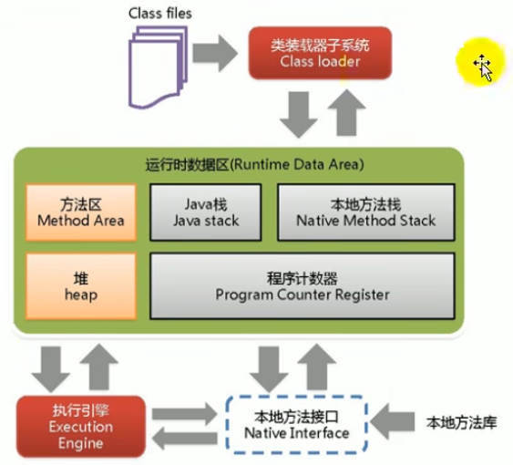

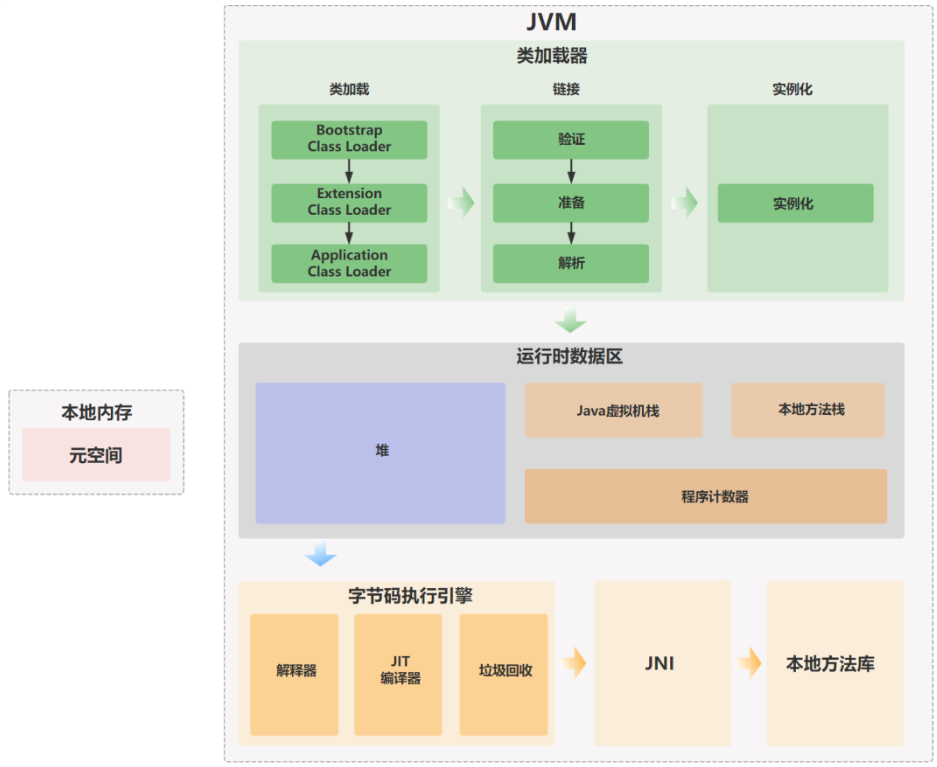


- 类加载器用来加载类文件（也就是.class文件）
- 运行时数据区用于存放程序运行时的数据
- 执行引擎负责将字节码指令（.class文件中的指令）解释为机器指令

# 2. 类加载

类加载通过类加载器子系统Class Loader完成。该过程只负责class文件的加载，至于能否运行由执行引擎在执行时才能决定。

加载的类信息会存放在运行时数据库的方法区位置。

## 2.1 类加载过程

类加载分为加载阶段、链接阶段、初始化阶段

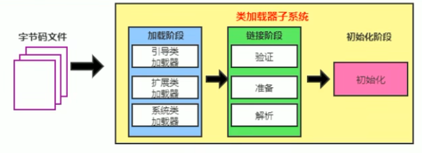

### 2.1.1 加载阶段

加载阶段主要工作：

1. 通过类的全限定名获取次类的二进制字节流
2. 将这个字节流所代表的静态存储结构加载为运行时数据结构，放入方法区中，这就是类的元数据
3. 在内存（堆）中生成一个代表该类的java.lang.Class对象，作为访问 方法区中对应该类的元数据的入口

### 2.1.2 链接阶段

此时已经加载了类对应的Class对象

链接阶段又分为三个小阶段：验证Verify、准备Prepare、解析Resolve

1. 验证

   确保类对应的字节流符合JVM要求，保证被加载类的正确性，不会危害虚拟机自身安全

   比如验证类的二进制字节流格式是否以cafe babe开头，方法调用的参数个数和类型是否正确、变量是否在使用之前被正确初始化等。

2. 准备

   为类变量（即static变量）分配内存，并为该static变量设置默认初始值。不会为实例变量（成员变量）分配内存和初始化

   类变量内存应该在方法区中分配，JDK7之前使用永久代当方法区的时候，由于永久代在堆中，因此符合这种逻辑；但是JDK7及之后方法区用元空间实现并放在了堆外，此时静态变量就不在方法区中了，而是随着Class对象一起放在堆中

3. 解析：有时候解析操作会在初始化阶段之后再执行

   将常量池内的符号引用转换为直接引用

**符号引用**

符号引用以一组符号来描述所引用的目标。因为在编译时Java类并不知道所引用的类的实际地址，因此只能使用符号引用来代替，比如用全类名com.User来标识这个类

直接引用通过对符号引用进行解析，找到引用的实际内存地址

### 2.1.3 初始化阶段

初始化阶段会执行类构造器方法 ：\<clinit>方法

\<clinit>方法不需要定义，javac编译器会自动收集所有类变量的赋值动作和静态代码块中的语句，并合并为\<clinit>方法，按照在源文件中出现的顺序合并。如果类中没有类变量和静态代码块，就没有\<clinit>方法

\<clinit>方法和类构造器（即\<init>方法）并不是一个东西

由于类只能被加载一次，因此\<clinit>方法在执行时会被加上同步锁

**初始化时机**

当类被第一次使用时才会进行初始化，比如在以下场景

- 创建类的实例时

- 访问类的静态方法或静态字段时

  访问final static修饰的静态常量不会，因为常量在编译器就已经放入常量池

- 使用java.lang.reflect包的方法对类进行反射调用时

- 初始化一个类的子类时

  初始化子类首先会初始化父类

- JVM启动时，用户指定的主类（即包含main方法的类）将被初始化

## 2.2 类加载器分类

JVM支持两种类型的类加载器：引导类加载器（Bootstrap Class Loader）和自定义类加载器（User-Defined Class Loader）

JVM提供的类加载器有：Bootstrap Class Loader、扩展类加载器Extension Class Loader、系统类加载器Application Class Loader

自定义加载器是指所有派生于抽象类ClassLoader的类加载器，Extension Class Loader和Application Class Loader都属于自定义加载器

**引导类加载器**

Bootstrap Class Loader，启动类加载器，也叫引导类加载器

这个类加载器使用C/C++语言实现，是JVM的一部分，用来加载Java核心库，提供JVM自身需要的类（比如包名以java、javax、sun等开头的类）

Bootstrap Class Loader不继承自java.lang.ClassLoader，没有父加载器，自己就是一类加载器

**扩展类加载器**

属于自定义加载器，由Java语言编写，继承于ClassLoader类

从java.ext.dirs系统属性指定的目录中加载类库，或从JDK安装目录的jre/lib/ext子目录（扩展目录）下加载类库。如果用户创建的JAR包放在此目录下，也会由扩展类加载器加载

**系统类加载器**

AppClassLoader，也叫应用程序类加载器

由Java语言编写，派生于ClassLoader类

是程序中默认的类加载器，Java应用中的类一般都由它加载

**用户自定义类加载器**

在Java日常开发中，上述三种类加载器已经足够了

在一些场景可能需要自己定义类加载器：

- 隔离加载类

  解决项目和中间件引入的jar包冲突问题

- 修改类加载的方式

- 扩展加载源

- 防止源码泄露

## 2.3 双亲委派机制

双亲委派机制是Java虚拟机加载类时用到的机制

Java虚拟机对class文件采用按需加载的方式，即当需要使用类时才会将它的class文件加载到内存。加载类的class文件时，用到的就是双亲委派机制，即把加载请求交由该类的父类处理。这是一种任务委派模式

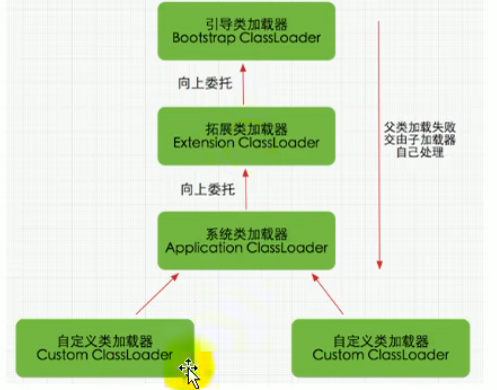

这张图中的类加载器并不是继承关系，而是层级关系，有点类似于文件目录结构

**加载过程**

1. 类加载器收到类加载请求之后，并不会自己直接加载，而是把这个请求委托给父类的加载器
2. 如果父类加载器还存在父类加载器，则进一步向上委托，依次递归，请求最终将到达顶层的启动类加载器
3. 如果父类加载器可以完成当前请求的类加载任务，就成功返回，若无法完成此加载任务，子加载器才会尝试自己加载。

**优点**

为什么要使用双亲委派机制

- 避免类的重复加载

- 保护程序安全，防止核心API被随意篡改

  比如说自定义一个java.lang包，并创建一个名为String的类。在创建String对象时，由于会委托给Bootstrap ClassLoader加载器，而引导类加载器会直接去核心类库中加载String类，因此程序不会加载自定义的java.lang.String从而避免程序崩溃

  事实上如果自定义java.lang包，这个包下的所有类都不会正常加载，而是会报出安全错误，因为java.lang包都会交由Bootstrap ClassLoader加载

## 2.4 沙箱安全机制

Java安全模型的核心就是Java沙箱（sandbox）。

沙箱是一个限制程序运行的环境，Java沙箱机制就是将Java代码限定在JVM特定的运行范围中运行，并且严格限制代码对本地资源的访问，通过这样的措施来对代码进行有效隔离，防止代码对本地系统造成破坏。

字节码校验器（确保java文件遵循java语言规范）和类加载器的双亲委派机制都是沙箱安全机制的一部分

双亲委派机制可以保证从最内层JVM自带的bootstrap ClassLoader开始加载，从而使得外层恶意同名类（比如自定义的java.lang.String类）得不到加载从而无法使用

# 3. Java内存区域

JVM会在执行Java程序时把JVM管理的内存划分为若干个不同的区域，每个在运行的Java程序对应一个JVM对应一个运行时数据区

JDK1.8和之前版本略有不同，以JDK1.7和JDK1.8为例

JDK1.7:

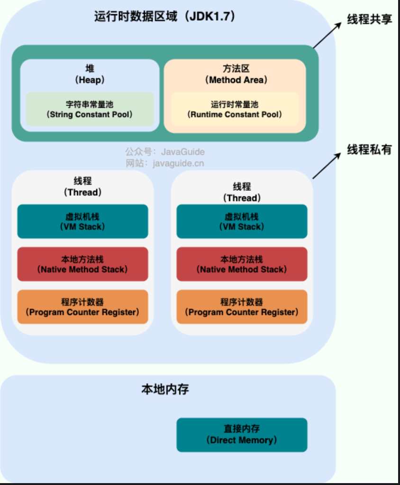

JDK1.8:

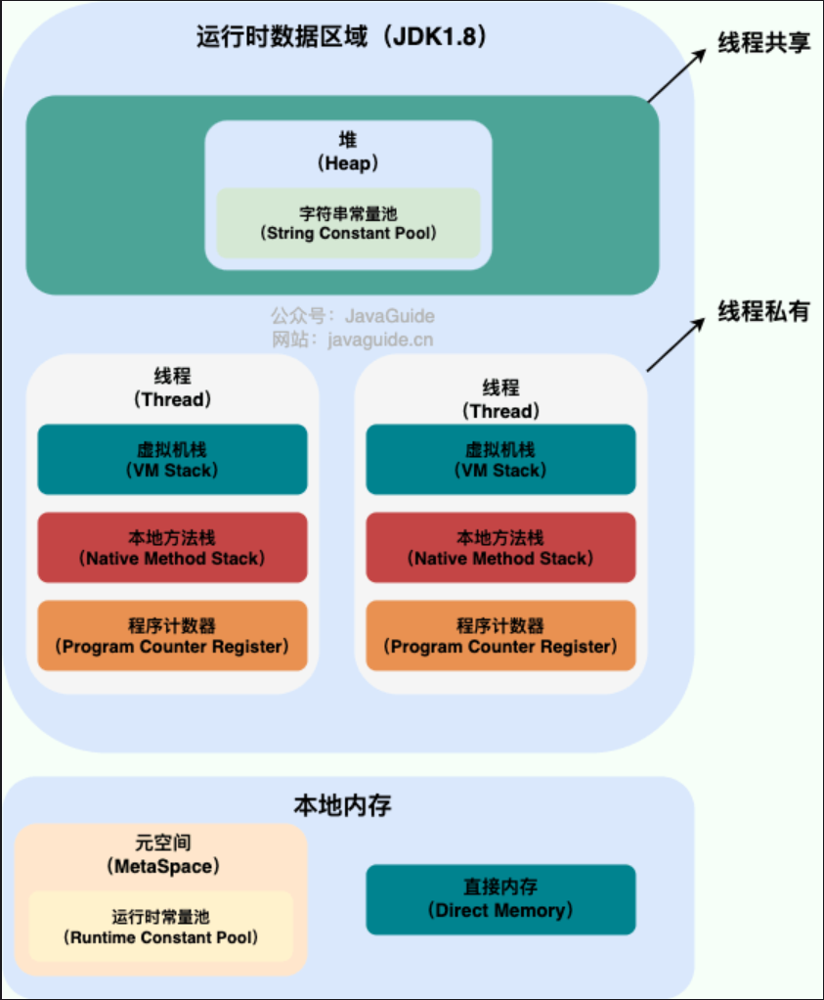

 其中堆和方法区是线程共享的，而程序计数器、本地方法栈和虚拟机栈是线程私有的，也就是每个线程都对应一份

其中栈和程序计数器都会随着线程创建而创建，线程销毁而销毁，因此需要垃圾回收的区域只有堆和方法区

## 3.1 程序计数器

PC Register（Program Counter Register，PC寄存器），用来记录当前线程下一条要执行的指令位置，可以看作是当前线程所执行的字节码的行号指示器。PC寄存器是CPU中的物理PC寄存器的抽象模拟

为了线程切换后能恢复到正确执行位置，所以每条线程都对应一个独立的程序计数器，各线程之间计数器互不影响，独立存储

它是唯一一个不会发生OutofMemoryError的区域

## 3.2 虚拟机栈

Java虚拟机栈，简称栈。栈中保存的元素叫栈帧。栈的生命周期等同于线程

几乎所有Java方法的调用都是通过栈来实现的，每一次方法调用都会有一个对应的栈帧压入栈中，当该方法调用完毕后再从栈中弹出。

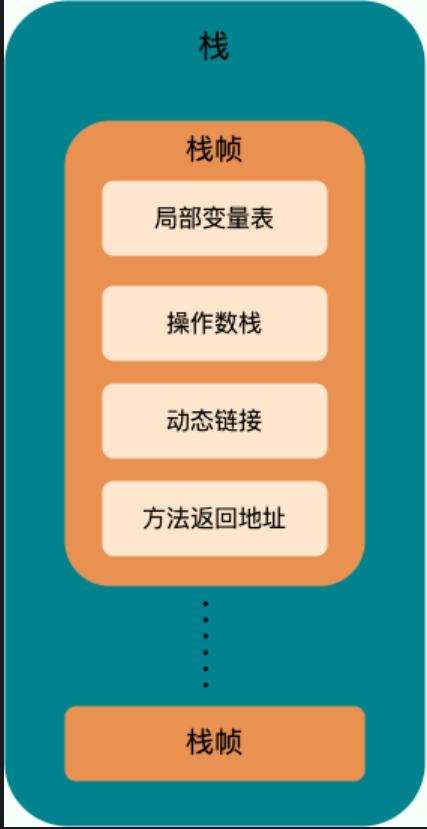

栈帧中保存了：局部变量表、操作数栈、动态链接、方法返回地址

- 局部变量表Local Variables：存放了编译期可知的各种类型数据和对象引用
- 操作数栈Operand Stack：存放方法执行过程中产生的中间计算结果，以及计算过程中产生的临时变量
- 动态链接Dynamic Linking：主要用于一个方法需要调用其他方法的场景
- 方法返回地址Return Address

### 3.2.1 局部变量表

局部变量表实际上是一个数字数组，用于存放编译期可知的基本数据类型变量、对象引用、和returnAddress类型，因此局部变量表大小在编译器就已经确定，运行时不会改变，大小保存在方法的Code属性中的maximum local variables数据项中

里面存储了方法参数和方法内定义的局部变量（可以存储的数据类型就是上面提到的基本数据类型、对象引用和returnAddress）

**栈中可能出现的异常**

JVM规范允许栈的大小是动态的或固定不变的

- 固定大小，StackOverflow

  当线程请求分配的栈容量超过虚拟机栈允许的最大容量时，就会抛出StackOverflowError异常

- 动态扩展，OutOfMemory

  虚拟机栈在尝试扩展但无法申请到足够内存时，就会抛出OutOfMemory异常

## 3.3 本地方法栈

和虚拟机栈发挥的作用非常相似，区别在于：虚拟机栈为执行Java方法服务，而本地方法栈为执行Native方法服务。在HotSpot虚拟机中，本地方法栈和虚拟机栈合二为一。

里面存储的东西和虚拟机栈相同

## 3.4 堆

堆是Java虚拟机所管理的内存中最大的一块，由所有线程共享，在虚拟机启动时创建。

堆的唯一用处就是存放对象实例，几乎所有的对象实例以及数组都在这里分配内存。（"几乎" 是因为JIT编译器的发展与逃逸分析技术导致某些未被使用的对象可以直接在栈上分配内存）

堆是垃圾收集器管理的主要区域，因此也被称作GC堆。由于垃圾收集器基本都采用分代垃圾回收算法，所以Java堆可以细分为以下部分：

- 新生代内存（Young Generation）：包括Eden区（伊甸园）、Survivor幸存区S0和S1 等空间
- 老生代（Old Generation）
- JDK7及之前 永久代（Permanent Generation）/ JDK8之后 元空间（Metaspace）

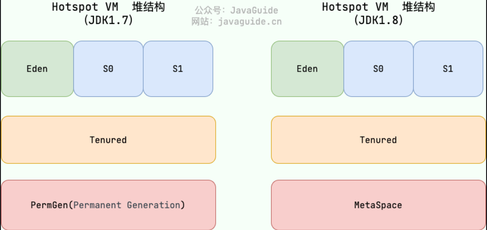

**对象分配过程**

大部分情况，对象都会首先在Eden区分配（在伊甸园出生），在一次新生代垃圾回收（轻GC）之后，如果对象还存活（还存在对该对象的引用），则会进入幸存者区S0或者S1，并且对象年龄还会加1，当年龄增加到一定程度（默认为15岁，因为对象中记录年龄的字段是4位），就会被晋升到老年代（养老区）中。如果养老区也满了，则会触发重GC（full GC）。

### 3.4.1 字符串常量池

字符串常量池是JVM针对字符串（String）类专门开辟的一块区域，在堆中。主要目的是为了避免字符串的重复创建，从而提升性能和减少内存消耗

JDK1.6及之前，字符串常量池放在永久代（即方法区）中，JDK1.7开始字符串常量池和静态变量从永久代移动到了Java堆中。主要是因为永久代的GC回收效率太低，但是Java程序中通常会有大量被创建的字符串等待回收。

## 3.5 方法区（元空间）

方法区是各个线程共享的内存区域，在JDK1.7及之前是堆的一部分（永久代）

当虚拟机要使用一个类时，需要读取并解析Class文件获取相关信息，再将信息存入到方法区。方法区会存储已被虚拟机加载的一些信息，包括：

- 类信息（类模板，即Class对象）

  里面保存了类的构造函数、定义的方法、接口定义等信息

- 常量（final修饰的）

- 静态变量（static修饰的）

- CodeCache，即时编译器编译后的代码缓存

方法区是Java虚拟机规范中定义的一个概念，类似与一个接口，而永久代（1.7及之前）和元空间（1.8及以后）则是方法区的一种实现。

**永久代和元空间的区别**

永久代在堆中，而JDK1.8引入的元空间在本地内存中

为什么要用元空间代替永久代：

1. 整个永久代有一个JVM本身设置的固定大小上限，无法进行调整（也就是受到JVM内存的限制）；而元空间使用的是本地内存，受本机可用内存限制，更不宜出现元空间溢出，并且能加载的类就更多了。
2. 在JDK8合并HotSpot和JRockit代码时，JRockit中从来没有一个叫永久代的东西，合并之后也就没必要额外设置一个永久代了
3. 永久代会为GC带来不必要的复杂度，并且回收效率偏低

**常用参数**

指定Metaspace的初始（和最小）大小：`-XX:MetaspaceSize=N`

指定Metaspace的最大大小：`-XX:MaxMetaspaceSize=N`

如果不指定大小，随着类的创建，虚拟机会耗尽所有可用的系统内存

### 3.5.1 运行时常量池

运行时常量池是方法区的一部分。

Class文件中除了有方法区内保存的类相关信息以外，还有常量池表，常量池表中存储了编译器生成的各种字面量（Literal）和符号引用（Symbolic Reference）

常量池表会在类加载后存放到运行时常量池中，运行时常量池的功能类似于传统编程语言的符号表

- 字面量：源代码中固定值的表示法，意思是通过字面就能知道其值含义的量

  包括整数、浮点数和字符串字面量，比如1，2.5，"HelloWorld"都是字面量

- 符号引用：

  包括类符号引用、字段符号引用、方法符号引用、接口方法符号等

## 3.6 直接内存

直接内存是一种特殊的内存缓冲区，不在Java堆或方法区中分配，而是用过JNI的方式在本地内存上分配。因此直接内存不是虚拟机运行时数据区的一部分，也不是虚拟机规范中定义的内存区域。

NIO（Non-Blocking I/O，也称为New I/O），可以直接使用Native函数库直接分配堆外内存，然后通过一个存储在Java堆中的DirectByteBuffer对象作为这块内存的引用 来操作这块内存。可以避免在Java堆和Native堆之间来回复制数据。

# 4. 举个例子

## 4.1 Java代码运行过程

```java
public class Main {
    public static void main(String[] args) {
        System.out.println("helloworld");
    }
}
```

以这段代码为例

- **step1:编译，生成.class字节码文件**

字节码文件生成之后可以在idea工程下的out文件夹找到，直接打开idea会显示反编译后的内容，可以用view-show bytecode打开字节码格式内容，或者下载插件jclasslib查看。字节码文件本身是二进制文件，也可以用hex16进制查看器查看

上面代码对应的字节码如下

```bytecode
0 getstatic #2 <java/lang/System.out : Ljava/io/PrintStream;>
3 ldc #3 <helloworld>
5 invokevirtual #4 <java/io/PrintStream.println : (Ljava/lang/String;)V>
8 return
```

字节码指令由一个操作码和若干个操作数构成，其中操作码是一个字节（1Byte=8bit）大小的指令，表示具体操作，操作数跟随操作码，用于提供额外信息

上面字节码序列的意思就是调用System.out.println方法打印J"helloworld"字符串

- `0 getstatic #2 <java/lang/System.out : Ljava/io/PrintStream;>`

  操作码是getstatic，操作数是2

  操作码表示获取静态字段，操作数#2是一个指向常量池的索引，这里指向的是java.lang.System类的out静态字段

- `3 ldc #3 <helloworld>`

  操作码是getstatic，操作数是3

  操作码表示从常量池中加载一个常量值到操作数栈顶，操作数#3是一个指向常量池的索引，这里指向的是字符串常量池中"helloworld"的引用

- `5 invokevirtual #4 <java/io/PrintStream.println : (Ljava/lang/String;)V>`

  操作码是invokevirtual，操作数是4

  操作码表示调用方法，操作数指向的是常量池中`java/io/PrintStream8.println`方法的引用

- `8 return`

  操作码是return，没有操作数

  指令作用就是从当前方法返回

- **step2:类加载，类加载器加载字节码文件**

将加载的数据放入运行时数据区中

- **step3:解释执行，执行引擎执行指令**

1. JVM完成.class文件加载之后，会创建一个名为main的线程，该线程自动调用名为main的静态方法，也就是Java程序的入口点

2. main线程开始执行main方法，JVM会在虚拟机栈中压入main方法对应栈帧

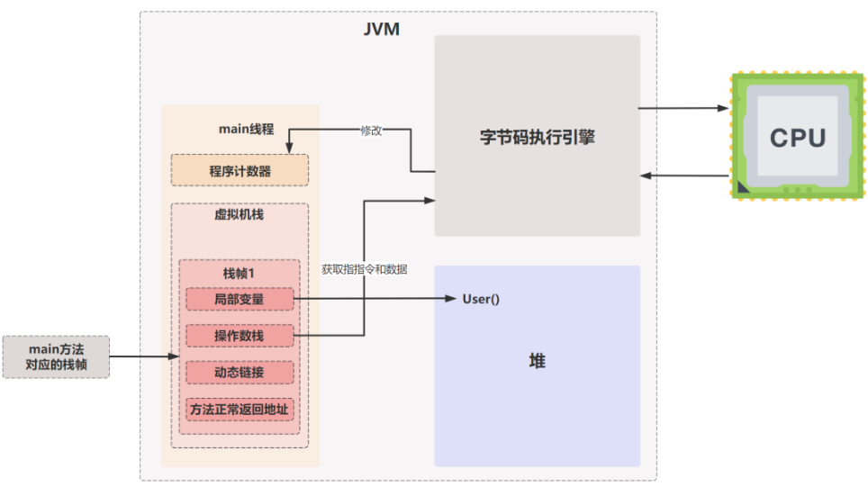

3. 以下面这段代码为例，分析字节码看一下它的指令执行流程

```java
public class Main {
    public static void main(String[] args) {
        int a = 2, b = 3;
        int c = a + b;
        System.out.println(c);
    }
}
```

在执行完一条指令之后，下一条指令的地址就会存入程序计数器中，字节码执行引擎从程序计数器中取出指令并完成操作。

```bytecode
 0 iconst_2 ── 向操作数栈压入常量2，对应int a = 2;
 1 istore_1 ── 将操作数栈顶的值2存储到局部变量表索引为1的位置，也就是存储变量a的值
 2 iconst_3 ── 向操作数栈压入常量3，对应int b = 3;
 3 istore_2 ── 将操作数栈顶的值3存储到局部变量表索引为2的位置，也就是把变量b存起来
 4 iload_1 ── 从局部变量表中加载索引为1的变量（也就是a=2），并压入操作栈
 5 iload_2 ── 从局部变量表中加载索引为2的变量（也就是b=3），并压入操作栈
 6 iadd ── 从操作数栈顶取出两个值（2和3），进行加法运算，并将运算结果5压入栈顶，对应int c=a+b;
 7 istore_3 ── 将操作数栈顶的值5存储到局部变量表索引为3的位置
 8 getstatic #2 <java/lang/System.out : Ljava/io/PrintStream;> ── 获取java/lang/System.out对象的引用，并压入操作数栈顶
11 iload_3 ── 从局部变量表中加载索引为3的变量（也就是c=5），并压入操作数栈顶
12 invokevirtual #3 <java/io/PrintStream.println : (I)V> ── 调用println(int)方法，将操作数栈顶的值5和System.out对象作为参数传递，进行打印
15 return ── 方法返回，结束main方法
```

# 5. Java对象

## 5.0 前置知识

### 5.0.1 JOL查看对象内存

JOL（Java Object Layout）是OpenJDK官网提供的查看对象内存布局的工具

使用步骤：

1. 导入依赖

   ```xml
   <dependency>
   	<groupId>org.codehaus.plexus</groupId>
   	<artifactId>plexus-utils</artifactId>
   	<version>4.0.0</version>
   </dependency>
   ```

2. 使用JOL提供的方法打印查看各种信息

   - ClassLayout.parseInstance().toPrintable() 查看对象内部信息
   
   ```java
   class User {
       public int age;
       public String name;
   }
   
   public static void main(String[] args) {
       User user = new User();
       user.age = 5;
       user.name = "abc";
       System.out.println(ClassLayout.parseInstance(user).toPrintable());
   }
   ```

   打印出来的信息为
   
   ```shell
   com.sazer.pojo.User object internals:
   OFF  SZ               TYPE DESCRIPTION               VALUE
     0   8                    (object header: mark)     0x0000000000000005 (biasable; age: 0)
     8   4                    (object header: class)    0x00067248
    12   4                int User.age                  5
    16   4   java.lang.String User.name                 (object)
    20   4                    (object alignment gap)    
   Instance size: 24 bytes
   Space losses: 0 bytes internal + 4 bytes external = 4 bytes total
   ```
   
   - VM.current().details() 查看当前虚拟机信息
   
   打印出来的信息为
   
   ```shell
   # WARNING: Unable to get Instrumentation. Dynamic Attach failed. You may add this JAR as -javaagent manually, or supply -Djdk.attach.allowAttachSelf
   # Running 64-bit HotSpot VM.
   # Using compressed oop with 3-bit shift.
   # Using compressed klass with 0x0000000800000000 base address and 0-bit shift.
   # Objects are 8 bytes aligned.
   # Field sizes by type: 4, 1, 1, 2, 2, 4, 4, 8, 8 [bytes]
   # Array element sizes: 4, 1, 1, 2, 2, 4, 4, 8, 8 [bytes]
   ```
   
   可以看到，第三行表明使用了压缩的普通对象指针，第四行表明使用压缩的Klass指针（用于指向类的元数据）
   
   - GraphLayout.parseInstance().toPrintable 查看对象的外部信息（比如外部引用地址）
   
   ```shell
   com.sazer.pojo.User@35f983a6d object externals:
             ADDRESS       SIZE TYPE                PATH                           VALUE
           62228fb88         24 com.sazer.pojo.User                                (object)
           62228fba0         24 java.lang.String    .name                          (object)
           62228fbb8         24 [B                  .name.value                    [97, 98, 99]
   
   Addresses are stable after 1 tries.
   ```
   
   - GraphLayout.parseInstance().totalSize()
   
   totalSize输出的是deep size。上面查看对象信息时输出的都是浅层大小，也就是只计算对象内引用的大小。而deep size会嵌套计算所有引用对象本身的大小
   
   比如上面的user对象的totalSize打印出来是72，它相当于下面这三个对象大小相加
   
   ```java
   System.out.println(ClassLayout.parseInstance(user).toPrintable()); // 24Byte
   System.out.println(ClassLayout.parseInstance(user.name).toPrintable()); // 24Byte
   System.out.println(ClassLayout.parseInstance(user.name.toCharArray()).toPrintable()); // 24Byte
   ```

### 5.0.2 指针压缩

**64位地址的问题**

在64位操作系统中，寻址地址是64bit，存储的是真实的内存地址，也就是说一个地址代表1Byte，所以能够表示的最大内存就是2^64Byte，大约2^34GB

但是采用64bit（=8Byte）存储真实的内存地址会存在一下问题：

1. 每个地址都要用8Byte表示，也就是每个对象类型的引用都要用8Byte来存储，占用堆空间就变多了

   这样就会加快GC的发生，使得GC更频繁

2. 保存每个地址占用的空间变大了，CPU能缓存的地址数量就少了，降低了CPU缓存的命中率

那么能不能还采用4Byte保存地址呢，如果用4Byte保存地址，最大的问题就是能表示的内存空间只有2^32Byte，也就是4GB。能表示的内存太少了，所以核心问题就是怎么用32bit表示尽可能多的内存。

**指针压缩**

为了用32位表示更多的内存，Java采用对齐填充机制，它不以1Byte为内存单位，而是以8Byte为最小内存单位。也就是说一个地址能表示8Byte，这样的话32位地址就能表示32GB内存空间

Java的对齐填充会保证每个起始地址都是8字节的整数倍。所以实际内存地址的最后三位都是0，在存储地址时就可以把低三位丢弃掉，只存高32位，在实际寻址时再把低三位补成0，就能找到真实内存地址了。

开启指针压缩之后，JVM内存设置不能高于32GB，否则压缩之后的指针没法表示那么多内存。

## 5.1 对象内存布局

在Hotspot虚拟机中，对象在内存中的布局分为三块区域：对象头（Header）、实例数据（Instance Data）和对齐填充（Padding）

其中对齐填充就是为了保证对象的大小必须是8字节的整数倍，可能有也可能没有。保证对象起始地址必须是8字节的整数倍，是因为CPU读取内存时，是按照字长为单位进行数据访问，64位系统字长为8字节，因此这样做填充可以减少CPU访问内存数据的访问次数。

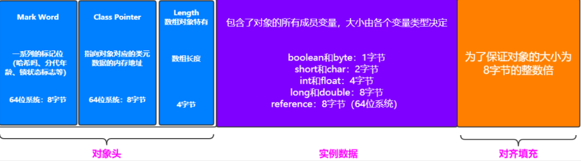

对于一个空Object，只有对象头，没有实例数据，大小全部来自于对象头和对齐填充字段。因此普通对象会占用16字节，数组对象会占用24字节。

### 5.1.1 对象头

对象头分为三个部分：标记字段Mark Word、类型指针 Klass Pointer、长度length

**标记字段 Mark Word**

用于存储对象自己运行时的数据，如对象的哈希码、GC分代年龄、锁状态标志、线程持有的锁等等

标记字段的长度在32位和64位的JVM（未开启压缩指针）中分别为4个字节和8个字节

由于对象头中存储的信息是与对象自身定义的数据无关，属于额外存储成本，因此Mark Word字段被设计成一个有着动态定义的数据结构。具体来说，根据对象上的锁状态不同，Mark Word中存储的数据不同

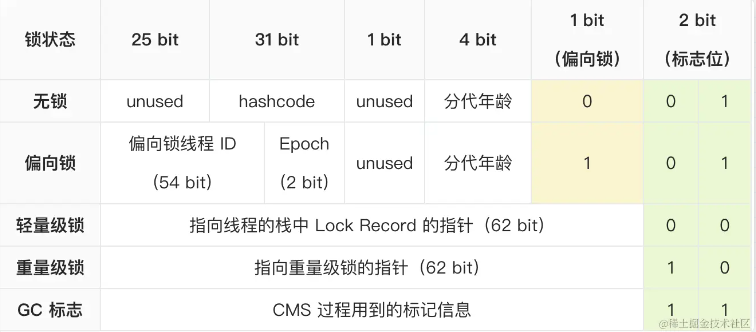

最后2bit永远用来标志对象的当前状态，根据对象的状态选用相应的格式读取Mark Word字段

- 对象处于无锁状态时

  Mark Word中会用31bit存储对象的hashcode，4bit存储分代年龄

- 处于偏向锁状态时

  此时需要54bit来存储偏向锁线程ID，就没有地方存储hashcode了。但是如果对象计算了哈希码，就必须将哈希码保存起来以保证后面获取哈希码不会出错

  因此当对象计算过一致哈希之后，就再也无法进入偏向锁状态了（其他锁状态有办法保存哈希码）；而如果一个对象正处于偏向锁状态时需要计算哈希码请求时，它的偏向状态会被撤销，并膨胀为重量级锁。[参考博客](https://www.cnblogs.com/xiaomaomao/p/17411280.html)

- 处于其他锁状态时，整个Mark Word都会用于指向对应锁的指针。而在代表锁的ObjectMonitor类中有字段可以用于记录非加锁状态下的Mark Word，其中就包括哈希码等信息。

- 当对象被垃圾回收时，Mark Word会用来保存垃圾回收过程的标记信息

**类型指针 Klass Pointer**

这个指针指向该对象对应的类的元数据（在方法区中），JVM通过这个指针确定该对象是哪个类的实例

未开启指针压缩时，占8字节，开启指针压缩占4字节

**长度 length**

这个是数组对象专有字段，用于表示数组的长度，占4个字节

因为普通对象的大小是确定的，根据对象内的字段数量是确定的，每个字段的大小也是确定的。但是数组的长度如果不记录是无法确定的。

### 5.1.2 实例数据

存储对象中所定义的各种成员变量的真实数据。包括从父类继承下来的字段和子类中自己定义的字段

字段类型包括基本数据类型和引用数据类型，其中引用数据类型保存的就是指向引用对象的指针，不开启指针压缩占8字节，开启指针压缩占4字节，基本数据类型的大小也是确定的，因此每个对象的大小在编译阶段就能确定。

## 5.2 对象访问方式

Java访问对象主要是通过栈帧中的reference数据来指向堆上的具体对象

对象访问方式由JVM实现而定，主流方式有使用句柄和直接指针

### 5.2.1 使用句柄

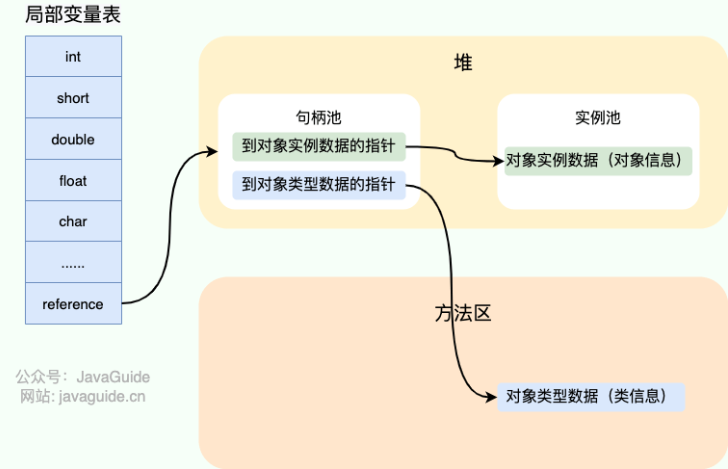

如果采用句柄方式，则Java堆中会划分出一块内存作为句柄池，reference中存储的就是对象的句柄地址，而句柄中又包含了对象实例数据和对象类型数据的地址

如果使用句柄方式，由于句柄池中保存了对象对应的类的元数据的地址，因此在对象头中就无需保存类型指针信息。但是这样的话需要多寻址一次。

句柄方式最大的好处是reference中存储的是句柄地址，因此在对象被移动时只会改变句柄中的实例数据指针，而reference本身不需要修改。

### 5.2.2 通过直接指针

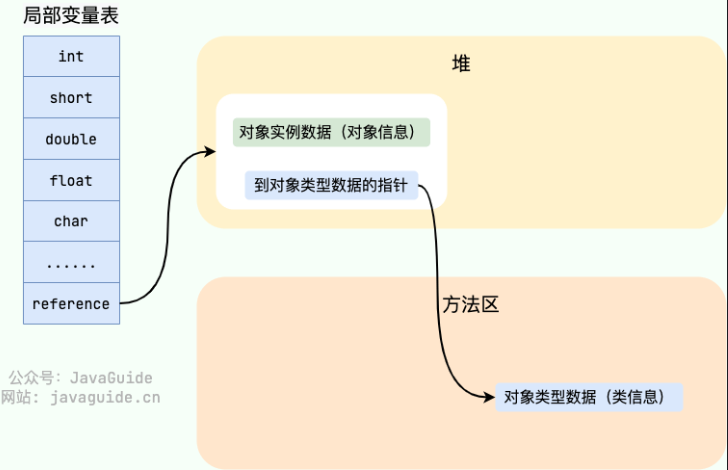

此时栈中的reference指向的直接就是对象的地址，而对象中又保存了自己对应的类信息的地址。HotSpot采用的就是这种方式。

使用直接指针访问最大的好处就是速度快，节省了一次指针定位的时间开销。

## 5.3 Java对象创建过程

- **step1:类加载检查**

执行引擎遇到一条new指令时，先在指令中获取类的符号引用，然后去检查能否在常量池中定位到这个类的符号引用，并检查符号引用代表的类是否已经被加载、解析、初始化过，如果没有则需要先执行类加载过程。

- **step2:分配内存**

类加载检查通过之后，虚拟机将为新生对象分配内存。对象所需内存大小在类加载完成之后便可以确定，所以分配内存就是把一块确定大小的内存从Java堆中划分出来。

内存分配有两种方式：

选择哪种分配方式由Java堆内存是否规整，即是否有内存碎片决定，而Java堆内存规整又由JVM所采用的垃圾收集器是否带有压缩整理功能决定

- 指针碰撞

  适用于堆内存规整，没有内存碎片的情况下

  在规整的情况下，所有用过的内存会被整合到一遍，没有用过的内存放在另一边，中间有一个分界指针，所以分配内存只需要向着没用过的内存方向移动指针即可

- 空闲列表

  适用于堆内存不规整的情况下

  此时虚拟机会维护一个列表，该列表中会记录哪些内存块是可用的。在分配时会在列表中找一块足够大的内存块划分给对象实例，然后更新列表记录

内存分配并发问题：

由于对象创建是非常频繁的行为，因此在JVM中创建对象要保证线程安全，保证内存空间的安全。通常有两种方式保证

- CAS

  在更新内存时先直接更新，如果遇到冲突就重试

- TLAB

  为每一个线程都预先在Eden区分配一块内存，JVM分配对象时，首先在线程所属的TLAB分配。当对象大于TLAB中剩余内存时，再采用上面的CAS法分配。

- **step3:初始化零值**

为对象分配好内存空间之后，将对象的成员变量都初始化为0，保证对象的实例字段不赋初值也能直接使用

- **step4:设置对象头**

初始化零值完成之后，根据对象的状态填充对象头。

比如设置对象的类型指针（指向对象实例所属类的元数据），设置Mark Word字段中的对象哈希码、对象GC分代年龄等信息

- **step5:执行init方法**

执行对象的`<init>`方法，把对象按照代码要求进行初始化

init方法是对象被编译成字节码文件之后自动生成的，会将变量初始值、代码块、构造函数等操作放在这个方法中

# 4. GC

垃圾回收只作用在堆区

## 4.1 垃圾判断算法

判断对象是否存活，是否应该被当成垃圾回收掉

### 4.1.1 对象引用类型

不管用哪种算法判断对象是否存活，都与对象是否还存在引用有关

JDK1.2之后Java对引用的概念进行扩充，分为强引用、软引用、弱引用、虚引用四种

- 强引用（Strong Reference）

  我们使用的大部分引用都是强引用，比如让一个局部变量指向一个对象，这也是最普遍的引用

  如果一个对象具有强引用，那么垃圾回收器绝对不会回收它。当内存空间不足时，即使抛出OutOfMemoryError错误使程序异常终止，也不会回收具有强引用的对象。

- 软引用（SoftReference）

  如果一个对象只具有软引用，那么当内存不足时，垃圾回收器就会回收它，但是如果内存空间足够，就不会回收它，只要它没有被回收，这个对象就可以被程序使用

  软引用可以和一个引用队列（ReferenceQueue）联合使用，如果软引用所引用的对象被垃圾回收，那么JVM就会把这个软引用加入到与之关联的引用队列中

- 弱引用（WeakReference）

  如果一个对象只具有弱引用时，垃圾回收器不管内存空间是否足够都会回收它的内存。但是垃圾回收器是一个优先级很低的线程，因此不一定会很快发现弱引用对象

  弱引用和软引用类似，也可以和一个引用队列联合使用，在被回收之后加入到引用队列中

- 虚引用（PhantomReference）

  虚引用顾名思义，就是形同虚设的引用，虚引用就和没有引用一样，随时可能被垃圾回收

  虚引用主要用来跟踪对象被垃圾回收的活动

  虚引用必须和引用队列联合使用，当垃圾回收器准备回收一个对象时，如果发现它还有虚引用，就会在回收对象的内存之前把这个虚引用加入到与之关联的引用队列中。此时程序可以通过检查虚引用的引用队列来查看要被回收的对象，并采取一些必要的行动。

在程序设计中一般只会用到强引用和软引用，其中软引用可以加速JVM对垃圾内存的回收速度。

### 4.1.2 引用计数法

引用计数法就是在对象中保存一个引用计数器，每当有一个地方引用它，计数器就+1，引用失效时，计数器就-1。任何时候，如果一个对象中的引用计数器值为0，那么这个对象就不可能再被使用（想使用也找不到这个对象了）

这个方法实现简单，效率高，但是没有虚拟机用，因为它解决不了对象之间的循环引用问题。

**循环引用问题**

循环引用就是两个对象互相引用，比如下面这个例子

```java
public class ReferenceCountingGc {
    Object instance = null;
    public static void main(String[] args) {
        ReferenceCountingGc objA = new ReferenceCountingGc(); // objA:1
        ReferenceCountingGc objB = new ReferenceCountingGc(); // objB:1
        objA.instance = objB; // objB:2
        objB.instance = objA; // objA:2
        objA = null; // objA:1
        objB = null; // objB:1
    }
}
```

可以看到程序执行完之后实际上已经没有对objA和objB的引用了，但是这两个对象的引用计数器还都是1，也就是说这两个对象在整个程序执行时都永远不可能被回收了

### 4.1.3 可达性分析算法

这个算法的思想就是通过一系列"GC Roots"对象作为起点，从这些节点开始向下搜索，节点所走过的路径称为引用链。只要一个对象到达不了GC Roots，就视为这个对象是不可用的，需要被回收

**可以被视为GC Roots的对象**

- 栈（虚拟机栈的局部变量表）中直接引用的对象

  ```java
  public class Reference {
      public void test() {
          Object localVar = new Object();
      }
  }
  ```

  当test方法运行期间，localVar指向的对象可以认为是GC Roots；当test方法执行完毕之后，localVar作用域结束，此时这个Object对象不再由任何GC Roots引用，可以被回收。

- 方法区中类静态属性（static修饰）引用的对象

  ```java
  public static Object staticVar = new Object();
  ```

  staticVar指向的这个new Object（存储在元空间中）可以被认为是GC Roots

- 方法区中常量（final修饰）引用的对象

  ```java
  public static final String CONSTANT_STRING = "Hello, World"; // 常量，存在于运行时常量池中
  public static final Class<?> CONSTANT_CLASS = Object.class; // 类类型常量
  ```

- 所有被同步锁持有的对象（在synchronized关键字的括号中出现）

- 本地方法栈中 JNI（Java Native Interface）引用的对象

  JNI是Java提供的一种允许Java代码调用本地代码（C/C++编写的代码）的机制。在这些本地代码中也可以创建引用，这些引用可以指向Java堆中的对象

  当Java方法中调用本地方法时，JVM会通过Java方法的栈帧中的动态链接直接调用指定的本地方法

  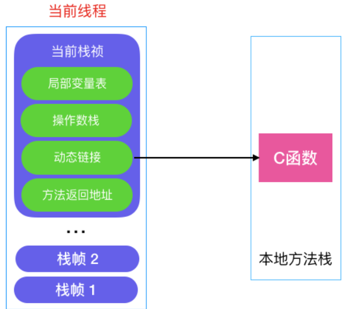


## 4.2 垃圾回收算法

### 4.2.1 标记-清除算法

标记清除（Mark-Sweep）算法是最基础的垃圾回收算法，分为两部分

1. 标记内存区域中可以被清理的对象
2. 把这些对象清理掉


这种算法的问题在于：会产生大量内存碎片，并且标记和清除过程效率都不高。

### 4.2.2 复制算法

复制（Copying）算法主要用于解决标记-清除算法中的内存碎片问题。

它将可用内存分为大小相等的两块，每次只使用其中的一块，当这一块内存用完了，就将还存活着的对象复制到另一块上面，开始用另一块内存，然后再把原本那块的内存空间一次性全清理掉。这样就保证了内存的连续性。

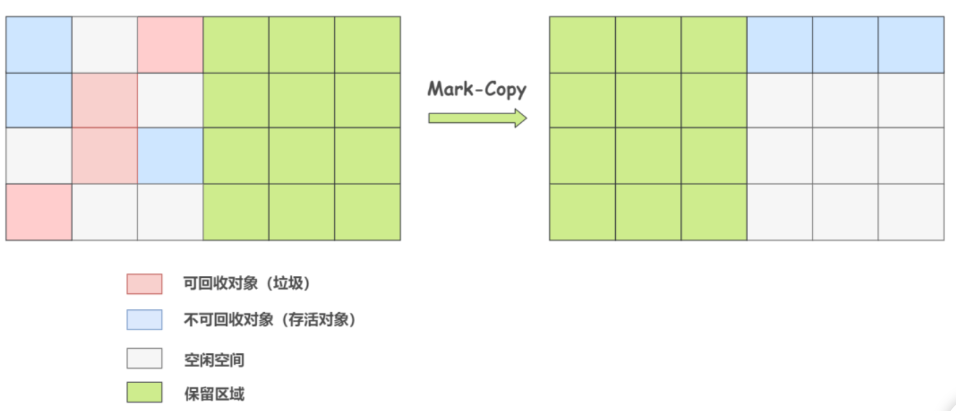

这个算法问题很明显，浪费了一半的内存空间，代价太高

### 4.2.3 标记-整理算法

标记整理算法（Mark-Compact），与标记清除算法一样，首先标记内存区域中可以清理的对象，但是为了避免产生内存碎片不会直接清理，而是会让所有存活的对象都向一端移动，再清理掉端边界以外的内存区域，保证可用内存的连续


这个算法最大的问题是，内存变动频繁，在垃圾回收时需要整理所有存活对象的引用地址，并需要做大量地址的改变工作，在效率上比复制算法差很多

### 4.2.4 分代收集算法

分代收集算法（Generational Collection）严格来说并不是一种算法，而是针对不同情况采用不同算法的一套组合拳

在Hotspot中，会将堆分为新生代和老年代，在新生代中的对象存活率很低，就选用复制算法；老年代中的对象存活率高，就选用标记清理或标记整理算法。

在新生代中进行的垃圾回收称为Minor GC，用的是复制算法；对整个堆（包括新生代和老年代）进行回收称为Full GC，也叫Major GC，用的是标记算法

**新生代**

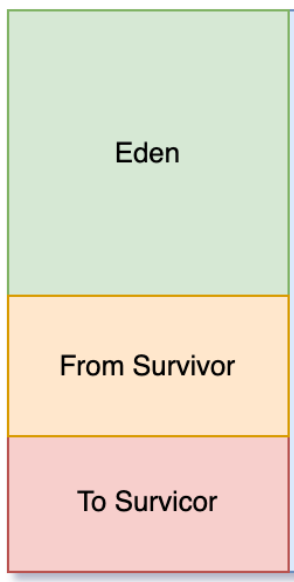

新生代又分为Eden区和Survivor区，Survivor又分为From和To两个区

- Eden区

  对象会在Eden区中进行分配，当Eden区中没有足够的空间进行分配时，JVM会发起一次Minor GC，这个GC更频繁，回收速度也更快

  通过Minor GC之后，Eden区中大部分对象会被回收，而存活下来的对象将会复制到Survivor的From区

- Survivor区

  事实上在Minor GC中，Eden区和From区都会被GC，并将存活对象复制到To区，并清空from区和eden区。GC完之后，被清空的区作为to区，而原来的to作为from

**老年代**

老年代占据着2/3的堆空间，只有在Major GC时才会清理，Major GC会出发Stop-The-World，就是说在垃圾收集过程中JVM会暂停所有用户线程，主要是防止在垃圾收集过程中，用户线程修改堆中的对象，导致垃圾收集器无法准确收集垃圾。

以下几种情况会导致对象进入老年代

- 大对象

  即需要大量连续内存空间的对象，这部分对象会直接进入老年代。

  主要是为了避免在Eden区及Survivor区之间发生大量内存复制

- 长期存活对象

  在对象头中会记录对象的年龄，正常情况下对象会不断经历Minor GC，在Survivor的From和To区之间移动，每经历一次Minor GC，年龄就增加1岁。当年龄到15岁（因为记录年龄用4bit）时，就会被转移到老年代

- 动态对象年龄

  JVM不强制要求对象年龄必须达到15岁才会放入老年代

  如果Survivor空间中的某个年龄段的对象总大小超过Survivor空间的一半，那么该年龄段及以上年龄段的所有对象都会在下一次垃圾回收时被晋升到老年代

## 4.3 垃圾收集器

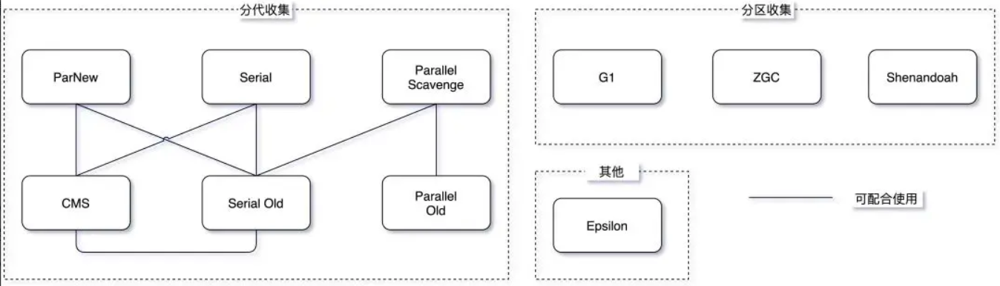

可以使用`java -XX:+PrintCommandLineFlags -version` 命令打印当前JDK使用的垃圾收集器

### 4.3.1 早期垃圾收集器

**Serial/Serial Old收集器**

顾名思义，这是一个串行收集器，即单线程收集器。单线程意味着它只会使用一条垃圾收集线程去完成垃圾收集工作，并且在垃圾收集时必须暂停其他所有的工作线程

这是最基本，历史最悠久的垃圾收集器

新生代采用复制算法，老年代采用标记-整理算法

**ParNew收集器**

ParNew其实就是Serial收集器的多线程版本，多线程是指它会用多条垃圾收集线程同时去完成垃圾收集工作，但是垃圾收集时依然需要暂停其他所有工作线程

除此之外，它的行为和Serial收集器完全一样

**Parallel 收集器**

JDK1.8的默认收集器

这个收集器和ParNew类似，也是多线程收集器，采用复制算法和标记整理算法

不同的是这个收集器关注吞吐量，即CPU中用于运行用户代码的时间与CPU总消耗时间的比值。Parallel收集器提供了很多参数供用户找到最合适的停顿时间或最大吞吐量。

### 4.3.2 CMS

CMS，Concurrent Mark Sweep，是HotSpot虚拟机第一款真正意义上的并发收集器，并发指实现了垃圾收集线程与用户线程同时工作。它以实现最短回收停顿时间（即最短Stop The World时间）为目标，非常注重用户体验。

看名字可以得知，它采用的是标记清除算法。不过它提出了三色标记算法，通过对可达性分析算法的改进，实现了GC停顿时间的减少。

它的运行过程分为4个步骤

1. 初始标记，该阶段需要Stop the World

   这一步会标记GC Roots能直接关联到的对象，并不需要做整个引用的扫描，因此速度很快

2. 并发标记

   对初始标记阶段标记的对象进行整个引用链的扫描，这个阶段垃圾回收线程会与用户线程并发执行，这个阶段的扫描需要花费大量时间，因此这也是CMS极大降低GC停顿时间的核心原因

   但是并发标记的时候，引用可能发生变化，因为用户也在不断修改引用。因此可能发生漏标和多标的问题

3. 重新标记，该阶段需要Stop the World

   对并发标记阶段出现的问题进行校正，垃圾回收线程和用户线程并发执行时会发生标记错误的问题。因此需要停止用户线程进行一些校验，解决并发标记阶段发生的问题

4. 并发清除

   将标记为垃圾的对象进行清除。这个阶段可以与用户线程并发执行

**优缺点**

CMS的优点就是实现了并发收集，带来很低的停顿时间

缺点也很明显：

1. 对CPU资源非常敏感，因为需要并发执行垃圾回收

   默认情况下，CMS启动的垃圾回收线程数是（CPU数量+3）/4，如果CPU数量很小，垃圾回收线程数占比就会很大

2. 产生内存碎片

   这是标记-清除算法的问题

3. 无法处理浮动垃圾

   即C M S进行垃圾回收时应用程序产生的垃圾。这种垃圾只能在下一次GC时清理掉

CMS垃圾回收器在Java9中被标记为过时，并在Java14中移除

### 4.3.3 G1

G1（Garbage-First Garbage Collector），在JDK1.7引入，在JDK9取到CMS称为默认垃圾收集器至今

