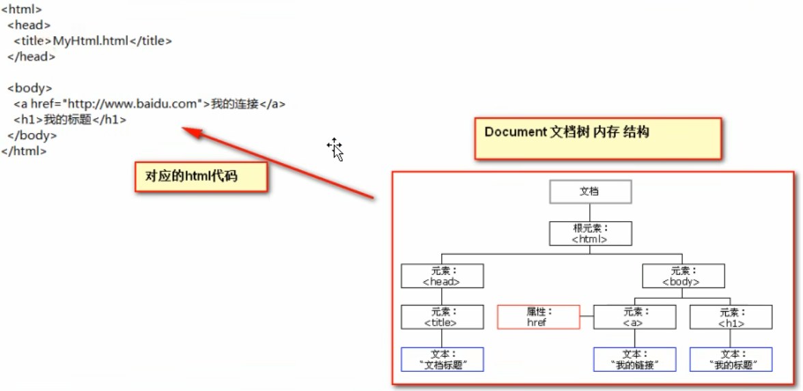

# 1. HTML

# 2. CSS

# 3. JavaScript

## 3.1 用法

注意以下两种用法不能一起使用，也就是在script标签中指定src文件之后，script标签内部的代码就失效了

- 直接在\<head>标签或者\<body>标签中使用

```html
<!DOCTYPE html>
<html lang="en">
<head>
    <meta charset="UTF-8">
    <title>FirstProj</title>    
    <script type="text/javascript">
        alert("Hello");
    </script>
</head>
<body>

</body>
</html>
```

- 引用外部.js文件

```java
<script type="text/javascript" src="1.js"></script>
    
// 1.js
alert("Hello");
```

## 3.2 变量 运算符

javascript中变量是弱类型，即可以在运行时更改变量的类型

使用 `var i;` 来定义变量

使用 `typeof(i)`来获取变量类型

### 3.2.1 变量类型

- 数值类型 number

- 字符串类型 string

- 对象类型 object

- 布尔类型 boolean

  JavaScript中所有的变量都可以作为boolean变量使用，其中`0, null, undefined, ""`被认为是false

- 函数类型 function

特殊类型：

- undefined

  未定义，所以js变量在未赋初始值的时候，默认值为undefined

  这既是一个变量类型也是一个值

  ```javascript
  var i;
  alert(i);
  alert(typeof(i));
  // 两次都会显示undefined
  ```

- null

  空值

- NaN

  not a number，非数字非数值类型

  NaN不是一个类型，而是一个数值类型的值

  ```javascript
  var i = 123;
  var j = "abc";
  var k = i * j;
  alert(k); // 打印NaN
  alert(typeof(k)); // 打印number
  ```

### 3.2.2 运算符

**等于和全等于**

== 表示等于，只比较值

=== 表示全等于，比较值和变量类型

```javascript
var i = 12;
var j = "12";
alert(i == j); // true
alert(i === j); // false
```

**逻辑运算**

- && 与运算

  当表达式全为真时，返回最后一个表达式的值

  当表达式中有一个为假时，返回第一个为假的表达式的值

- || 或运算

  当表达式全为假时，返回最后一个表达式的值

  如果有表达式为真，返回第一个为真的表达式的值

### 3.2.3 数组

- 定义数组

  `var arr = [];`

  `var arr = [1, "abc", true];`

- 获取数组长度

  `arr.length;`

- 数组是动态的

  只要通过数组下标赋值，就会用这个下标值给数组扩容

  ```javascript
  var arr = [];
  arr[3] = "abc";
  // 此时arr中的元素为：[undefined, undefined, "abc"]
  ```

- 通过下标读取时不会给数组扩容

  ```javascript
  alert(arr[10]); // 打印undefined，但是arr数组的长度不会变成11
  ```

  

- 遍历数组

  ```javascript
  for (var i = 0; i < arr.length; i++) {
      alert(arr[i]);
  }
  ```

## 3.3 函数

### 3.3.1 函数定义

**第一种方式**

- 无参

```javascript
function func(){
    return 1;
}

func();
```

- 有参

  只用声明参数个数不用声明类型

```javascript
function func1(a, b) {
    alert("a=>" + a + ",b=>" + b);
    return a + b;
}

func1(12, "abc");
```

**第二种方式**

```javascript
var func = function (a, b) {
    alert(a + b);
    return a;
}
```

### 3.3.2 函数重载

不允许函数重载，同名函数下面的会覆盖掉上面的定义

### 3.3.3 arguments隐形参数

在js中即使函数声明中未定义参数，也可以传入参数，这些参数会被一个数组arguments捕获

声明的参数同样会被该数组捕获

```javascript
// 返回传入所有参数的和
function sum (num1, num2) {
    var result = 0;
    for (var i = 0; i < arguments.length; i++) {
        result += arguments[i];
    }
    return result;
}

alert(sum(1, 2, 3, 4, 5, 6, 7, 8, 9)); // 返回45
```

## 3.4 自定义对象及常用方法

### 3.4.1 Object形式

**定义对象**

```javascript
var obj = new Object();
obj.name = "Tom";
obj.age = 18;
obj.printInfo = function () {
    alert("姓名：" + this.name + "年龄：" + this.age);
}
```

**使用对象**

```java
alert(obj.printInfo());
```

### 3.4.2 花括号形式

**定义对象**

`属性名:属性值`，属性之间用`,`分割

```javascript
var obj = {
    name:"Tom",
    age:18,
    func : function() {
        alert("姓名：" + this.name + "年龄：" + this.age);
    }
}
```

**使用对象**

```java
alert(obj.func());
```

### 3.4.3 正则表达式

1. 创建正则表达式对象

   ```javascript
   var patt = /^\w{5,12}$/;
   ```

2. 检查给定字符串是否符合正则表达式

   符合返回true，不符合返回false

   ```javascript
   patt.test("abc123"); 
   ```

## 3.5 事件

电脑输入设备与页面进行交互 称之为事件

### 3.5.1 静态注册

直接在html标签属性中指定发生事件时执行的操作

比如 绑定onload事件

```html
<!DOCTYPE html>
<html lang="en">
<head>
    <meta charset="UTF-8">
    <title>FirstProj</title>

    <script type="text/javascript">
        var onloadFunc = function () {
            console.log("加载完毕");
        }
    </script>
</head>
<body onload="onloadFunc()">

</body>
</html>
```

### 3.5.2 动态注册

先在javascript中获取相应标签的dom对象，然后再通过dom对象.事件名 = function(){} 来赋予事件响应代码。

window.onload会在页面加载完成后自动执行

```html
<!DOCTYPE html>
<html lang="en">
<head>
    <meta charset="UTF-8">
    <title>FirstProj</title>

    <script type="text/javascript">
		window.onload = function () {
            var btnObj = document.getElementById("btn1");
            alert(btnObj);
            btnObj.onclick = function () {
                alert("你点击了按钮");
            }
        }
    </script>
</head>
<body> 这里要注意不能再写onload=
	<button id="btn1">按钮1</button>
</body>
</html>
```

### 3.5.3 事件种类

- onload：页面加载完成

- onclick：点击

  一般用于按钮

- onblur：失去焦点时

  一般用于输入框

- onchange：内容发生改变时

- onsubmit：表单提交之前

  一般用于表单提交之前检查表单内容是否符合要求

  事件函数中返回false可以阻止表单提交

### 3.5.4 事件对象

当事件被触发时，会产生一个事件对象，里面记录了该事件的所有详细信息

在绑定的function函数列表中写一个参数即可获取该事件对象，一般参数名为event

```javascript
document.getElementById("#btn01").onclick = function(event) {
    console.log(event);
}
```

## 3.6 DOM对象

Document Object Model文档对象模型

就是将整个HTML文档中的标签、属性、文本都转化为对象（称为dom对象）来管理，转换完之后是树的结构，也就是说标签对象之间有层级关系

不止标签是节点，标签之间的换行（被当作空格）也被当作一个节点（dom对象）



这样就可以通过DOM模型来找到并访问所有的标签对象，再通过这个标签对象就可以拿到这个标签的所有属性

### 3.6.1 获取标签对象

在页面加载完成之后执行才能查询到，使用一个dom对象调用这些函数，表示寻找该dom对象的满足要求的子对象

其中整个HTML页面对应的dom对象为document

- 通过Id获取

  `var btnObj = document.getElementById("btn01");`

  返回指定id的第一个对象

- 通过Name获取

  `document.getElementsByName()` 

  返回带有指定name属性的标签对象的集合

- 通过标签名获取

  `document.getElementsByTagName()`

  返回指定标签的对象的集合，比如获取button标签，input标签对象

### 3.6.1 标签对象属性方法  

**方法**

- 创建一个标签对象

  `var newDiv = document.createElementj("div");`

  创建完之后只是在内存中，还没有添加到页面上

- appendChild

  添加一个子节点

  ```javascript
  // 要在页面加载完成之后再执行，否则获取不到body对象
  document.body.appendChild(divObj);
  ```

**属性**

获取相邻节点

- childNodes

  获取当前dom对象的所有子节点对象

- firstChild

  获取当前dom对象的第一个子节点对象

- lastChild

  获取当前dom对象的最后一个子节点对象

- nextSibling

  获取当前dom对象的下一个兄弟节点

- previousSibling

  获取当前dom对象的上一个兄弟节点

- parentNode

  获取当前dom对象的父节点

获取节点中的属性

- innerHTML

  获取节点包裹的所有内容

- innerText

  获取节点包裹的文本内容

  ```html
  <javascript>
      window.onload = function(){
      	var ulObj = document.getElementById("city");
      	alert(ulObj.innerHTML); // 打印包括<li>标签在内的所有内容
      	alert(ulObj.innerText); // 只打印北京上海南京杭州
      }
  </javascript>
  
  <ul id="city">
      <li>北京</li>
      <li>上海</li>
      <li>南京</li>
      <li>杭州</li>
  </ul>
  ```

  

- 还可以获取标签中的所有属性值，也可以直接赋值

  比如id、value、type等

## 3.7 jQuery

是一个辅助JavaScript开发的js类库

### 3.7.1 QuickStart

1. [官网下载](https://jquery.com/download/) jQuery_version.js文件

2. 先使用一个script标签引入这个文件

   ```html
   <script type="text/javascript" src="jquery-3.7.1.js"></script>
   ```

   之后在新建一个script标签写js代码（因为一个script标签只能引用文件或者在里面写代码，不能同时做这两件事）

3. 一个绑定按钮事件的例子

   按钮id为btn01

   ```javascript
   $(function () {
       var $btnObj = $("#btn1"); // #表示用id查询元素
       $btnObj.click(function () {
           alert("Jquery单击事件");
       })
   })
   ```

   一般jQuery对象命名用$开头

### 3.7.2 $ 核心函数

jQuery中的`$`是一个函数

```javascript
jQuery = function( selector, context ) {

    // The jQuery object is actually just the init constructor 'enhanced'
    // Need init if jQuery is called (just allow error to be thrown if not included)
    return new jQuery.fn.init( selector, context );
};

window.jQuery = window.$ = jQuery;
```

**$的用法**

- 传入参数为一个 **函数** 时

  表示页面加载完成之后调用这个函数，相当于`window.onload = function(){}`

  ```javascript
  $(function () {
      alert("页面加载完成");
  })
  
  //实际上是下面的一简写形式
  $(document).ready(function(){
      
  });
  ```

- 传入参数为 **html字符串**时

  会创建这些文本内容创建对应的标签对象（jQuery对象）

  ```javascript
  $("<div>" + 
   "<span>div-span1</span>" + 
   "<span>div-span2</span>" + 
   "</div>").appendTo("body");
  ```

- 传入参数为 **选择器字符串** 时

  这里的选择器是指css选择器，会查询相应的标签对象，返回对应标签的jQuery对象

  ```javascript
  $("#id属性值"); 根据id查询标签
  $("标签名"); 根据标签名查询标签
  $(".class属性值"); 类型选择器，根据class属性查询标签对象
  ```

- 传入参数为**DOM对象**时

  将DOM对象转化为jQuery对象

### 3.7.3 jQuery对象

通过$得到的对象都是jQuery对象

jQuery对象实际上是一个DOM对象数组 + jQuery提供的一系列方法

jQuery对象和DOM对象之间的函数和属性不能互用

**DOM对象和jQuery对象互转**

- DOM对象转jQuery对象

  `$(DOM对象)`

- jQuery对象取DOM对象

  jQuery对象实际上是DOM对象数组，因此直接用下标取就可以了

  `jQuery对象[0]`

**获取标签对象**

jQuery对象使用css的选择器来获取页面中的对象

```javascript
var $btn01 = $("#btn01"); // id选择器
var div = $("div"); // 标签名选择器
```

更多选择器查看css或者jQuery手册

**遍历jQuery对象**

each方法

```javascript
$(":checkbox").each(function(){
    // 在function中有this对象，是当前正在遍历到的dom对象
    alert(this);
})
```

**绑定单击事件**

click方法

```javascript
$("#btn01").click(function(){
    // 在function函数中有一个this对象，是当前正在相应click事件的this对象
    // 即id为btn01的按钮
    alert(this.id); // 打印btn01
});
```

**其他常用方法**

有jQuery对象`$div01`

- html() —— 操作标签内的内容（所有内容包括里面的标签）

  不传参数是获取内容，传入参数是设置内容

  ```javascript
  var htmlCont = $div01.html();
  $div01.html("<h1>这是一个标题</h1>"); // 页面上会显示一个h1标题格式的内容：这是一个标题
  ```

- text() —— 获取标签内的文本内容

  不传参数是获取内容，传入参数是设置内容

  ```javascript
  var cont = $div01.text();
  $div01.text("<h1>这是一个标题</h1>"); // 页面上会显示文本内容：<h1>这是一个标题</h1>
  ```

- val() —— 设置和获取**表单项**的value值

  不传参数是获取，传入参数是设置

  只能操作表单项，即input标签、select标签

  ```javascript
  // 批量操作单选框：
  <input name="radio" type="radio" value="radio1" />radio1
  <input name="radio" type="radio" value="radio2" />radio2
  
  $(":radio").val(["radio1", "radio2"]); // 将value值为radio1和radio2的单选框选中
  ```

- attr()、prop() —— 操作指定属性值

  - 一个参数表示获取指定属性值，属性不存在返回undefined，prop返回false

  - 两个参数表示将指定属性值设置为指定内容，属性不存在会根据给定值创建属性

  当操作checked、readOnly、selected、disabled等值为true、false的属性时推荐使用prop，其他推荐使用attr

  ```javascript
  // 多选框
  <input name="checkbox" type="checkbox" checked="checked" value="radio1" />checkbox
  <input name="checkbox" type="checkbox" value="radio1" />checkbox
  
  $(":checkbos:first").attr("checked"); // 第一个多选框有checked属性，因此返回值为checked ； prop返回true
  $(":checkbos:last").attr("checked"); // 第一个多选框没有checked属性，因此返回值为undefined ； prop返回false
  ```

  attr还可以操作自定义属性

### 3.7.4 HTML标签增删改查

### 3.7.5 jQuery事件

**页面加载事件**

原生js页面加载完成时调用函数`window.onload = function(){}`

jQuery页面加载完成时调用函数`$(function(){})`

调用顺序为：

1. jQuery的先执行

   它在浏览器内核解析完页面的标签并创建好DOM对象之后就会调用jQuery的页面加载完成函数

2. 原生js后执行

   在页面加载完成创建DOM对象之后，还要等标签显示时需要的内容加载完成（比如去网络下载标签中要显示图片），才会调用原生js的加载完成函数

执行次数：

如果有多个页面加载完成时的调用函数

- 原生js只会执行一次，因为后面定义的函数把前面的函数给覆盖了

- jQuery会按顺序执行所有定义的函数

**其他事件**

jQuery中的事件函数都是，传入参数表示绑定事件，不传入参数表示触发事件

```javascript
$(function(){
    $("#btn01").click(function() { // 传入参数表示绑定事件
        alert("按钮被点击");
    });
    
    $("#btn01").click(); // 不传入参数表示触发按钮的点击事件
})
```

常用事件函数：

- click —— 单击事件

- mouseover —— 鼠标移入

- mouseout —— 鼠标移出

- bind —— 一次性给多个事件绑定同一个函数

  ```javascript
  $("#btn01").bind("click mouseover mouseout", function() {
      console.log("按钮被操作");
  });
  ```

- one —— 和bind用法相同，但是绑定的事件只能触发一次

  比如点击事件，点一次之后就失效了，是一次性的事件

- unbind —— 解绑函数

  `$("btn01").unbind("click");`

**事件冒泡**

子元素触发的事件也会传递给父元素，就相当于父元素也触发了这个事件

比如父子元素都绑定了click事件，那么点击子元素，父子元素的click事件都会被调用

在事件函数体内 return false ，可以阻止事件的冒泡排序

# 4. HTTP协议

HTTP，HyperText Transfer Protocol，超文本传输协议

是为Web浏览器与Web服务器之间的通信而设计的，但也可以用于其他目的

客户端给服务器发送数据叫请求，服务器端给客户端回传数据叫响应‘

在浏览器中按下F12打开控制台，在network一栏中可以抓取请求和响应的数据包

## 4.1 GET请求

### 4.1.1 请求格式

GET请求由请求行和请求头构成

```http
GET /webTest/ HTTP/1.1
Accept: text/html,application/xhtml+xml,application/xml;q=0.9,image/avif,image/webp,image/apng,*/*;q=0.8,application/signed-exchange;v=b3;q=0.7
Accept-Encoding: gzip, deflate, br
Accept-Language: zh-CN,zh;q=0.9
Cache-Control: max-age=0
Connection: keep-alive
Cookie: Idea-ae2bd14f=40d1a85a-a49e-44d4-a760-c916a33b0a5e; Idea-bf0d1aab=f79cd69a-b4bc-46b3-80b3-72de9c55e210
Host: localhost:8080
User-Agent: Mozilla/5.0 (Windows NT 10.0; Win64; x64) AppleWebKit/537.36 (KHTML, like Gecko) Chrome/119.0.0.0 Safari/537.36
```

**请求行**

`GET /webTest/ HTTP/1.1`

- 请求的方式 —— GET
- 请求的资源路径 + 请求参数（参数可以没有） —— /webTest
- 请求的协议的版本号 —— HTTP/1.1

**请求头**

由key:value键值对组成

常见的请求头有：

- Accept：客户端（浏览器）可以接收的数据类型
- Accept-Encoding：客户端能接收的数据编码（压缩）格式
- Accept-Language：客户端可以接收的语言类型
  - zh_ZN：中文，中国
  - en_US：英文，美国
- Connection：告诉服务器请求连接如何处理
  - Keep-Alive：告诉服务器回传数据后不要马上关闭，再保持一小段时间的连接
  - Closed：服务器回传完数据之后马上关闭
- Host：表示请求的服务器的ip和端口号
- User-Agent：客户端浏览器的信息
- Referer：跳转到服务器时浏览器地址栏中的地址（方便处理完业务之后跳转回去）

### 4.1.2 常见GET请求

- form标签 method=get
- a标签
- link标签引入css
- script标签引入js文件
- img标签引入图片
- iframe引入html页面
- 在浏览器中直接输入地址访问网址

## 4.2 POST请求

POST请求由请求行、请求头、空行 和 请求体构成

常见的post请求为 form标签 method=post

```http
POST /webTest/HelloServlet3 HTTP/1.1
Accept: text/html,application/xhtml+xml,application/xml;q=0.9,image/webp,image/apng,*/*;q=0.8,application/signed-exchange;v=b3;q=0.7
Accept-Encoding: gzip, deflate, br
Accept-Language: zh-CN,zh;q=0.9,en;q=0.8,en-GB;q=0.7,en-US;q=0.6
Cache-Control: max-age=0
Connection: keep-alive
Content-Length: 43
Content-Type: application/x-www-form-urlencoded
Cookie: Idea-ae2bd14f=40d1a85a-a49e-44d4-a760-c916a33b0a5e; Idea-bf0d1aab=f79cd69a-b4bc-46b3-80b3-72de9c55e210
Host: localhost:8080
Origin: http://localhost:8080
Referer: http://localhost:8080/webTest/
Upgrade-Insecure-Requests: 1
User-Agent: Mozilla/5.0 (Windows NT 10.0; Win64; x64) AppleWebKit/537.36 (KHTML, like Gecko) Chrome/119.0.0.0 Safari/537.36 Edg/119.0.0.0

username=sazer&password=123456
```

**请求行**

- 请求的方式：POST
- 请求的资源路径：`/webTest/HelloServlet3`
- 请求的协议和版本号：HTTP/1.1

**请求头**

和GET请求大部分相同

- Content-Type：发送的数据类型

  - application/x-www-form-urlencoded

    表示提交的数据格式为：`name=value&name=value`

    然后对其进行url编码，即将非英文内容转换为%xx%xx

  - multipart/form-data

    以多段的形式提交数据给服务器，以流的形式提交，多用于上传文件

- Content-Length：发送的数据的长度

**空行**

请求头和请求体之间有个空行

**请求体**

请求体中就是要发送的数据内容

在Chrome中需要在Payload标签中查看

## 4.3 响应

服务器回送给客户端的数据包

主要有响应行、响应头、空行 和 响应体组成

```http
HTTP/1.1 304 Not Modified
Server: Apache-Coyote/1.1
ETag: W/"396-1699527788405"
Date: Thu, 09 Nov 2023 11:35:21 GMT
Keep-Alive: timeout=20
Content-Type: text/html
Content-Length: 375
Connection: keep-alive

<!DOCTYPE html>
<html lang="en">
<head>
    <meta charset="UTF-8">
    <title>Test</title>
</head>
<body>
    <form action="http://localhost:8080/webTest/HelloServlet3" method="post">
        用户名：<input type="hidden" name="username" value="sazer">
        密码：<input type="hidden" name="password" value="123456">
        <input type="submit">
    </form>
</body>
</html>
```

**响应行**

`HTTP/1.1 304 Not Modified`

- 响应的协议 —— HTTP/1.1
- 响应状态码 —— 304
- 响应状态描述符 —— Not Modified

**响应头**

- Server：表示服务器的信息

- Content-Type：表示响应体的数据类型

  用的是MIME数据类型，MIME是HTTP协议中的数据类型，全称为“Multipurpose Internet Mail Extensions” 多功能Internet邮件扩充协议。格式为 ：大类型/小类型

- Content-Length：响应体的长度

- Date：请求响应的时间（格林时间）

**空行**

响应头和响应体之间有空行

**响应体**

响应体就是返回的数据，一般是返回一个页面，所以响应体中是页面代码

# 5. Vue.js

vue是用于构建用户界面的 渐进式框架

## 5.1 QuickStart

1. 在html页面中导入vue.js 文件

   vue分为开发版本（包含帮助和警告信息）和生产版本（压缩版本，体积更小）

   可以下载vue.js文件之后在本地引入，也可以直接在线引入

   ```html
   <!-- 开发环境版本，包含了有帮助的命令行警告 -->
   <script src="https://cdn.jsdelivr.net/npm/vue@2/dist/vue.js"></script>
   
   <!-- 生产环境版本，优化了尺寸和速度 -->
   <script src="https://cdn.jsdelivr.net/npm/vue@2"></script>
   ```

2. 创建Vue实例对象

   ```html
   <script>
   	var vue = new Vue({
   	
   	})
   </script>
   ```

3. 设置el属性和data属性

   el：挂载点，通过选择器指定 这个var对象的挂载点（建议挂载在div标签上）。指定之后Vue会管理el命中的元素及其内部后代元素

   data：Vue模板中用到的数据定义在data中，渲染页面时会将data中的数据代替

   ```html
   <div id="app">
       {{message}}
   </div>
   
   <script>
   	var vue = new Vue({
   		el:"#app",
   		data: {
   			message:'Hello Vue!';
   		}
   	})
   </script>
   ```

4. 编写代码渲染数据

   使用浏览器打开这个页面可以看到{{message}} 部分被渲染为 Hello Vue！

**data复杂数据类型**

data中可以写复杂数据类型

- 对象类型

  ```html
  <div id="app">
      {{user.name}} {{user.mobile}}
  </div>
  
  <script>
  	var vue = new Vue({
  		el:"#app",
  		data: {
  			user:{
  				name: "Tom",
  				mobile:"123456"
  			}
  		}
  	})
  </script>
  ```

- 数组类型

  ```html
  <div id="app">
      {{cities[1]}} {{cities[0]}}
  </div>
  
  <script>
  	var vue = new Vue({
  		el:"#app",
  		data: {
  			cities:["北京","上海","广州"]
  		}
  	})
  </script>
  ```

## 5.2 vue指令

### 5.2.1 v-text

用于设置标签的内容

- 使用v-text属性

  使用标签内部的v-text属性，会将标签内的内容全部替换为属性中变量的值

  可以使用表达式，比如 `<h2 v-text="message + '!'">`，就会显示：要显示的信息！

  ```html
  <div id="app">
      <h2 v-text="message">
          这个不会显示
      </h2>
  </div>
  
  <script>
  	var vue = new Vue({
  		el:"#app",
  		data: {
  			message:"要显示的信息"
  		}
  	})
  </script>
  ```

- 使用插值表达式 {{}}

  使用插值表达式可以部分替换，将要替换的变量名放在两个大括号内即可

  同样也可以使用逻辑表达式

  最后显示内容为 ： 要显示的信息！ 这个也会显示

  ```html
  <div id="app">
      <h2>
          {{message + '!'}} 这个也会显示
      </h2>
  </div>
  
  <script>
  	var vue = new Vue({
  		el:"#app",
  		data: {
  			message:"要显示的信息"
  		}
  	})
  </script>
  ```

### 5.2.2 v-html

设置元素的innerHTML

和v-text属性类似，不同的地方在于，如果变量值中有html语法，那么会被解析出来

第一个会被渲染为：[要显示的信息](www.baidu.com) 也就是渲染为a标签

第二个会被渲染为：\<a href='www.baidu.com'> 要显示的信息 \</a>"

```html
<div id="app">
    <h2 v-html="content">
    </h2>
    <h2 v-text="content">
    </h2>
</div>

<script>
	var vue = new Vue({
		el:"#app",
		data: {
			content:"<a href='www.baidu.com'> 要显示的信息 </a>"
		}
	})
</script>
```

### 5.2.3 v-on

为元素绑定事件

事件函数写在vue对象中的methods内，与data平级

在要绑定事件的元素内部使用 `v-on:事件类型="事件函数名"`  绑定事件，其中v-on:也可以使用@代替，即`@事件类型="事件函数名`

```html
<div id="app">
	<input type="button" value="v-on指令测试" v-on:click="appClickFunc" >
    <input type="button" value="v-on指令测试" @click="appClickFunc" >
</div>

<script>
	var vue = new Vue({
		el:"#app",
		methods: {
			appClickFunc:function() {
                alert("鼠标点击了");
            }
		}
	})
</script>
```

在方法内部可以通过this关键字 . 点出vue对象的data变量值

### 5.2.4 v-show / v-if

根据表达式的真假，切换元素的显示和隐藏

```html
<div id="app">
	=18">
    =18">
</div>

<script>
	var vue = new Vue({
		el:"#app",
		data: {
			age:16
		}
	})
</script>
```

二者的区别是：

- v-if值为false时，对应的标签直接从页面中被移除
- v-show的值为false时，是将对应的标签的 style属性值设置为none，从而隐藏该标签

### 5.2.5 v-bind

设置元素的属性

语法：`v-bind:属性名=变量值`其中v-bind可以省略，也就是 `:属性名=变量值`

```html
<div id="app">
	
    
</div>

<script>
	var vue = new Vue({
		el:"#app",
		data: {
			imgSrc=图片地址
		}
	})
</script>
```

### 5.2.6 v-for

遍历列表结构
