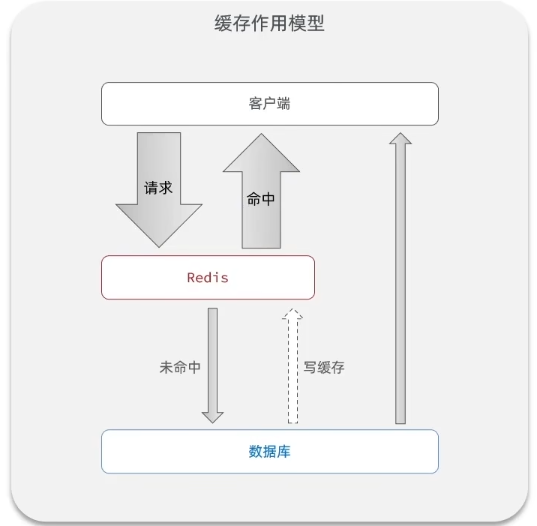

黑马点评是一个用于学习Redis的实战项目

# 1. 登录

## 1.1 基于Session实现短信登录

实现流程：


对于Session的操作，直接用HttpSession对象存取数据即可，底层和客户端通过cookie中的JSESSIONID进行各个客户端的识别都会自动完成，可以视为每个客户端独立对应自己的Session对象

## 1.2 集群的Session共享问题

多台Tomcat并不共享session存储空间，当请求切换到不同tomcat服务时就会导致认证失败


因此可以利用Redis来代替Session实现登录功能

可以使用用户手机号作为key，对应的value就是验证码，当登录成功之后，将用户对象也存储在Redis中（用一个随机生成的token作为key，客户端之后的请求都会带上这个token）

当然这样还是要在服务器端存储用户登录数据，因此不如使用JWT认证登录

# 2. 缓存



Redis此时就是一个中间层，在客户端和数据库中间进行一次拦截

## 2.1 缓存更新策略

缓存更新的三种思路：

1. 使用Redis自带的内存淘汰机制，在低一致性需求场景使用

   即当Redis内存不足时自动删除一些缓存

2. 超时剔除，在高一致性需求场景作为兜底

   在插入缓存时设置超时时间ttl，超时后自动删除

3. 主动更新，在高一致性需求场景使用

   在更改数据库时手动删除缓存

其中主动更新中，写数据库和删除缓存这两个事件可能会发生线程安全问题

1. 先删缓存后写数据库

   由于更新数据库操作较慢，因此这种情况发生可能性较大

   

2. 先操作数据库后写缓存

   

## 2.2 缓存穿透

缓存穿透是指客户端请求的数据在缓存和数据库中都不存在（比如恶意发起的请求），这样缓存永远不会生效，这些请求都会发到数据库。如果恶意大量请求，就会导致后端数据库压力过大。

解决方案：

1. 缓存空对象：

   当请求数据库中也不存在的数据时，也会进行缓存，但是缓存值为null或者空字符串

   这个方案实现简单维护方便，但是会造成额外的内存消耗

2. 布隆过滤：

3. 主动防范：增强id的复杂度，避免被猜测到id规律从而编造不存在的id，并做好数据的基础格式校验

### 2.2.1 布隆过滤

布隆过滤是在客户端和Redis之间再插入一层布隆过滤器，当请求发来时先查询布隆过滤器请求的数据是否存在，如果存在就放行，不存在则返回。


如何判断数据是否存在就是布隆过滤器的核心算法。实现复杂，并且存在误判可能。

## 2.3 缓存雪崩

缓存雪崩是指同一时段大量缓存同时失效（过期）或者Redis服务宕机，导致大量请求到达数据库，带来巨大压力

 **解决方案**

同时失效：

- 给不同key的ttl添加随机值，不让它们同时失效

Redis服务器宕机

- 利用Redis集群提高服务的可用性

- 给缓存业务添加降级限流策略

  比如给部分服务做快速失败处理，牺牲部分服务保住数据库

- 给业务添加多级缓存

  浏览器缓存 - Nginx缓存 - jvm缓存...

## 2.4 缓存击穿

缓存击穿问题也叫热点Key问题，就是一个被高并发访问并且缓存重建业务较复杂（比如需要多表联查的数据）的key突然失效了，无数的请求访问会在瞬间给数据库带来巨大冲击

（可以使用Apache JMeter来模拟高并发请求场景）


解决方案有互斥锁（一致性高）和逻辑过期（可用性高）

### 2.4.1 互斥锁

给查询数据库重建缓存数据操作加锁（每个相同的查询操作对应一个锁），避免大量请求同时访问数据库。


这样会导致请求延迟较高，因为所有线程都要等待一个线程完成查询数据库和写入缓存操作

**锁原理**

使用Redis的setnx命令，setnx会在key不存在是创建key，若key已存在则无法创建，利用这个特性作为锁来使用

获取锁：

```java
private boolean tryLock(String key) {
    Boolean flag = redisTemplate.opsForValue().setIfAbsent(key, "1", 10, TimeUnit.SECONDS);
    return BooleanUtil.isTrue(flag); // 手动拆箱
}
```

释放锁：

```java
private void unlock(String key) {
    redisTemplate.delete(key);
}
```

### 2.4.2 逻辑过期

在创建缓存时不设置ttl，而是在缓存值的字段中保存一个过期时间。这样就不会出现缓存未命中的问题

当请求到达查询缓存之后发现缓存已过期时，就会加锁并开启一个新的线程去异步更新缓存，而当前请求和被锁阻塞的其他请求则直接返回过期数据。


# 3. 秒杀

## 3.1 ID生成

如果订单表采用自增ID，就会遇到以下问题：

- id规律性太明显，会暴露一些信息
- 受单表数据量的限制

此时可以使用全局ID生成器，它是一种在分布式系统下用来生成全局唯一ID的工具


比如使用一个Long型数字表示ID，由时间戳+序列号组成，其中序列号由Redis自增生成

```java
/**
* 生成自增id
* keyPrefix - redis生成自增id的key前缀，一般为业务名称
*/
public long nextId(String keyPrefix) {
    // 1. 生成时间戳
    LocalDataTime now = LocalDateTime.now();
    long nowSecond = now.toEpochSecond(ZoneOffset.UTC);
    long timestamp = nowSecond - BEGIN_TIMESTAMP;
    // 2. 生成序列号
    String data = now.format(DateTimeFormatter.ofPattern("yyyy:MM:dd"));
    long count = redisTemplate.opsForValue().increment("icr:" + keyPrefix + ":" + data);
    // 3. 拼接并返回
    return timestamp << C
}
```

## 3.2 乐观锁

乐观锁实际上不加锁，只会在对数据进行更新时去判断是否有其他线程对数据做了修改，如果没有则更新数据，如果有则重试或抛出异常

乐观锁可以解决超卖问题，但是会导致抢购成功率过低。所以可以将乐观锁更新数据的条件改为库存大于0，而不是库存和之前数据相同。

**乐观锁的实现方法**

1. 版本号法

   在数据中增加一个版本字段，当修改数据时必须同步修改版本号。

   线程在执行修改操作之前必须先重新查询版本号，确定此时版本号和查询时的版本号相同才能修改

   

2. CAS法

   Compare And Swap

   由于版本号和数据总是会同步修改，因此可以直接验证数据是否修改就可以知道是否有别的线程对数据做修改

   

# 4.分布式锁

当集 群部署场景下，服务会布置在多台服务器上或者容器内，此时每个服务就会对应一个JVM，此时再用java自带的synchronized关键字加锁就无法锁住，此时就需要使用分布式锁

使用Redis的setnx命令（java中的setIfAbsent函数）在Redis数据库中创建一把锁

**模拟集群部署**

可以在IDEA中的Service栏中，将启动项Ctrl+D复制一份，在Configuration中的VM options栏添加`-Dserver.port=8082`覆盖原配置文件修改启动端口号，然后同时运行。

之后在nginx中配置负载均衡即可模拟两台服务器集群部署

## 4.1 锁误删问题

如果一个线程在拿到锁之后被阻塞，阻塞至锁自动超时释放，就会有另一个线程拿到锁继续执行。此时线程1执行完之后就可能会将线程2的锁误删，导致线程2和3同时执行。


可以在获取锁时存入线程标识（可以用随机UUID+线程ID），在释放锁时判断锁的标识，看是否是自己上的锁，只有自己的锁才能释放

## 4.2 Lua脚本

为了解决锁误删问题，在释放锁之前加入了一个判断锁的操作，但是判断和释放这两条命令之间依然有可能发生阻塞或者其他问题，这样依然会导致锁误删问题，因此需要将这两条命令变成原子性命令


**Lua编写Redis命令**

Redis提供了Lua脚本功能，在一个脚本中编写多条Redis命令，确保多条Redis命令执行原子性。

在Lus语言中，Redis提供了调用函数，语法如下：

`redis.call('命令', 'key', '其他参数');`

**执行Lua脚本**

`EVAL "return redis.call('set', 'name', 'jack')" 0` 

也可以在执行Lua脚本时执行参数，变成动态脚本

`EVAL "return redis.call('set', KEYS[1], ARGV[1])" 1 name Rose`

此时Lua脚本后第一个数字是指后面的参数中前几个放在KEYS数组中，而后面的就放在ARGV数组中，这样就可以在脚本中使用这两个数组取到动态传入的参数。注意Lua中数组下标从1开始

**判断和释放锁**

```lua
-- 获取锁的key
local key = KEYS[1]
-- 获取当前线程标识
local threadId = ARGV[1]
-- 获取锁中的线程标识
local id = redis.call('get', KEYS[1])
-- 比较当前线程表示与锁中标识是否一致, 一致则释放锁
if (id == ARGC[1]) then
    return redis.call('del', KEYS[1])
end
return 0
```

简化版本

```lua
-- KEYS1是锁的key，ARGV[1]是当前线程标识
if (redis.call('get', KEYS[1]) == ARGV[1]) then
    return redis.call('del', KEYS[1])
end
return 0
```

**Java中执行Lua脚本**

在Java中可以使用execute函数执行，execute函数源码如下：

```java
public <T> T execute(RedisScript<T> script, List<K> keys, Object... args) {
    return scriptExecutor.execute(script, keys, args);
}
```

可以将unlock.lua文件放在Resources文件夹中

```java
// 提前加载好lua文件
private static final DefaultRedisScript<Long> UNLOCK_SCRIPT;
static {
    UNLOCK_SCRIPT = new DefaultRedisScript<>();
    UNLOCK_SCRIPT.setLocation(new ClassPathResource("unlock.lua"));
    UNLOCK_SCRIPT.setResultType(Long.class); // 指定lua文件返回值的类型
}

public void unlock() {
    redisTemplate.execute(
    	UNLOCK_SCRIPT,
        Collections.singleTonList(key),  // 传入锁的key
        curThreadId; // 传入当前线程标识
    )
}
```

 ## 4.3 Redisson

Redisson是一个在Redis基础上实现的Java驻内存数据网格（In-Memory Data Grid）。它提供了一系列分布式的Java常用对象，还提供了许多分布式服务，其中就包含了各种分布式锁的实现。

**使用Redisson**

1. 引入依赖

   ```xml
   <dependency>
   	<groupId>org.redisson</groupId>
       <artifactId>redisson</artifactId>
       <version>3.13.6</version>
   </dependency>
   ```

2. 配置Redisson客户端

   直接使用redisson-starter自动配置会覆盖springboot对redis的默认配置，所以推荐手动配置

   ```java
   @Configuration
   public class RedisConfig {
       @Bean
       public RedissonClient redissonClient() {
           // 配置类
           Config config = new Config();
           // 添加redis地址，这里是单点地址，也可以用config.useClusterServers()添加集群地址
           config.useSingleServer().setAddress("redis://127.0.0.1:6379").setPassword("password");
       }
       // 创建客户端
       return Redisson.create(config);
   }
   ```

3. 使用Redisson分布式锁

   ```java
   @Autowired
   private RedissonClient redissonClient;
   
   void testRedisson() {
       // 获取锁
       RLock lock = redissonClient.getLock("lockName");
       // 尝试获取锁，参数：获取锁的最大等待时间（期间会重试），锁自动释放时间（即获取锁之后给锁设置的ttl），时间单位
       boolean isLock = lock.tryLock(1, 10, TimeUnit.SECONDS);
       // 获取成功执行业务
       if (isLock) {
           try {
               sout("执行业务");
           } finally {
               // 释放锁
               lock.unlock();
           }
       }
   }
   ```

Redisson锁的源码都可以在tryLock函数中看到

### 4.3.1 可重入原理

同一个线程可以多次获取同一把锁就是可重入

为了实现可重入锁，可以在锁的值域中，除了保存获取锁的线程标识以外，再加一项当前线程重入次数。

当线程获取锁失败时，如果发现当前锁的线程id其实是自己，就把重入次数+1并让其成功获取锁。当线程释放锁时，就把重入次数-1，当重入次数为0时才真正释放锁。

### 4.3.2 可重试原理

当获取锁失败时不直接返回false，而是在一定等待时间内尝试获取锁，就是重试机制

Redission的实现思路是，在尝试获取锁时，如果获取成功就返回null，如果返回失败就返回当前锁的剩余ttl。

获取失败时，如果等待时间还没消耗完，就订阅一个锁释放的通知（当锁释放是会使用Redis的publish发布一个通知），然后开始阻塞等待这个通知。如果在等待时间内等到了就再次尝试获取锁，如果等不到就重复订阅和等待的过程。知道等待时间结束或者成功获取锁。

### 4.3.3 超时释放问题

当线程被阻塞时，可能会遇到锁自动超时释放，导致另一个线程能进来拿到锁。

Redission会在不手动设置超时释放时间的情况下启用看门狗机制，即设置一个默认超时时间（30s），然后在默认超时时间的1/3时用watch dog重置超时时间。不断重置直到线程完成业务释放锁。

这样如果服务器宕机也会在到达默认超时时间后自动释放锁。

### 4.3.4 主从一致性

