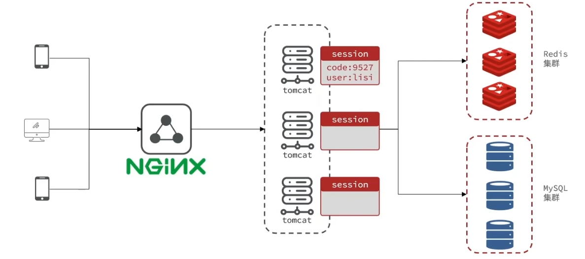
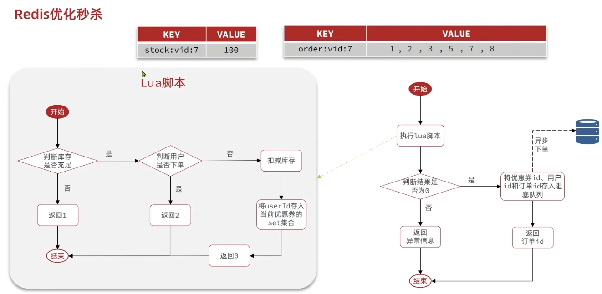

黑马点评是一个用于学习Redis的实战项目

# 1. 登录

## 1.1 基于Session实现短信登录

实现流程：


对于Session的操作，直接用HttpSession对象存取数据即可，底层和客户端通过cookie中的JSESSIONID进行各个客户端的识别都会自动完成，可以视为每个客户端独立对应自己的Session对象

## 1.2 集群的Session共享问题

多台Tomcat并不共享session存储空间，当请求切换到不同tomcat服务时就会导致认证失败



因此可以利用Redis来代替Session实现登录功能

可以使用用户手机号作为key，对应的value就是验证码，当登录成功之后，将用户对象也存储在Redis中（用一个随机生成的token作为key，客户端之后的请求都会带上这个token）

当然这样还是要在服务器端存储用户登录数据，因此不如使用JWT认证登录

# 2. 缓存


Redis此时就是一个中间层，在客户端和数据库中间进行一次拦截

## 2.1 缓存更新策略

缓存更新的三种思路：

1. 使用Redis自带的内存淘汰机制，在低一致性需求场景使用

   即当Redis内存不足时自动删除一些缓存

2. 超时剔除，在高一致性需求场景作为兜底

   在插入缓存时设置超时时间ttl，超时后自动删除

3. 主动更新，在高一致性需求场景使用

   在更改数据库时手动删除缓存

其中主动更新中，写数据库和删除缓存这两个事件可能会发生线程安全问题

1. 先删缓存后写数据库

   由于更新数据库操作较慢，因此这种情况发生可能性较大

   

2. 先操作数据库后写缓存

   

## 2.2 缓存穿透

缓存穿透是指客户端请求的数据在缓存和数据库中都不存在（比如恶意发起的请求），这样缓存永远不会生效，这些请求都会发到数据库。如果恶意大量请求，就会导致后端数据库压力过大。

解决方案：

1. 缓存空对象：

   当请求数据库中也不存在的数据时，也会进行缓存，但是缓存值为null或者空字符串

   这个方案实现简单维护方便，但是会造成额外的内存消耗

2. 布隆过滤：

3. 主动防范：增强id的复杂度，避免被猜测到id规律从而编造不存在的id，并做好数据的基础格式校验

### 2.2.1 布隆过滤

布隆过滤是在客户端和Redis之间再插入一层布隆过滤器，当请求发来时先查询布隆过滤器请求的数据是否存在，如果存在就放行，不存在则返回。


如何判断数据是否存在就是布隆过滤器的核心算法。实现复杂，并且存在误判可能。

## 2.3 缓存雪崩

缓存雪崩是指同一时段大量缓存同时失效（过期）或者Redis服务宕机，导致大量请求到达数据库，带来巨大压力

 **解决方案**

同时失效：

- 给不同key的ttl添加随机值，不让它们同时失效

Redis服务器宕机

- 利用Redis集群提高服务的可用性

- 给缓存业务添加降级限流策略

  比如给部分服务做快速失败处理，牺牲部分服务保住数据库

- 给业务添加多级缓存

  浏览器缓存 - Nginx缓存 - jvm缓存...

## 2.4 缓存击穿

缓存击穿问题也叫热点Key问题，就是一个被高并发访问并且缓存重建业务较复杂（比如需要多表联查的数据）的key突然失效了，无数的请求访问会在瞬间给数据库带来巨大冲击

（可以使用Apache JMeter来模拟高并发请求场景）


解决方案有互斥锁（一致性高）和逻辑过期（可用性高）

### 2.4.1 互斥锁

给查询数据库重建缓存数据操作加锁（每个相同的查询操作对应一个锁），避免大量请求同时访问数据库。


这样会导致请求延迟较高，因为所有线程都要等待一个线程完成查询数据库和写入缓存操作

**锁原理**

使用Redis的setnx命令，setnx会在key不存在是创建key，若key已存在则无法创建，利用这个特性作为锁来使用

获取锁：

```java
private boolean tryLock(String key) {
    Boolean flag = redisTemplate.opsForValue().setIfAbsent(key, "1", 10, TimeUnit.SECONDS);
    return BooleanUtil.isTrue(flag); // 手动拆箱
}
```

释放锁：

```java
private void unlock(String key) {
    redisTemplate.delete(key);
}
```

### 2.4.2 逻辑过期

在创建缓存时不设置ttl，而是在缓存值的字段中保存一个过期时间。这样就不会出现缓存未命中的问题

当请求到达查询缓存之后发现缓存已过期时，就会加锁并开启一个新的线程去异步更新缓存，而当前请求和被锁阻塞的其他请求则直接返回过期数据。


## 2.5 数据库和缓存一致性

当有数据更新时，先更新数据库再更新缓存和先更新缓存再更新数据库都会带来数据不一致问题

### 2.5.1 Cache Aside

更新数据时，不更新缓存，而是直接删除缓存中的数据

**先删除缓存，再更新数据库**


会带来数据不一致问题

但是可以通过延迟双删来缓解这个问题，可以在请求A中这样执行

```java
// 删除缓存
redis.delKey(x);
// 更新数据库
dp.update(x);
// 睡眠
Thread.sleep(N);
// 第二次删除缓存
redis.delKey(x);
```

加入睡眠是为了保证A在睡眠的时候B能在这一段时间完成从数据库读取数据并写入缓存这一操作，然后A睡眠结束，再把B写入的旧缓存删除掉。

但是睡眠时间不好把握，所以还是推荐先更新数据库，再删除缓存

**先更新数据库，再删除缓存**


虽然也可能会发生数据不一致的问题，但是由于写缓存速度远远快于数据库的写入，所以实际中很难出现B线程更新完数据库A线程才更新完缓存的情况

因此这个方案可以保证数据一致性

以上分析都是保证更新数据库和删除缓存这两个操作都能成功的情况下，如果删除缓存操作失败，还是会导致数据不一致问题。

### 2.5.2 引入消息队列

**消息队列重试机制**

在更新数据库之后，把要删除的缓存的key加入到消息队列，由消费者来执行删除缓存的操作

这个方案的缺点是对代码入侵性比较强，因为需要改造业务代码将删除缓存操作改为将要删除的缓存插入到消息队列中

**订阅MySQL binlog，再操作缓存**

更新数据库成功之后，会产生一条变更日志，记录在binlog里，于是就可以通过订阅binlog日志拿到更改的数据，然后在把对应的缓存删除。

阿里巴巴开源的Canal中间件就是基于这个实现。Canal会模拟MySQL主从复制交互协议，把自己伪装成一个MySQL从节点，向MySQL发送dump请求，MySQL收到请求就会推送binlog给Canal，Canal解析Binlog字节流之后，转换为便于读取的结构化数据，供下游程序使用。

我们可以将Canal采集和转换后的binlog日志采集并发送到消息队列里，然后让消费者根据binlog删除缓存。

# 3. 秒杀

秒杀中的问题：

- 订单ID生成

- 库存超卖问题

  需要加锁，防止多线程并发导致判断库存和扣减库存操作两个操作之间的线程安全问题

  为了保证效率，使用乐观锁

- 一人一单问题

  保证一个人只能下一单，在单机程序中可以使用JVM synchronized锁，将判断用户是否已经下过单和生成订单操作锁起来

  但是在分布式集群服务器中，每个服务器对应一个单独的JVM，所以需要分布式锁来保证所有服务器能共享一把锁

- 秒杀延迟（效率）问题

  

## 3.1 ID生成

如果订单表采用自增ID，就会遇到以下问题：

- id规律性太明显，会暴露一些信息
- 受单表数据量的限制

此时可以使用全局ID生成器，它是一种在分布式系统下用来生成全局唯一ID的工具


比如使用一个Long型数字表示ID，由时间戳+序列号组成，其中序列号由Redis自增生成

```java
/**
* 生成自增id
* keyPrefix - redis生成自增id的key前缀，一般为业务名称
*/
public long nextId(String keyPrefix) {
    // 1. 生成时间戳
    LocalDataTime now = LocalDateTime.now();
    long nowSecond = now.toEpochSecond(ZoneOffset.UTC);
    long timestamp = nowSecond - BEGIN_TIMESTAMP;
    // 2. 生成序列号
    String data = now.format(DateTimeFormatter.ofPattern("yyyy:MM:dd"));
    long count = redisTemplate.opsForValue().increment("icr:" + keyPrefix + ":" + data);
    // 3. 拼接并返回
    return timestamp << C
}
```

## 3.2 乐观锁

用于解决超卖问题，即卖出的数量比库存多

乐观锁实际上不加锁，只会在对数据进行更新时去判断是否有其他线程对数据做了修改，如果没有则更新数据，如果有则重试或抛出异常

乐观锁可以解决超卖问题，但是会导致抢购成功率过低。所以可以将乐观锁更新数据的条件改为库存大于0，而不是库存和之前数据相同。

**乐观锁的实现方法**

1. 版本号法

   在数据中增加一个版本字段，当修改数据时必须同步修改版本号。

   线程在执行修改操作之前必须先重新查询版本号，确定此时版本号和查询时的版本号相同才能修改

   

2. CAS法

   Compare And Swap

   由于版本号和数据总是会同步修改，因此可以直接验证数据是否修改就可以知道是否有别的线程对数据做修改

   

但是CAS存在ABA问题，即在一个线程的阻塞期间，数据的值可能从A变为B又变为A，此时线程阻塞结束之后会认为数据值没有发生改变，就开始对数据进行操作，此时会带来数据安全问题。

所以一般是CAS和版本号发一起用

## 3.3 异步下单

在之前的秒杀实现中，查询优惠券、判断库存、校验一人一单、扣减库存、创建订单操作都是串行执行的，其中有多个步骤都涉及数据库操作，并且为了解决线程安全问题还加了多把锁，这样就会导致请求处理延迟很高。

异步秒杀就是将验证下单资格和耗时较长的实际下单操作分开为两个操作，在完成验证部分之后直接返回订单号结果，并开启另一个线程在后台完成下单。


其中Redis校验部分通过Lua脚本完成，保证原子性。而Tomcat下单部分则省略验证过程直接下单。



**阻塞队列**

阻塞队列可以使用BlockingQueue实现，当线程尝试从BlockingQueue取数据时，如果队列为空，则线程会被阻塞等待知道队列中有数据

```java
// 创建时需要指定队列容量
BlockingQueue<VoucherOrder> orderTasks = new ArrayBlockingQueue<>(1024 * 1024);
```

当执行完Lua脚本判断可以下单之后，就将创建订单所需信息存入阻塞队列中

使用阻塞队列存在的问题：

- 内存溢出

  由于BlockingQueue是JVM自带的阻塞队列，使用的是内存空间，所以当遇到大量订单时，会有内存溢出的问题。

- 数据安全

  由于是在内存中保存，因此当服务器宕机或出现事故时，内存中的数据都会丢失，导致所有数据丢失。或者刚取出一个数据就遇到异常，此时会丢失掉这个数据。

为了解决使用JVM内存阻塞队列遇到的问题，就要使用到消息队列。

**开启异步线程**

```java
private static final ExecutorService SECKILL_ORDER_EXECUTOR = Executors.newSingleThreadExecutor(); // 创建一个线程池用于异步处理订单

// 创建内部类，里面执行线程处理订单的业务逻辑
private class VoucherOrderHandler implements Runnalbe {
    @Override
    public void run() {
        while (true) {
            // 1. 获取队列中的订单信息
            // take是阻塞函数，线程会阻塞等待从队列中拿数据
            VoucherOrder voucherOrder = orderTasks.take();
            // 2. 创建订单
            handlerVoucher(voucherOrder);
        }
    }
}

@PostConstruct // springboot的注解，表示类创建完成后自动执行该函数
private void init() {
    // 给线程池中的现成注册要执行的代码
    SECKILL_ORDER_EXECUTOR.submit(new VoucherOrderHandler());
}
```

# 4.分布式锁

当集 群部署场景下，服务会布置在多台服务器上或者容器内，此时每个服务就会对应一个JVM，此时再用java自带的synchronized关键字加锁就无法锁住，此时就需要使用分布式锁

使用Redis的setnx命令（java中的setIfAbsent函数）在Redis数据库中创建一把锁

**模拟集群部署**

可以在IDEA中的Service栏中，将启动项Ctrl+D复制一份，在Configuration中的VM options栏添加`-Dserver.port=8082`覆盖原配置文件修改启动端口号，然后同时运行。

之后在nginx中配置负载均衡即可模拟两台服务器集群部署

## 4.1 锁误删问题

如果一个线程在拿到锁之后被阻塞，阻塞至锁自动超时释放，就会有另一个线程拿到锁继续执行。此时线程1执行完之后就可能会将线程2的锁误删，导致线程2和3同时执行。


可以在获取锁时存入线程标识（可以用随机UUID+线程ID），在释放锁时判断锁的标识，看是否是自己上的锁，只有自己的锁才能释放

## 4.2 Lua脚本

为了解决锁误删问题，在释放锁之前加入了一个判断锁的操作，但是判断和释放这两条命令之间依然有可能发生阻塞或者其他问题，这样依然会导致锁误删问题，因此需要将这两条命令变成原子性命令


**Lua编写Redis命令**

Redis提供了Lua脚本功能，在一个脚本中编写多条Redis命令，确保多条Redis命令执行原子性。

在Lus语言中，Redis提供了调用函数，语法如下：

`redis.call('命令', 'key', '其他参数');`

**执行Lua脚本**

`EVAL "return redis.call('set', 'name', 'jack')" 0` 

也可以在执行Lua脚本时执行参数，变成动态脚本

`EVAL "return redis.call('set', KEYS[1], ARGV[1])" 1 name Rose`

此时Lua脚本后第一个数字是指后面的参数中前几个放在KEYS数组中，而后面的就放在ARGV数组中，这样就可以在脚本中使用这两个数组取到动态传入的参数。注意Lua中数组下标从1开始

**判断和释放锁**

```lua
-- 获取锁的key
local key = KEYS[1]
-- 获取当前线程标识
local threadId = ARGV[1]
-- 获取锁中的线程标识
local id = redis.call('get', KEYS[1])
-- 比较当前线程表示与锁中标识是否一致, 一致则释放锁
if (id == ARGC[1]) then
    return redis.call('del', KEYS[1])
end
return 0
```

简化版本

```lua
-- KEYS1是锁的key，ARGV[1]是当前线程标识
if (redis.call('get', KEYS[1]) == ARGV[1]) then
    return redis.call('del', KEYS[1])
end
return 0
```

**Java中执行Lua脚本**

在Java中可以使用execute函数执行，execute函数源码如下：

```java
public <T> T execute(RedisScript<T> script, List<K> keys, Object... args) {
    return scriptExecutor.execute(script, keys, args);
}
```

可以将unlock.lua文件放在Resources文件夹中

```java
// 提前加载好lua文件
private static final DefaultRedisScript<Long> UNLOCK_SCRIPT;
static {
    UNLOCK_SCRIPT = new DefaultRedisScript<>();
    UNLOCK_SCRIPT.setLocation(new ClassPathResource("unlock.lua"));
    UNLOCK_SCRIPT.setResultType(Long.class); // 指定lua文件返回值的类型
}

public void unlock() {
    redisTemplate.execute(
    	UNLOCK_SCRIPT,
        Collections.singleTonList(key),  // 传入锁的key
        curThreadId; // 传入当前线程标识
    )
}
```

 ## 4.3 Redisson

Redisson是一个在Redis基础上实现的Java驻内存数据网格（In-Memory Data Grid）。它提供了一系列分布式的Java常用对象，还提供了许多分布式服务，其中就包含了各种分布式锁的实现。

**使用Redisson**

1. 引入依赖

   ```xml
   <dependency>
   	<groupId>org.redisson</groupId>
       <artifactId>redisson</artifactId>
       <version>3.13.6</version>
   </dependency>
   ```

2. 配置Redisson客户端

   直接使用redisson-starter自动配置会覆盖springboot对redis的默认配置，所以推荐手动配置

   ```java
   @Configuration
   public class RedisConfig {
       @Bean
       public RedissonClient redissonClient() {
           // 配置类
           Config config = new Config();
           // 添加redis地址，这里是单点地址，也可以用config.useClusterServers()添加集群地址
           config.useSingleServer().setAddress("redis://127.0.0.1:6379").setPassword("password");
       }
       // 创建客户端
       return Redisson.create(config);
   }
   ```

3. 使用Redisson分布式锁

   ```java
   @Autowired
   private RedissonClient redissonClient;
   
   void testRedisson() {
       // 获取锁
       RLock lock = redissonClient.getLock("lockName");
       // 尝试获取锁，参数：获取锁的最大等待时间（期间会重试），锁自动释放时间（即获取锁之后给锁设置的ttl），时间单位
       boolean isLock = lock.tryLock(1, 10, TimeUnit.SECONDS);
       // 获取成功执行业务
       if (isLock) {
           try {
               sout("执行业务");
           } finally {
               // 释放锁
               lock.unlock();
           }
       }
   }
   ```

Redisson锁的源码都可以在tryLock函数中看到

### 4.3.1 可重入原理

同一个线程可以多次获取同一把锁就是可重入

为了实现可重入锁，可以在锁的值域中，除了保存获取锁的线程标识以外，再加一项当前线程重入次数。

当线程获取锁失败时，如果发现当前锁的线程id其实是自己，就把重入次数+1并让其成功获取锁。当线程释放锁时，就把重入次数-1，当重入次数为0时才真正释放锁。

### 4.3.2 可重试原理

当获取锁失败时不直接返回false，而是在一定等待时间内尝试获取锁，就是重试机制

Redission的实现思路是，在尝试获取锁时，如果获取成功就返回null，如果返回失败就返回当前锁的剩余ttl。

获取失败时，如果等待时间还没消耗完，就订阅一个锁释放的通知（当锁释放是会使用Redis的publish发布一个通知），然后开始阻塞等待这个通知。如果在等待时间内等到了就再次尝试获取锁，如果等不到就重复订阅和等待的过程。知道等待时间结束或者成功获取锁。

### 4.3.3 超时释放问题

当线程被阻塞时，可能会遇到锁自动超时释放，导致另一个线程能进来拿到锁。

Redission会在不手动设置超时释放时间的情况下启用看门狗机制，即设置一个默认超时时间（30s），然后在默认超时时间的1/3时用watch dog重置超时时间。不断重置直到线程完成业务释放锁。

这样如果服务器宕机也会在到达默认超时时间后自动释放锁。

# 5. 消息队列

消息队列（Message Queue），即存放消息的队列。消息队列模型包括三个角色

- 消息队列：存储和管理信息，也被称为消息代理（Message Broker）
- 生产者：发送消息到消息队列
- 消费者：从消息队列获取消息并处理消息

消息队列要满足以下要求：

- 消息队列中的消息要能持久化保存（保证数据安全）
- 消息被取出后，要等待消费者给出消费完成的信号之后才能真正删除这条数据（防止数据丢失）

常见的消息队列有RabbitMQ、Kafka等

Redis提供了实现消息队列的几种方式

- list结构：基于list结构模拟消息队列
- PubSub：基本的点对点消息模型
- Stream：比较完善的消息队列模型

## 5.1 List结构

Redis的list结构是一个双向链表，可以模拟出队列效果

由于要实现阻塞功能，因此要使用BRPOP或者BLPOP来实现阻塞效果

使用List结构模拟的缺点为：

- 无法避免消息丢失

  即消费者取出消息后，还未处理取出消息的进程就挂掉了，此时这条消息就没了

- 只支持单消费者

## 5.2 PubSub

publish-subscribe发布订阅，是Redis2.0版本引入的消息传递模型

消费者可以订阅一个或多个channel，生产者向对应channel发送消息后，所有订阅者都能收到相关消息

但是这个消息本身不会被Redis保存，PubSub只是拿来发送消息的机制并不是一种数据类型，如果某个频道没人订阅，那发布的消息就会直接被丢弃，如果有人订阅，就会在订阅方处缓存

对应的命令有

- SUBSCRIBE channel1 channel2

  订阅一个或多个频道

- PUBLISH  channel msg

  向一个频道发送消息

- PSUBSCRIBE pattern1 pattern2

  订阅与pattern格式向匹配的所有频道

缺点：

- 不支持数据持久化
- 无法避免消息丢失
- 消费者端的消息缓存有上限，超出时数据丢失

## 5.3 Stream

Stream 是 Redis 5.0引入的一种新数据类型（可以持久化），可以实现一个功能非常完善的消息队列

### 5.3.1 单消费者

- 发送消息

  `XADD key [NOMKSTREAM] [MAXLEN|MINID [=|~] threshold [LIMIT count]] *|ID field value [field value]`

  - key：队列名称
  - NOMKSTREAM：可选，如果队列不存在是否自动创建，默认自动创建
  - threshold：可选，消息队列的最大消息数量，不填就是无限制
  - *|ID：当前消息的ID，\* 表示由Redis自动生成
  - field value：消息体，field-value键值对形式，可以插入多条

- 读取消息

  `XREAD [COUNT count] [BLOCK milliseconds] STREAMS key [key ...] ID [ID ...]`

  - [COUNT count]：每次读取消息的最大数量
  - [BLOCK milliseconds] ：当没有消息时是否阻塞等待，以及阻塞时长
  - key ：从哪个队列读取消息，key就是队列名，可以从多个队列中读取
  - ID：起始id，从哪个消息开始往下取，0代表从第一个消息开始，$表示从最新的消息开始

如果在读取消息时起始id使用$，一直阻塞等待最新的消息并处理，那么当同时来多条消息时，也只会处理最后一条，从而导致漏处理中间的消息。

### 5.3.2 消费者组

消费者组就是将多个消费者划分到一个组中，监听同一个消息队列

消费者组具有下列特点：

- 消息分流

  队列中的消息会分流给消费者组中的不同消费者

- 消息标识

  消费者组会维护一个标示，记录最后一个被处理的消息。每次从队列中取数据都会取出未被处理的最早入队的消息。

- 消息确认

  消费者获取消息后，消息处于pending状态，存入一个pending-list，而不是直接删除。

  当消费者处理完之后，需要用XACK命令告诉队列消息已处理完，消息队列才会删除该消息。

对应的命令：

- 创建消费者组

  `XGROUP CREATE key groupName ID [MKSTREAM]`

  - key：队列名称
  - groupName：消费者组名称
  - ID：起始从哪个ID开始获取消息，0代表队列第一个消息，$代表最后一个

  一般不需要手动创建消费者，因为当指定消费者监听队列时，如果组内没有对应消费者，会自动创建

- 从消费者组读取消息

  `XREADGROUP GROUP group consumer [COUNT count] [BLOCK milliseconds] [NOACK] STREAMS key [key ...] ID [ID ...]`

  - group：消费组名称

  - consumer：消费者名称，如果不存在会自动创建

  - count：本次查询的最大数量

  - NOACK：无需手动ACK，即消息传递给消费者后消息队列自动确认

  - STREAMS key：指定消息队列名称

  - ID：获取消息的ID

    \> ： 取下一个未消费的消息

    其他：根据指定id从pending-list中获取已消费但未确认的消息（即遇到异常情况未被成功处理的消息），例如0，表示从pending-list第一个消息开始取

# 6. 其他功能

## 6.1 BitMap用户签到

统计用户的签到信息，如果用数据库把每个用户每天的签到信息都保存下来，就会导致数据量极大

可以使用二进制位，把每个bit对应当月每一天，这样一个int就可以表示每个用户每个月的签到情况，如果某位为0说明用户对应天没签到，为1则说明用户签到

**BitMap用法**

Redis中利用string类型数据结构实现BitMap

BirMap的操作命令：

- SETBIT key offset value

  设置key对应的bitmap中指定offset位置的值（0或1）

- GETBIT key offset

  查找指定bitmap中指定offset位置的值

- BITCOUNT key

  统计bitmap中1的数量

- BITFIELD

  用于同时操作多个比特位，一般用于一次读取多个

  BITFIELD key GET u3 0

  表示从0位开始获取3个，会将结果转化为十进制返回，因此要指定是否带符号，u表示转为无符号整数，i表示转为带符号整数

- BITFIELD_RO

  和BITFIELD用法相同，不过只能用来进行读取操作

- BITOP

- BITPOS

**java中使用**

由于Redis中的BitMap是用string实现的，因此在java中BitMap的操作封装在opsForValue中

- SET：setBit()
- GET：getBit()

## 6.2 HyperLogLog UV统计

UV：Unique Visitor，独立访客量，是指通过互联网访问、浏览当前网页的自然人，1天内同一用户多次访问只记录一次

PV：Page View，页面访问量或点击量。用户每访问一次页面记录1次PV，同一用户多次打开页面则记录多次PV，往往用来衡量网站流量

如果将所有访问过的用户都记录下来，数据量会非常大，因此可以使用基于概率统计的算法来统计用户访问量

**HyperLogLog**

Hyperloglog（HLL）是从Loglog算法派生的概率算法，用于确定非常大的集合的基数，而不需要存储其值。

Redis中的HLL是基于string结构实现的，单个HLL的内存永远小于16kb，作为代价，其测量结果是概率性的，有小于0.81%的误差

相关命令：

- PFADD key element

  向key指定的HLL中添加一个特定的元素

- PFCOUNT key

  统计指定HLL中的数据量（是唯一性统计，即相同元素只会统计一次）

- PFMERGE destkey sourcekey [sourcekey]

  合并多个HLL为一个

# 7. 数据持久化

## 7.1 RDB

RDB，全称Redis Database Backup file，也叫Redis数据快照。简单来说就是把内存中的所有数据都记录到磁盘中，当Redis实例重启后可以从磁盘读取快照文件回复数据。

快照文件称为RDB文件，默认保存在当前运行目录。

**自动执行RDB**

默认会在Redis停机前执行RDB（如果宕机肯定就执行不了了）

有关RDB的配置在配置文件中进行配置：

- 配置内部触发RDB的机制

  save 900 1 ── 900s内至少有1个key被修改，则执行bgsave

  `save ""` ： 禁用RDB

- RDB文件名称

  dbfilename dump.rdb

- 文件保存的路径目录

  dir ./ ── 保存在当前运行目录

**手动执行RDB**

- save：由Redis主进程来执行RDB保存操作，由于Redis是单线程，因此会阻塞其余所有命令
- bgsave：开启子进程后台执行RDB

**RDB缺点**

bgsave命令需要fork一个子进程，期间主进程再对数据库进行修改时就需要拷贝一份新内存出来。会导致内存占用变高

两个save之间有可能会宕机，出现数据丢失问题

## 7.2 AOF

AOF，全称为Append Only File（追加文件）。将Redis处理的每一个写命令都会记录在AOF文件

AOF默认关闭，需要修改redis.conf配置文件开启

```redis.conf
# 是否开启AOF功能
appendonly yes
# AOF文件的名称
appendfilename "appendonly.aof"
# 何时写入磁盘 每执行一次写命令/每秒(默认)/由操作系统决定
appendfsync always/everysec/no
```

**AOF文件重写**

AOF会记录对同一个key的多次写操作，但只有最后一次写操作有意义，因此AOF文件会记录很多无效操作，文件体积会比RDB大。

通过执行bgrewriteaof命令，可以让AOF文件执行重写功能，用最少的命令达到相同效果。但文件依然会比RDB大

文件重写配置

```redis.conf
# AOF文件比上次文件增长超过多少百分比则触发重写
auto-aof-rewrite-percentage 100
# AOF文件体积最小多大以上才触发重写
auto-aof-rewrite-min-size 64m
```

# 8. Redis集群

## 8.1 主从集群

主节点负责写操作，从节点负责读操作，实现读写分离


**搭建主从集群**

1. 将redis复制三份，启动三个redis实例

   记得修改redis端口（假设主端口为7001，从端口为7002、7003），并且要开启RDB

2. 开启主从关系

   在从节点端使用slaveof\replicaof命令指定自己的主节点

   - 修改配置文件（永久生效）

     在redis.conf中添加一行配置 `slaveof <masterip> <masterport>`

   - 在redis-cli客户端中执行slaveof命令（重启后失效）

     `slaveof <masterip> <masterport>`

   slaveof 127.0.0.1 7001

   可以使用 `INFO replication`命令查看集群状态


### 8.1.1 全量同步

在节点中会维护两个数据：

1. runID，主服务器的id，也是数据集的标记

   每个Redis服务器在启动时都会自动生产一个随机的ID来唯一标识自己

2. offset：偏移量

   表示复制的进度

   随着记录在repl_baklog中的操作增多而主键增大。slave完成同步时也会记录当前同步的offset。如果slave的offset小于master的offset，说明slave数据落后于master，需要更新

slave做数据同步，必须向master声明自己的replication id 和 offset，master才可以判断到底需要同步哪些数据

master会通过slave的runID来判断slave之前有没有从自己这里获取过数据，即是不是第一次同步

**全量同步过程**

第一次同步是全量同步，即主节点会将整个数据库拷贝为RDB并发给从节点


1. 建立连接，协商同步

   1. 执行replicaof命令成为从节点

   2. 发送psync命令，表示要进行数据同步

      psync命令包含两个参数：主服务器的runID和复制进度offset

      第一次同步时，由于不知道主服务器ID，因此会设置为？，offset设置为-1

   3. 主服务器收到psync命令后，用FULLRESYNC作为响应命令返回

      FULLRESYNC表示采用全量复制，会携带主服务器的runID和主服务器目前复制进度offset，从服务器收到后会记录这两个值

2. 主服务器同步数据给从服务器

   1. 主服务器执行bgsave后台生成RDB文件

   3. 主服务器传输RDB文件

   4. 从服务器收到RDB文件后，会先清空当前数据，然后载入RDB文件

      完成RDB文件的载入后，会回复一个确认消息给主服务器

   在生成、发送、加载RDB文件的过程中，主服务器也会收到写操作命令，这期间的命令会写入到replication buffer缓冲区中。每个从节点都会对应一个各自的replication buffer。如果replication buffer满了，会导致连接断开，删除所有缓存，从节点重新连接，重新开始全量复制

3. 主服务器发送新写的操作命令给从服务器

   1. 主服务器将replication buffer缓冲区里所记录的写操作命令发送给从服务器
   2. 从服务器执行replication buffer缓冲区里的命令，此时主从数据就一致了

主从服务器第一次同步工作到此完成

### 8.1.2 命令传播

主从服务器完成第一次同步后，双方就会维护一个TCP长连接

后续主服务器可以通过这个连接将写操作命令传播给从服务器，然后从服务器执行这些命令，保证主从数据一致

这个过程就称为基于长连接的命令传播

### 8.1.3 增量同步

如果主从服务器间的网络连接断开了，就无法进行命令传播，当网络修复slave重启后，就会进行增量同步


1. 从服务器重启之后，发送psync命令给主服务器，告知此时从服务器的runID和offset
2. 主服务器收到命令后，用CONTINUE命令响应从服务器，告知接下来采用增量复制的方式同步数据
3. 主服务器将主从服务器断线期间执行的写命令发送给从服务器，然后从服务器执行这些命令

**主服务器怎么知道发送哪些增量数据**

主服务器在进行命令传播的同时，会将写命令写入到repl_backlog_buffer缓冲区中，这个缓冲区是一个环状缓冲区，也就是说写满之后会从头开始覆盖写。主服务器会用master_repl_offset记录自己写到的位置。

从服务器重连之后，会通过psync命令发送自己的复制偏移量slave_repl_offset。如果从服务器的偏移量还在缓冲区内（没有被覆盖），则采用增量同步。如果已经被覆盖了（落后的太多），就采用全量同步

**ping-pong心跳检测**

Redis的主从结构中，会通过ping-pong心跳检测机制检测是否有节点宕机。如果一半以上的节点去ping一个节点时没有pong回应，则集群会认为这个节点挂掉了

- Redis主节点默认每隔10s对从节点发送ping命令，判断从节点存活性和连接状态
- Redis从节点每隔1s发送replconf ack{offset} 命令，给主节点上报自身当前的复制偏移量，以实时监测主从节点网络状态，并上报自身offset，检查复制数据是否丢失

### 8.1.4 同步的优化

- 在master的配置文件中配置 repl-diskless-sync yes启用无磁盘复制，即不将RDB文件写入磁盘，而是直接通过网络发给从节点

- 提高repl_baklog的大小，发现slave宕机时尽快实现故障恢复，尽可能避免全量同步

- 限制一个master上的slave节点数量

- 采用主-从-从链式结构

  
  
  如果slave太多，可以采用主-从-从链式结构，让一部分从节点从另一部分从节点中同步数据
  
  只需要直接执行replicaof命令即可，如果目标服务器本身也是从服务器，则该目标服务器会自动成为经理的角色

## 8.2 哨兵机制

当master节点宕机时，选择另一个slave节点作为master节点

Redis提供了哨兵（Sentinel）机制来实现主从集群的自动故障恢复，哨兵也是一组集群

哨兵的工作如下：

- 监控：不断检查master和slave是否按预期工作
- 自动故障恢复：如果master故障，Sentinel会将一个slave提升为master。当故障实例恢复后也以新master为主
- 通知：客户端访问Redis集群时，会通过哨兵来访问。这样当集群发生故障转移master节点时，会将最新信息推送给Redis客户端

### 8.2.1 哨兵原理


**哨兵的检查机制**

Sentinel基于心跳机制检测服务状态，每隔1秒向集群的每个实例发送ping命令

- 主观下线：如果某sentinel节点发现某实例未在规定时间响应，则认为该实例主观下线
- 客观下线：如果超过指定数量（quorum，自己配置）的sentinel都认为该实例主观下线，则该实例客观下线。quorum值最好超过Sentinel实例数量的一半

**新master选举机制**

1. 首先判断slave节点与master节点断开时间长短，如果超过指定值（down-after-milliseconds*10）则会排除该slave节点
2. 判断slave节点的slave-priority值，越小优先级越高，如果是0则永不参与选举
3. 如果slave-priority一样，则判断slave节点的offset值，越大说明数据越新，优先级越高
4. （此时是随便选一个指标）最后判断slave节点的运行id大小，越小优先级越高

**实现故障转移**

选中一个slave称为新的master后，故障转移步骤如下：

1. sentinel给选中的slave节点发送slaveof no one命令，让该节点称为master
2. sentinel给所有其他slave发送slaveof 新master节点的命令，让这些slave称为新master的从节点
3. sentinel将故障节点标记位slave，并slaveof 新master

### 8.2.2 搭建哨兵集群

**搭建哨兵集群**

1. 复制三个redis副本，在文件夹中创建哨兵配置文件sentinel.conf

   ```sentinel.conf
   port 27001
   sentinel announce-ip 127.0.0.1 # 对外宣称的ip
   sentinel monitor mymaster 127.0.0.1 7001 2
   dir "/tmp/s1"
   ```

   第三行的命令是：`sentinel monitor 给要监视的主从集群起个名字 要监视的主节点的ip 主节点端口号 quorum`

2. 执行命令启动哨兵 `redis-sentinel ./sentinel.conf`

**redisTemplate客户端使用哨兵**

1. pom文件中引入redis的starter依赖

2. 在application.yml中配置redis

   由于master可能会发生改变，因此要配置哨兵节点的地址

   ```yaml
   spring:
     redis:
       sentinel:
         master: mymaster # 集群名称
         nodes: # 指定redis-sentinel集群信息
           - 127.0.0.1：27001
           - 127.0.0.1：27002
           - 127.0.0.1：27003
   ```

3. 配置主从读写分离

   由于redisTemplate底层用的是lettuce，因此需要修改lettuce配置

   ```java
   @Bean
   public LettuceClientConfigurationBuilderCustomizer configurationBuilderCustomizer() {
       return configBuilder -> configBuilder.readFrom(ReadFrom.REPLICA_PREFERED);
   }
   ```

   ReadFrom枚举类的值有以下几个：

   - MASTER：从主节点读取
   - MASTER_PREFERRED：优先从master节点读取，master不可用才读replica
   - REPLICA：从slave（replica）节点读取
   - REPLICA_PREFERRED：优先从slave（replica）节点读取，所有的slave都不可用才读取master

## 8.3 分片集群

主从和哨兵可以解决高可用、高并发读的问题，但是对于海量数据存储和高并发写的问题无法解决

使用分片集群则可以解决


分片集群具有以下特征：

- 集群中有多个master，每个master保存不同数据
- 每个master都可以有多个slave节点
- master之间通过ping监测彼此健康状态
- 客户端请求可以访问集群任意节点，最终都会被转发到正确节点

### 8.3.1 搭建分片集群

以三主三从为例，即三个主节点，每个主节点对应一个从节点。假设7001，7002，7003是主节点，8001，8002，8003是从节点

1. 复制六个redis副本，修改副本中的配置文件。并全部启动

   ```redis.conf
   port 6379
   # 开启集群功能
   cluster-enables yes
   # 指定集群的配置文件名称。这个文件不需要我们创建，由redis自己维护，只需要指定创建的位置
   cluster-config-file /redis-6379/nodes.conf
   # 节点心跳失败的超时时间
   cluster-node-timeout 5000
   # 持久化文件存放目录
   dir /redis-6379
   # 让redis后台运行
   daemonize yes
   # 该实例的注册ip
   replica-announce-ip 127.0.0.1
   # 日志，redis的运行日志存放目录
   logfile /redis-6379/run.log
   ```

2. 创建集群

   ```shell
   redis-cli --cluster create --cluster-replicas 1 127.0.0.1:7001 127.0.0.1:7002 127.0.0.1:7003 127.0.0.1:8001 127.0.0.1:8002 127.0.0.1:8003
   ```

   redis-cli --cluster：集群操作命令

   create：代表创建集群

   --replicas：指定集群中每个master的副本为1。redis会根据节点总数/(replicas + 1)得到master数量。因此节点列表中前n个就是master，其他节点就是slave节点

   执行完之后redis会给出集群分配方案，输入yes即可创建集群

3. 连接客户端

   ```shell
   redis-cli -c -p 7001
   ```

   客户端连接集群要加上-c参数

4. 查看集群信息

   `redis-cli -p 7001 cluster nodes`

   输入集群中节点的任一端口号，使用cluster nodes命令查看集群信息

使用RedisTemplate访问分片集群和访问哨兵主从集群相似，只是在配置nodes节点时，需要配置分片集群的每一个节点信息。主从读写分离配置完全一致

```yaml
spring:
  redis:
    cluster:
      nodes:
        - 127.0.0.1:7001
        - ...
```


### 8.3.2 散列插槽

为了确定每个数据在哪个主从节点上，Redis使用了散列插槽机制。

Redis会把每个master节点映射到0~16383个插槽上。每个key不与节点绑定，而是与插槽绑定，redis会根据key 的有效部分计算插槽值，有效部分为：

- key中包含`{}`，且`{}`中至少包含一个字符，则{}中的部分是有效部分
- key中不包含`{}`，则整个key都是有效部分

计算方式是利用CRC16算法得到一个hash值，然后对16386取余，得到的结果就是slot值。再根据slot值去对应的主节点上操作数据

如果想让同一类数据保存在同一个Redis实例中，就可以给它们的key的相同部分用{}包起来，例如key都以`{typeId}`为前缀，保证它们算出相同的插槽值

### 8.3.3 集群伸缩

集群伸缩就是动态的添加或移除集群节点

**添加节点**

```redis
add-node new_host:new_port existing_host:existing_port [--cluster-slave] [--cluster-master-id]
```

- new_host:new_port：指定要添加的新节点的信息

- existing_host:existing_port：指定一个集群中的已有节点，来标识加入到哪个集群中
- --cluster-slave：添加新节点默认是master节点，如果添加这个参数，则新节点添加之后是slave节点
- --cluster-master-id：指定新节点添加后是哪个master节点的从节点

**分配插槽**

新增的master节点默认不会分配任何插槽，需要使用reshard命令手动重新分片

`redis-cli --cluster reshard ip:port`

指定集群中的任何一个实例的ip:port即可，之后手动选择要移动的插槽数量，移动的起始点和目的地

### 8.3.4 故障转移

当主节点发生故障时，会自动发生故障转移

**自动故障转移**

1. 其他主节点通过心跳机制疑似某节点发生宕机

   日志中会显示：master,fail? - 节点id

2. 确定下线，日志中会显示：master,fail - 节点id
3. 自动提升一个slave为新的master

**手动故障转移**

当某个服务器需要停机维护时，就需要手动进行故障转移 

在用于替换故障节点的slave节点中执行cluster failover命令，手动让该slave节点和它对应的master节点替换位置


