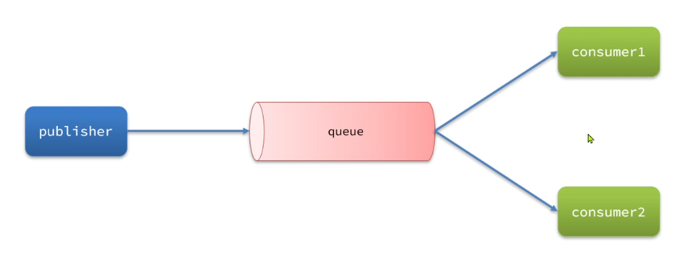

# 1. QuickStart

## 1.1 基本概念

**MQ技术选型（MQ优点）**

- 支持协议多：AMQP，XMPP，SMTP，STOMP
- 可靠性高

**RabbitMQ核心概念**

- publisher：消息发送者

- consumer：消息消费者

- queue：队列，用于存储消息

- exchange：交换机，负责路由消息

- virtual-host：虚拟主机，用于数据隔离。

  一般一个项目对应一个RabbitMQ用户对应一个virtual-host

**RabbitMQ整体架构**


Publisher产生消息之后，会将消息发送给交换机，再由交换机转发给消息队列，最后给消费者消费。

一个RabbitMQ可能会负责多个项目的消息代理，RabbitMQ中提供了VirtualHost虚拟主机，可以起到数据隔离的作用

## 1.2 安装

用docker镜像和下载好的tar包安装

- docker load -i mq.tar

  加载镜像文件

- 使用run命令启动镜像

  先创建网桥 `docker network create hmall`

  ```shell
  docker run \
   -e RABBITMQ_DEFAULT_USER=sazer \
   -e RABBITMQ_DEFAULT_PASS=123456 \
   -v mq-plugins:/plugins \
   --name mq \
   --hostname mq \
   -p 15672:15672 \
   -p 5672:5672 \
   --network hmall \
   -d \
   rabbitmq:3.8-management
  ```

  其中5672是用来让发送者和消费者传递消息的，15672是管理界面端口

- 打开浏览器，打开127.0.0.1:15672打开Rabbitmq管理界面

  如果不成功，可能是管理插件没有启动，进入docker容器中启动一下即可

  ```bash
  docker exec -it rabbit bash
  # 进入容器之后zhi xi
  rabbitmq-plugins enable rabbitmq_management
  ```

  

# 2. Spring AMQP

Spring框架对RebbitMQ的整合

AMQP：Advanced Message Queuing Rrotocol，是用于在应用程序之间传递业务消息的开放标准。该协议与语言和平台无关。

Spring AMQP：是基于AMQP协议定义的一套API规范，提供了模板来发送和接收消息。包含两部分，其中spring-amqp是基础抽象，spring-rabbit是spring-amqp的默认实现（也是唯一实现）。

## 2.1 基本使用

**收发消息**

1. 引入spring-amqp依赖

   ```xml
   <dependency>
   	<groupId>org.springframework.boot</groupId>
       <artifactId>spring-boot-starter-amqp</artifactId>
   </dependency>
   ```

2. 配置RabbitMQ服务端信息

   在application.yaml中配置

   ```yaml
   spring:
     rabbitmq:
       host: 127.0.0.1
       port: 5672
       virtual-host: /hmall
       username: saz
       password: 123456
   ```

   virtual-host和用户名要对应

3. 发送消息

   SpringAMQP提供了RabbitTemplate工具类供我们发送消息

   ```java
   @Autowired
   private RabbitTemplate rabbitTemplate;
   
   @Test
   public void testSendMesg() {
       // 队列名称
       String queueName = "simple.queue";
       // 消息内容
       String message = "hello, spring amqp!";
       rabbitTemplate.convertAndSend(queueName, message);
   }
   ```

4. 接收消息

   只需要在方法上添加@RabbitListener注解即可自动接收消息

   ```java
   @Component
   public class SpringRabbitListener{
       @RabbitListener(queues = "simple.queue") // 指定要监听的队列名称，可以指定多个队列
       public void listenSimpleQueueMessage(String msg) { // 当有消息时，会自动传入msg参数HzONG
           sout(msg);
       }
   }
   ```

**基于Bean创建队列和交换机**

创建队列和交换机都只需要在消费者端完成，消息生产者无需知道队列的存在

SpringAMQP提供了几个类，用来声明队列，交换机及其绑定关系

- Queue：用于声明队列，可以用工厂类QueueBuilder构建
- Exchange：用于声明交换机，可以用工厂类ExchangeBuilder构建
- Binding：用于声明队列和交换机的绑定关系，可以用工厂类BindingBuilder构建

```java
@Configuration
public class FanoutConfig {
    // 声明交换机，并指定交换机名
    @Bean("hmall.fanout")
    public FanoutExchange fanoutExchange() {
        // return ExchangeBuilder.fanoutExchange("hmall.fanout").build(); 用工厂类构建
        return new FanoutExange("hmall.fanout");
    }
    
    // 声明队列，并指定队列名
    @Bean()
    public Queue fanoutQueue1() {
        return new Queue("fanout.queue1");
    }
    
    // 绑定队列和交换机
    @Bean
    // 使用参数自动注入
    public Binding bindingQueue(Queue fanoutQueue1, FanoutExchange fanoutExchange) {
        // 如果是Direct交换机，最后还可以用.with()z
        return BindingBuilder.bind(fanoutQueue1).to(fanoutExchange);
    }
}
```

**基于注解创建队列和交换机**

在listener监听方法上的@RabbitListener注解中直接创建队列和交换机

```java
@RabbitListener(bindings = @QueueBinding(
	value = @Queue(name = "direct.queue1", durable = "true"), // durable=true表示队列中的消息会做持久化
    exchange = @Exchange(name = "hmall.direct", type = ExchangeTypes.DIRECT),
    key = {"red", "blue"} // 指定bindingkey
))
public void listenDirectQueue(String mag) {
    sout(msg);
}
```


## 2.2 Work Queues

WorkQueues是一种任务模型，让多个消费者绑定到一个队列，共同消费队列中的消息，用于加快消息处理速度，避免消息堆积问题



但是如果直接让队列绑定多个消费者，则默认情况下消息会等分给各消费者，而不会考虑消费者处理消息能力的区别，也就是说处理的快的消费者处理完之后就闲着，等着处理慢的消费者处理。

这是因为RabbitMQ会将消息依次轮询投递给每一个消费者，不管消费者有没有处理完之前的消息，这样就会出现消息堆积。

可以通过在配置文件中，将prefetch值设置为1，来确保同一时刻最多投递给消费者一条消息，等处理完之后才会投递下一条

```yaml
spring:
  rabbitmq:
    listener:
      simple:
        prefetch: 1
```

## 2.3 交换机

真正的生产环境都会经过exchange交换机来发送消息，而不是直接发到队列。因为可能会遇到一条消息需要多个业务处理的情形，就需要交换机分发

交换机的类型有以下三种：

- Fanout：广播
- Direct：定向
- Topic：话题

在创建路由时要指定路由的类型

### 2.3.1 Fanout

会将接收到的消息广播到每一个跟其绑定的queue，所以也叫广播模式


```java
String exchangeName = "hmall.fanout"; // 交换机的名字
String msg = "hello, everyone!";
rabbitTemplate.convertAndSend(exchangeName, routingKey:null, msg);
```

### 2.3.2 Direct

会将接收到的消息根据规则路由到指定的Queue，因此被称为定向路由

Queue在与exchange进行绑定时，会设置一个BindingKey（一个队列可以对应多个BindingKey），发布者发送消息时，指定消息的RoutingKey。交换机会将消息路由到RoutingKey指定的队列。

```java
String exchangeName = "hmall.direct"; // 交换机的名字
String msg = "hello, everyone!";
rabbitTemplate.convertAndSend(exchangeName, routingKey:"red", msg);
```

### 2.3.3 Topic

和Direct类似，不过这类交换机的routingKey可以使用通配符

在队列和交换机绑定时，BingdingKey可以使用通配符

- #：表示0个或多个单词
- *：表示一个单词

在发送消息时routingKey用 . 分割，这样就可以匹配通配符

比如bingdingKey是`china.#`，就表示接收以china开头的所有消息，routingKey就可以是`china.news`

# 3. 消息可靠性

消息可靠性就是要保证一条消息至少被消费一次

## 3.1 生产者可靠性

用于解决生产者发送消息到MQ的过程中出现的问题

### 3.1.1 生产者重连

由于网络波动等原因，可能会出现客户端连接MQ失败的情况。

通过配置可以开启连接失败后的重连机制，是生产者和MQ连接失败时重试，不是发送消息失败（消息发送过程中出现异常）的重试

```yaml
spring:
  rabbitmq:
    connection-timeout: 1s # MQ的连接超时时间
    template:
      retry:
        enabled: true # 开始超时重试机制
        initial-interval: 1000ms # 失败的初始等待时间
        multiplier: 1 # 如果重试失败，下次的等待时长倍数
        max-attmpts: 3 # 最大重试次数
```

注意：SpringAMQP提供的重试机制是阻塞式的重试，也就是说重试的过程中当前线程是阻塞的，会对性能造成影响

### 3.1.2 生产者确认

开启确认机制后，在MQ成功收到消息后会返回确认消息给生产者。但是会严重影响性能

RabbitMQ提供Publisher Confirm和Publisher Return两种确认机制，返回结果有以下几种

- 消息投递到了MQ，但是路由失败（只有这种情况返回Publisher Return）

  此时通过PublishReturn返回路由异常原因，然后返回ACK，表示投递成功

  路由失败的原因只能是交换机和queue没绑定或routingKey有误，属于代码问题

- 临时消息（delivery_mode为1的消息）投递到了MQ，并且入队成功，返回Publisher Comfirm，值为ACK

- 持久消息（delivery_mode为2的消息）投递到了MQ，并且入队完成持久化，返回Publisher Comfirm，值为ACK
- 其他情况都会返回Publisher Comfirm，值为NACK，告知投递失败

**代码实现**

1. 在生产者端的配置文件开启确认机制

   ```yaml
   spring:
     rabbitmq:
       publisher-confirm-type: correlated
       publisher-returns: true
   ```

   publisher-confirm-type有三种模式：

   - none：关闭confirm机制
   - simple：同步阻塞等待MQ的回执消息
   - correlated：MQ异步回调方式返回回执消息

2. 配置ReturnCallback

   ReturnCallback即publisher-returns消息的回调函数，只需要配置一次

   ```java
   rabbitTemplate.setReturnCallback((ReturnedMessage returned) -> {处理消息})
   ```

3. 指定ConfirmCallback

   ConfirmCallback需要在每一次消息发送时单独指定

   ```java
   // 创建异步消息通知对象，需要指定一个随机id用来标识消息
   CollelationData cd = new CorrelationData(UUID.randomUUID().toString());
   // 添加confirmCallback函数
   cd.getFuture().addCallback(new ListenableFutureCallback<CorrelationData.confirm()> {
       // 这个函数表示收到MQ的confirm消息
       @Override
       public void onSuccess(CorrelationData.Confirm result) {
           if (result.isACK()) {
               sout("消息发送成功");
           } else {
               sout("消息发送失败");
               // 消息重发
           }
       }
   };
   // 发送消息
   rabbitTemplate.convertAndSend(exchangeName, routingKey:"red", msg, cd);            
   ```

## 3.2 MQ可靠性

默认RabbitMQ会将接收到的消息保存在内存中以降低消息收发的延迟，这样会导致两个问题：

- MQ宕机时会导致消息丢失
- 内存空间有限，当消费者故障或处理过慢时会导致消息积压，此时MQ会处理积压的消息，使用pageout将早期消息放到磁盘中，pageout时MQ会阻塞

早期解决方案是数据持久化，即数据入队时直接保存一份在磁盘中。这样就不需要进行pageout操作，内存满了就可以直接删除而不用再写入磁盘中，不会导致MQ阻塞。

### 3.2.1 LazyQueue

从RabbitMQ3.6.0版本开始增加了Lazy Queue的概念，即惰性队列

惰性队列有如下特征

- 接收到消息后直接存入磁盘而非内存（内存中只保留最近的消息）
- 消费者要消费消息时才会从磁盘中读取并加载到内存
- 支持数百万条消息存储（因为存储在磁盘）

在3.12版本后，所有队列都是Lazy Queue模式，无法更改

## 3.3 消费者可靠性

### 3.3.1 消费者确认机制

消费者确认机制（Consumer Acknowledgement）。MQ要求消费者处理消息结束后，向RabbitMQ发送一个回执，告知RabbitMQ自己消息处理的状态，有三种可选值：

- ack：成功处理消息，RabbitMQ从队列中删除该消息
- nack：消息处理失败，RabbitMQ需要再次投递该消息
- reject：消息处理失败并拒绝该消息，RabbitMQ从队列中删除该消息

**配置消息确认处理方式**

SpringAMQP实现了消息确认功能，可以在配置文件中配置消息确认处理方式

- none：不处理。即消息投递给消费者后立刻ack
- manual：手动模式。自己在业务代码中调用api，发送ack或reject

- auto：自动模式。

  SpringAMQP利用AOP对消息处理函数进行环绕增强，业务正常执行则自动返回ack，业务出现异常时根据异常类型返回不同结果

  - 业务异常则自动返回nack
  - 消息处理或校验异常（比如MessageConversionException），自动返回reject

```yaml
spring:
  rabbitmq:
    listener:
      simple:
        prefetch: 1
        acknowledge-mode: none
```

### 3.3.2 失败处理策略

当消费者出现异常后，消息会不断requeue（返回给queue），再重新发送给消费者，然后再次异常再次requeue......给mq和消费者带来不必要的压力

可以利用Spring的retry机制，在消费者出现异常时先在消费者本地做重试

配置本地重试：

```yaml
spring:
  rabbitmq:
    listener:
      simple:
        prefetch: 1
        retry:
          enabled: true # 开启消费者失败后的本地重试
          initial-interval: 1000ms
          multiplier: 1
          max-attempts: 3
          stateless: true
```

如果重试次数耗尽依然没成功，则交由MessageRecoverer接口处理，它包含三种不同的实现：

- RejectAndDontRequeueRecoverer

  默认，直接reject丢弃消息

- ImmediateRequeueMessageRecoverer

  重试耗尽后返回nack重新入队

- RepublishMessageRecoverer

  重试耗尽后将失败的消息投递到指定的交换机

  

  可以最后交给专门处理异常消息的交换机和队列交由人工处理

  ```java
  @Configuration
  @ConfitionalOnProperty(prefix = "spring.rabbitmq.listener.simple.retry", name = "enabled", havingvalue = "true") // 开启本地重试机制之后才加载这些配置
  public class ErrorConfiguration {
      
      // 配置error交换机和队列。。。。。。
      
      @Bean
  public MessageRecoverer republishMessageRecoverer(RebbitTemplate rabbitTemplate) {
      return new RepublishMessageRecoverer(rabbitTemplate, "error.direct", "error");
  }
  }
  ```

## 3.4 业务幂等性

幂等是一个数学概念，用函数表达式来描述指：f(x) = f(f(x))。在程序开发中，则是指同一个业务，执行一次或多次对业务状态的影响是一致的。

因为可能会存在消息被消费过之后没有及时返回ack，导致MQ又重发了一次，导致消息又被消费一次。或者表单重复提交等场景。

天生具备幂等性的业务如删除操作、查询操作；天生不具备幂等性的业务如扣减库存、扣减余额等。

**唯一消息id**

一种解决方案是给每个消息都设置一个唯一id，利用id区分是否是重复消息

1. 每条消息生成一个唯一id，与消息一起投递给消费者
2. 消费者接收到消息后处理自己的业务，处理成功之后将消息id保存到数据库
3. 如果下次又收到相同消息，去数据库查询id是否存在，存在则为重复消息放弃处理

生成唯一id可以在配置MessageConverter时将CreateMessageIds设置为true，这样在消息转化时就会自动生成一个UUID放在MessageProperties中

```java
@Bean
public MessageConverter jacksonMessageConvertor() {
    Jackson2JsonMessageConverter jjmc = new Jackson2JsonMessageConverter();
    jjmc.setCreateMessageIds(true);
    return jjmc;
}
```

**业务判断**

结合业务逻辑，基于业务本身做判断          

比如对于支付业务，需要在支付后修改订单状态为已支付。那应该在修改订单状态之前先查询订单状态，判断状态是否是为支付，只有未支付才修改。

# 4. 延迟消息

延迟消息是指，生产者发送消息指定一个时间，消费者不会立刻收到消息，而是在指定时间之后才收到消息

 延迟消息可以用来设置延时任务。来解决比如订单超时自动取消的问题。

但是延时任务会使用时钟计时，增大CPU压力

可以使用死信交换机或者延迟消息插件实现延迟消息

## 4.1 死信交换机

死信：当一个队列中的消息满足下列情况之一时，就会成为死信（dead letter）：

- 消费者使用reject或nack声明消费失败，并且消息的requeue参数设置为false
- 消息是一个过期消息（达到了队列或消息本身设置的过期时间），超时无人消费
- 要投递的队列满了，队列中最早的消息可能成为死信

如果队列通过dead-letter-exchange属性指定了一个交换机，那么该队列中的死信就会投递到这个交换机中，这个交换机称为死信交换机（Dead Letter Exchange，简称DLX）

可以利用过期时间和死信交换机来实现发送延迟消息，设置一个没有消费者的队列，让其中的消息超时过期，过期后送到死信交换机中消费


## 4.2 延迟消息插件

RabbitMQ的官方推出了一个插件，原生支持延迟消息功能。

该插件的原理是设计了一种支持延迟消息功能的交换机，当消息投递到交换机后可以暂存一定时间，到期后再投递到队列。

**安装插件**

插件名叫rebbitmq_delayed_message_exchange，在github上下载.ez文件后上传到docker的插件挂载目录`/var/lib/docker/volumes/mq-plugins/_data`下

之后执行一条命令安装插件`docker exec -it mq rabbitmq-plugins enable rabbitmq_delayed_message_exchange`

**在java中创建延迟交换机**

基于注解：在原交换机的基础上设置delayed=true

基于Bean：在ExchangeBuilder中调用delayed()方法

**发送延迟消息**

在消息属性中设置延迟时间

```java
String msg = "hello";
// 在发送消息时利用消息后置处理器添加消息头
rabbitTemplate.convertAndSend("delay.direct", "delay", msg, new MessagePostProcessor() {
    @Override
    public Message postProcessMessage(Message message) {
        message.getMessageProperties().setDelay(5000);
        return message;
    }
});
```
