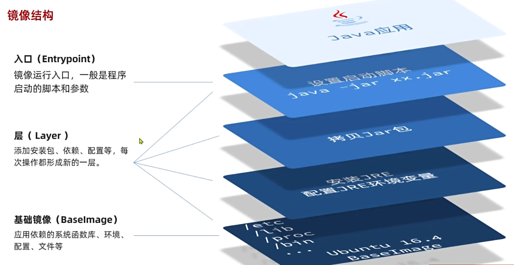
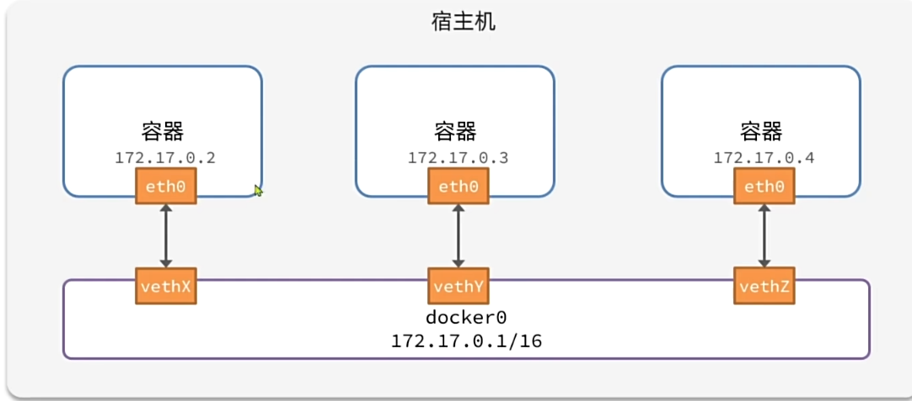

# 1. QUICKSTART

## 1.1 下载和启动docker

**下载**

1. 使用官方提供的脚本下载：

   `curl -fsSL https://get.docker.com | bash -s docker --mirror Aliyun`

2. 使用apt安装

   `apt install docker.io`

3. 使用snap安装

   `snap install docker`

**启动**

- 启动Docker：`systemctl start docker`
- 停止Docker：`systemctl stop docker`
- 重启Docker：`systemctl restart docker`

## 1.2 基本使用

利用Docker安装应用时，实际上是在下载别人配置好的**镜像image**。镜像中包含了应用以及应用运行所需要的全部环境。

运行应用（镜像）时，Docker会根据镜像创建一个隔离环境，称为**容器container**。运行的实际上是容器，这也意味着可以根据同一个镜像同时创建多个容器并运行。

### 1.2.1 加载docker镜像

**加载本地docker镜像**

加载别人打包好的.tar docker镜像

`docker load -i /path/to/dockerImage.tar`

加载好之后可以使用`docker images` 查看docker中已加载的镜像

**从镜像仓库拉取指定镜像**

`docker pull`

**删除镜像**

`docker rmi <image_id>`  通过镜像id指定删除镜像

`docker rmi -f $(docker images -q)` 强制删除所有镜像

### 1.2.2 运行docker容器

**创建并运行容器**

在docker images中找到想要运行的镜像的名称或ID

然后使用docker run命令 ，根据指定镜像创建一个容器并运行

```shell
docker run -d\ # -d表示后台运行
	--name containerName\ # 给创建的容器起名
	-p 1234:1234\ # 设置端口映射，映射到宿主机的端口:容器内要映射的端口
	-e KEY=VALUE\ # 设置环境变量，有些镜像运行时会要求传入环境变量
	imageName:version # 要运行的镜像的名称和版本，不指定版本默认时latest
```

如果本地没有指定名称和版本的镜像，会自动去镜像仓库中拉取

**运行已有容器**

对于创建好的容器，可以用`docker stop`命令停止运行，此时容器不会删除。

对于已经创建好的容器，可以用`docker start containerName`命令启动

**删除容器**

容器必须在停止运行的状态下才能被删除

`docker rm containername`

**查看已有容器信息**

查看所有运行中容器：`docker ps`

查看所有容器：`docker ps -a`

**进入容器内部**

 `docker exec -it imageName bash`

# 2. 常用命令

## 2.1 文件传输

### 2.1.1 数据卷挂载

数据卷volume是一个虚拟目录，是容器内目录与宿主机目录之间映射的桥梁。

需要先创建数据卷，再将数据卷和本地目录进行挂载

**数据卷相关命令**

- 创建数据卷：`docker  volume create volumeName`

  会创建在`/var/lib/docker/volumes/volumeName/_data`文件夹

- 查看所有数据卷：`docker volume ls`

- 删除数据卷：`docker volume rm volumeName`

- 查看数据卷详情：`docker volume inspect volumeName`

**挂载数据卷**

在创建容器时利用-v参数进行挂载

`docker run imageName -v 数据卷名:容器内目录`

### 2.1.2 本地挂载

本地挂载和数据卷挂载使用的命令相同

`docker run -d -v 本地目录:容器内目录`

 # 3. 自定义镜像

将java程序（jar包）封装到一个镜像中，需要以下步骤：

- 安装基础系统
- 安装JRE，配置JRE环境变量
- 拷贝jar包到docker镜像中
- 设置启动脚本

最终封装为一个java应用的镜像



docker实际上会把每一步都单独封装为一层，再将这些层组合起来成为一个完整的镜像。pull时也是分层pull，对于已有的层就不会再重复下载

这样的好处是，对于底层的镜像可以抽取为基础镜像，提高复用性。

## 3.1 dockerfile

Dockerfile文件用来指定每层镜像放什么，写好之后使用`docker build` 命令，docker就会自动执行这些指令构建镜像

# 4. 网络

默认情况下，所有容器都是以网桥（bridge）方式连接到Docker的一个虚拟网桥上



在同一个网关内的容器就可以很方便的进行网络通信

## 4.1 自定义网络

默认情况下镜像的ip地址都是Docker虚拟网桥自动分配，无法向指定docker容器发起通信。

此时就需要使用`docker network`自定义网络，加入自定义网络的容器之间可以通过镜像名称互相访问

- 创建网桥 docker network create

- 连接网桥 docker connect

# 5. DockerCompose

Docker Compose用于实现多个相互关联的Docker容器的一键部署，需要在官网进行下载安装。

通过一个docker-compose.yml模板文件来定义一组相关联的应用容器，一个yml文件对应一个project，然后就可以统一管理这些容器

## 5.1 模板文件

通过模板文件来定义一组相关联的应用容器，定义容器所需要的信息和使用`docker run`命令时相同，只是语法不太一样，也可以在定义时指定dockerfile，让docker compose直接构建容器并运行

```yaml
version: "1.0"

services: # 在这里面配置所有容器
  mysql:
    image: mysql # 镜像名
    container_name: mysql # 容器名
    ports: # 端口映射
      - "3306:3306"
    environments: # 镜像的环境变量
      MYSQL_ROOT_PASSWORD: 123
    volumes: # 数据卷挂载
      - "./mysql/conf:/etc/mysql/conf.d"
    networks: # 配置容器所属的网络
      - xx-net
  mycontainer:
    build: # 通过dockerfile直接构建容器
      context: .
      dockerfile: Dockerfile
    container_name:
      mycontainer
    ports:
    networks
    depends_on: # 指定依赖关系。这样创建容器时，就会先创建mysql容器再创建这个容器
      - mysql
  networks: # 声明自定义网络
    xx-net:
      name: xx
```

## 5.2 命令

`docker compose [OPTIONS] [COMMAND]`

**Options**

- -f：指定docker-compose.yaml配置文件的路径和名称

  默认是当前目录中寻找配置文件

- -p：指定project名称，就是给马上要运行起来的这一组关联容器起一个名字，默认是root

**Commands**

以下命令都是对docker-compose.yaml中定义的当前project中的关联容器使用

- up：创建和启动service中所有容器
- down：停止并移除所有容器和网络
- ps：列出所有启动的容器
- stop：停止指定容器
- start：启动指定容器
- restart：重启指定容器
- top：查看运行的进程