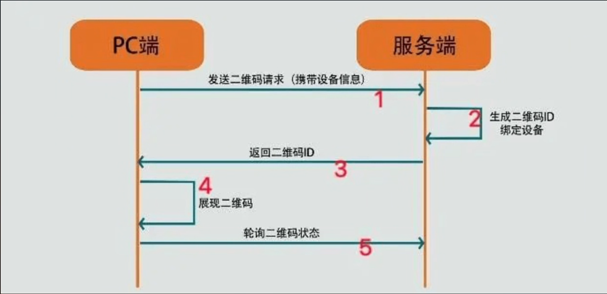
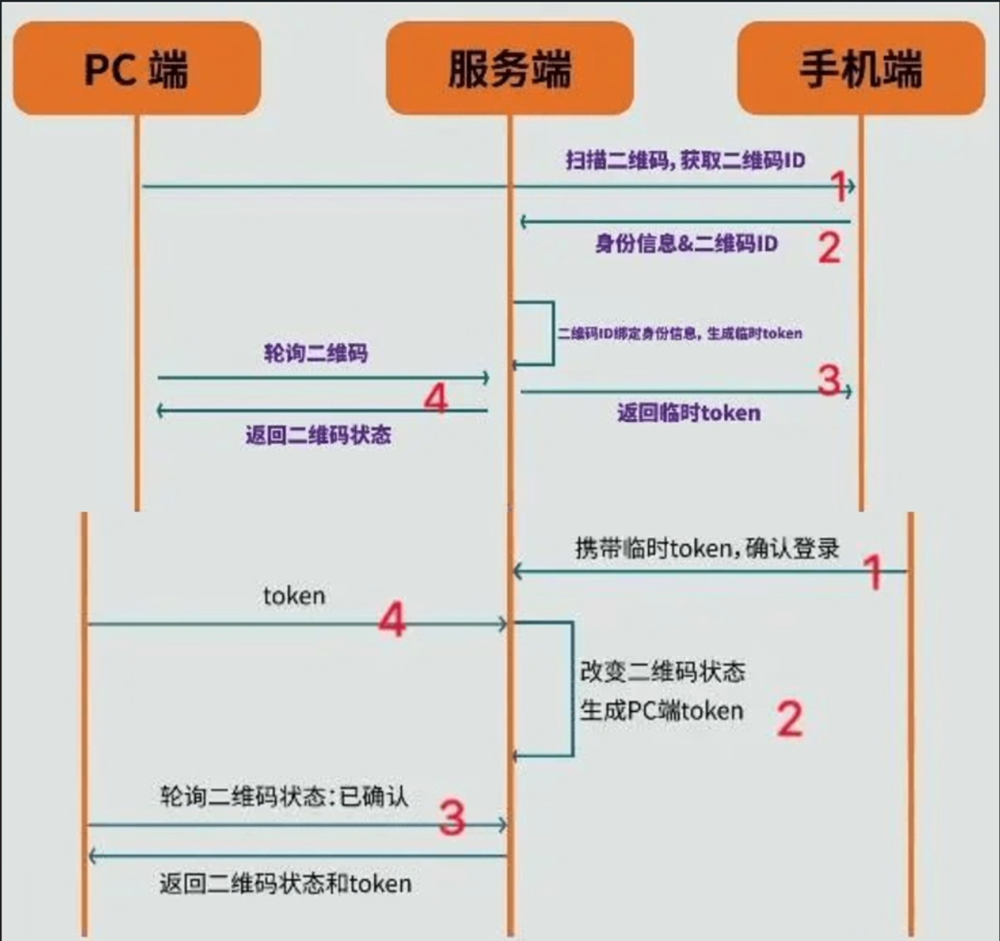

# 1. 二维码登录

通过已经登录的手机APP扫描web端二维码，实现扫码登录操作

原理就是，浏览器生成的二维码携带自己的客户端id，手机扫描二维码就可以得到这个id，然后向服务器发请求允许这个id对应的客户端登录。

## 1.1 客户端生成二维码

二维码可以理解为字符串的一种表现形式，即它可以存储信息，扫描二维码就可以得到这个信息

并且二维码的复杂度和存储的信息量有关

1. 浏览器向服务器端发起请求，请求生成用于用户登录的二维码

   这个请求中会携带浏览器对应的设备信息（用于表示想要登录的设备）

2. 服务端收到请求之后，生成二维码ID，并返回给客户端

   服务器端中会将二维码ID和浏览器设备信息进行绑定

3. 客户端根据收到二维码ID生成二维码并进行展示

4. 为了即时知道二维码状态（是否被扫描，是否确认登录），客户端会不断轮询服务器查询登录状态

   其实也可以使用WebSocket，这样的话响应会比较及时。但是从兼容性和复杂度考虑大部分方案还是会选择轮询

## 1.2 APP扫码登录

带登录确认功能

1. 手机APP扫描二维码，通过二维码内容获取到其中的二维码ID。然后将二维码ID和APP登录token发给服务器

2. 服务器接收到之后，将APP设备身份信息与二维码ID绑定，生成临时token，发给APP

   这一步是为了APP端的登录确认功能，如果无需登录确认，可以直接跳转到第四步，即直接生成浏览器端的登录token

   临时token是确保扫码和登录两步操作是同一部手机发出的

   此时二维码状态发生了改变，由于浏览器端一直在轮询，因此可以检测到这个变化，可以在界面上把二维码状态更新为已扫描

3. 手机端接收到临时token后弹出确认登录界面，用户点击确认后，APP携带临时token向服务器发送请求

4. 服务端收到确认之后，根据二维码ID绑定的浏览器信息和APP登录的账户信息，生成浏览器端登录的token

5. 此时浏览器端的轮询查询到二维码状态变为已确认，并且获取到用户登录的token

6. 登录成功，浏览器端可以拿获取的token进行登录认证

# 2. 高并发场景

