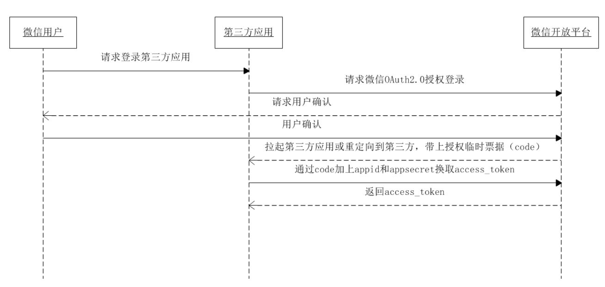

# 1. 常见业务场景

## 1.1 二维码登录

通过已经登录的手机APP扫描web端二维码，实现扫码登录操作

原理就是，浏览器生成的二维码携带自己的客户端id，手机扫描二维码就可以得到这个id，然后向服务器发请求允许这个id对应的客户端登录。

### 1.1.1 客户端生成二维码

二维码可以理解为字符串的一种表现形式，即它可以存储信息，扫描二维码就可以得到这个信息

并且二维码的复杂度和存储的信息量有关


1. 浏览器向服务器端发起请求，请求生成用于用户登录的二维码

   这个请求中会携带浏览器对应的设备信息（用于表示想要登录的设备）

2. 服务端收到请求之后，生成二维码ID，并返回给客户端

   服务器端中会将二维码ID和浏览器设备信息进行绑定

3. 客户端根据收到二维码ID生成二维码并进行展示

4. 为了即时知道二维码状态（是否被扫描，是否确认登录），客户端会不断轮询服务器查询登录状态

   其实也可以使用WebSocket，这样的话响应会比较及时。但是从兼容性和复杂度考虑大部分方案还是会选择轮询

### 1.1.2 APP扫码登录

带登录确认功能


1. 手机APP扫描二维码，通过二维码内容获取到其中的二维码ID。然后将二维码ID和APP登录token发给服务器

2. 服务器接收到之后，将APP设备身份信息与二维码ID绑定，生成临时token，发给APP

   这一步是为了APP端的登录确认功能，如果无需登录确认，可以直接跳转到第四步，即直接生成浏览器端的登录token

   临时token是确保扫码和登录两步操作是同一部手机发出的

   此时二维码状态发生了改变，由于浏览器端一直在轮询，因此可以检测到这个变化，可以在界面上把二维码状态更新为已扫描

3. 手机端接收到临时token后弹出确认登录界面，用户点击确认后，APP携带临时token向服务器发送请求

4. 服务端收到确认之后，根据二维码ID绑定的浏览器信息和APP登录的账户信息，生成浏览器端登录的token

5. 此时浏览器端的轮询查询到二维码状态变为已确认，并且获取到用户登录的token

6. 登录成功，浏览器端可以拿获取的token进行登录认证

### 1.1.3 微信扫码登录

微信扫码登录和APP直接扫码登录的区别就是，此时二维码不能直接由服务器生成，而是得从微信那里获取



1. 用户发起微信登录请求
2. 服务器端接收请求之后，携带自己从微信那里获取的App I D和AppSecret，以及自己的回调域名参数，请求微信OAuth2.0授权登录
3. 第二步请求通过之后，微信会返回服务器一个二维码，这个二维码中包含了对服务器端的标识，服务器将这个二维码返回给前端用户展示
4. 用户扫码授权之后，会直接将请求发到微信，微信验证成功之后携带临时code回调服务器的相关接口
5. 服务器端获得这个code后，再带上自己的AppID和AppSecret，以及这个code调用微信接口，获取用户的基本信息

## 1.2 APP推送通知

# 2. 限流器

限流器用于控制客户端发送流量的速率，即客户端在一定时间内被允许发送的请求数量，超出阈值的请求就会被拦截

限流器实现方案：

1. 在客户端实现

   但是由于客户端请求可以被伪造，因此不是一个可靠的强制限流实现位置

2. 在服务器端实现

3. 使用中间件实现

   在客户端和服务器端之间放一个限流中间件，比如在API网关中添加限流规则

限流算法主要分为两种，即桶算法和窗口算法

窗口算法实现简单，但是只要有时间窗口存在就会面临 临界突变问题。

桶算法时间略复杂，但是令牌桶可以应对突发流量，漏桶有队列可以缓冲并保证请求速度稳定。

## 2.1 令牌桶算法

Amazon和Stripe使用此算法对API请求进行限流


令牌桶算法使用令牌桶进行速率限制。这个算法存在一个令牌桶主机，每次请求时，会从该主机中的令牌桶中获取令牌，如果获取成功则接收请求，如果没有令牌可获取则拒绝请求。同时会有重新注入装置不断向令牌桶中注入令牌。

在该算法中有两个需要确定的参数，即令牌桶的容量和自动补充令牌的速度。

桶的数量和配置和需要限流的业务场景有关，比如限制一个用户一秒只能发100个请求，那么每个用户都会对应一个桶，这个桶容量是100，每秒补充再根据情况设置；如果基于IP进行流量限制，则每个IP需要一个桶；再比如限制服务器每秒接收流量，则需要一个全局令牌桶。实际实现中，一个桶可能就是一个整数计数器，因此该算法只需要占用很少的空间。

令牌桶最大的特点是允许很短时间内出现突发流量，只要令牌桶中还有令牌可用。

**优化算法**

如果按照原始算法，按照固定速率向桶中存放令牌，那就需要开一个单独的线程去定时向桶中添加令牌，并且每个桶都需要这样一个线程，这显然会浪费很多资源。

为了解决这个问题，可以记录当前时间下的下一个令牌应该生成的时间。当获取令牌时，用当前时间和当时记录的令牌生成时间对比，计算出这个期间应该生成多少个令牌，然后一次性完成令牌添加和扣减操作，直接更新库存，并更新下一个令牌应该生成的时间。

比如记录的下一个令牌生成时间是第2s，每秒生成2个令牌。当前获取令牌时间是第5.1s，就能算这期间应该生成6个令牌，并完成令牌库存更新，再更新下一次令牌生成时间是第6s。

### 2.1.1 Guava限流器

Guava提供的RateLimiter类通过优化的令牌桶算法实现了限流器


## 2.2 漏桶算法

Shopify公司使用漏桶算法


漏桶算法通常使用队列实现

当一个请求到达时，会先检查桶是否已满，如果满了则丢弃请求，如果没满则将该请求加入桶队列中。同时服务器会定期从桶队列中取出请求并进行处理，为新请求腾出空间。

漏桶算法的桶配置和令牌桶类似，也是根据场景分配桶的数量。

漏桶算法最大的特点是按照固定速率处理请求，所以很适合要求出栈速度稳定的场景。同时这也是它的缺点，假设同时两个请求进来，这两个请求也不能同时进行处理响应，而是需要先进入队列中先处理一个再处理另一个。

## 2.3 窗口算法

### 2.3.1 固定窗口计数器算法

很简单，就是如果每秒允许三个请求，就每秒启动一个计数器，把当前秒超过三个的请求都丢了

将时间轴分成固定大小的时间窗口，并给每个时间窗口分配一个计数器，在该时间窗口内每到达一个请求就把计数器值+1，如果计数器值到达上限则新请求就会丢弃，直到开始一个新的时间窗口


比如每秒最多通过三个请求，则在每个1秒的时间窗口中，超过三个的请求就会被丢弃

这个算法的主要问题是，如果时间窗口边界出现流量爆发，则实际请求数会超过阈值，即临界突变问题


比如每分钟允许5个请求，每分钟零秒时刷新计数器，那么如果上一分钟请求集中在后30s，下一分钟请求集中在前30s，则会存在在60s的时间有10个请求。

即如果我们将每分钟最大消息数设为10，我们就不希望在59秒时收到10条消息，又在1秒时收到10条消息

**代码实现**

比如要设计一个全局请求QPS限制为2的单机限流器

这里做了一些小优化，没有单独开一个线程去每秒重置计数器，而是在每次调用时，计算当前时间与上次更新计数器的时间间隔，如果大于时间窗口则进行重置。

```java
public class FixedWindowRateLimiter {
    
    private static Integer QPS = 2; // 阈值
    private static long TIME_WINDOWS = 1000; // 时间窗口（单位毫秒）
    private static REQ_COUNT = new AtomicInteger(); // 请求计数器
    private static long START_TIME = System.currentTimeMillis(); // 上次更新计数器的时间
    
    // 限流判断算法
    public synchronized static boolean tryAcquire() {
        // 计算上次更新计数器到现在的时间间隔
    	if ((Systen.currentTimeMillis() - START_TIME) > TIME_WINDOWS) {
            // 如果大于时间窗口，则重置计数器
            REQ_COUNT.set(0);
            START_TIME = System.currentTimeMillis();
        }
        // 将计数器+1，并判断是否超过阈值
        return REQ_COUNT.incrementAndGet() <= QPS;
	}
}
```

### 2.3.2 滑动窗口日志算法

这个算法是ClassDojo公司在完善推送通知时提出的速率限制算法，他们采用Redis的zset排序集合实现这个算法。他们的主要需求是避免临界突变问题，以及确保相邻消息之间有一定的最小距离。避免用户被通知过度打扰。

1. 在滑动窗口日志算法中，每个流量限制的单位（比如在对每个用户一秒发起的请求数进行限制的场景下是一个用户）对应一个日志

   在实际实现中日志可以是一个zset，其中key和value都是当前请求的时间戳。限制规则比如是一个用户每秒只能发起3次请求

2. 当用户发起请求时，首先将日志中一秒钟之前的请求条目删除，然后将当前请求对应的时间戳添加到日志中

3. 添加之后统计当前日志中的元素数量，如果超过限制就不允许该请求通过

   在本例中就是zset中元素大于3就不通过该请求

4. 为了保证相邻消息之间的最小距离，还可以将日志中的最大元素与当前时间戳比较，如果太接近，就拒绝此次请求。

需要注意的是即使请求不通过，这条请求也会保留在日志中。这就会导致如果用户持续发大量请求，那可能所有请求都不会被通过，而不是偶尔允许某些请求通过，因为没通过的请求也会占据日志中的一个位置。

### 2.3.3 滑动窗口计数器算法

滑动窗口计数器算法的核心是，将固定的时间窗口划分为多个小窗口。每次请求到来时，将已过期的窗口重置，之后统计所有窗口中的请求算出总请求数，判断是否到达阈值。


比如上面的示意图中，将1秒时间窗口划分为2个500ms小窗口，QPS为2。这样就不会出现第一秒后500ms通过两个请求，第二秒前500ms又通过两个请求的临界突变问题。

**代码实现**

算法思路：

1. 首先计算当前时间对应的时间窗口

   用当前时间戳取余总时间窗口，再除以子窗口大小

   比如取余完之后是756ms，则再除以子窗口大小100，算出该请求时间应该对应下标为7的子窗口

2. 遍历所有子窗口，在遍历过程中：

   重置所有过期子窗口（即子窗口开始时间与当前时间相差超过1s（窗口总大小）的子窗口）

   给当前请求对应的子窗口的计数器+1

   统计没过期的子窗口的请求数，算出总请求数

3. 判断时间窗口中的请求数是否超过阈值

```java
class SubWindow { // 子窗口
    private Long START_TIME; // 子窗口的开始时间
    private AtomicInteger REQ_COUNT; // 计数器，统计该子窗口内的请求 
}

public class SlidingWindowRateLimiter {
    private static QPS = 2; // 阈值，每秒最多允许两个请求通过
    private static TIME_WINDOW = 1000; // 总时间窗口大小，1000ms
    private static Integer WINDOW_COUNT = 10; // 分为多少个子窗口
    private SubWindow[] windowArray = new SubWindow[WINDOW_COUNT]; // 实际的窗口列表
    
    public static synchronized boolean tryAcquire() {
        long currentTimeMillis = System.currentTimeMillis(); // 当前时间戳
        // 计算当前请求时间对应的子窗口
        int currentIndex = (int)((currentTimeMills % TIME_WINDOW) / (TIME_WINDOW / WINDOW_COUNT));
        int sum = 0; // 统计总请求数
        // 遍历所有子窗口
        for (int i = 0; i < windowArray.length; i++) {
            SubWindow subWindow = windowArray[i];
			// 如果发现子窗口已过期，就重置子窗口            
            if ((currentTimeMillis - subWindow.START_TIME) > TIME_WINDOW) {
                subWindow.REQ_COUNT.set(0);
                subWindow.START_TIME = currentTimeMillis;
            }
            // 给当前请求对应的子窗口计数器+1
            if (currentIndex == i && subWindow.REQ_COUNT < QPS) {
                subWindow.REQ_COUNT.incrementAndGet();
            }
            sum += subWindow.REQ_COUNT;
        }
        // 判断时间窗口中的请求数是否超过阈值
        return sum <= QPS;
    }
}
```

# 3. 一致性哈希

在数据分片的数据库分布式场景中，为了提高数据库容量，会将数据水平切分到不同节点存储，也就是让每个节点保存不同的数据。

这就会遇到一个问题，比如一个分布式KV（key-value）缓存系统，某个key存储到某个节点之后，下次再查询这个key时还应该从这个节点去获取数据。因此需要一个负载均衡算法保证对于同一个key每次分配到的节点都是相同的。

哈希算法可以解决这个问题，因为对同一个关键字进行哈希运算得到的结果是相同的，这样就可以将某个key通过哈希再取余确定到一个固定节点上。

但是简单哈希取余的操作最大的问题就是当集群中的节点数改变时，大部分key和节点之间的映射关系都需要改变，此时就需要计算新的映射关系并进行数据迁移，这种数据迁移的成本会非常高。

## 3.1 一致性哈希算法

一致性哈希算法就是为了解决分布式系统扩容或缩容时发生过多数据迁移的问题。

算法首先计算key的hash值，然后对2^32进行取模运算，将取模结果0~2^32-1想象成一个圆，这个圆就是哈希环


一致性哈希算法会进行两步哈希

1. 对存储节点进行哈希运算并取余，把节点映射到哈希环上

   比如有三个节点，如图上节点A、B、C的位置

2. 当需要对数据进行存储或访问时，对数据进行哈希映射

   比如图中的key1，经过哈希映射后确定在环中的位置。

   然后从这个位置沿顺时针方向走，遇到的第一个节点A就是存储key 的节点

**增加节点**


先给新增加的节点进行哈希映射，映射到图中D的位置

此时可以看出，只有节点A到节点D之间的数据，需要从节点B迁移到节点D中，其他的数据可以保持不变

**删除节点**


在删除节点的情况下，只会影响该节点在哈希环上顺时针相邻的后继节点，即需要把原来存储在删除节点上的数据迁移到后继节点上，其他数据不会受影响。

## 3.2 虚拟节点

上面的一致性哈希算法存在一个很严重的问题，就是不保证节点在哈希环上分布均匀，这样就会导致有大量请求几种在一个节点上。并且容易发生雪崩式的链式反应，比如节点A崩溃后，A上的所有数据都会迁移到B上，造成的访问量激增可能会导致B也崩溃。

要解决这种分配不均匀的问题也很简单，节点数越多，分布的就会更均匀。但是实际中没有那么多节点，此时就可以引入虚拟节点。将虚拟节点映射到哈希环上，并将虚拟节点映射到实际节点上，用两层映射关系。


引入虚拟节点的好处：

1. 节点在哈希环上的分布更加均匀，每个节点的负载也就更均衡

2. 由于虚拟节点之间是交叉的，因此当节点变化时，会有不同的实际节点共同分担

   比如某个节点被移除时，对应的多个虚拟节点都会被移除。此时数据会按照顺时针方向进行迁移，顺时针方向的下一个节点可能对应不同的真实节点，这样就分担了节点变化的压力。

3. 方便根据硬件性能分配不同的负载

   只需要给硬件配置好的节点映射多个虚拟节点就可以了

## 3.3 与散列插槽相比

散列插槽：将key做CRC16计算，对16384(2^14)取余直接映射到对应的slot槽上，再根据槽和实际服务器映射关系找到对应数据

一致性哈希：将key做hash运算，对2^32取余，映射到哈希环上，顺时针往下找到第一个节点，去对应节点找到对应数据

我认为二者最大的区别就是散列插槽直接将数据与槽之间进行了映射，就是数据是属于槽的；但是一致性哈希没有这种直接的映射关系，数据和节点都需要映射到哈希环上。

这种直接的映射关系会简化下面三个操作：

1. 迁移更方便

   数据迁移时，散列插槽可以直接迁移整个slot，更方便。

   而一致性哈希还需要在哈希环上找到需要迁移的数据，再进行迁移

2. 分配更灵活

   可以直接给性能好的节点多分配一些slot

3. 映射更清晰

   散列插槽可以通过映射表方便地组织slot和服务器的映射关系，而不需要经过哈希环

所以散列插槽的优点就是操作更简单，缺点是可能需要迁移的数据比一致性哈希要多


