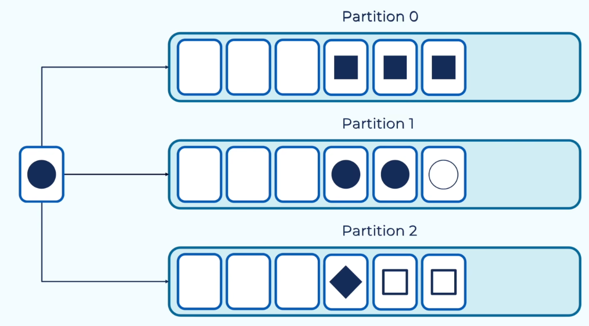
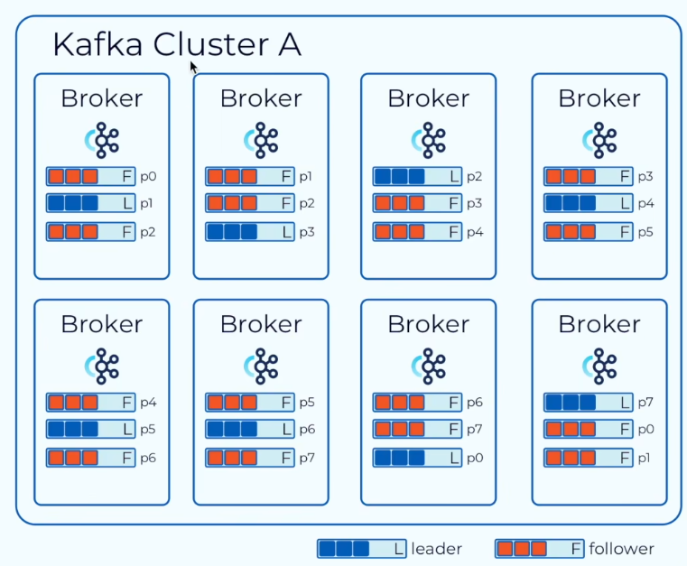
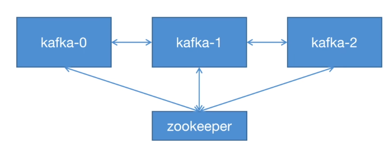
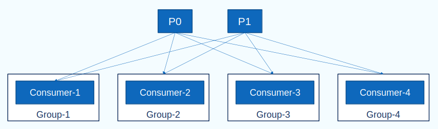
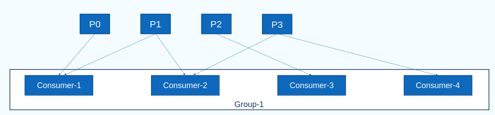
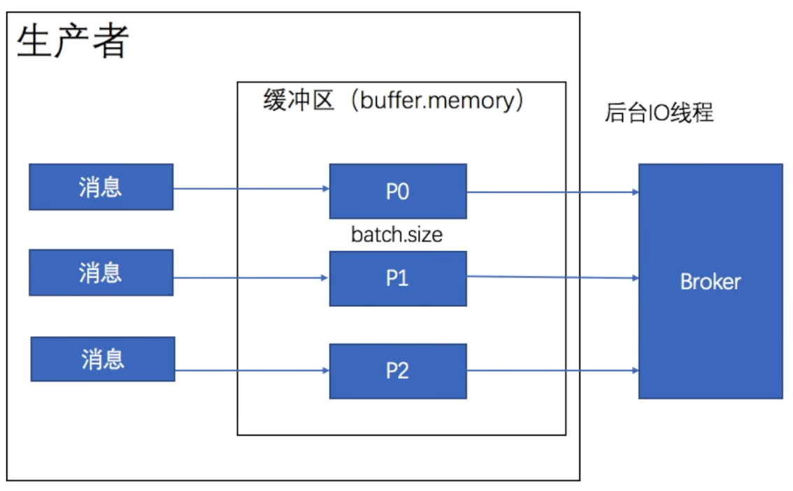

# 1. QuickStart

Kafka不只是一个消息队列，它的核心功能如下：

- 消息引擎 ── 作为消息队列使用
- 流处理
- 存储 ── 作为安全的分布式存储

## 1.1 基本概念

**Topic主题**：Kafka中的消息存在Topic主题中，主题就类似于数据库的表，相同类型的消息会存在同一个主题中。但是Kafka中的主题是半结构化的，因此不同类型的消息也可以存到同一个主题中。

**Partition分区**：主题被拆分为多个分区，不同的分区可以存在不同的服务器上，这样就可以很方便的进行扩展

分区本身是一个有序的、不可变的消息序列。

**offsets**

- 有序是指Kafka会为加入其中的每条消息分配一个消息偏移量Offset，用于表示消息在分区中的位置信息，可以通过偏移量对消息进行提取。消息会以追加的方式写入分区，在同一个分区中的偏移量不能重复，因此消息分配到的消息偏移量是递增的值。
- 不可变是指消息加入到分区之后内容就不能被改变了。

**_consumer_offsets**

kafka中有一个主题_consumer_offsets，专门用于保存每个消费者消费到了哪个主题、哪个分区的哪个位置（即消费到的偏移量），这样当某个消费者重启时利于快速恢复，继续上次的位置消费。

消费者拿到消息之后，就会将自己的消费位置提交到_consumer_offsets

**Record消息**：消息以key-value键值对的形式存储在分区中。

如果不指定消息的key，则key值为空，此时消息会以轮询的方式加入到不同分区中；如果指定了消息的key，则相同key的消息会被写入到同一个分区，由于分区中的数据是追加方式写入，因此这样就可以保证相同key的数据按照一定的顺序被消费。



**Broker**：Kafka集群中的一台独立的服务器就称为一个Broker（通常一台服务器启动一个Kafka实例）。

Broker会接受来自生产者的消息，并存入磁盘中；接受来自消费者的请求，并返回对应的消息。

**Replica副本**：为了保障数据的安全，Kafka会为每个分区都创建副本，可以通过replication-factor设置分区副本的数量，比如设置为3，则该分区一共存三份。

其中一个副本会作为主分区，称为leader，其他两个副本称为follower。数据的写入和读取都只由leader负责，即只向leader中写入和读取数据。follower只从leader中复制数据，保持数据的一致。

这些副本中会被保存到不同的Broker中，如下图中，Kafka集群由八个Broker组成，共八个分区，分区副本数量为3



## 1.2 基本使用

**下载Kafka**

直接搜索Kafka下载Binary版本，目前最新版是kafka_2.12-3.9.0.tgz，其中2.1.2是scala版本，3.9.0是Kafka版本，Kafka只能在Linux下运行。

解压后有几个文件夹：

- bin：存放执行Kafka功能的脚本

  不加任何参数直接执行这些脚本会显示使用帮助

  比如

  kafka-server-start.sh用于启动kafka的Broker实例

  kafka-topic.sh用于创建一个topic

- config：Kafka启动实例时用到的配置文件

**启动Kafka服务端实例**



进入到kafka根目录

1. 启动zookeeper

   Kafka是基于zookeeper运行的，因此需要先启动zookeeper

   使用bin中的脚本和config中的配置文件启动zookeeper

   `bin/zookeeper-server-start.sh config/zookeeper.properties`

2. 复制并修改kafka实例的配置文件

   这里用一台机器启动三个broker实例来模拟kafka集群

   启动Broker实例需要用到config中的server.properties配置文件，创建一个etc目录，将配置文件复制到该目录中并命名为server-0/1/2.properties

   在配置文件中需要修改以下几项

   - broker.i0：当前Broker的id，要求不能重复
   - listeners=PLAINTEXT://:9092：当前Broker监听端口，默认是9092
   - log.dirs=/tmp/kafka-logs：Broker实例日志保存位置
   - zookeeper.connect=localhost:2181：连接的ZooKeeper，连接到同一个ZooKeeper的Broker才会组成一个集群

3. 启动Kafka集群

   使用bin中kafka-server-start.sh脚本启动Broker实例

   `bin/kafka-server-start.sh etc/server-0.properties`

**创建topic**

topic用于保存kafka的消息，类似于数据库中的表

需要用到bin中的kafka-topics.sh脚本创建topic

```shell
bin/kafka-topics.sh --create /
	--bootstrap-server localhost:9092/ # 要创建的kafka Broker服务器地址
	--topic test/ # topic名称
	--partition 3/ # 该topic分区数
	--replication-factor 2/ # 每个分区的副本数量
```

创建完成之后，可以使用kafka-topic.sh脚本来查看topic信息

```shell
$ bin/kafka-topics.sh --describe --bootstrap-server localhost:9092 --topic test

Topic: test	TopicId: 3FsCR3XJSUmiXzmJlkC2HQ	PartitionCount: 3	ReplicationFactor: 2	Configs: 
	Topic: test	Partition: 0	Leader: 2	Replicas: 2,1	Isr: 2,1	Elr: N/A	LastKnownElr: N/A
	Topic: test	Partition: 1	Leader: 1	Replicas: 1,0	Isr: 1,0	Elr: N/A	LastKnownElr: N/A
	Topic: test	Partition: 2	Leader: 0	Replicas: 0,2	Isr: 0,2	Elr: N/A	LastKnownElr: N/A

```

第一行显示了Topic基本信息，PartitionCount表示有三个分区，ReplicationFactor表示每个分区有两个副本

下面是三个分区的信息

- Partition:0 表示这是0号分区
- Leader：2表示该分区leader节点在id为2的服务器
- Replicas展示了该分区所有副本列表所在的Broker id
- Isr是当前与Leader保持同步的副本列表所在的Broker id。

**Kafka客户端实例**

- 发送消息

```shell
bin/kafka-console-producer.sh/
	--topic test/
	--bootstrap-server localhost:9092,localhost:9093,localhost:9094
>
```

启动生产者之后会有>光标，在光标后输入信息即可发送，默认一行会作为一个独立的Event写入Topic

- 监听消息

```shell
bin/kafka-console-consumer.sh/
	--topic test
	--from-beginning
	--bootstrap-server localhost:9092,localhost:9093,localhost:9094
```

--from-beginning参数会让该消费者从topic起点开始消费所有消息，不加的话消费者只会从创建的时刻开始监听并消费后面的消息，而不会管前面的消息

## 1.3 消息模型

对于消息的消费来说，消息会存在分区中，消费者会在消费者组中

一个分区中的消息可以被不同消费者组中的消费者重复消费，但是不能被同一个消费者组中的消费者重复消费。一个消费者可以消费多个分区。

消费者会按照消息在分区里的存放顺序进行消费，但是只能保证分区内的消息的消费顺序，不能保证不同分区间消息的消费顺序。

**发布-订阅模式（一对多）**

由于消息不能被同一个消费者组中的消费者消费，因此要实现发布-订阅，就需要给每个消费者分配单独的消费者组



**点对点（一对一）**

让所有消费者都在同一个消费者组中，即可保证每条消息只被消费一次



# 2.  Java客户端

使用Java作为生产者和消费者时需要下面的依赖

```xml
<dependency>
	<groupId>org.apache.kafka</groupId>
	<artifactId>kafka-clients</artifactId>
	<version>3.9.0</version>
</dependency>
```

## 2.1 生产者

### 2.1.1 消息发送

1. 创建配置对象
2. 根据配置对象创建生产者对象
3. 创建消息对象
4. 调用send方法发送消息

```java
Properties props = new Properties();
props.put("bootstrap.servers", "localhost:9092");
props.put("key.serializer", "org.apache.kafka.common.serialization.StringSerializer");
props.put("value.serializer", "org.apache.kafka.common.serialization.StringSerializer");

Producer<String, String> producer = new KafkaProducer<>();
// 消息对象参数列表：topic名，分区序号（可选），消息的key（可选），消息value
ProducerRecord<String, String> record = new ProducerRecord("test", "hello");
producer.send(record);
producer.close(); // 关闭链接
```

- 异步发送

send方法是异步发送，也就是说生产者调用send方法发送消息之后，会先把消息放入缓冲区中（每个分区对应一个缓冲区），然后直接返回，由另一个IO线程负责把缓冲区的消息再放入Broker中

这个缓冲区是生产者客户端自己维护的，可以通过buffer.memory参数配置



- 同步发送

如果想要改为同步发送，即发送消息之后阻塞等待消息发送结果（结果和ack的配置有关，比如ack=0则消息发送到缓冲区就返回了），就需要用到send方法的返回值。send方法的返回值是Future类型，可以通过调用get方法阻塞等待

```java
Future<RecordMetadata> result = ProducerRecord<String, String> record = new ProducerRecord("test", "hello");
result.get();
```

- 回调函数

同时send方法还可以指定回调函数，这种方式依然是异步发送，但是在发送消息返回结果（结果和ack的配置有关）之后会调用回调函数。回调函数需要实现kafka提供的Callback接口

```java
class ProducerCallback implements Callback {
    @Override
    public void onCompletion(RecordMetadata recordMetadata, Exception e) {
        if (e != null) {
            e.printStackTrace();
        }
    }
}

producer.send(record, new ProducerCallback());
```

**批量发送**

可以通过修改producer对象的配置来实现批量发送的功能

```java
properties.put(ProducerConfig."batch.size", 16384); // 每一批消息最大大小
properties.put(ProducerConfig."linger.ms", 1000); // 发送消息延迟时间
```

通过配置这两项，可以让生产者每次到达延迟时间或者消息大小到达一批消息的最大大小之后才会合成一个请求一起发送，而不会调用send之后立即发送

### 2.1.2 消息确认

```java
properties.put("acks", "all");
properties.put("retries", 0);
```

acks配置消息发送成功的条件

- 0：表示当消息被放到缓冲区时，就认为发送成功，直接返回发送结果，不会等待Broker响应

  消息比较容易丢失

- 1（默认）：表示当消息被发送到leader时，才认为发送成功，返回发送结果

  消息可能丢失，比如消息刚发到leader，leader就出现故障下线

- all/-1（常用）：表示当消息发送到leader，并且被follower同步之后，才认为发送成功，返回发送结果

retries：消息发送失败后的重试次数

## 2.2 消费者

### 2.2.1 消费消息

1. 创建配置对象

2. 根据配置对象创建消费者

3. 调用subscribe()订阅topic

   参数是该消费者要订阅的topic组成的集合

   当调用subscribe()之后，消费者才会向KafkaBroker发送请求，尝试加入指定的消费者组，如果没有指定消费者组则会自动创建

4. 调用poll()轮询等到消息

   poll在有可用Record之后会立即返回

```java
Properties props = new Properties();
// bootstrap.servers是Kafka集群的IP地址。多个时,使用逗号隔开
props.put("bootstrap.servers", "localhost:9092");
// 指定消费者要加入的消费者组
props.put("group.id", "test");
props.put("enable.auto.commit", "true");
props.put("auto.commit.interval.ms", "1000");
props.put("key.deserializer",
          "org.apache.kafka.common.serialization.StringDeserializer");
props.put("value.deserializer",
          "org.apache.kafka.common.serialization.StringDeserializer");
KafkaConsumer<String, String> consumer = new KafkaConsumer
    <String, String>(props);

consumer.subscribe(Arrays.asList(topics));
// 等待并消费消息
while (true) {
    ConsumerRecords<String, String> records = consumer.poll(Duration.ofMillis(1000)); // 参数为最长阻塞时间
    if (!records.isEmpty()) {
        // 遍历消息并处理
        for (ConsumerRecord<String, String> record : records) {
            
        }
    }
}
```

本次consumer对象设置了自动提交，即收到消息之后，不管有没有成功消费，都会在指定时间间隔之后自动向Broker提交自己接收消息之后新的offset

### 2.2.2 手动提交

如果要保证消息被成功消费之后再提交自己的offset，则需要关闭自动提交并在完成消息消费之后调用方法手动提交

```java
props.put("enable.auto.commit", "false"); // 关闭自动提交
```

```java
consumer.commitSync(); // 手动提交，同步当前consumer的最新offset给Broker
```

