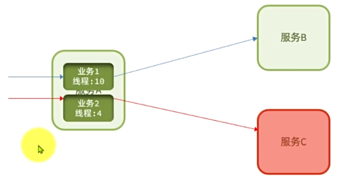

# 1. 微服务介绍

将整个项目打成一个jar包，使用同一个Tomcat服务器就是单体项目

微服务架构是在服务化思想下的一套最佳实践架构方案。服务化就是把单体架构中的功能模块拆分为多个独立项目。

每个独立项目分别打成jar包，运行在自己独有的Tomcat服务器，有自己专属的数据库。独立项目之间通过网络进行通信

Spring Cloud是目前使用最广泛的微服务架构，它相当于是对其他微服务技术组件的集成，并基于Spring Boot实现了这些组件的自动装配

## 1.1 服务拆分

拆分应该做到高内聚，低耦合，即每个微服务包含的业务相互关联度要高，每个微服务之间功能要相对独立

从拆分方式来说，包含两种方式：纵向拆分，按照业务模块拆分；横向拆分，抽取公共服务，提高复用性

微服务的工程结构有两种：独立Project（每个微服务都独立创建一个Java Project） 和 独立Module（使用maven聚合，每个微服务都在同一个Project下创建一个Module）

# 2. 远程调用

微服务之间可能需要互相请求数据，此时需要用网络请求别的微服务的数据

## 2.1 使用HTTP

**使用Http进行远程调用**

可以模拟前端对后端的请求方式用Http进行请求，Spring提供了一个RestTemplate工具来实现Http请求的发送。

但是使用Http请求需要在代码中写死请求地址，这会带来很多问题

- 提前不知道部署之后其他微服务的地址和端口号
- 被请求的微服务可能会启动多个实例做负载均衡，写死之后就只能访问一个
- 被请求的微服务挂掉之后就无法请求

此时就需要进行服务治理

### 2.1.1 服务治理

使用注册中心来进行服务治理，注册中心本身也是一个独立微服务


所有微服务都既是服务提供者也是服务调用者

微服务在注册时都会在注册中心中注册服务信息，当需要调用其他服务时会先向注册中心订阅，再向服务提供者发送请求。

目前较常使用的注册中心组件是Nacos，它是阿里巴巴的产品，并已经加入Spring Cloud Alibaba中

 ### 2.1.2 Nacos注册中心

**搭建Nacos注册中心**

下载Nacos的docker镜像并启动即可

**服务注册**

在微服务启动时，需要向注册中心注册自己作为服务提供者的信息

在要启动的微服务中做如下配置：

1. 引入nacos discovery依赖

2. 在yaml配置文件中配置Nacos地址

   ```yaml
   spring:
     application:
       name:  service-name # 微服务名称，注册到nacos后也会用这个名称
     cloud:
       nacos:
         server-addr: ip:port # Nacos注册中心地址
   ```

之后微服务启动时就会自动向注册中心进行注册

**服务发现**

当微服务需要调用其他服务时，就需要向注册中心订阅能提供对应服务的服务提供者信息

1. 引入nacos discovery依赖

2. 配置nacos地址

3. 服务发现

   ```java
   @Autowired
   private DiscoveryClient discoveryClient; // spring cloud为服务发现提供的接口
   
   // 调用其他服务
   private void callOtherService() {
       // 1. 根据服务名称拉取服务提供者的实例列表
       List<ServiceInstance> instances = discoveryClient.getInstances("need-service");
       // 2. 挑选一个实例（涉及到负载均衡策略,这里用随机选取）
       ServiceInstance instance = instances.get(RandomUtil.randomInt(instances.size());
       // 3. 获取实例的IP和端口
       URI uri = instance.getUri();
   	// 4. 向实例发送请求
       ......                       
   }
   ```

### 2.1.3 OpenFeign

OpenFeign是一个声明式的http客户端，作用是基于注解简化http请求发送

## 2.2 使用RPC

# 3. 网关

网关，就是网络的关口。负责对前端发来的请求进行身份校验、路由和转发，相当于对后端所有微服务的一个统一管理的大门。网关也是一个独立的微服务


现在常用的网关组件有Spring Cloud Gateway

## 3.1 网关路由

网关路由会自动从注册中心中拉取所有微服务。配置网关路由的核心是配置不同请求需要转发到哪个微服务

路由规则在yaml配置文件中进行配置，配置项对应的Java对象为RouteDefinition

```yaml
spring:
  cloud:
    gateway:
      routes:
        - id: item # 自定义id，用来唯一标识一个路由规则
          uri: lb://item-service # 该路由规则要转发到的目标微服务，lb表示负载均衡
          predicates: # 路由断言，如果请求符合该断言则进行路由
            - Path=/items/**,/search/** # 以请求路径做判断，请求路径以/items或以/search开头则符合规则
          filters: # 对符合断言的请求或相应做特殊处理
```

**路由断言**

路由断言中可以对根据多种规则对请求进行匹配

**路由过滤器**

通过路由过滤器，可以对请求或相应进行特殊处理，比如：

- 给请求添加一个请求头
- 移除请求中的一个请求头
- 给响应结果中添加一个响应头
- 从响应结果中移除一个响应头
- 请求路径重写
- 去除请求路径中的N段前缀（每个 / 作为一段）

**网关执行流程**

配置完网关路由之后，请求经过网关的流程如下


- HandlerMapping - RoutePredicateHandlerMapping（HandlerMapping的默认实现）

  路由映射器，负责进行路由映射，根据请求找到匹配的路由，然后把请求交给WebHandler处理

- WebHandler - FilteringWebHandler（默认实现）

  过滤器处理器，会加载网关中配置的所有过滤器，放入集合中并排序，形成过滤器链，然后依次执行这些过滤器

  其中最后一定会有一个NettyRoutingFilter过滤器，负责将请求转发到微服务，并接受微服务返回的结果

过滤器在请求到来和响应返回时都会被经过

## 3.2 网关登录校验

根据上面的网关执行流程，网关登录校验应该放在一个过滤器中，并且这个过滤器应该在NettyRoutingFilter之前，保证在请求转发之前需要先经过登录校验。

登录校验成功之后，将用户信息保存到HTTP请求头中，再向对应的微服务发送请求

网关过滤器有两种：

- GatewayFilter路由过滤器

  路由过滤器默认不生效，需要像上面那样在配置文件中配置后才会生效

- GlobalFilter全局过滤器

  作用范围是所有路由，声明后自动生效

  ```java
  public interface GlobalFilter {
      Mono<Void> filter(ServerWebExchange exchange, GatewayFilterChain chain);
  }
  ```

  第一个参数是请求上下文，包含整个过滤器链内的共享数据，比如request、response以及其他过滤器存入的数据

  第二个参数是过滤器链，即当前过滤器执行完成后要调用的下一个过滤器

**自定义全局过滤器GlobalFilter**

自定义全局过滤器时，为了保证该过滤器在NettyRoutingFilter之前执行，需要实现Ordered接口，并重写getOrder方法确定执行顺序。order值越大越先执行

```java
@Component
public class MyGlobalFilter implements GlobalFilter, Ordered {
    @Override
    Mono<Void> filter(ServerWebExchange exchange, GatewayFilterChain chain) {
        // 获取jwt
        ServerHttpRequest request = exchange.getRequest();
        HttpHeaders headers = request.getHeaders();
        String token = headers.get("authorization").get(0);
        // 做登录校验
        ...
       	// 如果校验失败则直接拦截请求
        if (false) {
            ServerHttpResponse response = exchange.getResponse();
            response.setStatusCode(HttpStatus.UNAUTHORIZED);
            return response.setComplete();
        }
        // 如果校验成功则将用户信息加入请求头中
        String userInfo = userId.toString(;
        ServerWebExchange newExchange = exchange.mutate().
        								request(builder -> builder.header("user-info", userInfo)).build();
        // 继续执行下一个过滤器
        return chain.filter(newExchange);
    }
    
    @Override
    public int getOrder() {
        return 0;
    }
}
```

**自定义路由过滤器GatewayFilter**

# 4. 配置

使用单独的配置管理微服务组件来完成网关配置和微服务配置。

配置管理服务可以实现配置热更新，即配置更新之后无需重启服务即可应用。

nacos除了作为注册中心之外，也可以作为配置管理服务

## 4.1 配置共享

将一些微服务都会用到的配置添加到Nacos中，避免重复配置

1. 在Nacos控制后台中创建要共享的配置

在微服务中拉取共享配置

1. 引入依赖

   spring-cloud-starter-alibaba-nacos-config

   spring-cloud-starter-bootstrap

2. 定义bootstrap.yaml配置文件

   引入共享配置之后，SpringCloud启动时会先拉取Nacos配置，再加载application.yml配置。所以需要将Nacos地址配置到一个新的配置文件bootstrap.yml中

   

   ```yaml
   spring:
     application:
       name: xx-service
     profiles:
       active: dev
     cloud:
       nacos:
         server-addr: 
         config: # 配置要加载的共享配置文件
           file-extension: yaml # 加载的共享配置文件的后缀
           shared-configs: # 在这里通过dataId指定要加载的共享配置名称
             - dataId: shared-xx.yaml
   ```

3. 自定义application.yaml文件

   在这里配置微服务独有的配置 和 共享配置中用到的变量

## 4.2 配置热更新

修改配置文件中配置时，微服务无需重启即可直接生效

1. 在nacos中创建一个微服务对应的配置文件

   文件名为：`[spring.application.name-spring.active.profile].[file-extension]`

   其中前半部分是该配置文件要控制的微服务名（必选）- 微服务选用的配置环境（dev/local，可选），后半部分是配置文件后缀（yaml）

   ```yaml
   a:
     b:
       c: 10
   ```

2. 在微服务代码中读取配置属性

   ```java
   @Data
   @Component
   @ConfigurationProperties(prefix = "a.b")
   public class TestProperties {
       private int c;
   }
   ```

   这样在nacos的配置文件中修改c的值时，就会热更新到微服务的代码中

## 4.3 动态路由

动态配置路由信息

将路由信息配置在Nacos配置中心中，然后在网关微服务中监听路由配置文件的变化，发生改变就去更新路由表

1. 在Nacos配置中心中创建路由信息配置文件

   由于要自己解析，所以推荐使用json格式

2. 在网关微服务中监听路由配置文件

   使用ConfigService对象的AddListener方法监听配置文件的改变

3. 更新路由表

   解析配置文件，并利用RouteDefinitionWriter删除旧路由表，并写入新路由表

# 5. 服务保护

微服务运行中可能会出现很多问题，比如雪崩，即调用链路中的某个服务故障，引起整个链路中的所有微服务都不可用

为了防止雪崩问题，有以下解决思路：

- 服务提供者方面：

  让提供服务的微服务尽可能不发生故障

  比如请求限流

- 服务调用者方面：

  在某个微服务发生故障之后，让调用该服务的调用者都停止调用该微服务

  比如线程隔离和服务熔断

常用的服务保护组件有Sentinel，它集成在Spring Cloud Alibaba中

## 5.0 Sentinel

Sentinel可以直接通过可视化控制台配置服务保护规则

**安装和整合**

1. 下载Sentinel jar包并运行

2. 在微服务中引入sentinel依赖

3. 在微服务中配置Sentinel控制台

   ```yaml
   spring:
     cloud:
       sentinel:
         transport:
           dashboard:  localhost:8090 # 启动Sentinel时设置的端口号
         http-method-specify: true # 开启请求方式前缀
   ```

在浏览器中打开Sentinel对应的链接即可进行监控和配置

**簇点链路**

簇点链路是单机调用链路。是指一次请求进入服务后经过的所有资源链。

默认情况下Sentinel会监控Endpoint，即http接口，即Controller中定义的函数 = 不同的访问路径 = 一个资源

资源名默认是接口的访问路径，但是在RESTFUL风格下同个Controller中多个请求路径相同，因此需要在配置中打开请求方式前缀将请求方式也拼接在资源名中来进行区分

## 5.1 请求限流

使用限流器限制访问微服务的请求并发量，避免服务因流量激增出现故障


被限制访问的请求会返回429错误码

**Sentinel配置**

在对应资源添加流控规则，阈值类型为QPS

## 5.2 线程隔离

线程隔离也叫舱壁模式，模拟船舱隔板的防水原理，在船舱之间加多个隔板，这样即时某个船舱进水也不会蔓延到所有船舱


线程隔离就是限定每个业务能使用的线程数量，从而将故障业务隔离，避免故障扩散



比如服务A有两个业务，分别需要调用服务B和服务C。如果服务C宕机，那么对于业务2的请求就会在访问服务C之后等待，在占满分配给业务2的线程之后，对于新来的业务2请求就不会分配新的线程进行处理而是直接让请求失败，从而避免让业务1也没法执行

**Sentinel配置**

在对应资源添加流控规则，阈值类型为并发线程数

## 5.3 服务熔断

由断路器统计请求的异常比例或慢调用比例，如果超出阈值则直接熔断该业务。


熔断业务期间，会拦截所有该接口的请求，这些请求都会快速失败，走fallback逻辑，而不是再去向服务C发起请求

断路器实现熔断的过程为：


1. 断路器正常情况下为closed状态，即放行请求

2. 如果异常比例或慢调用比例达到阈值，则断路器变为Open状态，即开启断路器

   此时处于熔断状态，所有请求都会快速失败

   熔断状态是一个临时状态，保持一定时间后就会自动切换为别的状态

3. 在熔断时间（可配置）结束后，断路器会变为Half-Open状态，它会尝试放行一次请求

   如果这次请求发生异常，则进入Open状态；如果这次请求正常，则进入Closed状态

**Fallback**

在对应请求失败时设置相应的fallback逻辑，给用户更好的体验。由于服务A请求服务C用的是远程调用，因此实际上是对远程调用添加流量控制

远程调用是feign请求，对feign请求失败设置fallback需要先将feign请求加入簇点资源

```yaml
feign:
  sentinel:
    enabled: true
```

使用FallbackFactory给对应请求添加fallback逻辑

**Sentinel配置服务熔断**

在对应资源点添加熔断规则

# 6. 分布式事务

在单体项目中，一个业务在一个service函数中完成，可以很方便的做事务管理。

但是在微服务中，一个业务可能需要多个微服务合作完成，每个微服务完成的部分都是一个单独的事务，此时就需要多个事务同时成功或失败，这就是分布式事务。其中每个服务的事务就是一个分支事务，整个业务称为全局事务。
