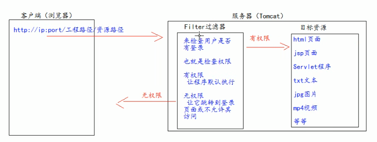
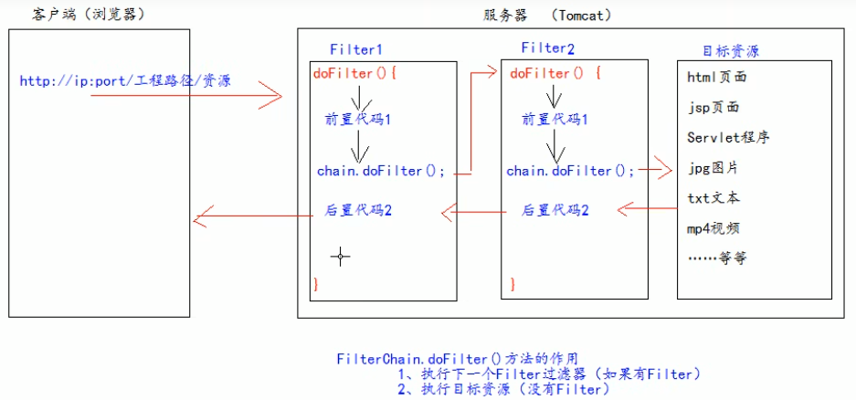

# 4. xml

xml是可扩展的标记性语言

xml可用于：

- 保存数据，并且这些数据具有自我描述性

  ```xml
  <!-- 
  比如保存两个Student类型的对象
  Student[id=1, name="张三"]
  Student[id=2, name="李四"]
  -->
  
  <students>
      <student>
          <id>1</id>
          <name>张三</name>
      </student>
      <student>
          <id>2</id>
          <name>李四</name>
      </student>
  </students>
  ```

- 作为项目的配置文件

- 作为网络传输数据的格式（现在以json格式为主）

## 4.1 xml文件格式

### 4.1.1 文档声明

```xml
<?xml version="1.0" encoding="UTF-8"?>
```

- version——使用的xml的版本
- encoding——编码方式

### 4.1.2 注释

和html注释一样

```xml
<!-- 注释 -->
```

### 4.1.3 元素（标签）

xml的元素，指 开始标签到结束标签的部分（包含开始和结束标签），格式和html中的标签很类似

元素中可包含子元素、文本，元素可以拥有属性

xml文档必须有且只有一个根元素 （根元素就是顶级元素，即没有父标签的元素）

```xml
<?xml version="1.0" encoding="UTF-8"?>

<books> <!-- 根元素，有且只有一个 -->
    <book sn="SN123124234"> <!-- 元素中可以有属性 -->
        <name>时间简史</name>
        <author>霍金</author>
        <price>75</price>
    </book>
        <book sn="SN123124233">
        <name>时间简史</name>
        <author>霍金</author>
        <price>75</price>
    </book>
    <!-- xml中可以有单行元素 -->
	<book sn="SN1232342" name="Linux" author="Linus" price="123" />
</books>
```

### 4.1.4 文本区域（CDATA区）

xml中有很多特殊符号，当内容中有很多特殊符号时转义起来比较麻烦

此时可以将文本内容放在CDATA区中，告诉xml编译器这是纯文本内容不用解析

格式为`<![CDATA[要放置的文本]]>`

```xml
<books>
    <![CDATA[
		<<<<<<<这里的内容不用解析>>>>>>>>>>>>
	]]>
</books>
```

## 4.2 xml文件解析

xml和html一样是标记型文档，可以使用w3c组织制定的dom技术来解析，即将每个元素（标签）都解析为一个dom对象

**解析技术：**

- dom：w3c组织制定

- SAX：（Simple API for XML）是sun公司在jdk5对dom解析技术的升级
- jdom：在dom基础上进行封装
- dom4j：对jdom进行封装
- pull：用于Android手机开发

### 4.2.1 dom4j解析

[下载](https://dom4j.github.io/)dom4j的jar包  dom4j-version.jar

以解析下面xml文件为例

```xml
<?xml version="1.0" encoding="UTF-8"?>

<books> <!-- 根元素，有且只有一个 -->
    <book sn="SN123124234"> <!-- 元素中可以有属性 -->
        <name>时间简史</name>
        <author>霍金</author>
        <price>75</price>
    </book>
        <book sn="SN123124233">
        <name>时间简史</name>
        <author>霍金</author>
        <price>75</price>
    </book>
    <!-- xml中可以有单行元素 -->
	<book sn="SN1232342" name="Linux" author="Linus" price="123" />
</books>
```

**使用流程：**

1. 将jar包放入项目路径中并add as Library导入项目

2. 创建相应的book类

   ```java
   public book {
       String SN;
       String name;
       String author;
       double price;
       // 提供空参构造器和全参构造器
       // 提供get/set方法
       // 提供toString方法
   }
   ```

3. 创建saxReader对象

   ```java
   SAXReader saxReader = new SAXReader();
   ```

4. 读取xml配置文件生成Document对象

   ```java
   Document document = saxReader.read("./books.xml");
   ```

5. 通过Document对象获取根元素

   即获取\<books>标签

   ```java
   Element rootElement = document.getRootElement();
   ```

6. 通过根元素获取子元素

   ```java
   // 有多个子元素时使用elements
   List<Element> books = rootElement.elements("book"); // 这里是元素标签名
   
   // 只有一个子元素时使用element
   Element book = rootElement.element("book");
   
   // asXML可以将标签地xml源代码原封不动地转化为字符串
   String xmlBook = book.asXML();
   ```

7. 遍历子元素，转化为相应类的对象

   ```java
   for (Element book : bookd) {
       // 先获取子元素，再获取元素中的文本内容
       Element nameElement = book.element("name"); // 获取子元素 - name标签对象
       String bookName = nameElement.getText(); // 获取标签对象中的文本内容
       
       // 也可以直接获取子元素中的文本内容
       String priceText = book.elementText("price");
       String authorText = book.elementText("author");
       
       // 获取标签中的属性
       String sn = book.attributeValue("sn");
       // 根据这些值创建bookd
       Book book = new Book(bookName, priceText, authorText, sn);
   }
   ```


# 5. Tomcat服务器

Tomcat是Apace提供的免费web服务器

## 5.1 安装和启动

**安装**

在[官网下载](https://tomcat.apache.org/whichversion.html)需要版本的压缩包，直接解压到想要安装的目录即完成安装

目录介绍

- bin：存放Tomcat服务器的可执行程序
- conf：存放配置文件
- lib：存放jar包，Tomcat提供给java的jar包
- logs：Tomcat服务器运行时输出的日志
- temp：用于存放Tomcat运行时产生的临时数据
- webapps：存放部署的web工程
- works：Tomcat工作目录，用来存放Tomcat运行时jsp翻译为Servlet的源码，和Session钝化的目录

**启动**

- 找到Tomcat目录下的bin目录下的startup.bat文件，双击即可启动（如果出现命令行窗口一闪而过，是因为没有配置JAVA_HOME环境变量）
- 命令行启动：打开命令行定位到Tomcat bin目录下， 输入 `catalina run`即可启动 （这种方式如果启动失败会显示错误信息）

启动之后打开浏览器输入`localhost:8080`，显示Tomcat的欢迎页面即为启动成功

**关闭**

- 直接关闭启动Tomcat的命令行窗口
- 双击bin目录下的shutdown.bat

**修改Tomcat默认端口号**

Tomcat默认的端口号是8080

打开tomcat目录/conf/server.xml，找到Connector标签，修改里面的port属性即可

修改完端口号后重启Tomcat服务器

**中文乱码问题**

Tomcat服务器默认编码方式是ISO-8859-1，当客户端的数据传回服务器时，服务器会默认使用该编码方式来解析传来的文本，就会出现乱码问题。

解决办法：

- 修改Tomcat配置文件

  打开tomcat目录/conf/server.xml，在Connector标签（也就是修改端口号的标签中），加上 `URIEncoding="UTF-8"`

- 将客户端传回来的网页用utf-8解析

  在doPost/doGet方法中添加：`req.setCharacterEncoding("UTF-8");`

- 使用getParameter方法得到对应数据之后再对数据进行转码

  ```java
  String name = req.getParameter("name");
  name = new String(name.getByte("iso-8859-1"), "utf8");
  ```

## 5.2 部署web工程

浏览器访问时，如果只输入`https://ip:port/`默认访问`webapps/ROOT`文件夹

当访问一个项目时，如果没有指定资源名，默认访问项目路径中的`index.html`

### 5.2.1 直接拷贝项目工程目录

之前提到tomcat目录下的webapps文件夹用于存放部署的web工程，因此可以直接把工程目录拷贝到webapps文件夹里实现部署

访问时输入`localhost:8080`后会进入webapps目录，在地址中继续输入目录路径即可访问到指定页面，比如`localhost:8080/docs/aio.html`

### 5.2.2 通过配置文件

在Tomcat目录下`./conf/Catalina/localhost`创建配置文件，名字可以任意取

```xml
<Content path="/123" docBase="E:\book">
```

### 5.2.3 IDEA部署

**配置服务器**

File - Settings - Build,Execution,Deployment - Application Servers - 添加（加号） - Tomcat Server - 选择Tomcat Home（只用选择到Tomcat根目录即可，不用选择bin目录）

**创建Web项目**

创建一个项目，右键项目名 - New module - Java EE（Legacy） - 选择Application Server，在Additional Libearies and Frameworks中勾选 Web Application ，并在下方选中Create web.xml - next - 设置Project name

Module中没有Java EE选项：

- 新版Idea（2022.2及之前）没有Java EE选项需要修改注册表：打开idea，按下alt+ctrl+shift+/ 组合键，选择Register注册表 - 找出javaee-legacy.project.wizard 并选中
- 2022.3及之后：先新建一个工程，右键工程名 - Add Frameword Support - 在里面选中Web Application之后点击OK

**项目目录说明**

- src：src目录存放编写的Java源代码

- web：存放web工程的资源文件

  比如：html页面，css文件，js文件等

  WEB-INF：受服务器保护的目录，浏览器无法直接访问到此目录的内容

  - lib目录：默认没有，建议创建一个，用于存放第三方jar包
  - web.xml：整个web工程的配置部署描述文件，可以在这里配置很多web工程的组件

**启动配置说明**

在右上角启动按钮的旁边打开Edit Configuration

如果左侧为空，则添加一个TomEE Server - Local配置

- Server

  URL表示通过IDEA启动浏览器之后自动输入的网址（一般是本工程的网址）

  On 'Update' action ：热部署，即工程文件发生变化之后执行什么操作

  - Update resources
  - Update classes and resources
  - Redeploy
  - Restart server：重启Tomcat服务器

- Deployment

  可以在这里添加多个server，即启动Tomcat服务器之后部署多个工程

  Application context：修改工程的地址，即输入`ip:port`之后再输入`/address`能访问到此工程

# 6. Servlet

Servlet是JavaEE规范（即接口）之一，运行在服务器上，可以接收客户端发送过来的请求，并响应给客户端

## 6.1 实现servlet程序

### 6.1.1 实现Servlet接口

**实现过程**

1. 创建一个类实现Servlet接口

   创建`HelloServlet.java`文件

2. 实现service方法

   service方法专门用于处理请求和相应

   ```java
   public class HelloServlet implements Servlet {
       @Override
       public void service(ServletRequest servletRequest, 
                          ServletResponse servletResponse) 
           throws servletException, IOException {
           sout("Hello Servlet被访问了");
       }
   }
   ```

3. 配置xml文件

   ```xml
   <?xml version="1.0" encoding="UTF-8"?>
   <web-app>
       <!-- 给Tomcat配置Servlet程序 -->
       <servlet>
           <!-- 给Servlet程序起一个别名，一般是类名 -->
           <servlet-name>HelloServlet</servlet-name>
           <!-- Servlet程序的全类名 -->
           <servlet-class>com.sazer.servlet.HelloServlet</servlet-class>
       </servlet>
       
       <!-- 给servlet程序配置访问地址 -->
       <servlet-mapping>
           <!-- 给哪个servlet程序配置地址 -->
           <servlet-name>HelloServer</servlet-name>
           <!-- 对应的地址 -->
           <!--
   			/ 表示工程路径，即 ip:port/工程路径
   			hello 表示servlet程序的地址
   			通过 ip:port/工程路径/hello 即可访问到HelloServlet程序的service方法
   		-->
           <url-pattern>/hello</url-pattern>
       </servlet-mapping>
   </web-app>
   ```


**客户端访问时执行顺序**

当客户端访问servlet时

1. 访问构造器HelloServlet
2. 执行init函数

以上两步只在第一次访问时才会执行

3. 执行service函数

   这一步每次访问都会执行

4. web工程停止时，执行destroy销毁

```java
public class HelloServlet implements Servlet {

    public HelloServlet() {
        
    }

    @Override
    public void init(ServletConfig servletConfig) throws ServletException {

    }

    @Override
    public ServletConfig getServletConfig() {
        return null;
    }

    @Override
    public void service(ServletRequest servletRequest, ServletResponse servletResponse) throws ServletException, IOException {

    }

    @Override
    public String getServletInfo() {
        return null;
    }

    @Override
    public void destroy() {

    }
}
```

**处理get/post请求**

ServletRequest中提供了getMethod方法可以用来获取此次请求类型，但是ServletRequest是一个接口，因此要类型转化为实现类来使用

```java
@Override
public void service(ServletRequest servletRequest, 
                    ServletResponse servletResponse) 
    throws ServletException, IOException {
    
    HttpServletRequest hsr = (HttpServletRequest) servletRequest;
    String method = hsr.getMethod();
    if ("GET".equals(method)) {
        System.out.println("收到get请求");
    } else if ("POST".equals(method)) {
        System.out.println("收到post请求");
    }
    
}
```

### 6.1.2 继承HttpServlet类

在实际开发中一般使用这种方法 

1. 编写一个类继承HttpServlet类

2. 根据业务需要重写doGet或doPost方法

   ```java
   public class HelloServlet extends HttpServlet {
       @Override
       protected void doGet(HttpServletRequest req, 
                           HttpServletResponse resp)
           throws ServletException, IOException{
           
           sout("收到get请求时调用");
       }
       
       @Override
       protected void doPost(HttpServletRequest req, 
                           HttpServletResponse resp)
           throws ServletException, IOException{
           
           sout("收到post请求时调用");
       }
   }
   ```

3. 到web.xml中配置Servlet程序访问地址

### 6.1.3 用idea创建Servlet程序

自动创建的Servlet程序也是采用继承HttpServlet类的形式

右键src - new - Servlet，在弹出的New Servlet窗口中

- Name：要创建的Servlet程序的类名
- Package：要创建到哪个包下
- Class：创建Servlet程序的全类名

- Create Java EE 6+ annotated class
  - 勾选的话会用注解的方式配置
  - 不勾选的话用web.xml文件配置，推荐这个方式

点击OK，然后会在web.xml文件中自动配置\<servlet>，再手动配置\<servlet-mapping>即可

### 6.1.4 web.xml配置文件

每个web工程对应一个web.xml配置文件，在配置文件中可以配置

- 各个servlet程序的访问地址，各个servlet程序中的init-param

- 整个web工程的context参数 context-param

  每个context-param标签中只能有一组param参数

```xml
<?xml version="1.0" encoding="UTF-8"?>
<web-app>
    <!-- 整个web工程的context参数 -->
    <context-param>
        <param-name>user</param-name>
        <param-value>root</param-value>
    </context-param>
    
    <context-param>
        <param-name>password</param-name>
        <param-value>123456</param-value>
    </context-param>
    
    <!-- 给Tomcat配置Servlet程序 -->
    <servlet>
        <!-- 给Servlet程序起一个别名，一般是类名 -->
        <servlet-name>HelloServlet</servlet-name>
        <!-- Servlet程序的全类名 -->
        <servlet-class>com.sazer.servlet.HelloServlet</servlet-class>
        
        <!-- 初始化参数，可以有多组 -->
   		<init-param>
            <!-- 参数名 -->
            <param-name>username</param-name>
            <!-- 参数值 -->
            <param-value>root</param-value>       
            <param-name>url</param-name>
            <param-value>jdbc:mysql://localhost/test</param-value>
    	</init-param>
    </servlet>    
    
    <!-- 给servlet程序配置访问地址 -->
    <servlet-mapping>
        <!-- 给哪个servlet程序配置地址 -->
        <servlet-name>HelloServer</servlet-name>
        <!-- 对应的地址 -->
        <!--
			/ 表示工程路径，即 ip:port/工程路径
			hello 表示servlet程序的地址
			通过 ip:port/工程路径/hello 即可访问到HelloServlet程序的service方法
		-->
        <url-pattern>/hello</url-pattern>
    </servlet-mapping>
</web-app>
```

## 6.2 Servlet继承体系

查看Servlet源码需要在[官网](https://tomcat.apache.org/download-80.cgi)下载Tomcat source code distributions，下载下来为`apache-tomcat-version-src-zip`

实现servlet程序，选中 Servlet 按下ctrl+B，


1. Servlet接口

   负责定义Servlet程序的访问规范

2. GenericServlet类 --> 实现了Servlet接口

   对接口做了很多空实现

   并持有一个ServletConfig类的引用，并对ServletConfig的使用做一些方法

3. HttpServlet类 --> 继承于GenericServlet类

   主要是实现了service方法，实现各种请求的分发处理

   ```java
   protected void service(HttpServletRequest req, HttpServletResponse resp) throws ServletException, IOException {
   	// 获取请求类型
       String method = req.getMethod();
   	
       // 根据请求类型分发请求
       if (method.equals(METHOD_GET)) {
           ...
   		doGet(req, resp);
           ...
       } else if (method.equals(METHOD_HEAD)) {
           long lastModified = getLastModified(req);
           maybeSetLastModified(resp, lastModified);
           doHead(req, resp);
   
       } else if (method.equals(METHOD_POST)) {
           doPost(req, resp);
   
       } else if (method.equals(METHOD_PUT)) {
           doPut(req, resp);
   
       } else if (method.equals(METHOD_DELETE)) {
           doDelete(req, resp);
   
       } else if (method.equals(METHOD_OPTIONS)) {
           doOptions(req, resp);
   
       } else if (method.equals(METHOD_TRACE)) {
           doTrace(req, resp);
   
       } else {
   		// 抛出异常
           String errMsg = lStrings.getString("http.method_not_implemented");
           Object[] errArgs = new Object[1];
           errArgs[0] = method;
           errMsg = MessageFormat.format(errMsg, errArgs);
   
           resp.sendError(HttpServletResponse.SC_NOT_IMPLEMENTED, errMsg);
       }
   }
   ```

   在HttpServlet类中的doGet和doPost等方法的实现都只有抛出异常——不支持该类型请求。即如果自定义的类不重写类型请求的处理方法，接收到对应类型的请求时就提示不支持该类型。

4. 自定义Serlvet程序

   根据自己的业务重写各种请求的处理方法

## 6.3 Servlet中一些实用类

### 6.3.1 ServletConfig

Servlet程序的配置信息类，即用于获取web.xml中的配置信息

**获取ServletConfig对象**

每个Servlet程序都有一个Servlet Config对象，由Tomcat负责创建这个对象

- 可以通过init函数获取，在init函数的参数中会传入一个ServletConfig对象

  重写init方法之后，一定要调用父类init方法，并将servletConfig对象传进去。父类GenericServlet中的init方法负责 给GenericServlet中的属性servletConfig赋值，以供getServletConfig函数获取servletConfig对象

```java
class HelloServlet extends HttpServlet {
    
    @Override
    public void init(ServletConfig servletConfig) 
        throws ServletException {
        super(servletConfig);
    }
}
```

- 在其他地方可以通过getServletConfig获取

  这里实际上是从父类GenericServlet中获取，父类中有一个成员属性保存了ServletConfig对象

```java
@Override
protected void doGet(...) {
    ServletConfig servletConfig = getServletConfig();
}
```

**ServletConfig对象的作用**

1. 获取Servlet程序的别名，即web.xml文件中配置的 servlet-name的值

   ```java
   String name = servletConfig.getServletName();
   ```

2. 获取初始化参数 init-param

   要获取首先要在web.xml文件的对应Servlet程序的Servlet标签中添加

   ```xml
   <servlet>
       <servlet-name>HelloServlet</servlet-name> <!-- Servlet程序别名 -->
       <servlet-class>com.sazer.servlet.HelloServlet</servlet-class>
       
       <!-- 初始化参数，可以有多组 -->
       <init-param>
           <!-- 参数名 -->
           <param-name>username</param-name>
           <!-- 参数值 -->
           <param-value>root</param-value>
           
           <param-name>url</param-name>
           <param-value>jdbc:mysql://localhost/test</param-value>
       </init-param>
   </servlet>
   ```

   ```java
   // 获取初始化参数 username的值
   String username = servletConfig.getInitParameter("username");
   // 获取初始化参数 url
   String url = servletConfig.getInitParameter("url");
   ```

3. 获取ServletContext对象

   ```java
   servletConfig.getServletContext();
   ```

### 6.3.2 ServletContext

**概念**

ServletContext是一个接口，表示Servlet上下文对象

一个web工程中只有一个ServletContext对象实例

ServletContext是一个域对象，即可以存取数据

**获取ServletContext对象**

- 使用servletConfig对象调用getServletContext();

  ```java
  ServletContext context = getServletConfig().getServletContext();
  ```

- 直接调用getServletContext()；函数

  ```java
  ServletContext context = getServletContext();
  ```

  这是因为在父类GenericServlet中重写了getServletContext方法，实际上和上面的方法一样

  ```java
  @Override
  public ServletContext getServletContext() {
      return getServletConfig().getServletContext();
  }
  ```

**作用**

1. 获取web.xml中配置的上下文参数 context-param

   （以6.1.4中web.xml文件为例）

   ```java
   String username = context.getInitParameter("username"); // root
   String pwd = context.getInitParameter("password"); // 123456
   ```

2. 获取当前的工程路径，格式为`/工程路径`

   即在浏览器输入 `ip:port/工程路径`访问到当前web工程（访问到的web文件夹）

   ```java
   context.getContextPath();
   ```

3. 获取工程部署后在服务器硬盘上的绝对路径

   参数`/`表示获取到工程根目录的绝对路径，即工程中的web文件夹的路径

   ```java
   context.getRealPath("/");
   // D:\CS_Source\JavaSource\JavaWeb\out\artifacts\webTest_war_exploded\
   ```

4. 存取数据（类似于map一样使用）

   由于一个web工程只有一个ServletContext对象，因此在一个Serlvet程序中添加的数据在其他Servlet程序中都能取到。

   重新部署或者重启服务器都会使这些数据失效

   ```java
   // 存数据
   context.setAttribute("key1", "value1");
   // 取数据
   context.getAttribute("key1");
   // 删除数据
   context.removeAttribute("key1");
   ```

## 6.4 HttpServletRequest类

service方法中有两个参数，一个是HttpServletRequest，一个是HttpServletResponse

当有请求进入Tomcat服务器时，服务器就会把请求过来的HTTP协议中的信息解析好并封装到HttpServletRequest对象中，然后传递到service方法的参数中供我们使用

### 6.4.1 常用方法

重写service或者doGet/doPost方法之后，在参数中有一个 HttpServletRequest类型的req对象，这个对象中封装了一些方法

- getRequestURI —— 获取请求的资源路径

  ```java
  String URI = req.getRequestURI(); // 只返回ip:port/ 斜杠后面的部分，即资源路径
  ```

- getRequestURL —— 获取请求的统一资源定位符（绝对路径）

  ```java
  String URL = req.getRequestURL(); // 返回完整路径 ip:port/资源路径
  ```

- getRemoteHost —— 获取客户端ip地址

  当在本机访问时，返回127.0.0.1

  其他客户端访问时返回客户端的真实ip

  ```java
  String host = req.getRemoteHost();
  ```

- getHeader —— 获取请求头中各种信息

  参数中填写需要请求头中的哪个值

  ```java
  String user_agent = req.getHeader("User-Agent");
  ```

- getMethod —— 获取请求的方式（GET/POST）

  ```java
  String method = req.getMe
  ```

- getParameter —— 获取客户端传来的参数

  函数中的参数为 客户端传来参数的name

- getParameterValues —— 当参数值有多个时使用这个

  返回一个String数组

  ```html
  <!-- 表单示例 -->
  <form action="http://localhost:8080/servlet/HelloServlet" method="post">
      用户名：<input type="text" name="username"><br/>
      密码：<input type="password" name="password"><br/>
      <!-- 多选框 -->
      兴趣爱好：<input type=checkbox name="hoppy" value="cpp">C++
      <input type=checkbox name="hoppy" value="java">Java
      <input type=checkbox name="hoppy" value="js">JavaScript<br/>
      <input type="submit">
  </form>
  ```

  ```java
  String username = req.getParameter("username");
  String password = req.getParameter("password");
  String[] hobbies = req.getParameterValues("hobby");
  ```

- setCharacterEncoding —— 解决post请求的中文乱码问题

  需要在获取所有请求参数之前设置才有效

  ```java
  req.setCharacterEncoding("UTF-8");
  ```

### 6.4.2 请求转发

请求转发指：服务器收到请求之后，从一个资源转到另一个资源

比如一个功能需要先执行Servlet1再执行Servlet2，客户端的请求传到Servlet1之后，Servlet1再将请求转发到Servlet2程序就叫请求转发

两个Servlet程序之间传递消息要使用域数据

**Servlet1**

```java
public class Servlet1 extends HttpServlet {
    @Override
    protected void doGet(HttpServletRequest req, 
                         HttpServletResponse resp)
        throws ServletException, IOException {
        
        // 客户端发来的数据
        String username = req.getParameter("username");
        
        // 不同Servlet程序之间通信使用域数据
        req.setAttribute("key1", "Servlet1要传的数据");
        
        // 请求转发
        // 这里的地址必须以 / 打头，/ 表示 http://ip:port/工程名/ ，映射到web工程的web目录
        RequestDispatcher requestDispatcher = req.getRequestDispatcher("/servlet2");
        requestDispatcher.forward(req, resp);
    }
}
```

**Servlet2**

```java
public class Servlet2 extends HttpServlet {
    @Override
    protected void doGet(HttpServletRequest req, 
                         HttpServletResponse resp)
        throws ServletException, IOException {
        
        // 也可以直接获取客户端发来的数据
        String username = req.getParameter("username");
        
        // servlet1传来的数据
		String value1 = req.getAttribute("key1");
    }
}
```

特性：

- 请求转发 对客户端来说不可见，即客户端认为这是一次请求

  所以浏览器中地址栏的地址并不会发生改变

- 可以转发到WEB-INF目录中（这个目录是受服务器保护的，无法直接访问）

- 转发路径必须以/打头，因此只能转发到工程内部，不能转发到外部服务器

**相对路径和base标签**

（也可以直接使用绝对路径，就不存在这个问题了，在框架中一般使用绝对路径）

请求转发之后浏览器中地址栏的地址并不会发生改变，也就是说浏览器访问`localhost:8080/Servlet1`，Servlet1程序再请求转发到Servlet2之后，浏览器地址栏中显示的依然是Servlet1的地址。

而由于浏览器在解析相对路径时时按照当前浏览器中的地址定位的，所以这样会导致转发后的页面的相对路径全部失效

可以通过设置base标签，来使得当前页面的所有相对路径都以base标签中设置的路径为基准，而不再以当前浏览器中地址定位。注意一个html页面中的base标签只能管理当前页面的所有相对路径。

```html
<head>
    <base href="http://localhost:8080/servlet/">
</head>
```

base标签的值一般设置为工程路径，即对应项目中的web目录下。

路径必须加`http://` 最后一个目录后面必须加`/` 。

## 6.5 HttpServletResponse类

和HttpServletRequest类一样，当客户端发送请求时，服务器会生成一个HttpServletResponse类供我们使用

该类用于表示所有服务器响应回客户端的信息，可以用它来设置返回给客户端的信息

可以用于：

- 设置响应头

  ```java
  resp.setHeader("Content-Type", "test/html; charset=UTF-8");
  ```

- 给客户端回传数据

  - 字节流数据：用于传输二进制文件，客户端请求下载时使用

    ```java
    resp.getOutputStream();
    ```

  - 字符流数据：给客户端回传字符串

    ```java
    resp.getWriter();
    ```

### 6.5.1 往客户端回传数据

**字符流数据**

1. 获取流对象

   ```java
   PrintWriter writer = resp.getWriter();
   ```

2. 向客户端回传数据

   ```java
   writer.write("123456");
   writer.println("123456");
   ```

3. 解决中文乱码问题

   需要同时改变服务器端和客户端的编码方式

   ```java
   // 改变服务器端编码方式
   resp.setCharacterEncoding("UTF-8");
   // 通过响应头改变客户端编码方式
   resp.setHeader("Content-Type", "test/html; charset=UTF-8");
   ```

   还有一种写法，可以一行代码同时设置服务器和客户端（这个方法必须在获取流对象之前使用才有效）

   ```java
   resp.setContentType("text/html; charset=UTF-8");
   ```

### 6.5.2 请求重定向

当客户端请求的资源已经被废弃并移动至新的地址时，服务器端需要告诉客户端新地址在哪里并让客户端重新访问，这个就是处理请求重定向请求

首先需要返回响应码302表示请求重定向，然后需要在响应头Location中告诉新地址

**示例**

Response1已经废弃，改用Response2响应客户端请求

```java
public class Response1 extends HttpServlet {
    @Override
    protected void doGet(HttpServletRequest req, 
                         HttpServletResponse resp)
        throws ServletException, IOException {
        
		// 设置响应状态码302
        resp.setStatus(302);
        
        // 在响应头中Loaction字段设置新地址
        resp.setHeader("Location", "http://localhost:8080/servlet/Response2");
    }
}
```

第二种方法

```java
resp.setRedirect("http://localhost:8080/servlet/Response2");
```

**特点**

- 对于客户端来说，这是两次不同的请求
- 不能访问WEB-INF中的资源
- 可以访问服务器外部的资源

# 7. jsp

jsp —— Java Server Pages

jsp的格式和用法都和HTML页面类似，主要作用是代替servlet实现给客户端回传html页面的功能。

当服务器需要回传给客户端一个页面时，如果使用Servlet程序，那就只能把页面源代码一行一行地通过resp对象回传过去，非常地麻烦且难以维护。

## 7.0 jsp本质

jsp本质上其实是一个Servlet程序，访问jsp页面时会创建一个 `文件名_jsp.java `的类这个类间接继承于HttpServlet类

在工程中创建一个index.jsp文件

```jsp
<%@ page contentType="text/html;charset=UTF-8" language="java" %>
<html>
<head>
    <title>Title</title>
</head>
<body>
这是一个jsp网页
</body>
</html>
```

之后启动Tomcat服务器，在浏览器中访问该jsp。

当第一次访问jsp页面时，Tomcat服务器会将jsp页面翻译成为一个java源文件，并再编译为一个.class字节码文件。

启动Tomcat服务器时控制台会打印一栏 CATALINE_BASE，这是Tomcat服务器部署时使用的目录，打开这个目录，在该目录下的`./work/Catalina/localhost/工程名/org/apache/jsp`中可以看到jsp文件名对应的java文件`index_jsp.java`。

打开这个文件，可以发现翻译后的java源代码为

```java
public final class index_jsp extends org.apache.jasper.runtime.HttpJspBase
    implements org.apache.jasper.runtime.JspSourceDependent,
                 org.apache.jasper.runtime.JspSourceImports {

                     
      public void _jspService(final javax.servlet.http.HttpServletRequest request, final javax.servlet.http.HttpServletResponse response)
      throws java.io.IOException, javax.servlet.ServletException {      
                         ...
          response.setContentType("text/html;charset=UTF-8");
          pageContext = _jspxFactory.getPageContext(this, request, response,
                    null, true, 8192, true);
          _jspx_page_context = pageContext;
          application = pageContext.getServletContext();
          config = pageContext.getServletConfig();
          session = pageContext.getSession();
          out = pageContext.getOut();
          _jspx_out = out;

          out.write("\r\n");
          out.write("\r\n");
          out.write("<html>\r\n");
          out.write("<head>\r\n");
          out.write("    <title>Title</title>\r\n");
          out.write("</head>\r\n");
          out.write("<body>\r\n");
          out.write("这是一个jsp网页\r\n");
          out.write("</body>\r\n");
          out.write("</html>\r\n");
                         ...
     }             

}
```

- 首先可以看到这个类继承于`org.apache.jasper.runtime.HttpJspBase`类，HttpJspBase类又继承于HttpServlet类，所以这是一个Servlet程序。

  ```java
  public abstract class HttpJspBase extends HttpServlet implements HttpJspPage {
      
  }
  ```

- 再往下可以看到jsp页面翻译后也是将HTML源码一行一行传输给客户端。和我们用Servlet程序回传HTML页面使用的方式相同。只不过服务器帮我们完成了这个工作

## 7.1 page指令

```java
<%@ page contentType="text/html;charset=UTF-8" language="java" %>
```

jsp页面的头部有一行，叫做page指令。

用于修改jsp页面中的重要属性和行为

### 7.1.1 常用属性

- language —— 表示jsp页面翻译后是什么语言，只支持java

- contentType —— 表示jsp返回给客户端的数据类型是什么。也是翻译后的java源码中 response.setContentType()的参数值

- pageEncoding —— jsp文件本身使用的编码

- import —— 导包，和java中的import一样

  ```jsp
  <%@ page import="java.util.Map" %>
  ```

- autoFlush —— 当out输出缓冲区满了之后，是否自动刷新

  默认为true

  out即给客户端回传数据的流对象，用于回传jsp页面源码

- buffer —— 设置out缓冲区的大小，默认为8kb

- errorPage —— 用于指定errorPage的路径，当页面出错时自动跳转到errorPage

  ```jsp
  <%@ page errorPage="/error.jsp" %>
  <!--
  路径以 / 打头，斜杠表示请求地址为 http://ip:port/工程路径，映射到工程中的web目录下
  -->
  ```

- isErrorPage —— 设置当前jsp页面是否是errorPage，默认是false

  如果置为true，该页面中会产生一个exception异常对象，来保存错误信息

- session —— 设置访问当前的jsp页面时是否会创建HttpSession对象。默认是true

- extends —— 指定jsp翻译出来的java类默认继承哪个类

## 7.2 脚本

脚本用于在jsp页面中写java代码

这些脚本都是写在jsp页面的body体中，翻译之后在java代码的 _jspService方法中

### 7.2.1 声明式脚本

jsp页面运行时会被翻译为java中的一个类，声明脚本就是在这个类中声明 变量、方法、代码块

格式为 `<%!  %>`

- 创建属性

  ```jsp
  <%!
  	public int age;
  	private String name;
  	private static Map<String, Integer> map;
  %>
  ```

- 创建方法

  ```jsp
  <%!
  	public int sum (int a, int b) {
      	return a + b;
  	}	    
  %>
  ```

- 创建静态代码块

  ```jsp
  <%!
  	static {
      	map = new HashMap<String, Integer>();
      	map.put("key1", 1);
  	}    
  %>
  ```

- 声明内部类

  ```jsp
  <%!
  	public class A {
          private Integer id = 1;
          public String name = "a";
      }	   
  %>
  ```

### 7.2.2 表达式脚本

用于在jsp页面上输出数据，直接显示在jsp页面上

基本格式为：`<%=表达式%>`

```jsp
<%=12 %> 空格也会被输出
<%=12.12%>
<%="字符串"%>
<%=map%>  输出一个map对象
<%=request.getParameter("username")%> _jspService方法中对象都可以直接使用，注意语句结尾不能加分号
```

在翻译后的java源代码中，都转化为了

```java
out.print(12 ); // 空格也会被输出
out.print(12.12);
out.print("字符串");
out.print(map);
```

### 7.2.3 代码脚本

作用是在jsp页面中编写java语句实现功能，可以使用判断、循环等结构语句

基本格式为`<%java代码%>`

```java
<%
    int i = 1;
	if (i == 1) {
        System.out.println("1"); // 这里是打印到控制台
    } else {
        sout("2");
    }
%>
```

还可以由多个代码脚本组合完成一个语句，翻译成java代码之后没有区别

```jsp
<%
    int i = 1;
	if (i == 1) {
%>
<%
        System.out.println("1"); // 这里是打印到控制台
    } else {
        sout("2");
    }
%>
```

这样就可以配合表达式脚本实现在页面上输出数据

```java
<%
    int i = 1;
	for (; i < 10; i++);
%>
    <%=i %>
<%
    }
%>

// 在jsp页面上打印 1~9
```

再和html标签配合可以实现非常复杂的页面输出

## 7.3 内置对象

内置对象是指翻译成Java程序之后，_jspService中提供的九个可供使用的内置对象

- request —— 请求对象
- response —— 响应对象
- pageContext —— jsp上下文对象
- session —— 会话对象
- application —— ServletContext对象
- config —— ServletConfig对象
- out —— jsp输出流对象
- page —— 指向当前jsp对象
- exception —— 异常对象

### 7.3.1 域对象

域对象用于存储数据。

四个域对象功能相同，只是存储的数据能访问到的范围不同

- request —— 请求对象，HttpServletRequest类
- application —— ServletContext对象
- pageContext —— jsp上下文对象，PageContextImpl类
- session —— 会话对象， HttpSession类

### 7.3.2 用于输出的对象

- out
- response.getWriter

## 7.4 JSP常用标签

### 7.4.1 静态包含

当网站中的多个页面都要用到同一页面时（比如页脚部分）

就可以将页脚部分单独写为一个页面，并在其他页面使用静态包含引用这个部分

```jsp
<%@ include file="/include/footer.jsp" %>
```

翻译之后的代码其实会把被引用页面直接复制过去

### 7.4.2 动态包含

动态包含和静态包含作用相同，只是原理不同

```jsp
<jsp:include page="/include/footer.jsp"></jsp:include>
```

翻译之后的代码变为了以下形式来调用被引用的页面

```java
JspRuntimeLibrary.inclue(request, response, "/include/footer.jsp", out, false);
```

### 7.4.3 请求转发

```jsp
<jsp:forward page="/page2.jsp"></jsp:forward>
```

转发到page2页面

## 7.5 Listener监听器

Listener是JavaEE的规范，即接口。

作用是监听某种事物的变化，然后触发回调函数。

### 7.5.1 ServletContextListener监听器

监听ServletContext对象的创建和销毁，监听到之后调用响应的函数

**使用步骤**

1. 实现ServletContextListener接口

2. 重写方法

   ```java
   public class MyServletContextListenerImpl implements ServletContextListener {
       @Override
       public void contextInitialized(ServletContextEvent sce) {
           sout("ServletContext对象被创建");
       }
       @Override
       public void contextDestroyed(ServletContextEvent sce) {
           sout("ServletContext对象被销毁"):
       }
   }
   ```

3. 在web.xml文件中配置

   ```xml
   <listener>
       <listener-calss>com.sazser.listener.MyServletContexxtListenerImpl</listener-calss>
   </listener>
   ```

## 7.6 EL表达式

用于代替jsp的表达式脚本，往页面上输出数据

EL表达式会简便很多

### 7.6.1 基本用法

1. 主要用于输出域对象中的数据

```jsp
<%
	pageContext.setAttribute("key", "pageContext");
%>
${key} // 输出pageContext
```

当多个域中都有相同的key时，会按照域的作用范围大小 从小到大 找到范围最小的来输出

2. 还可以进行一些运算，并直接输出运算结果

   关系运算、逻辑运算、算术运算

```jsp
$(12==12)
${12eq12}
```

### 7.6.2 11个隐含对象

**获取jsp九大内置对象**

pageContext，获取jsp的九大内置对象

```jsp
${pageContext.servletConfig}
${pageContext.request.scheme} // 获取jsp中的request对象，进而获取使用的协议 
```

**获取域对象中数据**

- pageScope —— 获取pageContext域中数据

  `${pageScope.key1}`

- requestScope —— 获取Request域中数据

  `${requestScope.key1}`

- sessionScope —— 获取Session域中的数据

- applicationScope —— 获取ServletContext域中的护具

**获取请求参数的值**

- param
- paramValues

**获取请求头信息**

- header
- headerValues

**获取Cookie信息**

cookie

**获取InitParam**

initParam，获取在web.xml中配置的\<context-param>的数据

## 7.7 JSTL标签库

JSTL标签库 全称：JSP Standard Tag Library

主要是为了替换代码脚本，使得整个jsp页面更加简洁

使用标签库之前要先导入jar包，再使用taglib指令引入标签库

- CORE标签库：核心标签库

  ```jsp
  <%@ taglib prefix="c" uri="http://java.sun.com/jsp/jstl/core" %>
  ```

- FML标签库：格式化标签库

  ```jsp
  <%@ taglib prefix="fmt" uri="http://java.sun.com/jsp/jstl/fmt" %>
  ```

- FUNCTIONS标签库：函数

  ```jsp
  <%@ taglib prefix="fn" uri="http://java.sun.com/jsp/jstl/functions" %>
  ```

- SQL标签库：数据库（不使用）

  因为在jsp页面直接访问SQL数据库破坏了JavaEE三层结构，应该经过DAO层访问数据库

  ```jsp
  <%@ taglib prefix="sql" uri="http://java.sun.com/jsp/jstl/sql" %>
  ```

- XML标签库：不使用，现在传数据一般用json

### 7.7.1 core核心库

- **set标签**：往域中保存数据

  - scope：设置保存在哪个域对象中

  - var：设置key是多少
  - value：设置value

  ```jsp
  <c:set scope="page" var="key1" value="value1" />
  ```

- **if标签**：做if判断

  中间的判断使用EL表达式，如果判断为真，则指定if标签中间的部分

  不支持if-else，只能做一次if判断

  ```jsp
  <c:if test="${12 == 12}">
      <h1>12等于12</h1>
  </c:if>
  ```

- **choose-when-otherwise** ： 做多路判断

  类似于switch-case-default

  ```jsp
  <td>
      <c:choose>
          <c:when test="${order.status == 0}">
              未发货
          </c:when>
          <c:when test="${order.status == 1}">
              已发货
          </c:when>
          <c:when test="${order.status == 2}">
              已签收
          </c:when>
      </c:choose>
  </td>
  ```

- **forEach标签**：遍历容器

  遍历request域中的key为page的数据中的items属性，其中遍历到的每个对象都命名为book

  遍历List集合：

  ```jsp
  <c:forEach items="${requestScope.page.items}" var="book">
      <span>${book.name}</span>
  </c:forEach>
  ```

  遍历map集合：

  ```jsp
  <c:forEach items="${requestScope.page.itemsMap}" var="entry">
      <span>${e.value.name}</span>
  </c:forEach>
  ```

  

## 7.8 文件上传

客户端上传文件到服务器

### 7.8.1 基本流程

想接收客户端上传的文件时，需要注意以下四点

1. 要有一个form标签，method=post

   因为get请求有长度限制

2. form标签的encType属性值必须为 multipart/form-data

   该属性值表示提交的数据以多段的形式进行拼接，每个表单项为一段，中间以分隔符进行分隔。（在接收到的HTTP表单中的Content-Type项中会有boundary指定此次使用的分隔符）

   数据以二进制流的形式发送给服务器

3. 在form标签中使用 `<input type=file>` 标签添加上传的文件

   ```html
   <form action="" method="post" enctype="multipart/form-data">
       <input type="file" name="photo" >
   </form>
   ```

4. 在服务器端编写Servlet程序进行接收并处理上传的数据

   由于是以流的形式发送，因此服务器端要用输入流来接收

   ```java
   ServletInputStream inputStream = req.getInputStream();
   
   byte[] buffer = new byte[102400];
   int read = inputStream.read(buffer);
   sout(new String(buffer, 0, read));
   ```

### 7.8.2 使用第三方jar包

现在已经有很多第三方jar包可以用于处理服务器处理上传文件

commons-fileupload.jar 和 commons-io.jar（处理输入流）

**使用步骤**

```java
// 创建对象
FileItemFactory fileItemFactory = new DiskFileItemFactory();
ServletFileUpload servletFileUpload = new ServletFileUpload(fileItemFactory);
// 解析，每一个FileItem代表一个表单项
List<FileItem> list = servletFileUpload.parseRequest(req);

// 遍历解析好的表单项
for (FileItem fileItem : list) {
    if (fileItem.isFormField()) { // 如果是普通的表单项
        sout(fileItem.getFieldName() + " : " + fileItem.getString("UTF-8"));
    } else { // 如果是上传的文件
        // getName是上传的文件名
        sout(fileItem.getFieldName() + " : " + fileItem.getName());
        
        // 将上传的文件保存到服务器指定目录
        fileItem.write(new File("filePath"));
    }
}
```

## 7.9 文件下载

客户端从服务器下载文件

### 7.9.1 基本步骤

1. 服务器从客户端获取要下载的文件名

   ```java
   String downloadFileName;
   ```

2. 获取要下载的文件内容

   通过ServletContext对象读取

   ```java
   ServletContext servletContext = getServletContext();
   InputStream resourceAsStream = servletContext.getResourceAsStream("/file/" + downloadFileName);
   ```

3. 在回传前，要通过响应头告诉客户端返回的数据类型，还要告诉客户端此次收到的数据是用于下载使用

   ```java
   // 获取文件类型
   String mimeType = servletContext.getMimeType("/file/" + downloadFileName);
   // 设置响应头，告诉客户端返回数据的mime类型
   resp.setContentType(mimeType);
   // 告诉客户端收到的数据是用于下载使用
   // Content-Disposition - 表示收到的数据怎么处理
   resp.setHeader("Content-Disposition", "attachment; filename=" + downloadFileName);
   ```

   如果传输的文件名是中文，需要进行url编码

   ```java
   resp.setHeader("Content-Disposition", "attachment; filename=" + URLEncoder.encode("中国.jpg", "UTF-8"));
   ```

4. 把文件内容回传给客户端

   ```java
   // 获取输出流
   OutputStream outputStream = resp.getOutputStream();
   // 将输入流中的全部数据复制给输出流，并输出给客户端
   // IOUtils在 commons-io.jar包中
   IOUtils.copy(resourceAsStream, outputStream);
   ```

# 8. Cookie和Session

## 8.1 Cookie

Cookie是服务器通知客户端浏览器保存键值对的一种技术

客户端保存了Cookie之后，每次请求都会发送给服务器

### 8.1.1 创建Cookie

1. 创建Cookie对象

2. 通知客户端保存Cookie

   服务器端实际上是将Cookie键值对放在了响应头的Set-Cookie字段来通知客户端

   客户端检查Set-Cookie字段时，如果没有相同的key就创建，有就修改value值

```java
public class BaseServlet extends HttpServlet {

    protected void doGet(HttpServletRequest req, HttpServletResponse resp) throws ServletException, IOException {
        // 1. 创建Cookie对象
		Cookie cookie = new Cookie("key1", "value1");
        // 2. 通知客户端保存Cookie
        resp.addCookie(cookie);
    }
}
```

创建成功后，在浏览器按下F12打开控制台 - Application - Cookies栏中即可看见Cookie键值对

### 8.1.2 服务器获取Cookie

客户端是在请求服务器时，在请求头的Cookie字段中放入了所有cookie键值对

- 获取所有cookie

  `Cookie[] cookies = req.getCookies();`

- 通过cookie对象取得name和value

  `cookie.getName();`

  `cookie.getValue();`

只能一次获得所有cookie，想要特定的cookie只能在遍历时判断key

在jsp页面中，可以使用`${cookie.key1.value}`来获取指定键为key1的cookie对象的值

### 8.1.3 修改Cookie值

- 新建同key的Cookie对象，再重新传给客户端

```java
Cookie cookie = new Cookie("key1", "newValue1");
resp.addCookie(cookie);
```

- 获取已有Cookie对象，重新赋值

```java
Cookie cookie = CookieUtils.findCookie("key2", req.getCookies());
cookie.setValue("newValue2");
```

### 8.1.4 设置Cookie存活时间

setMaxAge()

- 参数为正数：表示在指定秒数后过期（关闭浏览器后也依然存在）
- 参数为负数：表示浏览器关闭时删除Cookie（函数的参数默认值是-1）
- 零：马上删除Cookie

```java
Cookie cookie = new Cookie("key1", "value1");
cookie.setMaxAge(3600);
resp.addCookie(cookie);
```

### 8.1.5 Cookie的Path属性

当访问的服务器地址满足Cookie的path属性时，才会发送Cookie给服务器

比如：

- CookieA path=/工程路径

- CookieB path=/工程路径/abc

那么当访问

`http://ip:port/工程路径/a.html`时，只有CookieA会发送

`http://ip:port/工程路径/abc/a.html`时，CookieA和CookieB都会发送

默认情况下path属性是到工程路径

```java
Cookie cookie = new Cookie("key1", "path1");
cookie.setPath(req.getContextPath() + "/abc");
resp.addCookie(cookie);
```

## 8.2 Session会话

Session是一个接口（HttpSession）

Session会话用于维护客户端和服务器之间关联，每个客户端都有自己的一个Session会话，经常用于保存用户登录之后的信息

Session保存在服务器端

### 8.2.1 创建和获取Session

**创建和获取 getSession**

`req.getSession()`

第一次调用是创建Session会话

之后调用都是获取前面创建好的Session会话对象

**判断Session是不是新建的 isNew**

如果是刚创建的（第一次调用getSession得到的）返回true

否则返回false（表示是获取的之前创建的）

**获取Session Id值 getId** 

每个客户端都对应一个单独的Session会话，也对应一个单独的Id值

### 8.2.2 Session域数据存取

**存数据**

`req.getSession.setAttribute("key1", "value1");`

**取数据**

`String key1 = req.getSession.getAttribute("key1");`

在jsp页面中使用`${sessionScope.key}`来获取Session域中指定key的值

### 8.2.3 设置Session的保存时间

Session保存时间是指客户端两次请求之间，服务器最长保留该Session会话的时间

也就是说客户端每次重发一次请求都会将Session的当前剩余时间重置

**获取**

`int maxInterval = req.getSession.getMaxInactiveInterval();`

单位是秒

默认的Session保存时间为30min，这是在tomcat自带的web.xml配置文件中设置的

如果需要修改，在自己项目中的web.xml文件中加入以下配置，即可修改自己工程默认Session保存时间（单位是分钟）

```xml
<session-config>
    <session-timeout>30</session-timeout>
</session-config>
```

**设置**

`req.getSession().setMaxInactiveInterval();`

设置Session的保存时长，单位为秒

如果值为正数是设置保存时长，值为负数表示永不失效（一般不用）

使用`req.getSession().invalidate()`使当前Session立即失效

### 8.2.4 Session底层

服务器在创建Session后，传送数据给客户端时，会将此次创建的Session（也就是当前客户端对应的Session会话）对应的SessionID作为Cookie传给客户端，其中key固定为JSESSIONID，value为session.getId()。

之后客户端每次发请求，都会将Cookie发往服务器，然后服务器通过Cookie中的JSESSIONID即可找到客户端对应的Session会话

所以如果将浏览器Cookie清除的话，那么服务器也找不到对应的Session会话了（JSESSIONID默认使关闭浏览器清理，所以关闭浏览器之后对应的Session也找不到了）

# 9. 验证码

## 9.1 验证码作用

防止表单重复提交

表单重复提交的情况：

- 用户点击提交之后，服务器没响应。此时用户可能会多次点击提交表单
- 用户点击提交之后，服务器正常响应，但是用户点击了返回按钮并重新提交了表单

**解决思路：**

在表单中加入验证码。服务器会为每个表单生成一个对应的验证码，并存入Session中。

客户端提交表单后服务器会检查用户输入的验证码与Session中保存的验证码是否相同，如果相同则通过验证，并删除Session中的验证码。

删除Session中的验证码是为了在客户端重复提交表单时，由于服务器Session中的验证码为null，因此永远不可能与客户端提交的验证码相同，从而保证后续重复提交的表单不被处理。

## 9.2 谷歌kaptcha验证码

1. 导入jar包 kaptcha-2.3.2.jar

2. 在web.xml中配置servlet程序

   在jar包下的 com.google.code.kaptcha.servlet下有KaptchaServlet，配置这个Servlet类

   ```xml
   <servlet>
       <servlet-name>KaptchaServlet</servlet-name>
       <servlet-class>com.google.code.kaptcha.servlet.KaptchaServlet</servlet-class>
   </servlet>
   <servlet-mapping>
       <servlet-name>KaptchaServlet</servlet-name>
       <url-pattern>/kaptcha.jpg</url-pattern>
   </servlet-mapping>
   ```

   此时在浏览器中访问`ip:port/工程路径/kaptcha.jpg`即可看到对应的验证码图片

3. 在表单中加入验证码输入框和图片

   ```jsp
   <form>
       验证码：<input type="text" name="code">
       
   </form>
   ```

4. 获取用户输入的验证码与生成的验证码做比较

   服务器生成的验证码保存在com.google.code.kaptcha.util.Constants类中的一个final String KAPTCHA_SESSION_KEY 中，并且已经保存至了Session中

   1. 通过 `String token = (String)req.getSession().getAttribute(KAPTCHA_SESSION_KEY);`获取服务器的验证码

   2. 获取完之后马上删除

      `req.getSession().removeAttribute(KAPTCHA_SESSION_KEY);`

   3. 用户输入的验证码通过`req.getParameter("code");`获取

## 9.2 点击切换验证码

给验证码绑定单击事件即可

```javascript
$(function () {
    $("#codeImg").click(function () {
        this.src = "http://localhost:8080/book/kaptcha.jpg?d=" + new date();
    })
}
```

后面加上参数d是为了使每次请求的链接都不一样，从而跳过客户端的缓存，每次都向服务器端请求这个地址

# 10. Filter过滤器

Filter过滤器是JavaWeb三大组件之一 —— Servlet、Listener、Filter

Filter是一个接口，作用是拦截请求，过滤响应。

**拦截请求**的常见应用场景

- 权限检查
- 日记操作
- 事务管理
- ......



## 10.1 创建Filter过滤器

使用Filter过滤器时需要实现Filter接口

1. 创建一个类实现Filter接口

   注意导包时到的是 `javax.servlet.Filter`

2. 实现doFilter方法

   ```java
   public class FIrstFilter implements Filter {
   
       @Override
       public void init(FilterConfig filterConfig) throws ServletException {
           
       }
   
       @Override
       public void doFilter(ServletRequest servletRequest, ServletResponse servletResponse, FilterChain filterChain) throws IOException, ServletException {
           // 进行类型转换
           HttpServletRequest req = (HttpServletRequest) servletRequest;
           // 拿到Session中的用户信息
           String username = (String) req.getSession().getAttribute("user");
           // 检查用户是否登录
           if (username == null) {
               // 如果未登录则跳转至登陆页面
               req.getRequestDispatcher("/pages/user/login.jsp").forward(req, servletResponse);
           } else {
               // 如果已经登录则继续执行
               filterChain.doFilter(servletRequest, servletResponse);
           }
       }
   
       @Override
       public void destroy() {
   
       }
   }
   ```

3. 到web.xml中配置Filter的拦截路径

   配置客户端请求哪些路径是经过Filter

   ```xml
   <filter>
       <filter-name>FirstFilter</filter-name>
       <filter-class>com.sazer.filter.FirstFilter</filter-class>
   </filter>
   <filter-mapping>
       <filter-name>FirstFilter</filter-name>
       <url-pattern>/pages/manager/*</url-pattern>
   </filter-mapping>
   ```

   最后的url-pattern是说：客户端访问/pages/manager页面下的所有资源时，都要经过Filter过滤器的拦截

   地址中第一个 / 表示`http://ip:port/工程路径/` 映射到IDEA的web目录下

**拦截路径**

在一个`<filter-mapping>`中可以配置多个拦截路径，只需要写多个`<url-pattern>`即可

拦截路径有三种匹配方式

- 精确匹配

  `<url-pattern>/target.jsp</url-pattern>`

  表示请求地址为 `http://ip:port/工程路径/target.jsp` 时才会拦截

- 目录匹配

  `<url-pattern>/admin/*</url-pattern>`

  表示请求地址为 `http://ip:port/工程路径/admin/任意` 时会拦截

- 后缀名匹配（不能以 / 开头）

  `<url-pattern>*.html</url-pattern>`

  表示请求地址必须以.html结尾时才会拦截

  


## 10.2 FilterConfig类

FIlterConfig类保存了Filter的一些配置信息，在init方法中通过参数 FilterConfig可以得到

通过FilterConfig类可以得到以下信息

- Filter的名称，即web.xml中配置的filter-name

- 获取Filter中配置的init-param初始化参数

  ```xml
  <filter>
      <filter-name>FirstFilter</filter-name>
      <filter-class>com.sazer.filter.FirstFilter</filter-class>
      
      <init-param>
          <param-name>key1</param-name>
          <param-value>value1</param-value>
      </init-param>
  </filter>
  ```

- 获取ServletContext对象

```java
    @Override
    public void init(FilterConfig filterConfig) throws ServletException {
        String filterName = filterConfig.getFilterName();
        String key1 = filterConfig.getInitParameter("key1");
        filterConfig.getServletContext();
    }
```

## 10.3 FilterChain（多Filter）

在每个doFilter函数中都有行filterChain.doFilter，这句话的作用是：

1. 执行下一个Filter过滤器

   两个Filter过滤器配置相同的拦截地址就会依次经过

   执行顺序和web.xml的配置顺序有关，谁的配置写在前面就先执行谁

2. 没有的话就去访问客户端所请求的资源



# 11.JSON

JSON（JavaScript Object Notation）是一种轻量级的数据交换格式

- 轻量级：相对于xml来说，更小且解析更快
- 数据交换：是指客户端和服务器之间的业务数据传递

## 11.1 JSON在js中使用（客户端）

使用一个大括号包裹的就是json对象，键：值通过冒号分隔，键值对之间通过逗号分隔，所有的键都要用引号引起来（即键必须是字符串格式），值的格式任意

- 定义JSON对象

```javascript
var jsonObj = {
    "key1":12,
    "key2":{ // 值也可以是另一个JSON对象
        "key2_1":"key2_1",
        "key2_2":true,
    }
}
```

- 访问JSON中的数据

  JSON被视为一个对象，所以取出的时候直接按照`对象.属性`的方式即可

```javascript
var key1 = jsonObj.key1
var key2_1 = jsonObj.key2.key2_1
```

- json字符串

  JSON除了对象形式外，还有一种字符串的形式——json字符串，这两种形式可以相互转换

  操作json中的数据时，需要json对象的格式；在客户端和服务器之间传递时需要字符串格式

  - json对象转字符串

    `var jsonString = JSON.stringify(jsonObj);`

  - json字符串转对象

    `var jsonObj = JSON.parse(jsonString);`

## 11.2 JSON在java中的使用（服务器端）

在Java中解析JSON需要添加jar包，比如google提供的gson jar包

- JavaBean和JSON互转

  ```java
  Gson gson = new Gson();
  Person person = new Person(id:1, name:"Tom");
  
  // java对象转JSON字符串
  String personJsonString = gson.toJson(person);
  
  // JSON字符串转java对象
  Person p = gson.from
     Json(personJsonString, Person.class);
  ```

- List和JSON互转

  JSON字符串转化回List时，既要知道List的类型，又要知道List中的元素的类型，因此一个参数无法搞定

  因此gson中提供了一个TypeToken类来作为参数

  ```java
  public class PersonListType extends TypeToken<Person> {
      // 创建一个类继承于TypeToken，其中泛型中填入的类型就是List中元素的类型
      // 填TypeToken<Person>和TypeToken<ArrayList<Person>>都可以
      // 只需要创建一个这样的空类即可
  }
  ```

  ```java
  Gson gson = new Gson();
  List<Person> personList = new ArrayList<>();
  Person person1 = new Person(id:1, name:"Tom");
  Person person2 = new Person(id:2, name:"Jerry");
  personList.add(person1);
  personList.add(person2);
  
  // java对象转JSON字符串
  String personListJsonString = gson.toJson(personList);
  
  // JSON字符串转java对象
  List<Person> p = gson.fronJsom(personListJsonString, new PersonListType().getType());
  // 使用匿名内部类
  List<Person> p = gson.fronJsom(personListJsonString, new TypeToken<ArrayList<Person>>(){}.getType());
  ```

- map和JSON互转

  map和list类似，也要新建一个类继承TypeToken

  ```java
  public class PersonListType extends TypeToken<HashMap<Integer, Person>> {
  
  }
  ```

  ```java
  Gson gson = new Gson();
  Map<Person> personMap = new HashMap<>();
  Person person1 = new Person(id:1, name:"Tom");
  Person person2 = new Person(id:2, name:"Jerry");
  personMap.put(1, person1);
  personMap.put(2, person2);
  
  // java对象转JSON字符串
  String personMapJsonString = gson.toJson(personMap);
  
  // JSON字符串转java对象
  Map<Integer, Person> p = gson.fronJsom(personMapJsonString, new PersonMapType().getType());
  // 也可以使用匿名内部类
  Map<Integer, Person> p = gson.fronJsom(personMapJsonString, new TypeToken<HashMap<Integer, Person>(){}.getType());
  ```

# 12. AJAX请求

AJAX——Asynchronous Javascript And XML，异步JavaScript和XML

是一种浏览器通过**javascript**异步发起请求，局部更新页面的技术

这里名字中是XML只是之前只有XML，现在使用的大多是json

## 12.1 js使用流程

**客户端发送请求**

1. 创建XMLHttpRequest对象

2. 调用open方法设置请求参数

   三个参数分别是

   - 请求方式：GET/POST

   - 请求地址

   - 是否异步请求

     异步体现在onreadystatechange事件中，等到该事件触发（即收到服务器回传的数据）之后再执行send后面的代码叫同步；直接执行send后面的代码叫异步

3. 绑定onreadystatechange事件

   当服务器收到请求时，会触发onreadystatechange事件，因此只需为此事件绑定响应函数即可接收到服务器的响应

4. 调用send方法发送请求给服务器

```jsp
<head>
<script type="text/javascript">
function ajaxRequest(){
	// 1. 
    var xmlhttprequest = new XMLHttpRequest();
    // 2. 
    xmlhttprequest.open("GET", "http://ip:port/工程路径/ajaxServlet?action=javaScriptAjax", true);
    // 3. 
    xmlhttprequest.onreadystatechange = function(){
        if (xmlhttprequest.readyState == 4 && xmlhttprequest.status == 200) {
            // 接收到服务器响应的数据
            var returnJsonString = xmlhttprequest.responseText;
            var jsonObj = JSON.parse(returnJsonString);
            // 之后可以将这个数据显示在客户端中
            // 比如使用 div.setInnerHTML();
        }
    }
    // 4. 
    xmlhttprequest.send();
}
</script>
</head>
```

**服务器返回数据**

服务器返回数据一般使用json字符串来返回

```java
public class AjaxServlet extends BaseServlet {
    protected void javaScriptAjax(HttpServletRequest req, HttpServletResponse resp) throws Exception {
        // 要返回的数据
        Person person = new Person(1, "Tom");
        
        // 将要返回的数据转为json字符串
        Gson gson = new Gson();
        String personJsonString = gson.toJson(person);
        
        // 将数据返回客户端
        resp.getWriter().write(personJsonString);
    }
}
```

## 12.2 jQuery中的AJAX请求

### 12.2.1 发起AJAX请求

**使用ajax函数**

使用ajax函数，有很多参数，其中五个比较重要

- url：ajax请求访问的服务器地址

- data：客户端传给服务器的参数

  有两种形式：`key=value&key=value` / `{key:value, key:value}`

- type：请求的形式：GET/POST

- success：服务器返回数据后的回调函数（即类似于上面的onstatechange绑定函数）

  函数需要一个参数msg，这里面保存的就是服务器回传的数据

- dataType：服务器响应的数据类型

  - text：纯文本
  - xml：表示xml数据
  - json：表示json对象

```javascript
$("#ajaxBtn").click(function(){
	$.ajax({
        url:"http://ip:port/工程路径/ajaxServlet",
        data:"action=jQueryAjax", // 客户端发给服务器的参数
        type:"GET",
        success:function(data) {
            // 获取服务器回传的数据并显示在网页上
            $("#msg").html("编号：" + data.id + "，姓名：" + data.name);
        },
        dataType:"json"
    })
});
```

**使用get/post函数**

和前面的ajax方法类似，只是少了一type参数

**getJSON函数**

比前面又少一个dataType参数

### 12.2.2 serialize函数

将表单序列化，成`key=value&key=value`的格式

`$("#form").serialize()` 获取到的form对象.serialize方法即可

```javascript
// 提交表单按钮
$("#submit").click(function(){
    $.getJSON("http://ip:port/工程路径/ajaxServlet",
        data:"action=jQueryAjax", "action=jQuerySerialize&" + $("#form01").serialize(), function(){
        // hu
    })
})
```

