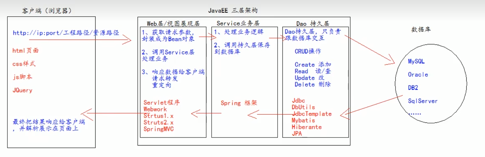

# 4. xml

xml是可扩展的标记性语言

xml可用于：

- 保存数据，并且这些数据具有自我描述性

  ```xml
  <!-- 
  比如保存两个Student类型的对象
  Student[id=1, name="张三"]
  Student[id=2, name="李四"]
  -->
  
  <students>
      <student>
          <id>1</id>
          <name>张三</name>
      </student>
      <student>
          <id>2</id>
          <name>李四</name>
      </student>
  </students>
  ```

- 作为项目的配置文件

- 作为网络传输数据的格式（现在以json格式为主）

## 4.1 xml文件格式

### 4.1.1 文档声明

```xml
<?xml version="1.0" encoding="UTF-8"?>
```

- version——使用的xml的版本
- encoding——编码方式

### 4.1.2 注释

和html注释一样

```xml
<!-- 注释 -->
```

### 4.1.3 元素（标签）

xml的元素，指 开始标签到结束标签的部分（包含开始和结束标签），格式和html中的标签很类似

元素中可包含子元素、文本，元素可以拥有属性

xml文档必须有且只有一个根元素 （根元素就是顶级元素，即没有父标签的元素）

```xml
<?xml version="1.0" encoding="UTF-8"?>

<books> <!-- 根元素，有且只有一个 -->
    <book sn="SN123124234"> <!-- 元素中可以有属性 -->
        <name>时间简史</name>
        <author>霍金</author>
        <price>75</price>
    </book>
        <book sn="SN123124233">
        <name>时间简史</name>
        <author>霍金</author>
        <price>75</price>
    </book>
    <!-- xml中可以有单行元素 -->
	<book sn="SN1232342" name="Linux" author="Linus" price="123" />
</books>
```

### 4.1.4 文本区域（CDATA区）

xml中有很多特殊符号，当内容中有很多特殊符号时转义起来比较麻烦

此时可以将文本内容放在CDATA区中，告诉xml编译器这是纯文本内容不用解析

格式为`<![CDATA[要放置的文本]]>`

```xml
<books>
    <![CDATA[
		<<<<<<<这里的内容不用解析>>>>>>>>>>>>
	]]>
</books>
```

## 4.2 xml文件解析

xml和html一样是标记型文档，可以使用w3c组织制定的dom技术来解析，即将每个元素（标签）都解析为一个dom对象

**解析技术：**

- dom：w3c组织制定

- SAX：（Simple API for XML）是sun公司在jdk5对dom解析技术的升级
- jdom：在dom基础上进行封装
- dom4j：对jdom进行封装
- pull：用于Android手机开发

### 4.2.1 dom4j解析

[下载](https://dom4j.github.io/)dom4j的jar包  dom4j-version.jar

以解析下面xml文件为例

```xml
<?xml version="1.0" encoding="UTF-8"?>

<books> <!-- 根元素，有且只有一个 -->
    <book sn="SN123124234"> <!-- 元素中可以有属性 -->
        <name>时间简史</name>
        <author>霍金</author>
        <price>75</price>
    </book>
        <book sn="SN123124233">
        <name>时间简史</name>
        <author>霍金</author>
        <price>75</price>
    </book>
    <!-- xml中可以有单行元素 -->
	<book sn="SN1232342" name="Linux" author="Linus" price="123" />
</books>
```

**使用流程：**

1. 将jar包放入项目路径中并add as Library导入项目

2. 创建相应的book类

   ```java
   public book {
       String SN;
       String name;
       String author;
       double price;
       // 提供空参构造器和全参构造器
       // 提供get/set方法
       // 提供toString方法
   }
   ```

3. 创建saxReader对象

   ```java
   SAXReader saxReader = new SAXReader();
   ```

4. 读取xml配置文件生成Document对象

   ```java
   Document document = saxReader.read("./books.xml");
   ```

5. 通过Document对象获取根元素

   即获取\<books>标签

   ```java
   Element rootElement = document.getRootElement();
   ```

6. 通过根元素获取子元素

   ```java
   // 有多个子元素时使用elements
   List<Element> books = rootElement.elements("book"); // 这里是元素标签名
   
   // 只有一个子元素时使用element
   Element book = rootElement.element("book");
   
   // asXML可以将标签地xml源代码原封不动地转化为字符串
   String xmlBook = book.asXML();
   ```

7. 遍历子元素，转化为相应类的对象

   ```java
   for (Element book : bookd) {
       // 先获取子元素，再获取元素中的文本内容
       Element nameElement = book.element("name"); // 获取子元素 - name标签对象
       String bookName = nameElement.getText(); // 获取标签对象中的文本内容
       
       // 也可以直接获取子元素中的文本内容
       String priceText = book.elementText("price");
       String authorText = book.elementText("author");
       
       // 获取标签中的属性
       String sn = book.attributeValue("sn");
       // 根据这些值创建bookd
       Book book = new Book(bookName, priceText, authorText, sn);
   }
   ```


# 5. Tomcat服务器

Tomcat是Apace提供的免费web服务器

## 5.0 JavaEE 三层架构

分层的目的是为了解耦，降低代码的耦合度，方便项目后期的维护和升级



根据这个分层结构，需要在工程中创建以下包

- web层

  com.sazer.web/servlet/controller —— Servlet程序

- service层

  com.sazer.service —— service接口包

  com.sazer.service.impl —— service接口实现包

- dao持久层（和数据库交互）

  com.sazer.dao —— Dao接口包

  com.sazer.dao.impl —— Dao接口实现包

- 实体bean对象 —— 在web层Servlet程序中将客户端数据封装为bean对象

  com.atguigu.pojo/entity/domain/bean

- 测试包

  com.sazer.test/junit

- 工具类

  com.sazer.utils

## 5.1 安装和启动

**安装**

在[官网下载](https://tomcat.apache.org/whichversion.html)需要版本的压缩包，直接解压到想要安装的目录即完成安装

目录介绍

- bin：存放Tomcat服务器的可执行程序
- conf：存放配置文件
- lib：存放jar包，Tomcat提供给java的jar包
- logs：Tomcat服务器运行时输出的日志
- temp：用于存放Tomcat运行时产生的临时数据
- webapps：存放部署的web工程
- works：Tomcat工作目录，用来存放Tomcat运行时jsp翻译为Servlet的源码，和Session钝化的目录

**启动**

- 找到Tomcat目录下的bin目录下的startup.bat文件，双击即可启动（如果出现命令行窗口一闪而过，是因为没有配置JAVA_HOME环境变量）
- 命令行启动：打开命令行定位到Tomcat bin目录下， 输入 `catalina run`即可启动 （这种方式如果启动失败会显示错误信息）

启动之后打开浏览器输入`localhost:8080`，显示Tomcat的欢迎页面即为启动成功

**关闭**

- 直接关闭启动Tomcat的命令行窗口
- 双击bin目录下的shutdown.bat

**修改Tomcat默认端口号**

Tomcat默认的端口号是8080

打开tomcat目录/conf/server.xml，找到Connector标签，修改里面的port属性即可

修改完端口号后重启Tomcat服务器

## 5.2 部署web工程

浏览器访问时，如果只输入`https://ip:port/`默认访问`webapps/ROOT`文件夹

当访问一个项目时，如果没有指定资源名，默认访问项目路径中的`index.html`

### 5.2.1 直接拷贝项目工程目录

之前提到tomcat目录下的webapps文件夹用于存放部署的web工程，因此可以直接把工程目录拷贝到webapps文件夹里实现部署

访问时输入`localhost:8080`后会进入webapps目录，在地址中继续输入目录路径即可访问到指定页面，比如`localhost:8080/docs/aio.html`

### 5.2.2 通过配置文件

在Tomcat目录下`./conf/Catalina/localhost`创建配置文件，名字可以任意取

```xml
<Content path="/123" docBase="E:\book">
```

### 5.2.3 IDEA部署

**配置服务器**

File - Settings - Build,Execution,Deployment - Application Servers - 添加（加号） - Tomcat Server - 选择Toncat Home（只用选择到Tomcat根目录即可，不用选择bin目录）

**创建Web项目**

新版Idea没有Java EE选项需要修改注册表：打开idea，按下alt+ctrl+shift+/ 组合键，选择Register注册表 - 找出javaee-legacy.project.wizard 并选中

创建一个项目，右键项目名 - New module - Java EE（Legacy） - 选择Application Server，在Additional Libearies and Frameworks中勾选 Web Application ，并在下方选中Create web.xml - next - 设置Project name

**项目目录说明**

- src：src目录存放编写的Java源代码

- web：存放web工程的资源文件

  比如：html页面，css文件，js文件等

  WEB-INF：受服务器保护的目录，浏览器无法直接访问到此目录的内容

  - lib目录：默认没有，建议创建一个，用于存放第三方jar包
  - web.xml：整个web工程的配置部署描述文件，可以在这里配置很多web工程的组件

**启动配置说明**

在右上角启动按钮的旁边打开Edit Configuration

- Server

  URL表示通过IDEA启动浏览器之后自动输入的网址（一般是本工程的网址）

  On 'Update' action ：热部署，即工程文件发生变化之后执行什么操作

  - Update resources
  - Update classes and resources
  - Redeploy
  - Restart server：重启Tomcat服务器

- Deployment

  可以在这里添加多个server，即启动Tomcat服务器之后部署多个工程

  Application context：修改工程的地址，即输入`ip:port`之后再输入`/address`能访问到此工程

# 6. Servlet

Servlet是JavaEE规范（即接口）之一，运行在服务器上，可以接收客户端发送过来的请求，并响应给客户端

## 6.1 实现servlet程序

### 6.1.1 实现Servlet接口

**实现过程**

1. 创建一个类实现Servlet接口

   创建`HelloServlet.java`文件

2. 实现service方法

   service方法专门用于处理请求和相应

   ```java
   public class HelloServlet implements Servlet {
       @Override
       public void service(ServletRequest servletRequest, 
                          ServletResponse servletResponse) 
           throws servletException, IOException {
           sout("Hello Servlet被访问了");
       }
   }
   ```

3. 配置xml文件

   ```xml
   <?xml version="1.0" encoding="UTF-8"?>
   <web-app>
       <!-- 给Tomcat配置Servlet程序 -->
       <servlet>
           <!-- 给Servlet程序起一个别名，一般是类名 -->
           <servlet-name>HelloServlet</servlet-name>
           <!-- Servlet程序的全类名 -->
           <servlet-class>com.sazer.servlet.HelloServlet</servlet-class>
       </servlet>
       
       <!-- 给servlet程序配置访问地址 -->
       <servlet-mapping>
           <!-- 给哪个servlet程序配置地址 -->
           <servlet-name>HelloServer</servlet-name>
           <!-- 对应的地址 -->
           <!--
   			/ 表示工程路径，即 ip:port/工程路径
   			hello 表示servlet程序的地址
   			通过 ip:port/工程路径/hello 即可访问到HelloServlet程序的service方法
   		-->
           <url-pattern>/hello</url-pattern>
       </servlet-mapping>
   </web-app>
   ```


**客户端访问时执行顺序**

当客户端访问servlet时

1. 访问构造器HelloServlet
2. 执行init函数

以上两步只在第一次访问时才会执行

3. 执行service函数

   这一步每次访问都会执行

4. web工程停止时，执行destroy销毁

```java
public class HelloServlet implements Servlet {

    public HelloServlet() {
        
    }

    @Override
    public void init(ServletConfig servletConfig) throws ServletException {

    }

    @Override
    public ServletConfig getServletConfig() {
        return null;
    }

    @Override
    public void service(ServletRequest servletRequest, ServletResponse servletResponse) throws ServletException, IOException {

    }

    @Override
    public String getServletInfo() {
        return null;
    }

    @Override
    public void destroy() {

    }
}
```

**处理get/post请求**

ServletRequest中提供了getMethod方法可以用来获取此次请求类型，但是ServletRequest是一个接口，因此要类型转化为实现类来使用

```java
@Override
public void service(ServletRequest servletRequest, 
                    ServletResponse servletResponse) 
    throws ServletException, IOException {
    
    HttpServletRequest hsr = (HttpServletRequest) servletRequest;
    String method = hsr.getMethod();
    if ("GET".equals(method)) {
        System.out.println("收到get请求");
    } else if ("POST".equals(method)) {
        System.out.println("收到post请求");
    }
    
}
```

### 6.1.2 继承HttpServlet类

在实际开发中一般使用这种方法 

1. 编写一个类继承HttpServlet类

2. 根据业务需要重写doGet或doPost方法

   ```java
   public class HelloServlet extends HttpServlet {
       @Override
       protected void doGet(HttpServletRequest req, 
                           HttpServletResponse resp)
           throws ServletException, IOException{
           
           sout("收到get请求时调用");
       }
       
       @Override
       protected void doPost(HttpServletRequest req, 
                           HttpServletResponse resp)
           throws ServletException, IOException{
           
           sout("收到post请求时调用");
       }
   }
   ```

3. 到web.xml中配置Servlet程序访问地址

### 6.1.3 用idea创建Servlet程序

自动创建的Servlet程序也是采用继承HttpServlet类的形式

右键src - new - Servlet，在弹出的New Servlet窗口中

- Name：要创建的Servlet程序的类名
- Package：要创建到哪个包下
- Class：创建Servlet程序的全类名

- Create Java EE 6+ annotated class
  - 勾选的话会用注解的方式配置
  - 不勾选的话用web.xml文件配置，推荐这个方式

点击OK，然后会在web.xml文件中自动配置\<servlet>，再手动配置\<servlet-mapping>即可

### 6.1.4 web.xml配置文件

每个web工程对应一个web.xml配置文件，在配置文件中可以配置

- 各个servlet程序的访问地址，各个servlet程序中的init-param

- 整个web工程的context参数 context-param

  每个context-param标签中只能有一组param参数

```xml
<?xml version="1.0" encoding="UTF-8"?>
<web-app>
    <!-- 整个web工程的context参数 -->
    <context-param>
        <param-name>user</param-name>
        <param-value>root</param-value>
    </context-param>
    
    <context-param>
        <param-name>password</param-name>
        <param-value>123456</param-value>
    </context-param>
    
    <!-- 给Tomcat配置Servlet程序 -->
    <servlet>
        <!-- 给Servlet程序起一个别名，一般是类名 -->
        <servlet-name>HelloServlet</servlet-name>
        <!-- Servlet程序的全类名 -->
        <servlet-class>com.sazer.servlet.HelloServlet</servlet-class>
        
        <!-- 初始化参数，可以有多组 -->
   		<init-param>
            <!-- 参数名 -->
            <param-name>username</param-name>
            <!-- 参数值 -->
            <param-value>root</param-value>       
            <param-name>url</param-name>
            <param-value>jdbc:mysql://localhost/test</param-value>
    	</init-param>
    </servlet>    
    
    <!-- 给servlet程序配置访问地址 -->
    <servlet-mapping>
        <!-- 给哪个servlet程序配置地址 -->
        <servlet-name>HelloServer</servlet-name>
        <!-- 对应的地址 -->
        <!--
			/ 表示工程路径，即 ip:port/工程路径
			hello 表示servlet程序的地址
			通过 ip:port/工程路径/hello 即可访问到HelloServlet程序的service方法
		-->
        <url-pattern>/hello</url-pattern>
    </servlet-mapping>
</web-app>
```

## 6.2 Servlet继承体系

查看Servlet源码需要在[官网](https://tomcat.apache.org/download-80.cgi)下载Tomcat source code distributions，下载下来为`apache-tomcat-version-src-zip`

实现servlet程序，选中 Servlet 按下ctrl+B，


1. Servlet接口

   负责定义Servlet程序的访问规范

2. GenericServlet类 --> 实现了Servlet接口

   对接口做了很多空实现

   并持有一个ServletConfig类的引用，并对ServletConfig的使用做一些方法

3. HttpServlet类 --> 继承于GenericServlet类

   主要是实现了service方法，实现各种请求的分发处理

   ```java
   protected void service(HttpServletRequest req, HttpServletResponse resp) throws ServletException, IOException {
   	// 获取请求类型
       String method = req.getMethod();
   	
       // 根据请求类型分发请求
       if (method.equals(METHOD_GET)) {
           ...
   		doGet(req, resp);
           ...
       } else if (method.equals(METHOD_HEAD)) {
           long lastModified = getLastModified(req);
           maybeSetLastModified(resp, lastModified);
           doHead(req, resp);
   
       } else if (method.equals(METHOD_POST)) {
           doPost(req, resp);
   
       } else if (method.equals(METHOD_PUT)) {
           doPut(req, resp);
   
       } else if (method.equals(METHOD_DELETE)) {
           doDelete(req, resp);
   
       } else if (method.equals(METHOD_OPTIONS)) {
           doOptions(req, resp);
   
       } else if (method.equals(METHOD_TRACE)) {
           doTrace(req, resp);
   
       } else {
   		// 抛出异常
           String errMsg = lStrings.getString("http.method_not_implemented");
           Object[] errArgs = new Object[1];
           errArgs[0] = method;
           errMsg = MessageFormat.format(errMsg, errArgs);
   
           resp.sendError(HttpServletResponse.SC_NOT_IMPLEMENTED, errMsg);
       }
   }
   ```

   在HttpServlet类中的doGet和doPost等方法的实现都只有抛出异常——不支持该类型请求。即如果自定义的类不重写类型请求的处理方法，接收到对应类型的请求时就提示不支持该类型。

4. 自定义Serlvet程序

   根据自己的业务重写各种请求的处理方法

## 6.3 Servlet中一些实用类

### 6.3.1 ServletConfig

Servlet程序的配置信息类，即用于获取web.xml中的配置信息

**获取ServletConfig对象**

每个Servlet程序都有一个Servlet Config对象，由Tomcat负责创建这个对象

- 可以通过init函数获取，在init函数的参数中会传入一个ServletConfig对象

  重写init方法之后，一定要调用父类init方法，并将servletConfig对象传进去。父类GenericServlet中的init方法负责 给GenericServlet中的属性servletConfig赋值，以供getServletConfig函数获取servletConfig对象

```java
class HelloServlet extends HttpServlet {
    
    @Override
    public void init(ServletConfig servletConfig) 
        throws ServletException {
        super(servletConfig);
    }
}
```

- 在其他地方可以通过getServletConfig获取

  这里实际上是从父类GenericServlet中获取，父类中有一个成员属性保存了ServletConfig对象

```java
@Override
protected void doGet(...) {
    ServletConfig servletConfig = getServletConfig();
}
```

**ServletConfig对象的作用**

1. 获取Servlet程序的别名，即web.xml文件中配置的 servlet-name的值

   ```java
   String name = servletConfig.getServletName();
   ```

2. 获取初始化参数 init-param

   要获取首先要在web.xml文件的对应Servlet程序的Servlet标签中添加

   ```xml
   <servlet>
       <servlet-name>HelloServlet</servlet-name> <!-- Servlet程序别名 -->
       <servlet-class>com.sazer.servlet.HelloServlet</servlet-class>
       
       <!-- 初始化参数，可以有多组 -->
       <init-param>
           <!-- 参数名 -->
           <param-name>username</param-name>
           <!-- 参数值 -->
           <param-value>root</param-value>
           
           <param-name>url</param-name>
           <param-value>jdbc:mysql://localhost/test</param-value>
       </init-param>
   </servlet>
   ```

   ```java
   // 获取初始化参数 username的值
   String username = servletConfig.getInitParameter("username");
   // 获取初始化参数 url
   String url = servletConfig.getInitParameter("url");
   ```

3. 获取ServletContext对象

   ```java
   servletConfig.getServletContext();
   ```

### 6.3.2 ServletContext

**概念**

ServletContext是一个接口，表示Servlet上下文对象

一个web工程中只有一个ServletContext对象实例

ServletContext是一个域对象，即可以存取数据

**获取ServletContext对象**

- 使用servletConfig对象调用getServletContext();

  ```java
  ServletContext context = getServletConfig().getServletContext();
  ```

- 直接调用getServletContext()；函数

  ```java
  ServletContext context = getServletContext();
  ```

  这是因为在父类GenericServlet中重写了getServletContext方法，实际上和上面的方法一样

  ```java
  @Override
  public ServletContext getServletContext() {
      return getServletConfig().getServletContext();
  }
  ```

**作用**

1. 获取web.xml中配置的上下文参数 context-param

   （以6.1.4中web.xml文件为例）

   ```java
   String username = context.getInitParameter("username"); // root
   String pwd = context.getInitParameter("password"); // 123456
   ```

2. 获取当前的工程路径，格式为`/工程路径`

   即在浏览器输入 `ip:port/工程路径`访问到当前web工程（访问到的web文件夹）

   ```java
   context.getContextPath();
   ```

3. 获取工程部署后在服务器硬盘上的绝对路径

   参数`/`表示获取到工程根目录的绝对路径，即工程中的web文件夹的路径

   ```java
   context.getRealPath("/");
   // D:\CS_Source\JavaSource\JavaWeb\out\artifacts\webTest_war_exploded\
   ```

4. 存取数据（类似于map一样使用）

   由于一个web工程只有一个ServletContext对象，因此在一个Serlvet程序中添加的数据在其他Servlet程序中都能取到。

   重新部署或者重启服务器都会使这些数据失效

   ```java
   // 存数据
   context.setAttribute("key1", "value1");
   // 取数据
   context.getAttribute("key1");
   // 删除数据
   context.removeAttribute("key1");
   ```

## 6.4 HttpServletRequest类

service方法中有两个参数，一个是HttpServletRequest，一个是HttpServletResponse

当有请求进入Tomcat服务器时，服务器就会把请求过来的HTTP协议中的信息解析好并封装到HttpServletRequest对象中，然后传递到service方法的参数中供我们使用

### 6.4.1 常用方法

重写service或者doGet/doPost方法之后，在参数中有一个 HttpServletRequest类型的req对象，这个对象中封装了一些方法

- getRequestURI —— 获取请求的资源路径

  ```java
  String URI = req.getRequestURI(); // 只返回ip:port/ 斜杠后面的部分，即资源路径
  ```

- getRequestURL —— 获取请求的统一资源定位符（绝对路径）

  ```java
  String URL = req.getRequestURL(); // 返回完整路径 ip:port/资源路径
  ```

- getRemoteHost —— 获取客户端ip地址

  当在本机访问时，返回127.0.0.1

  其他客户端访问时返回客户端的真实ip

  ```java
  String host = req.getRemoteHost();
  ```

- getHeader —— 获取请求头中各种信息

  参数中填写需要请求头中的哪个值

  ```java
  String user_agent = req.getHeader("User-Agent");
  ```

- getMethod —— 获取请求的方式（GET/POST）

  ```java
  String method = req.getMe
  ```

- getParameter —— 获取客户端传来的参数

  函数中的参数为 客户端传来参数的name

- getParameterValues —— 当参数值有多个时使用这个

  返回一个String数组

  ```html
  <!-- 表单示例 -->
  <form action="http://localhost:8080/servlet/HelloServlet" method="post">
      用户名：<input type="text" name="username"><br/>
      密码：<input type="password" name="password"><br/>
      <!-- 多选框 -->
      兴趣爱好：<input type=checkbox name="hoppy" value="cpp">C++
      <input type=checkbox name="hoppy" value="java">Java
      <input type=checkbox name="hoppy" value="js">JavaScript<br/>
      <input type="submit">
  </form>
  ```

  ```java
  String username = req.getParameter("username");
  String password = req.getParameter("password");
  String[] hobbies = req.getParameterValues("hobby");
  ```

- setCharacterEncoding —— 解决post请求的中文乱码问题

  需要在获取所有请求参数之前设置才有效

  ```java
  req.setCharacterEncoding("UTF-8");
  ```

### 6.4.2 请求转发

请求转发指：服务器收到请求之后，从一个资源转到另一个资源

比如一个功能需要先执行Servlet1再执行Servlet2，客户端的请求传到Servlet1之后，Servlet1再将请求转发到Servlet2程序就叫请求转发

两个Servlet程序之间传递消息要使用域数据

**Servlet1**

```java
public class Servlet1 extends HttpServlet {
    @Override
    protected void doGet(HttpServletRequest req, 
                         HttpServletResponse resp)
        throws ServletException, IOException {
        
        // 客户端发来的数据
        String username = req.getParameter("username");
        
        // 不同Servlet程序之间通信使用域数据
        req.setAttribute("key1", "Servlet1要传的数据");
        
        // 请求转发
        // 这里的地址必须以 / 打头，/ 表示 http://ip:port/工程名/ ，映射到web工程的web目录
        RequestDispatcher requestDispatcher = req.getRequestDispatcher("/servlet2");
        requestDispatcher.forward(req, resp);
    }
}
```

**Servlet2**

```java
public class Servlet2 extends HttpServlet {
    @Override
    protected void doGet(HttpServletRequest req, 
                         HttpServletResponse resp)
        throws ServletException, IOException {
        
        // 也可以直接获取客户端发来的数据
        String username = req.getParameter("username");
        
        // servlet1传来的数据
		String value1 = req.getAttribute("key1");
    }
}
```

特性：

- 请求转发 对客户端来说不可见，即客户端认为这是一次请求
- 可以转发到WEB-INF目录中（这个目录是受服务器保护的，无法直接访问）
- 转发路径必须以/打头，因此只能转发到工程内部，不能转发到外部服务器

## 6.5 HttpServletResponse类

和HttpServletRequest类一样，当客户端发送请求时，服务器会生成一个HttpServletResponse类供我们使用

该类用于表示所有服务器响应回客户端的信息，可以用它来设置返回给客户端的信息

可以用于：

- 设置响应头

  ```java
  resp.setHeader("Content-Type", "test/html; charset=UTF-8");
  ```

- 给客户端回传数据

  - 字节流数据：用于传输二进制文件，客户端请求下载时使用

    ```java
    resp.getOutputStream();
    ```

  - 字符流数据：给客户端回传字符串

    ```java
    resp.getWriter();
    ```

### 6.5.1 往客户端回传数据

**字符流数据**

1. 获取流对象

   ```java
   PrintWriter writer = resp.getWriter();
   ```

2. 向客户端回传数据

   ```java
   writer.write("123456");
   writer.println("123456");
   ```

3. 解决中文乱码问题

   需要同时改变服务器端和客户端的编码方式

   ```java
   // 改变服务器端编码方式
   resp.setCharacterEncoding("UTF-8");
   // 通过响应头改变客户端编码方式
   resp.setHeader("Content-Type", "test/html; charset=UTF-8");
   ```

   还有一种写法，可以一行代码同时设置服务器和客户端（这个方法必须在获取流对象之前使用才有效）

   ```java
   resp.setContentType("text/html; charset=UTF-8");
   ```

### 6.5.2 请求重定向

当客户端请求的资源已经被废弃并移动至新的地址时，服务器端需要告诉客户端新地址在哪里并让客户端重新访问，这个就是处理请求重定向请求

首先需要返回响应码302表示请求重定向，然后需要在响应头Location中告诉新地址

**示例**

Response1已经废弃，改用Response2响应客户端请求

```java
public class Response1 extends HttpServlet {
    @Override
    protected void doGet(HttpServletRequest req, 
                         HttpServletResponse resp)
        throws ServletException, IOException {
        
		// 设置响应状态码302
        resp.setStatus(302);
        
        // 在响应头中Loaction字段设置新地址
        resp.setHeader("Location", "http://localhost:8080/servlet/Response2");
    }
}
```

第二种方法

```java
resp.setRedirect("http://localhost:8080/servlet/Response2");
```

**特点**

- 对于客户端来说，这是两次不同的请求
- 不能访问WEB-INF中的资源
- 可以访问服务器外部的资源
