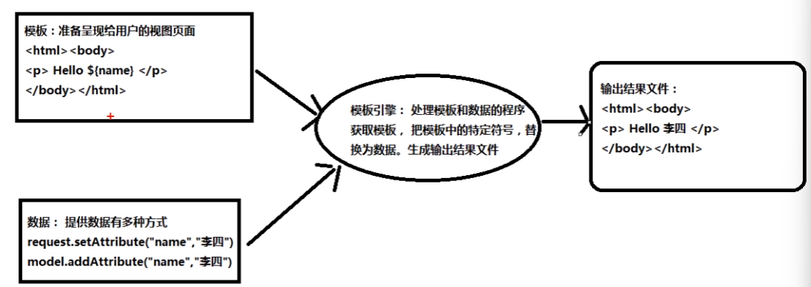
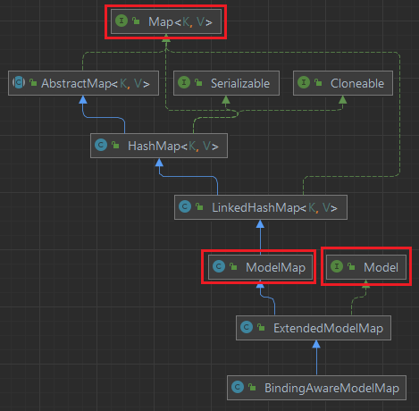

# 零、前置知识

## 0.1 thymeleaf

thymeleaf是模板引擎，用于解析模板，用于替代过时的jsp技术

以jsp页面为例，可以理解为jsp页面就是模板，域数据（request、session等域）就是数据，Tomcat服务器就是模板引擎，会把jsp页面作解析，将数据代入

是服务器端模板引擎，在服务器端获取模板和数据，生成结果输出给浏览器

模板可以是html、xml等格式



使用时需要添加依赖

```xml
<!-- https://mvnrepository.com/artifact/org.thymeleaf/thymeleaf -->
<dependency>
    <groupId>org.thymeleaf</groupId>
    <artifactId>thymeleaf</artifactId>
    <version>3.0.11.RELEASE</version>
</dependency>
```

**String作为模板案例**

```java
// 创建模板引擎
TemplateEngine engine = new TemplateEngine();
// 准备模板（以字符串为例）
String inStr = "<input type='text' th:value='${name}' />";
// 准备数据
Context context = new Context();
context.setVariable("name", "张三");
// 处理模板和数据
String html = engine.process(inStr, context);
System.out.println("html" + html);
```

**文件作为模板案例**

写一个html文件

```html
<!DOCTYPE html>
<html lang="en">
<head>
    <meta charset="UTF-8">
    <title>ThymeleafTest</title>
</head>
<body>
    <input type="text" th:value="${name}" />
</body>
</html>
```

使用模板解析

```java
// 创建模板引擎
TemplateEngine engine = new TemplateEngine();
// 创建resolver
ClassLoaderTemplateResolver resolver = new ClassLoaderTemplateResolver();
// 设置引擎使用resolver
engine.setTemplateResolver(resolver);
// 指定数据
Context context = new Context();
context.setVariable("name", "里斯");

// 处理模板
String html = engine.process("main.html", context);
System.out.println(html);
```

**设置模板前后缀**

可以指定模板文件路径的前后缀，这样在处理模板时就可以只写文件名，方便操作

```java
// 创建模板引擎
TemplateEngine engine = new TemplateEngine();
// 创建并配置resolver
ClassLoaderTemplateResolver resolver = new ClassLoaderTemplateResolver();
// 设置前后缀
resolver.setPrefix("templates/");
resolver.setSuffix(".html");
// 设置引擎使用resolver
engine.setTemplateResolver(resolver);
// 指定数据
Context context = new Context();
context.setVariable("name", "里斯");

// 处理模板
String html = engine.process("main", context);
System.out.println(html);
```

此时模板文件写的是main，实际上完整路径为 `/template/main.html`

**和Spring一起使用**

需要引入Thymeleaf spring5依赖，之后在spring配置文件中创建ThymeleafViewResolver对象并进行属性注入

```xml
<bean id="viewResolver" class="org.thymeleaf.spring5.view.ThymeleafViewResolver">
    <property name="order" value="1" />
    <property name="characterEncoding" value="UTF-8" />
    <property name="templateEngine">
        <bean class="org.thymeleaf.spring5.SpringTemplateEngine">
            <property name="templateResolver">
                <bean class="org.thymeleaf.spring5.templateresolver.SpringResourceTemplateResolver">
                    <!-- 视图前缀 -->
                    <property name="prefix" value="/WEB_INF/templates" />
                    <!-- 视图后缀 -->
                    <property name="suffix" value=".html" />
                    <property name="templateMode" value="HTML5" />
                    <property name="characterEncoding" value="UTF-8" />
                </bean>
            </property>
        </bean>
    </property>
</bean>
```

# 一、QuickStart

## 1.1 SpringMVC简介

**MVC模型**

MVC是一种软件架构的思想，将web工程分为 Model View Controller三个部分

- Model，模型层

  指工程中的JavaBean，作用是处理数据

  JavaBean分两类

  - 实体类Bean：即Bean或者Pojo包，用于存储数据，如User类、Student类等
  - 业务处理Bean：即Service和Dao对象，用于处理业务逻辑和与数据库交互

- View，视图层

  工程中的html或jsp页面，用于与用户交互、展示数据

- Controller，控制层

  工程中的servlet，用于接收浏览器发来的请求和响应浏览器

**三层架构**

三层架构指：

- 表述层（表示层）

  即html、jsp页面和servlet程序

- 业务逻辑层

  即service层

- 数据访问层

  即DAO层

**SpringMVC**

SpringMVC是Spring的一个子项目，是为**表述层**（前台页面+Servlet程序）开发的一整套完备的解决方案，也就是说SpringMVC用于处理浏览器发来的请求以及返回给浏览器的响应

SpringMVC是Spring家族原生产品，因此在配置文件、IOC容器等方面都相同

## 1.2 HelloWorld项目

**执行流程**

1. 浏览器发送请求，服务器接收到请求后，如果请求地址符合 配置的前端控制器DispatcherServlet的url-patter，则该请求就会被前端控制器DispatcherServlet处理
2. DispatcherServlet会读取SpringMVC的配置文件，通过扫描组件找到控制器Controller类
3. 之后会将请求地址和控制器中@RequestMapping注解的value属性值进行匹配，如果匹配成功，则根据注解所在的方法进行请求映射
4. 匹配成功根据注解的方法得到对应的视图名称，再加上前缀和后缀组成视图路径，通过Thymeleaf对视图进行渲染，最终将浏览器转发到视图所对应的页面

**环境配置**

1. 导入依赖

   需要导入spring-webmvc、logback-classic日志依赖、servlet、thymeleaf spring5依赖

2. 添加web.xml配置文件

   在pom.xml中把项目打包方式改为war

   Project Structure - Modules - 选中当期要修改的module - Web - 右侧Deployment Descriptors 点击加号 - 添加web.xml，注意默认路径是不对的，需要修改至 `src/main/webapp/WEB-INF`下

3. 配置SpringMVC的前端控制器

   在web.xml中配置SpringMVC的前端控制器servlet程序 DispatcherServlet，来对浏览器发送的请求进行统一处理

   - 默认配置方式

     使用默认配置时，SpringMVC的配置文件会创建在WEB-INF目录下，名称为`<serlvet-name>-servlet.xml`，在此例中为`springMVC-servlet-xml`

     ```xml
     <servlet>
         <servlet-name>springMVC</servlet-name>
         <servlet-class>org.springframework.web.servlet.DispatcherServlet</servlet-class>
     </servlet>
     <servlet-mapping>
         <servlet-name>springMVC</servlet-name>
         <url-pattern>/</url-pattern>
     </servlet-mapping>
     ```

     url-pattern中的 / 表示浏览器发来的除了jsp以外的所有请求，都交给SpringMVC来处理。而jsp请求要交给对应的jsp页面处理（因为jsp页面也是一种servlet程序）

   - 扩展配置方式

     在Maven工程中配置文件都应该在resources文件夹下

     所以可以使用 init-param 标签来配置 配置文件的位置和名称，需要现在resources文件夹下创建好spring配置文件

     可以使用`<load-on-startup>`标签来指定服务器启动时加载spring配置文件，避免第一次访问时间过长

     ```xml
     <servlet>
         <servlet-name>springMVC</servlet-name>
         <servlet-class>org.springframework.web.servlet.DispatcherServlet</servlet-class>
         <!--配置springMVC配置文件的位置和名称-->
         <init-param>
         	<param-name>contextConfigLocation</param-name>
             <param-value>classpath:springMVC.xml</param-value>
         </init-param>
         <load-on-startup>1</load-on-startup>
     </servlet>
     <servlet-mapping>
         <servlet-name>springMVC</servlet-name>
         <url-pattern>/</url-pattern>
     </servlet-mapping>
     ```

4. 创建SpringMVC控制器

   就是一个普通Java类，创建在`com.sazer.*.controller`包下

   ```java
   package com.sazer.mvc.controller;
   
   @Controller // 通过注解创建bean对象（还需要开启组件扫描）
   public class HelloController {
       
   }
   ```

   开启组件扫描

    ```xml
    <context:component-scan base-package="com.sazer.mvc.controller"></context:component-scan>
    ```

5. 配置Thymeleaf视图解析器

   在springMVC.xml配置文件中创建ThymeleafViewResolver Bean对象，并完成属性注入
   
   ```xml
   <bean id="viewResolver" class="org.thymeleaf.spring5.view.ThymeleafViewResolver">
       <property name="order" value="1" />
       <property name="characterEncoding" value="UTF-8" />
       <property name="templateEngine">
           <bean class="org.thymeleaf.spring5.SpringTemplateEngine">
               <property name="templateResolver">
                   <bean class="org.thymeleaf.spring5.templateresolver.SpringResourceTemplateResolver">
                       <!-- 视图前缀 -->
                       <property name="prefix" value="/WEB-INF/templates/" />
                       <!-- 视图后缀 -->
                       <property name="suffix" value=".html" />
                       <property name="templateMode" value="HTML5" />
                       <property name="characterEncoding" value="UTF-8" />
                   </bean>
               </property>
           </bean>
       </property>
   </bean>
   ```
   
   这里的前缀设置为 `/WEB-INF/templates/` ，即所有的html页面都将放在 `/webapp/WEB-INF/templates/`文件夹下
   
6. 配置Tomcat服务器的启动配置

**访问首页**

1. 在`/webapp/WEN-INF/templates/`文件夹下创建index.html页面

   注意要加上thymeleaf的名称空间 `xmlns:th="http://www.thymeleaf.org"`

   ```html
   <!DOCTYPE html>
   <html lang="en" xmlns:th="http://www.thymeleaf.org">
   <head>
       <meta charset="UTF-8">
       <title>Title</title>
   </head>
   <body>
   <h1>SpringMVC</h1>
   </body>
   </html>
   ```

2. 在控制器中创建请求映射

   注解中的value属性表示浏览器的请求地址，方法返回值表示要映射到的地址

   所以这个方法表示在浏览器访问 `localhost:8080/工程名称/`时，映射到服务器的`WEB-INF/templates/index.html`文件

   ```java
   @Controller // 通过注解创建bean对象（还需要开启组件扫描）
   public class HelloController {
       @RequestMapaping(value = "/")
       public String index(){
           // 返回视图名称
           // 由于配置了前后缀，因此真正地址为 WEB-INF/templates/index.html
           return "index";
       }
   }
   ```

**跳转到指定页面**

1. 在index页面写一个超链接，跳转到target.html

   ```html
   <a th:href="@{/target}">跳转到target页面</a>
   ```

   `@{}`表示将里面的绝对路径前面自动加上工程名称，也就是会被解析为

   `localhost:8080/工程路径/target`

2. 在`WEB-INF/templates/`目录下创建target.html页面

3. 在控制器中创建请求映射

   ```java
   @RequestMapping("/target")
   public String toTarget() {
       return "target";
   }
   ```


# 二、请求处理

请求处理：接收浏览器发来的请求，通过请求的地址映射到相应的处理函数中，经过函数处理之后，再将相应的页面返回给浏览器

## 2.1 请求映射

使用请求映射注解，将浏览器发来的请求的地址和处理该请求的函数做映射

### 2.1.1 @RequestMapping注解

@RequestMapping注解可以放在方法和类上

**方法上**

当浏览器发送的请求等于 @RequestMapping(value = "") 中value属性的值时，映射到对应方法中返回值对应的文件

```java
@Controller // 通过注解创建bean对象（还需要开启组件扫描）
public class HelloController {
    @RequestMapaping(value = "/target")
    public String target(){
        return "target";
    }
}
```

上述配置表示：浏览器访问 `localhost:8080/工程路径/target` 时，服务器映射到 `WEB-INF/templates/target.html`页面

**类上**

先匹配到类上 @RequestMapping 中value的值时，才会进一步去匹配类中方法的该注解属性值

```java
@Controller // 通过注解创建bean对象（还需要开启组件扫描）
@RequestMapping("/hello")
public class HelloController {
    @RequestMapaping(value = "/target")
    public String target(){
        return "target";
    }
}
```

上述配置表示：浏览器访问 `localhost:8080/工程路径/hello/target` 时，服务器映射到 `WEB-INF/templates/target.html`页面

### 2.1.2 注解中的属性

#### value

value属性用于匹配浏览器发来的请求地址，该属性必须设置

类型是字符串类型的数组，只要请求地址满足value属性中任意一个地址，都会匹配到相同的页面

```java
@RequestMapaping(
	value = {"/target1", "/target2"}
)
public String target(){
    return "target";
}
```

表示浏览器访问 `localhost:8080/工程路径/hello/target1` 和  `localhost:8080/工程路径/hello/target2`时，都会映射到target页面 

#### method

匹配请求的请求方式，即GET/POST

如果不设置method属性，说明任何请求方式否能匹配

```java
@RequestMapping(
	value = {"/target1", "/target2"}
    method = {RequestMethod.GET, RequestMethod.POST}
)
public String target(){
    return "target";
}
```

表示浏览器要以GET或POST方式访问指定地址，才能映射到target页面

如果请求地址满足value属性，请求方式不满足method属性，则报错405：Request method 'POST' not supported

除了指定method属性，还提供了一系列派生注解

- @GetMapping：处理get请求的映射
- @PostMapping：处理post请求的映射
- @PutMapping：处理put请求
- @DeleteMapping：处理delete请求

#### params

通过请求参数匹配请求

有四种使用方式

- `params = {"username"}` 请求必须携带参数username
- `params = {"!username"}` 请求必须不能携带参数username
- `params = {"username=admin"}` 请求必须携带参数username，并且username参数值为admin
- `params = {"username!=admin"}` 请求必须携带参数username，并且值不能为admin

该属性中如果写多个要求，表示必须同时满足所有要求才能匹配

请求参数匹配不成功报错400

#### headers

通过请求头信息（Request Headers）匹配请求

使用方式和params相同

请求头信息匹配不成功报错404

### 2.1.3 ant风格模糊匹配地址

除了直接写路径以外，SpringMVC还支持ant风格模糊匹配

ant风格占位符：

- ？：匹配任意单个字符

  ```java
  @RequestMapping("/a?a/testAnt")
  ```

  匹配浏览器地址 `localhost:8080/项目路径/a1a/testAnt` ，两个a中间是任意字符时都可以匹配（必须有字符），但是不能是 `/` （表示一层目录）和 `?` 表示拼接参数

- *：匹配任意0个或多个字符

  ```java
  @RequestMapping("/a*a/testAnt")
  ```

- **：匹配任意一层或多层目录（也可以没有目录）

  ```java
  @RequestMapping("/**/testAnt")
  ```

  注意 ** 只能使用 `/**/`的方式，即放在一层目录中间，前后不能有其他字符

## 2.2 获取请求参数

### 2.2.1 通过原生Servlet获取

需要在控制器方法中加上 HttpServletRequest 参数，即可获取到Servlet中的request对象，并使用该对象调用相应方法获取请求参数

```java
@Controller 
public class ParamController {
    @RequestMapaping(value = "/testServlet")
    public String testServlet(HttpServletRequest request){
        String username = request.getParameter("username");
        String username = request.getParameter("password");
        return "test_param";
    }
}
```

### 2.2.2 通过控制器形参获取

只需要在控制器函数中，加上与请求参数名相同的形参，就可以自动获取请求中对应的参数

```java
@Controller 
public class ParamController {
    @RequestMapaping(value = "/testParam")
    public String testServlet(String username, String password){       
        sout(username + ":" + password);
        return "test_param";
    }
}
```

浏览器请求地址为 `@{/testParam(username='admin', password=123456)}` （thymeleaf写法，相当于`localhost:8080/项目路径/testParam?username=admin&password=123456`）时，就可以自动获得username和password的参数值

POST请求也可以直接用这个方法获取form表单中的数据

**有多个同名参数时**

比如多选框选中多个时，请求参数就为 `hobby=a&hobby=b&hobby=c` 

此时形参可以依旧用String hobby，则得到的结果为`"a,b,c"`

也可以用String[] hobby，得到的结果为`[a, b, c]`

### 2.2.3 @RequestParam/Header/CookieValue注解

这一组注解用于获取浏览器发来的信息，并将对应信息映射到控制器的形参中

该注解只能用于控制器的形参处

**@RequestParam**

@RequestParam中有三个属性

- value：要匹配的请求参数的值

- required：该参数是否必须

  默认为true，表示浏览器请求必须有该参数才能匹配到控制器，否则报错400

  但是如果有defaultValue属性的话也可以不传该参数

- defaultValue：表示浏览器请求如果没有该参数或者该参数值为空字符串，会给该参数一个默认值

```java
@Controller 
public class ParamController {
    @RequestMapaping(value = "/testParam")
    public String testServlet(
        @RequestParam(value = "user_name", required = false, defaultValue = "noName") String username, String password){       
        sout(username + ":" + password);
        return "test_param";
    }
}
```

此时请求地址需要为`@{/testParam(user_name='admin', password=123456)}`，不能为username

**@RequestHeader**

获取请求头信息，将当前请求的对应请求头信息映射到形参

```java
@Controller 
public class ParamController {
    @RequestMapaping(value = "/testParam")
    public String testServlet(@RequestHost(value = "Host") String host){       
        return "test_param";
    }
}
```

属性和用法同RequestParam

**@CookieValue**

获取cookie数据，将cookie数据和控制器方法的形参创建映射关系

属性和用法同@RequestParam

```java
@Controller 
public class ParamController {
    @RequestMapaping(value = "/testParam")
    public String testServlet(@CookieValue("JSESSIONID") String JSESSIONID){       
        return "test_param";
    }
}
```

### 2.2.4 通过POJO获取请求参数

可以在控制器方法的形参位置设置一个类对象类型的形参，此时若浏览器传输的请求参数的参数名和实体类中的属性名一致，那么请求参数就会自动将参数封装为POJO对象并为形参赋值

POJO类：

```java
public class User {
    Integer id;
    String username;
    String password;
    // 构造器，get/set方法，toString方法
}
```

```java
@Controller 
public class ParamController {
    @RequestMapaping(value = "/testPojo")
    public String testServlet(User user){       
        return "test_param";
    }
}
```

浏览器地址`@{/testPojo?id=1&username=Tom&password=123456}`

### 2.2.5 RESTFUL占位符

原始url：`/deleteUser?id=1&username=Tom`

rest方式：`/deleteUser/1/Tom`

由于这种方式只有value没有key，因此不能使用getAttribute的方式获取参数，可以在@RequestMapping注解的value属性中使用占位符获取，并在形参中通过@PathVariable注解获取

```java
@RequestMapping("/testRest/{id}/{username}")
public String testRest(@PathVariable("id") String id, @PathVariable("username") String username) {
    sout(id + username);
    return "success";
}
```

### 2.2.6 解决乱码问题

在原生Servlet中，解决乱码问题需要在doPost/doGet方法中使用`request.setCharacterEncoding("UTF8")`设置编码方式

但是该函数需要放在获取请求参数之前使用才能生效，而在调用SpringMVC的控制器之前SpringMVC已经获取过了参数，因此不能在控制器中调用该函数

由于SpringMVC使用的DispatcherServlet也是一种Servlet，因此应该在Servlet加载之前就设置好编码，所以应该在过滤器Filter中设置编码方式

SpringMVC中提供了相应的编码过滤器来设置编码，因此只需要在web.xml文件中配置即可

**配置过滤器**

在web.xml配置文件中配置过滤器

```xml
<filter>
	<filter-name>CharacterEncodingFilter</filter-name>
    <filter-class>org.springframework.web.filter.CharacterEncodingFilter</filter-class>
    <init-param>
        <!--设置请求编码-->
    	<param-name>encoding</param-name>
        <param_value>UTF-8</param_value>
    </init-param>
    <init-param>
        <!--设置响应编码-->
    	<param-name>forceResponseEncoding</param-name>
        <param_value>true</param_value>
    </init-param>
</filter>
<filter-mapping>
	<filter-name>CharacterEncodingFilter</filter-name>
    <url-patern>/*</url-patern>
</filter-mapping>	
```

在CharacterEncodingFilter源码中，也是使用request.setCharacterEncoding()和response.setCharacterEncoding()来设置请求和响应的编码

## 2.3 域对象共享数据

### 2.3.1 使用原生Servlet

Request域共享数据建议使用SpringMVC方式，Session域共享数据建议使用原生Servlet

**Request域数据**

使用request对象来向域对象中保存数据

```java
@RequestMapping("/testRequestByServlet")
public String testRequestByServlet(HttpServletRequest request) {
    request.setAttribute("username", "Tom");
    return "success";
}
```

之后就可以在转发后的success页面中获取并显示数据

```html
<p th:text="${username}"></p>
```

**Session域**

```java
@RequestMapping("/testSession")
public String testRequestByServlet(HttpSession session) {
    session.setAttribute("username", "Tom");
    return "success";
}
```

thymeleaf中访问session中数据

```html
<p th:text="${session.username}"></p>
```

### 2.3.2 使用ModelAndView对象

ModelAndView包括Model和View两个部分

- Model：用于向请求域共享数据
- View：用于设置视图，实现页面跳转

在方法内创建的ModelAndView对象要返回给前端控制器DispatcherServlet才能被解析

```java
@RequestMapping("/testModelAndView")
public ModelAndView testRequest() {
    ModelAndView mav = new ModelAndView();
    // 向请求域中保存数据
    mav.addObject("username", "Tom");
    // 设置视图，实现页面跳转
    mav.setViewName("success");
    return mav;
}
```

**使用Model实现**

Model就是ModelAndView中的Model模块，有一个单独的Model对象

```java
@RequestMapping("/testModel")
public String testRequest(Model model) {
	model.addAttribute("username", "Tom");
    return "success";
}
```

### 2.3.3 使用map

在形参处创建一个map集合，向map集合中直接插入键值对即可存储到域中

```java
@RequestMapping("/testMap")
public String testRequest(Map<String, Object> map) {
	map.put("username", "Tom");
    return "success";
}
```

### 2.3.4 使用ModelMap

```java
@RequestMapping("/testModelMap")
public String testRequest(ModelMap modelMap) {
	modelMap.addAttribute("username", "Tom");
    return "success";
}
```

### 2.3.5 底层

Map、Model、ModelMap四个对象最终实际上都是创建了BindingAwareModelMap对象



原生Servlet、ModelAndView、Model、Map、ModelMap五种方式最终实际上都是创建了ModelAndView对象

## 2.4 视图

当在控制器中处理完成之后，就需要视图解析器解析视图页面，并将页面返回给浏览器

SpringMVC中的视图接口是View，用来渲染页面，将模型Model中的数据展示给用户

常见视图有：

- 转发视图：InternalResourceView，SpringMVC自带视图
- 重定向视图：RedirectView，SpringMVC自带视图
- JstlView：当工程引入jstl依赖，即使用jsp页面时，自动使用jstlView
- ThymeleafView：当工程中使用的技术为Thymeleaf，并在SpringMVC配置文件中配置Thymeleaf的视图解析器时，会使用ThemyleafView

### 2.4.1 ThymeleafView

当控制器方法中设置的视图名称（即控制器方法返回值）没有任何前缀时，视图名称会被SpringMVC配置文件中所配置的ThymeleafView视图解析器解析，并通过**请求转发**的方式实现跳转

```java
@RequestMapping("/testThymeleaf")
public String testThymeleaf() {
    return "success";
}
```

### 2.4.2 转发视图

由于ThymeleafView也是转发，因此转发视图使用的不多

有时候控制器处理完之后可能需要转发到另一个控制器中，此时如果直接写控制器的地址，依然会被Thymeleaf加上前后缀解析，从而跳转错误。（如果使用的不是Thymeleaf视图，则默认视图就是InternalResourceView）

此时可以使用转发视图InternalResourceView，此时视图名称不会被SpringMVC配置的视图解析器解析，而是会将forward: 前缀去掉，剩余部分作为最终路径进行转发

```java
@RequestMapping("/testForward")
public String testForward() {
    return "forward:/testThymeleaf";
}
```

### 2.4.3 重定向视图

RedirectView

视图名称以 redirect: 为前缀时，创建RedirectView视图，会将前缀去掉，剩余部分通过重定向的方式实现跳转

```java
@RequestMapping("/testRedirect")
public String testRedirect() {
    return "redirect:/testThymeleaf";
}
```

### 2.4.4  视图控制器

当控制器的方法中没有任何业务逻辑，只需要转发到某个页面时，可以通过在SpringMVC配置文件中配置视图控制器来代替控制器方法

使用mvc:view-controller标签，path设置浏览器地址，view-name设置对应的视图名称。下例表示配置首页的访问地址

```xml
<mvc:view-controller path="/" view-name="index"></mvc:view-controller>
```

当配置完视图控制器之后，控制器中所写的所有请求映射将全部失效，此时需要开启MVC注解驱动

```xml
<mvc:annotation-driven />
```

### 2.4.5 jsp页面视图

jsp页面使用的视图渲染器就是InternalResourceView，因此需要在SpringMVC配置文件中配置这个渲染器

```xml
<bean class="org.springframeword.web.servlet.view.InternalResourceViewResolver">
    <property name="prefix" value="/WEB-INF/templates/"></property>
    <property name="suffix" value=".jsp"></property>
</bean>
```

# 三、RESTFul

RestFul是一种编程风格

REST：**Re**presentational **S**tate **T**ransfer，表现层资源状态转移

通过资源的位置（即URI）和操作资源的表述（GET查、POST增、PUT改、DELETE删）来完成资源状态的转移（从服务器返回到浏览器上），间接实现操作资源的目的

## 3.1 RestFul实现

REST风格提倡使用统一的URL地址风格，不使用 ？的方式携带请求参数，而是使用 / ，即将要发送给服务器的数据作为URL地址的一部分，再使用操作方式加以区分

有四个表示操作方式的动词，即增（POST）删（DELETE）改（PUT）查（GET）

- 查询操作：

  携带参数：getUserById?id=1

  REST：user/1 method=GET

- 添加操作：

  携带参数：saveUser

  REST：user method=POST

- 删除操作：

  携带参数：deleteUser?id=1

  REST：user/1 method=DELETE

- 修改操作：

  携带参数：updateUser

  REST：user method=PUT

其中GET和POST请求可以由浏览器直接发送，而PUT和DELETE请求需要借助过滤器实现

### 3.1.1 GET 和 POST

- 查询所有用户

  url:`@{/user}`

```java
@RequestMapping(value = "/user", method = RequestMethod.GET)
public String getAllUser(){
    // 查询所有用户
    return "success";
}
```

- 查询指定id用户

  url:`@{/user/1}`

```java
@RequestMapping(value = "/user/{id}", method = RequestMethod.GET)
public String getUserById(String id){
    // 查询指定id用户
    return "success";
}
```

- 增加用户

  url:`@{/user}`

```java
@RequestMapping(value = "/user", method = RequestMethod.POST)
public String getUserById(String username, String password){
    // 添加用户
    return "success";
}
```

### 3.1.2 PUT请求 HiddenHttpMethodFilter

浏览器不能直接发送PUT和DELETE请求，因此需要使用Filter过滤器，来将POST请求转化为PUT和DELETE请求

**配置过滤器**

注意要配置在编码过滤器配置的后面

SpringMVC提供了响应的过滤器，叫HiddenHttpMethodFilter

使用时需要在web.xml配置文件中配置这个过滤器

```xml
<filter>
    <filter-name>HiddenHttpMethodFilter</filter-name>
    <filter-class>org.springframework.web.filter.HiddenHttpMethodFilter</filter-class>
</filter>
<filter-mapping>
    <filter-name>HiddenHttpMethodFilter</filter-name>
    <url-pattern>/*</url-pattern>
</filter-mapping>
```

**发送PUT/DELETE请求**

在form表单中添加一个名为 _method 的隐藏域，并在其value中设置要发送的请求类型

```html
<form action="" method="post">
    <input type="hidden" name="_method" value="PUT" />
    <input type="text" name="username" /><br/>
    <intpu type="password" name="password" /><br/>
</form>
```

**源码**

在HiddenHttpMethodFilter的doFilter方法中会做以下操作

1. 检查此次请求是否是POST请求（POST请求才能被转化为PUT和DELETE请求）
2. 获取POST请求中的 _method参数，在该参数中设置了请求方式
3. 如果\_method参数的值不为空，并且值为PUT、DELETE的其中一个，则将原来的请求封装为一个新请求，将新请求的method设置为\_method参数的值
4. 过滤器最后放行时，发送的是封装后的新请求

```java
protected void doFilterInternal(HttpServletRequest request, HttpServletResponse response, FilterChain filterChain) throws ServletException, IOException {
    HttpServletRequest requestToUse = request;
    if ("POST".equals(request.getMethod()) && request.getAttribute("javax.servlet.error.exception") == null) { // 1. 检查是否为POST请求
        String paramValue = request.getParameter(this.methodParam); // 2. 获取_method属性值，methodParam即为_method
        if (StringUtils.hasLength(paramValue)) { // 3. 如果_method值不为空
            String method = paramValue.toUpperCase(Locale.ENGLISH);
            if (ALLOWED_METHODS.contains(method)) { // 3. 检查_method的值是否为PUT或DELETE
                requestToUse = new HttpMethodRequestWrapper(request, method); // 3. 封装为新请求
            }
        }
    }

    filterChain.doFilter((ServletRequest)requestToUse, response); // 4. 返回新请求
}
```

### 3.1.3 DELETE请求

DELETE按钮一般是一个超链接，即GET请求。因此需要在js中对原来的超链接的跳转进行拦截，转而提交一个专门用于发送delete请求的表单，来完成删除操作

**开启对静态资源的访问**

访问静态资源需要默认的Servlet，但是配置了DispatcherServlet之后会拦截所有请求，导致默认Servlet无法使用

因此需要在SpringMVC配置文件中开启默认Servlet，也就是当DispatcherServlet找不到资源之后，再交给默认Servlet处理

```xml
<mvc:default-servlet-handler />
```

开启默认Servlet之后，如果不开启mvc注解驱动`<mvc:annotation-driver />`的话，所有请求都会直接被默认Servlet处理

**视图页面**

两种写法都可以，需要将参数（要删除的用户id）拼接在链接后面

```html
<!--删除按钮-->
<a @click="deleteUser" th:href="@{/user/} + ${user.id}">delete</a>
<a th:href="@{'/user/' + ${user.id}}">delete</a>
   
<!--用于发送delete请求的表单-->
<form id="deleteForm" method="post">
    <input type="hidden" name="_method" value="delete">
</form>

<!--用于拦截delete超链接，发送delete请求的js脚本（使用vue编写）-->
<script type="text/javascript" th:src="@{/static/js/vue.js}"></script>
<script type="text/javascript">
	var vue = new Vue({
        methods:{
            deleteUfunction(event) {
                // 获取提交delete请求的表单
                var deleteForm = document.getElementById("deleteForm");
                // 将表单的提交地址设置为delete标签的跳转地址
                deleteForm.action = event.target.href;
                // 提交表单
                deleteForm.submit();
                // 阻止超链接跳转
                event.preventDefault();
            }
        }
    })
</script>
```

**控制器方法**

```java
@RequestMapping(value = "/employee/{id}", method = RequestMethod.DELETE)
public String deleteEmployee(@PathVariable("id") Integer id) {
    dao.delete(id);
    // 跳转回列表页面
    return "redirect:/employee";
}
```

# 四、HttpMessageConverter

报文信息转换器，将请求报文转换为Java对象，将Java对象转换为响应报文

提供了两个注解和两个类型：@RequestBody，@ResponseBody，RequestEntity，ResponseEntity

关于响应报文的转换使用较多，因为请求体信息可以通过注解获取

## 4.1 Request

用于获取浏览器请求

### 4.1.1 @RequestBody获取请求体

在控制器形参处添加参数，并添加@RequestBody注解即可获取请求体

```java
@RequestMapping("/testRequestBody")
public String testRequestBody(@RequestBody String requestBody){
    sout(requestBody);
    return "success";
}
```

获取到的requestBody请求体就是 `参数名=参数值&参数名=参数值`的形式

### 4.1.2 RequestEntity 获取整个请求报文

获取到的是整个请求报文，请求头和浏览器中看到的一样，请求体中就是请求参数

```java
@RequestMapping("/testRequestEntity")
public String testRequestEntity(RequestEntity<String> requestEntity){
    HttpHeader header = requestEntity.getHeaders(); // 获取请求头
    requestEntity.getBody(); // 获取请求体
    return "success";
}
```

## 4.2 Response

用于响应给浏览器数据

### 4.2.1 @ResponseBody

将这个注解加在控制器上，表示控制器返回的是响应体，而不是转发的视图的名称

```java
@RequestMapping("/testResponseBody")
@ResponseBody
public String testResponseBody(){
    return "success";
}
```

此时浏览器访问/testReponseBody，响应的就是 success 这几个字符，浏览器显示的也就是success这几个字符（服务器响应什么浏览器就显示什么），而不是转发到success.html页面

### 4.2.2 响应json

理论上可以返回任意类型的数据，但是如果返回一个对象，浏览器无法识别，因此要转化为json响应给浏览器

使用SpringMVC响应json需要以下几个步骤

1. 导入用于json数据转换的包

   SpringMVC使用MappingJacksonHttpMessageConverter对json数据进行转换，因此需要加入jackson的包

   ```xml
   <!-- https://mvnrepository.com/artifact/com.fasterxml.jackson.jaxrs/jackson-jaxrs-json-provider -->
   <dependency>
       <groupId>com.fasterxml.jackson.jaxrs</groupId>
       <artifactId>jackson-jaxrs-json-provider</artifactId>
       <version>2.12.1</version>
   </dependency>
   ```

2. 在SpringMVC的配置文件中开启mvc注解驱动

   此时在HanderAdaptor中会自动装配一个消息转换器，用于将相应到浏览器的Java对象转换为Json格式的字符串

   ```xml
   <mvc:annotation-driven />
   ```

3. 在处理器方法上使用@ResponseBody注解进行表示

4. 将Java对象直接作为控制器方法的返回值返回，就会自动转换为Json字符串

   ```java
   @RequestMapping("/testResponseBody")
   @ResponseBody
   public User testResponseBody(){
       return n;
   }
   ```


### 4.2.3 处理ajax

使用axios发送ajax请求

### 4.2.4 @RestController

是springMVC的一个复合注解

添加在控制器的类上，相当与为类添加了@Controller注解，并为其中的每个方法添加了@ResponseBody注解

这个注解在前后端分离项目中使用较多，因为前后端分离之后，后端只需要负责向前端传回需要的数据（如json数据），所以只需要返回数据本身而不需要跳转到指定页面（@ResponseBody注解的作用）

## 4.3 文件上传和下载

使用ResponseEntity实现文件上传和下载

ResponseEntity用于自定义一个响应报文，来响应浏览器。当控制器方法的返回值是ResponseEntity类型时，返回值就会自动被视为一个响应报文，无需添加@ResponseBody注解

### 4.3.1 文件下载

```java
@RequestMapping("/testDown")
public ResponseEntity<byte[]> testReponseEntity(HttpSession session) throws IOException {
    // 获取ServletContext对象
    ServletContext servletContext = session.getServletContext();
    // 获取资源部署在服务器之后的位置
    String realPath = servletContext.getRealPath("/static/img/1.png");
    // 创建资源文件对应的输入流
    InputStream is = new FileInputStream(realPath);
    // 将文件读入到字节数组中，is.available用于获取文件的字节数
    byte[] bytes = new byte[is.available()];
    is.read(bytes);
    // 创建响应报文的Header
    MultiValueMap<String, String> headers = new HttpHeaders();
    // 设置资源的下载方式和文件名
    headers.add("Content-Disposition", "attachment;filename=1.png");
    // 设置响应状态码
    HttpStatus statusCode = HttpStatus.OK;
    // 创建responseEntity对象，需要传入保存资源的byte数组，响应头，响应状态码
    ResponseEntity<byte[]> responseEntity = new ResponseEntity<>(bytes, headers, statusCode);
    // 关闭输入流
    is.close();
    // 返回responseEntity对象
    return responseEntity;
}
```

### 4.3.2 文件上传

文件上传需要使用post请求

还需要添加 commons-fileupload依赖

```html
<form th:action="@{/testUp}" method="post" enctype="multipart/form-data">
    头像：<input type="file" name="photo">
    <input type="submit" value="上传">
</form>
```

上传的文件也是参数，可以通过形参直接获取，springMVC将上传的文件封装为了MultipartFile类型

但是将上传的文件转换为MultipartFile类型需要在springMVC配置文件中配置文件上传解析器。注意这个解析器要通过id获取

```xml
<bean id="multipartResolver" class="org.springframework.web.multipart.commons.CommonsMultipartResolver"></bean>
```

```java
@RequestMapping("/testUp");
public String testUp(MultipartFile photo, HttpSession session) {
    String fileName = photo.getOriginalFilename(); // 获取上传来的文件名
    // 获取服务器中photo文件夹的路径
    ServletContext servletContext = session.getServletContext();
    String photoPath = servletContext.getRealPath("photo");
    File file = new File(photoPath);
    if (!file.exists()) {
        file.mkdir();
    }
    // 将文件创建到photo文件夹下
    String finalPath = photoPath + File.separator + fileName;
    photo.transferTo(new File(finalPath));
    return "success";
}
```

# 五、拦截器

拦截器用于拦截控制器方法执行，有三个拦截器：

- preHandle：控制器方法之前执行
- postHandle：控制器方法之后执行
- afterCompletion：视图渲染完成之后执行

## 5.1 创建拦截器

拦截器类需要实现 HandlerInterceptor接口，之后在类中重写 preHandle、postHandle、afterCompletion三个方法，还需要在配置文件中配置拦截器

**创建拦截器类**

其中只有preHandle可以拦截，因此还要负责放行，返回true表示继续执行，返回false表示拦截至此停止执行

```java
package com.sazer.employe.interceptor;
public class FirstInterceptor implements HandlerInterceptor {
    @Override
    public boolean preHandle(HttpServletRequest request, HttpServletResponse response, Object handler) throws Exception {
        return true;
    }

    @Override
    public void postHandle(HttpServletRequest request, HttpServletResponse response, Object handler, ModelAndView modelAndView) throws Exception {
        
    }

    @Override
    public void afterCompletion(HttpServletRequest request, HttpServletResponse response, Object handler, Exception ex) throws Exception {
        
    }
}
```

**配置拦截器**

使用拦截器还需要在springMVC配置文件中配置拦截器

- 直接设置拦截器

  这种配置方式会拦截所有的请求

```xml
<mvc:interceptors>
	<bean class="com.sazer.mvc.interceptors.FirstInterceptor"></bean>
</mvc:interceptors>

<!--或者在FirstInterceptor类上面加@Component，之后使用ref标签引用这个bean对象-->
<mvc:interceptors>
	<ref bean="firstInterceptor"></ref>
</mvc:interceptors>
```

- 配置拦截路径

  使用mapping标签配置要拦截的路径

  使用exclude-mapping标签配置不拦截的路径

```xml
<mvc:interceptors>
	<mvc:interceptor>
    	<mvc:mapping path="/*" /> <!--表示访问/下面的一层目录时拦截-->
        <mvc:mapping path="/*×" /> <!--表示拦截所有请求-->
        <mvc:excoude-mapping path="/" />
        <ref bean="firstInterceptor"></ref>
    </mvc:interceptor>
</mvc:interceptors>
```

## 5.2 多个拦截器的执行顺序

和配置文件中配置拦截器的顺序有关

- 所有拦截器都返回true时

  preHandle按照配置顺序执行

  postHandle和afterCompletion按照配置顺序的逆序执行

- 有拦截器返回false时

  preHandle按照配置顺序执行，直到执行到返回false的拦截器停止

  postHandle全部不执行

  afterCompletion从最后一个返回true的拦截器开始倒序执行

# 六、异常处理器

当控制器中出现异常时，可以用来处理异常，比如跳转至指定错误页面，并将异常信息存储在request域中

springMVC提供了一个默认异常处理器接口：HandleExceptionResolver，里面有一个doResolverException方法，返回值是ModelAndView，即返回一个出现错误时要跳转的视图。有两个实现类

其中DefaultHandlerExceptionResolver类是默认的异常处理器，而SimpleMappingExceptionResolver用于自定义异常处理器

## 5.1 基于配置的异常处理

在springMVC配置文件中配置 异常处理器

参数：

- exceptionMappings：property类型

  配置指定的错误与视图的映射关系，即当控制器中发生指定错误时，就跳转到指定页面

  propery类型也类似与map，是key-value格式，key属性中指定key，双标签中指定value

- exceptionAttribute

  错误信息，可以通过这个参数将错误信息保存在request域中，从而传给错误页面

  value表示变量的名字（相当与key），对应的值就是错误信息

```xml
<bean class="org.springframework.web.servlet.handler.SimpleMappingExceptionResolver">
    <property name="exceptionMappings">
        <props>
            <prop key="java.lang.ArithmeticException">error</prop>
        </props>
    </property>
    <property name="exceptionAttribute" value="exception"></property>
</bean>
```

错误页面：

可以通过域数据直接获得错误信息

```html
<!DOCTYPE html>
<html lang="en" xmlns:th="http://www.thymeleaf.org">
<head>
    <meta charset="UTF-8">
    <title>Title</title>
</head>
<body>
发生错误
<p th:text="${exception}"></p>
</body>
</html>
```

## 5.2 基于注解的异常处理

在类上添加@ControllerAdvice注解

在方法上添加@ExceptionHandler注解，value中指定异常类型，即遇到指定异常时，执行下面的控制器方法

在控制器中可以使用形参Exception来获取异常信息，控制器返回的就是出现异常后跳转的视图

```java
@ControllerAdvice
public class ExceptionController {
    
    @ExceptionHandler(value = {ArithmeticException.class, NullPointerException.class})
    public String testException(Exception exceptionInfo, Model model) {
        model.addAttribute("exception", exceptionInfo);
        return "error";
    }
}
```

# 七、全注解开发

全注解开发就是用配置类+注解代替配置文件

## 7.1 代替web.xml

在Servlet3.0中，容器会在类路径中查找实现javax.servlet.ServletContainerInitializer接口的类，如果找到的话就用它来配置Servlet容器

Spring又提供了这个接口的实现，名为SpringServletContainerInitializer。这个实现类又会去查找WebApplicationInitializer类并将配置交给它完成。

在Spring3.2中又引入了一个WebApplicationInitializer的基础实现，名为AbstractAnnotationConfigDispatcherServletInitializer。所以我们最终的配置类只需要继承这个类

**WebInit**

WebInit继承AbstractAnnotationConfigDispatcherServletInitializer，代替web.xml文件，是最基本的配置类，在里面要重写的方法：

- getRootConfigClasses：指定Spring的配置类

  需要一个Class数组，里面是Spring的配置类

- getServletConfigClasses：指定SpringMVC的配置类

  需要一个Class数组

- getServletMappings：指定DispatcherServlet的url-pattern，即拦截规则

  需要一个Spring数组，指定了所有拦截规则

- getServletFilters：配置过滤器

  要配置的过滤器有 编码过滤器的put/delete请求的过滤器

```java
package com.sazer.mvc.config;

public class WebInit extends AbstractAnnotationConfigDispatcherServletInitializer {
    // 指定Spring的配置类
    @Override
    protected Class<?>[] getRootConfigClasses() {
        return new Class[]{SpringConfig.class};
    }

    // 指定SpringMVC的配置类
    @Override
    protected Class<?>[] getServletConfigClasses() {
        return new Class[]{WebConfig.class};
    }

    // 指定DispatcherServlet的映射规则，即url-pattern
    @Override
    protected String[] getServletMappings() {
        return new String[]{"/"};
    }

    @Override
    protected Filter[] getServletFilters() {
        // 配置编码过滤器
        CharacterEncodingFilter characterEncodingFilter = new CharacterEncodingFilter();
        characterEncodingFilter.setEncoding("UTF-8");
        characterEncodingFilter.setForceResponseEncoding(true);
        // 配置put和delete方法的过滤器
        HiddenHttpMethodFilter hiddenHttpMethodFilter = new HiddenHttpMethodFilter();
        return new Filter[]{characterEncodingFilter, hiddenHttpMethodFilter};
    }
}
```

## 7.2 代替springMVC配置文件

### 7.2.1 springMVC中需要的配置

1. 开启扫描组件 component-scan

   用于扫描类上的注解

2. 视图解析器 viewResolver

   比如thymeleaf视图解析器

3. view-controller 视图控制器

   用于代替无需任何处理只需要完成请求和视图映射的控制器

4. default-servlet-handler

   开启默认Servlet，处理静态资源

5. mvc注解驱动 annotation-driver

   如果开启默认Servlet不开启这个，则所有请求都会被默认Servlet处理（不止这个用处）

6. 文件上传解析器 MultipartResolver

   将浏览器上传的文件转化为MultipartFile格式

7. 异常处理 HandleExceptionResolver

   当控制器发生异常时，使用异常处理跳转至指定页面

8. 拦截器 interceptor

   在控制器执行前后和视图渲染完成后执行

### 7.2.2 创建配置类

配置类上面要加@Configuration注解

开启扫描组件和开启注解驱动使用注解就可以完成

```java
@Configuration
// 开启扫描组件
@ComponentScan
// 开启mvc注解驱动
@EnableWebMvc
public class WebConfig {
    
}
```

### 7.2.3 配置视图解析器

配置thymeleaf视图解析器有点麻烦

如果用jsp的话只需要默认的InternalResourceResolver视图解析器即可

创建视图解析器viewResolver需要一个templateEngine类型变量，创建templateEngine需要一个templateResolver类型变量，因此从内向外需要创建三个对象

@Bean注解修饰的函数，会将函数返回值交给IOC容器管理

```java
// 创建templateResolver对象
@Bean
public ITemplateResolver templateResolver() {
    WebApplicationContext webApplicationContext = ContextLoader.getCurrentWebApplicationContext();
    ServletContextTemplateResolver templateResolver = new ServletContextTemplateResolver(
        webApplicationContext.getServletContext());
    // 设置视图前缀
    templateResolver.setPrefix("/WEB-INF/templates/");
    // 设置视图后缀
    templateResolver.setSuffix(".html");
    // 设置编码格式
    templateResolver.setCharacterEncoding("UTF-8");
    // 设置要解析的文件格式
    templateResolver.setTemplateMode(TemplateMode.HTML);
    return templateResolver;
}

// 创建templateEngine对象
@Bean
public SpringTemplateEngine templateEngine(ITemplateResolver templateResolver) {
    SpringTemplateEngine templateEngine = new SpringTemplateEngine();
    templateEngine.setTemplateResolver(templateResolver);
    return templateEngine;
}

// 创建viewResolver对象
@Bean
public ViewResolver viewResolver(SpringTemplateEngine templateEngine) {
    ThymeleafViewResolver viewResolver = new ThymeleafViewResolver();
    viewResolver.setCharacterEncoding("UTF-8");
    viewResolver.setTemplateEngine(templateEngine);
    return viewResolver;
}
```

### 7.2.4 default-servlet-handler

springMVC提供了一个WebMvcConfigure接口，可以通过重写接口中的方法来配置一些组件

重写WebMvcConfigurer接口的configureDefaultServletHandling方法

```java
@Configuration
@ComponentScan
@EnableWebMvc
public class WebConfig implements WebMvcConfigurer {

    @Override
    public void configureDefaultServletHandling(DefaultServletHandlerConfigurer configurer) {
        configurer.enable();
    }
}
```

### 7.2.5 拦截器

重写WebMvcConfigurer接口的addInterceptors方法

需要创建一个Interceptor对象，并添加在registry中

使用addPathPatterns添加拦截路径，使用excludePathPatterns添加不拦截的路径，可以链式调用

```java
@Configuration
@ComponentScan
@EnableWebMvc
public class WebConfig implements WebMvcConfigurer {
    
    @Override
    public void addInterceptors(InterceptorRegistry registry) {
        TestInterceptor testInterceptor = new TestInterceptor();
        registry.addInterceptor(testInterceptor).
            addPathPatterns("/**").
            addPathPatterns("/*").
            excludePathPatterns("/");
    }

}

```

### 7.2.6 view-controller

重写WebMvcConfigurer接口的addViewControllers方法

前面写浏览器地址，后面写映射到的视图名称

```java
@Override
public void addViewControllers(ViewControllerRegistry registry) {
    registry.addViewController("/hello").setViewName("hello");
}
```

### 7.2.7 文件上传解析器

创建一个MultipartResolver对象并返回

```java
@Bean
public MultipartResolver multipartResolver() {
    CommonsMultipartResolver commonsMultipartResolver = new CommonsMultipartResolver();
    return commonsMultipartResolver;
}
```

### 7.2.8 异常处理

重写WebMvcConfigurer接口的configureHandlerExceptionResolvers方法

创建exceptionResolver对象并放在resolvers集合中即可

```java
@Override
public void configureHandlerExceptionResolvers(List<HandlerExceptionResolver> resolvers) {
    SimpleMappingExceptionResolver exceptionResolver = new SimpleMappingExceptionResolver();
    // 设置异常映射
    Properties prop = new Properties();
    prop.setProperty("java.lang.ArithmeticException", "error");
    exceptionResolver.setExceptionMappings(prop); // 设置错误类型和跳转视图的映射
    exceptionResolver.setExceptionAttribute("exception"); // 共享错误信息到域数据中，这样错误页面就可以通过exception键获取错误信息
    resolvers.add(exceptionResolver);
}
```

# 八、SpringMVC执行流程

## 8.1 SpringMVC组件

- DispatcherServlet 前端控制器，由框架提供

  用于统一处理请求和响应，是整个流程控制的中心，由它调用其他组件处理用户的请求

- HandlerMapping 处理器映射器，由框架提供

  根据请求的url和method等查找Controller控制器方法

- Handler：处理器，需要开发人员编写

  对具体的用户请求进行处理

- HandlerAdapter：处理器适配器，框架提供

  对控制器方法进行执行

- ViewResolver：视图解析提，框架提供

  进行视图解析，得到响应视图

- View：视图，由框架或视图技术提供

  将模型数据通过页面展示给用户

## 8.2 DispatcherServlet初始化过程


DispatcherServlet的继承关系

使用init函数对Servlet进行初始化

1. Servlet接口中定义了init函数

   ```java
   void init(ServletConfig var1) throws ServletException;
   ```

2. GenericServlet继承并重写了init函数

   ```java
   public void init(ServletConfig config) throws ServletException {
       this.config = config;
       this.init();
   }
   ```

   其中调用了init无参函数

   ```java
   public void init() throws ServletException {
   }
   ```

3. HttpServlet并没有对init函数进行重写

4. HttpServletBean重写了无参的init函数

   并在里面调用了initServletBean函数

   ```java
   protected void initServletBean() throws ServletException {
   }
   ```

5. FrameworkServlet重写了initServletBean函数

   在里面调用了initWebApplicationContext函数对webApplicationContext成员变量进行赋值

   **initWebApplicationContext：**

   在里面创建了一个WebApplicationContext（继承于ApplicationContext）域对象，并调用createWebApplicationContext函数新建了一个ApplicationContext对象

   之后调用了onRefresh函数

   最后将新建的ApplicationContext对象wac放在了ServletContext域对象中

   ```java
   protected WebApplicationContext initWebApplicationContext() {
       WebApplicationContext rootContext = WebApplicationContextUtils.getWebApplicationContext(this.getServletContext());
       WebApplicationContext wac = null;
   	
       ......
   
       if (wac == null) {
           wac = this.createWebApplicationContext(rootContext);
       }
   
       if (!this.refreshEventReceived) {
           synchronized(this.onRefreshMonitor) {
               this.onRefresh(wac);
           }
       }
   
       if (this.publishContext) {
           String attrName = this.getServletContextAttributeName();
           this.getServletContext().setAttribute(attrName, wac);
       }
   
       return wac;
   }
   ```

6. DispatcherServlet 对onRefresh进行了重写

   ```java
   protected void onRefresh(ApplicationContext context) {
       this.initStrategies(context);
   }
   ```

   最终在initStrategies中完成了对组件的初始化

   ```java
   protected void initStrategies(ApplicationContext context) {
       this.initMultipartResolver(context);
       this.initLocaleResolver(context);
       this.initThemeResolver(context);
       this.initHandlerMappings(context);
       this.initHandlerAdapters(context);
       this.initHandlerExceptionResolvers(context);
       this.initRequestToViewNameTranslator(context);
       this.initViewResolvers(context);
       this.initFlashMapManager(context);
   }
   ```

## 8.3 DispatcherServlet处理请求过程

### 8.3.1 函数调用实现链

Servlet处理请求需要调用service方法，因此DispatcherServlet调用组件处理请求的过程从service方法出发

1. 在Servlet接口中定义了service方法

   ```java
   void service(ServletRequest var1, ServletResponse var2) throws ServletException, IOException;
   ```

2. GenericServlet实现了Servlet接口，但是没有对service方法做实现

   ```java
   public abstract void service(ServletRequest var1, ServletResponse var2) throws ServletException, IOException;
   ```

3. HttpServlet实现了service方法

   **service**

   将ServletRequest和ServletResponse类型参数转化为了HttpServletRequest和HttpServletResponse类型，并以此作为参数调用了重载的service方法

   ```java
   public void service(ServletRequest req, ServletResponse res) throws ServletException, IOException {
       if (req instanceof HttpServletRequest && res instanceof HttpServletResponse) {
           HttpServletRequest request = (HttpServletRequest)req;
           HttpServletResponse response = (HttpServletResponse)res;
           this.service(request, response);
       } else {
           throw new ServletException("non-HTTP request or response");
       }
   }
   ```

   **重载的service**

   重载的service方法对请求的类型进行判断，并根据类型调用相应的处理方法，比如doGet/doPost/doPut/doDelete等方法，所以在写Servlet程序时可以直接继承HttpServlet类并重写相应的doGet/doPost等方法

   ```java
   protected void service(HttpServletRequest req, HttpServletResponse resp) throws ServletException, IOException {
       String method = req.getMethod();
       long lastModified;
       if (method.equals("GET")) {
           lastModified = this.getLastModified(req);
           if (lastModified == -1L) {
               this.doGet(req, resp);
           } else {
               long ifModifiedSince = req.getDateHeader("If-Modified-Since");
               if (ifModifiedSince < lastModified) {
                   this.maybeSetLastModified(resp, lastModified);
                   this.doGet(req, resp);
               } else {
                   resp.setStatus(304);
               }
           }
       } else if (method.equals("HEAD")) {
           lastModified = this.getLastModified(req);
           this.maybeSetLastModified(resp, lastModified);
           this.doHead(req, resp);
       } else if (method.equals("POST")) {
           this.doPost(req, resp);
       } else if (method.equals("PUT")) {
           this.doPut(req, resp);
       } else if (method.equals("DELETE")) {
           this.doDelete(req, resp);
       } else if (method.equals("OPTIONS")) {
           this.doOptions(req, resp);
       } else if (method.equals("TRACE")) {
           this.doTrace(req, resp);
       } else {
           String errMsg = lStrings.getString("http.method_not_implemented");
           Object[] errArgs = new Object[]{method};
           errMsg = MessageFormat.format(errMsg, errArgs);
           resp.sendError(501, errMsg);
       }
   }
   ```

4. HttpServletBean没有对service方法进行重写

5. FrameworkServlet重写了HttpServlet的service方法

   **service**

   该方法实际上是调用了processRequest方法

   当请求类型为PATCH时，直接调用processRequest方法

   当请求类型不为PATCH并且不为空时，调用了父类（HttpServlet）的service方法，而父类service方法又会根据请求类型调用相应的do方法，而FramewordServlet重写了这些do方法，因此会调用重写的do方法

   ```java
   protected void service(HttpServletRequest request, HttpServletResponse response) throws ServletException, IOException {
       HttpMethod httpMethod = HttpMethod.resolve(request.getMethod());
       if (httpMethod != HttpMethod.PATCH && httpMethod != null) {
           super.service(request, response);
       } else {
           this.processRequest(request, response);
       }
   }
   ```

   **doGet/doPost/doPut/doDelete**

   这些方法中都直接调用了processRequest方法，因此可以说FrameworkServlet中重写的service方法就是调用了processRequest方法

   ```java
   protected final void doGet(HttpServletRequest request, HttpServletResponse response) throws ServletException, IOException {
       this.processRequest(request, response);
   }
   ```

   **processRequest**

   在processRequest方法中调用了doService方法

   **doService**

   doService方法是一个抽象方法，需要子类DispathcerServlet进行实现

   ```java
   protected abstract void doService(HttpServletRequest var1, HttpServletResponse var2) throws Exception;
   ```

6. DispatcherServlet重写了doServlce方法

   在doService方法中调用了doDispatcher方法，真正用于处理请求

### 8.3.2 doDispatcher方法

1. 获取mappedHandler对象

   这个对象中存放了所有的拦截器，用于依次调用所有拦截器的preHandler、postHandler和AfterCompletion方法

   ```java
   HandlerExecutionChain mappedHandler = null;
   ......
   mappedHandler = this.getHandler(processedRequest);
   ```

2. 获取HandlerAdapter处理器适配器

   用于调用控制器方法

   ```java
   HandlerAdapter ha = this.getHandlerAdapter(mappedHandler.getHandler());
   ```

3. 调用拦截器的preHandle方法

   ```java
   if (!mappedHandler.applyPreHandle(processedRequest, response)) {
       return;
   }
   ```

4. 执行控制器方法

   使用上面创建的HandlerAdapter来执行控制器方法

   执行的结果是一个ModelAndView对象，即视图和数据

   ```java
   ModelAndView mv = null;
   ......
   mv = ha.handle(processedRequest, response, mappedHandler.getHandler());
   ```

   在handle方法中执行了框架的主要功能

5. 调用拦截器的postHandle方法

   ```java
   mappedHandler.applyPostHandle(processedRequest, response, mv);
   ```

6. 调用processDispatcherResult方法进行后续处理

   ```java
   this.processDispatchResult(processedRequest, response, mappedHandler, mv, (Exception)dispatchException);
   ```

   至此doDispatcher方法结束

**processDispatcherResult方法**

1. 处理异常
2. 渲染视图
3. 调用拦截器的AfterCompletion方法

## 8.4 SpringMVC执行流程

1. 浏览器发送请求
