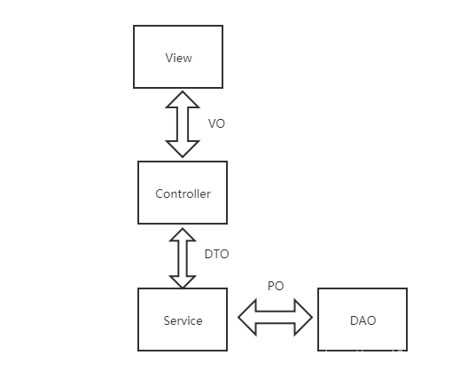
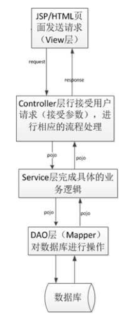

# 1. 前置知识

## 1.1 Nginx反向代理

Nginx用于反向代理

即客户端浏览器发来的请求先发给Nginx服务器，再由Nginx服务器转发给后端Tomcat服务器

优点：

- 提高访问速度，因为Nginx可以进行缓存
- 进行负载均衡
- 保证后端服务安全

Nginx的配置文件为nginx.conf文件，在Nginx安装目录下

**Linux安装Nginx**

`sudo apt install nginx`

Nginx默认端口为80，安装完成之后访问`localhost:80`即会出现Nginx默认欢迎页面

### 1.1.1 反向代理配置

```nginx
server{
    listen 80;
    server_name localhost;
    
    location /api/{
        proxy_pass http://locaohost:8080/admin/;  # 配置反向代理转发规则
    }
}
```

这个配置表示，当客户端发来的请求满足 /api/ 时，就映射为 /admin/ 再转发给服务器

比如 `localhot/api/employee/login` 转发到Tomcat服务器的地址就为 `localhost:8080/admin/employee/login`

### 1.1.2 负载均衡配置

```nginx
upstream webservers{
    server 192.168.100.128:8080;
    server 192.168.100.128:8080;
}

server{
    listen 80;
    server_name localhost;
    
    location /api/{
        proxy_pass https://webservers/admin/;  # 配置负载均衡
    }
}
```

当匹配到 /api/ 地址时，就会根据策略转发到配置的两台后端服务器上

## 1.2 对用户密码进行md5加密

用户密码在数据库中不应该明文保存，而应该进行加密保存。在用户登录时，应该将用户密码进行加密之后再和数据库中存储的密文密码进行比较验证

用spring提供的工具类来进行md5加密

```java
password = DigestUtils.md5DigestAsHex(password.getBytes());
```

## 1.3 Yapi接口管理

设计阶段使用的工具，用于帮助前后端开发人员管理和维护接口

在前后端分离的开发模式中，需要确定前后端之间的接口（比如前端需要发送给后端什么数据，后端返回前端什么数据），前后端开发人员才能一起并行开发

接口的定义可以使用YApi等接口管理平台进行管理

打开yapi.pro，新建项目，之后在数据管理中将接口文件拖入即可

## 1.4 Swagger

开发阶段使用的工具，帮助后端开发人员做后端的接口测试

用于生成接口文档，以及生成在线接口调试页面帮助后端调试，这个调试页面可以模拟发送请求给相应的接口，并显示服务器返回的数据

Knife4j是对Swagger的进一步封装，为MVC框架集成Swagger

### 1.4.1 使用

1. 导入knife4j依赖

   ```xml
   <!-- https://mvnrepository.com/artifact/com.github.xiaoymin/knife4j-spring-boot-starter -->
   <dependency>
       <groupId>com.github.xiaoymin</groupId>
       <artifactId>knife4j-spring-boot-starter</artifactId>
       <version>3.0.3</version>
   </dependency>
   ```

2. 在配置类（自建的加了@Configuration注解的类）中加入knife4j相关配置

   主要是要设置扫描的包，比如本次设置为controller包，之后就会扫描这个包（及子包）下的所有类并利用反射生成接口文档和调试工具

   ```java
   /**
        * 通过knife4j生成接口文档
        * @return
        */
   @Bean
   public Docket docket() {
       ApiInfo apiInfo = new ApiInfoBuilder()
           .title("苍穹外卖项目接口文档")
           .version("2.0")
           .description("苍穹外卖项目接口文档")
           .build();
       Docket docket = new Docket(DocumentationType.SWAGGER_2)
           .apiInfo(apiInfo)
           .select()
           .apis(RequestHandlerSelectors.basePackage("com.sky.controller"))
           .paths(PathSelectors.any())
           .build();
       return docket;
   }
   ```

3. 设置静态资源映射（用于访问接口文档页面）

   写在配置类中

   这里的映射地址都是固定的，Swagger会自动将接口文档生成在默认路径下

   ```java
   /**
        * 设置静态资源映射
        * @param registry
        */
   protected void addResourceHandlers(ResourceHandlerRegistry registry) {
       registry.addResourceHandler("/doc.html").addResourceLocations("classpath:/META-INF/resources/");
       registry.addResourceHandler("/webjars/**").addResourceLocations("classpath:/META-INF/resources/webjars/");
   }
   ```

4. 启动服务器，输入`localhost:8080/doc.html`访问接口文档页面

   在左侧菜单栏中就可以看到根据controller类中的方法生成的接口文档

### 1.4.2 常用注解

使用常用注解可以控制生成的接口文档，使接口文档拥有更好的可读性

注解在Controller类中使用，控制该类对应的接口文档

- @Api

  对这个类的描述

  ```java
  @Api(tags = "员工相关接口")
  public class Employee Controller{
      
  }
  ```

- @ApiOperation

  对类中某个方法的描述

  ```java
  @Api(tags = "员工相关接口")
  public class Employee Controller{
      @PostMapping("/logout")
      @ApiOperation(value = "员工退出登录")
      public Result<String> logout {return Result.success();}
  }
  ```

- @ApiModel

  对DTO数据类（pojo类）的描述

- @ApiModelProperty

  对数据类中属性的描述

  ```java
  @Data
  @ApiModel(description = "员工登录时传递的数据模型")
  public class EmployeeLoginDTO implements Serializable {
  
      @ApiModelProperty("用户名")
      private String username;
  
      @ApiModelProperty("密码")
      private String password;
  
  }
  ```

## 1.5 Lombok

用于简化Pojo类的开发

首先导入Lombok依赖，之后在实体类上添加@Data注解，即可自动生成构造器、getter/setter等方法

```java
@Data
class Person{
    String name;
    int ag
}
```


# 2. 项目结构

项目名为sky-take-out（项目父工程），进入之后有三个子文件夹（三个子模块）

- sky-common：存放公共类，如工具类、常量类、异常类
- sky-pojo：存放实体类
- sky-server：存在后端服务，存放配置文件、Controller、Service、Mapper等

## 2.1 sky-pojo

pojo子模块中主要存放项目中对应的实体对象

各种实体对象都属于pojo，即有属性和对应getter/setter方法的普通java对象，但是根据用途不同，又进行了细分



**DTO**

数据传输对象DTO（Data Transfer Object），是用于各层之间来传递数据的

是面向前端的数据传输对象，比如前端在传回登录、注册数据和后端向前端回传要展示的数据时，可能并不会包括实体类中的所有属性。

此时就可以传输一个DTO对象，这个DTO对象只包含前端需要的所有属性，这样就不用每次都传输整个Entity对象。

优点：

- 避免暴露后端数据库表结构
- 前后端解耦：DTO类对接前端显示界面，Entity实体类对接数据库表

**VO**

视图对象（View Object），显示层对象，用于前端视图中的数据展示，比如需要展示一个表单、表格时，后端就可以将数据封装为一个VO对象来给前端进行展示

一般是Controller层向view层传递

**Entity**

实体对象，通常与数据库中的表对应

## 2.2 sky-service

存放controller、service、mapper等业务处理部分



# 2. 开发过程

## 2.1 员工操作

### 2.1.1 新增员工

**开发过程**

1. controller

   在controller中添加新增员工的接口 save，参数为EmployeeDTO

   在其中调用service层的save方法

   ```java
   @PostMapping
   @ApiOperation("添加用户")
   public Result save(@RequestBody EmployeeDTO employeeDTO) {
       employeeService.save(employeeDTO);
       return Result.success();
   }
   ```

2. service

   service层将DTO对象转化为Entity对象（相同属性直接复制，不同的属性单独赋值），之后调用mapper层存入数据库

   可以使用`BeanUtils.copyProperties()`函数来进行属性复制，前提是两个类之间属性名要相同

   ```java
   @Override
   public void save(EmployeeDTO employeeDTO) {
       Employee employee = new Employee();
       BeanUtils.copyProperties(employeeDTO, employee);
   	// 设置employee的其他属性
   
       employeeMapper.insert(employee);
   }
   ```

3. mapper

   mapper接口将传来的employee对象存入数据库

### 2.1.2 JWT认证

**JWT认证**

JWT（Json Web Token）是一种服务器向客户端发送令牌的认证方式

当客户端进行登录操作，服务器认证登录成功之后，会生成一个json对象返回给客户端。之后客户端再与服务器端进行通信时，发送请求都会带着这个JSON对象，服务器则完全靠这个对象认定用户身份，为了防止用户篡改数据，服务器在生成对象时会加上签名。

发送的JSON对象就类似于下面，实际上是一串字符Token

```json
{
  "姓名": "张三",
  "角色": "管理员",
  "到期时间": "2018年7月1日0点0分"
}
```

这样的话服务器就可以不保存session数据了，比较容易实现扩展。

认证流程如下图


