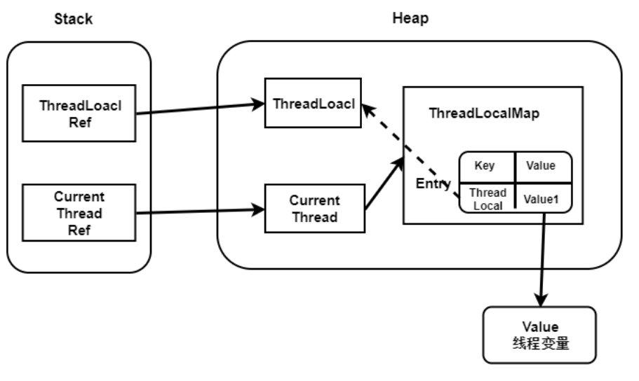
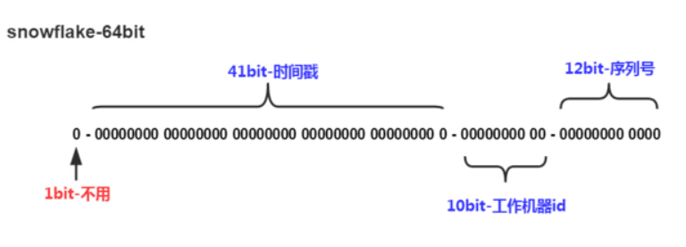
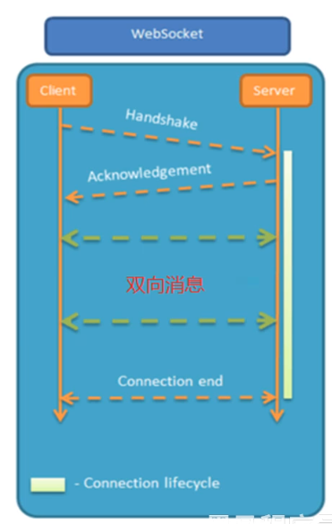

# 0. 项目介绍

本项目是我的一个学习项目，模拟了一个点餐系统，分为商家后台端和用户端。其中商家后台可以进行餐品、员工、优惠券等的管理操作。用户端可以进行商家和餐品的浏览、将餐品添加购物车、下单等操作。

其中用户和商家都需要登录验证才能进入系统，登录验证使用的是JWT token，用两个拦截器interceptor分别对用户端和商家端的请求进行拦截并校验。

在用户下单模块中，以秒杀优惠券的场景为例，我采用的是异步下单操作。当用户发起下单请求之后，先进行校验，这里的校验包括幂等性校验和库存校验，幂等性校验用来防止用户重复提交，采用的是防重token，用户在进入订单提交页之后服务器会自动生成一个token保存到redis中并返回给客户端，之后的下单请求中会携带这个token，然后服务器会检查redis中是否存在这个token，如果存在说明是第一次下单，通过校验并删除token，如果不存在说明存在重复请求，直接返回提交过快提示信息。防重校验通过之后再在Redis中进行库存校验，这里使用乐观锁加lua脚本进行库存校验和预扣减。校验成功之后生成下单任务提交给消息队列中，异步进行创建订单等操作，并返回给客户一个订单id。之后客户会用这个订单id轮询，直到数据库完成订单创建返回结果，给用户展示订单详情，用户再进行付款操作

在商家后台对菜品进行更新之后，需要更新数据库。采用旁路缓存技术，即先修改数据库，再删除缓存。对于商家营业状态的设置，由于每个用户在首页都会读取到商家营业状态缓存，因此我先直接修改缓存，再将修改数据库状态的任务发送到消息队列中。

# 1. 前置知识

## 1.1 Nginx反向代理

Nginx用于反向代理

即客户端浏览器发来的请求先发给Nginx服务器，再由Nginx服务器转发给后端Tomcat服务器

优点：

- 提高访问速度

  Nginx可以进行缓存，如果访问同一接口，并且该接口做了数据缓存，nginx就可以直接把数据返回，不需要真正访问服务端，从而提高访问速度

- 进行负载均衡

- 保证后端服务安全

  不暴露后台服务地址，使得后端不能直接使用浏览器访问，保护后端服务安全

Nginx的配置文件为nginx.conf文件，在Nginx安装目录下

**Linux安装Nginx**

`sudo apt install nginx`

Nginx默认端口为80，安装完成之后访问`localhost:80`即会出现Nginx默认欢迎页面

### 1.1.1 反向代理配置

```nginx
server{
    listen 80;
    server_name localhost;
    
    location /api/{
        proxy_pass http://locaohost:8080/admin/;  # 配置反向代理转发规则
    }
}
```

这个配置表示，当客户端发来的请求满足 /api/ 时，就映射为 /admin/ 再转发给服务器

比如 `localhot/api/employee/login` 转发到Tomcat服务器的地址就为 `localhost:8080/admin/employee/login`

### 1.1.2 负载均衡配置

```nginx
upstream webservers{
    server 192.168.100.128:8080;
    server 192.168.100.128:8080;
}

server{
    listen 80;
    server_name localhost;
    
    location /api/{
        proxy_pass https://webservers/admin/;  # 配置负载均衡
    }
}
```

当匹配到 /api/ 地址时，就会根据策略转发到配置的两台后端服务器上

## 1.2 Yapi接口管理

设计阶段使用的工具，用于帮助前后端开发人员管理和维护接口

在前后端分离的开发模式中，需要确定前后端之间的接口（比如前端需要发送给后端什么数据，后端返回前端什么数据），前后端开发人员才能一起并行开发

接口的定义可以使用YApi等接口管理平台进行管理

打开yapi.pro，新建项目，之后在数据管理中将接口文件拖入即可

## 1.3 Swagger

开发阶段使用的工具，帮助后端开发人员做后端的接口测试

用于生成接口文档，以及生成在线接口调试页面帮助后端调试，这个调试页面可以模拟发送请求给相应的接口，并显示服务器返回的数据

Knife4j是对Swagger的进一步封装，为MVC框架集成Swagger

### 1.3.1 使用

1. 导入knife4j依赖

   ```xml
   <!-- https://mvnrepository.com/artifact/com.github.xiaoymin/knife4j-spring-boot-starter -->
   <dependency>
       <groupId>com.github.xiaoymin</groupId>
       <artifactId>knife4j-spring-boot-starter</artifactId>
       <version>3.0.3</version>
   </dependency>
   ```

2. 在配置类（自建的加了@Configuration注解的类）中加入knife4j相关配置

   主要是要设置扫描的包，比如本次设置为controller包，之后就会扫描这个包（及子包）下的所有类并利用反射生成接口文档和调试工具

   ```java
   /**
        * 通过knife4j生成接口文档
        * @return
        */
   @Bean
   public Docket docket() {
       ApiInfo apiInfo = new ApiInfoBuilder()
           .title("苍穹外卖项目接口文档")
           .version("2.0")
           .description("苍穹外卖项目接口文档")
           .build();
       Docket docket = new Docket(DocumentationType.SWAGGER_2)
           .apiInfo(apiInfo)
           .select()
           .apis(RequestHandlerSelectors.basePackage("com.sky.controller"))
           .paths(PathSelectors.any())
           .build();
       return docket;
   }
   ```

3. 设置静态资源映射（用于访问接口文档页面）

   写在配置类中

   这里的映射地址都是固定的，Swagger会自动将接口文档生成在默认路径下

   ```java
   /**
        * 设置静态资源映射
        * @param registry
        */
   protected void addResourceHandlers(ResourceHandlerRegistry registry) {
       registry.addResourceHandler("/doc.html").addResourceLocations("classpath:/META-INF/resources/");
       registry.addResourceHandler("/webjars/**").addResourceLocations("classpath:/META-INF/resources/webjars/");
   }
   ```

4. 启动服务器，输入`localhost:8080/doc.html`访问接口文档页面

   在左侧菜单栏中就可以看到根据controller类中的方法生成的接口文档

### 1.3.2 常用注解

使用常用注解可以控制生成的接口文档，使接口文档拥有更好的可读性

注解在Controller类中使用，控制该类对应的接口文档

- @Api

  对这个类的描述

  ```java
  @Api(tags = "员工相关接口")
  public class Employee Controller{
      
  }
  ```

- @ApiOperation

  对类中某个方法的描述

  ```java
  @Api(tags = "员工相关接口")
  public class Employee Controller{
      @PostMapping("/logout")
      @ApiOperation(value = "员工退出登录")
      public Result<String> logout {return Result.success();}
  }
  ```

- @ApiModel

  对DTO数据类（pojo类）的描述

- @ApiModelProperty

  对数据类中属性的描述

  ```java
  @Data
  @ApiModel(description = "员工登录时传递的数据模型")
  public class EmployeeLoginDTO implements Serializable {
  
      @ApiModelProperty("用户名")
      private String username;
  
      @ApiModelProperty("密码")
      private String password;
  
  }
  ```

## 1.4 Lombok

用于简化Pojo类的开发

首先导入Lombok依赖，之后在实体类上添加@Data注解，即可自动生成构造器、getter/setter等方法

```java
@Data
class Person{
    String name;
    int ag
}
```


# 2. 项目结构

项目名为sky-take-out（项目父工程），进入之后有三个子文件夹（三个子模块）

- sky-common：存放公共类，如工具类、常量类、异常类
- sky-pojo：存放实体类
- sky-server：存在后端服务，存放配置文件、Controller、Service、Mapper等

## 2.1 sky-pojo

pojo子模块中主要存放项目中对应的实体对象

各种实体对象都属于pojo，即有属性和对应getter/setter方法的普通java对象，但是根据用途不同，又进行了细分


**DTO**

数据传输对象DTO（Data Transfer Object），是用于各层之间来传递数据的

是面向前端的数据传输对象，比如前端在传回登录、注册数据和后端向前端回传要展示的数据时，可能并不会包括实体类中的所有属性。

此时就可以传输一个DTO对象，这个DTO对象只包含前端需要的所有属性，这样就不用每次都传输整个Entity对象。

优点：

- 避免暴露后端数据库表结构
- 前后端解耦：DTO类对接前端显示界面，Entity实体类对接数据库表

**VO**

视图对象（View Object），显示层对象，用于前端视图中的数据展示，比如需要展示一个表单、表格时，后端就可以将数据封装为一个VO对象来给前端进行展示

一般是Controller层向view层传递

**Entity**

实体对象，通常与数据库中的表对应

## 2.2 sky-service

存放controller、service、mapper等业务处理部分

一个业务的处理流程大致如下


# 2. 服务器后台开发

## 2.1 员工操作

### 2.1.1 新增员工

**开发过程**

1. controller

   在controller中添加新增员工的接口 save，参数为EmployeeDTO

   在其中调用service层的save方法

   ```java
   @PostMapping
   @ApiOperation("添加用户")
   public Result save(@RequestBody EmployeeDTO employeeDTO) {
       employeeService.save(employeeDTO);
       return Result.success();
   }
   ```

2. service

   service层将DTO对象转化为Entity对象（相同属性直接复制，不同的属性单独赋值），之后调用mapper层存入数据库

   可以使用`BeanUtils.copyProperties()`函数来进行属性复制，前提是两个类之间属性名要相同

   ```java
   @Override
   public void save(EmployeeDTO employeeDTO) {
       Employee employee = new Employee();
       BeanUtils.copyProperties(employeeDTO, employee);
   	// 设置employee的其他属性
   
       employeeMapper.insert(employee);
   }
   ```

3. mapper

   mapper接口将传来的employee对象存入数据库

### 2.1.2 JWT认证

**JWT认证介绍**

JWT（Json Web Token）是一种服务器向客户端发送令牌的认证方式，与session将用户数据保存在服务器端相比，JWT将用户数据存储在客户端，每次客户端发送请求都将数据通过JWT token发来，减少服务器内存开销。

认证流程如下图


1. 当客户端进行登录操作，服务器认证登录成功之后，会生成一个json对象（即JWT token）返回给客户端。

   JWT token由三部分组成 `Header.Payload.Signature`，中间以 . 连接，其中Header和Payload以Base64编码

   - header：包括签名的算法类型（比如SHA256）和当前token令牌的类型（如JWT）

   - Payload：用于存储实际要传递的数据，一般是存储用户认证信息（如用户id，用户权限等登录信息），不要存敏感信息

   - Signature：签名。用于验证JWT令牌，防止JWT令牌内容被篡改。

     在服务器端生成JWT时，会用经过Base64编码的Header和Payload部分以及我们自己指定的一个秘钥secret（这个秘钥一定要在服务端保留好，不能暴露），通过Header中指定的签名算法，生成一个签名，就是这个Signature。

     对于客户端后续请求发来的JWT Token，服务器会拿其中的Header和Payload部分以及服务器端的密钥再生成一个Signature，来和JWT Token中的Signature进行比较，如何相同则通过校验。

     如果JWT Token被篡改，由于别人不知道服务器端的密钥，所以篡改后的Signature不可能和服务器生成的一样。

2. 之后客户端再与服务器端进行通信时，发送请求都会带着这个JSON对象，服务器则完全靠这个对象认定用户身份

**JWT验证代码**

- 服务器端生成JWT令牌

服务器端需要在用户登录时生成JWT令牌并返回给客户端，因此在负责处理登录请求的Controller方法中生成jwt令牌并返回给前端

生成JWT令牌

```java
    /**
     * 生成jwt
     * 使用Hs256算法, 私匙使用固定秘钥
     *
     * @param secretKey jwt秘钥
     * @param ttlMillis jwt过期时间(毫秒)
     * @param claims    设置的信息
     * @return
     */
    public static String createJWT(String secretKey, long ttlMillis, Map<String, Object> claims) {
        // 指定签名的时候使用的签名算法，也就是header那部分
        SignatureAlgorithm signatureAlgorithm = SignatureAlgorithm.HS256;

        // 生成JWT的到期时间
        long expMillis = System.currentTimeMillis() + ttlMillis;
        Date exp = new Date(expMillis);

        // 设置jwt的body
        JwtBuilder builder = Jwts.builder()
                // 如果有私有声明，一定要先设置这个自己创建的私有的声明，这个是给builder的claim赋值，一旦写在标准的声明赋值之后，就是覆盖了那些标准的声明的
                .setClaims(claims)
                // 设置签名使用的签名算法和签名使用的秘钥
                .signWith(signatureAlgorithm, secretKey.getBytes(StandardCharsets.UTF_8))
                // 设置过期时间
                .setExpiration(exp);

        return builder.compact();
    }
```

Controller方法

```java
@PostMapping("/login")
@ApiOperation("员工登录")
public Result<EmployeeLoginVO> login(@RequestBody EmployeeLoginDTO employeeLoginDTO) {
	// 调用service中的登录方法执行登录操作
    Employee employee = employeeService.login(employeeLoginDTO);

    //登录成功后，生成jwt令牌
    // claims中放自己想要保存的信息，即Payload部分，一般放用户id
    Map<String, Object> claims = new HashMap<>();
    claims.put(JwtClaimsConstant.EMP_ID, employee.getId());
    String token = JwtUtil.createJWT(
        jwtProperties.getAdminSecretKey(),
        jwtProperties.getAdminTtl(),
        claims);
	
    // 将生成的jwt令牌放入VO对象中返回给前端浏览器
    EmployeeLoginVO employeeLoginVO = EmployeeLoginVO.builder()
        .id(employee.getId())
        .userName(employee.getUsername())
        .name(employee.getName())
        .token(token)
        .build();

    return Result.success(employeeLoginVO);
}
```

- 服务器端收到请求时验证jwt令牌

在Interceptor中拦截所有请求（除了登录请求）并进行令牌验证

令牌验证

```java
    /**
     * Token解密
     *
     * @param secretKey jwt秘钥 此秘钥一定要保留好在服务端, 不能暴露出去, 否则sign就可以被伪造, 如果对接多个客户端建议改造成多个
     * @param token     加密后的token
     * @return
     */
    public static Claims parseJWT(String secretKey, String token) {
        // 得到DefaultJwtParser
        Claims claims = Jwts.parser()
                // 设置签名的秘钥
                .setSigningKey(secretKey.getBytes(StandardCharsets.UTF_8))
                // 设置需要解析的jwt
                .parseClaimsJws(token).getBody();
        return claims;
    }
```

拦截器prehandle方法

```java
//1、从浏览器请求头中获取令牌
String token = request.getHeader(jwtProperties.getAdminTokenName());

//2、校验令牌
try {
    // 校验令牌
    Claims claims = JwtUtil.parseJWT(jwtProperties.getAdminSecretKey(), token);
    // 得到令牌中保存的信息
    Long empId = Long.valueOf(claims.get(JwtClaimsConstant.EMP_ID).toString());
    log.info("当前员工id：", empId);
    // 将当前登录用户的id保存在LocalThread中
    BaseContext.setCurrentId(empId);
    //3、通过，放行
    return true;
} catch (Exception ex) {
    //4、不通过，响应401状态码
    response.setStatus(401);
    return false;
}
```

### 2.1.3 密码加盐加密

一般用户密码都会经过散列处理（如MD5、SHA1、SHA256等）生成对应的散列值，再将散列值存入数据库中

散列值虽然不能直接计算得到原始字段，但是可能通过彩虹表等方式破解，因此就需要对密码加盐

在用户表中添加一个salt字段，表示该用户密码中加的盐值，用户密码字段就等于MD5("password" + "salt")，盐可以加在密码中的任何地方。每个用户对应的salt值都不一样

| id   | username | salt  | password |
| ---- | -------- | ----- | -------- |
| 1    | Tom      | abcde |          |

假设Tom用户原本的密码是123456，将盐直接加载密码后面，则password字段中存储的就是`MD5("123456abcde")`

**加盐方式**

- 直接加盐

  可以将散列操作和加盐操作进行排列组合增加复杂度

  `MD5(SHA512(password + salt)+salt)`

  其中加密操作可以直接用spring提供的工具类完成

  ```java
  // 对密码进行md5加密
  password = DigestUtils.md5DigestAsHex(password.getBytes());
  ```

- 慢哈希

## 2.2 ThreadLocal

ThreadLocal并不是一个Thread线程，而是Thread中的局部变量

ThreadLocal为每个线程提供单独一份存储空间，具有线程隔离的效果。可以在里面保存数据（只能保存一个变量），只有在线程内才能获取到对应的数据。

在Tomcat中，浏览器客户端发来的每次请求都会对应一个单独的线程，因此可以使用ThreadLocal来保存此次请求的用户信息，在本次请求的整个处理流程中进行使用

### 2.2.1 常用方法

每个线程中会有一个ThreadLocalMap属性，这个map的key是`ThreadLocal`，因此使用ThreadLocal保存数据实际上和使用map一样，只不过这个map的key是确定的

ThreadLocal常用方法：

- public void set(T value)

  设置当前ThreadLocal变量中保存的变量

- public T get() 

  获取当前ThreadLocal变量中存储的变量

- public void remove()

  移除当前ThreadLocal变量中存储的变量

对于浏览器客户端发送的每次请求，Tomcat都会为这个请求分配一个单独的线程。

因此ThreadLocal可以用于在一次请求中共享数据，在具体使用时会对其进一步封装。

```java
// 该工具类用于保存当前登录用户的用户ID
public class IdContext {
    public static ThreadLocal<Long> threadlocal = new ThreadLocal<>();
    // 保存id
    public static void setCurrentId(Long id) {
        threadLocal.set(id);
    }
    // 获取id
    public static Long getCurrentId() {
        return threadLocal.get();
    }
    // y
    public static void removeCurrentId() {
        threadlocal.remove();
    }
}
```

### 2.2.2 源码

ThreadLocal类在java.lang包中

实现原理：每个线程对应一个ThreadLocalMap。在ThreadLocalMap中有一个以ThreadLocal对象的哈希值为key的哈希表（实际上是数组），每个ThreadLocal中存储的值都放在这个哈希表中

**ThreadLocal**

ThreadLocal提供get/set方法，用来存取数据

```java
public class ThreadLocal<T> {
    
    // 每个ThreadLocal对象实例都有对应的哈希值
    private final int threadLocalHashCode = nextHashCode();
	
    // 用一个静态原子整数来生成所有对象的哈希值
    private static AtomicInteger nextHashCode =
        new AtomicInteger();
	
    // 生成哈希值的固定增量，这个0x61c88647是一个与黄金分割数相关的常量，能够最大化哈希值在表中的均匀分布，尽量减少哈希碰撞
    private static final int HASH_INCREMENT = 0x61c88647;

    // 生成哈希值的函数，保证生成的哈希值唯一且依次递增
    private static int nextHashCode() {
        return nextHashCode.getAndAdd(HASH_INCREMENT);
    }
}
```

- get方法

  ThreadLocal实际上将数据放在ThreadLocalMap.Entry中

  ```java
  public T get() {
      // 可以看出来数据是保存在ThreadLocalMap 对象中的
      Thread t = Thread.currentThread();
      ThreadLocalMap map = getMap(t);
      if (map != null) {
          ThreadLocalMap.Entry e = map.getEntry(this);
          if (e != null) {
              @SuppressWarnings("unchecked")
              T result = (T)e.value;
              return result;
          }
      }
      return setInitialValue(); // 这里set的值是null
  }
  ```

  首先调用getMap方法获取当前线程对应的ThreadLocalMap，如果不为空就调用其中get方法获取当前ThreadLocal对象对应的值；如果为空就为当前线程创建对应的ThreadLocalMap，并为当前ThreadLocal对象赋初始值null

- getMap方法

  ```java
  ThreadLocalMap getMap(Thread t) {
      return t.threadLocals;
  }
  ......Thread源码......
  public class Thread implements Runnable {
      ThreadLocal.ThreadLocalMap threadLocals = null;
  }
  ```

  getMap方法用来获取线程中的ThreadLocalMap属性，在每个线程对象中都会保存一个ThreadLocalMap对象

- set方法

  ```java
  public void set(T value) {
      Thread t = Thread.currentThread();
      ThreadLocalMap map = getMap(t);
      if (map != null) {
          map.set(this, value);
      } else {
          createMap(t, value);
      }
  }
  ```

  先获取当前线程的ThreadLocalMap对象，如果存在就直接往里面赋值，如果不存在就给当前对象创建一个map对象并赋值

**ThreadLocalMap**

ThreadLocalMap是ThreadLocal类中的一个静态内部类，用于保存数据。ThreadLocalMap中还有一个静态内部类Entry，每个Entry对应一个ThreadLocal。

这个类中用一个Entry[]数组来存储所有ThreadLocal对象中的值，用ThreadLocal对象的哈希码映射为下标

```java
static class ThreadLocalMap {
    
    static class Entry extends WeakReference<ThreadLocal<?>> {
        Object value;

        Entry(ThreadLocal<?> k, Object v) {
            // 这里创建对象时调用super(k)，表示让当前Entry对象引用这个ThreadLocal对象
            super(k);
            value = v;
        }
    }
    
    private Entry[] table;
    
    // 这里可以看到用的是线性冲突检测，即发生冲突之后下标直接+1
    private static int nextIndex(int i, int len) {
        return ((i + 1 < len) ? i + 1 : 0);
    }
}
```

- set

  ```java
  private void set(ThreadLocal<?> key, Object value) {
  
      Entry[] tab = table;
      int len = tab.length;
      // 获取当前ThreadLocal对象的哈希值，并映射为下标
      int i = key.threadLocalHashCode & (len-1);
  
      // 做哈希检测，看映射的下标位置是否为空，用的是线性检测
      for (Entry e = tab[i]; e != null; e = tab[i = nextIndex(i, len)]) {
          ThreadLocal<?> k = e.get(); // entry中引用了它对应的ThreadLocal对象，这里就是通过引用获取ThreadLocal对象用于判断
          
  		// 如果当前位置的ThreadLocal对象就是现在要操作的对象，那更新值即可
          if (k == key) {
              e.value = value;
              return;
          }
  		
          // 如果发现这个Entry引用的对象为空，说明它对应的ThreadLocal已经被垃圾回收了，那么直接把这个位置的entry替换掉
          if (k == null) {
              replaceStaleEntry(key, value, i);
              return;
          }
      }
  	// 如果找到一个空位置，就往里面插入Entry
      tab[i] = new Entry(key, value);
      int sz = ++size;
      if (!cleanSomeSlots(i, sz) && sz >= threshold)
          rehash();
  }
  ```

- getEntry

  ```java
  private Entry getEntry(ThreadLocal<?> key) {
      int i = key.threadLocalHashCode & (table.length - 1);
      Entry e = table[i];
      if (e != null && e.get() == key)
          return e;
      else
          return getEntryAfterMiss(key, i, e);
  }
  ```

  通过哈希值找到对应下标，然后检查里面存储的Entry对象引用的ThreadLocal是否是当前要找的，如果是就直接返回，如果不是就开启碰撞检测。

  由于是线性探测，因此其实就是不断向后遍历知道找到对应的ThreadLocal对象

### 2.2.3 内存泄露问题

内存泄露（Memory Leak）指的是程序中已分配的堆内存由于某种原因未释放或无法释放，造成系统资源的浪费。在Java程序中，就是JVM创建的对象永远都无法访问到但是GC又不能回收这个对象占用的内存。

**内存泄露原因**

根据上面的源码分析可以知道，当创建一个ThreadLocal对象并存储数据时，在内存中会存在这样一条引用链



其中虚线是弱引用链，实线是强引用链

可以看到当一个ThreadLocal对象不存在外部强引用时，就只存在一个弱引用，此时ThreadLocal对象就可以被回收掉。

在回收掉ThreadLocal对象之后，它里面存储的值实际上就再也不可能被获取到了，但是这个值又被保存它的Entry的value属性强引用，并且存在一条Root GC引用链`Current Thread Ref -> Current Thread -> ThreadLocalMap -> Entry -> value`，所以它也不会被回收。

在线程被销毁时能够释放掉这部分内存，但是由于线程是很稀缺的资源，因此会使用线程池，而不会频繁创建和销毁线程。这就导致内存泄露

ThreadLocal中使用弱引用实际上是为了保证ThreadLocal对象能够被尽早垃圾回收掉，而且ThreadLocal内部实现也在尽量对这部分value进行内存回收。

**如何避免**

- 在用完ThreadLocal对象之后尽量手动调用remove方法释放内存
- 将ThreadLoca对象定义为static，这样就会一直存在ThreadLocal的强引用，也就能保证在任何时候都能访问到value值，进而清除掉

## 2.3 订单超时取消

订单超时取消有以下几种实现方案

### 2.3.1 使用SpringTask

Spring Task是Spring提供的轻量级定时工具

使用SpringTask实现订单超时取消的思路是，创建一个SpringTask定时任务，来定时轮询数据库，查询数据库订单表中的超时未支付订单（通过当前时间减去订单创建时间即可得到是否超时），将其订单状态标记为已取消或删除。

**问题**

1. 会导致频繁访问数据库，服务器负担较大

2. 在分布式场景下多个服务器时，一个SpringTask会触发多个服务器同时去取消订单，这样还需要额外保证取消订单操作的幂等性，比如用redis分布式锁校验禁止重复取消订单。

### 2.3.2 使用消息队列

这里实际上是使用延迟队列，即队列中存储对应的延时消息，队列中的消息等到特定时间之后才会出队

RabbitMQ本身没有延迟队列，实现延迟消息要借助死信交换机

订单创建之后，将消息发送到特定的交换机，该交换机会将消息路由到一个具有TTL属性的队列。当消息在队列中的时间超过TTL（即达到超时时间）时，消息会经由死信交换机发送到死信队列，使用消费者处理死信队列中的消息，即可实现超时订单取消功能。

## 2.4 下单校验

下单一般是异步完成，在redis中完成校验之后发送消息给消息队列，然后直接返回订单号和下单结果。服务器再读取消息队列中的消息异步完成数据库中的下单操作。

下单校验中会遇到的问题：

1. 避免重复下单

   即保证业务幂等性，就是多次发起同一个请求必须保证操作只能执行一次

2. 如何在redis中完成库存校验和库存扣减操作，并保证在高并发场景下不会出现超卖问题

### 2.4.1 重复下单检测

使用防重Token

1. 用户访问可能执行需要进行幂等检测请求的页面时，服务器生成一个唯一的随机token（针对该幂等检测的请求token），将这个token存入Redis中，并返回给客户端

   比如下单操作，在进入订单确认页面之后生成一个随机token返回给客户端

2. 客户端在发送下单请求时需要携带这个token

3. 服务端接受到请求之后，从redis中查询该token并删除

   查询和删除token操作放在lua脚本中进行，保证原子性，保证多个请求同时到达也只有一个请求能成功删除

   ```lua
   if redis.call('exists', KEYS[1]) == 1 then
       return redis.call('del', KEYS[1])
   else
       return 0
   end
   ```

4. 如果token存在并被成功删除，说明是第一次请求，正常处理业务逻辑；如果token不存在，说明是重复请求

5. 不管请求成功与否，都要在Redis中再删除一次token，避免后续重复校验

其实避免重复发起某种请求在前端也应该加校验，比如某个按钮某段时间内只允许点击一次。后端也进行校验是加一层保险

### 2.4.2 超卖检测

使用lua脚本和CAS乐观锁

1. 用户发起下单操作之后，要先检测库存是否足够
2. 如果库存足够，就发起下单操作，执行库存扣减操作

但是检测库存成功和实际下单之间还有一些时间间隔，这段时间内库存可能扣减到0，此时如果直接扣减库存就会出现超卖问题

所以要在库存扣减之前再检测一下库存，如果此时库存和刚才检测时的库存数量一致才进行扣减操作，这就是乐观锁。

在实际业务中，无需保证两次检测一致，只需保证第二次检测库存大于0即可。但是第二次检测和扣减操作需要放在lua脚本中执行保证原子性，其实就是扣减之前再检查一下够不够减。


## 2.5 优化功能

### 2.5.1 格式化日期

后端的Pojo对象中以LocalDataTime格式存储的日期对象，在以json格式返回给前端时，会变成数组形式，进而前端会显示为数组直接拼接的结果

所以我们需要在后端对日期类型进行格式化

有两种方法

1. 在日期类型变量上加入@JsonFormat注解指定格式（只能作用于单个对象）

   ```java
   @JsonFormat(pattern = "yyyy-MM-dd HH:mm:ss")
   private LocalDateTime updateTime;
   ```

2. 在WebMvcConfiguration配置类中扩展Spring MVC的消息转换器，统一对日期类型进行格式化处理（全局配置，推荐）

在配置类中注册消息转换器：

```java
@Override
protected void extendMessageConverters(List<HttpMessageConverter<?>> converters) {
    // 创建一个消息转换器对象
    MappingJackson2HttpMessageConverter converter = new MappingJackson2HttpMessageConverter();
    // 为消息转换器设置一个对象转换器，对象转换器可以将Java对象序列化为json数据
    converter.setObjectMapper(new JacksonObjectMapper());
    // 将创建好的消息转换器对象加入容器中
    converters.add(0, converter);
}
```

其中JacksonObjectMapper对象指定了LocalDataTime对象的格式化规则，使用时直接复制下面代码即可

```java
/**
 * 对象映射器:基于jackson将Java对象转为json，或者将json转为Java对象
 * 将JSON解析为Java对象的过程称为 [从JSON反序列化Java对象]
 * 从Java对象生成JSON的过程称为 [序列化Java对象到JSON]
 */
public class JacksonObjectMapper extends ObjectMapper {

    public static final String DEFAULT_DATE_FORMAT = "yyyy-MM-dd";
    //public static final String DEFAULT_DATE_TIME_FORMAT = "yyyy-MM-dd HH:mm:ss";
    public static final String DEFAULT_DATE_TIME_FORMAT = "yyyy-MM-dd HH:mm";
    public static final String DEFAULT_TIME_FORMAT = "HH:mm:ss";

    public JacksonObjectMapper() {
        super();
        //收到未知属性时不报异常
        this.configure(FAIL_ON_UNKNOWN_PROPERTIES, false);

        //反序列化时，属性不存在的兼容处理
        this.getDeserializationConfig().withoutFeatures(DeserializationFeature.FAIL_ON_UNKNOWN_PROPERTIES);

        SimpleModule simpleModule = new SimpleModule()
                .addDeserializer(LocalDateTime.class, new LocalDateTimeDeserializer(DateTimeFormatter.ofPattern(DEFAULT_DATE_TIME_FORMAT)))
                .addDeserializer(LocalDate.class, new LocalDateDeserializer(DateTimeFormatter.ofPattern(DEFAULT_DATE_FORMAT)))
                .addDeserializer(LocalTime.class, new LocalTimeDeserializer(DateTimeFormatter.ofPattern(DEFAULT_TIME_FORMAT)))
                .addSerializer(LocalDateTime.class, new LocalDateTimeSerializer(DateTimeFormatter.ofPattern(DEFAULT_DATE_TIME_FORMAT)))
                .addSerializer(LocalDate.class, new LocalDateSerializer(DateTimeFormatter.ofPattern(DEFAULT_DATE_FORMAT)))
                .addSerializer(LocalTime.class, new LocalTimeSerializer(DateTimeFormatter.ofPattern(DEFAULT_TIME_FORMAT)));

        //注册功能模块 例如，可以添加自定义序列化器和反序列化器
        this.registerModule(simpleModule);
    }
}
```

### 2.5.2 公共字段自动填充

在数据库中有一些公共字段，即每张表都有，比如创建时间、创建人id、修改时间、修改人id。如果在每个方法中都手动填入这些字段，就会造成代码冗余。

可以通过切片来拦截需要修改这些字段的方法，并对这些方法进行自动填充。

**实现思路**

1. 自定义注解AutoFill，用于标识需要进行公共字段自动填充的方法（即需要执行insert和update的方法）
2. 在Mapper中涉及insert和update的方法加上AutoFill注解
3. 自定义切面类AutoFillAspect，统一拦截加入了AutoFill注解的方法，并为公共字段赋值

## 2.6 主从数据库

部署一主一从两台数据库，主库进行增删改操作，从库进行查询操作。

意义：

- 减轻数据库压力

  只有一台数据库的话，随着业务量提升会导致I/O频率过高

- 提升系统性能

  将增删改操作和查询操作分离开，能有效避免数据更新导致的行级锁，提升查询操作的效率

- 提高数据库可用性

  只有一个数据库的话，服务器宕机可能会导致所有数据丢失

### 2.6.1 读写分离

采用Sharding-JDBC实现读写分离

Sharding-JDBC定位为轻量级Java框架，在Java的JDBC层提供的额外服务。它使用客户端直连数据库，以jar包形式提供服务，无需额外部署和依赖，可理解为增强版的JDBC驱动，完全兼容JDBC和各种ORM框架。可以通过配置的方式实现分库分表和读写分离

读写分离配置实例：

```yaml
#配置数据源
spring.shardingsphere.datasource.names=ds1,ds2
#配置第一个数据源
spring.shardingsphere.datasource.ds1.type=com.alibaba.druid.pool.DruidDataSource
spring.shardingsphere.datasource.ds1.driver-class-name=com.mysql.jdbc.Driver
spring.shardingsphere.datasource.ds1.url=jdbc:mysql://192.168.85.111:3306/shardingsphere?serverTimezone=UTC
spring.shardingsphere.datasource.ds1.username=root
spring.shardingsphere.datasource.ds1.password=123456

#配置第二个数据源
spring.shardingsphere.datasource.ds2.type=com.alibaba.druid.pool.DruidDataSource
spring.shardingsphere.datasource.ds2.driver-class-name=com.mysql.jdbc.Driver
spring.shardingsphere.datasource.ds2.url=jdbc:mysql://192.168.85.112:3306/shardingsphere?serverTimezone=UTC
spring.shardingsphere.datasource.ds2.username=root
spring.shardingsphere.datasource.ds2.password=123456

#主库从库逻辑定义
spring.shardingsphere.masterslave.name=ms
spring.shardingsphere.masterslave.master-data-source-name=ds1
spring.shardingsphere.masterslave.slave-data-source-names=ds2

#显示执行的sql
spring.shardingsphere.props.sql.show=true
```

在配置文件中配置多个数据源，并配置每个数据源的逻辑定义即可实现读写分离

### 2.6.2 主从复制

使用mysql自带的binlog实现主从复制

## 2.7 ID生成

数据库系统通常提供自增ID生成，这种自增ID简单可靠，但是无法很好地扩展到分布式系统，会引入单点故障。

对于分布式系统中，一般需要自己生成ID，主要有以下几种方法

### 2.7.1 UUID

UUID生成简单，并且在多种编程语言中都会自带UUID

缺点是完全随机，没有有序性

### 2.7.2 雪花算法

Snowflake

雪花算法可以生成递增id

它将64-bit划分为三个部分



- 第一位，值始终是0，可以看作符号位
- 后41位是时间戳，代表毫秒数
- 后10位是工作机器id，10位表示集群最多能部署1024台机器
- 最后12bit是自增序列

这样划分之后相当于1毫秒一台机器上可产生4096个有序不重复ID

### 2.7.3 使用Redis生成

Redis或MongoDB这样的系统可以通过原子操作充当集中式的ID生成器

# 3. 客户端开发

## 3.1 HttpClient

HttpClient是Apache Jakarta Common下的子项目，是支持HTTP协议的客户端编程工具包。用于在程序中通过编码的方式构造和发送HTTP请求

**maven坐标**

```xml
<dependency>
	<groupId>org.apache.httpcomponents</groupId>
    <artifactId>httpclient</artifactId>
    <version>4.5.13</version>
</dependency>
```

**核心API**

- HttpClient：用于发送Http请求
- HttpClients：构建器，用于构建HttpClient
- CloseableHttpClient：HttpClient接口的实现类
- HttpGet：代表一个Get请求
- HttpPost：代表一个Post请求

**发送Http请求步骤**

1. 创建HttpClient对象
2. 创建Http请求对象（即HttpGet或HttpPost）
3. 调用HttpClient的execute方法发送请求

**发送GET请求**

```java
public void testGet(){
    // 创建httpClient对象
    CloseableHttpClient httpClient = HttpClients.createDefault();
    
    // 创建请求对象
    HttpGet httpGet = new HttpGet("http://localhost:8080/user/shop/status");
    
    // 发送请求，接收响应结果
    CloseableHttpResponse response = httpClient.execute(httpGet);
    
    // 获取和解析响应体
    HttpEntity entity = response.getEntity();
    String body = EntityUtils.toString(entity); // 用工具类解析响应体
    
    // 关闭资源
    response.close();
    httpClient.close(); 
    
}
```

**发送POST请求**

只有创建请求对象这一步有区别

```java
HttpPost httpPost = new HttpPost("http://localhost/admin/employee/login");
// 创建请求体
JSONObject jsonObject = new JSONObject();
jsonObject.put("username", "admin");
jsonObject.put("password", "123456");

StringEntity entity = new StringEntity(jsonObject.toString()); // 直接用json字符串构造

// 指定数据编码方式和数据格式
entity.setContentEncoding("utf-8");
entity.setContentType("application/json");
    
httpPost.setEntity(entity);
```

## 3.2 微信小程序开发

微信小程序主要是前端开发，目录结构如下

- app：描述整体程序
  - app.js：小程序的逻辑
  - app.json：小程序公共配置
  - app.wxss：小程序公共样式表
  
- page：描述下面的各个页面

  在wxml中写页面组件，在js文件中写事件函数

  - .js文件：页面逻辑
  - .wxml文件：页面结构（类似于html）
  - .json文件：页面配置
  - .wxss文件：页面样式表

下面是一些功能实例

**发送请求**

使用微信小程序发送http请求

```javascript
sendRequest(){
    wx.request({
        url: 'http://localhost:8080/user/shop/status',
        method: 'GET',
        success: (res)+>{
            console.log(res.data) // 这个data是服务器返回的整个响应体
        }
    })
}
```

## 3.3 微信登录

微信官方提供了小程序登录的流程图


其中登录凭证校验接口为：`GET https://api.weixin.qq.com/sns/jscode2session`

1. 前端小程序通过wx.login()获取code，并传给后端服务器

```js
wxLogin(){
    wx.login({
        success : (res)=>{
            console.log(res.code) // res.code就是授权码
        }
    })
}
```

2. 后端服务器给登录凭证校验接口发送http请求，获取微信接口服务返回的用户对应openid


3. 后端服务器根据openid生成jwt令牌和VO返回给前端小程序

## 3.4 缓存

**直接用Redis缓存**

缓存一般在controller方法中使用，即在调用service方法去数据库查数据之前先在Redis中查询数据

1. 在Redis中查找对应数据

   ```java
   List<DishVO> list = (List<DishVO>) redisTemplate.opsForValue().get(key);
   ```

1. 如果能找到则直接返回

2. 如果找不到就在数据库中查找，并存储在Redis中

   ```java
   redisTemplate.opsForValue().set(key, list);
   ```

在Redis中可以直接用String数据类型存储Java对象，Java会将对象序列化之后存储在Redis中，之后取数据时可以直接取出与存储数据相同类型的对象。

需要注意在执行增、删、改操作之后要清空缓存

**使用Spring Cache框架缓存**

## 3.5 定时任务处理

实现订单15分钟未支付自动取消，以及每天自动处理一直处于派送中的订单

## 3.6 WebSocket

WebSocket是基于TCP的一种网络协议，实现了浏览器与服务器全双工通信，浏览器和服务器只需要完成一次握手，即可进行永久性的连接，并进行双向数据传输



主要用于浏览器需要实时更新的场景，即客户端不需要一直向服务器发请求，服务器主动向客户端推送更新

**与HTTP协议的对比**

- HTTP是短连接，WebSocket是长连接

- HTTP通信是单向的（即只能客户端向服务器发请求，服务器只能响应），基于请求响应模式

  WebSocket支持双向通信，即客户端和服务器都能互相主动发消息

### 3.6.1 使用步骤

1. 使用一个html页面充当WebSocket的客户端

   ```js
   <script type="text/javascript">
       var websocket = null;
       var clientId = Math.random().toString(36).substr(2); // 用随机数作为客户端id来唯一标识客户端
   
       //判断当前浏览器是否支持WebSocket
       if('WebSocket' in window){
           //连接WebSocket节点，WebSocket使用ws协议
           websocket = new WebSocket("ws://localhost:8080/ws/"+clientId);
       }
       else{
           alert('Not support websocket')
       }
   
       //连接发生错误的回调方法
       websocket.onerror = function(){
           setMessageInnerHTML("error");
       };
   
       //连接成功建立的回调方法
       websocket.onopen = function(){
           setMessageInnerHTML("连接成功");
       }
   
       //接收到消息的回调方法
       websocket.onmessage = function(event){
           setMessageInnerHTML(event.data);
       }
   
       //连接关闭的回调方法
       websocket.onclose = function(){
           setMessageInnerHTML("close");
       }
   
       //监听窗口关闭事件，当窗口关闭时，主动去关闭websocket连接，防止连接还没断开就关闭窗口，server端会抛异常。
       window.onbeforeunload = function(){
           websocket.close();
       }
   
       //将消息显示在网页上
       function setMessageInnerHTML(innerHTML){
           document.getElementById('message').innerHTML += innerHTML + '<br/>';
       }
   
       //发送消息
       function send(){
           var message = document.getElementById('text').value;
           websocket.send(message);
       }
   	
   	//关闭连接
       function closeWebSocket() {
           websocket.close();
       }
   </script>
   ```

2. 后端服务器导入WebSocket的maven坐标

   ```xml
   <dependency>
   	<groupId>org.springframework.boot</groupId>
   	<artifactId>spring-boot-starter-websocket</artifactId>
   </dependency>
   ```

3. 创建WebSocket服务端组件WebSocketServer类，用于和客户端通信

   使用@ServerEndpoint注解标识，其中是服务器地址（类似于Controller）。其中的方法注解和前端的回调方法对应

```java
/**
 * WebSocket服务
 */
@Component
@ServerEndpoint("/ws/{sid}")  // sid是客户端的唯一标识
public class WebSocketServer {

    //存放会话对象
    private static Map<String, Session> sessionMap = new HashMap();

    /**
     * 连接建立成功调用的方法
     */
    @OnOpen
    public void onOpen(Session session, @PathParam("sid") String sid) {
        System.out.println("客户端：" + sid + "建立连接");
        sessionMap.put(sid, session);
    }

    /**
     * 收到客户端消息后调用的方法
     *
     * @param message 客户端发送过来的消息
     */
    @OnMessage
    public void onMessage(String message, @PathParam("sid") String sid) {
        System.out.println("收到来自客户端：" + sid + "的信息:" + message);
    }

    /**
     * 连接关闭调用的方法
     *
     * @param sid
     */
    @OnClose
    public void onClose(@PathParam("sid") String sid) {
        System.out.println("连接断开:" + sid);
        sessionMap.remove(sid);
    }

    /**
     * 群发
     *
     * @param message
     */
    public void sendToAllClient(String message) {
        Collection<Session> sessions = sessionMap.values();
        for (Session session : sessions) {
            try {
                //服务器向客户端发送消息
                session.getBasicRemote().sendText(message);
            } catch (Exception e) {
                e.printStackTrace();
            }
        }
    }

}
```

4. 在配置类WebSocketConfiguration中注册WebSocket的服务端组件

```java
/**
 * WebSocket配置类，用于注册WebSocket的Bean
 */
@Configuration
public class WebSocketConfiguration {

    @Bean
    public ServerEndpointExporter serverEndpointExporter() {
        return new ServerEndpointExporter();
    }

}
```

5. 创建定时任务类，定时向客户端推送数据

模拟和验证双向通信功能

```java
@Component
public class WebSocketTask {
    @Autowired
    private WebSocketServer webSocketServer;

    /**
     * 通过WebSocket每隔5秒向客户端发送消息
     */
    @Scheduled(cron = "0/5 * * * * ?")
    public void sendMessageToClient() {
        webSocketServer.sendToAllClient("这是来自服务端的消息：" + DateTimeFormatter.ofPattern("HH:mm:ss").format(LocalDateTime.now()));
    }
}
```

## 3.7 来单提醒和客户催单

思路：

1. 通过WebSocket实现管理端页面和服务端保持长连接状态
2. 当客户支付后，调用WebSocket的相关API实现服务端向客户端推送消息
3. 客户端解析消息，并进行消息提示和语音播报
