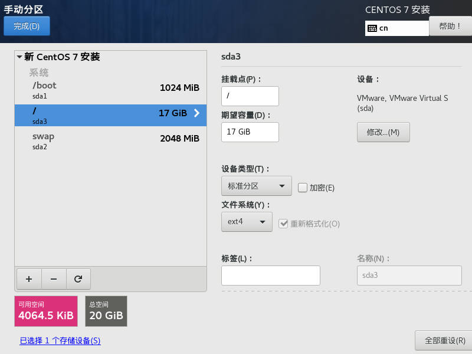

# 虚拟机安装

## 配置虚拟机并分配磁盘空间

**安装步骤**

打开VMware - 左上角文件 - 新建虚拟机 - 典型 - 稍后安装操作系统 - 客户机操作系统选择Linux，版本选择 `Red Hat Enterprise Linux 7 （即CentOS7）` - 指定虚拟机名称与位置 - 最大磁盘大小（默认），将虚拟磁盘拆分成多个文件 - 自定义硬件（网络适配器推荐NAT） - 完成

```
网络连接的三种模式说明：

1. 桥接模式：

    给虚拟系统也分配一个局域网内的IP，
    占用IP地址，容易造成IP冲突

2. NAT模式：

    网络地址转换模式
    给虚拟机再弄一个局域网，
    虚拟机可以通过母机与外界通信，
    此时母机就充当NAT路由器角色

3. 主机模式：

    单机模式，不与外界发生联系

```

## 安装系统

编辑虚拟机设置 - CD/DVD（SATA）- 使用ISO映像文件 - 确定 - 开启虚拟机

打开系统后选择 Install CentOS 7（键盘选择，白色表示选中）- 按Enter开始安装 - 选择语言 - 之后进入下一个页面

### 软件选择

选择一个图形化桌面方便操作，实际工作中可以选用默认的最小安装

界面稍作等待，点击软件选择，将最小安装更改为GNOME桌面，之后在右侧附加选项中勾选以下选项

1. 传统 X Windows系统的兼容性 

2. 兼容性程序库 

3. 开发工具

### 配置分区

点击安装位置 - 选择我要配置分区 - 点击左上角完成进入手动分区页面，分为以下三个区

1. boot分区——1G

    点击+号 - 挂载点选择 `/boot` ，期望容量1G - 添加挂载点 - 设备类型选择标准分区 - 文件系统改为ext4

2. 交换区swap —— 2G（与内存大小一致）

    交换区用于扩充内存，将处于等待状态的程序暂时换出到辅存的交换区中

    点击+号 - 挂载点选择swap，期望容量2G - 设备类型选择标准分区，文件系统选择swap

3. 根分区——剩下的全部空间

    点+号 - 挂载点选择 `/` ，期望容量17G - 设备类型选择标准分区，文件系统选择ext4

[!手动分区](1/1.手动分区.jpg)


之后点击完成 - 接受更改

### kdump

内核崩溃转储机制，可以启用

### 网络和主机名

将网络连接打开，然后可以修改主机名

上述配置完成后点击开始安装，配置ROOT密码和创建一个权限较低的用户，之后等待其安装完成并重启 - 重启完成后要同意一个协定，就可以登录了

# 虚拟机的一些操作

## 虚拟机克隆

### 方式一：

直接把安装好的虚拟系统拷贝一份重新命名，然后打开VMware - 文件 - 打开 即可

### 方式二：

使用VMware的克隆操作，克隆时需要先关闭linux系统

右键要克隆的系统 - 管理 - 克隆

选择克隆方法：

- 创建链接克隆：相当于创建一个快捷方式

- 创建完整克隆：将整个系统文件再拷贝一份

为克隆的虚拟机命名并选择位置

## 虚拟机快照

在使用虚拟机系统的时候保存一个状态，这样后面就可以回到这个状态

### 创建快照：

右键虚拟系统 - 快照 - 拍摄快照

### 回到快照：

回到快照会丢失当前状态

右键虚拟系统 - 快照 - 快照管理器 - 选定指定的快照 - 转到

## 虚拟机迁移和删除

由于虚拟系统安装好之后本质就是文件，所以迁移或删除本质就是对移动文件夹或者删除文件夹。

或者用VMware进行移除

# vmtools

用于在windows下更好的管理vm虚拟机

可以设置windows和centos的共享文件夹

## 安装vmtools

*安装vmtools需要gcc*

打开虚拟机系统 - 点击VMware工具栏中的虚拟机 - 安装VMtools - 安装好之后点进去VMware Tools文件夹 - 复制.tar.gz 文件

粘贴到 `其他位置/计算机/opt` 文件夹中 （需要root权限下才能粘贴）

之后打开一个终端
```
cd /opt
tar -axvf xx.tar.gz
解压完成后...
cd 解压得到的文件夹
./vmware -install.pl  // 安装
```

安装的过程一直回车就行

## 设置共享文件夹

在windows系统中创建一个文件夹 - 右键虚拟系统 - 设置 - 选项 - 共享文件夹 - 总是启用 - 指定路径

共享文件夹在linux中的位置：`主文件夹/其他位置/mnt/hgfs/`

在实际开发中Linux是单独一台主机，需要用网络上传或下载文件