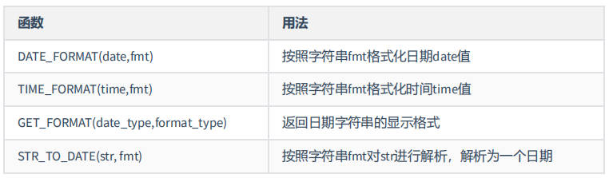
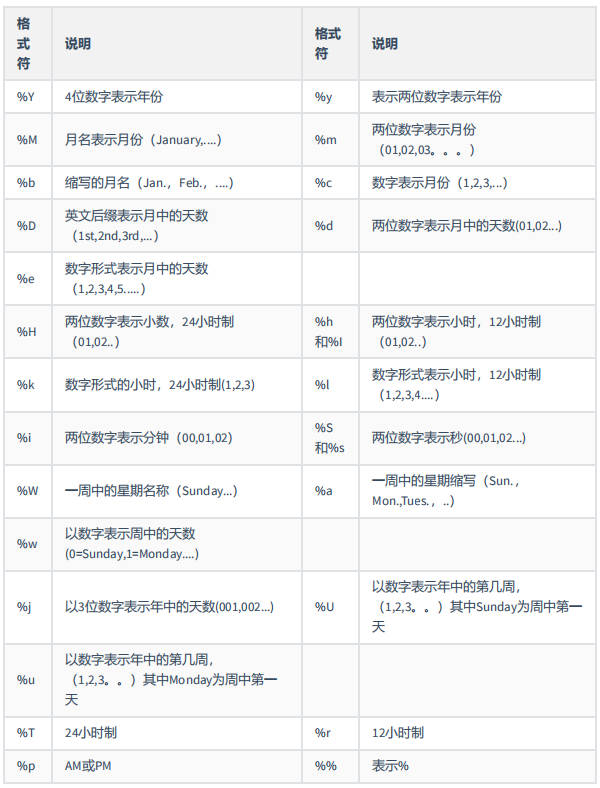
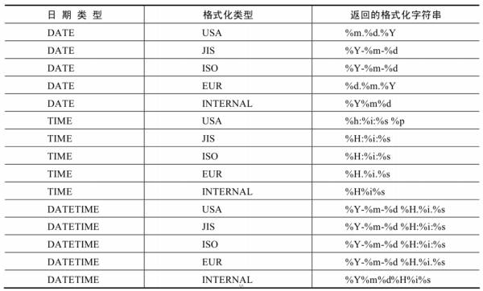
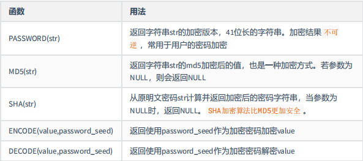
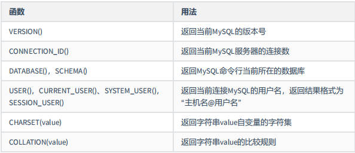
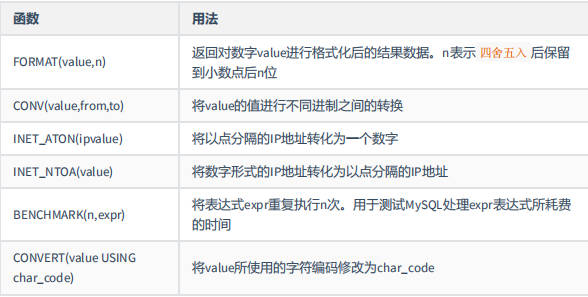

# 1. SQL语言规范

## 1.1 SQL的分类

- ### DDL：数据定义语言

    用于定义不同的数据库文件，比如数据库、表、视图、索引等

    CREATE \ ALTER \ DROP \ RENAME \ TRUNCATE

- ### DML：数据操作语言

    在一个数据库文件中对于数据库记录进行增、删、改、查

    INSERT \ DELETE \ UPDATE \ **SELECT**

- ### DCL：数据控制语言

    对执行的操作进行控制

    COMMIT \ ROLLBACK \ SAVEPOINT \ GRANT \ REVOKE

## 1.2 SQL语言的规则和规范

### 1.2.1 基本规则

- SQL可以写在一行或多行

- 每条命令以`;`或` \G` 或` \g` 结束

- 关键字不能被缩写也不能分行 

- 关于标点符号

    - 小括号、引号要成对出现
    - 使用英文状态下半角输入方式

### 1.2.2 SQL大小写规范

- 在Windows环境下大小写不敏感

- 在Linux环境下大小写敏感

    - 数据库名、表明、表的别名、变量名严格区分大小写
    - 关键字、函数名、列名（字段名）、列的别名（字段的别名）忽略大小写

推荐采用的规范：

- 数据库名、表明、表别名、字段名、字段别名小写
- SQL关键字、函数名、绑定变量等大写

### 1.2.3 注释

```SQL
# 单行注释 （MySQL特有的注释方式）

-- 单行注释 （--后面要加空格）

/*
多行注释
*/
```

## 1.3 命名规则（暂时不需要了解）

## 1.4 数据库表的导入（先简单了解）

- ### 命令行

    `source 要导入数据库的全路径;`

- ### 在图形化界面中导入

    上方工具栏 - 工具 - 执行sql脚本 - 选择要导入的文件目录

# 2. 基本SELECT语句

查询之前要先指定表名

## 2.1 SELECT ... FROM

`SELECT 字段1，字段2... FROM 表名;`

- 字段中可以填 * ，表示查找表中的所有列

- 可以直接`SELECT 1+1;` 相当于 `SELECT 1+1 FROM DUAL` 从伪表中查询，返回的结果集中字段为1+1，内容为运算结果2 

## 2.2 列的别名

给列取别名之后查询的结果集中的字段就不会出现原字段名，而是出现别名

- `SELECT 字段1 别名1 FROM 表名;`

    字段和别名之间用空格隔开

- `SELECT 字段1 AS 别名1 FROM 表名;`

    字段和别名之间用AS隔开，AS——alias

- `SELECT 字段1 "别名1" FROM 表名;`

    列的别名可以使用一对""双引号引起来，不可以用单引号

## 2.3 去除结果集中的重复行

`SELECT DISTINCT 字段名1 FROM 表名;`

使用DISTINCT关键字

## 2.4 空值参与运算

空值：某个字段的值为null，null不等同于0、''

当空值参与运算时，结果一定为null

## 2.5 着重号

如果表名或字段名和关键字名相同，将表名或字段名用着重号引起来

着重号就是左上角波浪线那个键

## 2.6 查询常数

`SELECT '常数',123,字段名 FROM 表名;`

字符串和数字都可以是常数，在结果集中会增加一个字段，每条记录的内容都是这个常数

## 2.7 显示表结构

`DESCRIBE 表名;` 或 `DESC 表名`

显示表中每个字段的详细信息，比如每个字段中内容的数据类型、是否允许为null等

## 2.8 过滤数据

`SELECT 字段名 FROM 表名 WHERE 条件;`

WHERE一定要紧挨着声明在FROM后面

也可以用WHERE NOT

查询姓为king的员工
```SQL
SELECT *
FROM employees
WHERE last_name = 'King'; 
-- SQL是区分大小写的，但是MySQL不区分
```

# 3. 运算符

## 3.1 算数运算符

### 3.1.1 加减运算

整型和浮点型运算结果为浮点型

在SQL中，加号没有连接的作用，只表示加法运算，还可以将字符串转换为数值（隐式转换）

`SELECT 100 + '1';` 会返回101

`SELECT 100 + 'a';` 返回100，将a看做0，而不是ASCII码

### 3.1.2 乘除运算

`SELECT 100 div 2;` 

除法既可以用 / 也可以用 div

除数为0时结果为null

除法一定返回浮点数

### 3.1.3 取模运算

既可以用 % 也可以用 mod

## 3.2 符号型比较运算符

比较的结果为真返回1，为假返回0，其他情况则返回null

### 3.2.1 = 等于

- 数值与数值比较

- 数值与字符串比较

    `SELECT 123 = '123', 1 = 'a', 0 = 'a';`

    字符串会进行隐式转换，转换不成功就看作1，所以结果分别为 1 0 1

- 字符串与字符串比较

    不会发生隐式转换，而是通过每个字符的ASCII码进行比较

- 只要有null参与比较，结果都是null

    `SELECT null = null;` 结果为null

    如果想用where过滤是null的数据，不能直接用等于号，因为比较结果都是null而不是1，不会有任何结果

### 3.2.2 <=> 安全等于（为null而生）

与=完全相等，唯一的区别就是关于null的判断

`SELECT null <=> null, 1 <=> null;`

第一个结果为1，第二个结果为0

### 3.2.3 <> != < <= > >=

<> 和 != 都是不等于的意思

不确定有null参与的运算结果试试就知道了

`SELECT null <> null FROM DUAL;`

## 3.3 关键字型比较运算符

### 3.3.1 关键字

| 运算符 | 作用| 示例|
| -------|------------|-------|
|IS NULL | 判断是否为null|`WHERE 1 IS NULL;`|
|IS NOT NULL|判断是否不为null|
|ISNULL()|判断是否为null，是个函数|`WHERE ISNULL(1);`|
|LEAST()|返回最小值|`SELECT LEAST(last_name,first_name) FROM 表名;`|
|GREATEST()|返回最大值||
|BETWEEN 下界 AND 上界|找到符合下界到上界(包括边界值)的记录|`WHERE salary BETWEEN 6000 AND 8000`|
|IN(set)|找到等于set中包含的离散值的记录|`WHERE salary IN (10000,20000);`
|NOT IN(set)|不在set中的记录||
|LIKE '查询规则'|模糊查询|`WHERE last_name LIKE '%a%';`|
|REGEXP '正则表达式'|||

***有null时特别注意***

- IN 相当于 是 OR，等于这个OR等于那个

    所以在set中有NULL时可以忽略掉null的影响，前提是IN的结果本来就是1

    比如`select 8 in (8,9,null)`返回1

- NOT IN 相当于是 AND ，不等于这个AND不等于那个

    所以当set中有null值时一定返回null，即一定不会取出结果

    比如`select 7 not in (8,9,null)`返回null

### 3.3.2 LIKE的查询规则：

- %：表示0个或任意个任意字符

    `%a%`：查询包含a的字符串

- _：占位符，表示一个任意字符

    `_a%`：第二个字符是a的字符串

- \：转义字符

## 3.4 逻辑运算符

|运算符|作用|
|---|---|
|NOT 或 !|逻辑非|
|AND 或 &&| 逻辑与 |
|OR 或 \|\| | 逻辑非 |
|XOR|逻辑异或|

优先级：AND > OR 

***有null时特别注意：***

- 1 OR NULL ： 返回是1
- 0 OR NULL : 返回是null
- 1 AND null ： 返回是null

AND只要有null参与结果都是null，OR在有真值的情况下可以忽略掉null的影响

## 3.5 位运算符


|  运算符   | 含义 |
| :-------: | :--: |
|     &     |  与  |
|    \|     |  或  |
|     ^     | 异或 |
| ~(波浪线) | 取反 |
|    >>     | 右移 |
|    <<     | 左移 |

# 4. 排序

如果没有使用排序操作，默认返回的数据是按照添加的顺序排序的

## 4.1 ORDER BY

对查询到的数据进行排序操作，默认（升序）从低到高

- ASC升序(ascend)
- DESC降序(descend)

示例：
```SQL
SELECT salary * 12 "annual_sal"
FROM employees
WHERE department_id IN (50,60,70); 
-- WHERE一定要紧挨着FROM
ORDER BY annual_sal DESC;
```

可以使用列的别名进行排序（列的别名只能在ORDER BY中使用，不能在WHERE中使用），这是由于语句执行顺序为：

1. FROM：先找到表
2. WHERE：找到符合条件的记录
3. SELECT：再从其中挑出想要的字段
4. ORDER BY：排序

执行WHERE的时候还没有读到SELECT，自然也不知道有别名

## 4.2 多列排序

先按照某列排序，如果相同再按照另一个列排序

直接再后面加 , 逗号，继续添加规则即可

`ORDER BY salary DESC, department_id ASC`

# 5. 分页显示

查询的结果太多，可以分多次显示

## 5.1 LIMIT基本使用

`LIMIT 偏移量，每页显示的数据个数`

如果偏移量是0可以省略，特别地，`LIMIT 1` 就表示显示第一条数据

```SQL
-- 每页显示pageSize条记录，
-- 此时显示第pageNum个页面
SELECT 
FROM
LIMIT (pageNum-1) * pageSize, pageSize;
# LIMIT后面只能写常量，不能使用运算符
```

## 5.2 LIMIT声明顺序

最后写LIMIT

## 5.3 OFFSET关键字

MySQL8.0新特性

`OFFSET 条目数 OFFSET 偏移量`

# 6. 多表查询基本概念 与 SQL92语法实现

多表查询，也称为关联查询，指两个或更多个表一起完成查询操作

前提是这些一起查询的表是有关系的（一对一、一对多），它们之间有关联字段

## 6.1 错误的多表查询

```SQL
SELECT employee_id,department_name
FROM employees,departments;
-- employee_id在表employees中
-- department_name在表departments中
-- 表employees有107条数据
-- 表departments中有27条数据
```

- 结果：执行出来的结果共有2889条数据，即107×27

- 错误：笛卡尔积错误（交叉连接），即错误地发生两个表中的每条记录都匹配了一遍

    就等同于`FROM employees CROSS JOIN departments;`

- 出现笛卡尔积错误的原因：

    - 缺少多表连接条件
    - 连接条件无效
    - 所有表中的所有行互相连接

- 解决办法：在 WHERE 加入有效的连接条件

## 6.2 多表查询的正确方式

在WHERE中加入有效的连接字段。有多张表的话连接字段之间用AND连接

n个表之间至少需要有n-1个连接条件

```SQL
SELECT employee_id,department_name
FROM employees,departments
-- 连接条件:
WHERE employees.department_id = departments.department_id;
```

如果SELECT中出现了多个表中共有的字段，则必须指明要的是哪个表中的字段。

建议在多表查询时每个字段前都指明其所在的表
```SQL
SELECT employee_id,department_name,employees.department_id
FROM employees,departments
WHERE employees.department_id = departments.department_id;
```

可以给表起别名，起完别名后在SELECT和WHERE中***必须***使用表的别名，不能使用表的原名
```SQL
SELECT emp.employees_id,dept.department_name
FROM employees emp, departments dept
WHERE emp.department_id = dept.department_id;
```

## 6.3 等值连接 与 非等值连接

上述讲的都是等值连接，非等值连接写法为：

表job_grade:
|grade_level|lowest_sal|highest_sal|
|---|---|---|
|A|1000|2999|
|B|3000|5999|
|C|6000|9999|
|D|10000|14999|

查询每个人的工资等级：
```SQL
SELECT e.salary,j.grade_level
FROM employees e, job_grade j
WHERE e.salary >= j.lowest_sal 
AND e.salary <= j.highest_sal;
-- WHERE e.salary BETWEEN j.lowest_sal AND j.highest_sal;
```

## 6.4 自连接 与 非自连接

自连接即自我引用，表中有一个字段的值 与 本表有关联

要将实际上的一张表看作逻辑上的两张表，起不同的名字 

查询员工id姓名 及其 对应的管理者的id姓名

```SQL
SELECT emp.id,emp.last_name,gmr.id,mgr.last_name
FROM employees emp, employees mgr
WHERE emp.manager_id = mgr.employee_id;
```

## 6.5 内连接 与 外连接

### 6.5.1 内连接概念：

只返回满足连接条件的记录，不满足的连接条件的记录不返回。

前面的都是内连接

比如：
```SQL
SELECT employee_id,department_name
FROM employees e,departments d
WHERE e.department_id = d.department_id;
```
只会返回两个表中department_id相同的记录，如果表中记录department_id字段为null，就不满足条件，就不会返回

### 6.5.2 外连接概念：

想把不满足连接条件的记录也拼接并返回，称为外连接。没有匹配的行时，结果表中相应的列为空（NULL）

- 左外连接

    除了返回满足连接条件的行以外还返回左表中不满足条件的行

- 右外连接

    除了返回满足连接条件的行以外还返回右表中不满足条件的行

- 满外连接

    左表、右表中不满足条件的行都返回

### 6.5.3 左外连接

查询 ***所有的*** 员工的last_name 和 departmen_name信息

（一般有所有的要求，并且是两个表，就要注意使用外连接）

- SQL92语法：（MySQL中不支持）

- 基本思路：左外连接一定是左边长右边短（左表返回的行数多），那就把右边垫起来

- 具体语法：在右边添一个加号

    ```SQL
    SELECT
    FROM
    WHERE e.department_id = d.department_id(+);
    ```

### 6.5.4 右外连接

### 6.5.5 满外连接

# 7. 多表查询——SQL99语法实现


## 7.1 中图：内连接

两张表：内连接INNER可以省略
```SQL
SELECT e.last_name,d.department_name
FROM employees e INNER JOIN departments d
ON e.department_id = d.department_id;
```

多张表：多一张表就多一个JOIN ON
```SQL
SELECT last_name,department_name,city
FROM employees e JOIN departments d
ON e.department_id = d.department_id
JOIN locations l
ON d.location_id = l.location_id;
```

## 7.2 左/右上图：左/右外连接

- 左外连接：

    ```SQL
    SELECT last_name,department_name
    FROM employees e LEFT OUTER JOIN departments d
    ON e.department_id = d.department_id;
    ```

    OUTER可以省略

- 右外连接：RIGHT OUTER JOIN

## 7.3 左/右中图

- 左中图

    相当于把左上图（左外连接）的中间部分给过滤掉，过滤自然要用WHERE

    ```SQL
    SELECT employee_id,department_id
    FROM employees e LEFT JOIN departments d
    ON e.department_id = d.department_id
    WHERE d.department_id IS NULL;
    ```

- 右中图

    在右上图（右外连接）的基础上把中间部分过滤掉

## 7.4 UNION操作符

把两个结果集拼到一起，要求两个结果集列数得一样，每个字段也得一样

- UNION操作符

    返回两个查询的结果集的并集，去除重复记录

- UNION ALL操作符

    返回两个查询的结果集的并集，不去重

执行UNION ALL所需的资源比UNION语句少（因为不需要去重），尽量使用UNION ALL语句

    union all 与 or 的区别：
    
    1. or会自动去重
    2. or无法保证显示顺序，union all可以保证
        先显示上面的结果再显示下面的结果

使用UNION或UNION ALL操作符后，只能使用一条ORDER BY，且只能位于UNION的最后一个SELECT语句之后。因为对于一个结果集来说，不存在一部分按照这个排序，另一部分按照那个排序。

## 7.5 左下图：满外连接

SQL99语法：`FULL OUTER JOIN`。但是MySQL不支持FULL

- 方式一：左上图 + 右中图（UNION SLL）

    ```SQL
    SELECT
    FROM e LEFT JOIN d
    ON e.department_id = d.department_id
    UNION ALL
    SELECT
    FROM e RIGHT JOIN d
    ON e.department_id = d.department_id
    WHERE e.department_id IS NULL;
    ```
- 方式二：右上图 + 左中图

## 7.6 右下图

左中图 UNION ALL 右中图

## 7.7 SQL99语法新特性

### 7.7.1 自然连接 NATURAL JOIN

可以把自然连接理解为SQL92中的等值连接，不过它会自动强行帮你把两张表中所有相同的字段进行等值连接

比如employees表和departments表中有两个相同的字段department_id,和manager_id，则

```SQL
SELECT
FROM e JOIN d
ON e.department_id = d.department_id
AND e.manager_id = d.manager_id
```

就等同于

```SQL
SELECT
FROM e NATURAL JOIN d;
```

### 7.7.2 USING

等值连接的简写方式，用USING来替换连接条件ON，只有要等值连接的两个字段名相同时才可以使用

```SQL
SELECT 
FROM e JOIN d
USING (department_id);
```

# 8. 单行函数

送进去一行数据，出来一行数据，即只对一行进行变换

## 8.1 数值函数

### 8.1.1 基本函数

|函数|用法|
|---|---|
|ABS(x)|返回x的绝对值|
|SIGN(x)|返回x的符号，正数：-1，负数：-1，0：0|
|PI()|返回圆周率的值|
|CEIL(x),CEILING(x)|向上取整（天花板）|
|FLOOR(x)|向下取整（地板）|
|LEAST(e1,e2...)|返回列表中的最小值|
|GREATEST(e1,e2...)|返回列表中的最大值|
|MOD(x,y)|返回x%y|
|RAND()|返回0~1的随机数|
|RAND(x)|返回0~1的随机数，x的值作为种子值|
|ROUND(x)|返回x四舍五入到整数后的值|
|ROUND(x,y)|对x进行四舍五入，保留y位小数|
|TRUNCATE(x,y)|返回数字x截断到y位小数|
|SQRT(x)|返回x的平方根。如果x为负数则返回null|

- RAND(x)

    如果两个RAND(x)中种子的值是相同的，能保证同时取到的随机数是相同的

- ROUND(x,y)

    四舍五入到小数点后y位，y可以是负数，即四舍五入到小数点前y位

    比如ROUND(123.456,-1)，返回就是120

### 8.1.2 三角函数

|函数|用法|
|----|----|
|RADIANS(x)|将角度转化为弧度，x为角度值|
|DEGREES(x)|将弧度转化为角度，x为弧度值|
|SIN(x)|返回x的正弦，x为弧度值|
|ASIN(x)|返回arcsinx的弧度值，x不在-1到1之间则返回null|
|COS(x)|返回x的余弦值，x为弧度值|
|ACOS(x)|返回arccosx的弧度值|
|TAN(x)|返回x的正切值，x为弧度值|
|ATAN(x)|返回arctanx的弧度值|

### 8.1.3 指数和对数

|函数|用法|
|---|----|
|POW(x,y),POWER(x,y)|返回x^y|
|EXP(x)|返回e^x|
|LN(x),LOG(x)|返回lnx，x<=0时返回null|
|LOG10(x)|返回log10x|
|LOG2(x)|返回log2x|

只有这几个函数，不能自定义底数

### 8.1.4 进制转换

|函数|用法|
|---|----|
|BIN(x)|返回x的二进制编码|
|HEX(x)|返回x的十六进制编码|
|OCT(x)|返回x的八进制编码|
|CONV(x,f1,f2)|把f1进制数变成f2进制数|

## 8.2 字符串函数

|函数|用法|
|---|----|
|ASCII(S)|返回S中的第一个字符的ASCII码|
|CHAR_LENGTH(s)</br>CHARACTER_LENGTH(s)|返回字符串s的字符数，汉字就是字的个数|
|LENGTH(s)|返回字符串s的字节数，这和用的字符集有关|
|CONCAT(s1,s2,......)|连接s1，s2......为一个字符串|
|CONCAT_WS(x,s1,s2...)|连接字符串，字符串之间以x作为分隔|
|INSERT(str,idx,len,replacestr)|将字符串str从第idx位置开始（字符串索引从1开始）</br>len个字符长的字串替换为replacestr|
|REPLACE(str,a,b)|用字符串b替换str中所有的字符串a|
|UPPER(s)</br>UCASE(s)|将字符串s的所有字母转成大写字母|
|LOWER(s)</br>LCASE(s)|将s中所有字符转成小写字母|
|LEFT(str,n)|返回str最左边的n个字符|
|RIGHT(str,n)|返回str最右边的n个字符|
|LPAD(str,len,pad)|用字符串pad对str最左边填充，填充至str的长度为len个字符(pad会用pad循环填充)，可以用于右对齐|
|RPAD(str,len,pad)|用pad对str最右边进行填充，可以用于左对齐|

|函数|用法|
|----|----|
|LTRIM(s) / RTRIM(s)|去掉字符串s开头/结尾的空格|
|TRIM(s)|去掉字符串s开头与结尾的空格|
|TRIM(s1 FROM s)</br>TRIM(LEADING s1 FROM s)</br>TRIM(TRRAILING s1 FROM s)|去掉字符串s开头和结尾/开头/结尾处的s1|
|REPEAT(str,n)|返回str重复n次的结果|
|SPACE(n)|返回n个空格|
|STRCMP(s1,s2)|比较字符串s1和s2的ASCII码值大小|
|SUBSTR(s,index,len)</br>SUBSTRING(s,index,len)</br>MID(s,index,len)|返回字符串s中从index开始的len个字符|
|LOCATE(substr,str)</br>POSITION(substr IN str)</br>INSTR(str,substr)|返回子串substr在字符串str中首次出现的位置，没找到就返回0|
|ELT(m,s1,s2...sn)|返回m指定位置的字符串，比如m=1就返回s1|
|FIELD(s,s1,s2,...,sn)|返回s在字符串列表中第一次出现的位置|
|FIND_IN_SET(s1,s2)|返回s1在s2中出现的位置，其中s2是一个以逗号分隔的字符串|
|REVERSE(s)|返回s反转后的字符串|
|NULLIF(value1,value2)|如果value1与value2相等则返回null，否则返回value1|

- SUBSTRING_INDEX(str,"分隔符",index)

    将字符串str按分隔符分割，之后取出index个子字符串

    比如`SUBSTRING_INDEX("www.baidu.com",".",1)` 取出www，如果是-1就取出com，如果是2就取出www.baidu

- GROUP_CONCAT()，将分组后的字段连接

  ```sql
  GROUP_CONCAT(
  		[distinct] 要连接的字段
      	[ORDER BY 排序字段]
      	[SEPARATOR '分隔符']
  		)
  
  比如，将员工分部门显示，按姓名升序排序，用逗号连接
  select department_id, group_concat(
  					name
      				order by name
      				separator ','
  					)
  from employees
  group by department_id;
  ```

  

## 8.3 日期和时间函数

### 8.3.1 获取日期、时间

|函数|用法|
|---|---|
|CURDATE()</br>CURRENT_DATE()|返回当前日期，只包含年月日|
|CURTIME()</br>CURRENT_TIME()|返回当前时间，只包含时分秒|
|NOW()|返回当前系统日期和时间|
|UTC_DATE()|返回UTC(世界标准时间)日期|
|UTC_TIME()|返回UTC时间|

### 8.3.2 日期与时间戳的转换

UNIX时间戳：从1970年1月1日0点开始所经过的秒数

|函数|用法|
|---|---|
|UNIX_TIMESTAMP()|以UNIX时间戳的形式返回当前时间|
|UNIX_TIMESTAMP(date)|将指定时间date以UNIX时间戳的形式返回|
|FROM_UNIXTIME(timestamp)|将UNIX时间戳的时间转换为普通格式的时间|

时间格式一般为：年-月-日 时:分:秒

### 8.3.3 获取月份、星期、星期数、天数

|函数|用法|
|-|-|
|YEAR(date)</br>MONTH(date)</br>DAY(date)</br>HOUR(time)</br>MINUTE(time)</br>SECOND(time)|从日期中过滤出年/月/日/时/分/秒|
|MONTHNAME(date)|返回月份的名称：January...|
|DAYNAME(date)|返回星期几：MONDAY......|
|WEEKDAY(date)|返回周几：周一是0~周日是6|
|QUARTER(date)|返回日期对应的季度：1~4|
|WEEK(date)/WEEKOFYEAR(date)</br>DAYOFYEAR(date)|返回日期是一年中的第几周/天|
|DAYOFMONTH(date)|返回日期位于月份的第几天|
|DAYOFWEEK(date)|返回周几，周日是1~周六是7|

### 8.3.4 提取日期中指定信息的函数

`EXTRACT(type FROM date)`

返回指定日期中type指定的部分

|type取值|含义|
|--|--|
|MICROSCOND|返回毫秒数|
|SECOND|返回秒数|
|MINUTE|返回分钟数|
|HOUR|返回小时数|
|DAY|返回天数|
|WEEK|返回date在一年中的第几个星期|
|MONTH|返回日期在一年中的第几个月|
|QUARTER|返回日期在一年中的第几个季度|
|YEAR|返回日期的年份|

type也可以组合，比如SECOND_MICROSECOND返回秒数和毫秒数

### 8.3.5 时间和秒数转换的函数

|函数|用法|
|--|--|
|TIME_TO_SEC(time)|将time转化为秒。转化公式为小时*3600+分钟\*60+秒|
|SEC_TO_TIME(seconds)|将seconds转化为时分秒，从当日0点开始算|

### 8.3.6 计算日期和时间间隔的函数

**计算日期：**

`DATE_ADD(datetime,INTERVAL expr type)`

`ADDDATE(date,INTERVAL expr type)`

`DETE_SUB(date,INTERVAL expr type)`

`SUBDATE(date,INTERVAL expr type)`

返回给定日期加/减去INTERVAL时间间隔的日期，实际上记一个就够了，因为加负数就是减去

比如`DATE_ADD(NOW(),INTERVAL '1_1' year_month)`返回当前日期加1年同时加1个月的日期

间隔类型type和EXTRACT函数的type相同

**计算时间间隔：**


### 8.3.7 日期的格式化与解析

格式化：日期 ---> 指定格式的字符串

解析：字符串 ---> 日期

函数：



fmt参数中常用的格式符:



GET_FORMAT函数中date_type和format_type参数取值：



## 8.4 流程控制函数

- IF(value,value1,value2)

    如果value的值为TRUE，则返回value1，否则返回value2

- IFNULL(value1,value2)

    如果value1不为NULL就返回value1，否则返回value2

- CASE WHEN...THEN

    类似与if...else if...else

    ```SQL
    SELECT 字段1,CASE WHEN department_id = 10 THEN 结果1
                      WHEN department_id = 20 THEN 结果2
                      ELSE 结果3 END
    FROM 表;
    ```

- CASE express WHEN ... THEN

    类似于switch...case

    如果条件不是等于还是得写完整

    ```SQL
    SELECT 字段1,CASE department_id WHEN 10 THEN 结果1
                                    WHEN 20 结果2
                                    WHEN 30 结果3
                                    END
    FROM 表;
    ```

## 8.5 加密解密函数

用于对数据库中的数据进行加密和解密处理，以防止数据被他人窃取

但是实际上数据发送前客户端就应该加密完了，而不是传输到数据库之后再加密



PASSWORD、ENCODE、DECODE函数在MySQL8.0中被弃用

MD5和SHA加密方式都是不可逆的，但是相同内容加密后是唯一的，SHA加密更加安全

## 8.6 获取MySQL相关信息的函数



## 8.7 其他函数



- FORMAT函数如果n<=0就保留整数

- BENCHMARK用于测试表达式的执行效率

# 9. 聚合函数

也叫聚集、分组函数，对一组（多行）数据进行汇总的函数。输入多行数据，输出单个值

比如输出表中工资最大值

***MySQL中聚合函数是不能嵌套使用的***

## 9.1 常用聚合函数

### 9.1.1 SUM / AVG

只适用于数值类型的字段，计算时会自动过滤null值

```SQL
SELECT AVG(salary),SUM(dalary)
FROM employees;
```

### 9.1.2 MAX / MIN

能比较大小的类型都能用：数值类型、字符串类型、日期时间类型

```SQL
SELECT MAX(salary),MIN(salary)
FROM employees;
```
### 9.1.3 COUNT

- 作用：计算满足指定字段的行数，如果某行指定字段的值为null则不会计算

    如果参数填常数，比如COUNT(1)，会返回表的行数，相当于每行都有一个1

- `AVG(字段) = SUM(字段)/COUNT(字段)`

    但是在有些情况下计算平均值不能忽略掉值为null的记录，比如计算全国平均工资分母中也得算上没有工资的人

    `SUM(字段) / COUNT(IFNULL(字段,0))`

    或者 `AVG(IFNULL(commission_pct,0))`

- 直接统计表中记录数：

    - COUNT(*)
    - COUNT(常数)
    - COUNT(具体字段)

    如果使用MyISAM存储引擎（MySQL5.7），时间复杂度都是O(1)，因为会专门记录表中的记录数

    如果使用InnoDB存储引擎：效率COUNT(*) = COUNT(1) > COUNT(字段)

- 统计去重后的记录数：（不会统计值为NULL的记录）

    `COUNT(DISTINCT col1,col2);` 

    col1与col2的值不全相同就会统计，而col1与col2中只要有一个是null则该记录不会统计

### 9.1.4 聚合函数里面加条件

**通过条件统计**

`count(col1 > 50)` = `count(*)`，

count只统计数量，而col1 > 50 只有两个值，即0或1，而这两个值都会被count计数一次

`count(col1 > 50 or null)` = `sum(col1 > 50)`

表示统计col1的值 大于50的记录

```
count(col1 > 50 or null) ：
如果col1>50，即条件为真，则逻辑短路，直接返回1
如果col<=50，即条件为假，则会查看后面的条件，然后发现后面是null，
			但是null和任何值做任何运算都是null，所以返回null，count不计算

也等同于count(if(col1 > 50, 1, null))
```

**聚合函数里用CASE WHEN THEN**

## 9.2 GROUP BY

用于将整张表分成几个组，可以在每个组中分别使用聚合函数

### 9.2.1 根据单个字段分组

查询各个部门的平均工资：
```SQL
SELECT department_id,AVG(salary)
FROM employees
GROUP BY department_id;
```

### 9.2.2 根据多个字段分组

查询各个部门不同工种的平均工资：
```SQL
SELECT department_id,job_id,AVG(salary)
FROM employees
GROUP BY department_id,job_id;
```

***注意事项：***

- 先根据谁分组都一样，

    即GROUP BY后面先写哪个字段都一样

- SELECT中出现的非聚合函数的字段，一定都要出现在GROUP BY当中

- GROUP BY要声明在FROM后面，WHERE后面，ORDER BY前面，LIMIT前面

### 9.2.3 WITH ROLLUP

在GROUP BY后面加一个WITH ROOUP关键字，会在结果集最后加一行

这行是将整张表放入聚合函数中算出的结果

`GROUP BY 字段1,字段2... WITH ROLLUP`

WITH ROLLUP与ORDER BY相互矛盾，不能同时使用。因为额外加的一行总体的无法参与排序

## 9.3 HAVING

### 9.3.1 HAVING的用法

用于过滤数据，用法：

- 当过滤条件中出现聚合函数时，就不能再使用WHERE，而要使用HAVING替换WHERE

- HAVING要声明在GROUP BY后面，一般是有GROUP BY才会用

- 过滤条件中没有聚合函数时，用WHERE或HAVING中都可以，但是要使用WHERE

案例：查询部门id为10，20，30，40的部门中最高工资比10000高的部门信息

方式一：推荐，效率高

```SQL
SELECT department_id,MAX(salary)
FROM employees
WHERE department_id IN (10,20,30,40)
GROUP BY department_id
HAVING MAX(salary) > 10000;
```

方式二：

```SQL
SELECT department_id,MAX(salary)
FROM employees
GROUP BY department_id
HAVING MAX(salary > 10000) 
AND department_id IN (10,20,30,40);
```

### 9.3.2 HAVING与WHERE对比

- 适用范围：

    HAVING的适用范围更广

- 执行效率：

    当过滤条件中没有聚合函数时，WHERE比HAVING效率高

# 10. SELECT查询语句执行过程

```SQL
-- 2.
SELECT 字段,聚合函数
-- 1.
FROM 表 (LEFT/RIGHT)JOIN
ON 多表连接条件
WHERE 过滤条件(不包含聚合函数)
GROUP BY 分组
HAVING 过滤条件(包含聚合函数)
-- 3.
ORDER BY 排序方式
LIMIT 分页操作
UNION
...
```

1. FROM：先找到表

    如果有JOIN多表就将所有表先CROSS JOIN(笛卡尔积)

2. ON：指明连接条件，将不符合关联关系的过滤掉

3. WHERE：按条件过滤数据

4. GROUP BY：将过滤后的数据分组

5. HAVING：分组后的数据再过滤

6. SELECT：把想要的字段拿出来

    如果有DISTINCT还要去重

7. ORDER BY：排序

8. LIMIT：分页显示

关于子查询的结论：

除了GROUP BY和LIMIT中，其他位置都可以写子查询

# 11. 子查询

就是一个查询语句嵌套在另一个查询语句的内部，执行过程相当于嵌套一层for循环

优先使用多表连接

## 11.1 基本使用

案例：查询比Abel工资高的员工
```SQL
SELECT last_name, salary
FROM employees
WHERE salary > (
                SELECT salary
                FROM employees
                WHere last_name = 'Abel'
                );
```

外层的叫外查询（主查询），内层叫内查询（子查询）

- 子查询在主查询之前执行完成
- 子查询的结果被主查询使用

**子查询的分类**

- 单行子查询 vs 多行子查询

    子查询每次只返回一条记录就是单行子查询

    子查询每次返回一个结果集就是多行子查询

- 相关子查询 vs 不相关子查询

    子查询每次返回的结果都是相同的，即与主查询无关，就是不相关子查询

    而根据外查询执行到的数据不同内查询返回的结果也不同的，就是相关子查询

## 11.2 单行子查询

内查询只返回一行数据的就叫单行子查询

单行子查询的比较操作符：

= > >= < <= <>

与数值的比较操作符相同

## 11.3 多行子查询

也称为集合比较子查询，内查询返回多行数据

多行比较操作符：

|操作符|含义|
|---|---|
|IN|等于列表中的任意一个|
|ANY/SOME|需要和单行比较操作符一起使用，和子查询返回的某一个值比较|
|ALL|需要和单行比较操作符一起使用，和子查询返回的所有值比较|

ALL ：比如小于什么的最小值就可以用`< ALL (子查询)`，比所有的都小

ANY：小于任一什么什么或大于任一什么什么（小于最大值或大于最小值）就用ANY

## 11.4 相关子查询

子查询的执行依赖于主查询，即每执行一次外部查询，子查询都要重新计算一次

**题目：**

查询员工中工资大于本部门平均工资的员工的last_name,salary和其department_id

**代码：**

```SQL
SELECT last_name, salary, department_id
FROM employees e1
WHERE salary > (
            SELECT AVG(salary)
            FROM employees e2
            WHERE e2.department_id = e1.department_id
                );
```

**执行过程：**

1. 拿到e1中的一行数据，然后送入子查询中

2. 子查询中，在e2表内过滤出所有与送入数据department_id相同的记录，并计算出平均值

3. 用该行数据中的salary与子查询计算出的平均值进行比较，如果大于就保留，不大于就舍弃

## 11.5 EXISTS 和 NOT EXISTS关键字

跟IN的功能差不多，判断是否在满足要求的集合中

**题目**

查询公司管理者的employee_id，last_name，job_id，department_id信息

**代码：**

```SQL
SELECT employee_id,......
FROM employees e
WHERE EXISTS (
            SELECT *
            FROM employees m
            WHERE m.manager_id = e.employee_id
            );
```

**执行过程**

1. 从e中拿到一行数据传入子查询中

2. 子查询开始遍历m表，检查m的每一行，直到发现m中某行数据的manager_id 与e中传入记录的employee_id相等，就停止遍历。

3. 返回e中传入的数据是满足m.manager_id = e.employee_id的


# 12. 窗口函数

主要用于在分组的同时完成组内的排名操作

与GROUP BY分组不同之处在于，窗口函数分组后不会丢失任何数据，不会将一个组合并为一条记录

## 12.1 基本语法

```SQL
窗口函数 over (partition by 用于分组的列名
            order by 用于排序的列名 ASC|DESC)
```

```sql
窗口函数 over 窗口名
...
WINDOW 窗口名 AS (PARTITION BY 字段名
              ORDER BY 字段名 ASC|DESC)
# 就相当于在SQL语句最后给窗口函数起了个别名，然后前面就可以直接用别名，要写在WHERE后面
```

其中窗口函数包括：

专用窗口函数：

- rank
- dense_rank
- row_number

聚合函数：

- sum
- avg
- count
- max
- min

由于窗口函数是对where或group by子句处理后的结果进行操作，所以原则上只能写在select语句中

## 12.2 专用窗口函数：

### 12.2.1 序号函数

将每个部门内按照工资排名

```SQL
select *, rank() over (partition by department_id
                order by salary desc) as ranking
from employees;
```

```sql
SELECT *, rand() over w as ranking
from employees
WINDOW w as (partition by department_id
            order by salary desc);
```


结果会将表按部门分组的同时，在每个部门内按照工资从高到低排序，同时加一行ranking字段表示排名

**其他序号函数：**

- rank()：如果有并列名次，会占用下一名次

    比如两个并列第一，则排名为1，1，3

- dense_rank()：如果有并列名次，不占用下一名次

    两个并列第一，排名为1，1，2

- row_number()：不考虑并列名次

    两个并列第一，排名为1，2，3

### 12.2.2 分布函数

**PERCENT_RANK()**

等级值百分比函数，计算公式为`(rank-1)/(rows-1)`，即用rank()排序后的序号-1除以总行数-1

**CUME_DIST()**

查询小于或等于当前记录中某个值的比例

### 12.2.3 获取排序后某个名次

**FIRST_VALUE(expr)**

返回分组内排序后第一条记录的expr的值

```sql
# 按照价格升序排序，返回最小的价格
select *, FIRST_VALUE(price) over w as least_price
from goods
WINDOW w as (PARTITION BY category_id order by price);
```

**LAST_VALUE(expr)**

返回分组内排序后最后一条记录的expr字段的值

**NTH_VALUE(expr,n)**

返回分组内排序后排名为n的记录的expr字段的值

## 12.3 聚合函数作为窗口函数

```SQL
select sum(salary) over (partition by department_id
                        order by salary desc) as sum_sal
from employees;                     
```

首先把表按部门分好，并在每个部门内按照工资降序排列，之后增加一个sum_sal字段

sum_sal字段的值为：在本部门中，截止到本行（本行及其以上行）的工资总和

作用：可以在每一行的数据里直观的看到截止到本行数据，统计数据是多少。同时可以看出每一行数据对整体统计数据的影响