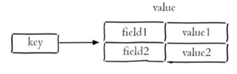
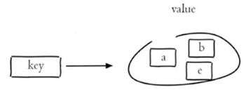

# 1. QuickStart

Redis是一个基于内存的key-value结构数据库，由于存放在内存中故读写性能高，适合用于缓存

## 1.1 下载安装

Windows可以直接在

https://github.com/tporadowski/redis/releases/tag/v5.0.14.1

中下载压缩包，解压缩后即完成安装

其中

- redis.windows.conf是Redis配置文件
- redis-cli.exe是Redis客户端，用于连接Redis服务器
- redis-server.exe是Redis服务端，用于打开Redis服务器

## 1.2 启动服务器

在Redis安装目录中打开命令行，执行`redis-server.exe redis.windows.conf`命令即可打开

其中后面是指定启动服务器所使用的配置文件

默认使用6379端口

默认没有密码，可以在配置文件中使用 `requirepass` 指定密码，指定密码之后客户端就需要输入密码以连接服务器

## 1.3 连接Redis服务

**命令行**

在Redis安装目录中打开命令行，执行

`redis-cli.exe -h localhost -p 6379 -a password`

命令连接服务器，-h指定主机，-p指定端口号，-a指定密码（Redis没有用户名的概念）

**图形化界面**

可以下载[AnotherRedisDesktopManager](https://github.com/qishibo/AnotherRedisDesktopManager)来使用图形化界面连接和操作Redis

## 1.4 常用数据类型

Redis使用key-value结构存储数据

其中key是字符串类型，value有5中常用的数据类型

- 字符串 string

- 哈希 hash

  也叫散列，类似于HashMap结构，里面是field和value的映射

- 列表 list

  类似于LinkedList，可以从头部插入也可以从尾部插入，保存了插入顺序

- 集合 set

  无序集合，没有重复元素，类似于HashSet

- 有序集合 sorted set / zset

  没有重复元素，集合中每个元素关联一个分数，根据分数升序排序

# 2. Redis常用命令

Redis对于不同的value数据类型有不同的命令来操作

## 2.0 通用命令

查找所有符合给定模式的key：`KEYS pattern` ，比如`KEYS *`返回所有key

检查给定的key是否存在：`EXISTS key`

返回key对应的value的类型：`TYPE key`

删除key：`DEL key`

## 2.1 字符串

**增**

设置指定key的值： `SET key value`

设置指定key的值，并将key的过期时间设为seconds秒： `SETEX key seconds value`

只有在key不存在时设置key的值： `SETNX key value`

**查**

`GET key`

## 2.2 哈希表hash

Redis hash类型是一个field和value的映射表，其中field和value都是字符串



**增\改**

将key对应的哈希表中字段field的值设为value ： `HSET key field value`

**查**

获取存储在哈希表中指定字段的值：`HGET key field`

获取哈希表中所有字段：`HKEYS key`

获取哈希表中所有值：`HVALS key`

**删**

删除存储在哈希表中的指定字段：`HDEL key field`

## 2.3 列表list

Redis列表是字符串列表，按照插入顺序排序，插入删除操作类似于队列，只能头插尾删，但是可以获取指定下标的元素

**增**

将一个或多个值插入列表头部：`LPUSH key value1 value2 value3`

LPUSH的意思是Left Push，也就是从列表左侧头部插入元素，插入完之后列表的元素顺序为 `value3 value2 value1`，对应的id依次是1，2，3，新插入的元素id是1

**查**

获取列表指定范围内的元素（下标从0开始，最新插入的元素下标为0，-1表示结尾）：`LRANGE key start stop`

移除并获取列表最后一个（最右侧，最先插入）的元素：`RPOP key`

获取列表长度：`LLEN key`

## 2.4 集合set

Redis set是string类型的无序集合。集合成员是唯一且不重复的，只能获取全部成员，无法获取指定元素。



**增**

向集合添加一个或多个成员：`SADD key member1 member2`

**插**

获取集合的所有成员：`SMEMBERS key`

获取集合的成员数：`SCARD key`

**删**

删除集合中一个或多个成员：`SREM key member1 member2`

**集合运算**

求给定所有集合的交集：`SINTER key1 key2`

求给定所有集合的并集：`SUNION key1 key2`

## 2.5 有序集合zset

Redis有序集合是string类型元素的集合，不允许有重复成员。每个元素都会关联一个double类型的分数，通过这个分数来进行排序。

**增**

添加一个或多个成员：`ZADD key score1 member1 score2 member2`

**查**

返回指定索引内的成员（索引从0开始按照分数升序排序，-1表示取到结尾，使用WITHSCORES在返回时带上成员分数一起返回）：`ZRANGE key start stop WITHSCORES`

**改**

对有序集合中指定成员分数加上增量increment：`ZINCRBY key increment member`

**删**

移除一个或多个成员：`ZREM key member1 member2`

# 3. Java中操作Redis

Redis的Java客户端很多，常用的有Jedis、Lettuce、Spring Data Redis

其中Spring Data Redis是Spring对Redis的封装

## 3.1 环境搭建

1. 导入Spring Data Redis依赖

```xml
<dependency>
	<groupId>org.springframework.boot</groupId>
    <artifactId>spring-boot-starter-data-redis</artifactId>
</dependency>
```

2. 在spring配置文件中配置Redis数据源

application-dev.yml

```yaml
sky:
  redis:
    host: localhost
    port: 6379
    password: wangyize201  
```

application.yml

```yaml
spring:
  redis:
    host: ${sky.redis.host}
    port: ${sky.redis.port}
    password: ${sky.redis.password}
    database: 0 # 在Redis中有0~15共16个数据库，不指定默认是0
```

3. 遍历配置类，创建RedisTemplate对象并注入到容器中

```java
@Configuration
@Slf4j
public class RedisConfiguration {

    @Bean
    public RedisTemplate redisTemplate(RedisConnectionFactory redisConnectionFactory) {
        RedisTemplate redisTemplate = new RedisTemplate();
        // 设置Redis连接工厂对象
        redisTemplate.setConnectionFactory(redisConnectionFactory);
        // 设置key的序列化器为string
        redisTemplate.setKeySerializer(new StringRedisSerializer());
        return redisTemplate;
    }
}
```

3. 通过RedisTemplate对象操作Redis

可以通过注入的RedisTemplate对象获取对应数据类型的操作对象

```java
ValueOperations valueOperations = redisTemplate.opsForValue();
HashOperations hashOperations = redisTemplate.opsForHash();
ListOperations listOperations = redisTemplate.opsForList();
SetOperations setOperations = redisTemplate.opsForSet();
ZSetOperations zSetOperations = redisTemplate.opsForZSet();
```

## 3.2 操作数据


