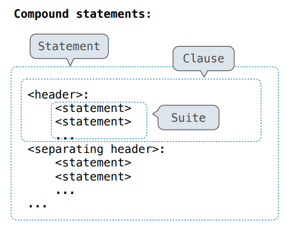
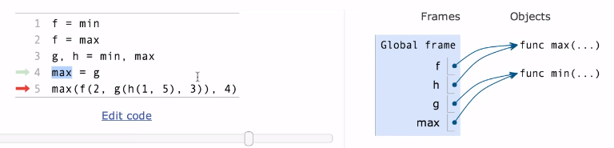
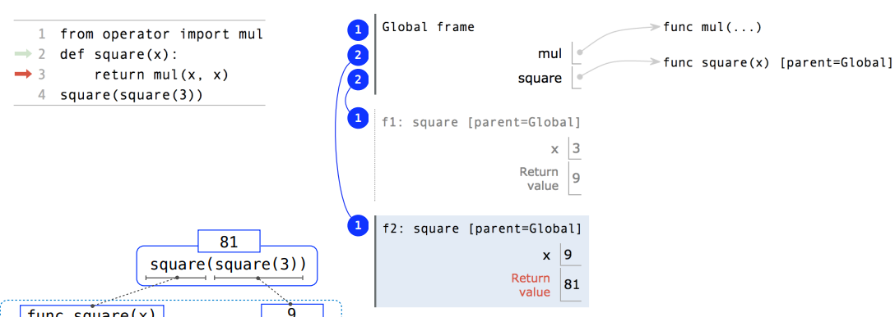
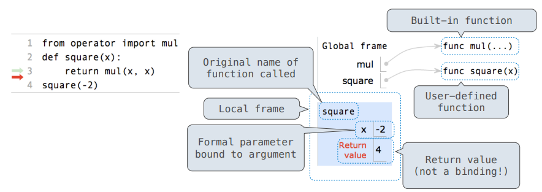
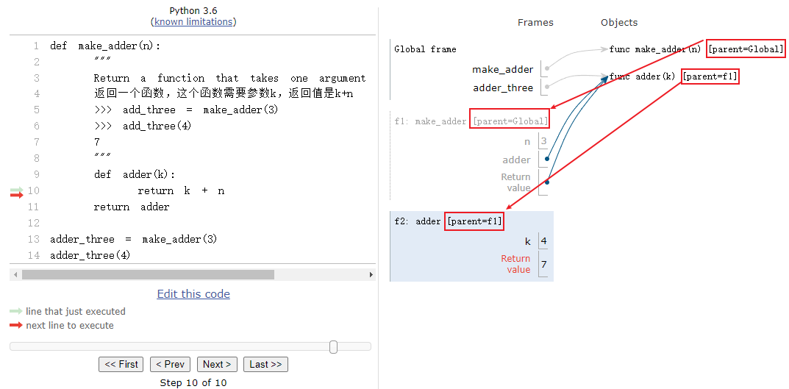
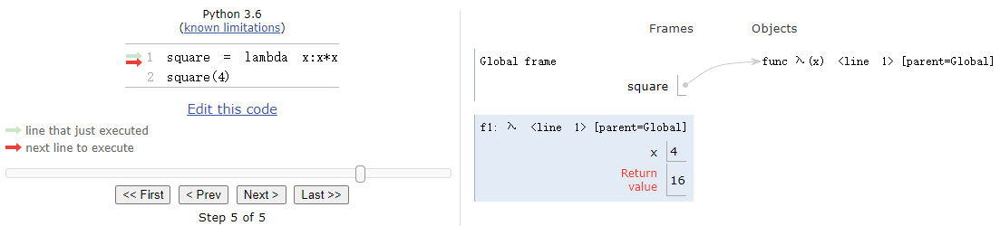

#  1. QuickStart

## 1.1 安装Python

可以在命令行中输入`python --version`看电脑中是否安装Python

### 1.1.1 python for windows

https://www.python.org/downloads/windows/

在官网中下载想要的版本

### 1.1.2 python for linux

```shell
whereis python # 查看系统中python的位置
cd /usr/bin/
ll python* # 查看当前的软链接
# python -> python2
# python2 ->python2.7
安装完后可以让python指向python3，这样两个版本的python就可以共存了

# 安装相关包
yum install zlib-devel bzip2-devel openssl-devel ncurses-devel sqlite-devel readline-devel tk-devel gcc make 
# 安装pip
yum -y install epel-release
yum -y install libffi-devel
yum install python-pip
# 安装wget
pip install wget
#用wget下载python3的源码包
wget http://npm.taobao.org/mirrors/python/3.7.5/Python-3.7.5.tar.xz
xz -d Python-3.7.5.tar.xz
tar -xf Python-3.7.5.tar
cd Python-3.7.5
./configure prefix=/usr/local/python3
make
make install

# 添加软连接
# 备份原来的链接
mv /usr/bin/python /usr/bin/python.bak 
# 添加python3的软链接
ln -s /usr/local/python3/bin/python3.7 /usr/bin/python 
# 测试是否安装成功
python -V

#更改yum配置，否则会导致yum不能正常使用
vi /usr/bin/yum
# 把#! /usr/bin/python 改为 #! /usr/bin/python2
vi /usr/libexec/urlgrabber-ext-down
# 修改同上
```

## 1.2 HelloWorld

**在命令行中直接运行**

打开命令行输入 `python` 可以直接运行python

输入`print("HelloWorld")`，回车即可打印出HelloWorld

使用`exit()`退出python命令行

**在记事本中编写**

创建一个 HelloWorld.py文件，在其中编写 `print("HelloWorld")`

- 直接运行

  在命令行中定位到文件目录，输入`python helloworld.py`

  即可输出HelloWorld

- 运行文件后进入交互模式

  `python -i helloworld.py`

**使用IDE**

在VSCode中安装Python插件

使用PyCharm

## 1.3 中文编码问题

当输出`print("你好，世界")`时可能会碰到报错

解决办法为在文件开头加入其中一行即可

- `# coding=utf-8`
- `# -*- coding: UTF-8 -*-`

## 1.4 缩进

**一条语句多行显示**

Python语句末尾不用加分号`;`，以换行作为语句结束的标志。如果想要将一个语句分多行显示，需要在每行末尾加`\`

```python
str = "123" + "456" \
+ "789"
```

**多条语句一行显示**

多条语句在同一行中显示时，语句末尾要加`;`

```python
str1 = "123"; str2 = "456"
```

**缩进要求**

Python使用缩进来代替其他语言中的`{}`去区分代码块

缩进使用的空格数量是可变的，但是在一个文件中的缩进必须使用相同数量的空格数

```python
if True: # 只使用一个空格是被允许的，但是后面的缩进必须都使用一个空格
 print("true")
else:
 print("false")
```

## 1.5 注释

- 单行注释：以`#`开头

- 多行注释：用三个单引号或三个双引号

  ```python
  '''
  多行注释
  '''
  
  “”“
  多行注释
  ”“”
  ```

## 1.6 输入输出

**print() 输出**

print用于输出到屏幕

```python
print("helloword")
# helloword
```

支持同时输出多个变量，变量之间用`，`分隔

```python
a = 10
print("a = ", a)
# a = 10
```

可以输出None

```python
print(None)
# None
print(print(a), print(a))
# 10
# 10
# None None
# 这里先执行里面的两个print函数，打印出两个10
# 由于print函数没有返回值，返回值就是None，所以外面的print函数打印两个None值
```

# 2. 基本数据运算

## 2.1 变量创建

创建变量就是把名称和值绑定

python不存在声明变量的命令，只有首次为其赋值时才会创建变量

赋值时支持为多个变量同时赋值

```python
a = b = c = 1

a, b, c = 1, 2, "abc"

# 当同时为多个变量赋值时，python会先将等号右边从左到右计算完所有的值，再统一赋给左边
b, a = a + b, b
# a = 2, b = 3
```

## 2.2 变量删除

使用 `del` 关键字删除变量的引用

```python
var1 = 1
del var1
print(var1)
# NameError: name 'var1' is not defined. Did you mean: 'vars'?
```

## 2.3 全局变量

在函数外创建的变量称为全局变量，函数内创建的变量为局部变量

- 局部变量只能在函数内部使用
- 局部变量可以与全局变量同名且不会影响到全局变量

**global关键字**

- 用于在函数内部创建全局变量

- 用于在函数内部更改全局变量

  ```python
  var1 = 1
  def myfunc():
      global var1
      var1 = 2
      # global var1 = 2 是错误的语法
  myfunc()
  print(var1) # 2
  ```

## 2.4 算数运算

**算术运算符**

| 符号 |           名称           |                   作用                   |
| :--: | :----------------------: | :--------------------------------------: |
|  +   |           加号           |             将两个操作数相加             |
|  -   |           减号           |             将两个操作数相减             |
|  *   |           乘号           |                                          |
|  /   |   除号(True division)    | 计算除法，计算结果带有小数点，即使能整除 |
|  **  |           乘方           |            a ** b表示a的b次方            |
|  //  | 地板除(Integer division) |       做除法运算之后将结果向下取整       |
|  %   |           取余           |                                          |

**算术运算函数**

- 加法：add

- 乘法：mul

- 除法：truediv

- 地板除：floordiv

- 取余：mod

- 开方：sqrt

  `from math import sqrt`

```python
# 加法，乘法
from operator import add, mul
add(1,2,3) # 6
mul(add(1,2),3,4) # 36

# 除法，取余
from operator import truediv, floordiv, mod
truediv(2013, 10) # 201.3
floordiv(2013, 10) # 201
mod(2013, 10) # 3
```

## 2.5 逻辑运算

`x = 10, y = 20`

| 运算符 | 名称 | 描述                                 |       实例        |
| :----: | :--: | ------------------------------------ | :---------------: |
|  and   |  与  | 如果x为False返回x的值，否则返回y的值 |  x and y，返回20  |
|   or   |  或  | 如果x是True返回x的值，否则返回y的值  |  x or y，返回10   |
|  not   |  非  | x是True返回False，x是False返回True   | not x， 返回False |

# 3. 数据类型

获取数据类型：`type()`

## 3.1 指定类型与类型转换

在创建变量时会根据赋的值自动指定变量的数据类型

也可以通过构造函数指定或者转换数据类型

| 变量     | 构造函数                          | 示例           |
| -------- | --------------------------------- | -------------- |
| 字符串   | str()                             | x = str(1)     |
| 数字类型 | int()<br />float()<br />complex() | x = int("123") |

## 3.2 数字类型

- int：整数，包括正数和负数，长度不限

- float：浮点数，包含小数的整数和负数

- complex：复数，用 j 表示虚部

  ```python
  x = 2 + 3j
  y = complex(2)
  print(x) # (2+3j)
  print(y) # (0+2j)
  ```

## 3.2 列表

列表是一个集合，里面的元素可以是任意不同数据类型，用方括号编写

`lista = ["apple", 1, 3.14]`

用`len(lista)`来获取列表中的元素数量

### 3.2.1 索引与切片

**索引**

列表索引从0开始，支持负索引，-1表示最末尾元素

**切片**

可以用列表的一部分来创建新列表，区间前闭后开

`lista[start:end:step]` 

- 包括start，不包括end，step为步长

- start和end可以是负数但是必须满足start<=end

```python
list = range(10) # 0~9
lista = list[0:10:2] # 0, 2, 4, 6, 8
listb = list[1:10:2] # 1, 3, 5, 7, 9

listc = list[-10:-1:2] # 0, 2, 4, 6, 8
```

### 3.2.2 增删改查

**添加元素**

- `list.append(element)` 在列表末尾添加元素

- `list.insert(index, element)` 将新元素作为索引为index的元素插入列表中

  例如：`list.insert(1, "123")`，则123在列表中索引为1

**删除元素**

- `list.remove()` 删除指定内容的元素

- `list.pop()` 删除指定索引的元素，未指定则删除最后项

- `del` 删除指定索引

  `del list[0]`删除索引为0的元素

特别地，`del list`可以删除整个列表

**清空列表**

`list.clear()`

## 3.3 字符串

用单引号`''`和双引号`""`引起来的都是字符串类型

# 4. 数据结构

## 4.1 列表List

`lista = [1, 'a', 3.5, 2//2]`

### 4.1.1 基本操作

`digits = [1, 8, 2, 8]`

**创建列表**

可以使用表达式创建列表 `digits = [2//2, 2 + 2 + 2, 2, 2 * 2 * 2]`

**获取列表元素**

- 使用下标：`digits[3] # 8`
- 使用函数：`getitem(digits, 3) # 8`

**获取列表长度**

`len(digits) # 4`

**连接和重复**

将两个List连接起来，或将某个List重复

- `[2, 7] + digits * 2`，将digits重复两遍添加在[2,7]的后面

  `[2, 7, 1, 8, 2, 8, 1, 8, 2, 8]`

- `add([2, 7], mul(digits, 2))`

  与上面效果相同

**嵌套列表**

列表中的元素也可以是一个列表

```python
pairs = [[10, 20], [30, 40]]

>>> pairs[1]
[30, 40]
>>> pairs[1][0]
30
```

**判断某个元素是否在列表中**

使用操作符`in`，在所有容器中都可以使用

```python
digits = [1, 8, 2, 8]
>>> 1 in digits
True
>>> 8 in digits
True
>>> 5 not in digits
True
>>> [1, 8] in digits # in操作符只能检测单个元素，不能检测子列表
False
>>> [1, 2] in [3, [1, 2], 4]
True
```

## 4.2 String

**创建字符串**

- 单引号：`'I am string'`

- 双引号：`I'm string`

- 三引号：可以包含多行语句，可以当作多行注释使用，实际上是创建了一个string对象

  ```python
  >>> """
  ... The first line
  ... the second line
  ... the third line
  ... """
  'The first line\nthe second line\nthe third line'
  ```

**执行字符串**

如果字符串是一个python语句，可以用exec()来执行

```python
exec('curry = lambda f: lambda x: lambda y:f(x, y)')
>>> curry(add)(3)(4)
7
```

**获取长度**

`city = 'Berkeley'`

`len(city) # 8`

**索引**

`city[3] # 'k'`

要注意的是这里返回的'k'是string类型，虽然只有一个元素

string中的每个元素都是string类型的

**寻找子串或字符**

in 和 not in 操作符在string中可以用于寻找子串，这点不同于List

```python
>>> 'here' in "Where's Waldo?"
True
```

## 4.3 元组


## 4.4 集合

## 4.5 字典Dictionary 

**创建字典**

使用大括号创建一个字典，key和value之间用`:`分割，不同键值对之间用`,`分割

注意：不能存在相同的key

`diction = {'i':1, 'v':5, 'x': 10}`

也可以通过items创建字典

```python
items = [('x', 10), ('v', 5), ('i', 1)]
dict(items)
```

用for循环创建字典

```python
squares = {x:x*x for x in range(10)}
{0:0, 1:1, 2:4 ... 9:81}
```

**获取元素**

只能通过键来寻找值

```python
>>> diction['i']
10
# 当这个键不存在时，会报错
>>> diction[10]
KeyError:10
```

**查看所有元素**

- 查看所有keys：`diction.keys()`
- 查看所有values：`diction.values()`
- 查看所有items：`diction.items()`

**寻找指定键**

- in操作符：`x in numerals # True`

- get方法：`diction.get('x', 0) # 10`

  `diction.get('x-ray', 0) # 0`

  第二个参数表示如果没找到返回什么

# 5. 控制语句（Control）



```python
Compound statements:
    
    <header>:            # the first header determines a statemtent's type
        <statement>      
        <statement>
        ...
    <separating header>: # the header of a clause controls the suite that follows
        <statement>      # a suite is a sequence of statements
        <statement>
        ...
    ...
        
```

## 5.1 条件语句（Conditional statements）

```python
if <conditional expression>:
    <suite of statements>
elif <conditional expression>:
	<suite of statements>
else:
    <suite of statements>
```

- False values in Python: `False`,` 0`, `''`(这是空串，不是空格),` None`

- True values in Python: Anything else

**例子：**

```python
def absolute_value(x):
    """Return the absolute value of x"""
    if x < 0:
        return -x
    elif x == 0:
        return 0
    else:
        return x
```

**为什么不用call expression去表达条件语句**

```python
# call expression like this:
def if_(c, t, f):
    if c:
        return r
    else:
        return f
    
from math import sqrt
if_(x > 0, sqrt(-4), 0.0)
# 在函数调用时，会先计算出所有传入的参数表达式，也就是说会执行sqrt(-4)，出现错误
# 而直接使用if条件语句，不满足条件时就会跳过这些语句不执行
```

## 5.2 循环语句（while statement）

```python
while <conditional clause>:
    <statements body>
```

**例子：**

```python
# 计算1+2+3的值
i, total = 0, 0
while i < 3:
    i = i + 1
    total = total + i
```

## 5.3 For Statements

### 5.3.1 基本介绍

```python
for <name> in <expression>:
    <suite>
```

执行过程：

1. Evaluate the header \<expression>, which must yield an iterable value (a sequence)

   计算语句头中的\<expression>部分，计算结果必须是iterable value

2. For each element in that sequence, in order:

   对于容器中的每个元素，依次执行以下操作

   1. Bind \<name> to that element in the current frame

      在当前栈帧中把遍历到的元素与element变量绑定

   2. Execute the \<suite> 

      执行循环语句

### 5.3.2 使用实例

**遍历容器**

```python
digits = [1, 2, 4, 6, 8]
for element in digits:
    operate the element
```

**在for语句中可以直接把容器展开**

只能适用于元素长度均相等的容器

```python
# 计算两个元素相等的列表的数量
pairs = [[1, 2, 3], [3, 2, 3], [2, 2, 2], [4, 4, 4]]
same_count = 0
for x, y, z in pairs:
    if x == y and y == z:
        same_count += 1
>>> same_count
2
```

**Range**

- Range是一个包含着连续整数的sequence（并不是list）

  ```python
  >>> range(5, 8)
  range(5, 8)
  ```

- 可以使用list constructor转化为list 

  ```python
  >>> list(range(5, 8))
  [5, 6, 7]
  ```

- `range(a, b)` 左闭右开，包括a但不包括b

  如果只给一个参数，则默认从0开始 `range(4) # 0, 1, 2, 3`

```python
# 计算1~n(included)的和
def sum_below(n)：
	total = 0
    for i in range(n + 1):
        total += i
    return total

# 执行一段语句特定次数
def cheer():
    for _ in range(3): # 这个‘_’实际上也能取得遍历到的元素，这里是告诉其他人我并不关心遍历到的具体数字，只是想循环这么多次
        print('Go Bears!')
>>> cheer()
Go Bears!
Go Bears!
Go Bears!
```

# 6. 函数

函数就是将一个名字和一段表达式绑定

def statements are compound statements

## 6.0 Environment Diagrams

Environment diagrams visualize the interpreter's process（可视化解释器执行过程）

[Environment Diagrams可视化网站](https://tutor.cs61a.org)

在Environment Diagrams中，左边是Code（代码），右边是Frames（栈帧，表示函数调用和返回的数据结构）。当执行完左边的一句代码之后，右边Frames中会显示此时栈帧中所有的变量以及他们的值

当遇到定义函数的def语句时，要直接将函数名称 f 和 对应的func对象直接加入Diagram中，因为函数也是一种变量

e.g：



- Frames：a frame is a binding between names and values

  一个栈帧就是一堆变量名和值的联系

- Environment：is a sequence of frames

  环境由一堆栈帧组成

  the current environment is either

  - the global frame alone
  - or a local frame, followed by the global frame

- Environment Diagram：there could be multiple environments in one diagram

  一个Diagram中可以有多个Environment



在这个例子中存在三个Environments

- Gloabl frame单独是一个
- f1 + Global frame
- f2 + Global frame

**在创建函数中嵌套函数时Environment Diagram的规则**

Environment Diagrams for Nested Def Statements

- Every user-defined function has a parent frame, the parent of a function is the frame in which it was defined

  用户自定义的函数都有一个parent栈帧，这个函数在哪儿定义的parent就是谁

- Every local frame has a parent frame, the parent of a frame is the parent of the function called

  每个本地栈帧都有一个parent栈帧，这个栈帧是调用哪个函数时创建的，则该栈帧的parent和调用函数的parent相同

例子见5.4.2的Environment Diagram分析过程

## 6.1 创建函数

函数有两部分组成：

1. Function signature：indicates how many arguments a function takes

   表明这个函数有多少个参数

2. Function body：defines the computational process expressed by a function

   定义这个函数所表示的计算过程

```python
def <name>(<formal parameters>): # Function signature （between def and colon）
    return <return expression> # Function body (everything indented(缩进) after the first line)
```

def语句的指定过程：

1. Create a function with signature `<name>(<formal parameters>)`

2. Set the body of that function to be everything indented(缩进的) after the first line (which means that the body just gets **squirreled** away as part of the function)

   将函数体保存在一个安全的地方，等到函数被调用的时候再执行这段代码

3. Bind \<name> to that function in the current frame

   在当前命名空间中将函数名称与这个函数绑定

## 6.2 函数调用过程



**函数调用过程：**

1. 先计算操作符，发现这个语句是个函数调用操作
2. 从左到右计算每个操作数（变量）
3. 建立该函数运行所需要的栈帧，创建栈帧需要以下信息
   - 一个独一无二的编号（f1，f2，f3......）
   - 该函数的函数名称（square）
   - 该栈帧的parent栈帧（[parent=Global]），在本图中没有体现
4. 在刚创建的本地栈帧中开辟参数需要的空间，并将第二步计算出的操作数的值与参数一一绑定
5. 在新的Environment中（本地栈帧和所有parent栈帧组成的新Environment）执行函数体，直到遇到return语句。如果没有return则执行结束后默认返回None

## 6.3 寻找变量过程(nonlocal)

在函数执行过程遇到变量名时，按照以下顺序寻找：

- 在当前的frame中，也就是local frame中寻找
- 如果没找到，再去parent frame中寻找，一层一层向上找，直至global frame

由于会先在local frame中寻找，所以本地同名变量会覆盖掉外层的变量

要尽量避免在内层对同名变量的赋值，这会让解释器认为这是新建的本地变量，从而忽略掉外层变量

**错误示范：**

```python
# 该函数用于将传入的函数执行多次
def execute_multiple_times(origin_function, execute_times):
    """返回值是一个函数return_function，返回的函数的参数列表和origin_function的参数列表完全一样
    当调用return_function时，会使用调用return_function时传入的参数调用origin_function，调用execute_times，并返回所有执行结果的和
    >>> double = lambda x : x * 2
    >>> double_3th = execute_multiple_times(double, 3)
    >>> doublw_twice(5)
    30
    5 * 2 + 5 * 2 + 5 * 2 = 3-
    """
    def repeat(*args):
        result = 0
        while execute_times:
            result += origin_function(*args)
            execute_times = execute_times - 1
        return result
    return repeat

double = lambda x : x * 2
double_3th = execute_multiple_times(double, 3)
print(double_3th(5))
# UnboundLocalError: local variable 'execute_times' referenced before assignment
```

这里内函数repeat本来是能获得execute_times的值的，但是由于在repeat内部有一个`execute_times = execute_times - 1`赋值语句，从而解释器认为这个execute_times是一个局部变量，就没有再往外面找

**解决办法：**

1. 再定义一个局部变量保存execute_times的值

   ```python
   # 该函数用于将传入的函数执行多次
   def execute_multiple_times(origin_function, execute_times):
       
       def repeat(*args):
           result = 0
           left_times = execute_times
           while left_times:
               result += origin_function(*args)
               left_times = left_times - 1
           return result
       return repeat
   
   double = lambda x : x * 2
   double_3th = execute_multiple_times(double, 3)
   print(double_3th(5))
   # 30
   ```

2. 将execute_times标记为nonlocal(非本地变量)

   ```python
   # 该函数用于将传入的函数执行多次
   def execute_multiple_times(origin_function, execute_times):
       
       def repeat(*args):
           nonlocal execute_times
           result = 0
           while execute_times:
               result += origin_function(*args)
               execute_times = execute_times - 1
           return result
       return repeat
   
   double = lambda x : x * 2
   double_3th = execute_multiple_times(double, 3)
   print(double_3th(5))
   # 30
   ```

## 6.4 函数特性

### 6.4.1 多个返回值

```python
# 一个函数可以有多个返回值
def divide_exact(n, d):
    return n // d, n % d
quotient, remainder = divide_exact(2013, 10)
```

### 6.4.2 docstring和doctest

```python
# 函数中可以添加docstring和doctest
def divide_exact(n, d):
    """
    Return the quotient and remainder of dividing N by D
    
    >>> q, r = divide_exact(2013, 10)
    >>> q
    201
    >>> r
    3
    """
    return n // d, n % d
```

在命令行中执行以下命令

`python -m doctest -v test.py`

python解释器就会自动检测这个函数能否得到doctest中预期结果，如果能够通过案例，就不会输出任何东西

-v可以显示详细信息

### 6.4.3 参数默认值

```python
def divide_exact(n, d=10):
    return floordiv(n, d), mod(n, d)
```

### 6.4.4 接收任意参数

```python
def sum_arbitrary(*args):
    sum = 0
    for num in args:
        sum += args
    return sum

sum_arbitrary() # 0
sum_arbitrary(1, 2, 3, 4) # 10
```

## 6.5  Higher-Order Functions

### 6.5.1 函数作为参数

用另一个函数作为参数的函数称为Higher-Order Function

```python
def cube(k):
    return pow(k, 3)

def identity(k):
    return k

def summation(n, func):
    """
    计算经过func处理后的从1到n的每个数字d和
    >>> summation(5, cube)
    225
    >>> summation(5, identity):
    15
    """
    total, k = 0, 1
    while k <= n:
        total, k = total + func(k), k + 1
    return total  
```

### 6.5.2 函数作为返回值

```python
def make_adder(n):
    """
    Return a function that takes one argument k and return k + n
    返回一个函数，这个函数需要参数k，返回值是k+n
    >>> add_three = make_adder(3)
    >>> add_three(4)
    7
    """
    def adder(k):
        return k + n
    return adder

make_adder(1)(2) # 3
# make_adder(1)是一个函数，之后再传入参数2来调用这个函数
```

**Environment Diagrams**



1. 由于make_adder函数是在Global frames中创建的，因此make_adder函数parent=Global
2. 在13行调用make_adder(3)时创建make_adder的frame f1，栈帧的parent和调用的函数的parent相同，因此f1的parent=Global
3. 在make_adder(3)执行过程中创建了adder函数，由于adder函数是在f1中创建的，因此adder函数的parent=f1
4. 函数的返回值是adder函数，因此返回之后让adder_three指向adder函数
5. 调用adder_three(4)创建对应栈帧f2，adder_three实际上就是adder函数，因此创建的栈帧f2的parent与adder函数的parent相同，均为f1
6. 调用adder函数时发现变量k，先在f2中寻找没找到，再去f2的parent f1中寻找，发现k=4，于是返回k+n=7

## 6.6 Lambda表达式（匿名函数）

**定义：**

```python
square = lambda x : x * x
```

It means that there is a function with formal parameter x that return the value of x times x

- lambda : a function

  关键字

- x ：with formal parameter x

  冒号前面是函数的参数

- x * x ：return the value of x times x

  冒号后面是函数的返回值，只能是**一个**单一的表达式

**用法：**

```python
square(4) # 16

(lambda x : x * x)(5) # 25
```

**与def的区别：**

```python
# 在命令行交互式python中
>>> square = lambda x: x * x
>>> square
<function <lambda> at 0x1003c1bf8>
# lambda表达式定义的函数是lambda函数而不是square函数，只是通过赋值语句赋值给了square变量
>>> def square(x):
    	return x * x
>>> square
<function square at 0x10293e730>
# def定义的函数就叫square函数
```

这是由于lambda函数是先创建一个没有名字的函数，再通过赋值语句赋值给变量

所以在画Environment Diagram时，lambda函数没有intrinsic name，而是用λ符号作为替代



## 6.7 Decorators

Decorators用到了高阶函数，可以为已定义的函数扩展额外功能而不用修改原函数

```python
@trace1
def triple(x):
    return 3 * x

就相当于

def triple(x):
    return 3 * x
triple = trace1(triple)
```

Decorators就是接收一个函数fn作为参数的高阶函数，Decorators在内部再定义一个函数来执行这个fn（并添加一些额外动作），并返回这个内部定义的函数。内部定义的函数参数需要和fn相同，会使用这个参数来调用fn。

### 6.7.1 trace

trace可以在函数调用时先打印出函数调用信息，再调用函数

**库中的trace**

```python
from ucb import trace

@trace
def square(x):
    return x * x

>>> square(12)
square(12):
square(12) -> 144
144
```

**自定义trace**

```python
def trace1(fn):
    def traced(x):
        print('Calling', fn, 'on argument', x)
        return fn(x)
    return traced

@trace1
def square(x):
    return x * x
# 相当于 square = trace1(square)

>>> square(12)
Calling <function square at 0x1006ee170> on argument 12
144
```

