#  1. QuickStart

## 1.1 安装Python

可以在命令行中输入`python --version`看电脑中是否安装Python

### 1.1.1 python for windows

https://www.python.org/downloads/windows/

在官网中下载想要的版本

### 1.1.2 python for linux

```shell
whereis python # 查看系统中python的位置
cd /usr/bin/
ll python* # 查看当前的软链接
# python -> python2
# python2 ->python2.7
安装完后可以让python指向python3，这样两个版本的python就可以共存了

# 安装相关包
yum install zlib-devel bzip2-devel openssl-devel ncurses-devel sqlite-devel readline-devel tk-devel gcc make 
# 安装pip
yum -y install epel-release
yum -y install libffi-devel
yum install python-pip
# 安装wget
pip install wget
#用wget下载python3的源码包
wget http://npm.taobao.org/mirrors/python/3.7.5/Python-3.7.5.tar.xz
xz -d Python-3.7.5.tar.xz
tar -xf Python-3.7.5.tar
cd Python-3.7.5
./configure prefix=/usr/local/python3
make
make install

# 添加软连接
# 备份原来的链接
mv /usr/bin/python /usr/bin/python.bak 
# 添加python3的软链接
ln -s /usr/local/python3/bin/python3.7 /usr/bin/python 
# 测试是否安装成功
python -V

#更改yum配置，否则会导致yum不能正常使用
vi /usr/bin/yum
# 把#! /usr/bin/python 改为 #! /usr/bin/python2
vi /usr/libexec/urlgrabber-ext-down
# 修改同上
```

## 1.2 HelloWorld

**在命令行中直接运行**

打开命令行输入 `python` 可以直接运行python

输入`print("HelloWorld")`，回车即可打印出HelloWorld

使用`exit()`退出python命令行

**在记事本中编写**

创建一个 HelloWorld.py文件，在其中编写 `print("HelloWorld")`

- 直接运行

  在命令行中定位到文件目录，输入`python helloworld.py`

  即可输出HelloWorld

- 运行文件后进入交互模式

  `python -i helloworld.py`

**使用IDE**

在VSCode中安装Python插件

使用PyCharm

## 1.3 中文编码问题

当输出`print("你好，世界")`时可能会碰到报错

解决办法为在文件开头加入其中一行即可

- `# coding=utf-8`
- `# -*- coding: UTF-8 -*-`

## 1.4 缩进

**一条语句多行显示**

Python语句末尾不用加分号`;`，以换行作为语句结束的标志。如果想要将一个语句分多行显示，需要在每行末尾加`\`

```python
str = "123" + "456" \
+ "789"
```

**多条语句一行显示**

多条语句在同一行中显示时，语句末尾要加`;`

```python
str1 = "123"; str2 = "456"
```

**缩进要求**

Python使用缩进来代替其他语言中的`{}`去区分代码块

缩进使用的空格数量是可变的，但是在一个文件中的缩进必须使用相同数量的空格数

```python
if True: # 只使用一个空格是被允许的，但是后面的缩进必须都使用一个空格
 print("true")
else:
 print("false")
```

## 1.5 注释

- 单行注释：以`#`开头

- 多行注释：用三个单引号或三个双引号

  ```python
  '''
  多行注释
  '''
  
  “”“
  多行注释
  ”“”
  ```

## 1.6 输入输出

**print() 输出**

print用于输出到屏幕

```python
print("helloword")
# helloword
```

支持同时输出多个变量，变量之间用`，`分隔，逗号分隔的东西之间会自动输出一个空格

```python
a = 10
print("a=", a)
# a= 10
```

可以输出None

```python
print(None)
# None
print(print(a), print(a))
# 10
# 10
# None None
# 这里先执行里面的两个print函数，打印出两个10
# 由于print函数没有返回值，返回值就是None，所以外面的print函数打印两个None值
```

# 2. 基本数据运算

## 2.1 变量创建

创建变量就是把名称和值绑定

python不存在声明变量的命令，只有首次为其赋值时才会创建变量

赋值时支持为多个变量同时赋值

```python
a = b = c = 1

a, b, c = 1, 2, "abc"

# 当同时为多个变量赋值时，python会先将等号右边从左到右计算完所有的值，再统一赋给左边
b, a = a + b, b
# a = 2, b = 3
```

## 2.2 变量删除

使用 `del` 关键字删除变量的引用

```python
var1 = 1
del var1
print(var1)
# NameError: name 'var1' is not defined. Did you mean: 'vars'?
```

## 2.3 全局变量

在函数外创建的变量称为全局变量，函数内创建的变量为局部变量

- 局部变量只能在函数内部使用
- 局部变量可以与全局变量同名且不会影响到全局变量

**global关键字**

- 用于在函数内部创建全局变量

- 用于在函数内部更改全局变量

  ```python
  var1 = 1
  def myfunc():
      global var1
      var1 = 2
      # global var1 = 2 是错误的语法
  myfunc()
  print(var1) # 2
  ```

## 2.4 算数运算

**算术运算符**

| 符号 |           名称           |                   作用                   |
| :--: | :----------------------: | :--------------------------------------: |
|  +   |           加号           |             将两个操作数相加             |
|  -   |           减号           |             将两个操作数相减             |
|  *   |           乘号           |                                          |
|  /   |   除号(True division)    | 计算除法，计算结果带有小数点，即使能整除 |
|  **  |           乘方           |            a ** b表示a的b次方            |
|  //  | 地板除(Integer division) |       做除法运算之后将结果向下取整       |
|  %   |           取余           |                                          |

**算术运算函数**

- 加法：add

- 乘法：mul

- 除法：truediv

- 地板除：floordiv

- 取余：mod

- 开方：sqrt

  `from math import sqrt`

```python
# 加法，乘法
from operator import add, mul
add(1,2,3) # 6
mul(add(1,2),3,4) # 36

# 除法，取余
from operator import truediv, floordiv, mod
truediv(2013, 10) # 201.3
floordiv(2013, 10) # 201
mod(2013, 10) # 3
```

## 2.5 逻辑运算

`x = 10, y = 20`

| 运算符 | 名称 | 描述                                 |       实例        |
| :----: | :--: | ------------------------------------ | :---------------: |
|  and   |  与  | 如果x为False返回x的值，否则返回y的值 |  x and y，返回20  |
|   or   |  或  | 如果x是True返回x的值，否则返回y的值  |  x or y，返回10   |
|  not   |  非  | x是True返回False，x是False返回True   | not x， 返回False |

# 3. 数据类型

获取数据类型：`type()`

## 3.1 指定类型与类型转换

在创建变量时会根据赋的值自动指定变量的数据类型

也可以通过构造函数指定或者转换数据类型

| 变量     | 构造函数                          | 示例           |
| -------- | --------------------------------- | -------------- |
| 字符串   | str()                             | x = str(1)     |
| 数字类型 | int()<br />float()<br />complex() | x = int("123") |

## 3.2 数字类型

- int：整数，包括正数和负数，长度不限

- float：浮点数，包含小数的整数和负数

- complex：复数，用 j 表示虚部

  ```python
  x = 2 + 3j
  y = complex(2)
  print(x) # (2+3j)
  print(y) # (0+2j)
  ```

# 4. 数据结构

## 4.1 列表List

`lista = [1, 'a', 3.5, 2//2]`

### 4.1.1 基本操作

`digits = [1, 8, 2, 8]`

**创建列表**

可以使用表达式创建列表 `digits = [2//2, 2 + 2 + 2, 2, 2 * 2 * 2]`

**索引index**

- 使用下标：`digits[3] # 8`

  特别地，可以使用负数下标从后往前获取元素`digits[-2] # 2`

- 使用函数：`getitem(digits, 3) # 8`

**切片slicing**

`list[<start index>:<end index>:<step size>]`

区间左闭右开，即包括start index不包括end index

其中每个部分都有默认值：

- start index：默认为0

- end index：默认为len(list) + 1

  即不指定end index的话就会取完list的所有部分

- step size：1

例子：

```python
x = [1, 2, 3, 4]
>>> x[1:3]
[2, 3]
>>> x[2:2]

>>> x[:2] # start index默认是0
[1, 2]
>>> x[1:] # end index不指定就取到list的末尾
[2, 3, 4]
>>> x[-2:3]
[3]
>>> x[0:4:2] # 步长为2
[1, 3]
>>> x[::-1] # 倒序List
[4, 3, 2, 1]
# 切片还可以用于赋值
>>> x[2:] = []
>>> x
[1, 2]
```

**获取列表长度**

`len(digits) # 4`

**重复（乘法）**

对列表使用乘法会将列表重复

```python
>> digits * 2
[1, 8, 2, 8, 1, 8, 2, 8]
```

**连接（加法）**

将两个List连接起来（不能连接一个List和一个数）

- `[2, 7] + digits * 2`，将digits重复两遍添加在[2,7]的后面

  `[2, 7, 1, 8, 2, 8, 1, 8, 2, 8]`

- `add([2, 7], mul(digits, 2))`

  与上面效果相同，但是add只能连接两个列表

- `sum([[2, [7]], [5, 6]], [])`

  [2, [7], 5, 6]

  连接多个列表，会把第一个参数中的列表展开一级，之后添加到第二个参数中

**嵌套列表**

列表中的元素也可以是一个列表

```python
pairs = [[10, 20], [30, 40]]

>>> pairs[1]
[30, 40]
>>> pairs[1][0]
30
```

**判断某个元素是否在列表中**

使用操作符`in`，在所有容器中都可以使用

```python
digits = [1, 8, 2, 8]
>>> 1 in digits
True
>>> 8 in digits
True
>>> 5 not in digits
True
>>> [1, 8] in digits # in操作符只能检测单个元素，不能检测子列表
False
>>> [1, 2] in [3, [1, 2], 4]
True
```

### 4.1.2 List Conprehensions

从一个sequence中创建一个新的list

`[<expression> for <element> in <sequence> if <conditional>>]`

if语句可以省略

**which means** : compute the expression for each element in the sequence (if the conditional is true for that element) 

例子：

```python
>>> [i**2 for i in [1, 2, 3, 4] if i % 2 == 0]
[4, 16]
```

### 4.1.3 常用方法

`suits = ['coins', 'string', 'myriad']`

**pop删除指定下标元素**

pop：

`suits.pop(2) # 'myriad'`

删除的同时会返回被删除的元素

不传入参数时删除末尾元素

del：

`del suits[0]`

**remove删除指定内容元素**

`suits.remove('string')`

返回None

**append在末尾添加元素**

`suits.append('cup')`

如果使用`suits.append(['sword', 'club'])`

那`suits = ['coins', 'string', 'myriad', ['sword', 'club']]` 

**extend在末尾拼接另一个list**

`suits.extend(['sword', 'club'])`

`suits = ['coins', 'string', 'myriad', 'sword', 'club']` 

**insert插入元素**

`insert(i, elem)`

将elem元素插入下标为 i 的位置，也就是说插入之后elem的下标为i。返回None

### 4.1.4 Mutability

List is mutable，也就是说可以直接在原有的list对象上进行修改

这一小节列举在哪些情况下会创建新的List对象，在哪些情况下会直接使用（改变）原有List对象

**1. 直接将已有list赋值给新变量**

不会创建新的list，只会让新名字指向原有的list对象

```python
lista = [1, 2, 3]
listb = lista
```

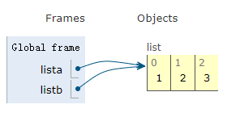

**2. 用切片创建list**

会创建一个新的list对象

```python
lista = [1, 2, 3]
listb = lista[:]
```

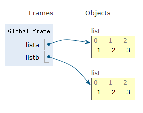

**3. 在原有list基础上修改并创建新的list**

会创建新的list对象

(1)

```python
lista = [1, 2, 3]
listb = lista + [4]
```

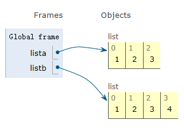

(2)

```python
lista = [1, 2, 3]
listb = lista
lista = lista + [4]
```

在自己的基础上做修改并赋值给自己也会创建新的list对象

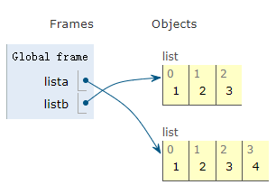

**4. 使用+=直接添加元素**

直接在原有list对象上修改

```python
lista = [1, 2, 3]
listb = lista
lista += [4]
```

这里和3（2）中不一样是因为 `x += y` 实际上不是 `x = x + y`的简写，而与`x = operator.iadd(x,y)`是相等的。而list中对iadd进行了重写

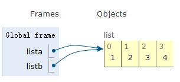

**4. 用list()创建list**

这个做法会创建一个全新的list，而不只是一个list的第二个名字

```python
s = [2, 3]
t = [5, 6]
t = list(s)
s[1] = 0
>>> t
[2, 3]
```

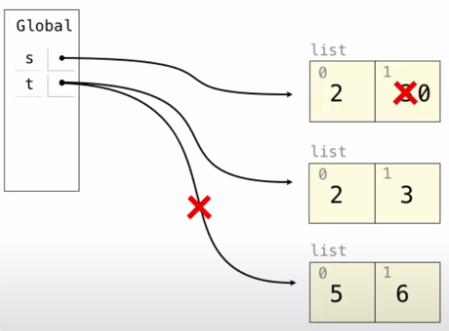

**5.使用append添加一个list**

会直接添加对这个list的引用

```python
s = [2, 3]
t = [5, 6]
s.append(t) # 实际上是保存了对t的引用
t.append(7) # 对t操作会影响t的引用对象，进而影响s
t = 0 # t这个名字本身对s没有任何影响
>>> s
[2, 3, [5, 6, 7]]
>>> t
0
```

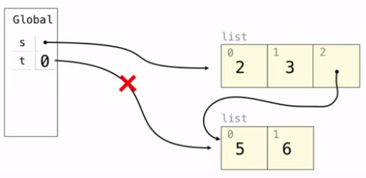

**6. 使用extend添加一个list**

extend会将 list t 中的值完整复制到 list s中，如果t中本身有值是指向其他list的引用，那这个引用也会复制到list s中

```python
s = [2, 3]
t = [5, 6]
s.extend(t) # 这里是将t的值依次复制到了s中
t[1] = 0 # 因此对t的操作不会影响到s
>>> s
[2, 3, 5, 6]
```

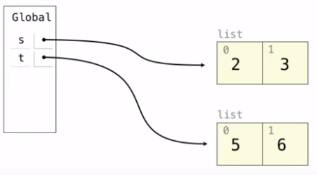

**7. 将list作为参数传递**

会直接在原有list上做修改，也就是说在函数内部对list的修改会直接影响到list的值

```python
def append_4(lista):
    lista.append(4)
    
lista = [1, 2, 3]
test(lista)
```

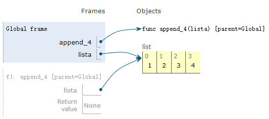

### 4.1.5 Iterator

**创建iterator**

`iter(lista)`

```python
s = [3, 4, 5]
t = iter(s)
# t是iterator
```

**获取元素**

`next()`

```python
>>> next(t)
3
>>> next(t)
4
```

当读完最后一个元素还继续调用next，会报错 StopIteration

如果在iterator读取过程中对list做了增删改查等操作不影响iterator的使用

**列出剩余元素**

`list()`

会列出传入的iterator指向的元素及其后所有元素

```python
>>> next(t)
3
>>> list(t)
[4, 5]
```

## 4.2 String

### 4.2.1 基础操作

**创建字符串**

- 单引号：`'I am string'`

- 双引号：`I'm string`

- 三引号：可以包含多行语句，可以当作多行注释使用，实际上是创建了一个string对象

  ```python
  >>> """
  ... The first line
  ... the second line
  ... the third line
  ... """
  'The first line\nthe second line\nthe third line'
  ```

**执行字符串**

如果字符串是一个python语句，可以用exec()来执行

```python
exec('curry = lambda f: lambda x: lambda y:f(x, y)')
>>> curry(add)(3)(4)
7
```

**获取长度**

`city = 'Berkeley'`

`len(city) # 8`

**索引**

`city[3] # 'k'`

要注意的是这里返回的'k'是string类型，虽然只有一个元素

string中的每个元素都是string类型的

**寻找子串或字符**

in 和 not in 操作符在string中可以用于寻找子串，这点不同于List

```python
>>> 'here' in "Where's Waldo?"
True
```

### 4.2.2 常用方法

s = 'Hello'

**大小写转换**

全转为大写：`s.upper() # HELLO`

全转为小写：`s.lower() # hello` 

大小写互转：`s.swapcase() # hELLO`

### 4.2.3 格式化字符串

**f-strings**

```python
feeling = 'love'
course = '61A!'
str = f'I {feeling} {course}'
print(str) # I love 61A!
```

`{}`中的字符串将会被evaluated而不是直接输出

**format函数**

```python
ten, twenty, thirty = 10, 'twenty', [30]
'{0} plus {1} is {2}'.format(ten, twenty, thirty)
'10 plus twenty is [30]'
```

## 4.3 元组Tuple

immutable sequence 元组中元素不可以被改变

**创建元组**

用`()`创建，或者以`,`分隔的东西都会被视为tuple

```python
>>> (3, 4, 5, 6)
(3, 4, 5, 6)
>>> 3, 4, 5, 6
(3, 4, 5, 6)
# 对于只有一个元素的tuple，会用额外添加一个 , 加以标识
>>> (2) # 这是一个数字
2
>>> 2, # 这是一个tuple
(2,)
```

tuple支持索引，切片，相加（连接）操作

**元组中元素不可改变**

元组不支持赋值、增删改查操作

但是如果元组中的元素是可变的，那这个元素还是可变的

```python
>>> s = ([1, 2], 3)
>>> s[0] = 4 # ERROR
>>> s[0][0] = 4
([4, 2], 3)

```


## 4.4 集合Set

## 4.5 字典Dictionary 

### 4.5.1 基础操作

**创建字典**

使用大括号创建一个字典，key和value之间用`:`分割，不同键值对之间用`,`分割

注意：

- 不能存在相同的key

- key不能是list类型，可以是tuple类型，但是tuple中不能有list

  `{([1, 2], 3), 1}` TypeError：unhashable type:'list'

- value可以是list

`diction = {'i':1, 'v':5, 'x': 10}`

也可以通过items创建字典

```python
items = [('x', 10), ('v', 5), ('i', 1)]
dict(items)
```

用for循环创建字典

```python
squares = {x:x*x for x in range(10)}
{0:0, 1:1, 2:4 ... 9:81}
```

**获取元素**

只能通过键来寻找值

```python
>>> diction['i']
10
# 当这个键不存在时，会报错
>>> diction[10]
KeyError:10
```

**查看所有元素**

- 查看所有keys：`diction.keys()`
- 查看所有values：`diction.values()`
- 查看所有items：`diction.items()`

**寻找指定键**

- in操作符：`x in numerals # True`

- get方法：`diction.get('x', 0) # 10`

  `diction.get('x-ray', 0) # 0`

  第二个参数表示如果没找到返回什么

### 4.5.2 Iterator

在字典中，keys，values和items都是iterable value

**创建Iterator**

- keys: `iter(d.keys())`  / `iter(d)`

  直接使用字典创建iterator，默认是创建在key上

- values：`iter(d.values())`

- items：`iter(d.items())`

```python
>>> d = {'one':1, 'two':2, 'three':3}
>>> k = iter(d.keys()) # 等于 k = iter(d)
```

**通过iterator获取元素**

通过next获取字典元素时的顺序：

- 是元素加入的顺序（Python 3.6+）
- 随机顺序（Python 3.5 and earlier）

```python
>>> next(k)
'one'
>>> k = iter(d.items())
>>> next(k)
('one', 1) # 返回一个tuple
```

如果在遍历过程中对dict进行操作（改变了字典的长度），那原来的iterator就不能使用了

```python
>>> d['four'] = 4
>>> next(k)
RuntimeError: dictionary changed size during iterator
```

## 4.6 Tree


# 5. 控制语句（Control）


```python
Compound statements:
    
    <header>:            # the first header determines a statemtent's type
        <statement>      
        <statement>
        ...
    <separating header>: # the header of a clause controls the suite that follows
        <statement>      # a suite is a sequence of statements
        <statement>
        ...
    ...
        
```

## 5.1 条件语句（Conditional statements）

```python
if <conditional expression>:
    <suite of statements>
elif <conditional expression>:
	<suite of statements>
else:
    <suite of statements>
```

- False values in Python: `False`,` 0`, `''`(这是空串，不是空格),` None`

- True values in Python: Anything else

**例子：**

```python
def absolute_value(x):
    """Return the absolute value of x"""
    if x < 0:
        return -x
    elif x == 0:
        return 0
    else:
        return x
```

**为什么不用call expression去表达条件语句**

```python
# call expression like this:
def if_(c, t, f):
    if c:
        return r
    else:
        return f
    
from math import sqrt
if_(x > 0, sqrt(-4), 0.0)
# 在函数调用时，会先计算出所有传入的参数表达式，也就是说会执行sqrt(-4)，出现错误
# 而直接使用if条件语句，不满足条件时就会跳过这些语句不执行
```

## 5.2 循环语句（while statement）

```python
while <conditional clause>:
    <statements body>
```

**例子：**

```python
# 计算1+2+3的值
i, total = 0, 0
while i < 3:
    i = i + 1
    total = total + i
```

## 5.3 For Statements

### 5.3.1 基本介绍

```python
for <name> in <expression>:
    <suite>
```

执行过程：

1. Evaluate the header \<expression>, which must yield an iterable value (a sequence)

   计算语句头中的\<expression>部分，计算结果必须是iterable value

2. For each element in that sequence, in order:

   对于容器中的每个元素，依次执行以下操作

   1. Bind \<name> to that element in the current frame

      在当前栈帧中把遍历到的元素与element变量绑定

   2. Execute the \<suite> 

      执行循环语句

### 5.3.2 使用实例

**遍历容器**

```python
digits = [1, 2, 4, 6, 8]
for element in digits:
    operate the element
```

**在for语句中可以直接把容器展开**

只能适用于元素长度均相等的容器

```python
# 计算两个元素相等的列表的数量
pairs = [[1, 2, 3], [3, 2, 3], [2, 2, 2], [4, 4, 4]]
same_count = 0
for x, y, z in pairs:
    if x == y and y == z:
        same_count += 1
>>> same_count
2
```

**Range**

- Range是一个包含着连续整数的sequence（并不是list）

  ```python
  >>> range(5, 8)
  range(5, 8)
  ```

- 可以使用list constructor转化为list 

  ```python
  >>> list(range(5, 8))
  [5, 6, 7]
  ```

- `range(a, b)` 左闭右开，包括a但不包括b

  如果只给一个参数，则默认从0开始 `range(4) # 0, 1, 2, 3`

```python
# 计算1~n(included)的和
def sum_below(n)：
	total = 0
    for i in range(n + 1):
        total += i
    return total

# 执行一段语句特定次数
def cheer():
    for _ in range(3): # 这个‘_’实际上也能取得遍历到的元素，这里是告诉其他人我并不关心遍历到的具体数字，只是想循环这么多次
        print('Go Bears!')
>>> cheer()
Go Bears!
Go Bears!
Go Bears!
```

### 5.3.3 Iterator

for statement也可以用来遍历Iterator

```python
>>> r = range(5)
>>> ri = iter(r)
>>> for i in ri:
    	print(i)
0
1
2
3
4
```

注意：对于遍历过一次的Iterator无法再用来遍历第二次，因为此时指针已经走完了整个容器到达末尾

```python
>>> for i in ri:
    	print(i)
# 此时什么都不会输出
```


# 6. 函数

函数就是将一个名字和一段表达式绑定

def statements are compound statements

## 6.0 Environment Diagrams

Environment diagrams visualize the interpreter's process（可视化解释器执行过程）

[Environment Diagrams可视化网站](https://tutor.cs61a.org)

在Environment Diagrams中，左边是Code（代码），右边是Frames（栈帧，表示函数调用和返回的数据结构）。当执行完左边的一句代码之后，右边Frames中会显示此时栈帧中所有的变量以及他们的值

当遇到定义函数的def语句时，要直接将函数名称 f 和 对应的func对象直接加入Diagram中，因为函数也是一种变量

e.g：


- Frames：a frame is a binding between names and values

  一个栈帧就是一堆变量名和值的联系

- Environment：is a sequence of frames

  环境由一堆栈帧组成

  the current environment is either

  - the global frame alone
  - or a local frame, followed by the global frame

- Environment Diagram：there could be multiple environments in one diagram

  一个Diagram中可以有多个Environment


在这个例子中存在三个Environments

- Gloabl frame单独是一个
- f1 + Global frame
- f2 + Global frame

**在创建函数中嵌套函数时Environment Diagram的规则**

Environment Diagrams for Nested Def Statements

- Every user-defined function has a parent frame, the parent of a function is the frame in which it was defined

  用户自定义的函数都有一个parent栈帧，这个函数在哪儿定义的parent就是谁

- Every local frame has a parent frame, the parent of a frame is the parent of the function called

  每个本地栈帧都有一个parent栈帧，这个栈帧是调用哪个函数时创建的，则该栈帧的parent和调用函数的parent相同

例子见5.4.2的Environment Diagram分析过程

## 6.1 创建函数

函数有两部分组成：

1. Function signature：indicates how many arguments a function takes

   表明这个函数有多少个参数

2. Function body：defines the computational process expressed by a function

   定义这个函数所表示的计算过程

```python
def <name>(<formal parameters>): # Function signature （between def and colon）
    return <return expression> # Function body (everything indented(缩进) after the first line)
```

def语句的指定过程：

1. Create a function with signature `<name>(<formal parameters>)`

2. Set the body of that function to be everything indented(缩进的) after the first line (which means that the body just gets **squirreled** away as part of the function)

   将函数体保存在一个安全的地方，等到函数被调用的时候再执行这段代码

3. Bind \<name> to that function in the current frame

   在当前命名空间中将函数名称与这个函数绑定

## 6.2 函数调用过程


**函数调用过程：**

1. 先计算操作符，发现这个语句是个函数调用操作
2. 从左到右计算每个操作数（变量）
3. 建立该函数运行所需要的栈帧，创建栈帧需要以下信息
   - 一个独一无二的编号（f1，f2，f3......）
   - 该函数的函数名称（square）
   - 该栈帧的parent栈帧（[parent=Global]），在本图中没有体现
4. 在刚创建的本地栈帧中开辟参数需要的空间，并将第二步计算出的操作数的值与参数一一绑定
5. 在新的Environment中（本地栈帧和所有parent栈帧组成的新Environment）执行函数体，直到遇到return语句。如果没有return则执行结束后默认返回None

## 6.3 寻找变量过程(nonlocal)

在函数执行过程遇到变量名时，按照以下顺序寻找：

- 在当前的frame中，也就是local frame中寻找
- 如果没找到，再去parent frame中寻找，一层一层向上找，直至global frame

由于会先在local frame中寻找，所以本地同名变量会覆盖掉外层的变量

要尽量避免在内层对同名变量的赋值，这会让解释器认为这是新建的本地变量，从而忽略掉外层变量

**错误示范：**

```python
# 该函数用于将传入的函数执行多次
def execute_multiple_times(origin_function, execute_times):
    """返回值是一个函数return_function，返回的函数的参数列表和origin_function的参数列表完全一样
    当调用return_function时，会使用调用return_function时传入的参数调用origin_function，调用execute_times，并返回所有执行结果的和
    >>> double = lambda x : x * 2
    >>> double_3th = execute_multiple_times(double, 3)
    >>> doublw_twice(5)
    30
    5 * 2 + 5 * 2 + 5 * 2 = 3-
    """
    def repeat(*args):
        result = 0
        while execute_times:
            result += origin_function(*args)
            execute_times = execute_times - 1
        return result
    return repeat

double = lambda x : x * 2
double_3th = execute_multiple_times(double, 3)
print(double_3th(5))
# UnboundLocalError: local variable 'execute_times' referenced before assignment
```

这里内函数repeat本来是能获得execute_times的值的，但是由于在repeat内部有一个`execute_times = execute_times - 1`赋值语句，从而解释器认为这个execute_times是一个局部变量，就没有再往外面找

**解决办法：**

1. 再定义一个局部变量保存execute_times的值

   ```python
   # 该函数用于将传入的函数执行多次
   def execute_multiple_times(origin_function, execute_times):
       
       def repeat(*args):
           result = 0
           left_times = execute_times
           while left_times:
               result += origin_function(*args)
               left_times = left_times - 1
           return result
       return repeat
   
   double = lambda x : x * 2
   double_3th = execute_multiple_times(double, 3)
   print(double_3th(5))
   # 30
   ```

2. 将execute_times标记为nonlocal(非本地变量)

   ```python
   # 该函数用于将传入的函数执行多次
   def execute_multiple_times(origin_function, execute_times):
       
       def repeat(*args):
           nonlocal execute_times
           result = 0
           while execute_times:
               result += origin_function(*args)
               execute_times = execute_times - 1
           return result
       return repeat
   
   double = lambda x : x * 2
   double_3th = execute_multiple_times(double, 3)
   print(double_3th(5))
   # 30
   ```

## 6.4 函数特性

### 6.4.1 多个返回值

```python
# 一个函数可以有多个返回值
def divide_exact(n, d):
    return n // d, n % d
quotient, remainder = divide_exact(2013, 10)
```

### 6.4.2 docstring和doctest

```python
# 函数中可以添加docstring和doctest
def divide_exact(n, d):
    """
    Return the quotient and remainder of dividing N by D
    
    >>> q, r = divide_exact(2013, 10)
    >>> q
    201
    >>> r
    3
    """
    return n // d, n % d
```

在命令行中执行以下命令

`python -m doctest -v test.py`

python解释器就会自动检测这个函数能否得到doctest中预期结果，如果能够通过案例，就不会输出任何东西

-v可以显示详细信息

### 6.4.3 参数默认值

```python
def divide_exact(n, d=10):
    return floordiv(n, d), mod(n, d)
```

### 6.4.4 接收任意参数

```python
def sum_arbitrary(*args):
    sum = 0
    for num in args:
        sum += args
    return sum

sum_arbitrary() # 0
sum_arbitrary(1, 2, 3, 4) # 10
```

### 6.4.5 Mutable Default Arguments

当默认参数是引用类型（Mutable）时，会出现以下情况

```python
def f(s=[]):
    s.append(5)
    return len(5)
>>> f()
1
>>> f()
2
>>> f（）
3
```

A default argument value is part of a function value, not generated by a call

这是由于对于mutable变量，每次调用时会把它们绑定在同一个值上，而不是每次调用创建一个新的

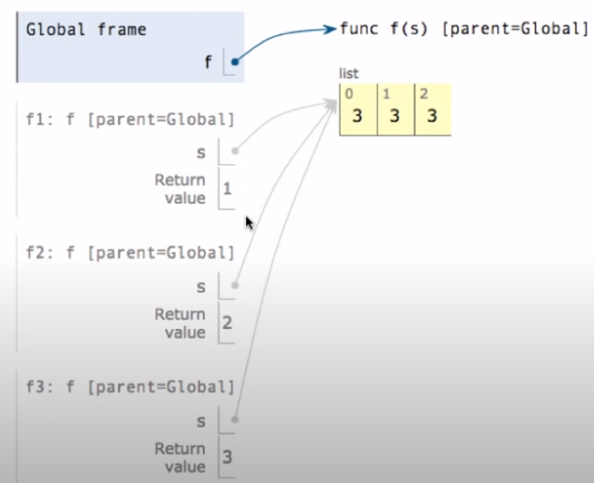

## 6.5  Higher-Order Functions

### 6.5.1 函数作为参数

用另一个函数作为参数的函数称为Higher-Order Function

```python
def cube(k):
    return pow(k, 3)

def identity(k):
    return k

def summation(n, func):
    """
    计算经过func处理后的从1到n的每个数字d和
    >>> summation(5, cube)
    225
    >>> summation(5, identity):
    15
    """
    total, k = 0, 1
    while k <= n:
        total, k = total + func(k), k + 1
    return total  
```

### 6.5.2 函数作为返回值

```python
def make_adder(n):
    """
    Return a function that takes one argument k and return k + n
    返回一个函数，这个函数需要参数k，返回值是k+n
    >>> add_three = make_adder(3)
    >>> add_three(4)
    7
    """
    def adder(k):
        return k + n
    return adder

make_adder(1)(2) # 3
# make_adder(1)是一个函数，之后再传入参数2来调用这个函数
```

**Environment Diagrams**


1. 由于make_adder函数是在Global frames中创建的，因此make_adder函数parent=Global
2. 在13行调用make_adder(3)时创建make_adder的frame f1，栈帧的parent和调用的函数的parent相同，因此f1的parent=Global
3. 在make_adder(3)执行过程中创建了adder函数，由于adder函数是在f1中创建的，因此adder函数的parent=f1
4. 函数的返回值是adder函数，因此返回之后让adder_three指向adder函数
5. 调用adder_three(4)创建对应栈帧f2，adder_three实际上就是adder函数，因此创建的栈帧f2的parent与adder函数的parent相同，均为f1
6. 调用adder函数时发现变量k，先在f2中寻找没找到，再去f2的parent f1中寻找，发现k=4，于是返回k+n=7

## 6.6 Lambda表达式（匿名函数）

**定义：**

```python
square = lambda x : x * x
```

It means that there is a function with formal parameter x that return the value of x times x

- lambda : a function

  关键字

- x ：with formal parameter x

  冒号前面是函数的参数

- x * x ：return the value of x times x

  冒号后面是函数的返回值，只能是**一个**单一的表达式

**用法：**

```python
square(4) # 16

(lambda x : x * x)(5) # 25
```

**与def的区别：**

```python
# 在命令行交互式python中
>>> square = lambda x: x * x
>>> square
<function <lambda> at 0x1003c1bf8>
# lambda表达式定义的函数是lambda函数而不是square函数，只是通过赋值语句赋值给了square变量
>>> def square(x):
    	return x * x
>>> square
<function square at 0x10293e730>
# def定义的函数就叫square函数
```

这是由于lambda函数是先创建一个没有名字的函数，再通过赋值语句赋值给变量

所以在画Environment Diagram时，lambda函数没有intrinsic name，而是用λ符号作为替代


## 6.7 Decorators

Decorators用到了高阶函数，可以为已定义的函数扩展额外功能而不用修改原函数

```python
@trace1
def triple(x):
    return 3 * x

就相当于

def triple(x):
    return 3 * x
triple = trace1(triple)
```

Decorators就是接收一个函数fn作为参数的高阶函数，Decorators在内部再定义一个函数来执行这个fn（并添加一些额外动作），并返回这个内部定义的函数。内部定义的函数参数需要和fn相同，会使用这个参数来调用fn。

### 6.7.1 trace

trace可以在函数调用时先打印出函数调用信息，再调用函数

**库中的trace**

```python
from ucb import trace

@trace
def square(x):
    return x * x

>>> square(12)
square(12):
square(12) -> 144
144
```

**自定义trace**

```python
def trace1(fn):
    def traced(x):
        print('Calling', fn, 'on argument', x)
        return fn(x)
    return traced

@trace1
def square(x):
    return x * x
# 相当于 square = trace1(square)

>>> square(12)
Calling <function square at 0x1006ee170> on argument 12
144
```

### 6.7.2 memoization

记忆化递归，它会自动保存已经执行过的结果，避免重复计算

只能用于pure function，即对于相同的输入永远有相同输出的函数

**自定义memo**

```python
def memo(f):
    cache = {}
    def memoized(n):
        if n not in cache:
            cache[n] = f(n)
        return cache[n]
    return memoized
```


# 7. 对象特性

## 7.1 Mutabe

在Python中，一些对象（object）是可变的（mutable），比如 list 和 dictionary ；

而一些对象是不可变的（immutable），比如numeric types（数字类型），tuples，strings

**imMutable**

不可变是指内容不可变，也就是说当我们创建一个对象并赋值之后，这个值就永远不能修改了。

当我们用赋值语句修改值的时候，实际上是创建了一个新的对象，然后将这个新的对象赋给原来的变量，而不是在原有的值上直接修改内容。

Environment Diagram：

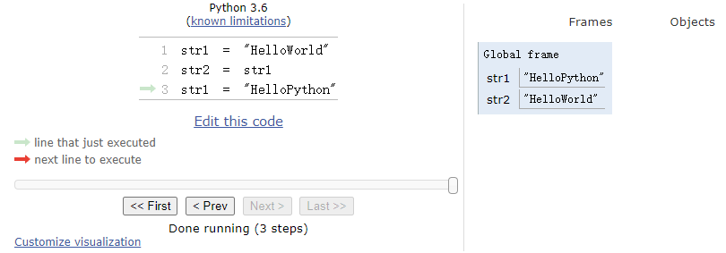

- 当我们用str1给str2赋值的时候，是根据str1的值创建了一个全新的对象赋给str2。

  因此str1和str2是相互独立互不影响的

- 当我们修改str1的值的时候，实际上是把原来的`"HelloWorld"`直接丢弃，生成了一个新的`"HelloPython"`对象赋给str1

**Mutable**

Mutable是指这个对象是可以直接改变内容的，也就是说执行修改操作时就不用每次创建一个新的对象了，而是直接在原对象上修改，常见的有 List 和 Dictionary

Environment Diagram：

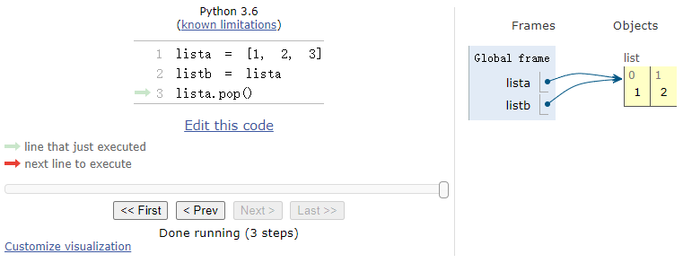

- 当用lista给listb赋值的时候，直接让listb指向了lista指向的对象。listb就相当于给lista起的一个别名
- 修改lista时，是直接在lista指向的对象上修改的，而没有重新创建一个对象，这也就导致listb会跟着一起修改

## 7.2 Iterable

*Iterables* are objects that can be iterated over

*Iterable* 的对象会提供Iterator，可以通过iterator按照一定顺序获取对象中的元素

反过来，可以被传入 `iter()`函数并生成一个iterator的值都是*iterable* 的

iterator相当于指针，所有iterator都是 mutable 的

**使用Iterator的理由**

- 它可以记录上次执行到了哪个元素，保证不会重复计算
- 它提供了一个接口，可以让你任意改变底层数据结构（list，tuple，dictionary）而不用改变功能实现方式
- 可以保证原数据不被改变

### 7.2.1 基本使用

**创建对应容器的Iterator**

`it = iter(container)`

**获取it当前所指的元素**

`next(it)`

**显示所有剩余元素**

`list(it)`

`tuple(it)`

`sorted(it)`

会创建一个list\tuple\排好序的list，包含当前 it 所指的元素以及其后面的元素

执行完该函数后，it也就遍历到了末尾，无法继续使用

### 7.2.1 map-filter-zip-reversed

Built-in Functions for Iteration

这些函数用于操作sequence，并返回一个包含了操作结果的iterator

这些函数都是懒（Lazy）计算，也就是说当执行函数时，并不会立即将sequence中的所有元素都代入计算，而只是做好这个准备。当使用next()查看结果时，才会现场运算，并且查看哪个计算哪个

**map**

`map(func, iterable)`

- func：要执行的操作
- iterable：一个iterable对象，也可以是iterator。

将iterable中所有元素依次放入func中执行，返回包含结果的iterator（不改变原有iterable）

例子：

```python
m = map(lambda x: x.upper(), ['b', 'c', 'd'])
# 此时并不会实际上把bcd变为大写

>>> next(m)
'B' # 此时才刚刚把b转化为B，其他两个字母依旧没有调用upper()
```

**filter**

`filter(func, iterable)`

过滤出iterable中 func(elem) 为True的元素

例子：

```python
t = filter(lambda y:y >= 10, [1,2,3,12,13])
# 将上一个例子中的结果m放入t中
>>> list(t)
[12, 13]
```

**zip**

`zip(first_iter， second_iter ...)`

将传入的所有iter中相同下标的元素组成一个tuple，返回一个list of tuple。可以传入人一个iter

当传入的iter长度不一致时，只保留到长度最小的那个iter

例子：

```python
z = zip([1,2], [3,4,5], [6,7,8,9])
>>> list(z)
[(1, 3, 6), (2, 4, 7)]
```

**reversed**

`reversed(sequence)`

传入一个sequence，返回包含了反转后的sequence的iterator。

注意返回值是一个iterator，所以不能直接拿这个返回值和sequence去比

例子：

```python
# 判断回文字串
def palindrome(s):
    # 这里注意要先把reversed(s)的结果转化为list再比较
    return list(s) == list(reversed(s))
	# 另一种使用zip的写法
    return all([a == b for a, b in zip(s, reversed(s))])
```

## 7.3 Generators

### 7.3.1 yield

函数体中有yield 的就是Generators，Generators相当于是自定义的Iterator

Generators会返回一个Iterator（实际上返回的是Generator类型），当对该iterator不断调用next时，这个Iterator会根据函数逻辑输出yield的值

Generators也是懒执行的，只有调用next时才会计算要输出的值

例子：

```python
def one():
    yield 1
    yield -1
>>> t = one()
# 不断交替返回出1和-1
>>> next(t)
1
>>> next(t)
-1
>>> next(t)
1
>>> next(t)
-1
```

### 7.3.2 yield from

当遍历一个sequence中的值时，可以使用yield from作为一种简写

```python
def merge(a, b):
    for x in a:
        yield x
    for x in b:
		yield y
>>> list(merge([1, 2, 3], [4, 5, 6]))
[1, 2, 3, 4, 5, 6]

# 上面的函数可以简写为
def merge(a, b):
    yield from a
    yield from b
```

在递归中使用yield from

```python
def prefixs(s):
    if s:
        yield from prefixes(s[:-1])
        yield s
>>> list(prefixs('both'))
['b', 'bo', 'bot', 'both']
```

# 8. Object

名词解释：

- class：a template for creating objects

  class是创建object（对象）的模板

- instance：a single object created from a class

  实例是通过class创建的单个object（对象）

## 8.0 Identity Operator（is）

如果两个Object的引用(指向的地址)一模一样，那么我们说二者 is the same，也就是说二者只是同一个东西的两个名字

如果两个Object只是碰巧值完全相同，那么二者是equal

```python
>>> a = [10, 20]
>>> b = [10, 20]
>>> a == b # a和b只是值相同
True
>>> a is b
False
>>> a = b # 将b的引用赋值给a，让a也指向b
>>> a is b
True
```

**isinstance**

用于判断一个对象是否属于一个类或者该类的子类

`isinstance(1, int) # True`

与`type(1) == int`的区别是这个等式判断不能检查子类

## 8.1 创建class

```python
class <name>:
    <suite>
```

当创建class时，suite中的语句会立即执行

**示例：**

```python
class Account:
    interest_rate = 0.2
    def __init__(self, account_holder):
        self.balance = 0
        self.holder = account_holder
    
    def deposit(self, amount):
        self.balance += amount
    
    def withdraw(self, amount):
        if self.balance >= amount:
        	self.balance -= amount
        else:
            pritn("y")
```

- interest_rate是class attribute，所有的对象共用一份
- balance和holder 是instance attribute，每个对象都不同
- \_init_ 是constructor，调用类名创建对象时会自动执行该函数

### 8.1.1 创建Object

当调用class时，会创建一个Object

```python
jim = Account('Jim')
```

**创建过程：**

1. 创建一个对应class Account的实例（instance），此时该实例是空白的
2. 调用\_init_函数，其中第一个参数self是刚刚创建的空白实例，其余参数是调用Account时传入的参数
3. 在\_init_函数中对属性进行赋值，之后将这些值绑定在传入的实例中，该实例创建完毕

**Object Identity：**

- 调用类名一定会创建一个新的instance实例

- 通过赋值语句不会创建新对象，只会给原有对象绑定新名字

  ```python
  jim_copy = jim
  >>> jim_copy is jim
  True
  ```

## 8.2 Attributes

存储在class或者instance中的数据都是Attributes，包括method

### 8.2.1 获取属性

`john = Account('John')`

- 使用dot expression`.`来获取属性（Attribute）

  `john.balance # 0` 

- 使用built-in function getattr

  `getattr(john, 'balance') # 0`

- 使用built-in function hasattr 检查是否存在该属性

  `hasattr(john, 'balance') # True`

优先寻找instance属性，如果找不到再寻找class属性

### 8.2.2 dot expression执行过程

`<expression>.<name>`

1. Evaluate the \<expression> to the left of the dot, which yields the object of the dot expression.

   执行dot左侧的expression，返回一个object对象

2. \<name> is matched against the instance attributes of that object; if an attribute with that name exists, its value is returned

   检查第一步得到的instance中有没有名为name的attributes，如果有就直接返回（class中的function都不在instance中）

3. If not, \<name> is looked up in the class, which yields a class attribute value.

   如果没有，就在class attribute中寻找，返回一个class attribute

4. That value is returned unless it is a function, in which case a bound method is returnd instead

   如果这个attribute是一个值，就直接返回；如果是一个函数，就将object对象与这个函数绑定为bound method，返回这个bound method

### 8.2.3 Assignment to Attributes

当对class和instance中没有的变量赋值时，会直接创建该变量

**class attributes**

dot前面是类名时：

通过类名进行赋值都是对class attributes进行赋值

通过类名进行的赋值操作造成的改变在所有instance中都可以看到

```python
Account.interest = 0.04

# class attributes修改时所有instance都被修改
tom_account.interest # 0.04
john_account.interest # 0.04
```

**instance attributes**

dot前面是object时：

通过object只能获取到class attributes，绝对不能更改; 当使用object修改class attributes时只会在instance中创建一个同名的instance attributes

```python
tom_account.interest = 0.08

# 不会影响其他对象中的interest值
Account.interest # 0.04
john_account.interest # 0.04
```

## 8.3 Methods

类中的方法只会存储一份，所有的对象（instance）共用这一份方法。

所以为了区分到底是哪个对象正在调用这个方法，类中的方法第一个参数都固定为`self`

**method 和 function 的区别**

`Object + Function = Bound Method`

```python
>>> type(Account.deposit)
<class 'function'>
>>> type(tom_account.deposit)
<class 'method'>
```

- 当直接调用function时，需要传入两个参数

  `Account.deposit(tom_account, 1001)`

- 通过dot调用method时，只需传入一个参数，第一个参数self会自动填充为tom_account

  `tom_account.deposit(1001)`

## 8.4 运算符重载

在python中，一些特定的名字代表特定行为，这些名字通常开头和结尾都有两条`__`下划线

比如`__init__`，在创建Object时会自动调用

以下各重载以分数（Ratio）类举例，各函数均定义在类中

```python
class Ratio: # 分数
    def __init__(self, n, d):
        self.numer = n # 分子
        self.denom = d # 分母
        
    def simplify(self):
        def gcd(n, d): # 找到最大公约数
            while n != d:
                n, d = min(n, d), abs(n - d)
            return n
        max_common_divisor = gcd(self.numer, self.denom)
        self.numer //= max_common_divisor
        self.denom //= max_common_divisor
```

### 8.4.1 \__str__()

自定义类如何转化为字符串，即定义类的输出格式

```python
def __str__(self):
    return f'{self.numer}/{self.denom}'

>>> print(Ratio(1, 2))
1/2
>>> print(Ratio(1,2 )) # 重写__str__之前
<__main__.Ratio object at 0x000002808F318190>
```

```python
# repr函数主要用于interactive python中的显示
def __repr__(self):
    return f'Ratio({self.numer}, {self.denom})'

>>> Ratio(1, 2)
Ratio(1, 2)
>>> Ratio(1, 2) # 重写__repr__之前
<__main__.Ratio object at 0x0000024903890310>
```

### 8.4.1 \__add__()

自定义 类的加法运算规则

```python
def __add__(self, other):
    '''
    >>> Ratio(1, 3) + Ratio(1, 6)
    Ratio(1, 2)
    >>> Ratio(1, 3) + 1
    Ratio(4, 3)
    '''
    if isinstance(other, int):
        n = self.numer + self.denom * other
        d = self.denom
	elif isinstance(other, Ratio):
        # 通分之后直接相加
        n = self.numer * other.denom + self.denom * other.numer
        d = self.denom * other.denom
        result = Ratio(n, d)
        result.simplify() # 化简
        return result
```

### 8.4.2 \__float__()

自定义类的类型转换规则

```python
def __float__(self):
    return self.numer / self.denom
```

# 9. OOP

## 9.1 Inheritance

**用处：**

Two similar classes differ in their degree of specialization

当两个类比较相似，只在实现的具体程度上有一些差异，一个更抽象而一个更具体时，可以让具体类继承于抽象类

**语法：**

```python
class <name> (<base class1>， <base class2>): # 可以继承多个父类
    <suite>
```

**例子：**

```python
class CheckingAccount(Account):
    withdraw_fee = 1 # 取钱时的手续费
    interest = 0.01
    def withdraw(self, amount):
        return Account.withdraw(self, amout + self.withdraw_fee)
    
# 剩余没有重新实现的部分都与Account类保持一致
```

**Looking up Attribute**

1. 如果该属性在class中出现，直接返回
2. 如果没有，就去base class中寻找

也就是说class中的属性会覆盖base class中的同名属性，但是可以通过一以下方法访问父类属性：

- `BaseClass_Name.attribute_name`

  ```python
  def Son(Father):
      def __init__(self):
          Father.__init__(self)
  ```

- `super().attribute_name`

  使用super()时，会自动调用当前函数的对象作为self传入父类

  ```python
  def Son(Father):
      def __init__(self):
          super().__init__() # 不用传入self
  ```


## 9.2 Linked List

```python
class Link:
	empty = ()
        
   	def __init__(self, first, rest = empty):
        assert rest is Link.empty or isinstance(rest, Link)
		self.first = first
        self.rest = rest
        
    def __repr__(self):
        if self.rest is not Link.empty:
        	rest_repr = ', ' + repr(self.rest)
        else:
            rest_repr = ''
        return 'Link(' + repr(self.first) + rest_repr + ')'
    
    def __str__(self):
        if self is LinkEmpty:
            return ''
        string = f'{self.first}'
        self = self.rest
        while self is not Link.empty
        	string = string + ' -> ' + str(self.first)
            self = self.rest
        return string
```

1 2 3 4


