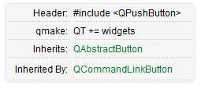

# 创建QT项目

## 创建文件：

1. 选择项目位置

    - 注意：项目名称和路径中都不能包含中文和空格

2. 构建套件(Kit Selection)

    - 如果想要开发安卓，QT支持安卓开发，可以选择安卓套件

    - 如果安装了多个版本，可以选择不同版本的套件

3. 选择类的信息

    在这里创建窗口类，选择类名和基类
    - QWidget——默认空白窗口，父类
    - QMainWindow——继承于QWidget，增加了功能栏、状态栏、信息栏等基本功能
    - QDialog——继承于QWidget，对话框窗口

4. 项目管理

    团队开发需要用到版本控制系统：SVN，VSS，GIT

## 默认模板介绍

**main函数：**

```C++
#include "mywidget.h"
#include <QApplication>

int main(int argc, char *argv[])
{
    QApplication a(argc, argv);
    MyWidget w;
    w.show();

    return a.exec();
}
```
- `#include<QApplication>` 应用程序类的头文件
- main函数中的两个参数
  - argc：命令行变量的数量
  - argv：存放命令行变量的数组

- `QApplication a(argc,argv)` 应用程序对象，有且仅有一个
- `myWidget w` myWidget的窗口对象，父类是QWidget
- `w.show()` 用show方法来显示窗口
- `return a.exec()` 让应用程序对象进入消息循环，用来等待用户的消息，要不然窗口会一闪而过。

    可以理解为是一个死循环，点击窗口右上角的叉号退出循环。代码会阻塞到这行。

**.pro文件：**

不要修改这个文件
```C++
QT       += core gui  //QT包含的模块，core和gui是要用到的模块

greaterThan(QT_MAJOR_VERSION, 4): QT += widgets 
// 大于4版本以上时，包含widget模块

TARGET = FirstProject  //生成的.exe程序的名称
TEMPLATE = app  // 模版，app是应用程序模板


SOURCES += main.cpp\  // 项目中有的源文件
        mywidget.cpp  // 后面再新建.cpp文件也会自动在这里添加

HEADERS  += mywidget.h // 项目中的头文件
```

**.h头文件：**

```C++
#ifndef MYWIDGET_H
#define MYWIDGET_H

#include <QWidget>

// 定义自己的MyWidget类，继承于QWidget类
class MyWidget : public QWidget  
{
    Q_OBJECT  // 宏，允许类中使用 信号和槽 的机制

public:
    MyWidget(QWidget *parent = 0);  // 构造函数
    ~MyWidget(); // 析构函数
};

#endif // MYWIDGET_H
```

- `#ifndef ...... #endif` 防止文件重复包含

## 命名规范
- 类名：首字母大写，单词和单词之间首字母大写
- 函数名 变量名：首字母小写，单词和单词之间首字母大邪

## 快捷键
- 注释 ： ctrl + /
- 运行 ：ctrl + r (run)
- 编译： ctrl + b (build)
- 查找：ctrl + f
- 整行移动：ctrl + shift + ↑/↓
- 帮助文档：选中关键词之后 F1
- 自动对齐：ctrl + i
- .h文件 和 .cpp文件 切换：F4

## 查操作文档时的基本信息

比如：QPushButton

- Header：使用时需要包含的头文件
- qmake：需要包含的模块，在.pro文件的第一行`QT +=` 后面添加
- Inherits：继承于，即父类是谁
- Inherited By：被谁继承，即子类是谁


