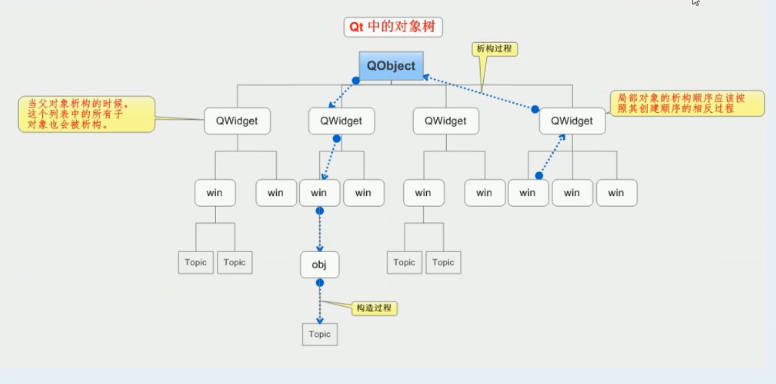

# QT基本功能

## QDebug
用于在控制台中输出一些信息

包含头文件：`#include<QDebug>`

使用：`qDebug() << "HelloWorld";`

不用endl，自动换行

## QWidget中的一些函数

- **重置窗口大小**

    函数原型：`void resize(int w, int h);`

    调用示例：`this->resize(600,400);`

- **设置窗口标题**

    函数原型：`setWindowTitle(const QString &)`

    调用示例：`setWindowTitle("窗口");`

- **固定窗口大小，禁止用户修改**

    函数原型：`setFixedSize(int w, int h)`

    调用示例：`setFixedSize(600, 400);`

- **隐藏窗口**

    `hide()`

    可以用于场景的切换，隐藏自己然后显示下一个画面

## QPushButton

代码一般写在.cpp文件中的MyWidget窗口类的构造函数中

- **创建按钮对象**

    `QPushButton * btn = new QPushButton;`

    后创建的按钮会覆盖掉前面创建的按钮

- **显示按钮**

    由于QPushButton的祖先类是QWidget，所以有show()方法

    `btn->show();`

    show 默认是弹出顶层窗口，我们想要的效果是按钮放在窗口里

- **将按钮添加到窗体中**

    函数原型：`void setParent(QWidget *parent)`

    调用示例：`btn->setParent(this);`

    因为是写在窗口的构造函数里面，所以this即为所要添加的窗体

- **在按钮上添加文本**

    `void setText(const Qstring &text);`

    直接传入char*类型就可以，会隐式类型转换

- **创建按钮时直接传入文字并指定所属窗体**

    函数原型：`QPushButton(const QString &text,QWidget *parent = 0);`
    
    调用示例：`QPushButton * btn2 = new QPushButton("我是按钮",this);`

    但是这样会按照控件的大小创建窗口，也就是说窗口和按钮一样小


- **重置按钮的大小**

    由于继承于QWidget类，也有resize函数

    `btn->resize(100,100);`
    
- **移动按钮**

    函数原型：`void move(int x, int y);`

    调用示例：`btn2->move(100,100);`

### 创建自定义图片按钮的模板：
```C++
    QPixmap pix;
    if(!pix.load(img_path)){
        qDebug()<<img_path<<"加载失败" ;
        return;
    }

    pix = pix.scaled(pix.width()*2,pix.height()*2); // 用这个函数对图片进行缩放

    this->setFixedSize(pix.width(),pix.height()); // 把按钮大小固定为和图片一样大
    this->setStyleSheet("QPushButton{border:0px}"); // 将按钮设置为不规则样式，不然按钮永远是方的，无法适配图片
    this->setIcon(pix); // 给按钮设置资源图片
    this->setIconSize(QSize(pix.width(),pix.height())); // 将资源图片的大小设置为和原图片一样大
```

***
***


## 对象树



QObject 是最上层的基类，创建的所有对象都是在创建QObject对象。当我们创建QObject对象时，都可以传入一个parent(父对象指针)作为参数。此时我们创建的这个对象会自动添加至其父对象的children()列表。

当父对象析构的时候，这个列表中的所有对象也会析构

作用是让我们可以随意new对象而不用考虑内存管理(即delete)的问题，前提是new的对象指定了父亲类。也就是说new完对象最好立即指定父类。

## 坐标系

左上角为零点，向右、向下是正方向


