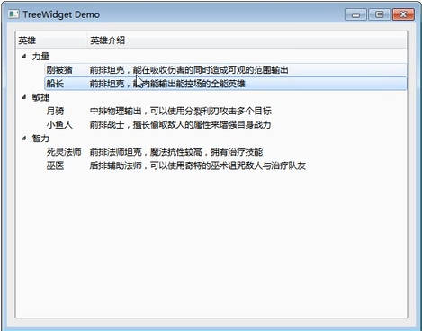

# QMainWindow

## 基本组成


- WindowTtile ：窗口标题
- Menu Bar ：菜单栏
- Tool Bar Area ：工具栏区(可以有多个工具栏)
- Dock Widget ：链接部件(浮动窗口，可以到处停靠的窗口)
- Status Bar ：状态栏
- Central Widget ：中心部件

## 代码实现

### 菜单栏

菜单栏最多只能有一个

1. 包含头文件

    `#include <QMenuBar>`

2. 创建菜单栏

    `QMenuBar *bar = menuBar();`

3. 将菜单栏添加至窗口中

    - 函数原型：`void setMenuBar(QMenuBar *menubar)`
    - 使用示例：`this->setMenuBar(bar);`

    菜单栏中如果没有菜单还是不会显示

4. 在菜单栏中添加菜单

    - 函数原型：`QMenu* addMenu(const QString &title)`
    - 使用示例：`QMenu * fileMenu = bar->addMenu("文件");`

5. 在菜单中添加菜单项(点击菜单后出来的下拉列表)

    - 函数原型：`QAction* addAction(const QString &text)`
    - 使用示例：`fileMenu->addAction("新建文件");`

6. 在菜单项之间添加分割线

    

    - 函数原型：`QAction* addSeparator();`
    - 使用示例：`fileMenu->addSeparator();`
***
### 工具栏

工具栏可以有多个

1. 包含头文件

    `#include<QToolBar>`

2. 创建工具栏

    `QToolBar* toolBar = new QToolBar(this);`

3. 将工具栏添加至窗口

    `this->addToolBar(toolBar);`

4. 修改工具栏默认位置

    默认停靠在窗口最上方,菜单栏下面

    - 函数原型:`void addToolBar(Qt::ToolBarArea area, QTooBar *toobar)`

    QT: :ToolBarArea是QToolBar中的枚举值
      - 默认停靠左侧：`Qt::LeftToolBarArea`
      - 默认停靠右侧：`Qt::RightToolBarArea`
      - 默认停靠上侧:`Qt::TopToolBarArea`
      - 默认停靠下侧:`Qt::BottomToolBarArea`

5. 设置为只允许左右停靠

    - 函数原型：`setAllowedAreas(Qt::ToolBarArea area)`
    - 使用示例：`toolBar->setAllowedAreas(Qt::LeftToolBarArea | Qt::TightToolBarArea);`

6. 设置是否允许浮动

    `setFloatable(bool floatable)`

7. 设置是否允许移动(相当于一个总开关)

    `setMovable(bool movable)`

8. 在工具栏中添加内容

    `toolBar->addAction();`
    - 参数可以是QString
    - 也可以填QAction，相当于和菜单栏共享一个功能

9. 在工具栏中添加控件

    `toolBar->addWidget(btn);`
***
### 状态栏

最多有一个

1. 包含头文件

    `#include<QStatuBar>`

2. 创建状态栏

    `QStatusBar * statusBar = statusBar();`

3. 放入窗口中

    `this->setStatusBar(statusBar);`

4. 放入标签控件

    `QLabel * label = new QLabel("提示信息", this);`

    - 把信息显示在左下角：`statusBar->addWidget(lable);`
    - 把提示信息显示在右下角：`statusBar->addPermanentWidget(lable);`

***
### 铆接部件(浮动窗口)

可以有多个

1. 包含头文件

    `#include<QDockWidget>`

2. 创建铆接部件

    `QDockWidget* dockWidget = new QDockWidget("窗口标题",this);`

3. 添加到窗口中

    `void addDockWidget(Qt::DockWidgetArea area, QDockWidget* dockWidget);`

    第一个参数设置默认停靠位置

4. 限制停靠区域

    `dockWidget->setAllowdAreas(Qt::DockWidgetArea area);`

***
### 设置中心部件

只能有一个

`setCentralWidget();`
***
### 资源文件的添加

将项目中用到的图片、音乐之类的资源添加至项目中

右键项目名->添加新文件->Qt->Qt Resource File->填名称和路径(这个路径只是放资源的文件夹的路径)

添加好之后会有一个“资源”文件夹，下面是一个.qrc文件，右键文件 -> Open in Editor打开

打开后下面有个添加，先添加前缀，再添加文件。要添加的文件一定要放在项目同目录下

*前缀就相当于一个标识符或者文件夹，用来区分不同用处的资源*

使用资源：`setIcon(QIcon(文件名));`
文件名使用`: + 前缀名 + 文件名`

# QDialog

**对话框分为：**
- 模态对话框——不可以对其它窗口进行操作

    就是必须先关掉它才能操作其它窗口，比如设置窗口

    模态对话框有阻塞功能，弹出后下面的代码不会执行

- 非模态对话框——可以对其它窗口进行操作

    开着它不影响对其它窗口的操作

默认对话框尺寸比较小，弹出的对话框太小的话会报出一个警告

**创建对话框：**

1. 包含头文件`#include<QDialog>`

2. 创建对话框对象：`QDialog * dlg = new QDialog(this);`

    不创建在堆区并且用Lambda表达式匿名调用会让对话框一闪而过

如果点击按钮弹出一个对话框，那么每点一次都会new一个对话框对象出来，叉掉对话框并不会释放这个对象，只有叉掉项目才会。这样有可能导致内存泄漏，所以需要设置对话框属性

2. 设置对话框属性：`dlg->setAttribute(Qt::WA_DeleteOnClose);`

    关掉对话框的同时delete这个对象，参数里还可以填许多枚举值，这是第55号

    **注意：** delete dlg之后dlg指针会成为野指针(悬空指针)，所以要把dlg置空，但是无法让`dlg = NULL`，会报错提示dlg为只读
    
    最好创建的时候使用Qt内置指针QPointer
    `QPointer<QDialog> dlg = new QDialog(this);`

3. 弹出对话框
   - 弹出模态对话框：`dlg->exec();`
     - 这行代码会导致程序阻塞，直至对话框处理完毕后才会继续往下执行，所以不要在这行代码之后做connect连接函数
   - 弹出非模态对话框：`dlg->show();`
     

**标准对话框**

Qt内置的一系列对话框：

- 模态对话框，用于显示信息，询问问题等：`QMessageBox`

    1. 包含头文件：`#include<QMessageBox>`
    2. 调用方法弹出对话框

    主要使用的方法是静态方法，可以通过类名直接调用

    - 错误对话框：`critical(QWidget* parent, 弹出窗口的标题，弹出窗口里要显示的文字);`
    - 信息对话框：`QMessageBox::information(this, "Infomation", "信息" );`
    - 询问对话框：`QMessageBox::question(this,title,text,StandardButton buttons = Yes|No);`，最后一个参数设置对话框中的按钮，后面可以再加一个参数表示默认选择哪个按钮

    返回值也是StandardButton类型，返回用户选择了哪个按钮
    - 警告对话框：warning

- 选择颜色：`QColorDialog::getColor()`
- 选择文件或目录：`QFileDialog::getOpenFileName(父亲，标题，默认打开的路径，用来过滤问价你的正则)`
- 选择字体：`QFontDialog::getFont()`
- 允许用户输入一个值，并将其值返回：`QInputDialog`

# 界面布局

## 常用布局方式
选取Widget进行布局
- 水平布局
- 垂直布局
- 栅格布局

调整sizePolicy来让widget根据控件高度调整高度

控件的外边框默认为9像素

利用弹簧布局

## 常用控件

objectName即为控件对应的对象名，使用ui->对象名找到指定控件，并为控件指定逻辑

### 按钮
**PushButton**

一般用来显示文字选项

**ToolButton**

一般用来显示图片或图片和文字同时显示

- toolButtonStyle：文字显示在图片哪个地方
- autoRaise：按钮透明，鼠标移上去有凸起

**Radio Buttion**

单选按钮，使用Group Box组件进行不同选项的分组

- `setChecked(true)`，用这个成员方法设置默认选中

**Check Box**

多选按钮，CheckBox有个自己的信号叫`void stateChanged(int state)`,齐总state的值可以为：
- 0：未选中
- 1：半选中，前面的方块里填一个方块
- 2：全选中，对勾
***
### ItemWidget(item based)

**ListWidget**

放一行一行的文字，就和windows配置路径那个样子差不多

```C++
// 创建一个item对象
QListWidgetItem * item = new QLisetWidgetItem("锄禾日当午");

//将这个item对象放入ListWidget中
ui->listWidget->addItem(item);

// 设置item中文字的对齐方式
item->setTextAlignment(Qt::AlignHCenter);
```

**TreeWidget**



1. 设置水平头

    `ui->treeWidget->setHeaderLabels(QStringList()<<"英雄" <<"英雄介绍");`

    - 其中QStringList相当于QList<QString\>
    - 这个QList中重载了左移运算符，所以这就是创建一个QStringList匿名对象然后调用左移运算符，来达到同时添加多个头的目的

2. 创建一个item对象

    `QTreeWidgetItem * item = new QTreeWidgetItem(QStringList()<<"力量");`

3. 加载成为顶层结点(根结点)

    `ui->treeWidget->addTopLevelItem(Item);`

4. 创建并加载一个Item的子结点

    ```C++
    QTreeWidgetItem * childItem = new QTreeWidgetItem(QStringList()<<"英雄简介");
    item->addChild(childItem);
    ```

**TableWidget**


1. 设置列数(只算表格内容，不算序号那列)

    `ui->tableWidget->setColumnCount(3);`

2. 设置水平表头

    `ui->tableWidget->setHorizontalHeaderLables(QStringList()<<"姓名"<<"性别"<<"年龄");`

3. 设置行数

    `ui->tableWidget->setRowCount(5);`

4. 创建并添加一个item对象

    `ui->tableWidget->setItem(0,0,new QTableWidgetItem("亚瑟"));`

***
### 其它控件

**Scroll Area**

可以加滚动条的窗口

**Tool Box**

类似于QQ的好友分类那种表

- currentIndex：当前页的序号，也就是顺序
- currentItemText：修改该页的名称
- 右键对象列表中的toolBox对象，插入页

**Tab Widget**

浏览器中开多个网页的效果

**Stacked Widget**

也是能分多个页，但是要自己设置按钮来完成不同页面的切换

- 设置默认值

    `ui->stackedWidget->setCurrentIndex(0);`

- 按钮绑定

    ```C++
    connect(ui->btn_page1, &QPushButton::clicked,[=]{
        ui->stackedWidget->setCurrentIndex(1);
    });
    ```

**Widget**

用于布局使用

**ComboBox**

下拉框

- 添加选项：`ui->comboBox->addItem("选项1");`

**Line Edit**

单行输入框

- echoMode：该属性可以用来修改输入模式

**Text Edit**

多行输入框，就相当于文本编辑器

**Plain Text Edit**

多行输入框，不过支持多颜色的字体

**Spin Box**

数字框，旁边有两个箭头用来加减数字

**Double Spin Box**

双精度的数字框

**Time Edit**

时间输入框

**Date Edit**

日期输入框

**Horizontal/Vertical Scroll Bar**

水平/垂直滑动条

**Lable**

标签控件

- 显示图片`ui->Lable->setPixmap(QPixmap(":/资源名"));`
- 显示动图(.gif文件)：

    ```C++
    #include<QMovie> 

    ...

    QMovie * movie = new QMovie(":/资源名.gif");
    ui->lable->setMovie(movie);
    //播放动图
    movie->start();
    ```

## 自定义控件

**创建自定义控件：**

右键项目名->添加新文件->Qt->Qt设计师界面类->选择界面模板为Widget->自定义类名->完成

此时会新建一个界面类，就可以在这个界面中自定义控件，比如说封装多个控件

**使用自定义控件：**

在主窗体中添加一个和自定义控件相同类的控件。比如刚才选择界面模板为Widget则所属类为QWidget，就添加一个Widget。

然后右键这个控件->提升为->填写提升的类名称(创建自定义控件时会同时创建.h,.cpp,.ui三个文件，在.h中可以看到)->添加->提升

其中全局包含的意思是选中之后下次再提升可以直接选择它而不用再填类名。