# 1. 微服务介绍

将整个项目打成一个jar包，使用同一个Tomcat服务器就是单体项目

微服务架构是在服务化思想下的一套最佳实践架构方案。服务化就是把单体架构中的功能模块拆分为多个独立项目。

每个独立项目分别打成jar包，运行在自己独有的Tomcat服务器，有自己专属的数据库。独立项目之间通过网络进行通信

Spring Cloud是目前使用最广泛的微服务架构，它相当于是对其他微服务技术组件的集成，并基于Spring Boot实现了这些组件的自动装配

## 1.1 服务拆分

拆分应该做到高内聚，低耦合，即每个微服务包含的业务相互关联度要高，每个微服务之间功能要相对独立

从拆分方式来说，包含两种方式：纵向拆分，按照业务模块拆分；横向拆分，抽取公共服务，提高复用性

微服务的工程结构有两种：独立Project（每个微服务都独立创建一个Java Project） 和 独立Module（使用maven聚合，每个微服务都在同一个Project下创建一个Module）

## 1.2 DDD架构

### 1.2.1 biz/manager层

对于小项目来说，只需要controller-service-dao即可完成项目的开发，但是随着业务变复杂，只有三层就会让层中的代码变的混乱和复杂，此时就需要引入五层结构，即加入biz和manager层

- controller层：功能不变

  负责接受前台的数据和请求，并将处理结果返回给前台

- biz层：复杂应用层业务层

  主要负责业务编排，把一个业务场景下的主流程逻辑处理完成，具体细节则是在service层中

- service层：基础业务层

  业务中可以复用的逻辑，基础的业务写在这层中

- manager层：对dao层中的数据库操作组合复用

  比如缓存、中间件的处理、对第三方平台的封装等

- dao层：功能不变

  负责封装数据库的crud操作

### 1.2.2 DDD架构

DDD架构的核心就是把原来MVC架构中的pojo、DTO、VO等对象从贫血模型变为充血模型

也就是说，原来的pojo对象中只有对象没有逻辑，现在就要把原来service层的基础业务操作放在对应的pojo对象里面，而新的service层只负责做业务逻辑的编排，而不写具体代码

# 2. 远程调用

微服务之间可能需要互相请求数据，此时需要用网络请求别的微服务的数据

## 2.1 使用HTTP

**使用Http进行远程调用**

可以模拟前端对后端的请求方式用Http进行请求，Spring提供了一个RestTemplate工具来实现Http请求的发送。

但是使用Http请求需要在代码中写死请求地址，这会带来很多问题

- 提前不知道部署之后其他微服务的地址和端口号
- 被请求的微服务可能会启动多个实例做负载均衡，写死之后就只能访问一个
- 被请求的微服务挂掉之后就无法请求

此时就需要进行服务治理

### 2.1.1 服务治理

使用注册中心来进行服务治理，注册中心本身也是一个独立微服务

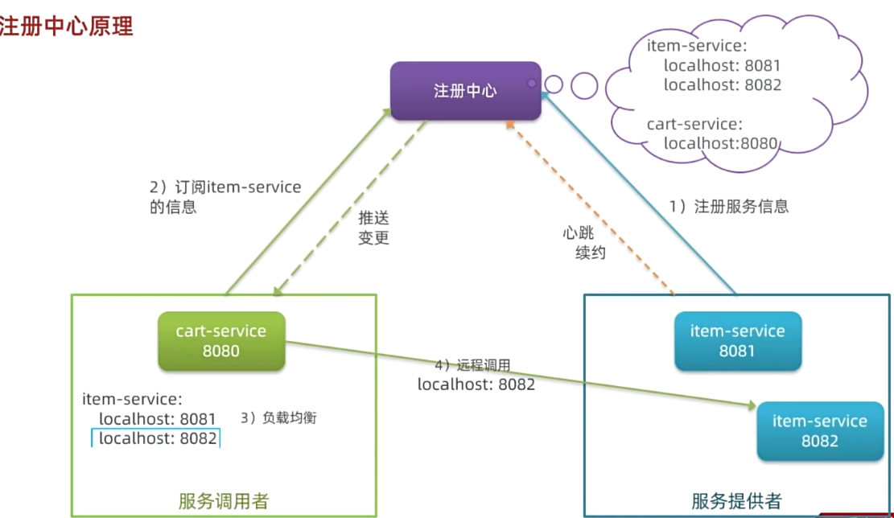

所有微服务都既是服务提供者也是服务调用者

微服务在注册时都会在注册中心中注册服务信息，当需要调用其他服务时会先向注册中心订阅，再向服务提供者发送请求。

目前较常使用的注册中心组件是Nacos，它是阿里巴巴的产品，并已经加入Spring Cloud Alibaba中

此时远程调用的流程就变为：

1. 通过服务名称从注册中心中拉取服务的所有实例列表
2. 通过负载均衡技术选取要发送请求的实例
3. 构建http请求并发送

 ### 2.1.2 Nacos注册中心

**搭建Nacos注册中心**

下载Nacos的docker镜像并启动即可

**服务注册**

在微服务启动时，需要向注册中心注册自己作为服务提供者的信息

在要启动的微服务中做如下配置：

1. 引入nacos discovery依赖

2. 在yaml配置文件中配置Nacos地址

   ```yaml
   spring:
     application:
       name: service-name # 微服务名称，注册到nacos后也会用这个名称
     cloud:
       nacos:
         discovery:
           server-addr: nacos:8848
           namespace: prod
   ```

之后微服务启动时就会自动向注册中心进行注册

**服务发现**

当微服务需要调用其他服务时，就需要向注册中心订阅能提供对应服务的服务提供者信息

1. 引入nacos discovery依赖

2. 配置nacos地址

3. 服务发现

   ```java
   @Autowired
   private DiscoveryClient discoveryClient; // spring cloud为服务发现提供的接口
   
   // 调用其他服务
   private void callOtherService() {
       // 1. 根据服务名称拉取服务提供者的实例列表
       List<ServiceInstance> instances = discoveryClient.getInstances("need-service");
       // 2. 挑选一个实例（涉及到负载均衡策略,这里用随机选取）
       ServiceInstance instance = instances.get(RandomUtil.randomInt(instances.size());
       // 3. 获取实例的IP和端口
       URI uri = instance.getUri();
   	// 4. 向实例发送请求
       ......                       
   }
   ```

### 2.1.3 OpenFeign

OpenFeign是一个声明式的http客户端，作用是基于注解简化http请求发送

**基本使用**

1. 引入spring-cloud-starter-openfeign（用于远程调用）和spring-cloud-starter-loadbalancer（用于负载均衡）依赖

2. 在要调用FeignClient接口的模块的启动类上添加@EnableFeignClients注解，启用OpenFeign功能

   注解中加入参数 `@EnableFeignClients (basePackages = {""})`扫描FeignClient所在包，要不然注入不成功

3. 创建目标微服务对应的FeignClient接口

   使用一个FeignClient接口只能给它对应的微服务发送请求，在接口中编写发送请求的函数，一个函数对应一种http请求，使用SpringMVC注解即可

   ```java
   @FeignClient(value = "item-service") // value指定微服务名称
   public interface ItemClient {
       @GetMapping("/items")
       List<ItemDTO> queryItemByIds(@RequestParam("ids") Collection<Long> ids);
   }
   ```

4. 使用FeignClient实现远程调用

   ```java
   @Au
   ItemClient itemClient;
   
   List<ItemDTO> items = itemClient.queryItemByIds(List.of(1, 2, 3));
   ```

**连接池优化**

OpenFeign底层默认使用jdk自带的HttpURLConnection发送http请求，每次发送都要手动建立连接，效率比较低，并且不支持连接池。

可以选择其他发送http请求框架比如Apache HttpClient和OKHttp

以整合OKHttp为例

1. 引入feign-okhttp依赖

2. 在yaml文件中开启连接池功能

   ```yaml
   feign:
     okhttp:
       enabled: true
   ```

**项目结构优化**

在上面的基本使用中，调用哪个微服务就需要为哪个微服务创建一个FeignClient接口。如果在多个微服务中都需要调用同一个微服务，就需要在每个调用方都写一个相同FeignClient，造成代码冗余。

解决方案有两种：

- 将每个微服务项目再拆分为xxx-dto、xxx-api、xxx-biz三个子模块。dto放dto对象，api放调用自己时需要的FeignClient接口，biz放业务逻辑

  这样当其他微服务需要调用自己时，就可以直接引用xxx-dto和xxx-api模块即可

- 再独立抽取一个api微服务 专门用来存放所有的FeignClient对象和用到的DTO对象，让其他微服务都引用api微服务依赖

采用这两种方式之后，由于FeignClient不在项目包下， 因此需要在@EnableFeignClients中指定FeignClient所在的包 `@EnableFeignClients(basePackages = "com.xx.api.client")`

**日志**

OpenFeign只会在FeignClient所在包的日志级别为DEBUG时，才会输出日志

其日志级别有4级：

- None 默认：不记录
- BASIC：记录请求的方法、URL以及相应状态码和执行时间
- HEADERS：再加上请求头和响应头
- FULL：再加上请求体和响应体

修改日志级别：

1. 声明一个类型为Logger.Level的Bean，在其中定义日志级别

   ```java
   public class DefaultFeignCOnfig {
       @Bean
       public Logger.Level feignLogLevel() {
           return Logger.Level.FULL;
       }
   }
   ```

   此时由于类上没加@Configuration注解，这个Bean并不会被自动注入

2. 单独给某个FeignClient配置日志级别

   在@FeignClient注解上用configuration参数指定

   ```java
   @FeignClient(value = "item-service", configuration = DefaultFeignConfig.class)
   ```

3. 全局配置所有FeignClient

   在启动类上开启FeignClients的@EnableFeignClients注解上指定配置类

   ```java
   @EnableFeignClients(defaultConfiguration = DefaultFeignConfig.class)
   ```

## 2.2 使用RPC

Dubbo

# 3. 网关

网关，就是网络的关口。负责对前端发来的请求进行身份校验、路由和转发，相当于对后端所有微服务的一个统一管理的大门。网关也是一个独立的微服务

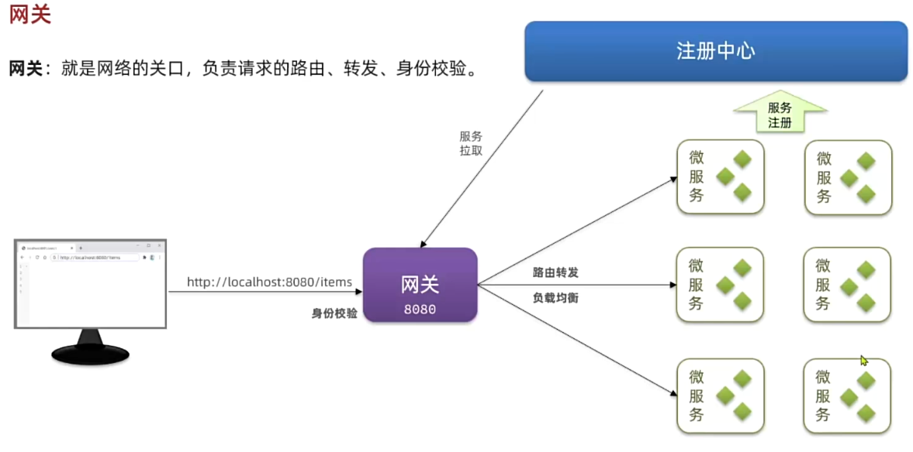

现在常用的网关组件有Spring Cloud Gateway

## 3.1 网关路由

网关路由会自动从注册中心中拉取所有微服务。配置网关路由的核心是配置不同请求需要转发到哪个微服务

路由规则在yaml配置文件中进行配置，配置项对应的Java对象为RouteDefinition

```yaml
spring:
  cloud:
    gateway:
      routes:
        - id: item # 自定义id，用来唯一标识一个路由规则
          uri: lb://item-service # 该路由规则要转发到的目标微服务，lb表示负载均衡
          predicates: # 路由断言，如果请求符合该断言则进行路由
            - Path=/items/**,/search/** # 以请求路径做判断，请求路径以/items或以/search开头则符合规则
          filters: # 对符合断言的请求或相应做特殊处理
```

**路由断言**

路由断言中可以对根据多种规则对请求进行匹配

**路由过滤器**

通过路由过滤器，可以对请求或相应进行特殊处理，比如：

- 给请求添加一个请求头
- 移除请求中的一个请求头
- 给响应结果中添加一个响应头
- 从响应结果中移除一个响应头
- 请求路径重写
- 去除请求路径中的N段前缀（每个 / 作为一段）

**网关执行流程**

配置完网关路由之后，请求经过网关的流程如下

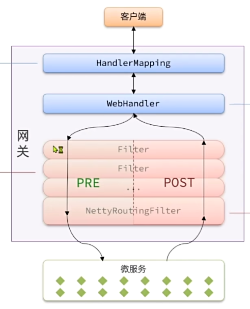

- HandlerMapping - RoutePredicateHandlerMapping（HandlerMapping的默认实现）

  路由映射器，负责进行路由映射，根据请求找到匹配的路由，然后把请求交给WebHandler处理

- WebHandler - FilteringWebHandler（默认实现）

  过滤器处理器，会加载网关中配置的所有过滤器，放入集合中并排序，形成过滤器链，然后依次执行这些过滤器

  其中最后一定会有一个NettyRoutingFilter过滤器，负责将请求转发到微服务，并接受微服务返回的结果

过滤器在请求到来和响应返回时都会被经过

## 3.2 网关登录校验

根据上面的网关执行流程，网关登录校验应该放在一个过滤器中，并且这个过滤器应该在NettyRoutingFilter之前，保证在请求转发之前需要先经过登录校验。

登录校验成功之后，将用户信息保存到HTTP请求头中，再向对应的微服务发送请求

网关过滤器有两种：

- GatewayFilter路由过滤器

  路由过滤器默认不生效，需要像上面那样在配置文件中配置后才会生效

- GlobalFilter全局过滤器

  作用范围是所有路由，声明后自动生效

  ```java
  public interface GlobalFilter {
      Mono<Void> filter(ServerWebExchange exchange, GatewayFilterChain chain);
  }
  ```

  第一个参数是请求上下文，包含整个过滤器链内的共享数据，比如request、response以及其他过滤器存入的数据

  第二个参数是过滤器链，即当前过滤器执行完成后要调用的下一个过滤器

**自定义全局过滤器GlobalFilter**

自定义全局过滤器时，为了保证该过滤器在NettyRoutingFilter之前执行，需要实现Ordered接口，并重写getOrder方法确定执行顺序。order值越大越先执行

```java
@Component
public class MyGlobalFilter implements GlobalFilter, Ordered {
    @Override
    Mono<Void> filter(ServerWebExchange exchange, GatewayFilterChain chain) {
        // 获取jwt
        ServerHttpRequest request = exchange.getRequest();
        HttpHeaders headers = request.getHeaders();
        String token = headers.get("authorization").get(0);
        // 做登录校验
        ...
       	// 如果校验失败则直接拦截请求
        if (false) {
            ServerHttpResponse response = exchange.getResponse();
            response.setStatusCode(HttpStatus.UNAUTHORIZED);
            return response.setComplete();
        }
        // 如果校验成功则将用户信息加入请求头中
        String userInfo = userId.toString(;
        ServerWebExchange newExchange = exchange.mutate().
        								request(builder -> builder.header("user-info", userInfo)).build();
        // 继续执行下一个过滤器
        return chain.filter(newExchange);
    }
    
    @Override
    public int getOrder() {
        return 0;
    }
}
```

**自定义路由过滤器GatewayFilter**

**微服务登录的完整流程**

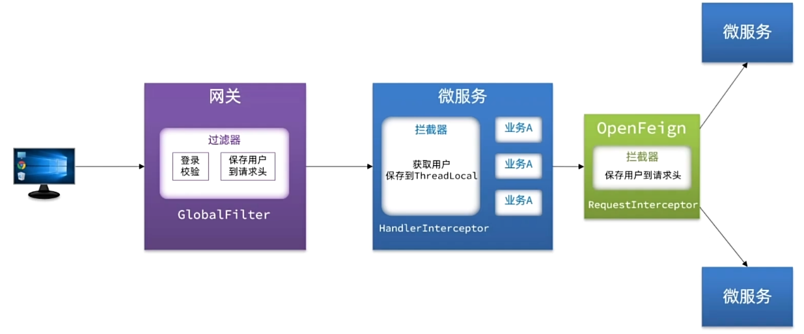

# 4. 配置

使用单独的配置管理微服务组件来完成网关配置和微服务配置。

配置管理服务可以实现配置热更新，即配置更新之后无需重启服务即可应用。

nacos除了作为注册中心之外，也可以作为配置管理服务

## 4.1 配置共享

将一些微服务都会用到的配置添加到Nacos中，避免重复配置

1. 在Nacos控制后台中创建要共享的配置

在微服务中拉取共享配置

1. 引入依赖

   spring-cloud-starter-alibaba-nacos-config

   spring-cloud-starter-bootstrap

2. 定义bootstrap.yaml配置文件

   引入共享配置之后，SpringCloud启动时会先拉取Nacos配置，再加载application.yml配置。所以需要将Nacos地址配置到一个新的配置文件bootstrap.yml中

   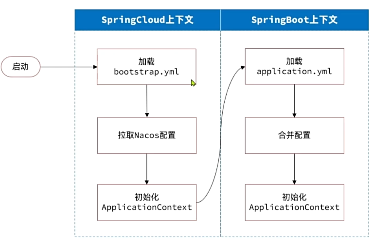

   ```yaml
   spring:
     application:
       name: xx-service
     profiles:
       active: dev
     cloud:
       nacos:
         config: # 配置要加载的共享配置文件
           server-addr: nacos:8848
           file-extension: yaml
           group: prod
           namespace: prod
           dataId: custom-data-id
   ```

   dataId就是nacos中存储的配置文件的具体文件名

   不显示指定dataId时，会按照以下规则寻找配置文件：在group内寻找，dataId为xx-service的文件（application-name），dataId为xx-service.yaml的文件，dataId为xx-service-prod.yaml的文件，直到找到不为空的配置文件

3. 自定义application.yaml文件

   在这里配置微服务独有的配置 和 共享配置中用到的变量

## 4.2 配置热更新

修改配置文件中配置时，微服务无需重启即可直接生效

1. 在nacos中创建一个微服务对应的配置文件

   文件名为：`[spring.application.name-spring.active.profile].[file-extension]`

   其中前半部分是该配置文件要控制的微服务名（必选）- 微服务选用的配置环境（dev/local，可选），后半部分是配置文件后缀（yaml）

   ```yaml
   a:
     b:
       c: 10
   ```

2. 在微服务代码中读取配置属性

   ```java
   @Data
   @Component
   @ConfigurationProperties(prefix = "a.b")
   public class TestProperties {
       private int c;
   }
   ```

   这样在nacos的配置文件中修改c的值时，就会热更新到微服务的代码中

## 4.3 动态路由

动态配置路由信息

将路由信息配置在Nacos配置中心中，然后在网关微服务中监听路由配置文件的变化，发生改变就去更新路由表

1. 在Nacos配置中心中创建路由信息配置文件

   由于要自己解析，所以推荐使用json格式

2. 在网关微服务中监听路由配置文件

   使用ConfigService对象的AddListener方法监听配置文件的改变

3. 更新路由表

   解析配置文件，并利用RouteDefinitionWriter删除旧路由表，并写入新路由表

# 5. 服务保护

微服务运行中可能会出现很多问题，比如雪崩，即调用链路中的某个服务故障，引起整个链路中的所有微服务都不可用

为了防止雪崩问题，有以下解决思路：

- 服务提供者方面：

  让提供服务的微服务尽可能不发生故障

  比如请求限流

- 服务调用者方面：

  在某个微服务发生故障之后，让调用该服务的调用者都停止调用该微服务

  比如线程隔离和服务熔断

常用的服务保护组件有Sentinel，它集成在Spring Cloud Alibaba中

## 5.0 Sentinel

Sentinel可以直接通过可视化控制台配置服务保护规则

**安装和整合**

1. 下载Sentinel jar包并运行

2. 在微服务中引入sentinel依赖

3. 在微服务中配置Sentinel控制台

   ```yaml
   spring:
     cloud:
       sentinel:
         transport:
           dashboard:  localhost:8090 # 启动Sentinel时设置的端口号
         http-method-specify: true # 开启请求方式前缀
   ```

在浏览器中打开Sentinel对应的链接即可进行监控和配置

**簇点链路**

簇点链路是单机调用链路。是指一次请求进入服务后经过的所有资源链。

默认情况下Sentinel会监控Endpoint，即http接口，即Controller中定义的函数 = 不同的访问路径 = 一个资源

资源名默认是接口的访问路径，但是在RESTFUL风格下同个Controller中多个请求路径相同，因此需要在配置中打开请求方式前缀将请求方式也拼接在资源名中来进行区分

## 5.1 请求限流

使用限流器限制访问微服务的请求并发量，避免服务因流量激增出现故障


被限制访问的请求会返回429错误码

**Sentinel配置**

在对应资源添加流控规则，阈值类型为QPS

## 5.2 线程隔离

线程隔离也叫舱壁模式，模拟船舱隔板的防水原理，在船舱之间加多个隔板，这样即时某个船舱进水也不会蔓延到所有船舱


线程隔离就是限定每个业务能使用的线程数量，从而将故障业务隔离，避免故障扩散

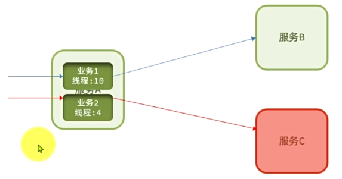

比如服务A有两个业务，分别需要调用服务B和服务C。如果服务C宕机，那么对于业务2的请求就会在访问服务C之后等待，在占满分配给业务2的线程之后，对于新来的业务2请求就不会分配新的线程进行处理而是直接让请求失败，从而避免让业务1也没法执行

**Sentinel配置**

在对应资源添加流控规则，阈值类型为并发线程数

## 5.3 服务熔断

由断路器统计请求的异常比例或慢调用比例，如果超出阈值则直接熔断该业务。

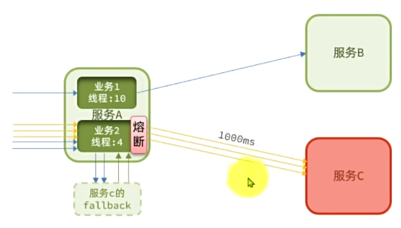

熔断业务期间，会拦截所有该接口的请求，这些请求都会快速失败，走fallback逻辑，而不是再去向服务C发起请求

断路器实现熔断的过程为：

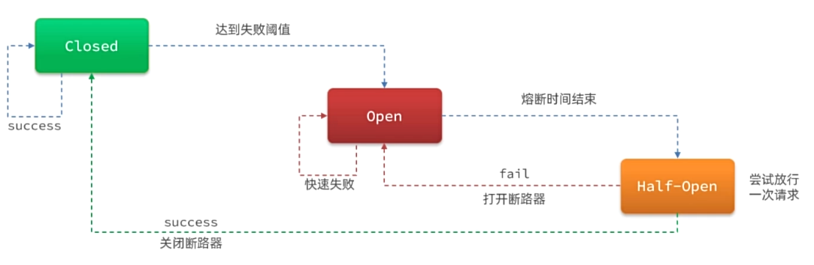

1. 断路器正常情况下为closed状态，即放行请求

2. 如果异常比例或慢调用比例达到阈值，则断路器变为Open状态，即开启断路器

   此时处于熔断状态，所有请求都会快速失败

   熔断状态是一个临时状态，保持一定时间后就会自动切换为别的状态

3. 在熔断时间（可配置）结束后，断路器会变为Half-Open状态，它会尝试放行一次请求

   如果这次请求发生异常，则进入Open状态；如果这次请求正常，则进入Closed状态

**Fallback**

在对应请求失败时设置相应的fallback逻辑，给用户更好的体验。由于服务A请求服务C用的是远程调用，因此实际上是对远程调用添加流量控制

远程调用是feign请求，对feign请求失败设置fallback需要先将feign请求加入簇点资源

```yaml
feign:
  sentinel:
    enabled: true
```

使用FallbackFactory给对应请求添加fallback逻辑

**Sentinel配置服务熔断**

在对应资源点添加熔断规则

# 6. 分布式事务

在单体项目中，一个业务在一个service函数中完成，可以很方便的做事务管理。

但是在微服务中，一个业务可能需要多个微服务合作完成，每个微服务完成的部分都是一个单独的事务，此时就需要多个事务同时成功或失败，这就是分布式事务。其中每个服务的事务就是一个分支事务，整个业务称为全局事务。

基本的解决思路是引入一个第三视角的事务协调者，让它监督整个全局事务

Seata是阿里巴巴开源的分布式事务解决方案

## 6.1 Seata

### 6.1.1 Seata架构

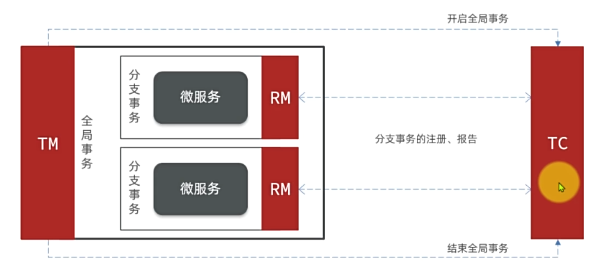

- TC：Transaction Coordinator，事务协调者

  维护全局事务和所有分支事务的状态，决定全局事务最终是提交还是回滚

- TM：Transaction Manager，事务管理器

  定义全局事务范围，负责开始和结束全局事务

  全局事务的范围实际上就是全局事务的入口函数，在入口函数中就完成了对其他事务的调用。所以指定入口函数就确定了全局事务范围

- RM：Resource Manager，资源管理器

  管理分支事务，向TC注册分支事务和报告分支事务状态

执行流程大致为：

1. TM开启全局事务，并通知TC全局事务已开启
2. 执行分支事务，每个分支事务的RM都会向TC注册并报告自己分支事务的状态
3. 全局事务结束后，TM通知TC全局事务结束，TC决定是提交还是回滚事务

### 6.1.2 部署Seata

**部署TC服务**

TC本身也是一个微服务

1. 准备数据库表

   Seata执行过程中需要存储分支事务、全局事务信息。考虑到持久化的需要一般选择基于数据库存储

2. 准备配置文件

   准备Seata运行时需要的配置，比如TC控制台的端口

3. 使用docker部署TC，并将上面的配置文件放入docker中

**微服务集成Seata**

1. 在项目中引入Seata依赖

2. 在application.yaml中配置Seata

   由于TC已经配置进了nacos，所以使用nacos找TC服务

   先通过nacos中的命名空间、组和服务名定位到seata服务，再通过事务组名称关联seata中对应的TC集群

   ```yaml
   seata:
     registry:
       type: nacos
       nacos:
         server-addr: # nacos的地址
         namespace: 
         group:
         application: # seata服务的命名空间、组名和服务名称
         username: 
         password: # nacos的用户名密码
     tx-service-group: test # 事务组名称，当前微服务所在的事务组
     service:
       vgroup-mapping: # 事务组关联的tc集群的名称
         test: "default"
   ```

 ### 6.1.3 XA模式

解决分布式事务的一种规范，几乎所有主流关系型数据库都对XA规范提供了支持，Seata的XA模式如下

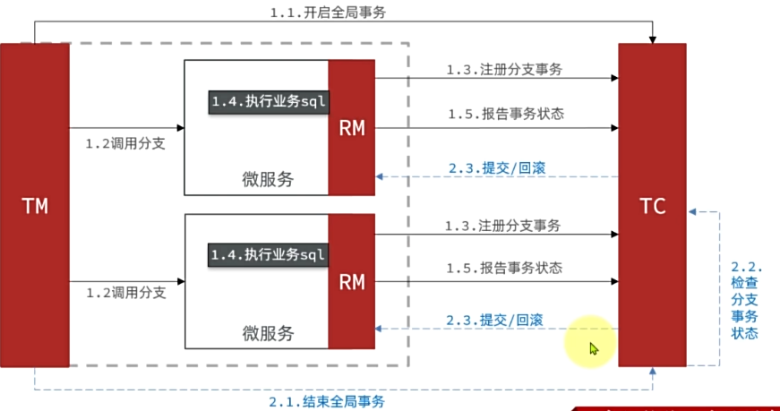

1. 请求到来之后，TM通知TC开启全局事务

2. 全局事务执行中调用其他微服务，开启分支事务

   分支事务执行前，RM会向TC注册

   分支事务执行完成后，RM会向TC报告事务状态，但该分支事务不能提交，而是要等待，由于事务没提交所以对于数据库操作时上的锁也不会释放

3. 所有事务执行完之后（即入口函数执行完），TM通知TC结束全局事务

   此时TC检查所有分支事务的状态，如果全都完成，则通知让所有分支事务都提交，否则都回滚

由于分支业务执行完之后会等待全局事务结束，因此导致资源被锁定周期较长

**开启方式**

1. 修改所有参与事务的微服务的配置文件，开启XA模式

   ```yaml
   seata:
     data-source-proxy-mode: XA
   ```

2. 给全局事务的入口方法添加@GlobalTransactional注解

   全局事务的入口方法就是全局事务的范围，TM通过这个方法的进入和执行确定全局事务的开始和结束

### 6.1.4 AT模式

AT模式弥补了XA模型中需要等待而不能提交，导致资源锁定周期过长的缺陷 

XA模式会在事务执行之前先保存undo log，然后在事务执行结束之后直接提交。

如果全局事务结束后发现有事务执行失败，则通过undo log进行数据还原；如果事务全部执行成功，则删除undo log。

这样的问题是，在分支事务提交后全局事务未结束之前会出现短暂的数据不一致情况。所以AT模式是最终一致

**开启方式**

1. 在每个分支事务的微服务的数据库中添加一个undo_log表

2. 修改配置文件，将事务模式改为AT模式

   这个配置项不加的话默认是AT模式

   ```yaml
   seata:
     data-source-proxy-mode: AT
   ```


# 7. Elasticsearch

Elasticsearch是基于Lucene开发的一个搜索引擎，Lucene是一个java语言的搜索引擎类库（就是一个实现搜索引擎功能的API工具包）

elasticsearch和kibana、Logstash、Beats一起被称为ELK，是一整套技术栈，用于日志数据分析、实时监控等。其中Logstash和Beats用于数据抓取，Elasticsearch用于存储、计算、搜索数据，Kibana用于数据可视化

**基本概念**

- 文档 Document：类似于行

  es会用json来存储数据，每一条数据对应一条json，称为文档

- 索引（库）index：类似于表

  索引是相同类型的文档的集合

- 映射 mapping：类似于约束

  索引对索引中文档字段的约束信息，满足某种映射才能加入某个索引表中

- DSL：类似于SQL

  es的搜索语句，json格式

**安装**

elasticsearch和kibana可以直接用docker安装。

es为了兼容更多语言，暴露了restful接口，也就是直接发送http请求就能访问。因此在浏览器访问9200端口（默认）即可验证是否安装成功

kibana为es提供了可视化操作界面，可以使用kibana的dev tools向es发送http请求，安装时需要指定es服务的ip地址。默认通过5601端口可以访问

## 7.1 ES底层

### 7.1.1 倒排索引

 传统数据库如MySQL采用正向索引，对于不符合索引条件的字段的搜索（比如模糊查询）就只能遍历整张表进行检索，es采用倒排索引能够增加检索效率。

倒排索引有两个概念

- 文档（document）：每条数据就是一个文档

  同样会为每条数据的id建立索引

  es中的数据会以文档为单位序列化为json格式后存在es中，即一条数据对应一条json

- 词条（term）：文档中内容根据语义分成的词语

在倒排索引中会建立一个词条和文档id的关系表，用来快速根据关键词检索

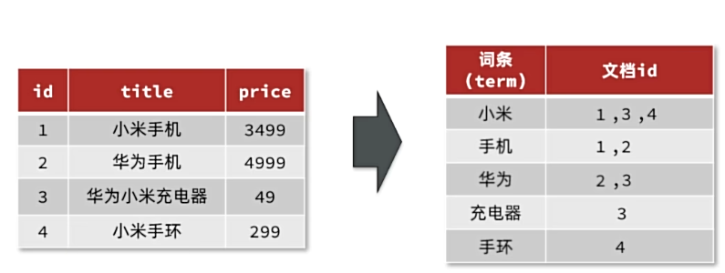

关键词搜索时流程如下：

1. 将用户的检索关键词进行分词操作

   比如：华为手机

2. 用得到的词条在词条列表中查询文档id

   分成：华为（2，3）、手机（1，2）

3. 根据文档id查询文档

   由于对id也建立了索引，所以这一步速度和普通数据库一样快

4. 将文档存入结果集

### 7.1.2 IK分词器

倒排索引效率的关键之一就是分词的准确性。IK分词器是专门的中文分词器，采用了正向迭代最细粒度切分算法

使用分词器只需要将下载好的分词器文件夹放入es的插件目录下`es-plugins`即可，如果是docker安装的es就需要将这个目录挂载为数据卷

可以在Kibana的DevTools中测试IK分词器

```
POST /_analyze
{
	"analyzer": "standard",
	"text": "用来分词的测试句子"
}
```

会得到json格式的分词结果，其中analyzer可以选择standard、ik_smart、ik_max_word

**分词原理**

IK分词器底层会维护一个常用词库。

对于一个需要分词的句子，它会枚举所有可能的词，然后去词库中检索这个组合成的词是否在词库中，如果在就分为一个词语。

**词库扩展**

IK分词器允许通过配置来扩展增加自定义词库

可以在`ik/config/IKAnalyzer.cfg.xml`配置文件中添加自定义词库文件的位置

自定义词库文件后缀为.dic

## 7.2 ES使用

ES接受RESTFUL请求，通过向ES发送PUT/DELETE/POST/GET请求来执行增删改查操作

### 7.2.1 操作索引库

**mapping属性**

索引库可以理解为数据库中的表，mapping映射则是对表中字段的描述

常见的mapping属性有以下几个：

- type：字段数据类型
  - 字符串：text（可分词的文本）、keyword（无需分词的精确值，如国家名、品牌名）
  - 数值：long、integer、short、byte、double、float
  - 布尔：boolean
  - 日期：data
  - 对象：object
- index：是否为该字段创建索引，默认为true
- analyzer：使用哪种分词器，只有text类型字段才有这个属性
- properties：该字段中包含的子字段（可以理解为是对象的属性）

**创建索引库**

```json
PUT /索引库名称 // 名称前需要加/
{
    "mappings": { // 指定索引库的映射
        "properties": { // 声明索引库中的子字段
            "字段名":{
                "type": "text",
                "analyzer": "ik_smart"
            },
            "字段名2":{
                "type": "keyword",
                "index": "false"
            },
            // ......
        }
    }
}
```

**查询索引库**

```json
GET /索引库名称
```

**删除索引库**

```json
DELETE /索引库名称
```

**修改数据库**

ES的索引库不支持修改（不允许修改索引库的属性），但是可以添加新的字段

```json
PUT /索引库名/_mapping
{
    "properties": {
        "新字段名": { // 这里字段名不能写已有的，也就是不能修改现有字段
            
        }
    }
}
```

### 7.2.2 操作文档

**文档CRUD**

- 添加

```json
POST /索引库名/_doc/文档id  // _doc表示此次新增的是文档
{
    "字段1": "值1"，
    "字段2": "值2"
}
```

- 查询

```json
GET /索引库名/_doc/文档id
```

- 删除

```json
DELETE /索引库名/_doc/文档id
```

- 修改

  全量修改：直接删除旧文档并添加新文档

  如果PUT时文档id不存在，则会直接新增文档
  
  ```json
  PUT /索引库名/_doc/文档id
  {
      "字段1": "值1"，
      "字段2": "值2"
  }
  ```
  
  增量修改：修改指定字段名
  
  ```json
  POST /索引库名/_update/文档id
  {
      "doc": {
          "要修改的字段名": "新的值"
      }
  }
  ```

**批量处理**

在一次请求中携带多次文档操作，也就是批量处理

批量处理的请求为POST，后面每一行json表示一条请求

```json
POST /_bulk
```

- 新增

  新增操作需要两行json，第一行表示新增操作，第二行是文档的内容

  ```json
  {"index" : {"_index" : "索引库名", "_id" : "1"}}
  { "字段1" ： "值1", "字段2" : "值2"}
  ```

- 删除

  ```json
  {"delete" : {"_index" : "索引库名", "_id" : "2"}}
  ```

- 修改

  修改操作也需要两行json，并且是增量修改

  ```json
  {"update" : {"_id" : "1", "_index" : "test"}}
  {"doc" : {"field2" : "value2"}}
  ```


## 7.3 JavaRestClient

JavaRestClient是es提供的java客户端

**客户端初始化**

1. 引入es的slasticsearch-rest-high-level-client依赖

2. SpringBoot有一个默认的es版本，如果和使用的es版本不同，需要手动指定版本覆盖默认的es版本

3. 初始化RestHighLevelClient

   ```java
   RestHighLevelClient client = new RestHighLevelClient(RestClient.builder(
   	HttpHost.create("http://127.0.0.1:9200")
   ));
   ```

   使用完之后关闭客户端

   ```java
   client.close();
   ```

### 7.3.1 索引库操作

**创建索引库**

```java
void createIndex() {
    // 1. 创建Request对象
    CreateIndexRequest request = new CreateIndexRequest("索引库名称");
    // 2. 给request对象中添加请求参数，即请求要发的json操作
    request.source("json操作", XContentType.JSON);
    // 3. 发起请求
    client.indices().create(request, RequestOptions.DEFAULT);
}
```

client.indices会返回一个包含所有索引库操作的对象

**删除索引库**

```java
void deleteIndex() {
    // 1. 创建Request对象
    DeleteIndexRequest request = new DeleteIndexRequest("索引库名称");
    // 2. 发起请求
    client.indices().delete(request, RequestOptions.DEFAULT);
}
```

**查询索引库**

```java
void deleteIndex() {
    // 1. 创建Request对象
    GetIndexRequest request = new GetIndexRequest("索引库名称");
    // 2. 发起请求
    client.indices().get(request, RequestOptions.DEFAULT);
}
```

### 7.3.2 文档操作

**新增文档**

```java
// 1.创建request对象
IndexRequest request = new IndexRequest("索引库名称").id("文档id");
// 2.添加请求参数
request.source("json操作", XCoontentType.JSON);
// 3.发起请求
client.index(request, RequestOptions.DEFAULT);
```

操作文档就不需要调用indices方法获取索引库操作对象

要插入的文档数据一般应该从数据库中查出，再插入es中方便查询。

**删除文档**

```java
// 1.创建request对象
DeleteRequest request = new DeleteRequest("索引库名称").id("文档id");
// 2.发起请求
client.delete(request, RequestOptions.DEFAULT);
```

**查询文档**

查询文档之后还需要接收结果

```java
// 1.创建request对象
GetRequest request = new GetRequest("索引库名称").id("文档id");
// 2.发起请求
GetResponse response = client.get(request, RequestOptions.DEFAULT);
// 3. 解析结果
String json = response.getSourceAsString();
```

**修改文档**

全量修改可以直接用新增文档操作完成

局部更新

```java
// 1.创建request对象
UpdateRequest request = new UpdateRequest("索引库名称", "文档id");
// 2. 准备参数，每两个参数为一对。也可以传入一个Map
request.doc(
	"字段1", "值1",
    "字段2", "值2"
);
// 3.发起请求
client.update(request, RequestOptions.DEFAULT);
```

**批量请求**

RestClient提供了一个BulkRequest，里面有一个add方法，可以添加DeleteRequest、IndexRequest和UpdateRequest。把多个请求打包到一起发出就实现批量请求

## 7.4 DSL查询

DSL查询可以分为两大类

- 叶子查询 Leaf query clauses

  在特定的字段里查询特定值

- 复合查询 Compound query clauses

  以逻辑方式组合多个叶子查询或更改叶子查询

### 7.4.1 基础语法

**rest请求**

```json
GET /索引库名称/_search
{
    "query": {
        "查询类型": {
            "查询条件": "条件值"
        }
    }
}
```

查询得到的结果格式

```json
{
    "took": 4, // 查询操作花费的时间
    "time_out" : false, // 本次查询是否超时
    "_shards" : {}, // 分片信息，在集群情况下有用，表明结果从哪个节点中查到
    "hits" : { // 本次查询命中的数据
        "total" : {}, // 本次查询到的数据总条数
        "max_score" : 1.0, // 本次查询结果的相关度
        "hits" : {} // 查询到的具体文档信息
    }
}
```

**JavaRestClient**

发送请求

```java
// 1. 准备Request对象
SearchRequest request = new SearchRequest("indexName");
// 2. 构建DSL参数，先通过request.source()获取对象，该对象中提供了DSL的各种查询类型方法
request.source().query(QueryBuilders.matchAllQuery());
// 3. 发送请求，得到相应结果
SearchResponse response = client.search(request, RequestOptions.DEFAULT);
```

解析响应结果

通过JavaRestClient发送请求之后得到的结果和上面一样

```java
// 获取查询到的数据，即hits字段
SearchHits searchHits = response.getHits();
// 获取查询的总条数
long total = searchHits = searchHits.getTotalHits().value;
// 获取查询的结果数组
SearchHits[] hits = searchHits.getHits(); 
for (SearchHit hit : hits) {
    // 得到查询的结果的source，（json格式）
    String json = hit.getSourceAsString();
}
```


### 7.4.2 叶子查询

叶子查询根据查询类型可以分为

- 全文检索查询：利用分词器对用户输入内容分词，然后去词条列表中匹配

  - match_query
  - multi_match_query

- 精确查询：对用户输入直接精确匹配

  一般用于keyword、数值、日期、布尔等类型的查找

  - ids：根据id查询
  - range：在某个范围内查询
  - term：精确查询

- 地理查询：搜索地理位置

  - geo_distance
  - geo_bounding_box

**全文检索**

默认情况下结果根据相关度分数进行排序

- match_query：在单个字段中，对用户的输入内容进行分词并查询

```json
GET /indexName/_search
{
    "query": {
        "match": {
            "字段名": "要查询的内容"
        }
    }
}
```

```java
// JavaRestClient语法
QueryBuilders.matchQuery("字段名", "要查询的内容");
```

- multi_match：同时在多个字段中，对用户输入分词并查询

```json
GET /indexName/_search
{
    "query": {
        "multi_match": {
            "query": "要查询的内容",
            "fields": ["字段1", "字段2"]
        }
    }
}
```

```java
// JavaRestClient语法
QueryBuilders.multiMatchQuery("要查询的内容", "字段1", "字段2");
```

**精确查询**

- term查询

```json
GET /indexName/_search
{
    "query": {
        "term": {
            "要查询的字段": {
                "value": "要查询的关键词"
            }
        }
    }
}
```

```java
// JavaRestClient语法
QueryBuilders.termQuery("要查询的字段", "要查询的关键词");
```

- range查询

```json
GET /indexName/_search
{
    "query": {
        "range": {
            "要查询的字段": {
                "gte": 10, // 大于10
                "lte": 20 // 小于20
            }
        }
    }
}
```

```java
// JavaRestClient语法
QueryBuilders.rangeQuery("要查询的字段").gte(100).lte(150);
```

- id查询

```json
GET /indexName/_search
{
    "query": {
        "ids": {
			"values": ["id1", "id2"]
        }
    }
}
```

### 7.4.3 复合查询

复合查询分为两类

- 基于逻辑运算组合叶子查询，实现组合条件查询 查询条件为bool

  子查询组合方式有

  - must：相当于“与”，必须匹配每个子查询
  - should：相当于“或”，匹配一个子查询即可
  - must_not：相当于“非”，必须不匹配子查询。同时该子查询不参与算分
  - filter：相当于“与”，但是该条件不参与相似度算分

- 修改查询时的文档相关性算分，从而改变文档排名

**组合查询**

```json
GET /索引表名/_search
{
    "query": {
        "bool": {
            "must": [
                {} // 写叶子查询
            ],
            "should": [
                {},{} // 写叶子查询
            ]，
            
        }
    }
}
```

在JavaRestClient中，就是先创建一个boolQuery对象，再往里添加叶子查询

```java
// JavaRestClient语法
BoolQueryBuilder boolQuery = QueryBuilders.boolQuery();
// 添加must条件
boolQuery.must(QueryBuilders.termQuery("brand", "华为"));
```


### 7.4.4 排序

es默认根据相关度算分排序

可以指定字段排序，可排序的字段类型有：keyword、数值、地理坐标、日期等

```json
GET /索引表名/_search
{
    "query": {
        "match_all": {}
    },
    "sort": [
        {
            "要排序的字段": "排序方式" // 排序方式有asc和desc
        },
        {
            "要排序的字段": "排序方式"
        }
    ]
}
```

```java
// JavaRestClient语法
request.source().sort("要排序的字段", 排序方式); // 排序方式有SortOrder.ASC和SortOrder.DESC
```

### 7.4.5 分页

es默认情况只返回10条数据

可以通过修改from和size参数来控制要返回的分页结果

```json
GET /索引表名/_search
{
    "query": {
        "match_all": {}
    },
    "from": 0, // 从第几个文档开始
    "size": 10, // 结果返回几个文档
    "sort": [
        {
            "要排序的字段": "排序方式" // 排序方式有asc和desc
        },
    ]
}
```

```java
// JavaRestClient语法
request.source.from(0).to(10);
```

### 7.4.6 高亮显示

对搜索结果中的搜索关键字加上高亮显示

高亮的思路有两步：

1. 在搜索结果中给搜索关键字加上一个标签
2. 在前端样式中给这个标签加一个css样式

在es中，在分词之后已经保存了分词对应位置，所以在es中可以直接给搜索关键字加上标签

```json
GET /索引表名/_search
{
    "query": {
        "match": {
            "FIELD": "TEXT"
        }
    },
    "highlight": {
        "fields": { // 指定所有要高亮的字段
            "FIELD": { 
                "pre_tags": "<em>", // 这个不x 
                "post_tags": "</em>"
            },
            "FIELD": {
                
            }
        }
    }
}
```

在返回的搜索结果中，source中的内容不会改变，但是会额外返回一个highlight，这里面就是查询结果给搜索关键词加上标签的结果

```java
// JavaRestClient语法
request.source().highlighter(
	SearchSourceBuilder.highlight()
    .field("要高亮的字段")
    .preTags("<em>")
    .postTags("</em>")
);
// ... 发送请求并获取结果
// 解析高亮结果
Map<String, HighlightField> hfs = hit.getHighlightFields();
if (CollUtils.isNotEmpty(hfs)) {
    HighlightsField hf = hfs.get("高亮的字段名");
}
```

## 7.5 数据聚合

聚合（aggregations）可以实现对文档数据的统计、分析、运算。

参与聚合的字段必须是Keyword、数值、日期、布尔类型的字段

有三类常见的聚合：

- 桶（Bucket）聚合：用来对文档做分组
  - TermAggregation：按照文档字段值分组
  - DateHistogram：按照日期阶梯分组
- 度量（Metric）聚合：用于计算一些值
  - Avg：求平均值
  - Max：求最大值
  - Min：求最小值
  - Stats：同时求max、min、avg、sum等
- 管道（pipeline）聚合：以其他聚合结果为基础的聚合

### 7.5.1 DSL聚合

