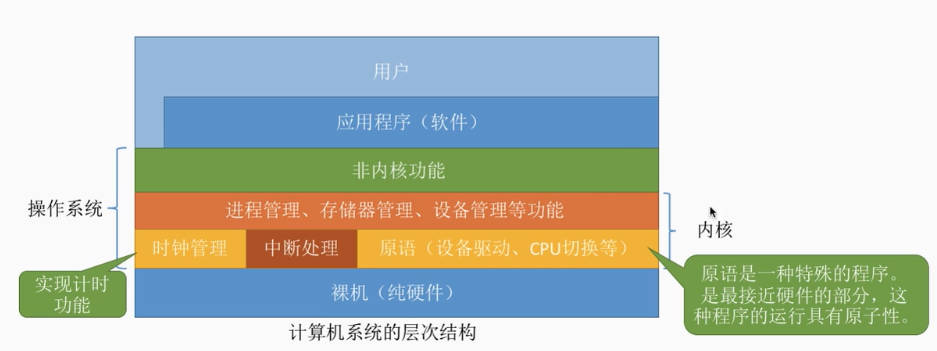
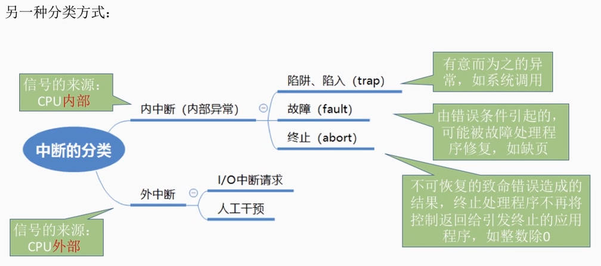
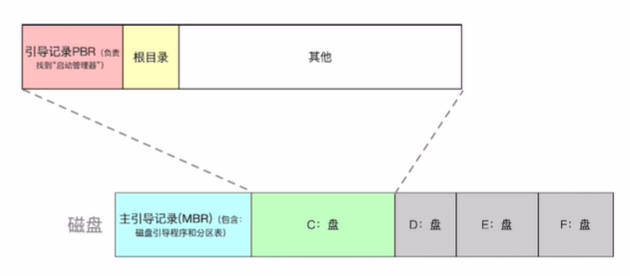
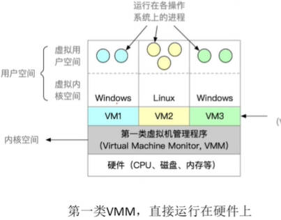
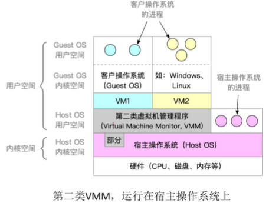

# 操作系统

## 基本概念(定义)、功能和目标

### 定义

        操作系统(Operating System ,OS)是控制和管理整个计算机系统的硬件和软件资源
        并合理地组织调度计算机的工作和资源的分配
        以提供给用户和其他软件方便的接口和环境
        它是计算机系统中最基本的系统软件

- 从中间往两边看——负责管理协调 **硬件和软件**

- 往上看——为上层的应用程序、用户提供简单易用的服务

- 往下看——操作系统是系统软件，而不是硬件

### 功能

1. 作为系统资源的管理者

   - 处理机管理：CPU资源的分配
   - 存储器管理：把相关数据放入内存
   - 文件管理：找到程序的存放位置
   - 设备管理：各种外设的管理

2. 作为用户和计算机硬件之间的接口（向上层提供方便易用的服务）

    封装思想

    **提供命令接口**：允许用户直接使用
    
    - 联机命令接口(交互式命令接口)

        用户说一句，操作系统做一句

        比如命令行窗口

    - 脱机命令接口(批处理命令接口)

        用户说一堆，操作系统做一堆

        比如windows中的.bat文件

    **提供程序接口**：允许用户通过程序间接使用

    在程序中进行系统调用来使用程序接口，是给软件/程序员使用的，程序员只能通过代码间接调用

    - 由一组系统调用组成，程序接口===系统调用===广义指令

        比如对.dll文件的使用

    **提供GUI(图形用户界面)**：现代操作系统中最流行的图形用户接口
    - 如windows、安卓、ios、macOS

3. 作为最接近硬件的层次

    实现对硬件机器的拓展

    没有任何软件支持的计算机称为裸机。通常把覆盖了软件的机器称为扩充机，又称虚拟机

***
***

## 操作系统的特征

并发和共享互为存在条件

并发和共享是操作系统的两个最基本的特征

**并发：**
    
- 指两个或多个事件在同一时间间隔内发生。
这些事件宏观上是同时发生的，但微观上是交替发生的

    区别与并行：指两个或多个事件在同一时刻同时发生

- 操作系统的并发性 ： 指计算机系统中同时存在着多个运行着的程序

    CPU的一个核同一时刻只能执行一个程序
    
    操作系统和程序并发是一起诞生的
***

**共享：**

共享即资源共享，是指系统中的资源可供内存中多个并发执行的进程共同使用

- 互斥共享方式

    一个时间段内只允许一个进程访问该资源

    比如麦克风，接电话的时候微信电话就没声

- 同时共享方式

    一个时间段内允许多个进程“同时”对他们进行访问

        同 时 ： 往往是宏观上的，
        在微观上这些进程可能是交替地对该资源进行访问地(分时共享)
        比如微信和QQ同时发送文件

        也有可能微观也是同时的，
        比如打游戏的时候听歌，扬声器同时播放两个声音

并发性和共享性互为存在条件

***

**虚拟：**

指把一个物理上的实体变为若干个逻辑上的对应物。物理实体(前者)是实际存在的，而逻辑上对应物(后者)是用户感受到的

- 空分复用技术——虚拟内存

- 时分复用技术——虚拟处理器(并发性)

***

**异步：**

- 指，在多道程序环境下，允许多个程序并发执行，但**由于资源有限**，进程的执行不是一贯到底的，而是走走停停，以不可预知的速度向前推进，这就是进程的异步性。
- 只有系统拥有并发性，才有可能导致异步性
***
***
## 操作系统的发展与分类

1. 手工操作阶段：

    - 没有操作系统，程序员用纸带打孔代表1和0，然后放入计算机中，计算机返回另一个打好孔的纸带

    缺点：用户独占全机(必须执行完上一个用户的程序才能执行下一个用户的)，人机速度矛盾导致资源利用率极低

2. 批处理阶段——单道批处理系统

    - 把程序员写好的纸带放入磁带中，再放入计算机中处理，处理完再输入到磁带中

    - 引入脱机输入/输出技术(用磁带完成)，并由监督程序(操作系统的雏形)负责控制作业的输入、输出

    优点：缓解了一定程度的人机速度矛盾，资源利用率有所提升

    缺点：内存中仅能有一道程序运行，只有该程序运行结束之后才能调入下一道程序。CPU有大量的时间是在空闲等待I/O完成。资源利用率依然很低

3. 批处理阶段——多道批处理系统

    - 每次往内存中输入多道程序
    - 操作系统正式诞生，并引入了中断技术，可以并发执行

    优点：多道程序并发执行，共享计算机资源。资源利用率大幅提升

    缺点：用户响应时间长，没有人机交互功能(用户提交自己的作业之后就只能等待计算机处理完成，中间不能控制自己的作业执行)

4. 分时操作系统

    - 计算机以时间片为单位轮流为各个用户/作业服务，各个用户可通过终端与计算机进行交互

    优点：解决了人机交互问题

    缺点：不能优先处理一些紧急任务，对各个作业都是完全公平的

5. 实时操作系统

    优点：能够优先响应一些紧急任务，某些紧急任务不需时间片排队

    - 硬实时系统：必须在绝对严格的规定时间内完成处理
    - 软实时系统：能接受偶尔违反时间规定

***
***

## 运行机制和体系结构

### 运行机制：指令、处理器状态、程序
**指令**：CPU能识别、执行的最基本的命令

一条高级语言的代码翻译过来可能会对应多条指令
- 特权指令：不允许用户程序使用

    如：内存清零指令

- 非特权指令：允许任何程序使用

    如：普通的加减乘除运算指令
***

**处理器状态**：用于判断当前是否可以执行特权指令

用 程序状态寄存器(PSW) 中的某标志位来标识当前处理器处于什么状态。如0为用户态，1为核心态

- 用户态(目态)：此时CPU只能执行非特权指令
- 核心态(管态)：特权指令、非特权指令都可执行

        用户态——>核心态：只能通过中断实现

        核心态——>用户态：通过执行一个特权指令
        将程序状态字(PSW)的标志位设置为“用户态”
***
**两种程序**
- 内核程序：是系统的管理者，既可以执行特权指令，也可以执行非特权指令，运行在核心态
- 应用程序：普通应用程序只能执行非特权指令，运行在用户态

内核是计算机上配置的底层软件，是操作系统最基本、最核心的部分

实现操作系统内核功能的那些程序就是内核程序

**操作系统的内核**：

- 时钟管理：实现计时功能
- 中断处理：负责实现中断机制
- 原语：是一种特殊的程序，处于操作系统最底层，是最接近硬件的部分，运行时间较短，调用频繁
- 原子性：一旦执行就必须一气呵成执行完，不可中断

### 体系结构

根据内核包含的功能对操作系统分类的一种依据

不同操作系统对内核功能的划分是不同的

**大内核**

内核包含进程管理、存储器管理、设备管理等功能

将操作系统的主要功能模块都作为系统内核，运行在核心态

- 优点：高性能

- 缺点：内核代码庞大，结构混乱，难以维护

**微内核：**

只把最基本的功能保留在内核

- 优点：内核功能少，结构清晰，方便维护
- 缺点：需要频繁地在核心态和用户态之间切换，性能低

**分层结构：**

内核分多层，每层只能调用相邻的更低一层的接口

最底层是硬件，最高层是用户接口

- 优点：便于调试和验证，自底向上逐层验证；便于维护和扩充，因为层间接口固定，所以可以很方便扩充一层

- 缺点：只能调用相邻的低层，但是难以合理定义各层的边界；效率低，不可跨层调用，只能逐层调用

**模块化：**

将内核划分为功能独立的多个模块，各模块之间相互协作

内核 = 主模块 + 可加载内核模块

主模块只负责核心功能，如进程调度、内存管理；可加载内核模块可以动态加载新模块到内核，比如设备驱动模块

优点：

- 逻辑清晰易于维护，确定模块间的接口之后就可以多模块同时开发

- 支持动态加载新的内核模块，增强适应性

- 任何模块之间可以直接调用其它模块，无需消息传递，效率更高

缺点：

- 模块间的接口定义未必合理、实用

- 模块间相互依赖，难以调试和验证

**外核：**

由内核和外核组成

内核负责进程调度、进程通信等功能，外核负责为用户进程分配未经抽象的硬件资源，且负责保证资源使用安全

未经抽象：是指比如磁盘和内存的物理地址没有映射成逻辑地址，也就是说用户可以直接看到和申请物理空间

优点：

- 外核可以直接给用户进程分配“不虚拟、不抽象”的硬件资源，使用户进程可以更灵活的使用硬件资源

- 减少了虚拟硬件资源的映射层，提升效率

缺点：

- 降低了系统的一致性，有的要虚拟空间，有的直接申请物理空间

- 使系统变得复杂

***
***
## 中断和异常

中断机制是为了实现多道程序并发执行

**本质：** 发生中断就意味着需要操作系统介入，开展管理工作

- 当中断发生时，CPU立即进入核心态

    中断时CPU从用户态进入核心态的唯一途径

- 当中断发生后，当前运行的进程暂停运行，并由操作系统内核对中断进行处理
- 对于不同的中断信号，会进行不同的处理
***
### 内中断(也称异常、例外、陷入)

**信号的来源：** CPU内部，与当前执行的指令有关
- 自愿中断——指令中断

    如：进程通过执行访管指令(又叫陷入指令、trap指令)实现系统调用

- 强迫中断

    - 硬件故障
    
        如：缺页

    - 软件中断

        如：整数除0
***
### 外中断(狭义的中断)

**信号的来源：** CPU外部，与当前执行的指令无关

- 外设请求

    如：I/O操作完成发出的中断信号

- （人工干预）——新视频里没有这条

    如：用户强行终止一个进程

- 时钟中断

    程序的时间片用完后发出时钟中断，换下一个进程使用CPU

***
### 中断的分类

**内中断：**

- 陷阱、陷入(trap)

    由陷入指令引发，应用程序故意引发的

- 故障(fault)

    由错误条件引起，比如缺页故障

- 终止(abort)

    由致命错误引起，直接终止该应用程序，如整数除0、非法使用特权指令

**外中断：**

- I/O中断请求
- 人工干预

***
### 中断机制的基本原理

不同的中断信号需要用不同的中断处理程序来处理。当CPU检测到中断信号后，会根据中断信号的类型去查询中断向量表，以此找到相应的中断程序在内存中的存放位置

### 外中断的处理过程

1. CPU在执行完每条指令之后，都会例行检查当前是否有外部中断信号(比如用户通过键盘输入了一个字符)

2. 如果检测到外部中断信号，则需要保护(存档)被中断进程的CPU环境，如：程序状态字PSW、程序计数器PC、各种通用寄存器

3. 根据中断信号类型转入相应的中断处理程序

4. 恢复原进程的CPU环境并退出中断，返回原进程继续往下执行
***
***
## 系统调用

系统调用是操作系统向上层提供的接口

应用程序通过**系统调用**请求操作系统的服务。

可以通过汇编语言来直接进行系统调用，高级语言会提供库函数来实现对系统调用的封装和调用

系统中的各种共享资源都由操作系统 统一掌管，因此在用户程序中，凡是与资源有关的操作(如存储分配、I/O操作、文件管理等)，都必须通过系统调用的方式向操作系统提出服务请求，由操作系统代为完成

**作用：** 这样可以保证系统的稳定性和安全性，防止用户进行非法操作

系统调用的相关处理需要在核心态下进行
***
**系统调用包括：**

    凡是与资源有关的操作、会直接影响到其他进程的操作，
    一定需要操作系统接入，即需要通过系统调用来实现

- 设备管理

    完成设备的 请求 / 释放 / 启动 等功能

- 文件管理

    完成文件的 读 / 写 / 创建 / 删除 等功能

- 进程控制

    完成进程的 创建 / 撤销 / 阻塞 / 唤醒 等功能

- 进程通信

    完成进程之间的 消息传递 / 信号传递 等功能

- 内存管理

    完成内存的 分配 / 回收 等功能

**与库函数的区别：** 库函数是对系统调用的进一步封装

有些库函数底层封装了系统调用，使得我们可以很方便的使用库函数编程
***
**系统调用背后的过程：**
1. 传递系统调用参数

    比如指明系统调用类型

2. 执行陷入指令(用户态下)

    执行陷入指令之后立即引发一个内中断，从而CPU进入核心态

    陷入指令是唯一一个只能在用户态执行，而不能在核心态执行的指令

3. 执行系统调用的相应处理(核心态下)

4. 返回用户程序

***
***

## 操作系统引导

### 开机过程

1. CPU从ROM（其实就是BIOS）中取指令，执行ROM中的引导程序

2. 将磁盘中的主引导记录MBR读入内存，执行磁盘引导程序，扫描分区表，找到活动分区C盘

3. 从活动分区（又称主分区，即安装了操作系统的分区）读入分区引导记录PBR，执行其中的程序

4. 执行PBR中程序——从根目录下找到完整的操作系统初始化程序（即启动管理器）并执行，完成开机的一系列动作

## 虚拟机

虚拟机：使用虚拟化技术，将一台物理机器虚拟化为多台虚拟机器，每个虚拟机器都可以独立运行一个操作系统

同义术语：虚拟机管理程序、虚拟机监控程序（Virtual Machine Moniter，VMM）

### 直接运行在硬件上

和操作系统没什么本质区别，本来是一个操作系统给各个进程分配系统资源，现在套了一个VMM来给各个操作系统分配资源

只有VMM运行在内核空间，其它操作系统都运行在用户空间，它们想要执行特权指令还要通过VMM

性能更好

### 运行在宿主操作系统上

通过软件实现，比如VMware、VirtualBox

