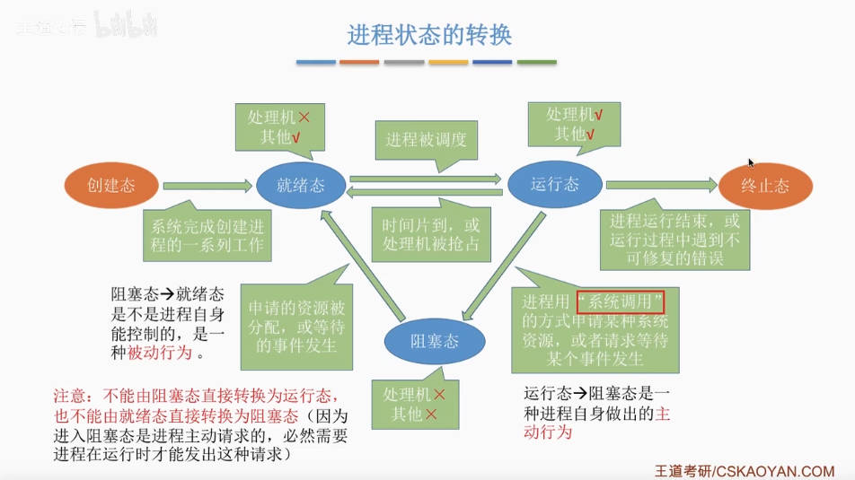
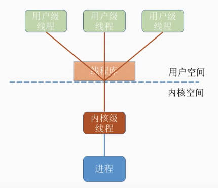
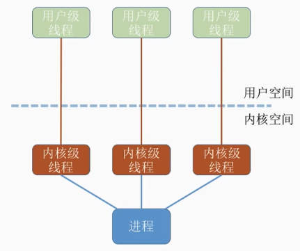
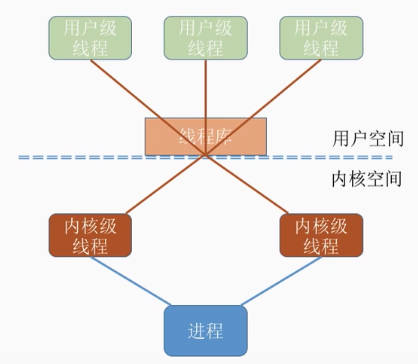
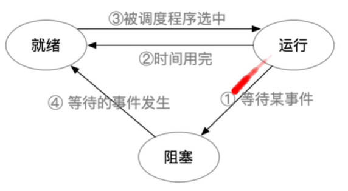

# 进程
# 1 进程介绍

## 1.1 定义

**程序**：就是一段指令序列

**进程实体**：程序运行过程中所需的数据的集合，由以下三部分组成

- 程序段

    存放程序运行所需的指令集合

    程序代码即存放在此

- 数据段

    存放程序运行时使用、产生的运算数据

    如：全局变量、局部变量、宏定义的常量

- PCB

    PCB是进程存在的唯一标志

    用来描述进程的各种信息

    所谓创建进程，实质上是创建进程实体中的PCB，而撤销进程,实质上是撤销进程实体中的PCB

**进程：**

是进程实体的运行过程，是系统进行资源分配的最小单位

每个进程对应一个不重复的唯一的PID

    1、进程是程序的一次执行过程
    2、进程是一个程序及其数据在处理机上顺序执行时所发生的活动
    3、进程是具有独立功能的程序在数据集合上运行的过程，
    它是系统进行资源分配和调度的一个独立单位

进程是进程实体的运行过程，是系统进行资源分配和调度的一个独立单位

**注：** 严格来说，进程实体和进程不一样。进程实体是静态的，进程则是动态的。不过，除非题目专门考察二者区别，否则可以认为进程实体就是进程。

***

**PCB包括的内容**

进程的管理者(操作系统)所需的数据

包括：

- 进程描述信息
  - 进程标识符PID

    进程创建时操作系统为进程分配的一个唯一的、不重复的ID，用于区分不同进程

  - 用户标识符UID

- 进程控制和管理信息
  - 进程当前状态
  - 进程优先级

- 资源分配清单
  - 程序段指针
  - 数据段指针
  - 键盘
  - 鼠标

- 处理机相关信息
  - 各种寄存器值

    进程切换时把进程当前的运行情况记录下来
***
## 1.2 进程组织方式

多个进程(PCB)之间的组织方式

- 链接方式

    按照进程状态将PCB分为多个队列

    操作系统持有指向各个队列的指针
    - 执行指针
    - 就绪队列指针：优先级高的进程放在队头
    - 阻塞队列指针

- 索引方式

    根据进程状态的不同，建立几张索引表

    操作系统持有指向各个索引表的指针
    - 执行指针
    - 就绪表指针
    - 阻塞表指针

***
## 1.3 进程的特征

- 动态性

    进程是程序的一次执行过程，是动态的产生、变化和消亡的

    进程的最基本特征

- 并发性

    内存中有多个进程实体，各进程可并发执行

- 独立性

    进程是能独立运行、独立获得资源、独立接受调度的基本单位

- 异步性

    各进程按各自独立的、不可预知的速度向前推进，可能导致运行结果的不确定性

    操作系统要提供“进程同步机制”来解决异步问题


- 结构性

    每个进程都会配置一个PCB

    结构上看，进程由程序段、数据段、PCB组成
***
***
# 2 进程的状态与转换

## 2.1 三种基本状态

CPU是计算机中最昂贵的部件，为了提高CPU的利用率，需要先将其他进程需要的资源分配到位，才能得到CPU的服务

1. **运行态(Running)：** 

    有CPU也有其他所需资源

    占有CPU并在CPU上运行

2. **就绪态(Ready)：** 

    没有CPU有其他所需资源

    已经具备运行条件，拥有了除了CPU之外所有需要的资源，一旦分配到CPU就可以运行

3. **阻塞态(Waiting/Blocked，又称：等待态)：**

    没有CPU也没有其他所需资源

    因等待某一时间而暂时不能运行，等待除CPU外其他资源的分配(等待I/O操作，打印机的分配)

另外两种状态
- **创建态(New，又称：新建态)：**

    进程正在被创建，操作系统为进程分配资源、初始化PCB

- **终止态(Terminated，又称：结束态)：**

    进程正在从系统中撤销，操作系统会回收进程拥有的资源、撤销PCB

***
## 2.2 进程状态的转换




- 就绪态——>运行态：进程被调度
- 运行态——>就绪态：分配的时间片到了，或者CPU被其他高优先级的进程抢占
- 运行态——>阻塞态：

    这两个状态的转变是进程的主动行为。
    
    等待系统资源分配，或等待某件事发生

- 阻塞态——>就绪态：

    这两个状态的转变是被动行为，进程不能控制的

    资源分配到位，或等待的事件发生

- 创建态——>就绪态：系统完成创建进程的相关工作
- 运行态——>终止态：进程运行结束，或运行过程中遇到不可修复的错误

***
***

# 3. 进程控制

**基本概念：**

    进程控制的主要功能是对系统中的所有进程实施有效的管理，
    它具有创建新进程、撤销已有进程、实现进程状态转换等功能。

进程控制其实就是实现进程状态的转换

- 用原语实现进程控制

    原语的特点是执行期间不允许中断，只能一气呵成，这种不可中断的操作即原子操作

    原语采用“关中断指令”和“开中断指令”实现
    - 关中断指令：执行这个指令后外部中断信号被暂时忽略
    - 开中断指令：执行这个指令后继续接收外部中断信号

    开/关中断指令权限非常大，是在核心态下执行的特权指令

***

**进程控制过程中原语要做的事情：**
1. 更新PCB中的信息
   1. 修改进程状态标志
   2. 保存其被剥夺CPU使用权时的运行环境
   3. 在某进程开始时恢复其运行环境
2. 将PCB插入合适的队列
3. 分配/回收资源

**相关原语：**
- 进程的创建——创建原语
- 进程的终止——终止原语
- 进程的阻塞和唤醒——阻塞原语和唤醒原语

    阻塞和唤醒要成对出现，即因为什么事件阻塞就要因为什么事件唤醒

- 进程的切换——切换原语

## 3.1 进程的创建

进程的创建使用创建原语

创建原语要做的事：

1. 申请空白PCB

2. 为新进程分配所需资源

3. 初始化PCB

4. 将PCB插入就绪队列

    创建态 --> 就绪态

引起进程创建的事件

- 用户登录

    分时系统中用户登录成功

- 作业调度

    有新的作业放入内存时建立新进程

- 提供服务

    用户向操作系统提出某些请求时

- 应用请求

    由用户进程主动请求创建一个子进程

## 3.2 进程的终止

进程的终止要使用撤销原语

撤销原语要做的事：

1. 从PCB集合中找到终止进程的PCB

2. 若进程正在运行，立即剥夺CPU，将CPU分配给其它进程

3. 终止其所有子进程

4. 将该进程拥有的所有资源归还给父进程或操作系统

5. 删除PCB

引起进程终止的事件

- 正常结束

    进程自己请求终止（exit系统调用）

- 异常结束

    整数除以0、非法使用特权指令，被操作系统强行杀掉

- 外界干预

    用于选择杀掉进程

## 3.3 进程的阻塞

使进程阻塞要使用阻塞原语

阻塞原语要做的事情：

1. 找到要阻塞的进程对应的PCB

2. 保护进程运行现场，将PCB状态信息设置为阻塞态，暂时停止进程运行

3. 将PCB插入相应时间的等待队列

引起进程阻塞的事件：

- 需要等待系统分配某种资源

- 需要等待相互合作的其它进程完成工作

## 3.4 进程的唤醒

使用唤醒原语：

1. 在时间等待队列中找到PCB

2. 将PCB从等待队列移除，设置进程为就绪态

3. 将PCB插入就绪队列，等待被调度

引起进程唤醒的事件

- 进程等到 当初引起进程阻塞的事件 发生

阻塞和唤醒要成对出现

## 3.5 进程的切换

进程的切换是指让当前运行的进程就绪，让一个就绪的进程运行

切换原语要做的事：

1. 将运行环境信息存入PCB

2. PCB移入相应队列

3. 选择另一个进程执行，并更新其PCB

4. 根据PCB恢复新进程所需的运行环境

引起进程切换的事件：

- 当前进程时间片到

- 有更高优先级的进程到达

- 当前进程主动阻塞

- 当前进程终止

***

# 4. 进程通信

进程通信（Inter-Process Communication，IPC）就是指进程之间的信息交换

进程是分配系统资源的单位，因此各进程拥有的内存地址空间相互独立。

为了保证安全，一个进程不能直接访问另一个进程的地址空间

操作系统提供了一些进行进程间通信的方法

## 4.1 共享存储

提供共享空间来让两个进程进行信息交换

两个进程对共享空间的访问必须是互斥的，即进程1在访问的的时候进程2不能访问

操作系统只负责提供共享空间和同步互斥工具(如P、V操作)

**共享存储分为两种：**

- 基于数据结构的共享（低级方式）

    只能存放一种固定数据结构，比如一个长度为10的数组

    这种共享方式速度慢、限制多，是一种低级通信方式

- 基于存储区的共享（高级方式）

    在内存中画出一块共享存储区。

    数据的形式、存放位置都由进程控制，而不是操作系统

    这种共享方式速度更快，是一种高级通信方式

## 4.2 管道通信

“管道”是指连接两个要交换信息的进程的一个共享文件（pipe文件），其实就是在内存区中开辟的一个大小固定的缓冲区

特点：
- 管道只能采用半双工通信，某一时间段内只能实现单向传输。如果要实现双向同时通信，则需要设置两个管道
- 各进程要互斥地访问管道
- 写满时不能再写，读空时不能再读

        数据以字符流的形式写入管道，
        当管道写满时，写入信息进程write()系统调用将被阻塞，等待读进程将数据取走，
        取走后管道变空，读进程read()系统调用将被阻塞
- 如果没写满就不允许读，如果没读空就不允许写（×）——只要管道不空就可以读，只要不满就可以写（√）
- 数据一旦被读出，就从管道中被抛弃。这意味着读进程最多只能有一个。

## 4.3 消息传递

进程间的数据交换以 **格式化的消息(Message)** 为单位。

格式化的消息包括消息头和消息体。消息头包括发送进程的ID，接受进程ID，消息类型等信息。

进程通过操作系统提供的“发送消息/接收消息”两个原语进行数据交换。
- 直接通信方式

    消息直接由进程1发送给进程2
- 间接通信方式(信箱通信方式)

    消息要先发送到中间实体(信箱)中
    `send(A,msg）`往信箱里发送消息msg，并没有指明要发送给哪个进程

***
***
# 5. 线程概念和多线程模型

有的进程需要同时做很多事，而传统的进程只能串行地执行一遍程序代码

线程是一个基本的CPU执行单元，也是程序执行流的最小单元。

一个进程可以并发执行多个线程。比如QQ视频的同时聊天、传文件。

引入线程后，进程只作为除CPU之外的系统资源(如打印机、内存空间)的分配单元

引入线程后：
- 进程只是资源分配的基本单位，线程是调度的基本单位
- 一个进程中的各线程也能并发，提升了并发度
- 并发所带来的系统开销减小

    线程间并发，如果是同一进程内的线程切换，则不需要切换进程环境，系统开销小
***
## 5.1 线程的属性：

- 线程是处理机调度的基本单位
- 多核CPU计算机中，各个线程可占用不同的CPU内核
- 每个线程都有一个线程ID和线程控制块(TCB)
- 线程也有就绪、阻塞、运行三种基本状态
- 线程几乎不拥有系统资源，同一进程内的不同线程共享进程的资源
- 由于共享内存地址空间，同一进程中的线程间通信甚至无需系统干扰
- 同一进程中的线程切换，不会引起进程切换。不同进程中的线程切换，会引起进程切换
- 切换同进程内的线程，系统开销很小。切换进程，系统开销较大

***
## 5.2 线程的实现方式：

- 用户级线程

    早期的线程实现方式，这个阶段其实还是只支持进程

    - 用户级线程就是从用户视角能看到的线程

        用户级线程对用户来说是不透明的(能看见的),对操作系统来说是透明的

    - 用户级线程由应用程序通过线程库实现。
    
        所有的线程管理工作都由应用程序负责，无需操作系统干预，操作系统内核意识不到线程的存在。

    比如让QQ同时处理视频通话、文字聊天、文件传输功能

    ```C++
    int main(){
        int i = 0;
        while (true){
            if(i ==0){处理视频聊天的代码};
            if(i == 1){处理文字聊天的代码};
            if(i == 2){处理文件传输的代码};
            i = (i + 1) % 3;
        }
    }
    ```

    编程语言会提供强大的线程库

    优点：用户级线程的切换不需要切换到核心态，线程管理的系统开销小，效率高

    缺点：如果其中一个线程被阻塞，整个进程都会被阻塞。

- 内核级线程

    由操作系统支持的线程

    - 内核级线程就是从操作系统内核视角看能看到的线程(用户也能看到)

    - 内核级线程的管理工作由操作系统内核完成

        内核级线程的切换需要在核心态下完成

**只有内核级线程才是处理机分配的单位**

因为操作系统只看得见内核级线程

***

## 5.3 多线程模型

在同时支持用户级线程和内核级线程的系统中，可采用二者组合的方式： 将n各用户级线程映射到m各内核级线程上(n>=m)

多线程模型就是由几个用户级线程映射到几个内核级线程的问题

- 多对一模型：

    

    多个用户级线程映射到一个内核级线程上。每个用户进程只对应一个内核级线程。

    - 优点：用户级线程的切换在用户空间即可完成，不需要切换到核心态，线程管理的系统开销小、效率高
    - 缺点：当一个用户级线程被阻塞后，整个进程都会被阻塞，并发度不高。多个线程不可在多核处理机上并行运行。

- 一对一模型：

    

    一个用户级线程映射到一个内核级线程。每个用户进程有与用户级线程同数量的内核级线程。
    - 优点：并发能力强：一个线程被阻塞后，别的线程还可以继续执行。多线程可在多核处理机上并行执行
    - 缺点：一个用户进程占用多个内核级进程，线程切换由操作系统完成，开销大。

- 多对多模型

    

    n个用户级线程映射到m个内核级线程(n>=m)，每个用户级进程对应m个内核级线程。

    集上述二者所长

**线程的状态与转换**



**线程的组织与控制**

与进程的PCB类似，线程有TCB

TCB中包含：

- 线程标识符TID

    与PID类似

- 程序计数器PC

- 其它寄存器

- 堆栈指针

- 线程运行状态

- 优先级

    线程调度、资源分配的参考

将多个TCB组织成一张线程表