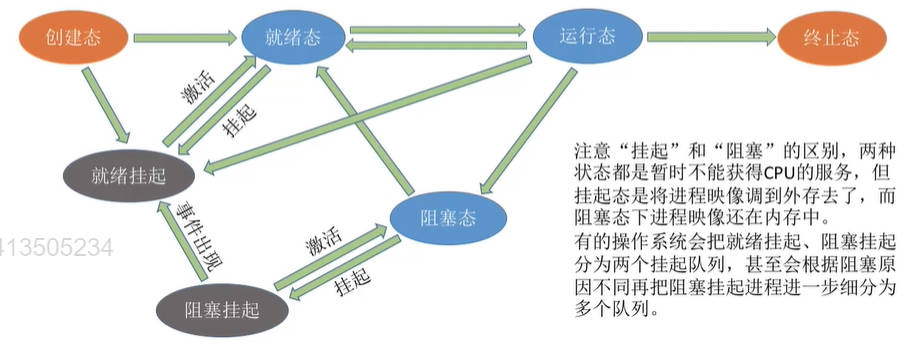

# 调度

**调度研究的问题：** 当有一堆任务要处理，需要确定某种规则来决定处理这些任务的顺序。

## 处理机调度

在多道程序系统中，进程的数量往往是多于处理机的个数的，这样不可能同时并行地处理各个进程。

**处理机调度：** 从就绪队列中按照一定的算法选择一个进程并将处理机分配给他运行，以实现进程的并发执行

**调度的三个层次：**
- 高级调度(作业调度)

    从外存调入内存的调度

    给在外存上处于后备队列的作业分配内存等必要资源，并建立相应的进程(建立PCB)，以使他们获得竞争处理机的权利

    高级调度主要指调入的问题，因为作业运行结束就调出，不需要操作系统来确定。

    频率很低，一个进程只需要调入一次，调出一次

- 中级调度(内存调度)

    决定将哪个处于挂起状态的进程重新调入内存。

    引入了虚拟存储技术之后，可将暂时不能运行的进程调至外存等待，等它重新具备了运行条件且内存又稍有空闲时，再重新调入内存。
    **暂时调到外存等待的进程状态称为挂起状态。**

    PCB不会一起调入外存，而是常驻内存。
        
    

        七状态模型：除了之前的创建态、就绪态、运行态、阻塞态、终止态外

        增加两个：就绪挂起和阻塞挂起

        就绪和就绪挂起可以互相转变

        阻塞和阻塞挂起可以互相转变

        阻塞挂起当引发阻塞的事件出现后可以直接变为就绪挂起

        当进程创建好后(从创建态)或运行结束后(从运行态)可能直接进入就绪挂起状态

    频率比较高，一个进程可能要多次调入内存

- 低级调度(进程调度)

    从就绪队列中选取一个进程，将处理机分配给它

    进程调度是操作系统中最基本的一种调度，在一般的操作系统中都必须配置进程调度

    频率很高，一般几十毫秒一次
***
***
### 进程调度(低级调度)的切换时机

**需要进行进程调度与切换的情况：**
- 当前运行的进程主动放弃处理机
  - 进程正常终止
  - 运行过程中发生异常而终止
  - 进程主动请求阻塞(如 等待I/O)

- 当前运行的进程被动放弃处理机
  - 分给进程的时间片用完
  - 有更紧急的事需要处理(如I/O)中断
  - 有更高优先级的进程进入就绪队列

**不能进行进程调度与切换的情况：**
- 在处理中断的过程中。

    中断处理过程复杂，与硬件密切相关

- 进程在操作系统内核程序临界区中

        临界资源：一个时间段内只允许一个进程使用的资源。
        各进程需要互斥地访问临界资源

        临界区：访问临界资源的那段代码。

        内核程序临界区：用来访问某种内核数据结构的，比如访问进程的就绪队列
    
    进行进程调度可能会影响操作系统内核的管理工作

    进程在普通临界区中是可以进行调度、切换的

- 在原子操作过程中(原语)

    原子操作不可中断，要一气呵成
***
### 进程的调度方式

**非剥夺调度方式(非抢占式方式)：**

只允许进程主动放弃处理机

在运行过程中即便有更紧迫的任务到达，当前进程依然会继续使用处理机，直到该进程终止或主动要求进入阻塞态。

- 实现简单、系统开销小
- 无法及时处理紧急任务，适合于早期的批处理系统

**剥夺调度方式(抢占方式)：**

可以要求进程被动放弃处理机

- 可以优先处理更紧急的进程，也可实现让各进程按时间片轮流执行的功能
- 适合于分时操作系统、实时操作系统

***

### 进程的切换过程
**狭义的进程调度：** 从就绪队列中选中一个要运行的进程

**进程切换：** 让一个进程让出处理机，由另一个进程占用处理机

**广义的进程调度：** 包含了选择一个进程和进程切换两个步骤

**进程切换过程完成的工作：**
- 对原来运行的进程中各种数据的保存
- 对新的进程各种数据的恢复

进程切换是有代价的，因此如果过于频繁的进行进程调度、切换，会使整个系统的效率降低。

所以并不是调度越频繁，并发度就越高。

***
***

## 调度器/调度程序

调度器/调度程序就是用来实现进程调度的

它决定调度算法（让谁运行）和时间片大小（运行多久）

非抢占式调度策略只有运行进程阻塞或退出才触发调度程序工作

抢占式调度策略，每个时钟或每k个时钟中断都会触发，来检查就绪队列是否有优先级更高的进程到来

## 闲逛进程：

当没有其它就绪进程时，运行闲逛进程

特性：

- 优先级最低

- 0地址指令，占一个完成的指令周期

- 能耗低

## 调度算法的评价指标
- CPU利用率

    指CPU“忙碌”的时间占总时间的比例

    利用率 = 忙碌的时间 / 总时间

    计算多道程序并发执行的情况时，可以用“甘特图”来辅助计算

- 系统吞吐量

    单位时间内完成作业的数量

    系统吞吐量 = 总共完成了多少道作业 / 总共花了多少时间

- 周转时间

    指从作业被提交给系统开始，到作业完成为止这段时间间隔

    包括四个部分：
    - 作业在外存后备队列上等待作业调度(高级调度)的时间
    - 进程在就绪队列上等待进程调度(低级调度)的时间
    - 进程在CPU上执行的时间（运行态的时间）
    - 进程等待I/O操作完成的时间（阻塞态的时间）

    **(作业)周转时间** = 作业完成时间 - 作业提交时间

    **平均周转时间** = 各作业周转时间之和 / 作业数

    **带权周转时间** = 作业周转时间 / 作业实际运行时间 

    - 带权周转时间必然>=1, 带权周转时间越小，用户满意度越高

    **平均带权周转时间** = 各作业带权周转时间之和 / 作业数

- 等待时间

    指进程/作业处于等待处理机状态时间之和，等待时间越长，用户满意度越低
    - 进程等待时间

        进程建立后等待被服务的时间之和

        在等待I/O完成的期间也是在被服务的，所以不计入等待时间

    - 作业等待时间

        不仅要考虑建立进程后的等待时间，还要加上作业在外存后备队列中等待的时间

    一个作业被服务的时间一般是固定的，因此调度算法只会影响作业/进程的等待时间。

- 响应时间

    指从用户提交请求到首次产生响应所用的时间

***
***

## 调度算法(一)

**饥饿：** 某进程/作业长期得不到服务

### 先来先服务(FCFS,First Come First Serve)

- 算法思想：公平， 只考虑等待时间，不考虑运行时间

- **算法规则：** 按照作业/进程到达的先后顺序进行服务

- **非抢占式算法** 

- **优点：** 公平、算法实现简单

- **缺点：** 对长作业有利，对短作业不利

    排在长作业后面的短作业需要等待很长时间，带权周转时间很大，对短作业来说用户体验不好

- 不会导致饥饿

***
### 短作业优先(SJF,Shortest Job First)/短进程优先(SPF,Shorest Process First)

- 只考虑运行时间，不考虑等待时间

- **算法规则：** 最短的(要求服务时间最短)作业/进程优先得到服务

- 非抢占式算法，有别的抢占式的版本

- 优点：“最短的”平均等待时间，平均周转时间

- 缺点：不公平。对短作业有利，对长作业不利。

    另外，作业/进程的运行时间是由用户提供的，并不一定真实，不一定能做到真正的短作业优先

- 会导致饥饿

    如果源源不断地有短作业/进程到来，可能使长作业/进程长时间得不到服务，产生“饥饿”现象，甚至“饿死”(一直得不到服务)

### 抢占式的短作业优先算法(SRTN Shortest Remaining Time Next，最短剩余时间优先算法)

每当有进程加入就绪队列时就需要调度：

如果新到达的进程剩余时间比当前运行的进程剩余时间更短，则由新进程抢占处理机，当前运行进程重新回到就绪队列

当一个进程完成时也需要调度

### 出题时的几个小细节
1. 如果题目未特别说明，所提到的"短作业/进程优先算法"默认是非抢占式的
2. SJF调度算法的平均等待时间、平均周转时间最少

    这个说法不严谨，抢占式的SRNT算法是最少的

    在所有进程同时可运行或所有进程都几乎同时到达时，SJF才是最少的

    但是如果没有其他合适选项，这个也可以认为是对的

***
### 高响应比优先算法(HRRN,Highest Response Ratio Next)

- 算法思想：综合考虑作业/进程的等待时间和所需的运行时间

- 算法规则：在每次调度时先计算各个作业的响应比，选择响应比最高的作业为其服务

    响应比 = (等待时间 + 要求服务的时间) / 要求服务的时间

    响应比 >= 1

- 非抢占式的算法。

    只有当前运行的作业主动放弃处理机时才需要调度

- 优点
  - 综合考虑了等待时间和运行时间
  - 等待时间相同时，要求服务时间短的优先(SJF优点)
  - 要求服务时间相同时，等待时间长的优先(FCFS优点)

- 不会导致饥饿

    对于长作业来说，随着等待时间越来越久，其响应比也会越来越大，从而避免了长作业饥饿的问题

        这几种算法主要关心对用户的公平性、平均周转时间、平均等待时间等评价系统整体性能的指标
        但是不关心“响应时间”，也并不区分任务的紧急程度
        因此对于用户来说，交互性很糟糕
        因此这三种算法一般适合用于早期的批处理系统
***
***
## 调度算法(二)
### 时间片轮转(RR,Round-Robin)
- 算法思想：公平地，轮流地为各个进程服务，让每个进程在一定时间间隔内都可以得到响应

- 算法规则：轮流让各个进程执行一个时间片(如100ms)

    若进程未在一个时间片内执行完，则剥夺处理机，将进程重新放到就绪队列队尾重新排队

- 抢占式算法

    由时钟装置发出时钟中断来通知CPU时间片已到，之后强行剥夺当前进程地处理机使用权

- 只能用于进程调度

- 如果时间片太大，会退化为先来先服务调度算法，增大进程响应时间
    
    如果时间片太小，会导致进程切换过于频繁，系统花大量时间处理进程切换

    一般来说设计时间片时要让切换进程的开销占比不超过1%
- 优点：公平；响应快，适用于分时操作系统
- 缺点：由于高频率的进程切换，因此有一定开销

    不区分任务的紧急程度
- 不会产生饥饿

***
### 优先级调度
- 算法思想：实时操作系统需要根据任务的紧急程度来决定处理顺序
- 调度时选择优先级最高的作业/进程
- 既可以用于作业调度，也可以用于进程调度，还可以用于I/O调度
- 抢占式，非抢占式都有

    非抢占式：只有当前进程主动放弃处理机时才进行调度

    抢占式：每当就绪队列发生变化时检查优先级，进行调度

- 优点：用优先级区分紧急程度、重要程度，适用于实时操作系统。

    可灵活地调整对各种作业/进程的偏好程度

- 会导致饥饿

    如果源源不断地有高优先级进程到来

### 优先级
**静态优先级：** 创建进程时确定，之后一直不变

**动态优先级：** 创建进程时有一个初始值，之后会根据情况动态地调整优先级

**优先级设置规则：**
- 系统进程优先级 高于 用户进程
- 前台进程优先级 高于 后台进程
- 操作系统更偏好I/O型进程(I/O繁忙型进程)

    与I/O型进程相对的是计算型进程(CPU繁忙型进程)

    I/O设备和CPU可以并行工作，让I/O型进程优先工作可以让I/O设备尽早投入工作，提高资源利用率和系统吞吐量

**动态优先级情况下调整优先级的时机：**

可以从追求公平、提升资源利用率等角度考虑
- 如果某进程在就绪队列中等待了很长时间，则可以适当提升其优先级
- 如果某进程占用处理机运行了很长时间，则可以适当降低其优先级
- 如果发现一个进程频繁地进行I/O操作，则可以适当提升其优先级

***
## 多级反馈队列调度算法
- 算法思想：对其他调度算法地折中权衡

- 算法规则：
  - 设置多级就绪队列，各级队列优先级从高到低时间片从小到大
  - 新进程到达时先进入第1级(最高级)队列，按FCFS原则排队等待被分配时间片。时间片用完后进程进入下一级队列队尾。
  - 只有当第k级队列为空时，才会为k+1级队头的进程分配时间片
  - 时间片还未完成有新进程到达时会抢占处理机
  - 被抢占处理机的进程会重新返回至原队列的队尾

- 只能用于进程调度

- 抢占式算法

- 优点
  - 对各类型进程相对公平(FCFS优点)
  - 每个新到达的进程都可以很快就得到响应(RR的优点)
  - 短进程只用较少的时间就可完成(SPF的优点)
  - 不必事先估计进程的运行时间(避免用户作假)
  - 可灵活地调整对各类进程地偏好程度

    可以将因I/O而阻塞地进程重新放回原队列，这样I/O型进程就可以保持较高优先级

- 会导致饥饿

        比起早期地批处理操作系统来说，由于计算机造价大幅降低
        因此后出现的算法更注重系统的响应时间、公平性、平衡性等指标
        这三种算法适合用于交互式系统
        比如UNIX使用的就是多级反馈队列调度算法