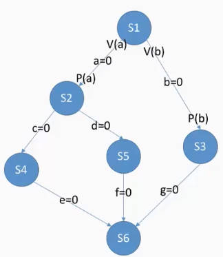

# 进程同步与进程互斥
## 基本概念
### 进程同步
**异步性：** 各并发执行的进程以各自独立的、不可预知的速度向前推进

进程同步就是为了解决异步问题，即让各进程按顺序执行

**同步：** 亦称直接制约关系，它是指为完成某种任务而建立的两个或多个进程，这些进程因为需要在某些位置上协调它们的工作次序而产生制约关系。进程间的直接制约关系就是源于它们之间的相互合作。
***
### 进程互斥
**临界资源：** 一个时间段内只允许一个进程使用的资源。对临界资源的访问，必须互斥地进行。

**互斥：** 亦称间接制约关系。进程互斥指当一个进程访问某邻接资源时，另一个想要访问该临界资源的进程必须等待。当前访问临界资源的进程访问结束，释放该资源之后，另一个进程才能去访问临界资源。

**对临界资源的互斥访问可以在逻辑上分为四个部分：**

    ```C++
    do{
        // 进入区 负责检查是否可进入临界区进入之后负责上锁(设置正在访问临界资源的标志)，以阻止其他进程进入
        entry section; 

        // 临界区，又称临界段，用来访问临界资源的那段代码
        critical section;

        // 退出区，负责解锁(解除正在访问临界资源的标志)
        exit section;

        // 剩余区，做其他处理
        remainder section;
    }while(true)
    ```
**需要遵循的原则：**
- 空闲让进

    临界区空闲时，可以允许一个请求进入临界区的进程立即进入临界区

- 忙则等待

    当已有进程进入临界区时，其他试图进入临界区的进程必须等待

- 有限等待

    对请求访问的进程，应保证能在有限时间内进入临界区(保证不会饥饿)

- 让权等待

    当进程不能进入临界区时，应立即释放处理机，防止进程忙等待
***
***
## 进程互斥的软件实现方法
### 单标志法
**算法思想：** 一个进程在访问完临界区后会把使用临界区的权限转交给另一个进程。

也就是说每个进程进入临界区的权限只能被另一个进程赋予。

**具体实现：**

- 起始条件：
    
    `int turn = 0;`  
    
    turn表示当前允许进入临界区的进程号

- P0进程：

    ```C++
    while(turn != 0); // 检查，由于没有循环语句，如果turn!=0会无限循环
    critical section;  // 访问临界区
    turn = 1;  // 赋予P1进程进入临界区的权限
    remainder section;  // 剩余区
    ```

- P1进程：

    ```C++
    while(turn != 1); //进入区
    critical section; // 临界区
    turn = 0; // 退出区
    remainder section; // 剩余区
    ```

**主要问题：** 违背 空闲让进 原则

刚开始允许P0进入，只有P0访问完临界区才能让P1进入。如果P0一直不访问临界区，那此时临界区但是并且P1明确表示要访问临界区却无法访问。
***
### 双标志先检查法
**算法思想：** 设置一个布尔型数组flag[ ]，数组中各个元素用来标记各进程想进入临界区的意愿。比如：flag[0]=ture表示P0进程想进入临界区。\
每个进程在进入临界区之前先检查当前有没有别的进程想进入临界区，如果没有，则把自身对应得标志flag[i] 设为true，之后开始访问临界区。

**具体实现：**
- 起始条件：

    ```C++
    bool flag[2]; 
    flag[0] = false;
    flag[1] = false;
    ```
    起始设置为两个进程都不想进入临界区

- P0进程：

    ```C++
    while(flag[1]); // 如果P1想进入临界区，那P0就一直循环等待
    flag[0] = true; // 上锁
    critical section; // 访问临界区
    flag[0] = false; // 解锁
    remainder section; 
    ```

- P1进程：

    ```C++
    while(flag[0]);
    flag[1] = true; // 进入区
    critical section; // 临界区
    flag[1] = false; // 退出区
    remainder section; // 剩余区
    ```

**主要问题：** 违背 忙则等待 原则

由于进入区中检查和上锁不是一气呵成的，就可能导致P0检查完后进入，正好切换进程，P1检查也通过进入。导致P0和P1同时访问临界区。
***
### 双标志后检查法
**算法思想：** 双标志先检查法的改版。前一个算法的问题是先“检查”后“上锁”，那就先“上锁”后“检查”来避免上述问题。

**具体实现：**
- 起始条件：

    ```C++
    bool flag[2]; 
    flag[0] = false;
    flag[1] = false;
    ```
    起始设置为两个进程都不想进入临界区

- P0进程：

    ```C++
    flag[0] = true; // 先上锁
    while(flag[1]); // 如果P1想进入临界区，那P0就一直循环等待
    critical section; // 访问临界区
    flag[0] = false; // 解锁
    remainder section; 
    ```

- P1进程：

    ```C++
    flag[1] = true; 
    while(flag[0]); // 进入区
    critical section; // 临界区
    flag[1] = false; // 退出区
    remainder section; // 剩余区
    ```

**主要问题：** 违背了 空闲让进 和 有限等待

如果P0刚上完锁就切换进程至P1，那P1也会上锁并检查，但此时P0已经上锁，检查无法通过。切换回P0检查也无法通过。两个进程都无法进入临界区，甚至产生饥饿现象。

### Peterson算法
**算法思想：** 双标志后检查法当中，两个进程都争着想进入临界区，但是谁也不让谁，最后谁都无法进入。

Gary L.Peterson 想到一种算法，如果双方都争着想进入临界区，那可以让进程尝试“孔融让梨”，主动让对方先使用临界区。

**具体实现：**
- 起始条件：

    ```C++
    bool flag[2]; // 表示各进程进入临界区的意愿
    int turn = 0; // 表示优先让哪个进程进入临界区
    ```

- P0进程：

    ```C++
    flag[0] = true; // P0表示自己想进入临界区
    turn = 1; // 但是愿意让P1先进去
    while(flag[1] && turn == 1); // 如果P1表示自己想进去
    //而且最后一次是自己让梨，P0自己就循环等待
    critical section;
    flag[0] = false;
    remainder section;
    ```

- P1进程：

    ```C++
    flag[1] = true;
    turn = 0;
    while(flag[0] && turn ==0); // 进入区
    critical section; // 临界区
    flag[1] = false; // 退出区
    remainder section; // 剩余区
    ```

**主要问题：** 未遵循 让权等待 的原则

当P0进程不能进入临界区时，它会卡在while循环中，依旧占用着CPU，不会把CPU让出来。

***
***

## 进程互斥的硬件实现方法
### 中断屏蔽方法
利用“开/关中断”实现
```
关中断 关中断后即不允许当前进程被中断

临界区

开中断
```
- 优点：简单、高效
- 缺点
  - 不适用于多处理机，

    因为开/关中断指令只对执行指令的那一个处理机有用，对其他处理机没用（如果另一个处理机上运行的进程也要进入临界区，是没办法阻止的）

  - 只适用于操作系统内核进程，不适用于用户进程

    因为开/关中断指令只能运行在内核态，这组指令如果能让用户随意使用会很危险
***
### TestAndSet指令

简称TS指令，也称为TestAndSetLock指令，简称TSL指令

TSL指令是用硬件实现的，执行的过程不允许被中断，只能一气呵成

其实就是把双标志先检查法中的检查和上锁变成了一气呵成的原子操作

**逻辑描述：**
- lock表示当前临界区是否被加锁

    true表示已加锁，false表示未加锁
    ```C++
    bool TestAndSet(bool *lock){
        bool old;
        old = *lock; // old用来存放lock原来的值，用来返回
        *lock = true; // 无论如何都加锁
        return old;
    }
    ```
- 调用过程

    ```C++
    while(TestAndSet(&lock)); // 上锁并检查
    // 如果原来就是锁着的就无限循环
    critical section;
    lock = false; // 解锁
    remainder section;
    ```

TSL指令把 上锁 和 检查 操作用硬件的方式变成了一气呵成的原子操作

**优点：** 
- 实现简单，无需像软件实现方法那样严格检查是否会有逻辑漏洞
- 适用于多处理机环境

**缺点：**
- 不满足 让权等待 原则

    暂时无法进入临界区的进程会占用CPU并循环执行TSL指令，从而导致忙等
***
### Swap指令
又称 Exchange指令 或简称 XCHG指令

逻辑本质上和TSL指令没啥区别

**逻辑描述：**
- Swap函数
    ```C++
    Swap(bool *a, bool *b){
        bool temp;
        temp = *a;
        *a = *b;
        *b = temp;
    }
    ```
- 调用过程

    old初始是true，交换就是让lock变成true，然后检查原来的lock是不是true

    ```C++
    bool old = true;
    while(old == true){
        Swap(&lock, &old);
    }
    critical section;
    lock = false;
    remainder section;
    ```

**优缺点：** 与TSL算法相同

***

### 进程互斥：锁

解决临界区最简单的工具就是互斥锁（mutex lock）。

- 获得锁acquire()函数：

    ```C++
    acquire(){
        while(!available); // 忙等
        available = false; // 获得锁
    }
    ```

- 释放锁release()函数：

    ```C++
    release(){
        available = true; // 释放锁
    }
    ```

互斥锁的主要缺点是忙等待。需要连续循环忙等的互斥锁都可称为自旋锁，比如TSL指令，swap指令，单标志法

如果上锁的时间短，则等待的代价很低，可能比切换进程代价低

***
***
## 信号量机制

### 定义
用户进程可以通过使用操作系统提供的 **一对原语** 来对 **信号量** 进行操作，从而和方便的实现了进程互斥、进程同步。
- 信号量：信号量其实就是一个变量，可以用一个信号量来表示系统中某种资源的变量

    信号量可以是一个整数，也可以是更复杂的记录型变量

    比如：系统中只有一台打印机，就可以设置一个初值为1的信号量

- 原语：原语是一种特殊的程序段，其执行只能一气呵成，不可被中断

    原语是由关中断/开中断指令实现的。

- 一对原语：wait(S)原语 和 signal(S)原语

    可以把原语理解为函数，函数名分别为wait和signal，括号里的信号量S其实就是函数调用时传入的一个参数

    wait、signal原语常简称为P、V操作。wait(S)、signal(S)分别写为P(S)、V(S)

***
### 整型信号量
用一个整数型的变量作为信号量，用来表示系统中某种资源的数量。

与普通整数变量的区别：对信号量的操作只有三种，即初始化、P操作、V操作

**实现过程：**
- wait 和 signal 函数实现

    ```C++
    int S = 1; // 初始化整型信号量S，
    // S表示当前系统中可用的资源数量，比如一台打印机

    void wait(int S){// 相当于进入区
        while(S <= 0) ; // 如果资源数不够，就一直循环等待
        S = S - 1; // 如果资源数够，就占用一个资源
    }

    void signal(int S){ // 相当于退出区
        S = S + 1; // 使用完资源后，在退出区释放资源
    }
    ```

- 调用过程

    ```C++
    wait(S); // 进入区
    critical section;// 临界区
    signal(S); // 退出区
    remainder section; // 剩余区
    ```

**优点：** 检查和上锁一气呵成，避免了并发、异步导致的问题

**存在的问题：** 不满足 让权等待 原则，会发生忙等

其实和双标志先检查法类似，不过是把检查和上锁放入了原语中进行。

***

### 记录型信号量

用记录型数据结构变量作为信号量，用于解决整型信号量忙等问题

**具体实现：**
- 记录型信号量的定义

    ```C++
    typedef struct{
        int value; // 剩余资源数
        struct process *L; // 想要使用这个资源的等待队列
    }
    ```

    如果value值为负数，则它的绝对值表示了当前等待队列中有多少进程

- wait原语

    先将资源数量-1 表示有人想用这个资源

    如果减完剩余资源量不够，就使用block原语使当前进程从运行态进入阻塞态，并挂到信号量S对应的等待队列中

    ```C++
    void wait(semaphore S){
        S.value--;
        if(S.value < 0){
            bolck(S.L);
        }
    }
    ```

- signal原语

    使用完后将资源数+1

    如果释放资源后资源数小于等于0，说明等待队列中还有进程想使用该资源。就唤醒等待队列中的一个进程。

    ```C++
    void signal(semaphore S){
        S.value++;
        if(S.value <= 0){
            wakeup(S.L);
        }
    }
    ```

- 调用过程

    ```C++
    wait(S); // 进入区
    critical section; // 临界区
    signal(S); // 退出区
    remainder section; // 剩余区
    ```

**优点：** 满足让权等待原则

若题目中出现P(S)、V(S)操作，除非特别说明，否则默认S为记录型信号量，即进程不会忙等
***
***
## 信号量机制实现进程互斥、同步、前驱关系
### 信号量机制实现进程互斥
进程互斥访问临界资源，其实就是资源的初始值为1

**实现过程：**
1. 分析并发进程的关键活动，划定临界区

    如：对某种临界资源的访问比如打印机就应放在临界区

2. 设置互斥信号量mutex，初值为1

    `semaphore mutex = 1;`

    semaphore是记录型信号量，可以把信号量的声明简写为这种形式

3. 在临界区之前执行P(mutex)
4. 在临界区之后执行V(mutex)

    ```C++
    semaphore mutex = 1;
    P1(){  //P1进程
        ...
        P(mutex);
        critical section;
        V(mutex);
        ...
    }
    P2(){
        ...
        P(mutex);
        critical section;
        V(mutex);
        ...
    }
    ```

**注意：**
- 对不同的临界资源需要设置不同的互斥信号量：mutex1、mutex2、mutex3……
- P、V操作必须成对出现

    缺少P就不能保证临界资源的互斥访问

    缺少V会导致资源永不被释放，等待进程永不被唤醒
***
### 信号量机制实现进程同步
进程同步：让各并发进程按要求有序执行

**实现过程：**
1. 分析什么地方需要实现"同步关系"，即哪两个操作(或两句代码)需要保证一前一后执行

2. 设置同步信号量S，初始为0

    `semaphore S = 0;`

3. 在 前操作 之后执行V(S)

    前操作的执行创造了后操作所需临界资源，相当于释放资源，用V操作

4. 在 后操作 之前执行P(S)

        前V后P
        前(操作)V后(操作)P

    比如 代码4 必须在 代码2 之后执行
    ```C++
    semaphore S = 0;

    P1(){
        代码1;
        代码2;
        V(S);
        代码3;
    }

    P2(){
        P(S);
        代码4;
        代码5;
        代码6;
    }
    ```

    因为起始S值等于0，除非先执行完代码2后执行V(S) 使S值成为1，否则执行到P(S)时，S值--之后永远小于0，导致P2进程被挂起，无法执行代码4
***
### 信号量机制实现前驱关系
即多层同步关系



每一对前驱关系都是一个进程同步问题

比如：S2和S3必须在S1之后执行；

S4和S5必须在S2之后执行

S6必须在S3、S4、S5之后执行

......

**实现过程：**
1. 要为每一对前驱关系各设置一个同步变量(初始值均为0)
2. 在 前操作 之后对响应的同步变量执行V操作
3. 在 后操作 之前对响应的同步变量执行P操作

```C++
P1(){
    S1;
    V(a);
    V(b);
}

P2(){
    P(a);
    S2;
    S(c);
    S(d);
}

P3(){
    P(b);
    S3;
    V(g);
}

P4(){
    P(c);
    S4;
    V(e);
}

P5(){
    P(d);
    S5;
    V(f);
}

P6(){
    P(e);
    P(f);
    P(g);
    S6;
}

```
***
***
## 一些经典的进程互斥、同步问题
### 生产者-消费者问题
- 问题描述：

    系统中有一组生产者进程和一组消费者进程

    生产者进程每次生产一个产品放入缓冲区

    消费者进程每次从缓冲区中取出一个产品并使用
    (产品可以理解为某种数据)

    生产者、消费者共享一个初始为空、大小为n的缓冲区

    只有缓冲区没满时，生产者才能把产品放入缓冲区，否则必须等待——同步

    只有缓冲区不空时，消费者才能从中取出产品，否则必须等待——同步

    缓冲区是临界资源，各进程必须等待。防止两个生产者同时往一个地方放数据等问题。——互斥

**解决步骤：**
- 设置信号量

    ```C++
    semaphore mutex = 1; // 互斥信号量，对缓冲区的互斥访问
    semaphore empty = n; // 同步信号量，表示空闲缓冲区的数量
    semaphore full = 0; // 同步信号量，表示产品的数量，也即非空缓冲区的数量
    ``` 

- 生产者进程

    ```C++
    producer(){
        while(1){
            生产一个产品;
            // 生产完产品之后要先占一个缓冲区的位置再放入
            p(empty); // 消耗一个空闲缓冲区

            p(mutex);  // 进入区
            把产品放入缓冲区;  // 临界区
            v(mutex); // 退出区

            v(full); // 增加一个产品
        }
    }
    ```

- 消费者进程

    ```C++
    consumer(){
        while(1){
            P(full); // 产品数量-1，先提前说好自己要一个产品

            p(mutex);
            从缓冲区取出一个产品;
            v(mutex);

            v(empty); // 增加一个空闲缓冲区
            使用产品;
        }
    }
    ```

**问题：**
- 能否互换实现互斥的P操作和实现同步的P操作
    
    即互换生产者进程中的 P(empty) 和 P(mutex)\
    或互换消费者中的 P(full) 和 P(mutex)

    不能

    因为生产者消费者共用一个缓冲区空间且互斥。如果缓冲区已经放满产品(empty=0,full=n)：此时生产者进入缓冲区，执行P(mutex)把门锁上，发现里面没地方放了，就切换为消费者进程，而由于门是锁着的，消费者进不去，就出现死锁现象。

    同理如果缓冲区没有产品(full=0,empty=n)的话消费者先进入也会出现死锁。

- 能否互换实现互斥的V操作和实现同步的V操作

    可以

    因为V操作不会导致进程阻塞

- 生产一个产品 和 使用产品 这两步能否放在P、V操作包含的临界区中

    逻辑上可以，但不要这样做

    这样会使临界区中代码量增多，降低程序并发性。
***
### 多生产者-多消费者问题
**问题描述：**

桌子上有一个盘子，每次只能向其中放入一个水果。

爸爸专向盘子中放苹果，妈妈专向盘子中放橘子，儿子专等着吃盘子里的橘子，女儿专等着吃盘子中的苹果。

只有盘子空时，爸爸或妈妈才能向盘子中放一个水果。仅当盘子中有自己需要的水果时，儿子或女儿可以从盘子中取出水果。

**问题分析：**

互斥关系：
- 对缓冲区(盘子)的访问要互斥地进行

同步关系：
- 父亲将苹果放入盘子后，女儿才能取苹果
- 母亲将橘子放入盘子后，儿子才能取橘子
- 只有盘子为空时，父亲或母亲才能放水果

    盘子为空这个事件既可以由儿子取橘子触发，也可以由女儿取苹果触发

**解决方案：**
- 设置信号量

    ```C++
    semaphore mutex = 1; // 实现互斥访问盘子
    semaphore apple = 0; // 盘子中苹果的数量，刚开始盘子里没有苹果
    semaphore orange = 0; // 盘子中橘子的数量，刚开始盘子里没有橘子
    semaphore plate = 1; // 盘子剩余空间，刚开始盘子里什么也没有
    ```

前V后P，这里的前后事件指的是临界区中的事件，而不是准备苹果、准备橘子、吃苹果、吃橘子

- 爸爸进程

    ```C++
    dad(){
        while(1){
            准备一个苹果; 
            P(plate); // 看看盘子里有地方没

            P(mutex);
            把苹果放入盘子;
            V(mutex);

            V(apple); // 告诉女儿我放了一个苹果
        }
    }
    ```
- 妈妈进程

    ```C++
    mom(){
        while(1){
            准备一个橘子;
            P(plate); // 看看盘子里有地方没

            P(mutex);
            把橘子放入盘子;
            V(mutex);

            V(orange);  // 告诉儿子我放了一个橘子
        }
    }
    ```

- 女儿进程

    ```C++
    daughter(){
        while(1){
            P(apple); // 看看有没有苹果

            P(mutex);
            从盘子中取出苹果;
            V(mutex);

            V(plate); // 拿完之后告诉爸爸妈妈盘子里有地方了

            吃掉苹果;
        }
    }
    ```

- 儿子进程

    ```C++
    son(){
        while(1){
            p(orange); // 看看有没有橘子

            P(mutex);
            从盘子中取出橘子;
            V(mutex);

            V(plate);// 拿完之后告诉爸爸妈妈盘子里有地方了

            吃掉橘子;
        }
    }
    ```

**问题：**
- 可不可以不用互斥信号量

    可以

    原因在于：本题中缓冲区(plate)大小为1，所以在任何时刻，apple、orange、plate三个的值最多只有一个是1，即最多只有一个进程的P操作不会被阻塞

- 如果盘子容量为2，可不可以不用互斥信号量

    不可以

如果缓冲区大小大于1，就必须专门设置一个互斥信号量mutex来保证互斥访问缓冲区

***

### 吸烟者问题
**问题描述：**

假设一个系统中有三个抽烟者进程和一个供应者进程。

每个抽烟者不停地卷烟并抽掉它，但是要卷起并抽调一支烟，抽烟者需要有三种材料：烟草、纸和胶水。

三个抽烟者中，第一个拥有烟草、第二个拥有纸、第三个拥有胶水。

供应者进程无限地提供三种材料，供应者每次将两种材料放桌子上，拥有剩下那种材料地抽烟者卷一根烟并抽掉它，并给供应者进程一个信号告诉完成了，供应者就会放另外两种材料在桌子上，这个过程一直重复(让三个抽烟者轮流抽烟)。

**问题分析：**

互斥关系：

- 桌子可以看作容量为1的缓冲区，要互斥访问

同步关系：
- 桌子上有组合一(纸+胶水)，第一个抽烟者才能取走东西抽烟
- 桌子上有组合二(烟草+胶水)，第二个抽烟者才能取走东西抽烟
- 桌子上有组合三(烟草+纸)，第三个抽烟者才能取走东西抽烟
- 三个抽烟者发出完成信号，供应者才将下一个组合放到桌子上

**问题解决：**
- 设置信号量

    由于缓冲区大小为1，可以不用设置用于互斥的信号量mutex

    ```C++
    semaphore offer1 = 0;
    semaphore offer2 = 0;
    semaphore offer3 = 0;
    semaphore finish = 0; // 三个吸烟者发出的完成信号
    // 起始时没有吸烟者发出完成信号
    int i=0; // 用于实现“三个抽烟者轮流抽烟”
    ```

- 供应者

    ```C++
    provider(){
        while(1){
            if(i==0){
                组合一放桌上;

                V(offer1);

            }else if(i==1){
                组合二放桌上;

                V(offer2);

            }else if(i==2){
                组合三放桌上;

                V(offer3);

            }
            i = (i + 1) % 3;
            P(finish);
        }
    }
    ```

- 抽烟者一

    ```C++
    smoker1(){
        while(1){
            P(offer1);

            从桌上拿走组合一、卷烟、抽掉;

            V(finish);
        }
    }
    ```

- 抽烟者二

    ```C++
    smoker2(){
        while(1){
            P(offer2);

            从桌上拿走组合二、卷烟、抽掉;

            V(finish);
        }
    }
    ```

- 抽烟者三

    ```C++
    smoker3(){
        while(1){
            P(offer3);

            从桌上拿走组合三、卷烟、抽掉;

            V(finish);
        }
    }
    ```
***
### 读者-写者问题
**问题描述：**

有读者和写者两组并发进程，共享一个文件。

当两个或两个以上的读进程同时访问共享数据时不会产生副作用，但若某个写进程和其他进程(读进程或写进程)同时访问共享数据时则可能导致数据不一致的错误。

因此要求:
- 允许多个读者可以同时对文件执行读操作
- 只允许一个写者往文件中写信息
- 任一写者在完成写操作之前不允许其他读者或写者工作
- 写者执行写操作前，应让已有的读者和写者全部退出

**具体实现：**
- 设置信号量

    ```C++
    semaphore rw = 1; // 用于实现对文件的互斥访问。表示当前是否有进程在访共享文件
    int count = 0; // 记录当前有几个都进程在访问文件
    int mutex = 1; // 用于保证对count变量的互斥访问
    ```

- 写者进程

    ```C++
    writer(){
        while(1){
            P(rw);
            写文件;
            V(rw);
        }
    }
    ```

- 读者进程

    ```C++
    reader(){
        while(1){
            if(count == 0) // 如果自己是第一个读进程，就要负责加锁
                P(rw);
            count++;

            读文件;

            count--;
            if(count==0) // 如果自己是最后一个读进程，就要负责解锁
                V(rw);
        }
    }
    ```
    问题：若两个读进程同时并发进行，可能进程一判断count==0成功，上了锁；然后第二个读进程也判断count==0成功，发现被锁住了进不去。这样就无法实现两个读进程同时访问。

    解决办法：出现上述问题是因为对count变量的检查和赋值不是一气呵成的，可以再设置另一个互斥信号量。
    ```C++
    reader(){
        while(1){
            P(mutex);
            if(count == 0) // 如果自己是第一个读进程，就要负责加锁
                P(rw);
            count++;
            V(mutex);

            读文件;

            P(mutex);
            count--;
            if(count==0) // 如果自己是最后一个读进程，就要负责解锁
                V(rw);
            V(mutex);
        }
    }
    ```
    潜在的问题：如果有源源不断的读进程在读，写进程就要一直阻塞等待，甚至“饿死”。因此这种算法是读进程优先的算法
- 写优先算法(读写公平法)

    `semaphore w = 1; // 用于实现写优先`

    ```C++
    writer(){
        while(1){
            p(w);

            p(rw);
            写文件;
            V(rw);

            V(w);
        }
    }

    reader(){
        while(1){
            P(w);

            p(mutex);
            if(count == 0){
                P(rw);
            }
            count++;
            V(mutex);

            V(w);

            ...与前面相同
        }
    }
    ```
    多加一对P(w)、V(w)就可以保证 读者1 ——> 写者1 ——> 读者2 这种情况发生时，读者1会顺利通过P(w)P(mutex)P(rw),对count进行修改之后释放V(w)并开始读取数据，而写者1到来之后会通过P(w)但是阻塞在P(rw)，读者2到来之后会阻塞在P(W)。这样当读者1读完之后写者1就能顺利进入，而不会被读者2插队。
***
### 哲学家进餐
**问题描述：**

一张圆桌上坐着5名哲学家，每两个哲学家之间的桌子上摆一根筷子，桌子的中间是一碗米饭。哲学家们倾注毕生精力用于思考和进餐。

哲学家在思考时，并不影响他人，只有当哲学家饥饿时，才试图拿起左、右两根筷子(一根一根拿起)。

如果筷子已在他人手上，则需要等待。饥饿的哲学家只有同时拿起两根筷子才可以开始进餐，当进餐完毕后，放下筷子继续思考。

**具体实现：**
- 信号量设置：定义互斥信号量数组

    对哲学家按0~4编号，哲学家i左边的筷子编号为i，右边的筷子编号为(i+1)%5

    `semaphore chopstick[5] = {1,1,1,1,1};`

- i号哲学家的进程

    ```C++
    Pi(){
        while(1){
            p(chopstick[i]); // 拿左边的筷子
            p(chopstick[(i+1)%5]); // 拿右边的筷子
            吃饭;
            V(chopstick[i]);//放下左边的筷子
            V(chopstick[(i+1)%5]); // 放下右边的筷子
            思考;
        }
    }
    ```
    问题：如果五个哲学家并发地拿起了自己左边的筷子，导致死锁

    如何防止死锁的发生：
    - 可以对哲学家进程施加一些限制条件。比如最多允许四个哲学家同时进餐

        ```C++
        semaphore eating = 4;
        
        Pi(){
            while(1){
                P(eating);
                原拿筷子吃饭代码;
                V(eating);

                思考;
            }
        }
        ```
    - 要求奇数号哲学家先拿左边的筷子，然后再拿右边的筷子。这样的话抢不到筷子的哲学家会直接阻塞，而不会拿着一只筷子的情况下阻塞。
    - 仅当一个哲学家左右两只筷子都可用时才允许他抓起筷子(说法不严谨，可能发生只有一只筷子也拿起来)。
    
        表述为：保证各哲学家拿筷子这件事必须互斥地进行。

        即让一个哲学家一气呵成的拿两双筷子。

        ```C++
        semaphore mutex = 1;

        Pi(){
            while(1){
                P(mutex);
                拿左边筷子;
                拿右边筷子;
                V(mutex);

                吃饭...
                与原代码相同;
            }
        }
        ```
***
***
## 管程
**信号量机制存在的问题：** 编写程序困难，易出错

**管程：** 一种高级的同步机制

**定义：**

管程是一种特殊的软件模块（类似于一个类），由这些部分组成
- 局部与管程的共享数据结构说明——用来表示共享资源(缓冲区)的数据结构

- 对该数据结构进行操作的一组过程——操作上面数据结构的函数

- 对局部于管程的共享数据设置初始值的语句——初始化那个表示共享资源的数据结构

- 管程有一个名字

**基本特征：**
- 局部于管程的数据只能被局部于管程的过程所访问——相当于私有属性
- 一个进程只有通过调用管程内的过程才能进入管程访问共享数据——类似于类提供的get/set接口来访问私有属性
- 每次仅允许一个进程在管程内执行某个内部过程

**用管程解决生产者消费者问题：**
- 管程实现

    由编译器负责实现各进程互斥地进入管程中地过程，代码中只实现了同步问题

    相当于把P、V操作给封装起来了

    ```C++
    monitor ProducerConsumer
        condition full, empty; // 用来实现同步
        int count = 0; // 缓冲区中的产品数
        void insert(Item item){
            if(count == N)// 如果缓冲区满了就等待
                wait(full);
            count++;
            insert_item(item); // 将产品放入缓冲区
            if(count==1)// 如果自己生产一个之后还剩一个，说明之前是空的，可能有消费者在等待，就唤醒一下
                signal(empty);
        }
        Item remove(){
            if(count == 0)
                wait(empty);
            count--;
            if(count == N-1) // 如果自己取走一个之后是N-1，说明之前是满的，可能有生产者在等待
                signal(full);
            return remove_item();
        }
    ```
- 生产者进程

    ```C++
    producer(){
        while(1){
            item = 生产一个产品;
            ProducerConsumer.insert(item);
        }
    }
    ```
- 消费者进程

    ```C++
    consumer(){
        while(1){
            item = ProducerConsumer.remove();
            消费产品item;
        }
    }
    ```

Java中的synchronized关键字就类似于管程