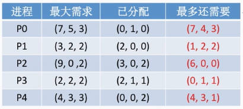
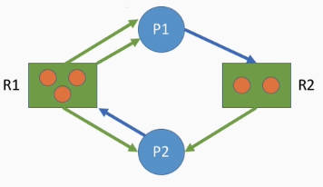
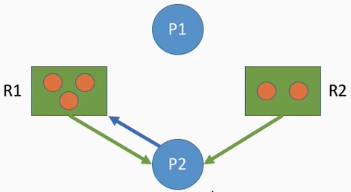

# 死锁
## 基本定义
**死锁：**

死锁是在并发环境下，各进程因竞争资源而造成的一种互相等待对方手里的资源，导致各进程都阻塞，都无法向前推进的现象。

发生死锁后若无外力干涉，这些进程都将无法向前推进。

**饥饿：**

各进程互相等待对方手里的资源，导致各进程都阻塞，无法向前推进的现象

**死循环：**

某进程执行过程中一直跳不出某个循环的现象。有时是因为程序逻辑bug导致的，有时是程序员故意设计的。
***
**死锁产生的必要条件：**
- 互斥条件

    只有对必须互斥使用的资源(临界区)的争抢才会导致死锁

    像内存、扬声器这样可以同时让多个进程使用的资源是不会导致死锁的

- 不剥夺条件

    进程所获得的资源在未使用完之前，不能由其他进程强行夺走，只能主动释放

- 请求和保持条件

    进程已经保持了至少一个资源，但又提出了新的资源请求，而该资源又被其他进程占着，此时请求进程被阻塞，但又对自己已有的资源保持不放。

- 循环等待条件

    存在一种进程资源的循环等待链，链中的每一个进程已获得的资源同时被下一个进程所请求。

    注意：发生死锁时一定有循环等待，但是发生循环等待时未必死锁(循环等待是死锁的必要不充分条件)

    如果同类资源数大于一，则即使有循环等待，也未必发生死锁。但如果系统中每类资源都只有一个，那循环等待就是死锁的充分必要条件了。

**死锁发生的场景：**

对不可剥夺资源的不合理分配，可能导致死锁

- 对系统资源的竞争

    各进程对不可剥夺的资源(如打印机)的竞争可能引发死锁，对可剥夺的资源(如CPU)的竞争不会引起死锁

- 进程推进顺序非法

    比如：P1、P2并发执行，P1占有资源R1又申请R2，此时P2占有R2去申请R1

- 信号量的使用不当

    如生产者-消费者问题中，如果实现互斥的P操作在实现同步的P操作之前，就有可能导致死锁

**死锁的处理策略：**
- 预防死锁

    破坏死锁产生的四个必要条件中的一个或几个

- 避免死锁

    用某种方法防止系统进入不安全状态，从而避免死锁(银行家算法)

- 死锁的检测和解除

    允许死锁的发生，不过操作系统会负责检测出死锁的发生，然后采取某种策略接触死锁
***
***
## 预防死锁
### 破坏死锁产生的必要条件
**互斥条件：只有对必须互斥使用的资源的争抢才会导致死锁**

- 解决方案：可以把互斥使用的资源改造为允许共享使用的资源

    比如：SPOOLing技术

    操作系统可以采用SPOOLing技术把独占设备在逻辑上改造成共享设备。比如在进程和打印机之间增加一一个输出进程。输出进程可以接收其他进程对打印机的使用请求。这样其他进程就不需要阻塞等待了。

- **缺点：** 并不是所有的资源都可以高造成可共享使用的资源。并且为了系统安全，很多地方还必须保护这种互斥性。

**不剥夺条件：进程所获得的资源在未使用完成之前，不能由其他进程强行夺走**

- 解决方案一：当某个进程请求新的资源得不到满足时，它必须立即释放保持的所有资源，待以后需要时再重新申请。

    要求进程主动释放资源

- 解决方案二：当某个进程需要的资源被其他进程所占有的时候，可以由操作系统协助，将想要的资源强行剥夺。

    这种方式一般需要考虑各进程的优先级。

    强迫进程被动释放资源

- 缺点：
  - 实现起来比较复杂
  - 释放已获得的资源可能造成前一阶段工作的失效。因此这种方法一般只适用于易保存和恢复状态的资源，如CPU
  - 反复地申请和释放资源会增加系统开销，降低系统吞吐量
  - 若采用方案一，意味着只要暂时得不到某个资源，之前获得的那些资源就都需要放弃，以后再重新申请。如果一直发生这样的情况，就会导致进程饥饿。

**请求和保持条件：** 进程已经保持了至少一个资源，但又提出了新的资源请求，而该资源又被其他进程占有，此时请求进程被阻塞，但又对自己已有的资源保持不放。

- 采用静态分配的方法：
  
  即进程在运行前 一次申请完它所需要的全部资源，在它的资源未满足前，不让它投入运行。一旦投入运行后，这些资源就一直归它所有，该进程就不会再请求别的任何资源了。

- 缺点：
  - 导致资源利用率降低

    有些资源可能只需要用很短的时间，但却要在进程整个运行期间被占有，别的进程也无法使用。

  - 可能导致某些进程饥饿

**循环等待条件：** 存在一种进程资源的循环等待链，链中的每一个进程已获得的资源同时被下一个进程所请求

- 采用顺序资源分配法。

    首先给系统中的资源编号，规定每个进程必须按编号递增的顺序请求资源，同类资源(即编号相同的资源)一次申请完。

    按编号递增申请——一个进程必须要先占有小编号的资源，才有资格去申请大编号的资源。已持有大编号资源的进程不可能逆向地回来申请小编号的资源。

- 缺点
  - 不方便增加新的设备，因为可能需要重新分配所有的编号
  - 进程实际使用资源的顺序可能和编号递增顺序不一致，导致资源浪费。

    比如进程P1要先使用7号资源再使用5号资源，但是按照规则它必须先占用5号才能申请7号，导致5号资源的浪费

  - 必须按规定次序申请资源，用户编程麻烦

***
### 避免死锁

**安全序列：** 指如果系统按照这种序列分配资源，则每个进程都能顺利完成。

**安全状态：** 只要能找出一个安全序列，系统就是安全状态。安全序列可能有多个

**不安全状态：** 如果分配了资源之后，系统中找不出任何一个安全序列，系统就进入了不安全状态。这意味着**可能**所有进程都无法顺利执行。

如果有进程提前归还了一些资源，那系统也有可能重新回到安全状态，不过我们在分配资源之前总是要考虑到最坏的情况。

**结论：** 
- 如果系统处于安全状态，就一定不会发生死锁。
- 如果系统进入不安全状态，只是有可能发生死锁(发生死锁一定在不安全状态)

**银行家算法：** 在资源分配之前先判断这次分配是否会导致系统进入不安全状态，以此决定是否答应资源分配请求

**安全性算法(找安全序列)：**
- 计算机有多种资源时，使用向量的方式表示每种资源
1. 列表，根据题目中给出的每个进程的最大需求和已分配资源求出每个进程最多还需要的资源

2. 算出目前剩余可用资源(用资源总数 - 已分配资源)
   
   

   与每个进程最多还需要的资源对比，如果发现存在进程(比如P1、P3)，它最多需要的资源比目前剩余可用资源小，就将它加入安全序列，并让目前剩余可用资源加上它的已分配资源。
3. 用更新后的剩余可用资源重复第二步。

**算法实现：**

验证这次对资源的申请是否应该同意

数据结构：
- 一个表示最大需求的二维数组 Max
- 一个表示已分配情况的二维数组 Allocation
- 一个表示每个进程最多还需要多少资源的二维数组 Need
- 一个用来表示当前进程还剩余多少可用资源的一维数组Available

算法步骤：
- 检查此次申请是否超过了之前声明的最大需求数
- 检查此时系统剩余的可用资源是否还能满足这次请求
- 试探着分配，更改数据结构
- 用安全性算法检查此次分配是否会导致系统进入不安全状态
***
### 死锁的检测和解除

**死锁检测算法：** 用于检测系统状态，以确定系统中是否发生了死锁

- 需要某种数据结构，来保存资源的请求和分配信息

    这个数据结构有两种结点
    - 进程结点——对应一个进程
    - 资源结点——对应一类资源，一类资源可能有多个

    这个数据结构有两种边
    - 进程结点——>资源结点(蓝色)：表示进程想申请几个资源(每条边代表一个资源)
    - 资源节点——>进程结点(绿色)：表示已经为进程分配了几个资源(每条边代表一个)

    

- 需要提供一种算法，利用上述信息来检测系统是否已进入死锁状态

    **依次消除与不阻塞进程相连的边，直至无边可消**

    当前状态下R2分配出去一个资源，还剩一个资源，P1进程需要一个资源，P1可以被满足。等P1执行结束后会把所有资源归坏，不会申请也不会被分配资源。此时可以把有关P1的边全部去掉

    **注意：** 对于P2来说，R1已经分配给它一个资源，而P2在申请另一个资源，也就是说P2一共需要2个R1，而R1此时已经没有了，所以无法满足P2.

    

    此时P2进程也可以被满足，有关P2的边也可以全部擦掉。

    如果按照上述过程分析，最终能消除所有边(相当于能找到一个安全序列)，就称这个图是可完全简化的。此时一定没有发生死锁。

    如果最终不能消除所有边，那么此时就是发生了死锁。最终还连着边的那些进程就是处于死锁状态的进程。

    **算法描述：**
    - 在资源分配图中，找出既不阻塞又不是孤点(有边与它相连)的进程Pi。然后消去它所有的请求边和分配边，使之成为孤立的结点。
    - 进程Pi所释放的资源，可以唤醒某些因等待这些资源而阻塞的进程，原来的阻塞进程可能变为非阻塞进程。根据上一条中的方法进行一系列简化后，若能消去图中所有的边，则称该图是可完全简化的

**死锁解除算法：** 当认定系统中已经发生了死锁，利用该算法可将系统从死锁状态中解脱出来

- 资源剥夺法

    挂起(暂时放到外存上)某些死锁进程，并抢占它的资源，将这些资源分配给其他死锁进程。但是应防止被挂起的进程长时间得不到资源而饥饿。

- 撤销进程法(终止进程法)

    强制撤销部分、甚至全部死锁进程，并剥夺这些进程的资源。

    这种方式的优点是实现简单，但所付出的代价可能会很大。因为有些进程已经运行了很长时间，已经接近结束了，一旦被终止可谓功亏一篑，以后还得从头再来。

- 进程回退法

    让一个或多个死锁进程回退到足以避免死锁的地步

    这就要求系统要记录进程的历史信息，设置还原点

**如何决定处理哪个进程：**
- 根据进程优先级
- 该进程已经执行多长时间：优先牺牲运行时间短的进程
- 进程已经使用了多少资源：优先牺牲拥有资源多的进程
- 进程是交互式的还是批处理式的：优先牺牲批处理式的进程

