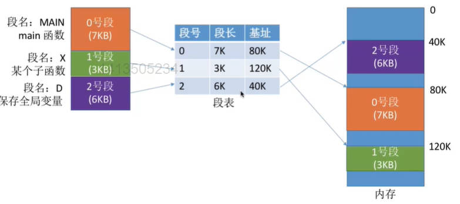

# 内存管理

# 1. 内存管理基本概念

## 1.1 内存管理的主要功能

- 内存空间的分配与回收

  记录哪些内存区域已经被分配了，哪些还空闲

  进程结束后如果回收进程占用的内存空间

  新进程来了它应该放在哪里

- 内存空间的扩展

  虚拟内存
  把物理上很小的内存扩展为逻辑上很大的内存

- 提供地址转化功能

  负责程序的逻辑地址与物理地址的转换

  三种装入方式

- 内存保护

  让各个进程只能访问自己的内存空间

  - 在CPU中设置一对上、下限寄存器，存放进程的上、下限地址。进程的指令要访问某个地址时，CPU检查是否越界。

  - 采用重定位寄存器(又称基址寄存器)和界地址寄存器(又称限长寄存器)进程越界检查。

    重定位寄存器中存放的是进程的起始物理地址。界地址寄存器中存放的是进程的最大逻辑地址。

## 1.2 基础概念解释

**内存：** 是用于存放数据的硬件。程序执行前需要先放到内存中才能被CPU处理。

**存储单元：** 将内存划分为一个个的存储单元来储存不同进程的数据
- 如果计算机“按字节编址”，则每个存储单元大小为1字节，即1Byte，即8个二进制位
- 如果字长为16位的计算机“按字编址”，则每个存储单元大小为一个字。每个字的大小就是字长16个二进制位

**内存地址：** 通过给内存中的存储单元编地址来区分各个程序的数据是放在什么地方的

**地址长度：** 要多少个二进制位才能表示相应数目的存储单元
- 1Kbit = 2¹⁰bit 、 1M = 2²⁰位、  1G = 2³⁰位
- 比如4GB内存，就有4*2³⁰个Byte,即2 * 2³²Byte(字节)，需要2³²个地址来一一标识(按字节编址)，也即需要32个二进制位来表示(0~2³²-1)这么多个地址

## 1.3 进程在内存中的运行原理

进程在内存中存储时分为 程序段 数据段 和 PCB

CPU从程序段中取出指令并执行

指令会告诉CPU应该去内存的哪个地址存/取数据，但是实际在生成机器指令的时候并不知道该进程的数据会被放到什么位置。

所以编译生成的指令中一般是使用逻辑地址(相对地址)。实际放入内存中时再想办法根据起始位置得到“绝对地址”

- 逻辑地址(相对地址)：记录该地址相对于进程起始位置的地址
- 物理地址(绝对地址)：记录在内存中的实际位置

**从代码到可执行程序运行的过程：**

- 编译

    由编译程序将用户源代码编译成若干个目标模块

    (编译就是把高级语言翻译成机器语言)

- 链接

    由链接程序将编译后形成的一组目标模块，以及所需库函数链接在一起，形成一个完整的装入模块

- 装入(装载)

    由装入程序将装入模块装入内存运行

    在这一步实现逻辑地址到物理地址的转换

**链接的三种方式：**
1. 静态链接

    在程序运行之前，先将个目标模块及它们所需的库函数连接成一个完整的装配模块，之后不再拆开

2. 装入时动态链接

    将各目标模块装入内存时，边装入边动态链接

3. 运行时动态链接

    在程序执行时，需要哪个模块链接哪个模块

**装入的三种方式：**

用三种不同的方法完成逻辑地址到物理地址的转换
1. 绝对装入

    在编译时，如果提前知道此程序将放到内存中哪个位置，编译程序就可以直接修改指令中的相对位置为绝对位置再装入。

    只适用于单道程序环境。因为单道程序环境一时刻只有一个进程运行，才能提前确定要放入内存中的位置。

2. 静态重定位(可重定位装入)

    在装入时将目标程序中的指令和数据地址由逻辑地址改为物理地址，该修改过程称为重定位。

    由于地址变换是在进程装入时一次完成的，因此称为静态重定位

    - 在一个作业装入内存时，必须分配其要求的全部内存空间，如果没有足够内存，就不能装入

    - 作业一旦进入内存后，在运行期间就不能再移动，也不能再申请内存空间

3. 动态重定位(动态运行时装入)

    在装入时不修改，直接以逻辑地址存入内存中，但是增加一个重定位寄存器记录进程的起始位置。在程序真正运行时，CPU去拿地址的时候会把地址先和重定位寄存器中的地址相加。

    - 采用动态重定位时允许程序在内存中发生移动
    - 可以将程序分配到不连续的存储区中
    - 在程序运行前只需装入它的部分代码即可投入运行，然后在程序运行期间，根据需要动态申请分配内存
    - 便于程序段的共享，可以向用户提供一个比存储空间大得多的地址空间

## 1.4 进程的内存映像

当一个程序调入内存运行时，就构成了进程的内存映像

内存映像包括以下几部分

- 代码段：程序的二进制代码，只读，可以被多个进程共享

- 数据段：存储静态变量和全局变量

  实际上是两个段，未初始化数据放在.bss中，已初始化数据放在.data中

- 进程控制块PCB：存放在系统区，通过PCB来管理和控制进程

- 堆：用来存放动态分配的变量，即引用类型的变量。大小可变

- 栈：用于存放局部变量。大小可变

***
***

# 2. 内存空间的扩充

内存空间的扩充主要使用覆盖技术和交换技术

覆盖技术针对于一个程序，交换技术针对多个进程之间

## 2.1 覆盖技术

**基本思想：** 将程序分为多个段(多个模块)。常用的段常驻内存，不常用的段在需要时调入内存。

**内存分区：** 分为一个 固定区 和多个 覆盖区

需要常驻内存的段放在“固定区”中，调入后除非运行结束否则不再调出。不常用的段放入 覆盖区，需要时调入内存，用不到时调出内存。

**覆盖结构举例：**

**缺点：** 操作系统不知道程序的调用结构，必须由程序员声明覆盖结构，然后操作系统完成自动覆盖

- 对用户不透明(不透明指能看见)，增加了用户编程负担。

    覆盖技术只用于早期的操作系统中，现在已成为历史

## 2.2 交换技术

**基本思想：** 内存空间紧张时，系统将内存中的处于等待状态的进程暂时换出外存（换出），把外存中某些已具备运行条件的进程换入内存（换入），中级调度采用的就是交换技术

进程的PCB不会被换出，因为要用于记录进程被放在外存哪里，进程执行进度等信息

**技术实现：**

1. 把磁盘空间分为文件区和对换区两部分
   
   - 文件区主要用于存放文件，主要追求存储空间的利用率，因此对文件区空间的管理采用离散分配方式
   - 对换区追求换入换出速度，因此采用连续分配方式。以提高I/O速度

2. 在许多进程运行且内存吃紧时进行交换，系统负荷降低时就暂停
3. 应该换出哪些进程

    - 优先换出阻塞进程
    - 换出优先级低的进程
    - 为了防止优先级低的进程在被调入内存后很快又被换出，有的系统还会考虑进程在内存的驻留时间

PCB会常驻内存，不会被换出外存

**交换技术现在的应用：**

Linux系统中有一个Swap空间，就是用于内存与硬盘的空间交换。

交换技术还可以用于解决分段存储产生的外部内存碎片，将内存中的进程换出再换入，将原来不连续的空闲空间凑成连续的，来让其他进程进入（紧凑技术）。

***
***

#  3. 内存空间的分配

连续分配管理方式：单一连续分配、固定分区分配、动态分区分配

非连续分配管理方式

## 3.1 连续分配管理方式

连续分配：指为用户进程分配的必须是一个连续的内存空间

### 3.1.1 单一连续分配：

内存被分为系统区和用户区

- 系统区：用于存放操作系统相关数据

    通常位于内存的低地址部分

- 用户区：用于存放用户进程相关数据

    用户程序独占整个用户区，也就是说内存中只能有一道用户程序

优点：

- 实现简单
- 无外部碎片
- 可以采用覆盖技术扩充内存
- 不一定需要采取内存保护

缺点：
- 只能用于单用户、单任务的操作系统中

- 有内部碎片

        内部碎片：
        指分配给某进程的内存区域中，
        有些部分没有用上

- 存储区利用率低

### 3.1.2 固定分区分配

将整个用户空间划分为若干个固定大小的分区，在每个分区中只装入一道作业

**划分分区的不同方法：**

- 分区大小相等

    适合用于用一台计算机控制多个相同对象

    缺点是缺乏灵活性，程序太大无法装入，程序太小又产生浪费

    
- 分区大小不等

    增加了灵活性，可以满足不同大小的进程需求

    根据常在系统中运行的作业大小情况进行划分

    

**分区说明表：**

操作系统建立的一个数据结构，用于实现各个分区的分配与回收，通常是将分区按大小排队

**优点：**

- 实现简单
- 无外部碎片

**缺点：**

- 当用户程序太大时，可能所有的分区都不能满足需求，此时不得不采用覆盖技术来解决，但这样又会降低性能

- 会产生内部碎片，内存利用率低

### 3.1.3 动态分区分配

又称可变分区分配

不会预先划分内存分区，而是在进程装入内存时，根据进程的大小动态地建立分区

**空闲分区表、空闲分区链：**

使用空闲分区表 或 空闲分区链记录内存的使用情况，和固定分区的分区说明表差不多，但是只记录空闲的区域

**动态分区的回收：**

- 回收区的后面/前面有一个相邻的空闲分区，会将两个分区合二为一
- 回收区的前、后都有一个相邻的空闲分区，会把三个分区全部合并
- 回收区的前、后都没有相邻的空闲分区，就新增一个空闲表表项，即变为独立空闲分区

动态分区分配没有内部碎片，但是有外部碎片

- 内部碎片：分配给某进程的内存区域中，有些部分没有用上

    比如进程需要10MB而分配给它15MB，有没有用上和进程本身没关系，只和分配有关系

- 外部碎片：是指内存中的某些空闲分区由于太小而难以利用

    可以通过紧凑(拼凑，Compaction)技术来解决外部碎片。让其他进程挤一挤把剩余空闲区间变成连续的。但是紧凑的时间成本很高

**动态分区分配算法：**

- 首次适应算法(First Fit)

    - 算法思想：每次都从低地址开始查找，找到第一个能满足大小的空闲分区 

    - 具体实现：空闲分区以地址递增的次序排列。每次分配内存时顺序查找空闲分区链

    - 缺点：每次都从链头(低地址)开始查找，可能会在低地址部分留下很多小的空闲分区，那之后每次查找都要经过这些分区，增加了查找的开销

    - 优点：每次都从低地址的小分区检索，这样更有可能利用掉低地址部分的小分区，也更有可能把高地址部分的大分区保留下来

- 最佳适应算法(Best Fit)

    - 算法思想：优先使用更小的空闲区

    - 具体实现：将空闲分区按容量递增的次序链接，顺序查找空闲分区链。

        分配完之后再按照空闲分区大小重新排列

    - 缺点：每次都选最小的分区进行分配，会留下越来越多的、很小的、难以利用的外部碎片。

- 最坏适应算法(Worst Fit)

    - 算法思想：与最佳适应算法相反，优先使用最大的连续空闲区，避免分配后剩余大量外部碎片

    - 具体实现：空闲分区按容量递减次序链接。

    - 缺点：会导致较大的连续空闲区被迅速用完，如果之后有 大进程 到达，就没有内存分区可用了。

- 邻近适应算法(Next Fit)

    - 算法思想：解决首次适应算法问题。每次都从上次查找结束的位置开始检索

    - 具体实现：空闲分区以地址递增的顺序排列(可以排成一个循环链表)。每次分配内存时从上次查找结束的位置开始查找空闲分区。

    - 与首次适应算法的优点和缺点相反

    **综合来看，首次适应算法最好**

***

## 3.2 非连续空间分配

### 3.2.1 基本分页存储管理

**页框(page frame) 和 页**

- 页框：将内存空间分为一个个大小相等的分区，每个分区就是一个“页框”

    （页框 = 页帧 = 内存块 = 物理块 = 物理页面）。

- 页框号：每个页框有一个编号，即“页框号”，从0开始

    页框号 = 页帧号 = 内存块号 = 物理块号 = 物理页号

- 页 / 页面：将进程的逻辑地址空间分为与页框大小相等的一个个部分，称为页或页面

- 页号：每个页面的编号

操作系统以页框为单位为各个进程分配内存空间。进程的每个页面分别放入一个页框中。页面与页框一一对应

**页表**

用于记录进程的每个页面在内存中实际存放的位置，存储的实际上是该页在物理内存中的块号

每个进程有自己的页表

每个页表项由 “页号” 和 “块号” 组成

- 页号占的空间：由于页表项连续存放，因此页号是隐含的，不占存储空间。相当于数组的下标

- 块号占的空间：块号的大小就是可以用几个字节来表示所有内存地址。也就是页表项的大小

    为了方便页表的查询，通常会让一个页表项占据更多的字节，使得每个页面恰好可以装得下整数个页表项

**地址的转换**

1. 确定逻辑地址对应的**页号P**

    `页号=逻辑地址/页面长度(取整)`

2. 通过页表，找到P号页面对应的内存块号，并算出该内存块的起始地址

3. 确定逻辑地址A的**页内偏移量W**

    `页内偏移量 = 逻辑地址 % 页面长度(取余)`

    页面偏移量所占的位数也直接决定页面大小

物理地址 = P号页面在内存中的起始地址 + 页内偏移量W

可以直接通过对逻辑地址拆分获得页号和页内偏移量

**基本地址变换机构**

用于实现逻辑地址到物理地址转换的一组硬件机构

页表寄存器(PTR)：存放页表在内存中的起始地址F和页表长度M(就是页表中页号的数量)。

进程未执行时，页表的始址 和 页表长度 放在进程控制块(PCB)中，当进程被调度时，操作系统内核会把他们放到页表寄存器中

1. 根据逻辑地址计算出(切分出)页号、页内偏移量

2. 通过页表长度判断页号是否越界，如果页号大于等于页表长度就产生越界中断

3. 通过`页表始址 + 页号 * 每个页表项长度` 计算出指定页号对应的页表项地址，并在该页表项中取出对应的内存块号

4. 用内存块号 + 页内偏移量 得到物理地址

页式管理中地址是一维的，因为只需要逻辑地址这一个信息就可以找到对应的地址(页表大小、页表项大小默认知道)

**具有快表的地址变换机构**

快表，又称联想寄存器(TLB,Translation lookaside buffer，相联存储器),是一种访问速度比内存块很多的高速缓存

用来存放最近访问的页表项的副本，对应的内存中的页表称为慢表

1. 根据逻辑地址分为 页号 和 业内偏移量

2. 判断页号是否越界，然后去快表中查找对应页号，查到的话直接得到内存块号获取数据

3. 如果未命中，就去内存中的慢表查找，并将找到的项copy到快表一份。

**两级页表**

单级页表的问题

- 页表需要存储在连续的内存空间中，会占用很多连续空间
- 根据局部性原理，进程一段时间内可能只需要访问某几个特定的页面，没必要让整个页表常驻内存

所以我们可以把页表再分页，为离散分配的页表再建立一张页表，称为页目录表（外层页表，或顶层页表），原来的页表称为二级页表

将地址划分为 一级页号 + 二级页号 + 页内偏移量

在进程执行时，只需要将最外层页表调入内存，进程的页表和存数据的页面可以在需要时再调入内存

采用多级页表机制时，顶级页表最多只能有一个页面

两级页表的访存次数：三次(N级是N+1次)

1. 访问内存中的页目录表

2. 根据页目录表的地址访问内存中的二级页表

3. 根据页表查到的地址访问目标内存单元

***

### 3.2.2 基本分段存储管理

**分段**

将进程的地址空间按照程序自身的逻辑关系划分为若干个段(段大小不等)，每个段都有一个段名，程序员根据段名编程，CPU根据段号工作

例如，用户进程空间可以分为代码段、堆段、栈段和数据段

内存以段为单位进行分配，每个段在内存中占据连续空间，各段之间可以不相邻（段内要求连续，段间不要求连续）

逻辑地址可分为 段号(段名) + 段内地址(段内偏移量)

- 段号的位数决定了每个进程最多可以分几个段
- 段内地址位数决定了每个段的最大长度是多少

在段式系统中，地址空间是二维的，因为用户必须显式提供段号和段内偏移量两个数据（在高级程序设计语言中，提供段号和段内偏移量的工作由编译程序完成）

**段表**

记录物理内存中各个逻辑段的存放位置的段映射表，简称段表

- 每个段对应一个段表项，要显式记录段的长度

- 每个段表项的长度相同的，因此在段表中段号可以是隐含的

**地址变换过程**

段表寄存器：保存段表始址F + 段表长度M。存储在PCB中，进程被调用时调入内存

1. 根据逻辑地址得到段号 段内地址

2. 如果段号 >= 段表长度，则产生越界中断

3. 查询段表，找到对应的段表项

4. 检查段内地址是否超过段长，超过则产生越界中断

5. 计算得到物理地址 ，= 段基址b + 段内地址W

### 3.2.3 分段、分页管理的对比

- 页是信息的物理单位，段是信息的逻辑单位

- 分页主要目的是实现离散分配，提高内存利用率；分段的主要目的是更好地满足用户需求

- 分页是系统管理地需要，是系统行为，对用户不可见；分段对用户是可见的

- 页的大小固定且由系统决定；段的长度不固定，取决于用户编写的程序

- 分页的用户进程地址空间是一维的，程序员只需给出一个记忆符即可表示一个地址；分段的用户进程地址空间是二维的，程序员在标识一个地址时，需要段名 和 段内地址

- 分段比分页更容易实现信息的共享和保护

分段也可以引入快表机构

***

### 3.2.4 段页式管理方式

**分段、分页优缺点**

分页管理

- 优点：内存空间利用率高，不会产生外部碎片，只会有少量的页内碎片

- 缺点：不方便按照逻辑模块实现信息的共享和保护

分段管理

- 优点：很方便按照逻辑模块实现信息的共享和保护

- 缺点：如果段长过大，为其分配很大的连续空间会很不方便。会产生外部碎片

**段页式管理**

段页式管理 = 分段 + 分页

对内存空间的管理和分页存储管理一样，将内存空间分为大小相同的内存块/页框/页帧/物理块，以块为单位分配内存

将进程按逻辑模块分段，再将各段分页

逻辑地址 = 段号 + 页号 + 页内偏移量

- 段号位数决定了每个进程最多可以分为几个段

- 页号位数决定了每个段最大有多少页

- 页内偏移量决定了页面大小、内存块大小是多少

分段是可见的，分页是不可见的。用户只需要提供段号和段内地址，因此段页式系统的地址空间是二维的

**段表、页表**

每个段表项对应进程中的一段，段表项记录该段在内存中的始址和长度，段表的段号隐含。页表的页号隐含

一个进程对应一个段表，每个段表项对应一个页表

**地址转换过程**

段表寄存器：储存段表始址F和段表长度M。放在进程PCB中，进程运行时调入内存。

1. 根据逻辑地址得到 段号 页号 页内偏移量

2. 判断段号是否越界

3. 根据段表始址查询段表，找到对应的段表项，得到该段对应的页表起始地址和该段长度。

4. 根据段表项中的页表长度检查页号是否越界

5. 根据 页表起始地址+页号 找到对应的页表项，得到对应的内存块号

6. 根据内存块号、页内偏移量得到最终的物理地址

共三次访存，访问段表，访问页表，访问内存单元

***
***

# 4. 虚拟内存

## 4.1 为什么要虚拟内存

### 4.1.1 传统存储管理方式特征

在第3点中讨论的都是传统内存管理策略，有以下特征：

**一次性：**

作业必须一次性全部装入内存后才能开始运行

- 当作业很大时，不能全部装入内存，导致大作业无法运行

- 当大量作业要求运行时，由于内存无法容纳所有作业，导致多道程序并发度下降

**驻留性：**

一旦作业被装入内存，就会一直驻留在内存中，直至作业运行结束。但事实上只需要访问作业的一小部分数据即可正常运行

由此可知，传统内存管理策略浪费了宝贵的内存资源

### 4.1.2 局部性原理

**时间局部性：**

如果访问过某个指令或数据，那么不久之后很可能再次访问

因为程序中存在大量的循环

**空间局部性：**

一旦程序访问了某个存储单元，不久之后其附近的存储单元也很有可能被访问

因为很多数据在内存中都是连续存放的，程序的指令也是顺序的存放

Dijkstra关于goto语句有害的著名论文就出自局部性原理，即goto语句会破坏局部性原理，导致运行缓慢

### 4.1.3 虚拟内存的定义和特征

在操作系统的管理下，在用户看来似乎有一个比实际内存大得多的内存，这就是虚拟内存

基于局部性原理，在程序装入时，可以将程序中很快用到的部分装入内存，暂时用不到的部分留在外存。

在程序执行时，当访问的信息不在内存时，由操作系统负责将所需信息从外存调入内存，然后继续执行

若内存空间不够，由操作系统负责将内存中暂时用不到的信息换出外存

**虚拟内存特征：**

- 多次性：无需在作业运行时一次性全部装入内存，而是允许被分成多次调入内存

- 对换性：在作业运行时无需一直常驻内存，而是允许在作业运行过程中，将作业换入、换出

- 虚拟性：从逻辑上扩充了内存的容量，使用户看到的内存比实际上大得多。

### 4.1.3 虚拟内存技术的实现

虚拟内存技术允许一个作业分多次调入内存，因此要建立在离散分配的内存管理方式基础上

主要有以下三种实现方式：

- 请求分页存储管理

- 请求分段存储管理

- 请求段页式存储管理

操作系统负责：

- 请求调页(调段)，就是将所需信息从外存调入内存

- 页面置换(段置换)，将内存中暂时用不到的信息换出到外存

## 4.2 请求分页管理方式

就是在基本分页存储管理的基础上增加 请求调页 和 页面置换 功能

为实现请求分页，系统要提供以下硬件支持：

- 页表机制：提供请求页表
- 缺页中断结构
- 地址变换机构

### 4.2.1 请求页表

为了发现和处理 要访问的内存不在内存中的 情况，请求页表项中需要增加以下字段：

- 状态位：记录当前页是否调入内存

- 访问字段：记录页面相关访问信息，比如访问了多少次。

- 修改位：页面调入内存后是否被修改过，判断调出内存时是否需要将外存数据同步

- 外存地址：页面在外存中的存放位置

### 4.2.2 缺页中断机构

当访问的页面不存在时，便产生一个缺页中断，然后由操作系统的缺页中断处理程序处理中断

此时缺页的进程阻塞，放入阻塞队列，调页完成后再将其唤醒，放回就绪队列

**调页的过程：**

- 如果内存中有空闲块，则为进程分配一个空闲块，将所缺页面装入该块，并修改表中相应的页表项

- 如果内存中没有空闲块，则由页面置换算法选择一个页面淘汰，若被淘汰页面在内存期间被修改过，则要将其写回外存。

**缺页中断的特征：**

- 内中断： 缺页中断是因为当前执行的指令想要访问的目标页面未调入内存而产生的，属于内中断——故障

- 多次中断： 一条指令在执行期间，可能产生多次缺页中断。比如copy A to B，调用A和B可能产生两次中断

### 4.2.3 地址变换过程

在分页系统地址变换机构的基础上，加了后面几个步骤

1. 通过逻辑地址得到页号和页内偏移量，检查页号是否越界

2. 通过页号查询快表，如果命中直接访问。(快表中有的页面一定在内存中，若某个页面被换出外存，则快表中相应表项要删除)

3. 快表未命中，去请求页表中查找，找到对应页表项

4. **请求调页：找到对应页表项后，检查该页是否在内存中，是否需要请求调页**

    调页后会将调入页面对应的表项直接加入快表

5. **页面置换：需要调入页面，但没有空闲内存块时执行**

6. **如果发生调页或页面置换，需要修改请求页表中新增的表项**

## 4.3 页面置换算法

当内存满时选择将哪个页面换出内存

页面的换入换出需要磁盘I/O，会有较大开销，因此好的页面置换算法应该追求更少的缺页率

### 4.3.1 最佳置换算法(OPT)

**算法思想：** 为了保证最低的缺页率，每次淘汰的页面将是以后永不使用，或者在最长时间内不再被访问的页面

**实现方法：** 执行的前提是提前知道之后要访问的所有页面序列，但在实际执行中是不可能的，操作系统无法提前预判页面访问序列，所以不可实现

算法性能最好，但无法实现

### 4.3.2 先进先出置换算法(FIFO)

**算法思想：** 每次淘汰的页面是最早进入内存的页面

**实现方法：** 把调入内存的页面根据调入的先后顺序排成一个队列，需要换出页面时选择队头页面。队列的最大长度取决于系统为进程分配了多少个内存块

    Belady异常：
    当为进程分配的物理块数增大时，
    缺页次数不减反增的异常现象

只有FIFO算法会产生Belady异常

FIFO算法虽然实现简单，但是先进入的页面有可能最经常被访问，因此算法性能差

### 4.3.3 最近最久未使用置换算法(LRU)

**算法思想：** 每次淘汰的页面是最近最久未使用的页面

**实现方法：** 在页表项中用访问字段记录该页面自上次被访问以来所经历的时间t。淘汰时选择现有页面中t值最大的

该算法的实现需要专门的硬件支持，算法性能好但是实现困难，开销大。(性能是最接近最佳置换算法的)

### 4.3.4 时钟置换算法(CLOCK) / 最近未用算法(NRU)

**简单时钟置换：**

为每个页面设置一个访问为，再将内存中的页面通过链接指针链接成一个循环队列。当某页被访问时，其访问位置为1。

当需要淘汰一个页面时，依次扫描这个队列：如果访问位是1，则改为0并继续扫描；如果访问位是0，则替换这个页面。也就是替换访问位为0的页面。

第一轮扫描时已经把所有访问位都置为0，所以最多两轮扫描

**改进型的时钟置换算法：**

如果被淘汰的页面有修改过，就要在淘汰是将其写回外存，执行I/O操作比较费时，所以我们应该优先淘汰没被修改过的页面。

为各个页面增加一个修改位，=0时表示没被修改过，=1表示修改过

用`(访问位，修改位)`表示个页面状态

算法规则：将所有可能被置换的页面排成一个循环队列

1. 第一轮：从当前位置开始扫描到第一个(0,0)的页面用于替换。本轮扫描不修改任何标志位

    第一优先级：最近没访问过也没修改过

2. 第二轮：若第一轮扫描失败，则重新扫描，查找第一个(0,1)的页面用于替换。本轮将所有扫描过的页面访问位设为0

    第二优先级：最近没访问但修改过

3. 第三轮：若第二轮扫描失败，则重新扫描，查找第一个(0,0)的页面用于替换。本轮扫描不修改任何标志位

    第三优先级：最近访问过但没修改过

4. 若第三轮扫描失败，则重新扫描，查找第一个(0,1)的页面用于替换

    第四优先级：最近访问过也修改过

由于第二轮已将所有访问位置为0，所以第三、四轮必会选中一个，最多四轮扫描

***

## 4.4 其他概念

### 4.4.1 驻留集

指请求分页存储管理中给进程分配的物理块的集合

在采用了虚拟存储技术的系统中，驻留集大小一般小于进程的总大小

如果驻留集太小，会导致缺页频繁；驻留集太大，比如和进程一样大，则完全不会缺页，但是会导致多道程序并发度下降，资源利用率降低

分配：

- 固定分配：操作系统为每个进程分配一组固定数目的物理块，进程运行期间不再改变。即驻留集大小不变

    只能局部置换

- 可变分配：先为每个进程分配一定数目的物理块，在进程运行期间，可根据情况做适当的增加或减少

置换：

- 局部置换：发生缺页时只能选进程自己的物理块进行置换

- 全局置换：可以将操作系统保留的空闲物理块分配给缺页进程；也可以将别的进程持有的物理块先置换到外存，再分配给缺页进程

    意味着进程拥有的物理块数会改变，不可能固定分配

### 4.4.2 页面分配、置换策略

- 固定分配，布局置换

- 可变分配，全局置换

    操作系统会保持一个空闲物理块队列，只要某进程发生缺页，都将获得新的物理块。当没有空闲物理块时，选择一个未锁定的页面换出外存，这个被换出的页面可能是任何进程的

- 可变分配，局部置换

    当某进程发生缺页时，只允许从该进程自己的物理块中选出一个换出外存。

    如果进程在运行中频繁缺页，系统会为该进程多分配几个物理块；如果进程在运行中缺页率特别地，则可适当减少分配给该进程的物理块

### 4.4.3 何时调入页面

- 预调页策略：一次调入若干个相邻的页面

    需要预测不久之后可能访问的页面，但是欲测成功率不高。所以这个策略一般用于进程的首次调入，由程序员指出应该先调入哪些部分

    运行前调入策略

- 请求调页策略：进程在运行期间发现缺页时调入

    每次调入一页，缺哪页调哪页。每次调页都要I/O操作，开销较大

    运行时调入策略

### 4.4.4 从何处调入页面

外存(磁盘)分为对换区和文件区，对换区读写速度更快，优先从对换区调入

- 系统有足够的对换区空间：调入、调出都在内存与对换区进行

    进程运行前，需要将进程相关数据从文件区复制到对换区

- 系统缺少足够的对换区空间

    不会被修改的数据直接从文件区调入

    可能被修改的部分，换出时需写回磁盘对换区，下次需要时再从对换区调入

- UNIX方式：

    运行之前进程有关数据都放在文件区。未使用过的页面都从文件区调入，若被使用过的页面需要换出，则写回对换区，下次需要时从对换区调入

### 4.4.5 抖动(颠簸)现象

刚刚换出的页面马上又要换入内存，刚刚换出的内存马上又要换出内存，这种频繁的页面调度行为称为抖动

产生抖动的主要原因是进程频繁访问的页面数目高于可用的物理块数，分配给进程的物理块数不够

工作集 为了研究应该为每个进程分配多少个物理块

### 4.4.6 工作集

指在某段时间间隔内，进程实际访问页面的集合

驻留集大小不能小于工作集大小，否则运行过程中将频繁缺页

# 5. 内存映射文件

是操作系统向上层程序员提供的系统调用功能

- 方便程序员访问文件数据

- 方便多个进程共享同一个文件数据

**传统文件访问方式**

- open系统调用——打开文件

- seek系统调用——将读写指针移到某个位置

- read系统调用——从读写指针所指位置开始读入若干数据(从磁盘读入内存)

- write系统调用——将内存中的指定数据写回磁盘(根据读写指针位置确定要写回什么位置)

**内存映射文件的访问方式**

- open系统调用——打开文件

- mmap系统调用——将文件映射到进程的虚拟地址空间(只是建立映射关系，没有实际将数据调入，相当于一个缺页的状态)，返回一个指向内存中映射的起始地址的指针

- 以访问内存的方式访问文件数据，当指定读取位置后，操作系统会发生缺页并将指定位置数据读入内存

- 进程关闭文件时，操作系统自动将文件被修改的数据写回磁盘

**共享同一个文件**

通过修改不同进程中的页表，将相同内存映射到同一个物理地址中

# 6. Linux内存管理

## 6.1 Intel x86处理器内存管理机制

Intel从80286开始使用的是段式内存管理，从80386中实现了页式内存管理。但是这个页式内存管理并没有绕开段式内存管理，实际上使用的是段页式内存管理

**地址转换的四个地址：**

- 逻辑地址，logical address

  寻址的起点，指令中存放的地址

  划分为 段选择子（段选择符，selector）和 段内偏移量（Offset）

  - 段选择子：包括索引号，表指示器（TL），请求者特权级（RPL）等标志位

- 虚拟地址，virtual address

  经段式内存管理映射过的地址

- 线性地址，linear address

  所有在Linear Address Space中的地址都可以叫做线性地址，事实上跟虚拟地址是一个东西

- 物理地址，physical address

  线性地址经过页式转换之后得到的地址，数据存储的实际地址，寻址的终点

**寻址过程：**

`Logical Address -> Virtual Address/Linear Address -> Physical Address`

一、逻辑地址转换为线性地址（段式存储）：

1. 将逻辑地址划分为selector和offset，在selector中拿到段号
2. 用段号去GDT（全局描述符表，其实就是一张段表）中找到对应段表项，段表项中存储的是对应段的段内描述符，段内描述符中存储Segmeng Base Address（段基地址），拿到段基地址
3.  段基地址 + 段内偏移Offset得到虚拟地址Virtual Address，如果该地址在Linear Address Space内，那么该虚拟地址也就是线性地址Linear Address

二、线性地址转换为物理地址（页式存储）：

1. 将线性地址划分为 页目录号（Dir） 页号（Table） 业内偏移量（Offset）
2. 用页目录号在Page Directory（页目录表）中找到指定页目录项，得到页表起始地址
3. 页表起始地址+页号 在Page Table（页表）中找到指定页表项，得到内存物理块号
4. 内存物理块号 + Offset（页内偏移量）得到Physical Address（物理地址）

所以，在x86处理器中，页式内存管理就是 在由段式内存管理所映射的地址上 再加一层地址映射

## 6.2 Linux内存管理机制

Linux中页面大小为4KB

在Linux中，本来只需要靠页式内存管理就可以完成内存映射，但是由于Intel x86 CPU一律对程序中的地址先进行段式映射，再进行页式映射，Linux内核也只能服从于Intel。

Linux内核所采取的办法是，让段式映射实际上不起作用。将每个段的Segment Base Address（段基地址）都设置为0，并且Offset（段内偏移量）占整个逻辑地址，这样一来 逻辑地址=虚拟地址=线性地址，事实上就屏蔽了段式映射。

**对虚拟空间的划分**

在Linux中，虚拟空间内部被划分为内核空间和用户空间，内核空间在高位，用户空间在低位。

内核空间中的数据在物理空间中实际上只会存储一份，但是会关联给所有虚拟空间。
