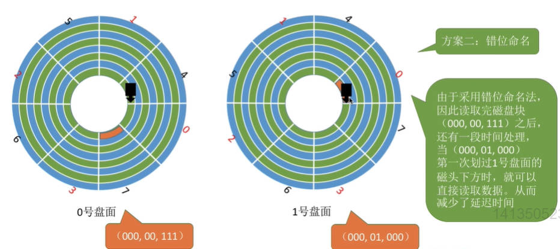

# 1. 文件系统基础

### 文件的属性

- 文件名

- 标识符：是操作系统用于区分各个文件的一种内部名称，对用户毫无可读性

- 类型

- 位置：文件存放的路径(用户使用)、在外存的地址(操作系统使用)

- 大小

- 创建时间、上次修改时间、文件所有者信息

- 保护信息

### 文件内部数据如何组织

在文件的逻辑结构章节探讨

- 无结构文件：由一系列二进制或字符流组成

    比如txt文本文档

- 有结构文件：由一个一个记录组成

    比如excel和数据库

### 文件之间如何组织

目录结构

### 操作系统向上提供的功能

各种系统调用

- 创建文件——create系统调用

- 读文件——read系统调用

- 写文件——write系统调用

- 删除文件——delete系统调用

- 打开文件——open系统调用

    读、写文件之前需要打开文件

- 关闭文件——close系统调用

    读、写文件之后需要关闭文件】

### 文件如何存放在外存

文件的物理结构

外存也分为一个一个存储单元，类似于内存分为一个个“内存块”，外存会分为一个个“块/磁盘块/物理块”。

操作系统以“块”为单位为文件分配存储空间

### 如何管理外存中的空闲块

存储空间的管理

### 其它功能

文件共享、文件保护

***
***

# 文件的逻辑结构

文件内部的数据是如何组织起来的

类似于数据结构的“逻辑结构”和“物理结构”，比如线性表是逻辑结构，顺序表和链表是对应的物理结构

## 无结构文件

文件内部的数据就是一系列的二进制流或字符流。

又称“流式文件”，如txt文件

没有明显的结构特性，不用讨论无结构文件的逻辑结构问题

***

## 有结构文件

由一组相似的记录组成，又称“记录式文件”。

每条记录又由若干个数据项组成。如数据库表文件

根据各条记录的长度(占用的存储空间)是否相等，可分为定长记录和可变长记录

### 顺序文件

文件中的记录逻辑上一个一个的顺序排列

**根据每条记录所占的存储空间**

- 可变长记录

    需要显示地给出记录长度

- 定长记录

**根据物理结构：**

- 顺序存储

    可变长无法实现随机存取，定长记录可实现随机存取

- 链式存储

    无法实现随机存取，每次只能从第一个记录开始依次往后查找

**根据记录的排序方式：**

- 串结构：记录之间的顺序与关键字无关

    可能是按照记录存入的时间排列顺序

    无法快速找到某关键字对应的记录

- 顺序结构：记录之间的顺序按关键字顺序排列

    可以快速找到某关键字对应的记录(如通过折半查找)

考题中的顺序文件默认是物理上顺序存储的顺序文件

### 索引文件

建立一张索引表以加快文件检索速度，每条记录对应一个索引项

索引表本身是定长记录的顺序文件，包括

`索引号-长度-指针`

如果将关键字作为索引号的内容，并且按关键字顺序排列，还可以支持按照关键字折半查找

可以用不同的数据项建立多个索引表

### 索引顺序文件

索引文件的缺点：每个记录对应一个索引表项，索引表可能会很大

索引顺序文件中，也会问文件建立一张索引表，但是一组记录对应一个索引表项。每个分组内的记录是顺序存储的

查找时可以先通过索引表找到分组所在位置，再在分组中找到指定表项

### 多级索引顺序文件

例如：对于一个含10^6个记录的文件，可以先每100个记录为一组建立一张低级索引表，则低级索引表中有10000个表项。

再将低级索引表中这10000个定长记录分组，每组100个，建立顶级索引表，则顶级索引表中共有100个表项

查找时平均需要查找50+50+50=150次

***
***

# 文件目录

目录本身就是一种有结构文件，由一条条记录组成。每条记录对应一个在该目录下的文件

## 文件控制块

目录文件中的一条记录就是一个文件控制块(FCB)

FCB的有序集合称为文件目录，一个FCB就是一个文件目录项

FCB中包含：

- 文件的基本信息

    **文件名、物理地址**、逻辑结构、物理结构等

- 存取控制信息

    是否可读\可写、禁止访问的用户名单等

- 使用信息

    如文件的建立时间、修改时间等

文件名和文件存放的物理地址是最重要最基本的，因为FCB的基本功能就是实现文件名和文件之间的映射，使用户可以实现按名存取

需要对目录进行的操作：

- 搜索：当用户使用文件时，要根据文件名搜索目录，找到该文件对应的目录项

- 创建文件：创建新文件时，要在其所属的目录中增加一个目录项

- 删除文件：删除文件时，需要在目录中删除相应的目录项

- 显示目录

- 修改目录：当文件的属性变化时需修改相应的目录项

***

## 目录结构

### 单级目录结构

早期操作系统中整个系统只建立一张目录表，每个文件占一个目录项

实现了按名存取，但是不允许文件重名。不适用于多用户系统

### 两级目录结构

早期的多用户操作系统采用，分为主文件目录和用户文件目录

- 主文件目录(MFD,Master File Directory)

    记录用户名及相应用户文件目录的存放位置

- 用户文件目录(UFD,User File Directory)

    由该用户的文件FCB组成

允许不同用户的文件重名

也可以在目录上实现访问限制(通过检查此时登录的用户名是否匹配)

### 多级目录结构(树形目录结构)

现在的操作系统使用的目录结构

用户要访问某个文件时要用文件路径名标识文件，各级目录之间用“\”隔开

**绝对路径：** 系统根据绝对路径一层一层找到下级目录

- 从外存读入根目录的目录表，找到指定的目录项

- 从外存读入对应的目录表，找到下一层目录项

一层目录需要读入依次目录表，多次访问外存

**当前目录(相对路径)：** 每次从根目录开始查找是很低效的，可以设置一个当前目录。当某个目录表已调入内存，可以把它设置为当前目录。之后就可以使用从当前目录出发的相对路径

树形结构不便于实现文件的共享

### 无环图目录结构

在树形目录结构的基础上，增加一些指向同一节点(这个节点就是用于共享的)的有向边，使整个目录成为一个有向无环图

用不同的文件名指向同一个文件，甚至可以指向同一个目录，以共享同一目录下所有内容

需要为每个共享结点设置一个共享计数器，用于记录此时有多少个地方在共享该结点。

当用户删除结点时，只是删除该用户的FCB，并使共享计数器-1。只有共享计数器减为零，才删除结点

只要其中一个用户修改了文件数据，那么所有用户都可以看到文件数据的变化

### 索引结点(对文件控制块的优化)

操作系统在查找时只用得到文件名这一个信息，而不需要文件其它信息

所以我们可以将其它信息放入索引结点中，这样FCB中就只剩下文件名和索引结点指针

当找到文件名对应的目录项时，才需要将索引结点调入内存

存放在外存中的索引结点成为“磁盘索引节点”，当索引结点放入内存后成为“内存索引结点”。内存索引节点中需要增加一些信息，比如：文件是否被修改、此时有几个进程正在访问该文件

***
***

# 文件的物理结构

文件的数据应该怎样存放在外存中

### 文件快、磁盘块

类似于内存分页，磁盘中的存储单元会被分为一个个块、磁盘块、物理块

磁盘块的大小与内存块、页面的大小相同

文件的逻辑地址 = (逻辑块号，块内地址)

操作系统要负责实现从逻辑地址到物理地址的映射

## 文件分配方式——连续分配

连续分配方式要求每个文件在磁盘上占有一组连续的块

逻辑块号到物理块号的映射：

文件目录中记录了文件存放的起始块号和长度(占用了几个块)

1. 用户给出要访问的逻辑块号

2. 操作系统找到该文件对应的目录项(FCB)

3. 物理块号 = 起始块号 + 逻辑块号

    需要检查用户提供的逻辑块号是否合法

优点：

- 可以直接通过逻辑块号算出对应的物理块号，因此连续分配支持顺序访问和直接访问(即随机访问)

   - 顺序访问：如果想访问块号2，必须先访问块号1

   - 直接访问(随机访问)：可以直接找到块号2存放的位置并访问

- 连续分配的文件在顺序读/写时速度更快，

    因为是连续存放，存放在相邻的磁盘块，磁头移动距离最短

缺点：

- 拓展不方便

    如果一个文件要拓展，如果文件后面已经没有相邻的空闲块，就需要把文件所有数据一起迁移

- 存储空间利用率低，会产生难以利用的磁盘碎片

    可以用紧凑来处理碎片，但是需要耗费很大的时间代价

## 文件分配方式——链接分配

链接分配采取离散分配的方式，可以为文件分配离散的磁盘块，分为隐式链接和显式链接两种

### 隐式连接

文件控制块(FCB)中存储起始块号和结束块号

除了文件的最后一个磁盘块之外，每个磁盘块中都会保存指向下一个盘块的指针，这些指针对用户是透明的

逻辑块号到物理块号的转变：

- 从目录项中找到起始块号(0号块)

- 将0号逻辑块读入内存，由此知道1号逻辑块存放的物理块号，于是读入1号逻辑块

- 通过1号逻辑块，再找到2号逻辑块的存放位置

- 以此类推......

读入i号逻辑块，总共需要i+1次磁盘I/O

缺点：

- 只支持顺序访问，不支持随机访问查找效率低

- 指向下一个块的指针占据少量存储空间

优点：

- 方便拓展文件

- 不会产生碎片，外存利用率高

### 显式链接

把用于链接文件各物理块的指针显式地存放在一张表中。即文件分配表(FAT,File Allocation Table)

目录中只需要记录文件的起始块号是哪个物理块号

FAT由物理块号和下一块的块号组成，记录了这个物理块链接的下一个物理块号。文件的最后一个块可以记为比如-1。

一个磁盘仅设置一张FAT，开机时，将FAT读入内存并常驻内存。

FAT的各个表项在物理上连续存储，且每一个表项长度相同，因此“物理块号”字段可以是隐含的

逻辑块号到物理块号的转变

- 用户给出要访问的逻辑块号，操作系统找到该文件对应的目录项

- 从目录项中找到起始块号，若给的逻辑块号>0，则查询内存中的文件分配表FAT，往后找到逻辑块号对应的物理块号

逻辑块号转换成物理块号的过程不需要读磁盘操作

优点：

- 既支持顺序访问，也支持随机访问

- 块号转换过程不需要访问磁盘，相比于隐式链接快很多

- 不会产生外部碎片，可以很方便地实现对文件地扩展

链接分配默认是隐式链接

## 文件分配方式——索引分配

索引分配允许文件离散地分配在各个磁盘块中，

系统会为每个文件建立一张索引表，索引表中记录了文件的各个逻辑块对应的物理块——建立了逻辑块号到物理块号的映射(类似于页表——建立了逻辑页面到物理页之间的关系)

存放索引表的磁盘块称为索引块、存放文件数据的磁盘块称为数据块

可以用固定的长度表示物理块号，因此索引表的逻辑块号可以是隐含的

逻辑块号到物理块号的转变：

- 用户给出要访问的逻辑块号，操作系统找到该文件对应的目录项FCB

- 从目录项中找到索引表存放位置，将索引表从外存读入内存，并通过索引表查找指定逻辑块号对应的物理块号

**优点：**

- 可以支持随机访问

- 文件拓展很容易实现，只需要给文件分配一个空闲块并增加一个索引表项

**缺点：** 索引表可能会很大

如果一个索引表很大，一个磁盘块装不下

### 链接方案

为该文件分配多个索引块(保存索引表的物理块)，将多个索引块链接起来存放。

如果文件很大，有很多索引块，这种方案找起来很麻烦，因为隐式链接不能随机存取

### 多层索引

建立多层索引，使第一层索引指向第二层的索引块，甚至建立更多的索引块

FCB中只需要记录顶级索引表的物理块号

若采用多层索引，每个索引表大小不能超过一个磁盘块

    假如磁盘块大小为1kB，一个索引表项占4B，
    则一个磁盘块只能存放256各索引项
    
    若某文件采用两层索引，那顶级索引表不能超过一个磁盘块，即256个索引项，对应256个二级索引表
    二级索引表也不能超过一个磁盘块，即256索引项，对应256个数据块
    
    所以文件最大长度是256*256=65535KB = 64MB

### 混合索引

多种索引分配方式的结合

例如：顶级索引表中既包含直接地址索引(直接指向数据块)，又包含一级间接索引，还包含两级间接索引

***
***

# 逻辑结构 与 物理结构 的区别

文件逻辑结构是用户自己决定的，对应的逻辑地址也是给用户使用的。(数据结构与算法)

我们可以自己决定使用顺序存储的方式存放数据(顺序表)还是用链式存储的方式存放数据(链表)，还是用学到的其它数据结构来存储

不管用什么数据结构，这些都是我们认为的，找数据时使用的也都是基于这些数据结构的逻辑地址

在用户看来，整个文件占用的都是连续的空间

操作系统不会管我们用的什么数据结构，反正都是一串二进制数字，直接往分好块的磁盘里面塞就好了。具体怎么塞用什么物理结构根逻辑结构完全没关系，是由操作系统决定的

当我们给出逻辑地址，操作系统会自动转化为物理地址并把想要的数据给我们

比如

- 逻辑结构中的索引文件

    索引表是用户自己建立的，是关键字到记录存放的逻辑地址的映射

- 物理结构中的索引分配

    索引表是操作系统建立的，是逻辑块号到物理块号的映射

***
***

# 文件存储空间管理(对空闲空间的管理)

## 存储空间的划分与初始化

安装系统时为磁盘分区(分卷，分为C、D、E等盘)就是划分存储空间

存储空间的划分：将物理磁盘划分为一个个文件卷(逻辑卷、逻辑盘)。有的系统支持多个物理磁盘组成一个文件卷

存储空间的初始化：将各个文件卷划分为目录区、文件区

- 目录区：放文件目录信息(FCB)、用于磁盘存储空间管理的信息。

    还有后面提到的空闲表、位示图、超级块等

- 文件区：用于存放文件数据

## 存储空间管理方法

### 空闲表法

在目录区建立一张空闲盘块表，记录空闲盘块号和其后紧跟的空闲盘块数

**分配磁盘块：** 与内存管理中的动态分区分配很类似，为一个文件分配连续的存储空间。适用于连续分配方式

可以采用首次适应、最佳适应、最坏适应等算法决定为文件分配哪个区间

**回收磁盘块：** 注意表项合并问题，与内存管理中的动态分区分配很类似

### 空闲链表法——空闲盘块链

以盘块为单位组成一条空闲链

操作系统保存着链头和链尾的指针

**分配磁盘块：** 若某文件申请k个磁盘块，就从链头开始依次摘下k个盘块分配，并修改链头指针

**回收磁盘块：** 回收的盘块依次挂到链尾，并修改空闲链的链尾指针

适用于离散分配的物理结构

### 空闲链表法——空闲盘区链

以盘区为单位组成一条空闲链

就是先把连续的空闲盘块组成盘区，再将这些盘区相连

操作系统保存着链头和链尾的指针

**分配磁盘块：** 若某文件申请k个盘块，则可以采用首次适应、最佳适应等算法，从链头开始检索，按算法规则找到一个大小符合要求的空闲盘区。

若没有合适的连续空闲块，也可以将不同盘区的盘块同时分配给一个文件

**回收磁盘块：** 若回收区和某个空闲盘区相邻，则需要将回收区合并到空闲盘区中。

若回收区没有和任何空闲区相邻，将回收区作为一个单独的空闲盘区挂到链尾

离散分配、连续分配都适用。为一个文件分配多个盘块时效率更高

### 位示图法

位示图：每个二进制位对应一个盘块，0代表空闲，1代表已分配(不同题目可能不同)。

位示图一般用连续的字表示，字中每一位对应一个盘块。因此可以用(字号，位号)对应一个盘块号，也可以描述为(行号，列号)

盘块号与(字号，位号)相互转换的公式：

若盘块号、字号、位号从0开始，n表示字长，则

`(字号，位号)=(i，j)的二进制位对应的盘块号b=ni+j`

**分配磁盘块：** 若文件需要k个块，

- 顺序扫描位示图，找到k个0(不必相邻)

- 根据(字号，位号)算出对应的盘块号，将相应盘块分配给文件

- 将相应位设置为1

**回收磁盘块：** 根据回收的盘块号计算出对应的字号、位号，将相应的二进制位设为0

连续分配、离散分配都适用

### 成组链接法

空闲表和空闲链表在大型文件系统中可能会很大。UNIX系统中采用了成组链接法

文件卷的目录区中专门用一个磁盘块作为“超级块”，当系统启动时需要将超级块读入内存，并且保证内外存中的超级块数据一致

空闲盘是分好组的

- 超级块中存储了下一组的空闲盘块数(100)，以及 组内所有的空闲块号(201~300)

- 每组的第一个盘块(300)，用来存储下一组的空闲盘块组的信息——下一个组共100个空闲盘块，从301~400

- 下一组的第一个盘块(400)，又用来指向下一组(7801~7900)......

- 当没有下一个空闲块时，第一个盘块就不需要存储下一个盘块的信息，可以设为特殊值-1。那么最后一个分组其实少一个空闲块

一个分组中的块号不需要连续

每一个分组的数量是有上限的，比如这个例子中是100

**分配磁盘块：** 

- 分配一个空闲块：

    检查第一个分组的块数是否足够，由于1<100足够，所以分配第一个分组中的1个空闲块，并修改响应数据(将空闲盘块数改为99)

- 分配100个空闲块

    - 检查第一个分组的块数，100=100，是足够的

    - 分配第一个分组中的100个空闲块。但是300号块内存放了下一组信息，因此需要把300号块的数据复制到超级块中再分配

分配更多的空闲块以此类推，当一个分组中所有空闲块都被分配前，记得把第一个块中存放的下一个块信息复制到超级块中

**回收空闲块：**

- 如果分组没满，直接把块加入分组中

- 如果分组都满了，就新建一个分组。(用“头插法”)

    将超级块中的数据复制到新回收的块中，并修改超级块的内容，让新回收的块成为第一个分组。

***
***

# 文件的基本操作

## 创建文件

当我们右键创建文件的时候，背后调用了create系统调用

**需要提供的几个主要参数：**

- 所需的外存空间大小

- 文件存放路径

- 文件名(默认为“新建文本文档.txt”)

**操作系统在处理Create系统调用时，主要做的事：**

- 在外存中找到文件所需的空间

- 根据文件存放路径的信息找到该目录对应的目录文件，在目录中创建该文件对应的目录项

## 删除文件

当我们删除文件时，背后调用了delete系统调用

**需要提供的参数：**

- 文件存放路径

- 文件名

**操作系统做的事：**

- 根据文件存放路径找到相应的目录文件，从目录中找到文件名对应的目录项

- 根据该目录项记录的文件在外存的存放位置、文件大小等信息，回收文件占用的磁盘块

- 从目录表中删除文件对应的目录项

## 打开文件

在对文件进行操作之前，要求用户先使用open系统调用"打开文件"

**需要提供的参数：**

- 文件存放路径

- 文件名

- 要对文件的进行的操作的类型

    如：r——只读，rw——读写等

**操作系统做的事：**

- 根据文件存放路径找到相应的目录文件，从目录中找到文件名对应的目录项，并检查该用户是否有指定的操作权限

- 将目录项复制到内存中的“打开文件表”中。并将对应表目的编号(索引号，也称文件描述符)返回给用户

    之后用户使用打开文件表的编号来指明要操作的文件

    这样可以使用户不需要每次操作文件都查目录，加快文件的访问速度

打开文件表：

- 整个操作系统有一张打开文件表，记录了所有进程正在使用的所有文件

    有一个字段叫打开计数器，记录了这个文件此时被多少个进程打开

    所以当我们删除文件的时候会提示当前还有进程在使用，暂时无法删除

- 每个进程有一张自己的打开文件表，记录了自己这个进程打开的文件。表项包括：

    - 读写指针：记录了当前进程对这个文件访问到哪里了

    - 访问权限，记录当前进程对文件的访问权限

    - 系统表索引号：记录当前打开的文件在系统的打开文件表中的编号

## 关闭文件

操作系统处理close系统调用

**操作系统要做的事：**

- 将进程的打开文件表相应表项删除

- 回收分配给该文件的内存空间等资源

- 系统打开文件表的打开计数器count-1，若count==0，则删除对应表项

## 读文件

read系统调用

当我们双击之后，“记事本”应用程序通过操作系统提供的“读文件”功能，即read系统调用，将文件数据从外存读入内存，并显示在屏幕上

在读文件之前，一定会先打开文件，所以打开文件表中已经有这个文件的表项了

**需要提供的参数：**

- 提供文件在打开文件表中的索引号

- 指明要读入多少数据(如：读入1KB)

- 指明读入的数据要放在内存中的什么位置

**操作系统要做的事：**

从读指针指向的外存中，将用户指定大小的数据读入用户指定的内存区域中

## 写文件

write系统调用

在记事本中编辑文件内容，点击保存后，记事本应用程序通过操作系统提供的“写文件”功能，即write系统调用将文件数据从内存写回外存

**需要提供的参数：**

- 指明文件在打开文件表中的索引号

- 指明要写出多少数据

- 写回外存的数据放在内存中的什么位置

**操作系统要做的事：**

从用户指定的内存区域中，将指定大小的数据写回写指针指向的外存

***
***

# 文件共享和文件保护

## 文件共享

操作系统为用户提供文件共享功能，可以让多个用户共享地使用同一个文件

意味着系统中只有一份文件数据，只要某个用户修改文件数据，其它用户也可以看到文件数据的变化

### 基于索引结点的共享方式(硬链接)

索引结点——将除了文件名之外的其他信息放在索引结点中，这样目录项就只需要包含文件名、索引结点指针

我们可以让目录项中的索引结点指针指向同一个索引结点，这样就实现了共享。不同用户目录中的文件名可以不同

索引结点中设置一个链接计数变量count，用于表示链接到本索引结点上的用户目录项数

用户删除文件时只是删除该用户的目录项，count--。当count==0时才删除文件数据和索引结点

### 基于符号链的共享方式(软链接)

索引指针不直接指向指定文件的索引结点，而是新建并指向一个link类型的文件，相当于快捷方式。link文件的引用计数值直接复制

link文件中记录了要访问文件的目录，link文件名可以不同

操作系统会根据link中记录的路径信息检索目录，最终找到要访问的文件

删除文件时不会管链接在上面的link文件，并且删除后link文件依然存在但是失效

***

## 文件保护

保护文件数据的安全

### 口令保护

为文件设置一个口令，用户请求访问该文件时必须提供口令

口令一般存放在文件对应的FCB或索引结点中

优点：保存口令的空间开销不多，验证口令的时间开销也很好

缺点：正确的口令存放在系统内部，不够安全

### 加密保护

使用某个密码对文件进行加密，在访问文件时需要提供正确的密码

一个最简单的加密算法——异或加密：

    比如给一个密码01001，
    操作系统会用这一串数依次与文件所有数据进行异或。
    也就是说系统中保存的是加密后的数据
    
    解密时也是用这个密码对所有数据进行异或

优点：保密性强，不需要在系统中存储密码

缺点：编码\译码(加密\解密)需要花费一定时间

### 访问控制

在每个文件的FCB(或索引结点中)增加一个访问控制表(ACL,Access-Control List)，该表中记录了各个用户可以对该文件执行哪些操作

对每个文件加一个访问控制列表，记录每一个用户能进行的操作

精简的访问列表：以组为单位，比如分为系统管理员、文件主、文件主的伙伴等分组

***
***

# 文件系统

## 文件系统的层次结构

从上至下：

- 用户接口——文件的基本操作

    为用户提供简单易用的功能接口。用于处理用户发出的系统调用请求(Read,write,open,close)

- 文件目录系统——文件目录

    根据用户给出的文件路径找到相应的FCB或索引结点。所有和目录、目录项相关的管理工作都在本层完成。

    如：管理活跃的文件目录表、管理打开文件表等

- 存取控制模块——文件保护

    主要完成文件保护相关的功能

- 逻辑文件系统与文件信息缓冲区——逻辑结构

    用户指明想要访问文件记录号，这一层需要将记录号转换为对应的逻辑地址

- 物理文件系统——物理结构

    把上一层提供的文件逻辑地址转换为实际的物理地址

- 辅助分配模块——文件的存储空间管理 & 设备管理模块——磁盘管理

    辅助分配模块负责文件存储空间的管理，即分配和回收存储空间

    设备管理模块直接与硬件交互，负责如分配设备、分配设备缓冲区等工作。

***

## 文件系统的全局结构

### 在外存的结构

现在有一个全新的磁盘，我们需要进行如下两部才能使用

1. 物理格式化

    即低级格式化，划分扇区，检测坏扇区，并用备用扇区替换坏扇区

2. 逻辑格式化

    即高级格式化，磁盘分区(分卷)，完成各分区的文件系统初始化

逻辑格式化之后：

### 在内存的结构

- 目录的缓存

    近期访问过的目录

- 系统打开文件表

- 进程(用户)打开文件表

    存放在PCB中

***

## 虚拟文件系统

- 向上层用户进程提供统一标准的系统调用接口，屏蔽底层具体文件系统的实现差异

- 虚拟文件系统提供了函数标准，如果一个新的文件系统想在某操作系统上被使用，就必须满足VFS的要求

- 每打开一个文件，VFS就在主存中新建一个vnode，用统一的数据结构表示文件。

    vnode存储了文件的各个信息

    inode(索引结点)既会被调入主存，也会在外存中存储；vnode只存在于主存中。

    vnode中有一个函数功能指针，指向了文件系统提供的函数功能。

## 文件系统的挂载(mounting)

也叫文件系统安装/装载，就是将文件系统安装到虚拟文件VFS系统上

比如插入一个U盘就进行了文件系统的挂载

文件系统挂载要做的事

- 在VFS中注册新挂载的文件系统

    在内存中的挂载表(mount table)中注册，即增加一个表项。包含每个文件系统的相关信息，包括文件系统类型、容量大小等

- 新挂载的文件系统，要向VFS提供一个函数地址列表

- 将新文件系统加到挂载点(mount point)，也就是将新文件系统挂载在某个父目录下

    就是新增加了一个盘符

***
***

# 磁盘

## 磁盘的结构

### 磁盘、磁道、扇区

磁盘：磁盘的表面由一些磁性物质组成，可以用这些磁性物质来记录二进制数据

磁道：磁盘的盘面被划分成一个个磁道，一个圈就是一个磁道

扇区：一个磁道又被划分成一个个扇区(径向划分)，每个扇区就是一个磁盘块。各个扇区存放的数据量是相同的

最内侧扇区面积最小，但是每个扇区存储数据量相同，因此最内侧数据密度最大

### 盘面、盘片

磁盘是由很多盘片堆起来的，一个盘片有两个盘面(除了两端的盘片)

每个盘面对应一个磁头，所有磁头连在同一个磁头臂上，因此所有磁头只能共进退

所有盘面中相对位置相同的磁道组成柱面

### 如何读取数据

可以用(柱面号，盘面号，扇区号)来定位任意一个磁盘块

1. 根据柱面号移动磁臂，让磁头指向指定柱面

2. 激活指定盘面对应的磁头

3. 磁盘旋转的过程中，指定的扇区会从磁盘下面划过，这样就完成了数据的读取

### 磁盘的分类

- 磁头是否可以移动

  - 活动头磁盘：磁头可以移动
  
      磁臂可以来回伸缩来带动磁头定位磁道

  - 固定头磁盘：磁头不可移动
  
      这种磁盘中每个磁道有一个磁头，所以磁头不需要移动

- 盘片是否可以更换

  - 可换盘磁盘：盘片可以更换

  - 固定盘磁盘：盘片不可更换

***

## 磁盘调度算法

一次磁盘读\写操作需要的时间包括：

- 寻找时间(寻道时间Ts)：在读\写数据之前，将磁头移动到指定磁道所花的时间

    `Ts=s+m*n`

    - 启动磁头臂需要时间。耗时为s

    - 移动磁头需要时间。假设磁头匀速移动，每跨越一个磁道耗时m，共需跨越n条磁道

- 延迟时间TR：通过旋转磁盘，使磁头定位到目标扇区所需要的时间

    设磁盘转速为r，平均所需的延迟时间(典型转速为5400转/分 或 7200转/分)

    `TR=(1/2)*(1/r)=1/2r`

    1/r是磁盘转一圈所需时间，平均需要转半圈才能找到

- 传输时间Tt：从磁盘读出或向磁盘写入数据所经历的时间(本质还是磁盘转动花费的时间)

    假设磁盘转速为r，此次读/写的字节数为b，每个磁道上的字节数为N

    `Tt=(1/r)*(b/N)=b/rN`

    b个字节占据了b/N个磁道，访问一个磁道要转一圈，需要1/r的时间

总时间 `Ta=Ts + 1/2r + b/(rN)`

延迟时间和传输时间都和磁盘转速相关，操作系统无法优化，但是操作系统的磁盘调度算法会直接影响寻道时间

### 先来先服务算法(FCFS)

根据进程请求访问磁盘的先后顺序进行调度

**优点：** 公平，如果请求访问的磁道比较集中，算法性能还算可以

**缺点：** 如果有大量进程竞争使用磁盘，请求访问的磁道很分散，则FCFS在性能上很差，寻道时间长

### 最短寻找时间有限(SSTF)

优先处理的磁道是与当前磁头最近的磁道。

可以保证每次的寻道时间最短，但是不能保证总的寻道时间最短。(其实就是贪心算法，只选择眼前最优，但总体未必最优)

    假设磁头初始位置是100磁道，进程请求列表为
    
    55、58、39、18、90、160、150、38、184
    
    刚开始90离的最近，所以先是90
    
    90-58-55-39-38-18-150-160-184
    
    共移动了(100-18)+(184-18)=248个磁道
    
    平均寻找长度为248/9=27.5个磁道

**优点：** 性能较好，平均寻道时间短

**缺点：** 可能产生饥饿现象

如果系统在移动到18号磁道之后有源源不断地18、38磁道地访问请求，那系统永远不会处理150号磁道。即磁头有可能在一个小区域内来回移动

### 扫描算法

只有磁头移动到最外侧磁道的时候才能往内移动，移动到最内侧磁道的时候才能往外移动

由于磁头移动的方式很像电梯，因此也叫电梯算法

    初始位置100号，请求列表为
    
    55、58、39、18、90、160、150、38、184
    
    访问顺序为（假设先访问磁道号增大的方向）
    
    150-160-184-(200)-90-58-55-39-18
    
    虽然并不需要访问200，但是磁道必须到最右边的200号磁道才能返回
    
    共移动了(200-100)+(200-18)=282个磁道
    
    平均寻找长度为282/9=31.3个磁道

**优点：** 性能较好，平均寻道时间较短，不会产生饥饿现象

**缺点：**

- 只有到达最边上才能改变移动方向，有些浪费时间

- 对于各个位置磁道的相应频率不平均

    比如磁道正向右移动，刚处理过90号磁道，那下次处理90号磁道就要等很久；但是相应184号磁道请求之后很快就能再次相应

### LOOK调度算法

扫描算法的改进，如果在磁头移动方向上已经没有别的请求，就可以立即改变磁头移动方向

便移动边观察，因此叫LOOK

### 循环扫描算法C-SCAN

解决SCAN算法对于各个位置磁道的响应频率不平均的问题

磁头只有朝某个特定方向移动时才处理磁道访问请求，而返回时直接快速移动至起始段而不处理任何请求

**优点：** 对于各个位置磁道的响应频率很平均

**缺点：** 只有到达最边上才能改变方向，返回时必须直接返回到最起点

### C-LOOK算法

如果磁头移动方向上已经没有磁道访问请求了，就立即让磁头返回，并且磁头只需要返回到有磁道访问请求的位置即可

没有特别说明，SCAN默认是LOOK，C-SCAN默认是C-LOOK，也就是说不需要移动到最边缘再返回

***

## 减少磁盘延迟时间的方法

### 交替编号

假设要连续读取一个磁道上物理相邻的2、3、4扇区

由于磁头读取一个扇区后要一小段时间处理，而扇片是在不断旋转，因此读完2号扇区后就会错过3号扇区，无法连续不断读入

必须等扇片继续旋转一圈再到3号才能读入

采用交替编号，让逻辑上相邻的扇区在物理上有一定的间隔，可以是读取连续的逻辑扇区所需要的延迟更小

### 磁盘地址结构的设计

为什么磁盘的物理地址是(柱面号，盘面号，扇区号)，而不是(盘面号，柱面号，扇区号)

为了减少移动磁头的次数

假设某磁盘有8个柱面/磁道，4个盘面，8个扇区。则用3bit表示柱面，2bit表示盘面，3bit表示扇区

- (盘面号，柱面号，扇区号)：

        要连续读取(00,000,000)~(00,001,111)的扇区
    
        (00,000,000)~(00,000,111)转两圈可读完
    
        之后读(00,001,000)~(00,001,111)时，
        由于中间是柱面号，所以要换个柱面，
        就需要启动磁头臂，耗费时间很长

- (柱面号，盘面号，扇区号)：

        要连续读取(000,00,000)~(000,01,111)的扇区
        
        (000,00,000)~(000,00,111)转两圈可读完
        
        之后读(000,01,000)~(000,01,111)时，
        由于中间是盘面号，所以只需要直接激活另一个盘的磁头就可以了

### 错位命名

如果相邻的盘面相对位置相同处扇区编号相同。也就是说0号盘面的0号扇区正下方就是1号片面的0号扇区

那如果我访问(000,00,111)后紧接着访问(000,01,000)，就是访问0号盘面7号扇区后紧接着要访问1号盘面0号扇区

由于所有盘面是一起旋转的，所以这两个扇区相当于是相邻的，没办法连续读入

所以我们需要错位命名

***

## 磁盘管理

### 磁盘初始化

磁盘刚被制造出来只划分了磁道

1. 在出厂前要进行低级格式化(物理格式化)，将磁盘的各个磁道划分为扇区

    一个扇区通常可分为头、数据区域、尾三个部分组成。

    管理扇区所需要的各种数据结构一般放在头、尾两个部分

2. 将磁盘分区，每个分区由若干个柱面组成

    即划分盘符，C盘、D盘等

3. 进行逻辑格式化，创建文件系统

    包括创建文件系统，初始化存储空间管理所用的数据结构(如位示图)

### 引导块

初始化程序：计算机开机时需要进行一系列初始化的工作，这些初始化工作通过执行初始化程序(自举程序)完成的

初始化程序可以放在ROM中，ROM是出厂时就集成在主板上的，以后不能再修改。如果自举程序需要更新，将会很不方便

现在的ROM中只存放很小的自举装入程序，完整的自举装入程序放在磁盘的启动块(引导块/启动分区)上，启动块位于磁盘的固定位置

开机时计算机先运行自举装入程序，通过执行该程序就可以找到引导块，并将完整的自举程序读入内存，完成初始化

拥有启动分区(引导块/启动块)的磁盘成为启动磁盘或系统磁盘C盘

### 坏块的管理

无法正常使用的扇区就是坏块。这属于硬件故障，操作系统无法修复。但是应该将坏块标记出来，以免错误地使用到它

对于简单的磁盘，可以在逻辑格式化时对整个磁盘进行坏块检查，标明哪些扇区是坏扇区。比如在FAT表上标明，这种方式坏块对操作系统不透明

对于复杂的磁盘，磁盘控制器(磁盘设备内部的一个硬件部件)会维护一个坏块链表

会保留一些备用扇区，用于替换坏块。这种方案称为扇区备用，这种处理方式坏块对操作系统是透明的

***

## 固态硬盘(见计组的笔记)

​    