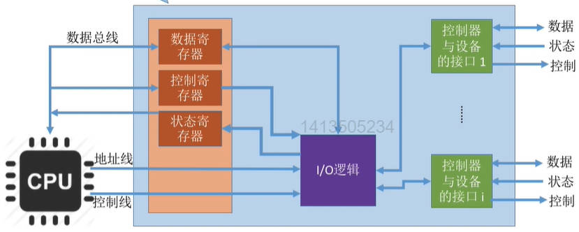
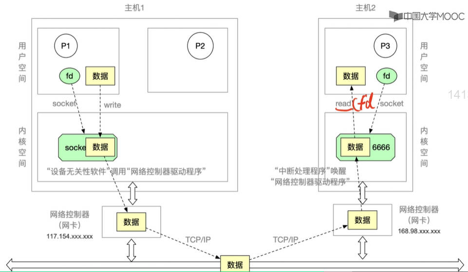
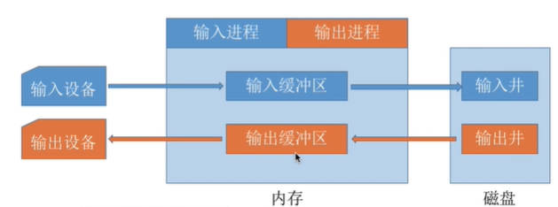
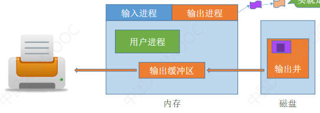
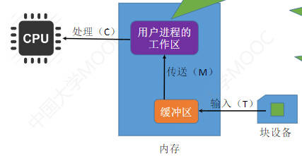
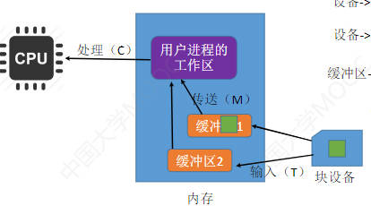
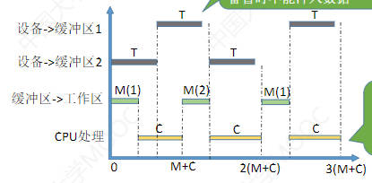
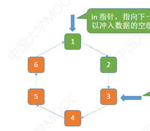
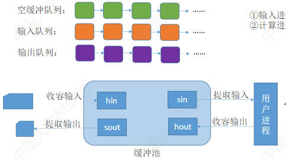

# I/O设备

I/O就是输入/输出（Input/Output）

## I/O设备的分类

### 按使用特性分类

- 人机交互类外部设备

    鼠标、键盘、打印机等

    数据传输速度慢

- 存储设备

    移动硬盘、光盘等

    数据传输速度快

- 网络通信设备

    光猫、调制解调器等

    速度介于上述二者之间

### 按传输速率分类

分类界限并不明显

- 低速设备

    鼠标、键盘等

    受制于人操作的速度，传输速率为每秒几个~几百个字节

- 中速设备

    如激光打印机等

    传输速率为每秒数千至上万个字节

- 高速设备

    如磁盘等

    传输速率为每秒数千字节~千兆字节的设备

### 按信息交换的单位分类

- 块设备

    如磁盘等，数据传输的基本单位是块

    传输速率较高，可寻址，即可以通过地址读写任意一块

- 字符设备

    鼠标、键盘等，数据传输的基本单位是字符

    传输速率较慢，不可寻址，常采用中断驱动的I/O控制方式

***

## I/O控制器

I/O设备由机械部件和电子部件组成

- 机械部件，主要用来执行具体的I/O操作

    如鼠标、键盘的按钮；显示器屏幕；移动硬盘的磁臂、磁盘盘面

    CPU无法直接控制机械部件

- 电子部件

    用于实现CPU对设备的控制，这个电子部件就是I/O控制器，又称设备控制器

    通常是一块插入主板扩充槽的印刷电路板

### I/O控制器的功能

- 接受和识别CPU发出的命令

    如CPU发来的read/write命令，会暂存在I/O控制器的控制寄存器中

- 向CPU报告设备的状态

    I/O设备当前的状态（如空闲还是忙碌）会记录在状态寄存器中

- 数据交换

    数据寄存器，用于暂存用于交换的数据

- 地址识别

    通过CPU提供的地址判断CPU要操作的是哪个外设

### I/O控制器的组成

左侧是CPU与控制器的接口，右侧是控制器与设备的接口，中间是I/O逻辑

- 一个I/O控制器可能会对应多个设备

- 多个设备要对应多个数据/控制/状态寄存器，不然无法同时工作，这多个寄存器就要有相应的地址

    - 内存映像I/O

        设备控制器中的寄存器和内存统一编址

        可以直接用访存指令操作寄存器

    - 寄存器独立编址

        控制器中的寄存器使用单独的地址

        需要设置专门的指令来实现对控制器的操作

***

## I/O控制方式

### 程序直接控制方式

**完成一次读/写操作的流程：**

...

**CPU的干预频率：**

很频繁，I/O操作开始之前、完成之后都需要CPU介入，等待I/O完成的过程中CPU也需要不断轮询检查

**数据传送的单位：**

每次读/写一个字

**数据的流向：**

- 读操作（数据输入）：

    I/O设备 --> CPU（寄存器）--> 内存

- 写操作（数据输出）：

    内存 --> CPU --> I/O设备

**优点：** 实现简单。在读/写指令之后加上实现循环检查的一系列指令即可（因此才称为程序直接控制方式）

**缺点：** CPU和I/O设备只能串行工作，CPU长期处于忙等状态，利用率低

### 中断驱动方式

**完成一次读/写操作的流程：**

...

**CPU的干预频率：**

每次I/O操作开始之前、完成之后需要CPU介入。等待I/O完成的过程中CPU可以切换到别的进程执行

**数据传送的单位：**

每次中断请求只能读/写一个字

**数据的流向：**

- 读操作（数据输入）：

    I/O设备 --> CPU --> 内存

- 写操作（数据输出）：

    内存 --> CPU --> I/O设备

**优点：** CPU不再需要不断轮询，CPU与I/O设备可以并行工作，CPU利用率提升

**缺点：** 频繁的中断处理会消耗较多的CPU时间

### DMA方式

DMA——Direct Memory Access，直接存储器存取

**完成一次读/写操作的流程：**

...

**CPU的干预频率：**

仅在传送一个或多个数据块的开始和结束时，才需要CPU干预

**数据传送的单位：**

每次读/写一个或多个块（如果是多个块，只能是连续的多个块，且这些块读入内存后在内存中也必须是连续的）

**数据的流向：**

- 读操作（数据输入）：

    I/O设备 --> 内存

- 写操作（数据输出）：

    内存 --> I/O设备

**优点：** 数据传输以块为单位，CPU介入频率进一步降低。CPU和I/O设备的并行性得到提升

**缺点：** CPU每发出一条I/O指令，只能读/写一个或多个连续的数据块。如果要读/写多个离散存储的数据块，或者将数据分别写到不同的内存区域时，CPU要分别发出多条I/O指令，进行多次中断处理才能完成

### 通道方式

通道：一种硬件，可以识别并执行一系列通道指令

可以理解为弱鸡版CPU：与CPU相比，通道可以执行的指令很单一，并且通道程序是放在主机内存中的，也就是说通道没有自己的内存，而是与CPU共享内存

一个通道可以控制多个I/O控制器，一个I/O控制器能控制多个I/O设备

**完成一次读/写操作的流程：**

1. CPU向通道发出I/O命令，指明通道程序在内存中的位置，并指明要操作的是哪个I/O设备。之后CPU就切换到其它进程执行

2. 通道执行内存中的通道程序（可以理解为任务清单，里面指明了要读入/写出多少数据，读/ 写的数据放在内存的什么位置等信息）

3. 通道执行完规定的任务后，向CPU发出中断信号，之后CPU对中断进行处理

**CPU的干预频率：**

极低，可以一次扔给通道一堆事情

通道执行相应的通道程序，只有完成一组数据块的读/写后才需要发出中断信号，请求CPU干预

**数据传送的单位：**

每次读/写一组数据块

**数据的流向：**

- 读操作（数据输入）：

    I/O设备 --> 内存

- 写操作（数据输出）：

    内存 --> I/O设备

**优点：** CPU、通道、I/O设备可以并行工作，资源利用率很高

**缺点：** 实现复杂，需要专门的通道硬件支持

***

## I/O软件层次结构

- 用户层软件

操作系统的内核部分：即I/O系统或I/O核心子系统

- 设备独立性软件

- 设备驱动程序

- 中断处理程序

以上都是I/O软件的层次

- 硬件

每一层会利用下层提供的服务，向高层提供服务（封装思想）

### 用户层软件：

实现了与用户交互的接口。用户可直接使用该层提供的与I/O操作相关的库函数对设备进行操作

用户层软件将用户请求翻译成格式化的I/O请求，并通过系统调用请求操作系统内核的服务

### 设备独立性软件

又称设备无关性软件。与设备的硬件特性无关的功能几乎都在这一层实现

主要实现的功能：

1. 向上层提供统一的调用接口（如read，write）

2. 设备的保护

    设备被看做是一种特殊的文件，因此也有访问权限的问题

3. 差错处理

    对一些设备的错误进行处理

4. 设备的分配与回收

5. 设备缓冲区管理

    可以通过缓冲技术屏蔽设备之间数据交换单位大小和传输速度的差异

6. 建立逻辑设备名到物理设备名的映射关系；根据设备类型选择调用相应的驱动程序

    比如打印时选择打印机1、打印机2就是逻辑设备名

    设备独立软件需要通过“逻辑设备表（LUT，Logical Unit Table）”来确定逻辑设备对应的物理设备，并找到该设备对应的设备驱动程序

### 设备驱动程序

主要负责对硬件设备的具体控制

将上层发出的一系列命令转化为特定设备能听得懂的一系列操作。包括设置寄存器；检查设备状态等

不同的I/O设备有不同的硬件特性，具体细节只有设备的厂家才知道。因此厂家需要根据设备的硬件特性设计并提供相应的驱动程序

驱动程序一般会以一个独立进程的方式存在

### 中断处理程序

I/O控制器发送中断信号后，系统会根据中断信号类型找到对应的中断处理程序并执行

中断处理程序处理流程：

- 从I/O控制器中读出设备状态

- 如果I/O正常结束，就从设备中读入一个字的数据，并经由CPU放到内存中

    中断处理程序会和硬件直接打交道

- 如果I/O不是正常结束，就根据异常原因做相应处理

***

## 程序接口

### 输入输出应用程序接口

**字符设备接口：**

- get/put系统调用

    用字符设备读/写一个字符

**块设备接口：**

- read/write系统调用

    向块设备的读写指针位置读/写多个字符

- seek系统调用

    修改读写指针位置

**网络设备接口**（又称网络套接字(socket)接口）

- socket系统调用

    创建一个网络套接字（可以理解为一片内核空间，用来接收和发送数据），需指明网络协议

- bind

    将套接字绑定到某个本地端口

- connect

    将套接字连接到远程地址

- read/write

    从套接字读/写数据

实现网络通信的过程：

1. 主机2的P3进程通过socket系统调用创建一个网络套接字，socket返回给进程一个描述符fd（指向套接字的指针）。然后将套接字通过bind绑定计算机中的6666端口

2. 主机1的P1进程也创建一个网络套接字，并绑定至211端口

3. 使用connect将两个套接字建立链接，建立好后两台主机就可以通过套接字传送数据

4. P1在自己的用户空间准备好数据，然后通过write系统调用指明自己想要将数据写入套接字中

5. 设备独立软件接收到write请求后，就会将数据复制到socket套接字中

6. 设备独立性软件调用网络控制器驱动程序，将数据输出到网络设备上

7. 网络控制器将数据包发送到网络上

8. 主机2的网络控制器接收到这个网络数据包后，向CPU发送中断信号。中断处理程序调用网络控制器驱动程序将数据复制到内核网络缓冲区中（socket套接字中）

9. P3调用read系统调用发出信号要读取fd所指的套接字中的数据

10. 设备独立性软件从缓冲区将数据复制到用户进程中

**阻塞I/O和非阻塞I/O**

- 阻塞I/O

    应用程序发出I/O系统调用，进程需转为阻塞态等待

    如从键盘读一个字符 get

- 非阻塞I/O

    应用程序发出I/O系统调用，系统调用可迅速返回，进程无需阻塞等待

    如，往磁盘写数据write

### 设备驱动程序接口

设备独立性软件通过设备驱动程序接口调用不同的外设

操作系统制定了统一标准的设备驱动程序接口，各厂商必须按要求开发设备驱动程序

***
***

# I/O核心子系统

在I/O层次中，设备独立性软件、设备驱动程序、中断处理程序这三层属于操作系统的内核部分，即I/O系统，或称I/O核心子系统

要实现的功能

- 假脱机技术（SPOOLing技术）

    在用户层软件实现

- I/O调度：用某种算法确定一个顺序，来处理各个I/O请求。

    比如先来先服务、短作业优先、SCAN算法等等

- 设备保护：把设备看作特殊的文件，每个设备有对应的FCB。实际上就是文件保护

- 设备分配与回收

- 缓冲区管理

以上四个都在设备独立性软件中实现

## 假脱机技术（SPOOLing技术）

### 脱机技术

脱机——脱离主机的控制进行输入和输出操作

是为了解决快速设备与慢速设备的速度矛盾

比如在早期使用纸带输入输出的时候，可以先在外围控制机的控制下将数据输入到更快速的磁带上，之后主机可以从快速的磁带上读入数据

主机输出数据时，也是先输出到磁带中，然后再有外围控制机读取磁带内容

### 假脱机技术

是用软件的方式模拟脱机技术

- 输入井：用软件模拟输入数据时的磁带的功能

- 输出井：用软件模拟输出数据时磁带的功能

- 输入进程：软件模拟输入时的外围控制机

- 输出进程：模拟输出时的外围控制机

由预输入程序、井管理程序和缓输出程序管理

**共享打印机原理分析：**

独占式设备——只允许各个进程串行使用的设备。一段时间内只能满足一个进程的请求

共享设备——允许多个进程同时使用的设备（宏观上同时，微观上可能是交替使用）

打印机是种独占式设备，但是可以用SPOOLing技术改造成共享设备

1. 当多个用户进程提出输出打印的请求时，系统会答应所有请求，但是不会真正把打印机分配给它们

2. 假脱机管理系统会为每个进程在**磁盘**输出井中为进程申请一个空闲缓冲区，并将要打印的数据送入其中

3. 为用户进程申请一张空白的打印请求表，并将用户的打印请求填入表中，再将该表挂到假脱机文件队列上

4. 当打印机空闲时，输出进程会从文件队列的队头取出一张打印请求表，并根据表中的要求将要打印的数据从输出井传送到输出缓冲区，再输出到打印机进行打印

***

## 设备的分配与回收

### 分配时要考虑的因素

**设备的固有属性**

- 独占设备：一个时段只能分配给一个进程

    如：打印机

- 共享设备：可同时分配给多个进程使用（宏观上同时，微观上交替）

    如：磁盘

- 虚拟设备：采用SPOOLing技术将独占设备改造成虚拟的共享设备

**设备的分配算法：**

- 先来先服务

- 优先级高者优点

- ......

**进程运行的安全性**

- 安全分配方式：

    为进程分配一个设备后就将进程阻塞，本次I/O完成后才将进程唤醒

    一个时段内每个进程只能使用一个设备

    优点：破坏了“请求和保持”条件，不会思索

    缺点：对于一个进程来说，CPU和I/O设备只能串行工作

- 不安全分配方式

    进程发出I/O请求后，系统为其分配I/O设备，进程可继续执行，之后还可以发出新的I/O请求

### 静态分配 和 动态分配

静态分配：进程运行前为其分配全部所需资源，运行结束后归还资源。

动态分配：进程运行过程中动态申请设备资源

### 设备分配管理中的数据结构

一个通道可控制多个设备控制器，每个设备控制器可控制多个设备。一个系统中有多个通道

**设备控制表（DCT）**：每个设备对应一张，用于记录设备情况。表项包括：

- 设备类型

- 设备标识符

    即物理设备名，系统中的每个设备的物理设备名唯一

- 设备状态

    忙碌/空闲/故障

- 指向控制器表的指针

    每个设备由一个设备控制器控制，这个指针能找到相应控制器的信息

- 重复执行次数或时间

    如果I/O失败，系统会重复执行多次，都失败后才认为此次I/O失败

- 设备队列的队首指针

    指向正在等待该设备的进程队列（由进程PCB组成队列）

**控制器控制表（COCT）**：每个设备控制器对应一张。操作系统根据COCT的信息对控制器进行操作和管理

- 控制器标识符

    控制器的唯一ID

- 控制器状态

- 指向通道表的指针

- 控制器队列的队首指针

    指向正在等待该设备控制器的进程队列

- 控制器队列的队尾指针

**通道控制表（CHCT）**：每个通道对应一张。操作系统根据CHCT的信息对通道进行操作和管理

- 通道标识符

- 通道状态

- 与通道连接的控制器表首址

    可通过该指针找到该通道管理的所有控制器相关信息（即找到COCT）

- 通道队列的队首指针

    指向正在等待该通道的进程队列（由进程PCB组成）

- 通道队列的队尾指针

**系统设备表（SDT）**：记录了系统中全部设备的情况，每个设备对应一个表目。表目中包含：

- 设备类型

- 设备标识符

- DCT（设备控制表）

- 驱动程序入口

### 设备分配的步骤

1. 根据进程请求的物理设备名查找SDT（系统设备表）

    说明进程请求分配设备时要提供物理设备名

2. 根据SDT找到DCT，若设备忙碌则将进程PCB挂到设备等待队列中，不忙碌则将设备分配给进程

    分配设备时，还需要将设备对应的设备控制器也分配给进程

3. 根据DCT找到COCT，若设备忙碌则将进程PCB挂到控制器等待队列中，不忙碌则将控制器分配给进程

    分配控制器时，还需要将对应的通道也分配给进程

4. 根据COCT找到CHT，若通道忙碌则将进程PCB挂到通道等待队列中，不忙碌则将通道分配给进程

只有设备、控制器、通道都分配成功时，这次设备分配才算成功，之后便可启动I/O设备进行数据传送

缺点：

- 用户编程时必须使用物理设备名，不方便编程

- 如果想用同类型别的物理设备，物理设备名不同，则程序无法运行，还得修改代码

- 若进程请求的物理设备正在忙碌，则即使系统中还有同类型的设备，进程也必须阻塞等待

### 设备分配方法的改进

改进方法：建立逻辑设备名与物理设备名的映射机制，用户编程时只需提供逻辑设备名

1. 根据进程请求的逻辑设备名查找SDT

    逻辑设备名其实就是设备类型，SDT的表目中有设备类型这一表项

2. 查找（遍历）SDT，找到用户进程指定类型的、并且空闲的设备，将其分配给该进程。操作系统在逻辑设备表（LUT）中新增一个表项

    LUT用于记录逻辑设备名到物理设备名的映射关系，还记录了驱动程序入口地址

3. 根据SCT找到COCT

4. 根据COCT找到CHCT

当用户进程再次请求使用设备时，操作系统会先查询LUT表

***

## 缓冲区管理

缓冲区是一个存储区域，可以由专门的硬件寄存器组成（成本高，容量小），也可利用内存作为缓冲区

设备独立性软件的缓冲区管理就是组织管理内存缓冲区

### 缓冲区的作用

CPU可以把要输出的数据快速地放入缓冲区，之后就可以做别的事，慢速I/O设备可以慢慢从缓冲区把数据取走

- 缓和CPU与I/O设备之间速度不匹配的矛盾

- 减少对CPU的中断频率，放宽对CPU中断响应时间的限制

- 解决数据粒度不匹配的问题

    如：输出进程每次能生成一块数据，但I/O设备每次只能读取一个字符。

- 提高CPU与I/O设备之间的并行性

缓冲区可以采用的策略：

### 单缓冲

假设某用户进程请求某种块设备读入若干块的数据。若采用单缓冲的策略，操作系统会在主存中为其分配一个缓冲区（默认一个缓冲区大小是一个块）

注意：当缓冲区数据非空时，不能往缓冲区冲入数据，只能从缓冲区把数据传出；当缓冲区为空时，可以往缓冲区冲入数据，但必须把缓冲区充满之后，才能从缓冲区把数据传出

数据块的处理步骤：

- 块设备产生一块大小的数据，输入到系统为其分配的缓冲区中——耗时t

- 将缓冲区的数据传送到用户进程的工作区中（默认工作区和缓冲区大小相同，也是一块）——耗时m

- 用户进程开始对这段数据进行处理——耗时c

**计算每处理一块数据平均需要多久：**

技巧：假定一个初始状态，分析下次到达相同状态需要多久

假定初始状态为工作区满，缓冲区空

- 假设T > C——平均用时 = T + M

    工作区满——CPU可以开始处理数据，用时C

    缓冲区空——块设备可以往缓冲区输入数据，用时T
    
    这两步是同时进行的，所以由于T>C，所以T时刻后缓冲区满，工作区空，缓冲区往工作区传送数据，用时C，回到初始状态

- 假设T < C——平均用时 = C + M

    块设备花费T的时间向缓冲区写入数据，而工作区此时还没空，CPU还没处理完数据。还得继续等CPU处理完数据

    所以需要C的时间后，缓冲区满，工作区空，再花费M时间回到初始状态

平均耗时MAX(T，C)+M

同一时刻只能实现单向数据传输

### 双缓冲

操作系统会在主存中为用户进程分配两个缓冲区（默认一个缓冲区的大小就是一个块）

假设初始状态为：工作区空，其中一个缓冲区满，另一个缓冲区空

- 假设 T > C + M——平均用时 = T

    满的缓冲区向工作区传送数据耗时M，CPU处理数据耗时C

    同时块设备像空缓冲区写入数据耗时T

    等空的缓冲区被写满后，回到初始状态

- 假设 T < C + M——平均用时 = C + M

    

    其实开始执行后就无法找到和初始状态完全相同的状态

    但是每过C+M就可以处理完一块数据

平均耗时MAX（T,C+M）

可以实现双向数据传输

### 循环缓冲区

将多个大小相等的缓冲区链接成一个循环队列

橙色表示已充满数据的缓冲区，绿色表示空缓冲区

- in指针：指向下一个可以冲入数据的空缓冲区

- out指针：指向下一个可以取出数据的满缓冲区

### 缓冲池

缓冲池由系统中公用的缓冲区组成

- 空缓冲队列：挂空的缓冲区

- 输入队列：挂需要将数据输入用户进程的缓冲区

- 输出队列：挂需要将数据输出的缓冲区

- 工作缓冲区hin：用于收容输入数据

- 工作缓冲区sin：用于提取输入数据

- 工作缓冲区hout：用于收容输出数据

- 工作缓冲区sout：用于提取输出数据

工作流程：

1. 输入进程请求输入数据：

    系统从空缓冲队列的队头中取下一块空缓冲区，把它作为用于收容输入数据的缓冲区。

    当这块缓冲区被充满后，就会被挂在输入队列的队尾上

2. 计算进程想要取得一块输入数据

    操作系统从输入队列队头取下一块缓冲区，把他作为提取输入的工作缓冲区

    这块缓冲区的数据会被传送到计算进程的工作区中，当数据被取空后，就会被挂在空缓冲队列的队尾

3. 计算进程想要将准备好的数据冲入缓冲区

    系统从空缓冲队列的队头取下一块空缓冲区，作为用于收容输出数据的工作缓冲区

    缓冲区满后挂在输出队列的队尾

4. 输出进程请求输出数据

    从输出队列队头取下一块缓冲区，作为提取输出数据的工作缓冲区。

    缓冲区被取空后，挂回空缓冲队列队尾

    

