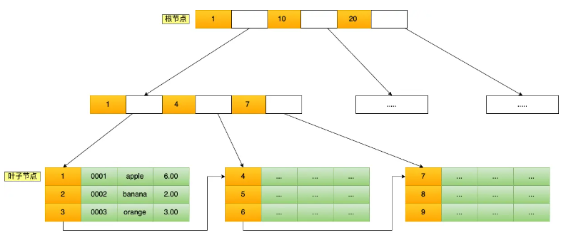
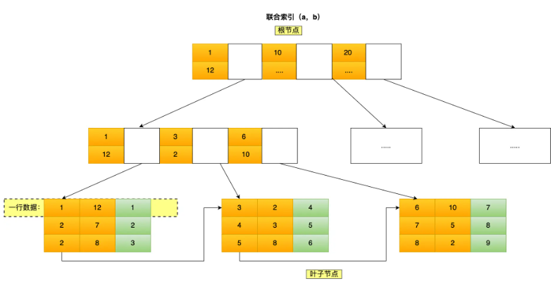
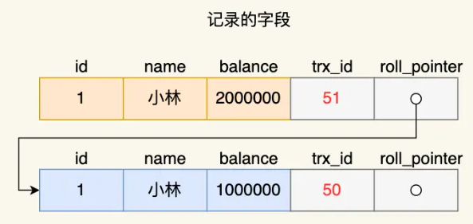
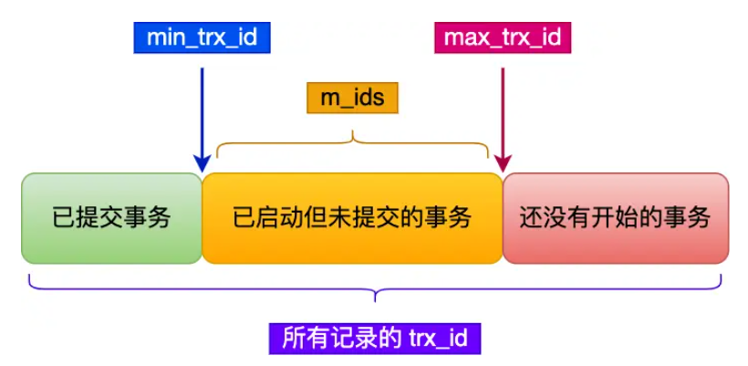
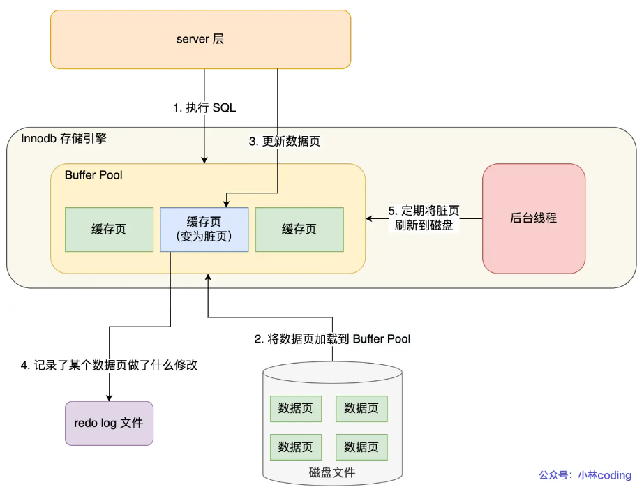
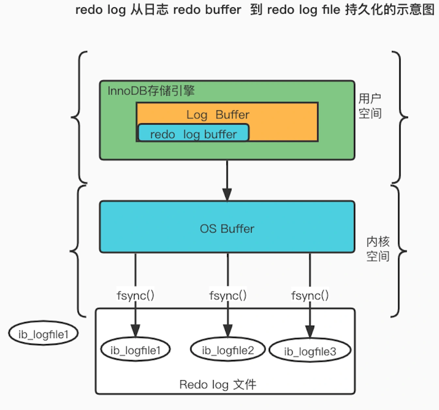
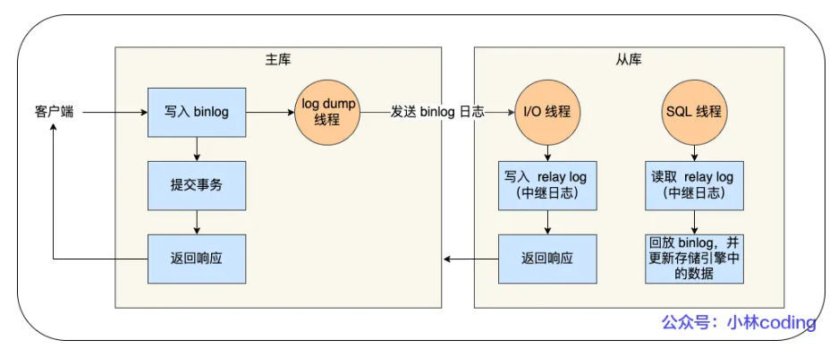

# 1 事务

最小的工作单元，不可再分

# 2. 索引

索引是帮助存储引擎快速获取数据的一种数据结构，可以理解为索引就是数据的目录。索引位于存储引擎中

MySQL在查询方面主要有两种方式

- 全表扫描
- 根据索引检索

索引在存储引擎中实现，不同存储引擎实现索引的方式可能不同。在InnoDB中，索引的底层结构是B+Tree

**索引的分类**

- 按索引使用的数据结构：B+tree索引、Hash索引、Full-text索引

- 按索引中实际存储数据分：聚簇索引（主键索引）存储完整数据、二级索引（辅助索引）存储主键

- 按索引所在的字段的特性分：

  主键索引：建立在主键字段上的索引，通常在创建表时一起创建，也就是聚簇索引，一定会创建，即使不显示指定主键

  唯一索引：建立在UNIQUE字段上的索引

  普通索引：建立在普通字段上的索引

  前缀索引：对字符类型（char、varchar、binary、varbinary）列的前几个字符建立索引，比如对每列前2个字符建立索引。这样可以减少索引占用的存储空间，提升查询效率

- 按索引所在的字段个数分：单列索引（建立在单列上的索引）、联合索引（建立在多列上的索引）

## 2.1 索引查询过程

以B+Tree索引为例

B+Tree是一种多叉数，叶子节点存放所有数据，非叶子节点只存放索引，每个节点中的数据是按照主键顺序存放的

最底层保存所有数据的一层叶子节点同时还是个双向链表

### 2.1.1 聚簇索引

聚簇索引也叫主键索引，主键索引的B+Tree的叶子节点存放的是实际数据，即完整的表数据都会存放在主键索引的B+Tree叶子节点里

**特点：**

- 由于数据物理存储的顺序只能有一种，所以每个MySQL表只能有一个聚簇索引，一般是这个表的主键。所以每个表只能有一个主键
- 如果没有定义主键，那么InnoDB会选择一个非空唯一索引代替，如果也没有，就会隐式定义一个主键来作为聚簇索引



以`select * from product where id = 5`为例

1. 将5与根节点比较，5在1和10之间，因此找到第二层最左侧节点
2. 比较发现5在4~7之间，因此找到第三层
3. 第三层为叶子节点，在叶子节点中查找，找到索引为5的数据

可以把读取一次节点当作一次磁盘IO操作，则上面的整个查询过程一共经历3个节点，即进行三个IO操作。B+Tree存储千万级数据也只需要3~4层高度，这意味着从千万级表中查询数据也只需要进行3~4次磁盘IO

### 2.1.2 二级索引（辅助索引、非聚簇索引）

聚簇索引只有在搜索条件是主键值时才能发挥作用，如果想以别的列作为搜索条件该怎么办？

可以多建几颗B+树，不同的B+树采用不同的列作为排序规则。

这种B+树（非聚簇索引）不会存储完整的数据，一般只会存储该条记录的主键值，然后再通过主键值去聚簇索引中查找，这个过程就称为**回表**——需要查找两棵B+树才能得到完成数据记录

非主键可能有重复，但是B+树中要保证目录项中的结点（非叶子结点，称为内节点）值必须唯一，所以对于值相同的目录项结点，会额外添加上主键保证唯一。

**覆盖索引**

如果查询的数据能在二级索引的B+Tree的叶子节点直接查询到（比如之用查询id（主键）），这时就不用再通过主键索引去聚簇索引中做回表查询。这种只在二级索引的B+Tree就能查询到结果的过程就叫覆盖索引

### 2.1.3 联合索引

联合索引实际上也是非聚簇索引，只不过是同时以多个列的大小作为排序规则，叶结点中存储的数据是联合索引包含的列 以及 主键

比如说同时以a和b列作为联合索引，就先按照a列排序，a列相同的情况下再按照b排列。



可以看到a（上层节点第一行，叶子节点第一列）是全局有序的，而b是全局无序的

**最左匹配原则**

在使用联合索引时，存在最左匹配原则。比如对于a，b联合索引，where a = 1和where a = 1 and b = 2是可以利用索引的，而where b = 1无法匹配联合索引。

对于范围查询，比如where a > 10 and b = 2，联合索引可以用到最左侧范围查询的字段，而范围查询之后的字段无法用到联合索引，只能从a>10的第一条记录开始在叶子节点的双向链表向后遍历，也就是a能用到，而b用不到。

这是由于在联合索引中，最左边的列是全局有序，而右边的列是全局无序，局部相对有序的，而且是在左侧列相等的情况下局部有序，所以只有确定了左边的列才能在右边的列中应用索引。

**索引下推**

假设执行`select * from table where a > 1 and b = 2`，其中有联合索引（a，b）

执行流程为：在联合索引的B+Tree中找到第一个满足条件（a>1）的记录，之后从该记录开始在叶子节点组成的双向链表中一个个遍历，判断b的值是否为2。那么如何判断b的值呢

- 在MySQL5.6之前，只能在遍历过程中一个个回表，通过主键到主键索引上找出对应数据行，再对比b字段值
- MySQL5.6引入索引下推优化。可以在联合索引遍历过程中，对联合索引中包含的字段先做判断。由于联合索引中有b，因此可以直接在遍历过程中找到满足b=2的记录，减少回表次数

## 2.2 不同引擎中的索引方案

在MyISAM、InnoDB、Memory三个引擎中都支持B-Tree索引（实际上是B+Tree，不过国外统称B-Tree）。但是实现原理不同

- MyISAM：默认BTree，叶子结点data域存放的是数据记录的地址
- InnoDB：默认BTree，叶子结点data域存放的是数据记录本身
- Memory：默认使用Hash索引

### 2.2.1 MyISAM

索引和数据是分开的，所以用MyISAM引擎存储的表有两个文件。MYD文件存储数据，MYI文件存储索引。索引使用B+Tree，但是叶子结点存储的是数据记录的地址。


由于在MyISAM中索引和数据是分开的，所以其实MyISAM是不支持聚簇索引的，它所有的索引实际上都是非聚簇索引。

在插入数据的过程中，也不会将数据直接按照B+Tree排序，而是直接按照插入顺序往文件里面塞

### 2.2.2 InnoDB

索引和数据存储在一起，一个表对应一个.ibd文件，数据直接存储在B+Tree的叶子结点中。

InnoDB一定有一个聚簇索引（一定有一个主键），因为索引即数据，数据即索引。从插入第一个数据开始就是按照B+Tree的顺序排列的

根据B+Tree的特性，在指定主键时就要注意以下几点：

- 不要使用过长的字段作为主键：

  - 这样会使得非叶子结点能容纳的目录项变少，增加读盘次数；

  - 也会使得二级索引变大，因为二级索引要存储主键

- 要用自增字段作为主键

  不然插入新纪录时，会为了维持B+Tree的特性而频繁分裂调整

## 2.3 创建和查看索引

### 2.3.1 索引的分类

**按照功能逻辑划分：**

- 普通索引：对要添加索引的字段不附加任何限制条件，只是用于提高查询效率，可以创建在任何数据类型中

- 唯一性索引：声明了唯一性约束的字段会自动添加唯一性索引

  创建唯一性索引时，限制该索引的值必须是唯一的

- 主键索引

- 全文索引：是搜索引擎使用的关键技术，能从大量文本文字中筛选出我们想要的关键字，适合大型数据集

  只能创建在CHAR、VARCHAR、TEXT类型字段上

  逐渐被专门的搜索引擎所替代

- 空间索引：给空间类型的字段添加索引时需要使用空间索引

**按照作用字段个数：**

- 单列索引：在单个字段上创建的索引

- 多列索引：又称组合索引、联合索引

### 2.3.2 查看索引

- `show create table table_name;`

  查看建表的语句，其中就包含了对索引的定义

- `show index from table_name;`

  查看表中索引信息

### 2.3.3 隐式创建索引

在建表时会隐式地创建索引

在声明有主键约束、唯一性约束、外键约束的字段上会自动添加相关索引

### 2.3.4 建表时添加索引

```sql
CREATE TABLE table_name{
字段 字段类型 约束,
......
[UNIQUE|FULLTEXT|SPATIAL] #可选参数，表示唯一索引、全文索引、空间索引 
INDEX / KEY index_name (col_name length) ASC|DESC# 使用INDEX或者KEY关键字都行，推荐INDEX；
# index_name 索引名不写默认是字段名
# col_name要添加索引的字段名
# length：取length个字符作为索引，只有字符串类型字段才能指定索引长度
# ASC或DESC：指定升序或者降序构造B+树，默认ASC
}
```

**创建联合索引**

```sql
CREATE TABLE book{
book_id INT,
book_name varchar(100),
year_publication YEAR,
# 创建联合索引
INDEX idx_bname_bid(book_name,book_id)
# 创建B+Tree时，严格先按照book_name排，book_name一样的情况下再按照book_id排
}
```

**创建唯一索引**

```sql
CREATE TABLE book{
book_id INT,
book_name varchar(100),
year_publication YEAR,
comment varchar(100)
# 创建唯一索引
UNIQUE INDEX uk_idx_comment(comment)
}
```

创建唯一索引之后，也为comment字段添加上了唯一性约束，插入数据时要保证comment不重复

**创建主键索引**

主键索引只能通过主键约束的方式定义

### 2.3.5 已存在表添加索引

**ALTER TABLE**

```sql
ALTER TABLE book
ADD UNIQUE INDEX idx_cmd(COMMENT);
```

给book表中的comment字段添加一个名为idx_cmd的唯一性索引

**CREATE INDEX**

```sql
CREATE UNIQUE INDEX idx_cmd
ON book(COMMENT);
```

跟上面的索引一模一样

## 2.4 删除索引

在执行大量的增删改操作之前，最好先删除一些索引

注意：添加AUTO_INCREMENT约束的字段的 唯一索引 不能被删除，因为AUTO_INCREMENT约束必须加在有唯一索引或者主键索引的字段上

**ALTER TABLE**

```sql
ALTER TABLE table_name
DROP INDEX index_name;
```

比如：

```sql
ALTER TABLE book
DROP INDEX idx_cmt;
```

**DROP INDEX**

```sql
DROP INDEX index_name
ON table_name;
```

比如：

```sql
DROP INDEX idx_cmt
ON book;
```

## 2.5 MySQL8.0新特性

### 2.5.1 降序索引

在建索引时可以通过DESC指定以降序存储键值，虽然MySQL4开始就支持这个语法，但实际上DESC定义是被忽略的，真正使用时（比如寻找最大值ORDER BY ... DESC LIMIT 1）会进行反向扫描，相当于全表扫描，降低效率

在MySQL8.0之后真正支持降序索引（仅限于InnoDB存储引擎）

### 2.5.2 隐藏索引

索引默认是可见的(VISIBLE)，设置为隐藏(INVISIBLE)之后 查询时引擎就不会使用这个索引，但是查看索引（SHOW INDEX）能看到

使用场景：比如想要删除一个索引，但是不确定删除这个索引会不会报错，会不会影响效率，如果删除再建会消耗很多资源。这时候就可以先将索引隐藏，确认系统不受影响之后再彻底删除索引，这个过程（先隐藏再删除）就是软删除。

索引被隐藏后，还是会实时更新，所以不用的索引最好还是删除

主键不能设置为隐藏索引，不管是显示设置的主键索引还是系统隐式设定的主键索引

**直接创建隐藏索引**

直接在创建索引语句的最后加一个invisible即可

```sql
# 建表时创建
CREATE TABLE book{
book_id INT,
COMMENT VARCHAR(100),
INDEX idx_cmt(COMMENT) invisible
}

# 建表后创建
ALTER TABLE book
ADD INDEX idx_cmt(COMMENT) invisible;

CREATE INDEX idx_comment 
ON book(COMMENT) invisible;
```

**切换索引的可见状态**

把invisible改成visible就是取消隐藏索引

```sql
ALTER TABLE book
ALTER INDEX idx_cmt invisible;
```

# 3. 索引的创建原则

# 4. 用户管理

## 4.1 创建用户

`CREATE USER '用户名'@'服务器名' identified by '密码';`

服务器名可以是%，指当前登录的服务器

创建完用户只有登录的权限

## 4.2 修改用户

只能做有限的修改，比如改个用户名

`use mysql;`

`update user set user = 'wangwu' where user = 'lisi' and host = '%';`

把李四的用户名改为王五

实际上是修改mysql数据库中的user表项

修改完之后要记得`flush privileges;`刷新权限

## 4.3 删除用户

如果被删除的用户当前处于登录状态，删除该用户依然处于登录状态，不会踢出去系统

**使用DROP删除**

`drop user 'wangwu'@'%'; `

删除王五

**使用DELETE删除**

`delete from user where user = 'zhang3' and host = '%';`

在mysql数据库的user表中删除指定记录，不推荐使用。因为系统可能会有信息残留

## 4.4 设置当前用户密码

用户的密码存储在mysql.authentication_string表当中，不过是经过加密处理的，不会保存密码明文

以下方法可以用于root用户修改自己密码，也可以用于普通用户修改自己密码，得在登录了账号之后操作

**使用ALTER语句**

`ALTER USER USER() IDENTIFIED BY 'new_pwd';`

USER()用于获取当前用户

推荐使用

**使用SET语句**

`set password = 'abcabc';`

## 4.5 修改其他用户的密码

修改其他用户密码得有相应的权限，比如root用户

修改完密码后不会立即将用户踢出系统

**ALTER**

`alter user 'user_name'@'host_name' identified by 'pwd';`

**SET**

`set password for 'zhang3'@'%' = 'new_pwd'; `

# 5. 数据库安全

## 5.1 安全标准

在1985年，美国国防部（DoD）正式颁布《DoD可信计算机系统评估准则》即TCSEC

TCSEC推出后，不同国家都开始启动开发建立在TCSEC概念上的评估准则。之后将这些各自独立的准则集合成一组单一的、能被广泛使用的IT安全准则，被称为通用准则（CC）

TCSEC将系统划分为4组7个等级

| 安全级别 | 特点                               |
| -------- | ---------------------------------- |
| A1       | 验证设计                           |
| B3       | 安全域                             |
| B2       | 结构化保护                         |
| **B1**   | 标记安全保护，实施**强制存取控制** |
| C2       | 受控的存取保护                     |
| **C1**   | 自主安全保护，进行**自主存取控制** |
| D        | 最小保护                           |

## 5.2 存取流程


这是数据库安全保护的一个存取控制流程：

1. 首先，数据库管理系统会对提出SQL访问请求的用户进行**身份鉴别**
2. 用户进入系统后，会在SQL处理层进行**自主存取控制**和**强制存取控制**，进一步还可以进行推理控制
3. 为监控恶意访问，还会根据具体安全需求配置**审计规则**，对用户访问行为和系统关键操作进行审计；通过设置简单**入侵检测规则**，对异常用户行为进行检测和处理
4. 在数据存储层，还会对存储的数据进行加密

**审计**

审计功能把用户对数据库的所有操作自动记录下来放入审计日志，审计员可以利用日志监控数据库中的各种行为

可以用AUDIT语句设置审计功能，比如：`AUDIT ALTER,UPDATE ON SC;`对修改SC表结构或数据的操作进行审计

用NOAUSIT取消审计`NOAUDIT ALTER,UPDATE ON SC;`

**推理控制**

避免用户利用其能访问的数据推知更高密级的数据

比如姓名和职称是低密级数据，工资是高密级数据。A知道自己的职称和工资，如果B和A职称相同，那A就能推出B的工资。

## 5.3 存取控制

存取控制机制主要实现：只授权给有资格的用户访问数据库的权限，令所有未被授权的人员无法接近数据

**存取机制主要包括两部分：**

- 定义用户权限

  给不同的用户授予相应的权限

- 合法权限检查

  当用户发出存取数据库的操作请求后，数据库管理系统会先根据安全规则进行合法权限检查

**存取机制有两种实现方法：**

- 自主存取控制

  同一用户对不同数据库对象有不同存取权限，不同用户对同一对象也有不同权限，权限还可以转授。非常灵活

- 强制存取控制

  每个一数据库对象被标一一定的密级，每个一用户被授予某一个级别的许可证。

  对于任意一个对象，只有具有合法许可证的用户才可以存取。相对比较严格

## 5.4  自主存取控制

自主存取控制的关键是给不同用户不同的权限

用户权限由两个要素组成：数据库对象 和 操作类型。定义一个用户的权限（授权）就是要定义这个用户可以在哪些数据库上进行哪些类型的操作。

下面所说的GRANT、REVOKE属于DCL——数据控制语言（Data Control Language），用于控制数据库中的访问和安全性。

### 5.4.1 授予权限

用户对自己建立的基本表和视图有全部权限，并可以授权给其他用户

```sql
GRANT 权限
ON 对象类型 对象名
TO 用户
[WITH GRANT OPTION]
```

- 权限包括表权限和列权限

  基本表和视图的权限：SELECT，INSERT，UPDATE，DELETE，REFERENCES，ALL PREVILEGES

  列权限：SELECT，INSERT，UPDATE（可以对某一列的值进行修改），REFERENCES

- 对象类型：模式、基本表、视图、索引、属性列

- WITH GRANT OPTION，加上这个之后，本次赋予用户的权限可以被该用户再授予给其他用户

例子：

```sql
#把对Student表和Course表的全部操作权限授予用户U2和U3，此权限不可转授
GRANT SELECT
ON TABLE Student
TO U2,U3;
```

```sql
#把查询Student表和修改学生学号的权限授予U4，且U4可以将此权限转授给其他人
GRANT UPDATE(Sno),SELECT
ON TABLE Student
TO U4
WITH GRANT OPTION;
```

### 5.4.2 收回权限

```sql
REVOKE 权限
ON 对象类型 对象名
FROM 用户 [CASCADE|RESTRICT]
```

- CASCADE：在收回指定用户权限的同时，把从该用户直接或间接获得的权限一并收回，默认
- RESTRICT：如果该权限被该用户转授，则系统拒绝指定权限收回命令

例子：

```sql
# 收回所有用户对表SC的查询权限
REVOKE SELECT
ON TABLE SC
FROM PUBLIC;
```

### 5.4.3 数据库角色

角色其实就是权限的集合，是一组被命名的与数据库相关的权限，可以用来简化授权的过程

**创建角色**

`CREATE ROLE 角色名`

**给角色授权**

```sql
GRANT 权限
ON 对象类型 对象名
TO 角色;
```

**将一个角色授予其他角色或用户**

```sql
GRANT 角色1,角色n
TO 角色2,角色n+1
[WITH ADMIN OPTION]
```

只有创建角色或者拥有角色ADMIN OPTION的人才能把角色授予其他人或角色

**角色权限的收回**

```sql
REVOKE 权限
ON 对象类型 对象名
FROM 角色;
```

# 6. 事务

## 6.1 事务的概述

事务（Transaction）是一组逻辑操作单元，使数据从一种状态变换到另一种状态，这些操作要么全做，要么全不做，是一个不可分割的工作单位

事务处理技术主要包括数据库恢复技术 和 并发控制技术

### 6.1.1 事务的ACID特性

**原子性（Atomicity）**

事务是一个不可分隔的工作单位，里面的操作要么都做，要么都不做

如果事务在执行过程中发生错误，会被回滚到事务开始之前的状态，就像从来没执行过一样

原子性通过undo log保证

**一致性（Consistency）**

事务执行的结果必须使数据库从一个一致性状态到另一个一致性状态。

当只包含事务成功提交的结果，不存在事务提交失败的结果时，就称数据库处于一致性状态。

一致性状态的定义跟具体的业务有关，是自定义的。但是只要保证事务的原子性就一定能保证一致性。

```sql
举例：
A账户 转账给 B账户 50元，A账户钱扣了之后，B账户的钱却没有增加
此时数据是不一致的，因为它破坏了一个被定义的一致性状态——A+B的总余额必须不变
此时就需要回滚到A账户扣钱之前，才能达到一致性状态
```

一致性通过持久性 + 原子性 + 隔离性保证

**隔离性（Isolation）**

数据库允许多个并发事务同时对其数据进行读写和修改的能力，可以防止多个事务并发执行时由于交叉执行而导致数据的不一致

因为多个事务同时使用相同的数据时，不会互相干扰，每个数据都有一个完整的数据空间，对其他并发事务是隔离的

隔离性通过MVCC（多版本并发控制）或锁机制来保证

**持续性（Durability）**

一个事务一旦被提交，它对数据库数据的改变就应该是永久性的，不可更改。即便系统故障也不会丢失

持久性通过redo log（重做日志）来保证

## 6.2 事务的使用

**事务的完整过程**

1. 开启事务
2. 执行一系列的DML操作
3. 结束事务：提交（COMMIT）或中止（ROLLBACK）

## 6.3 数据恢复

数据恢复涉及到两个关键问题：如何建立冗余数据，以及如何利用这些冗余数据实施数据库恢复

## 6.4 并发控制

### 6.4.1 数据并发的问题

并发事务访问相同的记录可以分为以下几种情况：

- 读-读：不会对记录有任何影响，允许两个操作同时发生

- 写-写：会发生脏写的问题，需要让它们排队执行。任何隔离级别都能解决

- 读-写：

  可能出现以下问题：

  - 脏读：读到其他事务未提交的数据

    A在读的时候B在写，A读到了B未提交的数据，读到的未提交的数据是临时且无效的，因为未提交数据随时会回滚

  - 不可重复读：前后读取的数据不一致

    A在读B在写，A读出1之后B改成了2并提交，A再读就成2了，两次读取同一个字段结果却不同
  
  - 幻读：前后读取的记录数量不一样
  
    A从一个表中查询了一些记录，然后B在表中又**插入**了一些数据。之后A（还是在同一个事务中）再次以相同条件查询同一个表发现结果行数发生了改变（增加或删除都可以），好像发生了幻觉。把进插入的记录称为 **幻影记录** 。


### 6.4.2 四种隔离级别

按照上面出现的问题的轻重缓急排序，可以排为

`脏写 > 脏读 > 不可重复读 > 幻读`

我们愿意舍弃一些隔离性来换取一部分并发性能，于是设置了一些隔离级别，隔离级别越高，性能效率就越低，并发问题就越少

**隔离级别**

所有隔离级别都不可以脏写，按水平高低排序如下

`读未提交 < 读已提交 < 可重复读 < 串行化`

1. 读未提交（read uncommitted）：有脏读、不可重复读、幻读现象

   一个事务还没提交时，它做的变更就能被其他事务看到

2. 读提交（read committed）：有不可重复读、幻读现象

   一个事务提交之后，它做的变更才能被其他事务看到

3. 可重复读（repeatable read）：有幻读现象，InnoDB引擎默认隔离级别

   一个事务执行过程中看到的数据，一直跟这个事务启动时看到的数据是一致的

4. 可串行化（serializable）：避免所有问题

   对记录加读写锁，在多个事务对这条记录进行读写操作发生冲突时，后面的事务要阻塞等待前一个事务执行完成释放锁才能继续执行


**隔离级别实现**

1. 读未提交：直接读取最新数据
2. 读提交：通过Read View来实现。Read View在每个语句执行前重新生成一个Read View
3. 可重复读：通过Read View来实现。在启动事务时生成一个Read View，然后整个事务期间都在用这个Read View
4. 串行化：通过加读写锁的方式来避免并行访问

**幻读**

虽然串行化可以解决幻读问题，但是加锁会严重影响性能。

而MySQL InnoDB引擎可重复读隔离级别在很大程度上避免了幻读

解决方案有两种

- 针对快照读（普通select语句），通过MVCC方式read view解决了幻读问题。

  因为事务从始至终都看到的都是事务创建时的数据快照，看不到新插入的数据

- 针对更新操作以及当前读（select ... for update），由于它需要读到最新的数据，因此不能用快照，而是使用了next-key lock（间隙锁+记录锁的组合）

  间隙锁是指，比如表中有一个id为（2，正无穷）的间隙锁，那么其他事务就无法插入id>2的记录

  假如执行了`select name from stu where id > 2 for update` 语句，就会对表中加上id范围为（2，正无穷）的next-key lock。其他事务想插入id大于2的记录时，就会被阻塞

  

## 6.5 MVCC Read View

### 6.5.1 Read View

Read View相当于一个数据快照，当某一时刻的数据定格下来

Read View中有四个重要字段

- creator_trx_id：创建该Read View的事务，它的事务id

- m_ids：在创建Read View时，当前数据库中活跃的事务id列表，注意是一个列表

  活跃事务指，启动了但还没提交的事务

- min_trx_id：m_ids中的最小值

  即创建Read View时，当前数据库中活跃事务中事务id最小的事务

- max_trx_id：全局事务中最大的事务id值+1（不是m_ids的最大值）

  即创建ReadView时，当前数据库中应该给下一个事务的id值

聚簇索引记录中与事务有关的两个隐藏列

- trx_id：当一个事务对某条聚簇索引记录进行改动时，把该事务的事务id记录在trx_id隐藏列中

- roll_pointer：每次对某条聚簇索引记录进行改动时，都会把旧版本的记录写入到undo日志中。这个隐藏列中保存的指针就是指向上一个旧版本记录

  

在创建ReadView后，可以将每条记录中的trx_id都分为以下三种情况：



当事务去访问记录时，有以下几种情况

- 对于自己的更新记录总是可见

- 如果当前记录中的trx_id小于Read View中的min_trx_id

  表示这个版本的记录是在创建Read View前已经提交的事务生成的，所以对当前事务可见

- 如果当前记录中的trx_id 大于 Read View中的max_trx_id

  表示这个版本的记录是在创建Read View后才启动的事务生成的，所以该版本记录对当前事务不可见

  此时就会沿着roll_pointer去遍历旧记录，知道找到一个trx_id满足条件的记录

- 如果trx_id在 min_trx_id 和 max_trx_id 之间

  则判断trx_id是否在m_ids列表中

  - 如果在，说明生成该版本记录的事务在创建快照时依然活跃，所以对当前事务不可见
  - 如果不在，说明生成该版本记录的事务在创建快照时已提交，所以对当前事务可见

这种通过版本链控制并发事务访问同一个记录的行为就叫MVCC（多版本并发控制）

# 7. 锁

MySQL的锁，分为全局锁、表级锁和行锁三类

## 7.1 锁的分类

### 7.1.1 全局锁

全局锁，就是对整个数据库加的锁。加上全局锁之后，整个数据库处于只读状态。此时对数据库的增删改和对表结构的更改操作都会被阻塞

全局锁主要用于做全库逻辑备份，但是由于加了全局锁之后数据库只读不能更新，因此会导致业务停滞；可以在备份数据库之前开启事务，并启动可重复读的隔离级别，让备份操作在read view上进行，代替全局锁

加全局锁：`flush tables with read lock`

释放全局锁：`unlock tables`，会话推出之后也会自动释放全局锁

### 7.1.2 表级锁

MySQL里面的表级别锁有以下几种：

- 表锁
- 元数据锁（MDL）
- 意向锁
- AUTO-INC锁

**表锁**

手动对一张表加锁，分为读锁和写锁

- 读锁，即共享锁

  允许其他进程一起读该表，但会阻塞当前线程和其他线程的写操作

  `lock tables t_student read;`

- 写锁，即独占锁

  阻塞所有读操作和其他线程的写操作

  `lock tables t_student write;`

**元数据锁**

元数据锁（MDL）不需要显示使用，当我们对数据库表进行操作时，会自动给该表加上MDL

MDL是为了保证当用户对表执行CRUD操作时，防止其他线程对这个表结果做变更，也分为读锁和写锁

- 对一张表进行CRUD操作时，加的是MDL读锁
- 对一张表做结构变更操作时，加的是MDL写锁

MDL会在事务提交后释放，也就是在事务执行期间，MDL会一直持有，在长事务中会出现一些问题

比如，A开启了事务，但一直不提交，然后执行一条select语句，此时对该表加上了MDL读锁；此时线程C修改表字段（做结构变更操作），由于此时线程A事务没有提交，MDL读锁没有释放，因此C无法申请到MDL写锁，会被阻塞。同时由于写锁比读锁优先级高，因此后面的crud操作都会被阻塞，导致大量线程被阻塞。因此在变更表结构之前，最好把已经对表加上MDL读锁的长事务kill掉

**意向锁**

在对表中的记录加上共享锁（读锁）之前，要现在表级加上一个意向共享锁；在对表中的记录加上独占锁（写锁）之前，要现在表级加上一个意向独占锁

这样可以快速判断表里是否有记录被加锁

**AUTO-INC锁**

为了实现主键自增

在插入数据时，会加一个表级别的AUTO-INC锁，然后为自增字段赋值递增的值，然后等插入语句执行完成后，把AUTO-INC锁释放掉

但是这样在对大量数据进行插入时，会影响插入性能。

因此MySQL在后面版本提供了一种轻量级的锁实现自增。插入数据时加上AUTO-INC锁，然后给该自增字段赋值一个自增的值，然后就把这个轻量级锁释放，而不需要等整个插入语句执行完之后再释放。

### 7.1.3 行级锁

行级锁是对一条或多条记录加锁。InnoDB引擎支持，MyISAM引擎不支持

同样分为读锁（共享锁）和写锁（互斥锁）

主要有三类：

- Record Lock：记录锁，给一条记录加锁
- Gap Lock：间隙锁，锁定一个范围（无法插入和删除范围内的记录），但是不锁定范围内记录本身（即范围内的记录本身可以被查询和修改）
- Next-Key Lock：Record Lock + Gap Lock的组合，锁定一个范围，并且锁定范围内记录本身

**记录锁**

锁住一条记录，有读锁和写锁之分

**间隙锁**

这种锁只存在与可重复读隔离级别，目的是为了解决可重复读隔离级别下的幻读现象，加锁区间是前开后开区间

假设表中有一个范围为（3，5）的间隙锁，那么其他事务就无法插入id在3到5之间（比如id=4）这条记录，可以有效减少幻读现象的发生。

间隙锁之间是兼容的，即两个事务可以同时持有包含共同间隙范围的间隙锁，之间不存在互斥关系，因为间隙锁只是保护范围内的记录

**Next-Key Lock**

临键锁，是Record Lock + Gap Lock的组合，锁定一个范围，并且锁定记录本身。加锁区间是前开后闭区间

假设表中有范围id为（3，5]的next-key lock，那么其他事务即不能插入id=4的记录，也不能修改id=5的这条记录

由于next-key lock包含记录锁，因此这个锁之间是在范围内是互斥的（互斥规则和读写锁相同）

**插入意向锁**

一个事务在插入一条记录时，需要判断插入位置是否有间隙锁。如果有则插入操作会发生阻塞，直到间隙锁被释放（拥有间隙锁的事务提交）。在此期间想插入的事务会生成一个插入意向锁，表明有事务想在某区间插入新纪录，但是现在处于等待状态。

插入意向锁实际上不是意向锁，而是一种特殊的间隙锁，可以理解为锁住一个点的间隙锁，属于行级别锁

# 8. 日志

日志有三种：

- 回滚日志undo log：存储引擎层生成的日志，实现了事务的原子性。主要用于事务回滚和MVCC
- 重做日志redo log：存储引擎层生成的日志，实现了事务中的持久性，主要用于掉电等故障恢复
- 归档日志binlog：Server层生成的日志，主要用于数据备份和主从复制。

## 8.1 undo log

undo log用于事务的回滚，在事务没提交之前，MySQL会先记录更新前的数据到undo log日志文件里面，当事务回滚时，利用undo log进行回滚

根据执行操作的不同，回滚时需要记录的信息和信息格式也不同，比如：

- 插入一条记录时：把这条记录的主键值记录下来，回滚时只需要把这个主键对应的记录删掉即可
- 删除一条记录时：把这条记录中的内容记下来，回滚时把这些内容组成的记录插入到表中
- 更新一条记录时：把被更新的列的旧值记下来，回滚时把这些列更新为旧值

不管什么操作，一条记录的undo log格式中都有一个roll_pointer指针指向上次的修改，形成一个版本链；和一个trx_id记录这次修改是被哪个事务完成的，roll_pointer指针就形成一个版本链

MVCC也依靠这个版本链

## 8.2 redo log

### 8.2.1 Buffer Pool

Buffer Pool是Innodb引擎设计的缓冲池，用于提高数据库的读写性能

InndoDB把存储的数据划分为页，以页作为基本单位和磁盘内存进行交互。一个页的大小默认为16KB，每次缓存也是以页为单位缓存

- 读取数据时，MySQL客户端优先读取Buffer Pool中的数据，没有再去磁盘中读取，并缓存在Buffer Pool中
- 修改数据时，如果数据存在于Buffer Pool中，则直接修改Buffer Pool中数据所在的页，然后将该页设置为脏页。等到合适的时机之后再写回磁盘

**Buffer Pool缓存内容**

Buffer Pool中存储以下信息：

- 数据页
- 索引页
- 插入缓存页
- undo页：记录更新操作对应的undo log
- 自适应索引哈希
- 锁信息

Buffer Pool提高了读写效率，但是由于Buffer Pool是基于内存的，如果设备发生故障，没来得及落盘的脏页数据就会丢失，此时据需要redo log

### 8.2.2 redo log

为了防止断电导致的数据丢失，当一条记录更新之后（需要对应的事务提交之后），会先修改Buffer Pool中的数据页，并标记为脏页，然后将本次的修改操作以redo log的形式记录下来（redo log保存在磁盘中）。至此本次更新操作就算完成了

这就是WAL（Write-Ahead Logging）技术，即写操作不是立即写到磁盘上，而是先写日志，然后在合适时间再写到磁盘上。该技术让MySQL有crash-safe能力，保证MySQL在任何时间段突然崩溃，重启之后之前以提交的记录都不会丢失



redo log记录了对每个数据页做了什么修改，比如对xxx表空间中的yyy数据页的zzz偏移量做了aaa更新，当事务提交之后，就会产生对应的redo log，并持久化到磁盘，就表示一次更新操作完成，而不需要等真正更新的数据持久化到磁盘。

如果系统崩溃，虽然脏页数据没有持久化，但是redo log已经持久化，系统重启后可以根据redo log内容恢复数据

**redo log意义**

redo log会以追加的操作不断写入，磁盘操作是顺序写；而直接将更新后的数据写入磁盘中需要先找到写入位置，是随机写。顺序写要比随机写高效，因此redo log写入磁盘开销更小。

而且实际上执行一个事务的过程中，产生的redo log也不是直接写入磁盘，因为这样会产生大量I\O操作，而是会写入redo log自己的缓存redo log buffer，后续再持久化到磁盘



redo log文件是循环写入，即写到末尾之后就会从头再开始写。如果其中未被处理的数据太多，即Buffer Pool中未写入的记录占满了整个文件，导致没地方再放新的更新记录，MySQL就会被阻塞，无法执行新的更新操作。

## 8.3 binlog

binlog在Server层生成，意味着所有存储引擎都可以使用，用于备份恢复和主从复制

MySQL完成一条更新操作之后，Server层会生成一条binlog，等事务提交之后会将该事务执行过程中产生的binlog同一写入binlog文件。

binlog是追加写，写满一个文件就创建一个新的文件继续写，因此保存的是全量日志，可以用于主从复制和恢复数据。而redo log是循环写，写满就会从头开始写，覆盖掉之前记录的日志。

binlog有三种格式：

- STATEMENT：默认格式，记录修改数据的SQL操作

  主从复制中slave端根据SQL语句重现

- ROW：记录最终修改完的数据

  由于记录的是所有数据，因此会导致binlog文件过大

- MIXED：根据不同情况自动使用ROW模式和STATEMENT模式

### 8.3.1 主从复制实现过程

主从复制依赖于binlog，binlog会记录MySQL的所有变化，复制过程就是将binlog中的数据从主库传输到从库，再由从库复原。



主从复制过程如下：

1. 写入binlog：主库写binlog日志，写完之后提交事务

   主库收到客户端提交事务的请求之后，会先写入binlog，再提交事务，事务提交完成之后返回给客户端操作成功的响应，之后更新存储引擎中的数据。

2. 同步binlog：把binlog复制到所有从库上

   从库会创建一个专门的I/O线程，连接主库的log dump线程，用于接收主库的binlog日志，再把binlog写入reply log中继日志中，再返回给主库复制成功的响应

3. 回放binlog：从库回放binlog，并更新存储引擎中的数据

   从库创建一个用于回放binlog的线程，去读reply log的中继日志，然后回放binlog更新存储引擎中的数据，实现主从数据一致性

### 8.3.2 update语句执行过程

（忽略所有语句执行过程的通用流程，比如连接器等）

以 `UPDATE t_user SET name = 'xiaolin' WHERE id = 1;`

1. 执行器调用存储引擎接口，通过主键索引树搜索获取id=1的记录
   - 如果该记录所在数据页本来就在buffer pool中，就直接将记录返回给执行器
   - 如果记录不在buffer pool，则将对应数据页从磁盘读入到buffer pool，再返回记录给执行器
2. 执行器得到记录之后，检查更新前后记录是否一样
   - 如果一样就不进行后续更新流程
   - 如果不一样，就把更新前后记录都当作参数传给InnoDB引擎，让存储引擎执行更新记录的操作
3. 默认将事务开启。更新记录前先记录相应的undo log，undo log会写入Buffer Pool中的Undo页面
4. InnoDB引擎开始更新记录，先更新buffer pool中的记录，同时标记为脏页，然后将记录写入redo log中。此时更新就算完成了
5. 更新语句执行结束之后，Server层记录该语句对应的binlog。此时记录的binlog会被保存到binlog cache，在事务提交时统一将该事务运行过程中所有binlog刷新到硬盘。.
6. 事务提交

## 8.4 两阶段提交

MySQL将单个事务的提交拆分成了两个阶段，准备（Prepare）和提交（Commit）

### 8.4.1 为什么两阶段提交

在事务提交之后，redo log和binlog都需要持久化到磁盘，但这两件事是分开的，可能出现一个成功另一个没成功的情况，即一个刷入磁盘之后MySQL宕机，另一个没有成功写入磁盘

比如执行`update t_user set name = 'abc' where id = 1`

- redo log成功，binlog失败

  MySQL重启后，主节点通过redo log成功恢复数据，将id为1的记录的名字改为abc。但是binlog缺少这条修改记录，当进行主从复制时，从库根据binlog复制时就会导致主从不一致

- binlog成功，redo log失败

  从节点会根据binlog进行主从复制，修改字段值；但redo log没有保存这条修改记录，因此主节点没有恢复这个事务

两阶段提交就是为了避免出现两份日志之间的逻辑不一致问题。其实两阶段提交是分布式事务一致性协议，保证多个逻辑操作全部成功或失败。

### 8.4.2 过程

两阶段提交是指准备（Prepare）阶段和提交（Commit）阶段，每个阶段都由协调者（Coordinator，可以理解为裁判）和参与者（Participant，可以理解为参赛者）共同完成，其中binlog是协调者，存储引擎是参与者

或者说，为了保护redo log和binlog的一致性，MySQL内部开启一个XA事务（内部XA事务），并分为两个阶段来完成XA事务的提交

**提交事务**

- prepare阶段

  将XID（内部XA事务的ID）写入到redo log，同时将redo log对应的事务状态设置为prepare，然后将redo log持久化到磁盘

- commit阶段

  把XID写入到binlog，然后将binlog持久化到磁盘，接着调用引擎的提交事务接口，将redo log状态设置为commit（设置状态这一步无需持久化到磁盘）

**发生异常时的处理过程**

当发生异常MySQL重启后，会按顺序扫描redo log文件。碰到处于prepare状态的redo log，就拿着redo log中的XID去binlog查看是否存在此XID

- 如果binlog中没有当前内部XA事务的XID，说明redolog完成刷盘，但binlog还没有刷盘，则回滚事务，撤销redo log中独有的操作

- 如果binlog中有当前内部XA事务的XID，说明redo log和binlog都已经完成了刷盘，只是将redo log状态设置为commit一步有问题，但是影响不大。正常恢复事务

所以两阶段提交是以binlog写成功为事务提交成功的标识。用XID作为redo log和binlog都成功刷盘的标志

