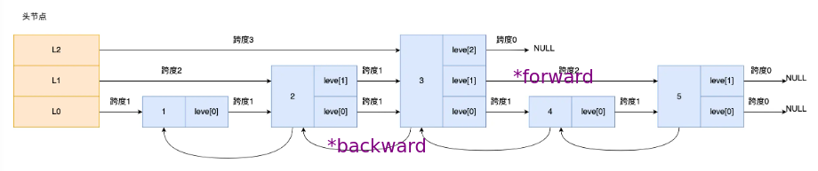

# 1. QuickStart

Redis是一个基于内存的key-value结构数据库，由于存放在内存中故读写性能高，适合用于缓存

## 1.1 下载安装

Windows可以直接在

https://github.com/tporadowski/redis/releases/tag/v5.0.14.1

中下载压缩包，解压缩后即完成安装

其中

- redis.windows.conf是Redis配置文件
- redis-cli.exe是Redis客户端，用于连接Redis服务器
- redis-server.exe是Redis服务端，用于打开Redis服务器

## 1.2 启动服务器

在Redis安装目录中打开命令行，执行`redis-server.exe redis.windows.conf`命令即可打开

其中后面是指定启动服务器所使用的配置文件

默认使用6379端口

默认没有密码，可以在配置文件中使用 `requirepass` 指定密码，指定密码之后客户端就需要输入密码以连接服务器

## 1.3 连接Redis服务

**命令行**

在Redis安装目录中打开命令行，执行

`redis-cli.exe -h localhost -p 6379 -a password`

命令连接服务器，-h指定主机，-p指定端口号，-a指定密码（Redis没有用户名的概念）

**图形化界面**

可以下载[AnotherRedisDesktopManager](https://github.com/qishibo/AnotherRedisDesktopManager)来使用图形化界面连接和操作Redis

**在SpringBoot连接**

1. 引入redis依赖

   ```xml
   <dependency>
       <groupId>org.springframework.boot</groupId>
       <artifactId>spring-boot-starter-data-redis</artifactId>
   </dependency>
   ```

2. 在配置文件中配置

   ```yaml
   spring:
     redis:
       host: 127.0.0.1
       port: 6379
       password: wangyize201
       database: 0
   ```

3. 创建配置类（可选）

   在配置类中可以对redisTemplate对象进行一些配置，当然默认配置也可以使用

   ```java
   @Configuration
   public class RedisConfig {
   
       @Autowired
       private RedisConnectionFactory redisConnectionFactory;
   
       public RedisTemplate<String, Object> redisTemplate() {
           RedisTemplate<String, Object> redisTemplate = new RedisTemplate<>();
           // 这里中间可以做一些配置
           // 序列化key
           return redisTemplate;
       }
   }
   ```

## 1.4 常用数据类型

Redis使用key-value结构存储数据

其中key是字符串类型，value有5中常用的数据类型

- 字符串 string

- 哈希 hash

  也叫散列，类似于HashMap结构，里面是field和value的映射

- 列表 list

  类似于LinkedList，可以从头部插入也可以从尾部插入，保存了插入顺序

- 集合 set

  无序集合，没有重复元素，类似于HashSet

- 有序集合 sorted set / zset

  没有重复元素，集合中每个元素关联一个分数，根据分数升序排序

# 2. Redis数据类型

Redis对于不同的value数据类型有不同的命令来操作

## 2.0 通用命令

查找所有符合给定模式的key：`KEYS pattern` ，比如`KEYS *`返回所有key

检查给定的key是否存在：`EXISTS key`

返回key对应的value的类型：`TYPE key`

删除key：`DEL key`

## 2.1 String

String类型的value不仅可以是字符串，也可以是数字（整数或浮点数），最多可容纳的数据长度是512M

### 2.1.1 底层实现

底层数据结构实现主要是int和SDS（简单动态字符串）

**SDS**

SDS与原生的C字符串相比有以下不同

- SDS不仅可以保存文本数据，还可以保存二进制数据

  这是因为SDS保存了字符串长度len，可以通过len值而不是空字符串判断字符串是否结束

- SDS获取字符串长度的时间复杂度是O（1）

  C语言字符串不记录自身长度，所以获取长度的复杂度为O（n）

- Redis SDS API安全，拼接字符串不会造成缓冲区溢出

**数据保存方式**

字符串对象的内部编码方式有三种：int、raw和embstr

- int

  

  如果字符串对象保存的是整数值，并且这个整数值可以用long表示，那么这个整数值会被保存在字符串对象结构（redisObject）的ptr属性里面，并将字符串对象的编码设置为int

- embstr：专门用于保存短字符串的优化编码方式

  如果字符串对象保存一个<=32字节的字符串，则字符串对象将使用一个SDS来保存这个字符串，并将对象编码设置为embstr

  

  embstr与raw的不同在于embstr会通过一次内存分配直接分配一块连续的内存空间同时保存redisObject和SDS，而raw会分配两次内存

  缺点在于如果字符串长度增加需要重新分布内存，则需要先将对象编码从embstr转换为raw，整个redisObject和SDS都重新分配空间，再执行修改。

- raw

  字符串长度大于32字节，会用SDS保存这个字符串，并将对象编码设置为raw

  

  

### 2.1.2 常用命令

**增**

设置指定key的值： `SET key value`

设置指定key的值，并将key的过期时间设为seconds秒： `SETEX key seconds value`

只有在key不存在时才能设置key的值： `SETNX key value`

**查**

根据key获得value：`GET key`

获取key所存储的字符串值的长度：`STRLEN name`

**计数器**

将key中存储数字值+1:`INCR key`

将key中存储数字值+n：`INCRBY key n`

-1:`DECR key`

-n：`DECRBY key n`

### 2.1.3 应用场景

**缓存Java对象**

可以直接用来缓存Java对象，Java对象会转化为json字符串保存

**计数**

**分布式锁**

使用SETNX命令，如果key存在说明锁存在

**共享session信息**


## 2.2 哈希表hash

Redis hash类型是一个field和value的映射表，其中field和value都是字符串


### 2.2.1 底层实现

底层由压缩列表或哈希表实现

- 哈希元素个数（即field个数）小于512个，哈希表中所有的值均小于64字节时（均可配置），用压缩列表存储
- 否则用哈希表存储

Redis7.0中，压缩列表数据结构被废弃，交由listpack数据结构实现

### 2.2.2 常用命令

**增\改**

将key对应的哈希表中字段field的值设为value ： `HSET key field value`

**查**

获取存储在哈希表中指定字段的值：`HGET key field`

获取哈希表中所有字段：`HKEYS key`

获取哈希表中所有值：`HVALS key`

**删**

删除存储在哈希表中的指定字段：`HDEL key field`

### 2.2.3 应用场景

**缓存java对象**

一般对象用String + Json存储

如果对象中有某些频繁变化的属性可以考虑抽出来用Hash类型存储

**购物车**

用户id作为key，商品id作为field，商品数量作为value，恰好可以保存购物车数据

## 2.3 列表list

Redis列表是字符串列表，按照插入顺序排序，左侧为头右侧为尾，可以从两端进行插入和删除操作，支持随机读取

主要用于消息队列，但缺点较多

### 2.3.1 底层实现

由双向链表或压缩列表实现：

- 如果列表元素个数小于512，列表每个元素值小于64字节（这两个值都可以配置），Redis会使用压缩列表存储List
- 否则使用双向链表存储

Redis3.2之后，List底层数据结构只由quicklist实现

### 2.3.2 常用命令

**增**

左插/头插：`LPUSH key value1 value2 value3`

LPUSH的意思是Left Push，也就是从列表左侧头部插入元素，插入完之后列表的元素顺序为 `value3 value2 value1`，对应的id依次是1，2，3，新插入的元素id是1

右插/尾插：`RPUSH key value1 value2...`

**查**

获取列表指定范围内的元素（下标从0开始，最新插入的元素下标为0，-1表示结尾）：`LRANGE key start stop`

获取列表长度：`LLEN key`

**删**

移除并返回key列表头元素（最左侧元素）：`LPOP key`

移除并返回key列表头元素（最左侧元素）：`RPOP key`

## 2.4 集合set

Redis set是string类型的无序集合。集合成员是唯一且不重复的，只能获取全部成员，无法获取指定元素。


### 2.4.1 底层实现

底层数据类型是由整数集合或哈希表实现的

- 如果集合中的元素都是整数且元素个数小于512（可配置），Redis会使用整数集合作为Set类型的底层数据结构
- 否则使用哈希表作为Set类型的底层数据结构

### 2.4.2 常用命令

**增**

向集合添加一个或多个成员：`SADD key member1 member2`

**插**

获取集合的所有成员：`SMEMBERS key`

获取集合的成员数：`SCARD key`

**删**

删除集合中一个或多个成员：`SREM key member1 member2`

**随机选**

从集合key中随机选出count个元素，元素不从key中删除：`SRANDMEMBER key count`

从集合key中随机选出count个元素，元素从key中删除：`SPOP key count`

**集合运算**

Set的集合运算的计算复杂度较高，在数据量较大的情况下如果直接执行会导致Redis阻塞。可以将聚合统计操作交给从库，或者将数据交给客户端由客户端完成聚合统计

- 交集

  求给定所有集合的交集：`SINTER key1 key2...`

  求给定所有集合的交集，并将交集存入新集合destination中：`SINTERSTORE destination key1 key2...`

- 并集

  求给定所有集合的并集：`SUNION key1 key2`

  存入destination中：`SUNIONSTORE destination key1 key2...`

- 差集

  求给定所有集合的差集：`SDIFF key1 key2`

  存入destination中：`SDIFFSTORE destination key1 key2...`

### 2.4.3 应用场景

**点赞**

使用Set类型不可重复的特点保证一个用户只能点一个赞

用文章id作为key，给文章点赞的用户id存入key对应的set中

**共同关注**

使用交集运算

**抽奖活动**

利用set的随机抽取命令做抽奖功能

## 2.5 有序集合zset

Redis有序集合是string类型元素的集合，不允许有重复成员。每个元素都会关联一个double类型的分数，通过这个分数来进行排序。多用作排行榜

### 2.5.1 底层实现

底层使用压缩列表和跳表实现

- 有序集合的元素个数小于128个，并且每个元素的值小于64字节时，Redis会使用压缩列表作为Zset类型的底层数据结构
- 否则使用跳表

在Redis7.0中，压缩列表数据结构被废弃，交由listpack数据结构实现

zset底层实际上是dict + 跳表，跳表按score从小到大保存所有集合元素，dict则保存从member到score的映射，这样可以用O(1)的复杂度查找member对应的score值

### 2.5.2 常用命令

**增**

添加一个或多个成员：`ZADD key score1 member1 score2 member2`

**查**

返回指定下标start到stop内的成员（索引从0开始按照分数升序排序，-1表示取到结尾，使用WITHSCORES在返回时带上成员分数一起返回）：`ZRANGE key start stop WITHSCORES` 

倒序获取指定下标start到stop的元素：`ZREVERANGE key start stop [WITHSCORES]`

获取所有元素：`ZRANGE key - +`

获取指定元素member的分数值：`ZSCORE key member`

返回指定分数区间内的成员：`ZRANGEBYSCORE key min max`

**改**

对有序集合中指定成员分数加上增量increment：`ZINCRBY key increment member`

**删**

移除一个或多个成员：`ZREM key member1 member2`


# 3. Java中操作Redis

Redis的Java客户端很多，常用的有Jedis、Lettuce、Spring Data Redis

其中Spring Data Redis是Spring对Redis的封装

## 3.1 环境搭建

1. 导入Spring Data Redis依赖

```xml
<dependency>
	<groupId>org.springframework.boot</groupId>
    <artifactId>spring-boot-starter-data-redis</artifactId>
</dependency>
```

2. 在spring配置文件中配置Redis数据源

   spring data redis默认使用lettuce数据池，可以配置数据池相关

application-dev.yml

```yaml
sky:
  redis:
    host: localhost
    port: 6379
    password: wangyize201  
    lettuce:
    	pool:
    		max-active: 8
    		max-idle: 8
    		min-idle: 0
    		
```

application.yml

```yaml
spring:
  redis:
    host: ${sky.redis.host}
    port: ${sky.redis.port}
    password: ${sky.redis.password}
    database: 0 # 在Redis中有0~15共16个数据库，不指定默认是0
```

3. 遍历配置类，创建RedisTemplate对象并注入到容器中

   这一步不是必须的，只是为了将key的序列化器设置为string，方便在Redis可视化工具中查看

   就算不设置也没有问题，而且Spring也会自动注入RedisTemplate对象

```java
@Configuration
@Slf4j
public class RedisConfiguration {

    @Bean
    public RedisTemplate redisTemplate(RedisConnectionFactory redisConnectionFactory) {
        RedisTemplate redisTemplate = new RedisTemplate();
        // 设置Redis连接工厂对象
        redisTemplate.setConnectionFactory(redisConnectionFactory);
        // 设置key的序列化器为string
        redisTemplate.setKeySerializer(new StringRedisSerializer());
        return redisTemplate;
    }
}
```

3. 通过RedisTemplate对象操作Redis

可以通过注入的RedisTemplate对象获取对应数据类型的操作对象

```java
@Autowired
RedisTemplate redisTemplate;

ValueOperations valueOperations = redisTemplate.opsForValue();
HashOperations hashOperations = redisTemplate.opsForHash();
ListOperations listOperations = redisTemplate.opsForList();
SetOperations setOperations = redisTemplate.opsForSet();
ZSetOperations zSetOperations = redisTemplate.opsForZSet();
```

## 3.2 操作数据

Redis和Java中的String不一样，所以函数的参数和返回值都是Object类型，Java的Object类型会自动转为String再插入Redis中

### 3.2.0 通用命令

通用命令直接使用redisTemplate对象执行

查找所有符合给定模式的key：`KEYS pattern` ，比如`KEYS *`返回所有key | `Set keys = redisTemplate.key(pattern:"*")`

检查给定的key是否存在：`EXISTS key` | `boolean key = redisTemplate.hasKey("key")`

返回key对应的value的类型：`TYPE key` | `DataType type = redisTemplate.type("key");`

删除key：`DEL key` | `redisTemplate.delete("key");`

### 3.2.1 字符串类型

**增**

set：`redisTemplate.opsForValue().set("city", "北京");`

setex：`redisTemplate.opsForValue().set("code", "1234", 3, TimeUnit.MINUTES);`

setnx：`redisTemplate.opsForValue().setIfAbsent("city", "北京");` ，如果key不存在则成功设置返回true，如果key已经存在则返回false

**查**

get：`String city = (String) redisTemplate.opsForValue().get("name");`

### 3.2.2 Hash类型

`HashOperations hashOperations = redisTemplate.opsForHash();`

**增\改**

将key对应的哈希表中字段field的值设为value ： `HSET key field value`

`hashOperations.put(key:"100", field:"name", value:"Tom");`

**查**

获取存储在哈希表中指定字段的值：`HGET key field` | `hashOperations.get(key:"100", hashKey: "name");`

获取哈希表中所有字段：`HKEYS key` | `Set keys = hashOperations.keys(key:"100");`

获取哈希表中所有值：`HVALS key` | `List values = hashOperations.values(key:"100");`

**删**

删除存储在哈希表中的指定字段：`HDEL key field`

`hashOperations.delete(key:"10", hashKeys:"age");`

### 3.2.3 List类型

先获取操作对象：`ListOperations listOperations = redisTemplate.opsForList()`

**增**

将一个或多个值插入列表头部：`LPUSH key value1 value2 value3`

LPUSH的意思是Left Push，也就是从列表左侧头部插入元素，插入完之后列表的元素顺序为 `value3 value2 value1`，对应的id依次是1，2，3，新插入的元素id是1

插多个：`listOperations.leftPushAll("key", "value1", "value2", "value3");`

插一个：`listOperations.leftPushAll("key", "value4");`

**查**

获取列表指定范围内的元素（下标从0开始，最新插入的元素下标为0，-1表示结尾）：`LRANGE key start stop` | `listOperations.range("key", start:0, end:-1)`

获取列表长度：`LLEN key` | `Long size = listoperations.size("key")`

**删**

移除并获取列表最后一个（最右侧，最先插入）的元素：`RPOP key`

`listOperations.rightPop("key");`

### 3.2.4 set类型

**增**

向集合添加一个或多个成员：`SADD key member1 member2` | `setOperations.add("key", "mem1", "mem2");`

**查**

获取集合的所有成员：`SMEMBERS key` | `setOperations.members("key")`

获取集合的成员数：`SCARD key` | `setOperations.size("key")`

**删**

删除集合中一个或多个成员：`SREM key member1 member2` | `setOperations.remove("set1", "mem1", "mem2");`

**集合运算**

求给定所有集合的交集：`SINTER key1 key2` | `setOperations.insersect("key1", "key2")`

求给定所有集合的并集：`SUNION key1 key2` | `setOperations.union("key1", "key2")`

### 3.2.5 zset类型

**增**

添加一个或多个成员：`ZADD key score1 member1 score2 member2` | `zSetOperations.add("key", "value", score:10);`

**查**

返回指定索引内的成员（索引从0开始按照分数升序排序，-1表示取到结尾，使用WITHSCORES在返回时带上成员分数一起返回）：`ZRANGE key start stop WITHSCORES` | `Set zset1 = zSetOperations.range("key", start:0, end:-1)`

**改**

对有序集合中指定成员分数加上增量increment：`ZINCRBY key increment member` | `zSetOperations.incrementScore("key", "member", delta:10)`

**删**

移除一个或多个成员：`ZREM key member1 member2` | `zSetOperations.remove("key", "member1", "member2");`

# 4. Redis数据结构

Redis数据结构并不是指String、List、Hash、Set、Zset等，这些事Redis的数据类型，也就是数据的保存形式。这些数据类型底层实现的方式才是数据结构

Redis数据类型和底层数据结构在不同版本有不同的映射


## 4.1 Redis是怎么存键值对的

在Redis中，key是字符串对象，而value可以是多种数据类型

## 4.2 SDS

Redis的字符串类型底层使用的就是SDS，simple dynamic string，Redis自己封装的简单动态字符串

**C字符串的问题**

Redis是用C语言实现的，而它没有直接使用C的char*字符数组来实现字符串

因为C语言char*数组用\0表示字符串的结束。当获取字符串长度时，C语言会遍历字符串统计字符个数，直到遇到\0停止。同时由于\0表示字符串的结束，因此在字符数组中就不能出现\0字符，这就导致C语言字符串只能保存文本数据，不能保存二进制数据。

并且C语言标准库中字符串的操作函数不安全，比如strcat字符串拼接函数，由于C语言字符串不会记录自身缓冲区大小，所以strcat函数假设执行时已经为原字符串分配了足够多的内存，可以容纳拼接之后的长度。而一旦空间不足，就会发生缓冲区溢出，造成程序运行终止

**SDS结构**


- len：保存了字符串的长度

  这意味着获取字符串长度的时间复杂度变为O（1）

  同时意味着无需使用\0来作为字符串结束的标志，而是可以通过len找到字符串的结束位置。从而可以保存任意格式的二进制数据

- alloc：分配给字符数组的空间大小

  这样可以在修改字符串时，通过alloc - len计算出剩余空间大小，如果空间不足则进行扩容。避免了缓冲区溢出的问题

- flags：用来表示SDS的类型，Redis设计不同SDS类型用来节省空间

  Redis一共设计了5种类型：sdshdr5、sdshdr8、sdshdr16、sdshdr32、sdshdr64

  不同类型的区别在于数据结构中的len和alloc变量的数据类型不同

  比如sdshdr16类型的len和alloc数据类型都是uint16_t，而sdshdr32则都是uint32_t

- buf[]：字符数组，用来保存实际数据

## 4.3 链表

在Redis3.2之前用于元素较多的list的底层结构

Redis封装的链表为双向无环链表，同时为链表又封装了一层结构，保存了链表的长度以及一些常用函数


## 4.4 压缩列表

在Redis7.0之前用于保存元素较少且元素值不大时的Redis对象（list、hash、zset）的底层结构

压缩列表的最大特点就是，它是一种内存紧凑型的数据结构，占用连续的内存空间，为了节约内存而开发，会为不同类型的数据分配不同的空间

**压缩列表结构**

蓝色部分是表头部分，绿色部分存储数据，红色为尾部


表头字段：

- zlbytes：记录整个压缩列表占用的内存字节数
- zltail：记录压缩列表尾部节点的偏移量，即尾部节点距离起始地址有多少字节
- zllen：记录压缩列表包含的节点数量

表尾：

zlend：标记压缩列表的结束点，里面存储的是固定值0xFF（十进制255）

entry节点字段：

entry节点大小根据存储在该节点的数据类型而定，不是固定的

- prevlen：记录前一个节点的长度，为了方便从后向前遍历

  根据前一个节点的长度分配该字段的空间

  如果前一个节点长度小于254字节，则prevlen属性使用1字节空间保存这个长度；如果>=254字节，则prevlen属性需要用5字节空间保存

- encoding：记录当前节点存储数据的类型和长度（通过Redis自定义的编码确定数据类型）

  这个字段本身也会根据存储数据的类型 而确定本字段大小，极致节省空间

  类型主要为字符串和整数，如果当前节点保存数据是整数，则encoding使用1字节空间，如果是字符串，则encoding根据字符串大小使用1\2\5字节空间编码

- data：记录当前节点存储的实际数据

**压缩列表的问题**

- 查找复杂度高

  由于压缩列表每个节点大小不固定，因此无法随机存取，查找元素时只能逐个查找，复杂度是O(n)。而获取表头和表尾元素的时间复杂度都是O(1)

- 重新分配空间

  压缩列表新增或修改某个元素时，如果空间不够，则压缩列表占用的内存空间就需要重新分配

- 连锁更新

  如果头插一个元素，而该元素较大时，由于prevlen字段大小根据前一个节点大小而定，因此可能会导致后续元素的prevlen占用空间都发生变化，从而引起连锁更新，导致后续所有元素的空间都要重新分配

因此压缩列表只适合在存储的元素个数很少并且存储的元素小时使用

后续Redis设计了quicklist（Redis3.2）和listpack（Redis5.0）代替压缩列表

## 4.5 哈希表

用于Hash对象的底层实现

Redis采用链式哈希解决哈希冲突，Redis哈希表结构如下

```c
typedef struct dictht {
    // 哈希表数组
    dictEntry **table;
    // 哈希表大小，即哈希数组的长度
    unsigned long size;
    // 哈希表大小掩码，用于计算索引值
    unsigned long sizemask;
    // 当前已有的节点数量
    unsigned long used;
} dictht;
```

dictEntry是哈希表，是一个数组，数组中的每个位置都是一个哈希桶，dictEntry是哈希表中的元素，发生冲突的元素会链成一个链表


### 4.5.1 rehash

当某个哈希桶中的链表过长时，就会导致在这一位置上查询数据耗时增加，此时就需要rehash，即对哈希表大小进行扩展

**rehash触发条件**

rehash触发条件和负载因子（load factor）有关

负载因子 = 哈希表已保存节点数量 / 哈希表大小

- 当负载因子>=1，并且Redis没有在执行bgsave（RDB快照）和bgrewriteaof（AOF重写）的时候，就会进行rehash
- 当负载因子>=5时，说明哈希冲突非常严重，此时不管有没有进行RDB快照或AOF重写，都会强制rehash

**rehash过程**

在Redis实际使用哈希表时，定义了一个dict结构体，这个结构体里有两个哈希表（两个dictht）

```c
typedef struct dict {
    // 两个哈希表
    dictht ht[2];
} dict;
```

第二个哈希表在rehash时会用到

在正常插入数据时，都会将数据插入到哈希表1中，此时哈希表2没有分配空间，随着数据增多，触发rehash操作：

1. 给哈希表2分配空间，一般是哈希表1的两倍
2. 将哈希表1中的数据迁移到哈希表2中
3. 迁移完成后，释放哈希表1的空间，把哈希表2设置为哈希表1，然后哈希表2继续为下次rehash做准备

在第二步数据迁移过程中，会涉及到大量的数据拷贝，此时可能会造成Redis阻塞

**渐进式rehash**

为了避免一次性数据迁移造成的Redis阻塞，Redis采用渐进式rehash，将数据的迁移工作分为多次完成

使用渐进式rehash之后，触发rehash步骤如下

- 给哈希表2分配空间
- 在rehash期间，每次哈希表元素进行增删改查操作时，Redis除了执行对应操作，还会按照顺序将哈希表1中的元素迁移到哈希表2上，最终完成全部迁移

在渐进式rehash期间，查找操作会在哈希表1中查找，如果1没有则继续在2查找；新增操作会直接保存在哈希表2中

## 4.6 整数集合

整数集合是Set对象元素较少时的底层实现

整数集合实际上是一片连续的内存空间，结构定义如下

```c
typedef struct intset {
    // 编码方式
    uint32_t encoding;
    // 集合中包含的元素数量
    uint32_t length;
    // 保存元素的数组
    int8_t contents[];
} intset;
```

虽然contents数组声明为int8_t类型，但实际上里面保存的数据类型由encoding属性决定

- 如果encoding属性值为INTSET_ENC_INT16，则数组中元素类型为int16_t
- 如果encoding属性值为INTSET_ENC_INT32，则数组中元素类型为int32_t
- 如果encoding属性值为INTSET_ENC_INT64，则数组中元素类型为int64_t

**数组集合的升级**

当一个新元素加入到整数集合里面，如果新元素的类型（比如int32_t）比整数集合现有元素类型（比如int16_t）都要长时，整数集合需要先进行升级，即按照新元素的类型（int32_t）扩展contents数组的空间大小。整数集合不支持降级操作

整数集合升级不会重新分配一个新类型数组，而是在原本数组上扩展空间，然后按照新元素类型的类型进行间隔大小的分割

## 4.7 跳表

Zset对象的底层实现用到了跳表

### 4.7.1 跳表结构

跳表是在链表的基础上改进而来，是一种多层的有序链表

通过不同的层级，可以减少查找元素时遍历的次数，当数据量很大时，跳表的查找复杂度可以达到O（logN）


在跳表的实际实现中，同一个元素对应的多层实际上都是一个节点，这些层级关系由节点内的level数组保存

**跳表节点定义**

```c
typedef struct zskiplistNode {
    // Zset中元素的值
    sds ele;
    // Zset中元素的权重
    double score;
    // 指向上一个节点的指针
    struct zskiplistNode *backward;
    
    // 节点的level数组，保存层次信息
    struct zskiplistLevel {
        // 指向同一层的下一个节点
        struct zskiplistNode *forward;
        // 跨度
        unsigned long span;
    } level[];
} zskiplistNode;
```



**跳表结构体**

```c
typedef struct zskiplist {
    struct zskiplistNode *header, *tail;
    unsigned long length;
    int level;
} zskiplist;
```

在跳表结构体中，记录了跳表的头尾节点，跳表长度，以及跳表的最大层数

### 4.7.2 跳表操作过程

**查询节点**

从头结点最高层开始，逐一遍历每一层。

- 如果当前节点权重小于要查找的权重，就往右走
- 如果当前节点权重大于要查找的权重，就先往左走（返回上一个节点），再往下走下一层
- 如果下一个节点为空，也往下走

**插入节点**

不难看出跳表的相邻两层的节点数量最理想的比例是2:1，此时查找复杂度可以降为O(logN)

但是如果在新增或删除节点时调整跳表节点刻意维持比例的话会带来额外开销。所以Redis采用的方法是在创建节点时随机生成每个节点的层数，而不是严格维持

具体做法是：

1. 创建节点时生成范围为[0,1]的一个随机数，如果随机数小于0.25，那么层数就增加一层，然后继续生成下一个随机数
2. 如果下一个随机数还是小于0.25，这个节点就再增加一层，然后继续生成下一个。
3. 直到随机数结果大于0.25结束

### 4.7.3 跳表优点

跳表的主要优势在于

- 结构简单，增删操作方便，同时查询效率也不低
- 由于最后一层是链表，因此范围查询也很简单

- 更节省内存（与B树或者B+树相比）

**跳表vs平衡树**

平衡树可以通过中序遍历的方式达到和跳表一样的范围查询效果，但是效率没有跳表高

但是每次插入或删除都需要旋转保证平衡，比较复杂

**跳表vs红黑树**

和平衡树类似的缺点

同时区间查找中序遍历操作效率没有跳表高

**跳表vsB+树**

跳表实现起来更简单

数据库或文件系统使用B+树作为索引结构主要是因为可以在存储大量数据的情况下更为矮胖层数更低，可以减少IO次数，但是Redis作为内存数据库不用考虑这点。

## 4.8 quicklist

Redis3.2之后，list对象底层数据结构由quicklist实现

quicklist就是双向链表 + 压缩列表，意思是quicklist是一个双向链表，其中的每个节点都是一个压缩列表

通过这种方式，quicklist可以控制每个链表节点中的压缩列表的元素个数，来规避潜在的连锁更新的风险，但其实并没有完全解决连锁更新的问题


## 4.9 listpack

Redis5.0新增了listpack，用于替代压缩列表

listpack采用了压缩列表很多优秀设计，比如用连续的内存空间紧凑地保存数据，根据不同的数据类型分配不同的内存空间。

而删除了导致压缩列表连锁更新的关键字段──保存上一个节点大小的字段，因此在插入新元素时也不会有连锁更新的问题


- encoding：当前节点元素的编码类型
- data：实际存放的数据
- len：encoding+data字段的总长度

通过len字段，listpack也可以完成从后向前遍历，这样就完全替代了压缩列表中原有prevlen字段的功能

# 5. Redis持久化

## 5.1 AOF日志

AOF，Append Only File，会把Redis中执行的写操作命令以追加的方法保存在日志文件中。重启Redis时读取AOF日志中的命令并执行，就可以恢复缓存数据。

### 5.1.1 AOF写回策略

Redis会先执行写操作命令，之后才将该命令记录到AOF日志中。

**写入AOF日志过程**

1. 执行写操作命令

2. 将命令追加到server.aof_buf缓冲区

3. 通过write()系统调用，将aof_buf缓冲区的数据写入到AOF文件

   此时只是将数据拷贝到了aof文件对应的内核缓冲区的page cache，合适真正写入硬盘由内核决定

4. 内核发起写操作将page cache的内容写入硬盘

这样做可以避免对这条命令正确性的额外检查开销，并且不会阻塞当前写操作命令的执行。

但是可能会造成数据丢失（执行完命令之后Redis宕机），记录到AOF日志中的过程也可能会阻塞下一条命令的执行

**写回硬盘策略**

数据安全性和性能无法同时解决，所以Redis提供了三种写回策略来让用户选择优先保证哪个

写回硬盘的策略控制的就是第4步，即合适将page cache内容写入硬盘。在redis.conf的appendfsync配置项中配置

- Always：总是，每次写操作命令执行之后，都同步立即将AOF日志数据写回硬盘
- Everysec：每秒，每隔一秒将page cache缓冲区中的内容写回到硬盘
- No：不由Redis控制写回硬盘的时机，转交给操作系统控制写回的时机

这几种写回策略的实现实际上是通过fsync()函数，执行fsync函数会将内核缓冲区page cache中的内容立即同步到硬盘。

### 5.1.2 AOF重写机制

由于AOF是不断追加，随着执行的写操作命令越来越多，文件的的大小也会越来越大，Redis重启后的恢复过程也会变慢

同时Redis执行的写操作中有很多是无效命令，比如对同一个key的赋值操作，后面的赋值操作会覆盖掉前面的，但是AOF文件中会保留所有写操作

因此Redis提供了AOF重写机制，来压缩AOF文件

**重写过程**

读取当前数据库中的所有键值对，然后将每一个键值对用一条命令记录到 新的AOF文件，等待全部记录完之后，就将新的AOF文件替换掉现有AOF文件

先写到新的AOF文件再覆盖而不是直接在现有AOF文件修改是因为，如果AOF重写过程中失败，那么现有AOF文件就可能造成污染

**后台重写**

重写AOF比较耗时，因此Redis的重写AOF过程是由后台**子进程**bgrewriteaof完成的

选用后台子进程而不是线程是因为线程之间会共享内存，修改共享内存时需要加锁，导致性能降低。而使用子进程时，只能以只读方式共享内存（主进程会将页表复制一份给子进程，达到共享同一片物理内存），当有一方要写入时，就会发生写时复制，把要写的地方复制一份出来，此时父子进程就有了独立的数据副本，不用加锁保证数据安全。

后台重写过程：

1. 开启子进程进行后台重写
2. 如果主进程收到写入请求
   1. 触发写时复制，将要写入区域的内存复制一份
   2. 执行写入命令
   3. 将该操作写入AOF缓冲区
   4. 将该操作写入AOF重写缓冲区
3. 子进程重写完成，向主进程发送信号
4. 主进程会收到信号后，调用信号处理函数，完成以下操作
   1. 将AOF重写缓冲区的所有内容（即重写期间发生的写操作）追加到新的AOF文件中
   2. 新的AOF文件进行改名，覆盖现有的AOF文件

### 5.1.3 混合持久化

混合持久化在AOF重写日志的过程

开启混合持久化之后，在AOF重写日志时，fork出来的重写子进程会先将与主线程共享的内存数据以RDB方式写入到AOF文件。重写期间主线程处理的操作命令会记录在重写缓冲区中。重写完成后，重写缓冲区的增量命令会以AOF方式写入AOF文件。

也就是说使用混合持久化之后，AOF文件前半部分是RDB格式全量数据，后半部分是AOF格式增量数据

## 5.2 RDB快照

RDB快照就是记录某一个瞬间的内存数据，记录的是实际数据，因此Redis恢复数据时效率会比AOF高

**写时复制**

在执行bgsave（后台RDB）时，是交给子进程构建RDB文件，此时主线程可以正常处理请求，包括修改数据

这同样依赖于写时复制技术

但是如果在bgsave快照过程中，如果主线程修改了共享数据发生写时复制，子进程依然复制的是原本的数据。因此主线程在复制期间写入的新数据无法写入RDB文件，只能交由下一次bgsave快照。

# 6. 过期删除和内存淘汰

## 6.1 过期删除

Redis中可以对key设置过期时间，当key过期时就会被删除。将已过期的键值对删除这个工作就是过期键值删除策略。

### 6.1.1 设置过期时间

**给已有key设置过期时间**

- 设置key在n秒后过期：`expire key n`
- 设置key在n毫秒后过期：`pexpire key n`
- 设置key在某个时间戳（精确到秒）后过期：`expireat key n`
- 设置key在某个时间戳（精确到毫秒）后过期：`pexpireat key n`

**创建key时设置过期时间**

- 精确到秒

  `set key value ex n`

  `setex key n value`

- 精确到毫秒

  `set key value px n`

**查看剩余存活时间**

`ttl key`

**取消key的过期时间**

`persist key`

### 6.1.2 过期字典

对key设置过期时间时，Redis会把这个key和对应的过期时间存储到一个过期字典（expires dict）里，过期字典实际上是一个哈希表，key是一个指向某个键对象的指针，value是一个long long类型整数，保存了key的过期时间

当查询一个key时，会首先检查该key是否在过期字段中，如果不在则正常读取键值，如果在则会获取该key的过期时间，然后与当前系统时间比对，看是否过期。

### 6.1.3 过期删除策略

**常见的过期删除策略**

- 定时删除

  设置key过期时间的同时创建一个定时事件，当时间到达后会触发事件，并由事件处理器自动执行key的删除操作

  可以保证key尽快删除，对内存友好；但定时任务和删除key的操作会占用CPU，CPU不友好

- 惰性删除

  不主动删除过期键，而是在访问时才检测key是否过期，过期则删除key

  对CPU最友好，对内存不友好

- 定期删除

  每隔一段时间随机从数据库中取出一定数量的key进行检查，并删除其中的过期key

  对内存和CPU的占用取决于删除操作执行的频率

**Redis使用的过期删除策略**

惰性删除+定期删除

惰性删除：Redis在访问或修改key之前，都会调用expireIfNeeded函数检查key是否过期，如果过期就返回null给客户端，否则返回正常键值对

定期删除：

1. 从过期字典中随机抽取20个key
2. 检查这20个key是否过期，并删除已过期的key
3. 如果本论检查的已过期key数量超过25%（即5个），则重复步骤1，否则停止
4. 上面的循环过程不会超过25ms

## 6.2 内存淘汰

在Redis运行内存超过Redis设置的最大内存之后，会使用内存淘汰策略删除符合条件的key

在配置文件redis.conf中，可以通过`maxmemory <bytes>`来设定最大运行内存，64位操作系统默认是为0，即没有内存大小限制，32位系统为3G（因为32位机器最大支持4G内存）

### 6.2.1 内存淘汰策略

不进行数据淘汰的策略

- noeviction（Redis3.0之后默认的内存淘汰策略）

  运行内存超过最大内存之后，不淘汰任何数据。但是会禁止新的数据写入，只接受查询和删除操作

进行数据淘汰的策略

- 在设置了过期时间的数据中淘汰
  - volatile-random：随机淘汰设置了过期时间的任意键值
  - volatile-ttl：优先淘汰更早过期的键值
  - volatile-lru：淘汰所有设置了过期时间的键值中，最久未使用键值
  - volatile-lfu：淘汰所有设置了过期时间的键值中，最少使用（访问频率最低）的键值
- 在所有数据范围内淘汰
  - allkeys-random：随机淘汰任意键值
  - allkeys-lru：淘汰所有键值中最久未使用键值
  - allkeys-lfu：淘汰所有键值中最少使用（访问频率最低）的键值

可以通过`config get maxmemory-policy`查看当前Redis内存淘汰策略

通过`config set maxmemory-policy 策略`设置内存淘汰策略，或者在配置文件中配置`maxmemory-policy`

### 6.2.2 LRU算法

Least Recently Used，最近最少使用

传统LRU算法基于链表实现，链表中元素按照最近被访问的时间从前往后排列，最近操作的键会被移动到表头，需要内存淘汰时删除链表尾部的元素

但是这样会需要一个全局链表管理所有缓存数据，而且把数据移动到链表头这个操作会耗时

**Redis的实现**

Redis在对象结构体中添加了一个额外字段，记录此数据最后一次访问时间。

`unsigned lru:24`，24bits，记录了key的最近一次访问时间戳

当Redis进行内存淘汰时，会使用随机采样的方式淘汰数据。随机取5个值（可配置），然后淘汰最久没有使用的那个。

**缓存污染**

LRU算法有缓存污染的问题，比如应用一次读取了大量数据，而这些数据只会被读取这一次，但是会在Redis中留存很长一段时间，造成缓存污染。

为解决缓存污染的问题，Redis4.0之后引入了LFU算法解决这个问题

### 6.2.3 LFU算法

Least Frequently Used，最近最不常用。

LFU算法会根据数据访问次数淘汰数据，核心思想是，如果数据过去被访问多次，那么将来被访问的频率也更高

**Redis的实现**

和LRU共用一个 lru:24 字段，不过会被分为两段存储，高16bit存储ldt（Last Decrement Time），低8bit存储logc（Logistic Counter）


- ldt用来记录key 的访问时间戳
- logc用来记录key的访问频次（不是单纯的访问次数），值越小表示使用频率越低，越容易淘汰。每个新加入的key初始值为5

Redis访问key时，会更新ldt，并对logc进行变化：

1. 先按照本次访问距离上次访问的时长，对logc进行衰减

   距离上次的时长越大，则衰减的值越大

2. 然后按照一定概率增加logc的值

   根据概率更加，logc越大的key越难增加

# 7. Redis网络模型

Redis的核心业务部分（命令处理）是单线程，整个Redis系统则是有用到多线程

为什么采用单线程：

1. Redis是纯内存操作（不考虑持久化），执行速度非常快，它的性能瓶颈根本不是执行速度而是网络延迟，因此多线程不会带来巨大性能提升
2. 多线程会导致过多的上下文切换，带来不必要的开销
3. 引入多线程会面临线程安全问题，这样必然要引入线程锁等安全手段，让复杂度增高，性能也会大打折扣

## 7.1 单线程模型

Redis采用了IO多路复用，并且自己将所有系统对IO多路复用的实现都做了封装


1. 首先创建Server Socket，并给它绑定回调函数tcpAcceptHandler

   这个回调函数实际上就是当这个Socket有读事件之后会调用的函数

2. 将ServerSocket注册到EventPool中，然后开始监听，在监听前会执行一个beforesleep函数

3. 监听到客户端连接之后，调用tcpAcceptHandler函数

   这个函数就是获取连接成果后的已连接Socket，Redis会把它封装为client socket，并给它绑定读事件回调函数readQueryFromClient，然后注册到EventPool中

   由于Redis系统就是接受Redis命令，因此readQueryFromClient函数完成的工作就是解析客户端发来的Redis命令，并执行，再把执行结果写入client socket的buf中，再把这个client socket对象放入服务端的clients_pending_write队列中准备给客户端回复

4. 处理完这些之后，就应该重新进入监听状态了，但是在进入之前会执行beforesleep函数

   这个函数会给clients_pending_write队列中的所有待写出client socket的写事件绑定一个sendReplyToClient回调函数。由于这些客户端本身就在等待输出，即都有写事件，所以就会真正将命令执行结果写回socket发送给客户端

## 7.2 多线程模型

Redis6.0之后引入了多线程模型，进一步提升效率

现在的性能瓶颈在命令请求处理处理器中，从Socket读取命令时，从Socket读取数据会收到网络带宽等的影响。（执行命令没有瓶颈，因为Redis纯内存操作执行命令很快）

还有触发写事件时，往客户端socket写入给客户端返回的结果的时候，往Socket写入数据也会受网络带宽影响。


因此会在执行IO操作时引入多线程，最后执行命令还是由主线程单线程执行
