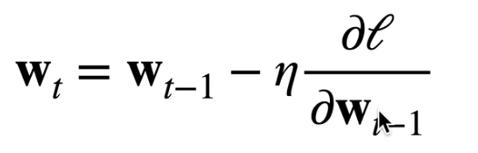

# 1. 数据操作

## 1.1 数组

### 1.1.1 N维数组样例

- 0-d 标量

  0维数组就是一个数字

  用来表示一个类别

- 1-d 向量

  就是一个一维数组

  用来表示一个特征向量

- 2-d 矩阵

  二维数组

  表示一个样本——特征矩阵

- 3-d

  三维数组

  可以用于表示RGB图片（宽×高×通道）

- 4-d

  四维数组

  可以用于表示一个RGB图片批量（即多张图片）

- 5-d

  五维数组

  可以用于表示一个视频批量（批量大小×时间×宽×高×通道）

### 1.1.2 创建数组

创建数组需要以下信息

- 形状

  比如3x4的二维数组

- 每个元素的数据类型

  比如32位浮点数

- 每个元素的值

  比如全是0，或者服从正态分布的随机数

### 1.1.3 访问数组元素

以下操作只能在torch数据ndArray中实现

比如一个四行四列的二维数组

```python
1  2  3  4
5  6  7  8
9 10 11 12
13 14 15 16
```

- 访问一个元素

  [1,2] —— 7

- 访问一行

  [1, :] —— [5,6,7,8]

- 访问一列

  [ : , 1] —— [2,6,10,14]的转置

- 访问连续子区域

  [1:3, 1:] 

  ```python
  6  7  8
  10 11 12
  ```

- 访问分散子区域

  每隔3个选一个数据
  
  ```python
  [::3, ::2]
  1   3
  13  15
  ```
  
  指定下标选取一些数据
  
  ```python
  [[0, 2], [1, 2]] # 选取0，2行 中的 1，2列
   2   3
  10  11
  
  [[0, 2]] # 选取第0行和第2行
  [[0, 2], :] # 与这种写法等价
  1  2  3  4
  9 10 11 12
  ```

## 1.2 数据操作实现

### 1.2.1 创建张量

张量是数学中的概念，在计算机中对张量和数组没有区分。

表示一个数值组成的数组，这个数组可能有多个维度。

**指定填充元素创建张量**

- **arange** ：从0开始依次往下填充

  只能创建一维张量，可以通过reshape来更改为多维张量

  ```python
  x = torch.arange(6, dtype=torch.float32)
  x
  Out: tensor([0,1,2,3,4,5])
  ```

- **zeros** ：全部用0填充

- **empty**：不赋初值（用垃圾值填充）

- **ones**：全部用1填充

- **randn**：用随机数填充

  上述函数可以直接在参数中指定 创建多维张量

  ```python
  x = torch.zeros(3, 4)
  x
  Out:tensor(
  [0, 0, 0, 0],
  [0, 0, 0, 0],
  [0, 0, 0, 0]
  )
  ```

**通过Python列表创建**

tensor

```python
torch.tensor([[1, 2, 3, 4], [5, 6, 7, 8]])
```

### 1.2.2 张量的属性

- **reshape**：修改张量的形状（修改前后元素个数必须相同）

需要传入一个元组作为参数

```python
A = torch.arrange(12)
A = A.respape((3, 4))
```

- **shape** ：获取数组的形状

- **numel** ： 获取数组中元素的个数

### 1.2.3 张量运算

**标准运算**

可以对两个张量进行 `+ - * /  **` 运算，会将张量中的对应元素依次做对应运算

 ```python
 x = torch.tensor([1.0, 2, 4, 8])
 y = torch.tensor([2, 3, 2, 2])
 x ** y
 Out: tensor([ 1.,  8., 16., 64.]) # 分别计算 1^2 2^3 4^2 8^2
 ```

**逻辑运算**

\>  ==  < 

x == y ，将x和y中的每个对应位置的元素做比较，得到一个有True或False组成的张量

**张量连结cat**

```python
X = [[ 0.,  1.,  2.,  3.],
         [ 4.,  5.,  6.,  7.],
         [ 8.,  9., 10., 11.]]
Y = [[ 2.,  1.,  4.,  3.],
         [ 1.,  2.,  3.,  4.],
         [ 4.,  3.,  2.,  1.]]

torch.cat((X, Y), dim=0) # 在第0维合并，把行堆叠起来
tensor([[ 0.,  1.,  2.,  3.],
         [ 4.,  5.,  6.,  7.],
         [ 8.,  9., 10., 11.],
         [ 2.,  1.,  4.,  3.],
         [ 1.,  2.,  3.,  4.],
         [ 4.,  3.,  2.,  1.]]),

torch.cat((X, Y), dim=1) # 在第1维合并，把行拼接起来
tensor([[ 0.,  1.,  2.,  3.,  2.,  1.,  4.,  3.],
         [ 4.,  5.,  6.,  7.,  1.,  2.,  3.,  4.],
         [ 8.,  9., 10., 11.,  4.,  3.,  2.,  1.]])
```

**求和运算sum**

将张量中的所有元素求和，得到一个标量

### 1.2.4 广播机制

广播机制有两个要求：

1. 每个参与计算的Tensor至少有一个维度（即维度不能全是0）

   反例：

   ```python
   x = torch.zeros(0, 0)
   ```

2. 从两个Tensor的最后一个维度开始向前遍历，倒数对应的位置的维度需要满足以下三个条件的其中一个

   - 维度相等
   - 其中一个维度是1
   - 其中一个维度不存在

满足要求之后，会从两个Tensor的最后一个维度开始向前遍历，结果中倒数对应位置的维度增加到两个Tensor中的较大值（直接复制）

(当使用一个标量和一个张量做运算时，实际上是标量和矩阵中的每个元素分别做运算，这其实就是一种广播机制)

- 例1

```python
有两个二维张量：
a = torch.arange(3).reshape((3, 1))
b = torch.arange(2).reshape((1, 2))

[[0],
 [1],
 [2]]

[[0, 1]]

首先比较 1 和 2，满足要求其中一个维度是1，因此都扩大到2
然后比较 3 和 1，满足要求，因此都扩大到3
最终结果为 3 x 2
a + b
Out:tensor([[0, 1],
        [1, 2],
        [2, 3]])
```

- 例2

```python
x = torch.zeros(5, 3, 4, 1)
y = torch.zeros(3, 1, 1)

首先比较 1 和 1，相等满足要求
比较 1 和 4，其中一个是1满足要求，扩大到4
比较 3 和 3， 相等满足要求
比较 5 和 0， 其中一个维度不存在满足要求， 扩大到5

(x + y).shape
Out: torch.Size([5, 3, 4, 3])
```

- 例3

```python
x = torch.zeros(5, 3, 4, 1)
y = torch.zeros(3, 2, 1)

将上例中y的第1个维度换成2，不满足要求，会报错
The size of tensor a (4) must match the size of tensor b (2) at non-singleton dimension 2

最后的non-singleton dimension的下标是：出现不符合要求的维度的下标，该下标是维度更多的那个数组，从前往后数，下标从0开始计算得到的（实际上是轴axis的下标，即x的第二个轴的维度不符合要求）
```

### 1.2.5 存取数据

数据集一般存储在csv文件中

csv文件的特点是，数据之间以逗号，分割

**读取csv文件**

读取csv文件使用pandas库

```python
pip install pandas
import pandas as pd

data = pd.read_csv(data_file) # 参数是文件路径
```

## 1.3 线性代数操作

### 1.3.1 创建矩阵

矩阵即二维数组，和上面创建张量的操作相同

比如创建5×4的矩阵

- arange

  ```python
  A = torch.arange(20).reshape((5, 4))
  ```

- zeros

  ```python
  A = torch.zeros(5, 4)
  ```

- ones

  ```python
  A = torch.ones(5, 4)
  ```

### 1.3.2 矩阵转置

```python
A_T = A.T
```

可以通过判断矩阵与其转置是否相同来判断是否为对阵矩阵

```python
A == A.T
```

### 1.3.3 矩阵乘法

**对应元素相乘**

称为哈达玛积，即对应位置元素直接相乘，在数学中使用并不多

两个矩阵直接使用 * 相乘是计算哈达玛积

**dot向量点积(内积)**

dot只能对一维向量做乘积，即每个元素相乘再相加，得到一个标量

```python
a = torch.tensor([1, 2, 3, 4])
b = torch.tensor([4, 3, 2, 1])
torch.dot(a, b)
Out:20
    
torch.sum(a * b) # 与上面的dot操作等价
```

**mv矩阵向量积**

即Ax，一个矩阵乘一个向量

```python
A = torch.ones(3, 4)
x = torch.tensor([1., 2., 3., 4.])

1 1 1 1   1
1 1 1 1   2
1 1 1 1   3
          4
torch.mv(A, x)
	即 每行依次与向量相乘相加
	10 10 10
```

**mm矩阵乘法**

矩阵叉乘，即对应行和列相乘再相加

```python
A = torch.arange(20, dtype=torch.float32).reshape((5, 4))
B = torch.ones((4, 3))
torch.mm(A, B).shape
Out: torch.Size([5, 3])
```

### 1.3.4 矩阵按维度求和

```python
a = torch.ones(3, 4)
a

    1 1 1 1
    1 1 1 1
    1 1 1 1
```

**直接求和**

所有元素求和，得到一个标量

```python
a.sum()
Out: 12
```

**axis指定轴求和**

指定哪个轴求和，在结果矩阵中哪个维度就会消失（下标从0开始）

```python
a.sum(axis=0).shape # 输出torch.Size([4]), 第0轴 3 会消失，相当于按列相加

    3 3 3 3

a.sum(axis=1).shape # 输出torch.Size([3])， 第1轴 4 会消失，相当于按行相加

	4
    4
    4
```

可以同时按多个轴进行求和

```python
a = torch.ones((2, 5, 4))
a.sum(axis=[0,2]).shape 
Outs: torch.Size([5])
    
    8 8 8 8 8
```

**keepdims**

将keepdims置为True时会在指定轴求和时保留相应的维度，对应的维度会变成1

```python
a.sum(axis=0, keepdims=True).shape 
Outs: torch.Size([1, 4])
    tensor([[3, 3, 3, 3]])
```

### 1.3.5 求平均值

平均值和求和类似，只不过求和之后再除以相应的元素个数即可。也有按维度的概念

```python
A = torch.arange(6).reshape(3, 2)

	0 1
    2 3
    4 5
```

**求平均值**

```python
A = torch.arange(6, dtype=torch.float32).reshape((3, 2))
A.mean(), A.sum() / A.numel()
Outs: (tensor(2.5000), tensor(2.5000))
```

**按维度求平均值**

```python
A.mean(axis=0), A.sum(axis=0) / A.shape[0] # 相当于按列求
Out: (tensor([2., 3.]), tensor([2., 3.]))
```

### 1.3.6 矩阵范数

L范数针对一维向量，F范数针对矩阵

```python
u = torch.tensor([-3, 4])
```

**L1范数**

向量中的每个元素的绝对值相加

```python
torch.abs(u).sum()
Outs: tensor(7.)
```

**L2范数**

向量中的元素的平方和再开根号

```python
torch.norm(u)
Outs:tensor(5.)
```

**F范数**

其实和L2范数相同，只不过是相对于矩阵而言的

矩阵的所有元素的平方和开根号（相当于把矩阵拉成一个一维向量再求L2范式）

```python
torch.norm(torch.ones((4, 9)))
Outs: tensor(6.)
```

## 1.4 矩阵求导

### 1.4.1 矩阵（向量）求导规则


y对x求导时

标量表示只有一个变量比如 y，向量表示有多个变量，比如[x1, x2, x3, x4]

- 如果y是标量，x也是标量，求导也得到一个标量
- 如果y是标量，x是向量，求导得到一个向量
- 如果y是向量，x是标量，求导得到一个向量
- 如果y是向量，x也是向量，求导得到一个矩阵


**y是标量x是向量 （标量关于向量求导）**

这个事实上求的是梯度

运算规则中注意，X本来是列向量，求导之后的结果是行向量


例子：

```python
假设 y = x1^2 + 2 * x2^2 （这是一个椭圆，进而延申为一组等高线）
则y对x求导为  [2x1, 4x2] （第一个位置对x1求导，第二个位置对x2求导）

求出的(2x1, 4x2)就是梯度方向（即变化最大的方向）
比如在点（1，1），方向（2，4）就是梯度，跟等高线正交
```


**y是向量x是标量 （向量关于标量求导）**

y是列向量，求导之后的结果还是列向量。求导就是y1，y2... ym分别对x求导


**x是向量y是向量  （向量关于向量求导）**

相当于把y拆成m个标量，分别与x向量求导，每次求导都会求出一个行向量，最终求出m个行向量组成矩阵

y是m维，x是n维，结果是m×n


### 1.4.2 向量链式法则


记住向量求导之后结果的形状，就能大概猜出答案


**例子**


x,w是n维向量，y是标量。其中<x,w> 是x和w的内积（点积），就等于x.T × w

可以通过设中间变量a、b、z，再借用链式求导法则

最后 <x,w>对w求导，就是 x.T × w对w求导，结果是x.T。属于标量对向量求导

### 1.4.3 自动求导

自动求导是计算一个函数在指定值上的导数

有别于符号求导和数值求导

**计算图**

计算图是指将代码分解成操作子，进而将计算表示成一个无环图


计算图可以显示构造也可以隐式构造

- 显示构造

  Tensorflow/Theano/MXNet

- 隐式构造

  PyTorch/MXNet


**自动求导**

有了计算图之后，就可以根据这些操作子来使用链式法则一步一步求导


根据求导顺序的不同又可以分为正向累积和反向累积（反向传递）

### 1.4.4 自动求导代码

以对`y = 2*(x.T)*x`求导，不难看出y是一个标量

1. 在计算y关于x的梯度之前，需要一个地方来存储梯度

   ```python
   x = torch.arange(4.0) # tensor([0., 1., 2., 3.])
   x.requires_grad_(True) 
   x.grad # 计算出关于x的梯度之后就存在这个地方，默认值是None
   
   # 也可以用一行代码搞定
   x = torch.arange(4.0, requires_grad=True)
   ```

2. 计算y

   ```python
   y = 2 * torch.dot(x, x) # dot运算就是xTx运算
   y # y是一个标量
   Out: tensor(28., grad_fn=<MulBackward0>) # grad_fn是求梯度的函数，也就是隐式的计算图
   ```

3. 调用反向传播函数自动计算y关于x每个分量的梯度

   ```python
   y.backward() # 求导
   x.grad # 梯度的结果存在这里
   Out: tensor([ 0.,  4.,  8., 12.])
   ```

   ```
   计算过程：
   y = 2 * x^2,所以求导之后就是 y‘ = x.grad = 4 * x
   而x = [0, 1, 2, 3]
   所以带入之后就是 x.grad = [0, 4, 8, 12]
   
   x.grad == 4 * x
   Out: tensor([True, True, True, True])
   ```

4. 计算另一个关于x的函数的梯度

   在默认情况下，PyTorch会累积梯度，所以计算下一个之前要先清除之前的值

   ```python
   x.grad.zero_() # 清除梯度中保存的内容
   y = x.sum() # 此时y=x1 + x2 + ... + xn  y=tensor(6., grad_fn=<SumBackward0>)
   y.backward()
   x.grad
   Out: tensor([1., 1., 1., 1.])
       
   由于y=x1 + x2 + x3 ... + xn，所以y关于任何一个x求导都是1
   ```

**求偏导**

将某些计算移动到记录的计算图之外，我理解的就是用于求偏导

```python
x = torch.arange(4.0, requires_grad=True)
y = x * x # 这里y是关于x的一个向量，是x的平方
u = y.detach() # 这里u本来也应该是关于x的向量，但是使用detach之后可以让系统将u视为和x没关系的一个变量
z = u * x # 由于u已经和x没关系了，因此在z中u是一个常数（系数）

z.sum().backward() # z.sum() 就是 z = u*x1 + u*x2 + u*x3 + ... + u*xn
# 在求导之后就是 [u, u, u..., u]
x.grad == u 
Out: tensor([True, True, True, True])
    
x.grad # 由于u=x*x，因此将x=[0, 1, 2, 3]代入就是 [u, u, u, u] = [0, 1, 4, 9]
Out: tensor([0, 1, 4, 9])
```

# 2. 线性回归

线性回归是对n维输入的加权，外加偏差。

使用平方损失来衡量预测值和真实值的差异。

## 2.1 理论

### 2.1.1 实际案例

假设一个简化模型：房价预测

假设影响房价的因素有：卧室个数 x1， 卫生间个数 x2， 居住面积 x3

则成交价是关键因素的加权和 `y = w1x1 + w2x2 + w3x3 + b`

其中`W = [w1, w2, w3]`是权重，b是偏差，权重和偏差将在后面决定

### 2.1.2 线性模型

给定n维输入 `X = [x1, x2, ..., xn].T`

线性模型有一个n维权重 `W = [w1, w2, ..., wn].T` 和一个标量偏差 b

则输出是输入的加权和 `y = w1*x1 + w2*x2 + ... + wn*xn + b`，向量版本就是 `<W, X> + b` 即W和X的内积 加 标量b

线性模型可以看作是单层神经网络

### 2.1.3 衡量预估质量（损失）

通过房屋的真实值y 和 模型的估计值y.hat 来计算损失

下面是一种计算损失的方法，称为平方损失


### 2.1.4 参数学习（损失函数）

参数学习就是找到参数 W和b，使得损失最小，其中W是一个向量，b是一个标量

定义训练损失：

1. 由线性模型可知，对于i号房子，有 `yi.hat = <xi, W> + b`

   其中yi.hat是一个标量，表示对i号房子的预测价格

   xi 是一个向量，表示i号房子的 卧室个数、卫生间个数、居住面积组成的向量 `[xi1, xi2, xi3]`

2. 代入上面的平方损失公式，得到 i 号房子的房价损失模型为

   `1/2 * (yi - <xi, W> - b)^2`

3. 再将每个房子的平方损失 求平均值

   就是所有平方损失求和再除以n

   X是矩阵，xi是向量，w是向量

   

4. 注意到后面求和的部分可以写作L2范数

   即为最终的训练损失函数

机器学习的目标即为确定 W和b 的值，来使得训练损失达到最小

### 2.1.5 显示解

由于线性模型是凸函数，因此有显示解（在后面的模型中大都没有显示解）

显示解就是梯度为0的地方，即求导之后令导数为0


## 2.2 优化算法

当没有显示解时，只能通过优化算法来求得最优解

这里先只讲基础优化算法，最简单的优化算法为——梯度下降

### 2.2.1 梯度下降

先随便选一个w0，然后通过不断迭代来获取最优解



每一次的wt 等于 上一次迭代的结果 wt-1 减去 （η 乘  损失函数 L 关于 wt-1处的梯度）。因为梯度是下降最快的方向，所以每次都沿着下降最快的方向下降


其中η是一个标量，表示学习率，即步长，也就是说每次在 （损失函数L关于wt-1处的梯度）的方向走多远

η是一个超参数，也就是说这个值需要人为指定

**学习率的选择**

- 学习率的选择不能太小

  因为这样会导致计算梯度的次数过多。计算梯度在机器学习中是最消耗资源的部分

- 不能太大

  如果太大的话会导致震荡，而不是每次都在下降


### 2.2.2 小批量随机梯度下降

之前的损失函数 L 是基于所有数据（即整个训练集）得到的，由于在整个训练集上算梯度太贵了，所以我们可以从全部样本中采样几个样本，来近似训练损失。

采样的样本数b称为批量大小，也是一个超参数 

从全部样本 `[i1, i2, i3, ..., in]` 中采样 b个 `[i1, i2, ..., ib]` ,来近似损失


小批量随机梯度下降是深度学习默认的求解算法

其中有两个重要的超参数 学习率η 和 批量大小 b

## 2.3 从0实现算法

### 2.3.1 构造数据集

构造一个带有噪声的人造数据集

即通过正态分布生成的随机 x 生成一个数据集

再认为指定w和b，引入噪声ε，通过 `y = Xw + b + ε`  计算出y，得到一个数据集

```python
# w = [2, -3.4] b = 4.2
def synthetic_data(w, b, num_examples) : # 指定w、b和样本数量num_examples生成数据
    # 生成服从均值为0，方差为1的正态分布的随机x值 
    # X矩阵中 每行有len(w)个数据，代表一个样本中有len(w)个数据；
    # 共 num_examples行，表示生成num_examples个样本
    X = torch.normal(0, 1, (num_examples, len(w))) 
    y = torch.matmul(X, w) + b # 生成y ，y = Xw + b
    y += torch.normal(0, 0.01, y.shape) # 给生成的y添加噪声 噪声是服从（0，1）的正态分布的随机数
    return X, y.reshape((-1, 1)) # 返回时将y变为列向量

true_w = torch.tensor([2, -3.4])
true_b = 4.2
features, labels = synthetic_data(true_w, true_b, 1000) # 生成大小为1000的数据集
```

### 2.3.2 定义采样批量函数

该函数每次从所有数据集中随机抽取batch_size个数据

```python
def data_iter(batch_size, features, labels) : # features为X矩阵，labels为y向量
    num_examples = len(features)
    indices = list(range(num_examples)) # 给每个数据进行编号
    random.shuffle(indices) # 打乱所有下标，随机从中抽取数据
    
    for i in range(0, num_expamles, batch_size):
        # 这一步是 取出打乱后的下标数组中 [i:i+batch_size]部分，即随机取出batch_size个下标
        batch_indices = torch.tensor(indices[i:min(i + batch_size, num_examples)])
        # 从原有的数据集中，根据上面随机取出的batch_size个下标，随机抽取出batch_size个数据
        # 最后返回的是 (batch_size, len(w))维矩阵X 和 batch_size维向量y
        yield features[batch_indices], labels[batch_indices]
        

# 从数据集中随机取出10个数据
X, y = data_iter(10, features, labels)
print(X, '\n', y) # X是10x2的矩阵，y是长度为10的向量
```

### 2.3.3 定义线性回归模型

```python
def linreg(X, w, b):
    # 输入X，w和b，返回预测值y_hat
    return torch.matmul(X, w) + b 
```

### 2.3.4 定义损失函数

使用均方损失


```python
def squared_loss(y_hat, y):
    # 在这里先除以n，后面直接相加就能求出最后的 损失l
    return (y_hat - y.reshape(y_hat.shape)) ** 2 / 2 / batch_size
```

### 2.3.5 定义优化算法

使用小批量随机梯度下降


```python
def sgd(params, lr, batch_size):  
    """小批量随机梯度下降。"""
    with torch.no_grad():
        for param in params:
            # 在调用sgd函数之前已经完成梯度计算了，所以可以直接调用param.grad，即为 l对wt-1的梯度
            param -= lr * param.grad # lr即为η
            param.grad.zero_()
```

### 2.3.6 训练过程

**定义训练过程中用到的函数，生成数据**

```python
lr = 0.03 # 指定学习步长
num_epochs = 3 # 指定学习轮数
net = linreg # 指定用到的模型，本次使用线性模型
loss = squared_loss # 指定计算损失的函数，本次使用均方损失

features, labels = synthetic_data(true_w, true_b, 1000) # 人工构造此次使用的数据集
# 随机初始化w和b，迭代过程中会不断计算二者梯度，所以requires_grad都置为True
w = torch.normal(0, 0.01, size=(2, 1), requires_grad=True)
b = torch.zeros(1, requires_grad)
```

**训练过程**

所有模型的训练过程都大致相同

假设批量大小为b

1. 根据训练模型计算y_hat

   y_hat是大小为b的向量，因为对于每个xi 都能 计算出一个 y_hat_i

   由于初始化w 和 b时都指定了 requires_grad=True，所以此时y_hat中保存了关于w和b的计算图`y_hat = <X, w> + b`，且y_hat的requires_grad为True 

2. 根据损失函数计算本次使用 w 和 b 造成的损失 l

   损失 l 此时是 大小为b的向量，因为对于每一组 xi 和 yi 计算出一个损失 l_i

   l_i 由 y_hat_i 计算而来，因此 l 中保存了关于y_hat的计算图`l_i = 1/2 * (y_hat_i - y_i) ^ 2`，进一步即为关于w和b的计算图 

3. 计算真正的损失值 l 

   上一步计算出了所有的损失值，得到了向量 l ，现在需要求均值，得到真正的标量  l  

   因此我们进行 l.sum()操作，计算出总和

   

```python
for epoch in range(num_epochs):
    for X, y in data_iter(batch_size, features, labels):
        y_hat = net(X, w, b) # y_hat此时是一个向量
        l = loss(y_hat, y) # l此时是一个向量
        l.sum().backward() # l.sum()变成标量，即最终要求的损失函数，再对w-1求梯度
        sgd([w, b], lr, batch_size) # 求完梯度之后，将wt-1更新为wt
    with torch.no_grad(): # 这句话是说下面的计算无需计算梯度，因此也不用保存计算图
        # 查看以下这轮计算完之后 均方差 d
        train_l = loss(net(features, w, b), labels)
        print(f'epoch {epoch + 1}, loss {float(train_l.mean()):f}')
```

## 2.4 调库实现算法

