# 1. 多层感知机

## 1.1 感知机

### 1.1.1 定义

给定输入x，权重w和偏移b，感知机输出：

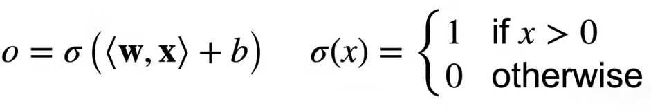

感知机就是：给定n个输入，给出一个单一输出（这个输出只能是0或1，只能做二分类）

其实就是给线性模型再套一个σ函数

### 1.1.2 XOR问题

XOR问题即异或，在一三象限是一类，二四象限是一类

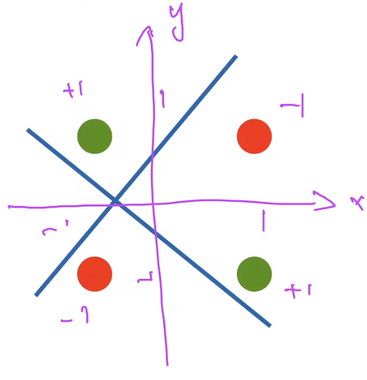

由于感知机只能做二分类，即只能在坐标系中画一条线。假如蓝色的线是感知机拟合出来的分类结果，可以看到不管哪条线都无法将两类全都分类成功

所以没有办法进行正确分类，不能拟合XOR函数

为了解决这个问题，可以使用多层感知机

## 1.2 多层感知机

### 1.2.1 学习XOR

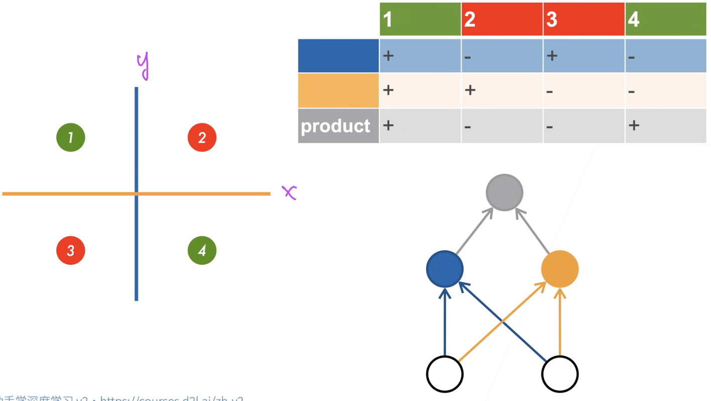

1. 先学习蓝色的那条线

   把1、3分类为负数，2、4分类为正数

2. 再学习黄色的那条线

   把1、2分类为正数，3、4分类为负数

3. 需要预测时，先将数据使用蓝黄分类器得到两个结果，再将这两个结果相乘得到的灰色输出即为最终结果

### 1.2.2 隐藏层

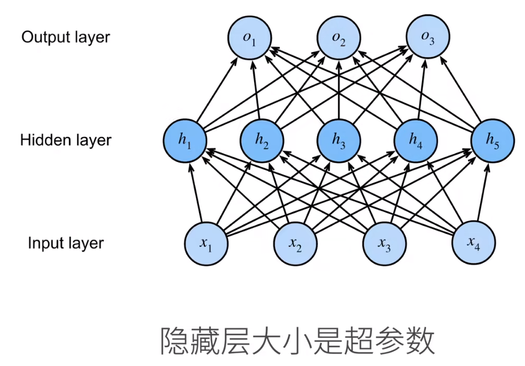

- 输入层 x 是一个n维向量

  比如图中 x为4维向量

- 隐藏层 W1 (m x n)， b1 为长度为 m 的向量

  比如图中为 （5 x 4），b1长度为5的向量

  这样`h = σ(<W1 · x>) + b1` 就得到 结果h（5 x 1）

- 输出层 w2（m x k），b2 为长度为k的向量

  比如图中为 w2（5 x 3），b2是长度为3的向量

  最后 `o = <w2.T · x> + b2`，得到结果o(3 x 1)，即为最后的输出

**σ是按元素的激活函数，注意这个函数一定不能是线性函数**

比如 `σ（x） = x`，这样会导致结果还是最简单的线性模型

### 1.2.3 多隐藏层


一般来说，对于多隐藏层都是从下层到上层维度依次减小，慢慢压缩慢慢收敛

## 1.3 激活函数

### 1.3.1 Sigmoid激活函数

将输出投影到（0，1）区间

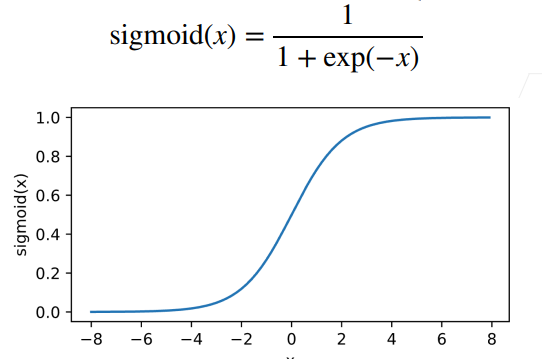

### 1.3.2 Tanh激活函数

将输入投影到（-1，1）区间

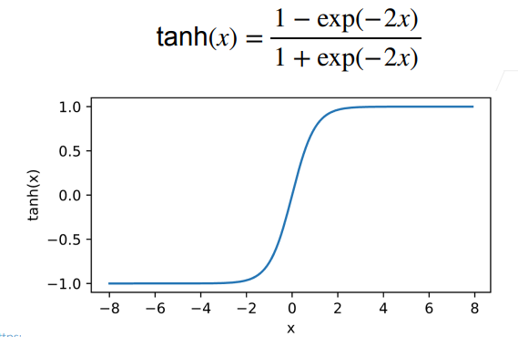

### 1.3.3 ReLU激活函数

ReLU：rectified linear unit

其实就是max函数 `ReLU(x) = max(x, 0)`

ReLU函数的优点在于简单，无需进行指数运算

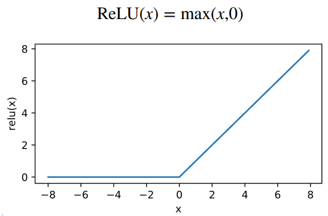

# 2. 模型超参数选择

## 2.1 过拟合 欠拟合

### 2.1.1 误差分类

**训练误差：** 

模型在训练数据集上的误差

相当于模拟考试的成绩

**泛化误差：**

模型在新数据上的误差

相当于未来真实考试的成绩

### 2.1.2 数据集划分

数据集一般分为

- 训练数据集——用于训练模型

  用来训练模型的数据集

- 验证数据集——用于调整超参数

  用来评估一个模型好坏。比如可以拿出50%的训练数据当作验证数据集

  训练出来的模型先放在验证数据集跑一遍看看效果，如果效果不好可以重新调整超参数之后重新训练

  **注意：**验证数据集一定不能和训练数据集混在一起，不然都是模型做过的原题没办法反应训练出模型的好坏。即使是这样，由于超参数是基于验证数据集调出来的，因此验证数据集的精度也会虚高

- 测试数据集——用于评估模型

  只用一次的数据集，跑完就是最终的结果

  不能用测试数据集来调整超参数，不然可能调出来一个只适应于该测试集的模型，换别的新数据效果又不好了，没办法反应模型真实精度

实际代码中，test_data用于代表测试数据集，但实际上是验证数据集

**K-折交叉验证** （k-fold cross-validation）

在没有足够多数据时采用这个办法

因为数据本来就不足，再拿出一半的数据拿来作为验证数据集有点浪费

算法：

- 将训练数据分割成K块
- For i = 1,...,k，使用第i块作为验证数据集，其余作为训练数据集
- 报告K个验证集误差的平均

一般K取5或10，这个方法每次都需要将数据跑K次

### 2.1.3 模型容量（过拟合欠拟合）

|                | 数据**简单** | 数据复杂 |
| :------------: | :----------: | :------: |
| 模型容量**低** |     正常     |  欠拟合  |
| 模型容量**高** |    过拟合    |   正常   |

**模型容量**

模型容量即模型复杂程度，拟合各种函数的能力

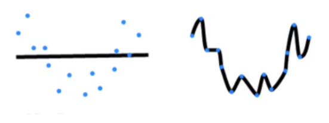

- 低容量模型（左侧）难以拟合训练数据

- 高容量模型（右侧）可以记住所有训练数据

  这样同时也记住了数据中的所有噪音，导致模型没有泛化能力

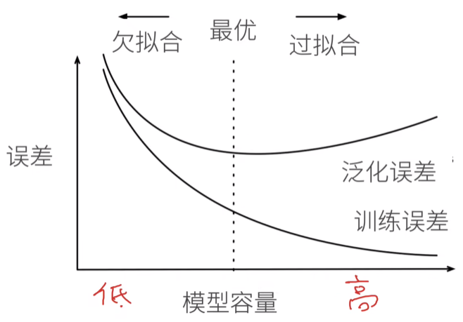

深度学习的模型选择思路：首先模型容量首先得足够复杂，足够拟合训练数据。在此基础上再采取手段控制模型容量，降低泛化误差。（适当过拟合是可以接受的）

**估计模型容量**

模型的种类

- 树模型（单层模型）
- 神经网络（多层感知机）

给定模型种类后

- 参数的个数
- 参数值的选择范围

## 2.2 权重衰退

用于降低模型复杂度，控制过拟合

通过控制参数w（权重）的取值范围来降低过拟合

### 2.2.1 硬性限制

强制将权重w的均方范数（即w中所有元素的平方和）限制为 θ，实际上是限制了w的取值范围

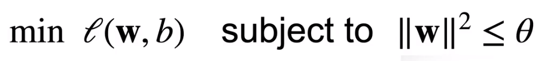

通常不限制偏移b，因为限不限制都不影响

θ越小意味着更强的正则项（即限制的越狠，这个参数越重要）

### 2.2.2 柔性限制

可以通过拉格朗日乘子法证明：对于每个θ，都可以找到λ使得上面的目标函数等价于下面

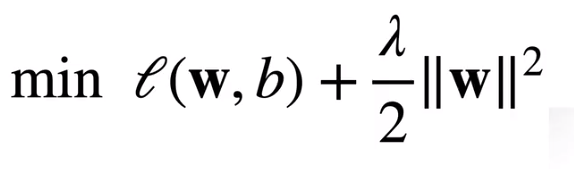

相当于在原有损失函数的基础上加入了一项，新加入的这项叫做罚（panelty），为了惩罚（限制）w，让它不会特别大

**超参数λ**

λ称为正则项权重，λ和之前的θ刚好成反比，通过增加λ可以降低模型复杂度

- λ=0：无作用，后面那项直接为0

  就相当与原来θ为正无穷

- λ=∞：相当与原来θ为0,即将所有的权重w都限制为0

### 2.2.3 如何影响最优解

**图像理解**

将损失函数加上后面的罚项之后，就相当于 两个函数求最优解（同时让损失函数和罚都取得较小值，从而使得二者的和，即新的损失函数最小）

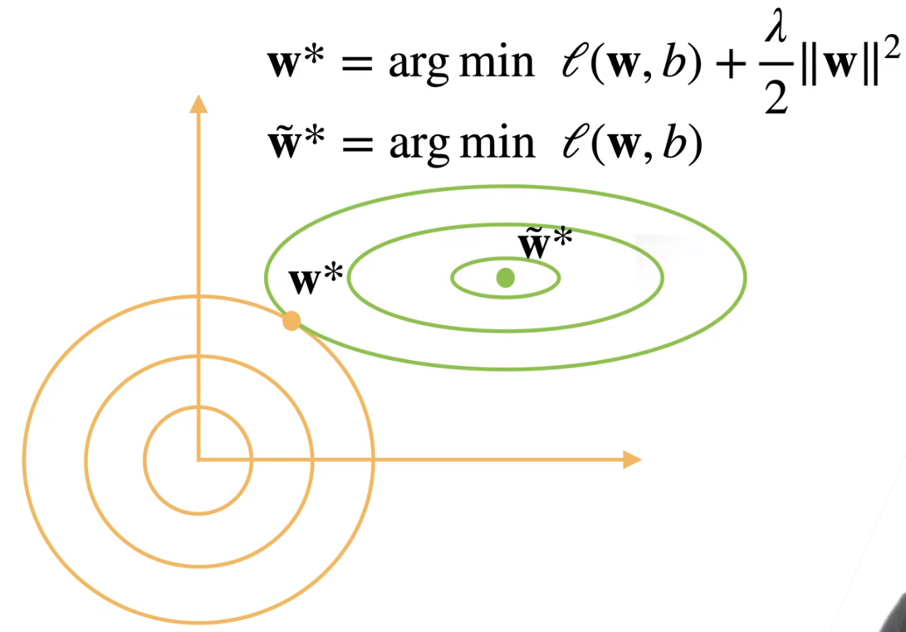

在上面的图中，绿色线表示原损失函数，黄色线表示罚。w×波浪线表示只有损失函数时的最优解，w×表示加上罚项之后的最优解。

可以看到有了罚项之后，一定会把最优解往靠近原点的地方拉，也就是说w的值会变小，从而模型复杂度变小，过拟合程度减小。

**公式理解**


依然使用原来梯度下降的公式，把新的损失函数 l  带进入，得到新的更新函数

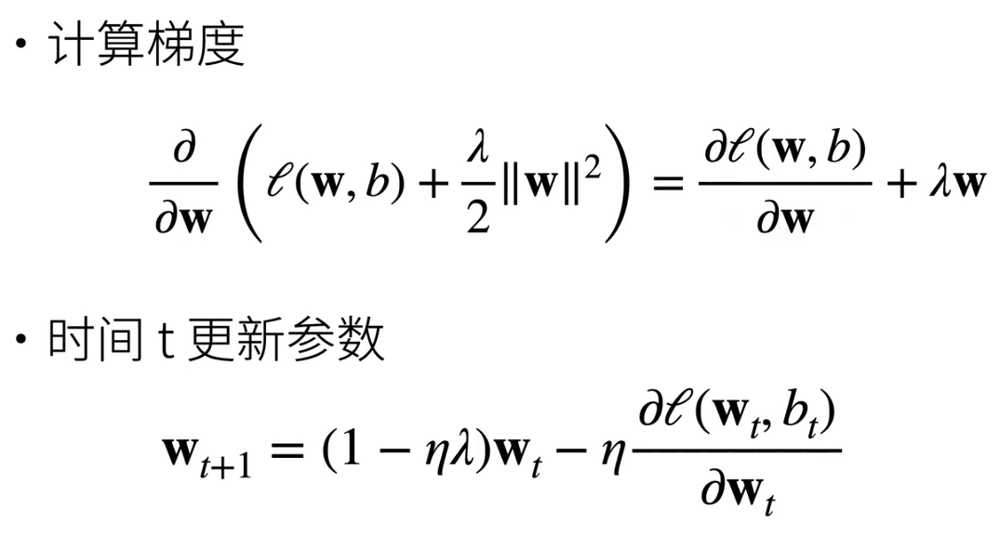

对于原来的梯度下降公式，会发现只是前面的wt多了一项。

即每次更新之前都会将wt先缩小，再沿着梯度反方向下降

通常ηλ<1 ，所以每次都是将wt放小，因此叫做权重衰退

### 2.2.4 代码实现

**从零实现：**

思路是在计算损失函数时后面加一个罚项

- 定义L2范数惩罚

  该函数中没有引入λ，做为超参数调用函数时乘在外面即可

  ```python
  def l2_penalty(w): # w是一个向量
      return torch.sum(w.pow(2)) / 2
  ```

- 训练过程

  ```python
  for epoch in range(num_epochs):
      for X, y in train_iter:
          l = loss(net(X), y) + lambd * l2_penalty(w) # 损失函数加上罚项
          l.sum().backward()
          optimizer([w, b], lr, batch_size)
  ```

**调库实现：**

思路是更新参数时，直接先将wt缩小为原来的(1 - ηλ)，这样还可以少计算一些梯度

```python
net = nn.Sequential(nn.Linear(num_inputs, 1))
loss = nn.MSELoss()

trainer = torch.optim.SGD([
    { # 指定参数w
        "params":net[0].weight,
    	'weight_decay':wd # wd即为λ，自己指定
    },
    { # 指定偏差b
        "params":net[0].bias
    }
    
],lr=lr)
```

