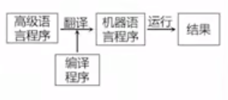
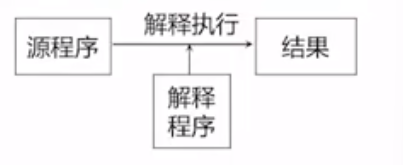
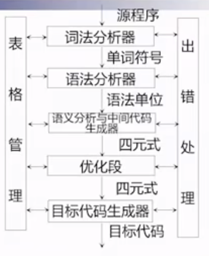
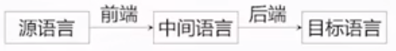

#  0. 解释运行代码的过程

## 1.1 souce ==> token stream

将源代码拆分成一堆token

例如：`std.io.putIn("Enter some integers:");`

可以拆分成：

- std
- .
- io
- .
- putIn
- (
- "Enter some integers:"
- )

## 1.2 tokens ==> abstract syntax tree（AST）

将tokens转化成statement sequence，使用递归下降解释器（recursive descent parser）

转化为抽象语法树，尽可能地保持原语法结构

如果读到一个花括号`{}`，就认为是一个 block statement(代码块)

比如处理一个for循环结构

```
for(init; cond; step)
	body
	
或

for(each key,value : init)
	body
```

读到`for(`，判断是一个for_complement

之后往下判断，看是不是each关键字，

不是的话就去读初始条件，可以有几种情况

- null-statement：不需要初始条件，后面直接跟分号

  比如`for(;;)`

- variable-definition：初始条件中定义了一个变量

  比如`for(int i = 0;;)`

- immutable-variable-definition：初始条件中定义了一个常量，比如用const修饰

  比如`for(const int i = 0;;)`

- expression-statement：初始条件直接是一个式子

  比如`for(i = 0;;)`

之后读结束条件cond

读反括号和循环体

## 1.3 abstract syntax tree ==> high-level intermediate representation

将tokens全部转化为AST后，可以直接将AST进行解释执行

也可以将AST变为线性的

比如将for循环转变为

```
{
	init;
	while(cond){
		body
		step
	}
}
```

# 1. 编译程序概要

## 1.1 编译程序

**翻译程序**：将一种语言转化成另一种语言的程序

**编译程序**：翻译程序的一种，特指把某一种高级程序等价地转换成另一种低级语言程序 的程序



编译程序运行的平台称为宿主机，编译后产生的目标代码运行在的机器称为目标机，通常情况下这两台机器是相同的

**解释程序**：把源语言写的源程序作为输入，但不产生目标程序，而是边解释边执行源程序本身。比如python，JVM（对中间语言做解释）



### 1.1.1 编译程序分类

- 诊断编译程序

  用于Debug，帮助程序员完成对程序正确性的检查

- 优化编译程序

  生成高校的目标代码

- 交叉编译程序

  宿主机和目标机不同

- 可变目标编译程序

  一个编译程序可以产生针对于不同目标平台的目标代码

## 1.1  编译过程

1. 词法分析

   类比：识别出句子的一个个单词

   定义：对源程序进行扫描和分解，依据**构词规则**识别出单词符号

2. 语法分析

   类比：分析句子的语法结构

   定义：在词法分析基础上，根据**语法规则**把单词符号串组成各类语法单位

   描述工具：上下文无关文法

   

3. 中间代码产生

   类比：根据句子的含义进行初步翻译

   定义：对各类语法单位按语言的**语义规则**进行初步翻译

   描述工具：属性文法

   语法分析后的句子翻译成四元式为：

   

   1. 将0.618和Y相乘 结果放入T1单元中去
   2. 将x和T1的值做加法 结果放入T2中
   3. 将T2的值放入z中

4. 优化

   类比：对译文进行修饰

   定义：依循程序的等价变换原则 对中间代码进行加工变换，以期在最后阶段产生更高效的目标代码。

5. 目标代码产生

   类比：写出最后的译文

   定义：把中间代码变换成 特定机器 上的目标代码。依赖于硬件系统结构和机器指令的含义

   目标代码三种形式：
   
   - 汇编指令代码：不能直接执行，需要进行汇编
   - 绝对指令代码：可直接运行，比如.exe文件
   - 可重新定位指令代码：需要链接，比如.obj文件

## 1.2  编译程序的结构

**编译程序总体框架**



1. 词法分析器
2. 语法分析器
3. 语义分析与中间代码生成器
4. 优化段
5. 目标代码生成器

还有两个重要模块

- 符号表管理（表格管理）

  符号名表（存放用户定义的符号信息）

  常数表、标号表、入口名表、过程引用表。。。

- 出错处理程序

  发现源程序中的错误，把有关错误信息报告给用户。而且报错之后要尽可能往下继续执行，以在一次编译中报出尽可能多的错误信息

## 1.3 一些概念

### 1.3.1 阶段和遍

**遍**：是对代码从头到尾扫描一次，这个代码可以是源程序也可以是源程序的任何中间表示

**阶段**：阶段就是之前说的编译过程中 词法分析阶段、语法分析阶段...

一遍可以由若干段组成（也就是说一次遍历可以完成多个阶段）

一个阶段也可以分若干遍来完成（也就是说一个阶段可能需要遍历多次才能完成）

大部分编译程序将 词法分析、语法分析、中间代码产生 三个阶段合成一遍来做：识别到一个单词先存起来，直到能组成一个语法单位，就组成一个语法单位存起来，再构成更大的语法单位。每得到一个语法单位都根据语义将对应的中间代码翻译出来。

优化阶段则需要遍历多次才能完成

### 1.3.2 编译前端与编译后端



- 编译前端：源语言到中间语言

  与源语言有关，如词法分析，语法分析，语义分析与中间代码产生 和 与机器无关的优化

- 编译后端：中间语言到目标语言

  与目标机有关，如与目标机有关的优化，目标代码的产生

# 2. 高级语言及其语法描述

## 2.1 程序设计语言的定义

程序语言的定义主要由语法和语义组成

### 2.1.1 语法

程序本质上是 一定字符集 上的字符串

语法是一组规则，依据这个规则可以形成和产生一个合式（well-formed）的程序

语法包括 词法规则 和 语法规则 两个部分

**词法规则**

词法规则规定了 *单词符号* 的形成规则，即怎么由字符组成单词

单词符号是语言中具有独立意义的最基本结构，包括：常数、标识符、基本字、算符、界符等

描述工具：有限自动机

**语法规则：**

规定了 *语法单位* 的形成规则，即如何由单词组成语法单位

语法单位包括：表达式、语句、分程序、过程、函数、程序等

描述工具：上下文无关文法

比如：语法规则中对一个算数表达式的定义

```
E代表一个算术表达式
E --> i   ——   一个算数表达式可以由一个标识符构成（i代表标识符，identify）
E --> E+E   ——   一个算数表达式可以由两个算数表达式通过 + 连接而成
E --> E*E  ——  一个算数表达式可以有两个算术表达式通过 * 连接而成
E --> (E)  ——  一个算术表达式套上括号依然是一个算术表达式

注意：这里只是描述语法规则，定义程序的形式结构。
如果把+读成加号，*读成乘号，这属于定义语法单位的意义，涉及到语义
```

### 2.1.2 语义

语义是一组规则，根据这组规则可以定义一个程序的意义（解释一个程序）

**语义的描述方法包括：**

- 自然语言描述：会产生二义性、隐藏错误和不完整性
- 形式描述：
  - 操作语义
  - 指称语义
  - 代数语义

### 2.1.3 语用

## 2.2 程序语言的语法描述

### 2.2.1 语法描述的几个基本概念

**文法：**描述语言的语法结构的 形式规则

**字母表：**一个有穷字符集，记为Σ

**字符：**字母表中的每个元素

**∑上的字（字符串）：** 由∑中的字符所构成的一个有穷序列

**空字：**不包含任何字符的序列，记为ε。空字也是一个字（字符串），只是长度为0

**Σ*：** 表示 由∑中的字符 组成的所有可能的字（字符串）的集合，包含空字

```
例如：∑={a,b}
则，∑*={ε,a,b,aa,bb,ab,aaa,bbb,aab,abb,bba,baa......}
有无穷多种可能的组合
```

**连接（积）**∑*的子集 U和V 的连接（积）定义为：从U和V中取出一个字（字符串）进行拼接，其中U中取出的放前面，V中取出的放后面，拼接得到的所有可能结果就是积的结果

```
设U={a,aa}，V={b,bb}
则UV={ab,abb,aab,aabb}
VU={ba,baa,bba,bbaa}
```

**V^n：**V自身的n次积，V^n=V V V V V.....V

**V^0:** V的零次方 = {ε}

**V*：** V的闭包，V*=V0∪V1∪V2......

**V+：**V的正规闭包（正则闭包），V+ = V V*

```
V*与V+的区别：如果V中原来没有空字，则V*中会有空字，而V+中没有空字
例如：V={a,aa}
则：V*={ε,a,aa,aaa,aaaa.......}
	V+ = {a,aa,aaa,aaaa......}
```

### 2.2.2 上下文无关文法

