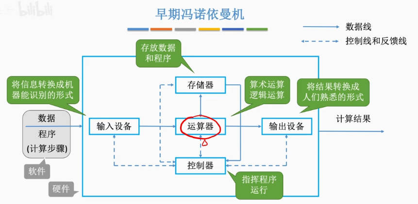

# 计算机组成原理

计算机硬件能识别的数据——二进制的 0/1

通过电信号来传递数据，用低/高电平分别表示0/1

硬件中的针脚就是用来接收或发送电信号的

通过主板上的印刷电路来传递二进制信息
***
# 计算机的发展
**计算机系统：** 由 硬件 和 软件组成
- 软件
  - 系统软件——用来管理整个计算机系统

    eg：操作系统、数据库管理系统、标准程序库、网络软件……
  - 应用软件——按任务需要编制成的各种程序

**硬件的发展：**
1. 第一代(1946~1957)：电子管时代
    
    第一台电子数字计算机：ENIAC(1946)

    by：冯诺依曼
    
    逻辑元件：电子管

    使用机器语言编程

    外存：用穿孔纸带

2. 第二代(1958~1964)：晶体管时代

    1947年，贝尔实验室发明了“晶体管”

    晶体管之父：威廉·肖克利

    逻辑元件：晶体管

    外存：磁带

3. 第三代(1964~1971)：中小规模集成电路时代

    逻辑元件：中小规模集成电路

    外存：磁带、磁盘

4. 第四代(1972~现在)：大规模、超大规模集成电路时代

    逻辑元件：大规模、超大规模集成电路

机器字长：计算机一次整数运算所能处理的二进制位数

摩尔定律：集成电路上可容纳的晶体管数目，约每隔18个月便会增加一倍，整体性能也将提升一倍

**软件的发展：**

软件都是编写出来的，所以也就是编程语言的发展

1. 机器语言、汇编语言

2. 高级编程语言

    FORTRAN、PASCAL、C++、Java

**目前发展趋势：**

两级分化
- 微型计算机

    向更微型化、网络化、高性能、多用途方向发展

- 巨型机

    向更巨型化、超高速、并行处理、智能化方向发展

***
# 计算机硬件的基本组成
## **早期冯诺依曼机：**

第一台计算机需要程序员手动接线来控制计算，即联机式命令接口(程序员说一句系统做一句)

冯诺依曼提出**存储程序**的概念
- 存储程序：将指令以二进制代码的形式事先输入计算机的主存储器，然后按其在存储器中的首地址执行程序的第一条指令，以后就按该程序的规定顺序执行其他指令，直至程序执行结束。



在计算机系统中，软件和硬件在逻辑上是等效的

即同一件事情既可以用软件实现也可以用硬件实现，软件简单但是效率低，硬件较复杂但是效率高

比如：对于乘法运算，可以设计一个专门的硬件电路实现乘法运算，也可以用软件的方式，执行多次加法运算来实现

冯·诺依曼计算机特点
- 计算机由五大部件组成
- 指令和数据以同等地位存于存储器，可按地址寻访
- 指令和数据用二进制表示
- 指令由操作码和地址码组成
  - 操作码：运算器要进行的操作，比如加、减、乘、除
  - 地址码：指令要操作的数据存在哪里
- 存储程序
- 以运算器为中心

    I/O设备与存储器之间的数据传送都要通过运算器完成

    这样的话导致效率降低，没必要都通过运算器进行中转

## **现代计算机：**


以存储器为中心

CPU=运算器+控制器

主机=CPU+主存储器(内存)

存储器 = 辅存(外存) + 主存

I/O设备 = 输入设备 + 输出设备 + 存储器中的辅存

硬件 = 主机 + I/O设备
***
***
# 各个硬件部分
## 主存储器

### 主要组成：
- 存储体

    用于存储数据

- MAR(Memory Address Register) 存储地址寄存器

    读：CPU将需要的数据的内存地址放在这里，主存储器根据这个内存地址去存储体相应位置找到数据

    写：CPU将想写入的目标地址放在这里

- MDR(Memory Data Register) 存储数据寄存器

    读：找到数据之后放在这里(写入MDR寄存器中)，等CPU读取

    写：CPU将想写入的数据内容放在这里

注：现在的计算机通常把MAR、MDR也集成在CPU内

### 存储体的基本组成：


- 存储元：存储二进制的电子原件，每个存储元可以存1bit，即一个二进制位，即存一个0或者一个1 。实际上是电容。
    
    这个概念不重要。
- 存储单元：编地址的基本单位，每个内存地址对应一个存储单元。每个存储单元存放一串二进制代码。
- 存储字(word)：存储单元里面存放的那一串二进制代码就叫存储字。
- 存储字长：存储单元中二进制代码的位数。也就是一个存储字的长度。

    这个根据操作系统不同而不同

    比如每个存储单元能放16位二进制数(存放16bit数据)，那存储字长就是16bit

    一个存储单元能放下32位，那存储字长就是32bit

### MAR的位数反映了存储单元的个数
- 因为MAR要存放CPU想读取或者写入数据的地址，那它一定能把所有的地址都表示出来。
    
    也就是说它能表示几个地址就说明存在几个地址，而一个地址对应一个存储单元。

- 比如说MAR有4位，那4个二进制位能表示2⁴个数据，也就是说一共有2⁴个地址。

### MDR的位数 = 存储字长
- 因为找数据是根据地址找的，那拿出来的数据肯定是以存储单元为单位拿出来的。

    也就是说每次MDR中放的都应该是一个存储单元

    假如每个存储单元可存放16bit，那把一个存储单元搬到MDR，MDR得能放下，所以MDR也是16个二进制位。

### 容易混淆：字节(Byte) 和 字(word)
- 字 是操作系统规定的，一个存储单元中存放的东西就叫一个字。

    如果一个存储单元能存放16位的二进制数，那 1个字 = 16bit

- 字节 是规定好的一个单位。1个字节 = 8bit。

    字节(Byte) 单位是B 1B = 1个字节 1b = 1个bit

    比如：百兆宽带 是 100M bps\
    但是下载东西的单位是 B\s \
    所以下载东西显示出来的最高速度应该是100M/8，也就是10+M
***
## **运算器：**

运算器是用来实现算术运算(如：加减乘除)、逻辑运算(如：与或非)

### 主要组成部分：
- ALU：算术逻辑单元

    通过内部复杂的电路实现算术运算、逻辑运算

    最复杂、最贵、最核心的东西

- ACC：累加器

    是一个寄存器

    用于存放操作数或运算结果

- MQ：乘商寄存器

    是一个寄存器

    在乘、除运算时，用于存放操作数或运算结果

- X：通用的操作数寄存器

    是一个寄存器

    用于存放操作数

    在一个运算器中可能有多个

***
### **控制器：**
- CU(Control Unit)：控制单元

    分析指令，给出控制信号(给其他元件比如运算器)

- IR(Instruction Register)：指令寄存器

    是一个寄存器

    存放当前执行的指令

- PC(Program Counter)：程序计数器

    是一个寄存器

    存放下一条指令地址，有自动+1功能

完成一条指令的过程：
1. 根据PC中记录的地址去主存中取出一条指令(PC自动+1)
2. 将取出的指令放在IR中
3. CU来分析指令，并根据指令给其他部件下达控制命令

***
**计算机执行一条代码的过程：**

- 代码：
    ```C++
    int a=2,b=3,c=1,y=0;
    void main(){
        y = a*b+c;
    }
    ```

- 转化为机器能理解的指令

    

- 主机结构：

    

- 执行过程
    1. 从控制器的PC中取出要执行的指令的地址——0号地址。取出后PC中的地址自动+1
    2. PC将这个地址放到MAR中(MAR=0)，同时CU告诉主存我这次是要读数据
    3. 主存从存储体中找到0号地址对应的字(二进制码)，并放入MDR中

        此时MDR=000001 0000000101

    4. MDR通过主板数据总线把这个数据放入IR中

        此时IR = 000001 0000000101

    5. 这个操作码会被分为操作码和地址码，前六位是操作码，后面是地址码。CU分析操作码得知：这是一个取数指令，要把地址码对应的数据放到ACC(累加器)中
    6. 将这个地址码送到MAR

        此时MAR = 5，即对应5号地址

    7. 主存在存储体中找到5号地址对应的字，并存入MDR中

        此时MDR = 0000000000000010 = 2

    8. 把MDR的数据送到ACC中

    第一条指令结束
***
***
# 计算机系统的层次结构


- 虚拟机器 M4 (高级语言机器)

    需要用编译程序翻译成汇编语言程序

    `y=a*b+c;`

- 虚拟机器 M3 (汇编语言机器)

    需要用汇编程序翻译成机器语言程序

    `LOAD 5` 在5号地址中取数\
    `MUL 6` 乘以6号地址中存放的数据\
    ......

- 虚拟机器 M2 (操作系统机器)

    向上提供“广义指令”，即系统调用

- 传统机器 M1 (用机器语言的机器)

    `000001 0000000101`前6位指令码代表取数操作，后面的地址码代表要从哪里取数\
    ......

- 微程序机器 M0 (微指令系统)

    为了执行取数操作，各个硬件又需要执行很多步骤

下层是上层的基础，上层是下层的扩展

**三种级别的语言**
- 机器语言：二进制代码
- 汇编语言：助记符

    需要汇编，成为机器语言
- 高级语言：C、C++、Java等

    - 需要编译，成为汇编语言

        编译程序：将高级语言编写的源代码一次全部翻译成机器语言程序，而后再执行机器语言程序(只需编译一次，生成一个.exe文件，之后就再也不用编译了)

    - 或者需要解释，直接解释为二进制代码

        将源程序的一条语句翻译成对应于机器语言的语句，并立即执行。紧接着再翻译下一句(每次执行都要翻译)

编译程序、汇编程序、解释程序可以统称为翻译程序
***
***
## 存储器的性能指标
### 主存储器指标：

MAR位数反映了存储单元最多有多少个

MDR位数反映了每个存储单元的大小

### 内存总容量 = MAR位数 * MDR位数

比如MAR有32位，MDR有8位，那内存就是2³²*8 bit = 2³²Byte = 4GB

1KB = 2¹⁰B = 1024B(yte)
1MB = 2²⁰B
1GB = 2³⁰B
1TB = 2⁴⁰B

### CPU指标：

- **CPU主频：** CPU内数字脉冲信号振荡的频率，单位Hz

- **CPU时钟周期：** 把每个脉冲信号的持续时间称为CPU时钟周期

    时钟周期 = 1 / CPU主频 单位为μs或ns

- **CPI**(Clock cycle Per Instruction) ：执行一条指令所需的时钟周期数

    同一个CPU对于不同的指令CPI也不同，甚至相同的指令CPU也可能有变化

    执行一条指令的耗时 = CPI × CPU时钟周期

- **IPS**(Instructions Per Second)：每秒执行多少条指令

    IPS = 主频 / 平均CPI

- **FLOPS**(Floating-point Operations Per Second)：每秒执行多少次浮点运算

    KFLOPS、MFLOPS、GFLOPS、TFLOPS (其中K、M、G、T为数量单位)

    K=Kilo=千=10³、M=Million=百万=10⁶、G=Giga=十亿=10⁹、T=Tera=万亿=10¹²

### 系统整体的性能指标：

- 数据通路带宽：数据总线一次所能并行传送信息的位数

    数据总线：各硬件部位通过数据总线传输数据

- 吞吐量：指系统在单位时间内处理请求的数量

    主要取决于主存的存取周期

    因为它取决于信息能多快地输入内存，CPU能多快地取指令，数据能多快地从内存取出或存入，以及所得结果能多快地从内存送给一台外部设备。这些步骤中的每一步都关系到主存

- 响应时间：指从用户向计算机发送一个请求，到系统对该请求做出响应并获得它所需要的结果的等待时间。

### 基准程序(跑分软件)：

基准程序是用来测量计算机处理速度的一种实用程序，以便于被测量的计算机性能可以与运行相同程序的其它计算机性能进行比较


